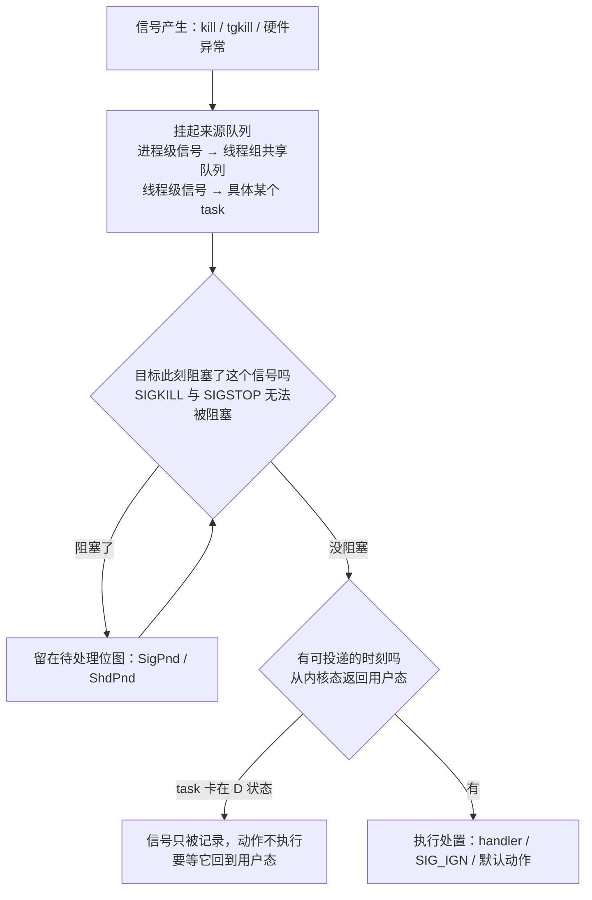

---
tags:
  - Linux
  - 进程
  - 信号
  - 优雅退出
  - 原理
created: 2026-09-21
---

# 信号与优雅退出

## 1. 为什么需要一种「不由发送方等待」的通知

进程之间需要互相通知：子进程退出了、终端断开了、父进程要你停、配置文件改了。这些事件有两个共同特征：**接收方不知道事件什么时候发生**，**发送方不想为此阻塞**。

如果只有同步原语（管道、消息队列），接收方就得专门分配一个执行流去阻塞等待，发送方则要处理「对方没在等」的情况。信号把这件事反过来做：**发送方只说「发生了某件事」，剩下的交给接收方自己决定**。代价是信号表达能力极弱——它几乎不携带内容。

信号只有三个信息维度：**哪个信号（编号/名字）**、**谁发的**（`siginfo` 里有发送者的 pid/uid，前提是接收方用带 `SA_SIGINFO` 的处理函数）、**发生了什么**（`si_code` 区分是内核发的还是用户发的）。除此之外没有自由载荷：`siginfo` 里另有几个由内核按场景填好的固定语义字段（`si_addr` 给 `SIGSEGV`/`SIGBUS`，`si_status`/`si_utime` 给 `SIGCHLD`，`si_band`/`si_fd` 给 `SIGIO`），真正能由发送方附带一个值的只有实时信号——`sigqueue` 的 `sigval`，handler 里从 `si_value` 取。标准信号甚至**不排队**：

如果一个信号已经在待处理（pending）状态，再来一个同号的**标准信号会被丢弃**，不会累积。

这条性质解释了一类经典困惑：连发三次 `SIGTERM`，进程只处理了一次——不是内核丢了前两个，而是它们在**同一个待处理位**上重合了。实时信号（`SIGRTMIN` 到 `SIGRTMAX`）才有排队语义，并且低编号先投递——但**应用看到的 `SIGRTMIN` 值被 C 库上调过**（glibc/NPTL 下是 34，不是 32），凡涉及实时信号编号都要走 `SIGRTMIN+n`，不要硬编码。

## 2. 收到信号只有三种选择

进程可以对每个信号独立选择处置方式：

| 处置 | 含义 | 谁受影响 |
| --- | --- | --- |
| 捕获（handler） | 装一个处理函数，信号到达时跳到它执行 | 进程级设置，但执行它的是某个 task |
| 忽略（`SIG_IGN`） | 明确表示不要这个信号 | 同上 |
| 默认动作（`SIG_DFL`） | 用内核规定的行为：终止、终止并产生 core、停止、继续、忽略 | — |

**处置是进程级（线程组级）的，而「哪个线程执行 handler」是不确定的**：内核在线程组里挑一个**没有屏蔽该信号**的线程。所以「停机逻辑跑在哪个线程上」没有保证——主线程、恰好空闲的工作线程都有可能。如果线程组里所有线程都屏蔽了某个信号，它会一直挂在待处理位图上等有人解除屏蔽。

每个 task 的 `/proc/<pid>/task/<tid>/status` 里有五张十六进制位图（`SigPnd`/`ShdPnd`/`SigBlk`/`SigIgn`/`SigCgt`），是排查「为什么它不响应」最直接的一手证据；同一个文件里的 `SigQ` 记的是「已排队信号数／`RLIMIT_SIGPENDING`」，**不是位图**：

| 行 | 含义 |
| --- | --- |
| `SigPnd` | 这个 task 私有的待处理信号位图 |
| `ShdPnd` | 整个线程组共享的待处理信号位图 |
| `SigBlk` | 被阻塞（屏蔽）的信号位图 |
| `SigIgn` | 当前处置为 `SIG_IGN` 的信号位图 |
| `SigCgt` | 装了处理函数的信号位图 |

位图是定宽并行的位：位 N 对应信号号 N + 1（也就是 `1 << N`），所以「同一个位」就是「同一个号」；判读顺序也落在同一个位上：

```text
  bit     :  15 14 13 12 11 10  9  8  7  6  5  4  3  2  1  0
  signal  :  16 15 14 13 12 11 10  9  8  7  6  5  4  3  2  1
  SIGTERM=15 -> bit 14    SIGKILL=9 -> bit 8    SIGINT=2 -> bit 1

  排查「对信号没反应」：以下每一步都只看同一个信号对应的那一位
    SigIgn = 1                       -> 处置是 SIG_IGN（可能继承自父进程）
    SigBlk = 1 & SigPnd/ShdPnd = 1   -> 信号到了，但被挡住
    SigCgt = 1                       -> 装了这个信号的 handler
    all = 0                          -> 走内核的默认动作
```

**`SigIgn` 里有位，只说明该信号此刻的处置是 `SIG_IGN`**——可能是进程自己选的，也可能是从父进程继承来的（`nohup`、被放到后台的作业都会留下这种继承）；在 `SigBlk` 里有位而 `SigPnd`/`ShdPnd` 里也有，说明信号已经到了但被挡住。

判断位图不用心算：`SigCgt` 的十六进制值可以直接和「1 << (信号号 - 1)」对照，也可以反过来用 `kill -l` 查信号名与编号。**脚本里一律用名字（`kill -TERM`）而不是编号**——编号不是跨架构常量（MIPS 上 7、10、12 号就与 x86 不同），靠后的实时信号编号还要经过 C 库调整，只有名字是稳定的。

## 3. 投递是异步的，而且可以延迟

「发出去了」和「已经生效」是两件事。信号从产生到被处理要走三步：

**第一步，选目标。** 进程级信号（`kill`/`SIGTERM` 发给整个线程组）挂在共享队列上，等到有线程可投递时再挑一个；线程级信号（`tgkill`、硬件异常）挂在具体 task 上。

**第二步，看是否放行。** `SIGKILL` 与 `SIGSTOP` 无法被阻塞；其余信号如果目标此刻处于阻塞状态，就只留在待处理位图上。

**第三步，等一个可投递的时刻。** 信号只在**从内核态返回用户态**的路径上被处理。一个 task 卡在内核态不可中断睡眠（`D` 状态）时，信号**只被记录，不会执行任何动作**——这就是「`kill -9` 杀不掉的进程」的本质：不是内核拒绝了 `kill`，而是没有可投递的时刻。

这三步连起来是一条路径，其中 `D` 状态就是走不到终点的那条支路：



由此得到两条判断纪律：

- **`kill` 命令返回成功，只说明信号送达了**，不说明进程处理了它，也不说明进程还在；
- **判断一个进程到底收到了什么，要看 `SigPnd`/`ShdPnd`/`SigBlk`/`SigIgn`/`SigCgt` 这五张位图**，不要靠 `kill` 的返回值推断。

内核自 2.6.25 起引入的 `TASK_KILLABLE` 是这条规则的一个例外：它同样是不可中断睡眠，但**能被致命信号打断**（典型用在某些网络文件系统的等待路径上）。它是 `TASK_UNINTERRUPTIBLE` 与 `TASK_WAKEKILL` 的组合标志（定义在内核源码 `include/linux/sched.h`，唤醒路径见 `kernel/signal.c` 的 `signal_wake_up_state()`——没有 man 页覆盖它，按目标内核版本取源码），**在 `ps` 与 `/proc` 里始终显示为 `D`**——内核的状态字母表里没有 `K`，不要去找所谓「K 状态」。所以「`D` 一定杀不掉」只说对了一半，判据要看**它在等什么**，也就是 `wchan` 与内核栈，而不是状态字母。

## 4. 为什么 `SIGKILL` 与 `SIGSTOP` 必须不可捕获

这两个信号的特殊地位不是权限设计，而是**机制上的必需**。

**`SIGKILL` 是内核的最后手段。** 内存回收不动、需要丢弃一个进程来保住整机时，内核必须有一条不依赖对方配合的路径。如果进程能捕获或忽略 `SIGKILL`，那么一个失控的进程就可以拒绝死亡，内核将失去最后的控制权。

**`SIGSTOP` 是调试与作业控制的基元。** 调试器要能无条件冻住被调试进程（`SIGSTOP` 不可捕获，`SIGTSTP` 可以——这正是 `Ctrl+Z` 与调试器用不同信号的原因）。

由「不可捕获」推出两条硬结论：

**`SIGKILL` 没有收尾机会。** 进程不会执行任何清理代码：文件锁不显式释放、临时文件残留、在途请求被丢弃、缓冲区未落盘。它的保证只有一条——**进程消失**。

**`SIGKILL` 也杀不掉两种东西，原因完全不同**：

| 现象 | 原因 | 该处理谁 |
| --- | --- | --- |
| `D` 状态的进程 | 信号没有可投递的时刻（等它回到用户态） | 它等待的资源（IO、网络存储、内核锁） |
| 僵尸（`Z`）进程 | 它**已经终止了**，剩下的是一个待回收的退出状态 | 它的父进程（要求 `wait()`） |

## 5. PID 1 受内核特殊保护

内核对 PID 1 **不执行信号的默认动作**：凡是 PID 1 没有安装处理函数的信号，一律被忽略；对**全局 init**（宿主自己的 PID 1）来说，连 `SIGKILL`/`SIGSTOP` 也在**投递前就被丢弃**，所以 `kill -9 1`、`kill -STOP 1` 都返回成功却什么也不会发生——这不是权限问题，用户态看到的只有「命令成功返回」。唯一的例外是**命名空间 init**：容器里的 PID 1 收到**祖先 namespace**（宿主相对容器）发来的 `SIGKILL`/`SIGSTOP` 会被**强制投递并生效**，容器停止的「最后一刀」靠的就是这一条。

这条保护的用意很清楚：PID 1 是整棵进程树的根、是所有孤儿的收养者、是服务管理器的本体。如果一条 `SIGKILL` 就能把它带走，系统会进入无人接管的不可恢复状态（内核会因为「init 死了」而 panic）。

它带来的后果分两个环境，走向完全不同：

- **主机上**：这是正确且必要的保护。要重启 init 系统，用 `systemctl reboot` / `systemctl daemon-reexec`，不要试图杀 PID 1；
- **容器里**：同一套内核规则会变成事故来源。容器里的 PID 1 在**自己这个 namespace 内**同样受到保护，所以**一个没为 `SIGTERM` 安装处理函数的容器 PID 1（比如 `bash`）会让 `SIGTERM` 等于被忽略**——停止请求送达了、被忽略了、没人处理，只能等到超时后由宿主侧补一发 `SIGKILL`；这一发来自祖先 namespace，属于上面那条例外，所以它一定生效。这就是「容器 `stop` 必然等满超时、退出码 137」的机制。

需要分清两种 PID 1：**全局 init 对 `SIGKILL`/`SIGSTOP` 不是「收不到」，而是信号在投递前就被内核丢弃**（命令成功、动作不发生）；**命名空间 init 面对祖先 namespace 发来的 `SIGKILL`/`SIGSTOP` 则会被强制投递并生效**——判断一发致命信号会不会落地，先看你站在哪个 namespace 里发。对运维的结论是一样的：**不要试图对 PID 1 发致命信号**。

## 6. 「优雅退出」到底指什么

「优雅」这个词容易被说成一种态度，其实它是一组**可验收的性质**。一个服务能被温柔地停下来，需要四件事同时成立：

| 性质 | 具体含义 | 怎么验收 |
| --- | --- | --- |
| **信号被处理** | 应用为 `SIGTERM` 安装了处理函数，并走完「停止接收新请求 → 处理在途 → 释放锁与连接 → 刷新缓冲 → 退出」 | 应用日志里有停机记录；进程的 `SigCgt` 位图里包含 `TERM` |
| **退出时间有上界** | 收尾耗时小于服务管理器给的等待上限 | 取 `systemctl show -p TimeoutStopUSec` 的现场值（微秒）与实测停机耗时对比；该属性的定义页是 `man 5 systemd.service` 的 `TimeoutStopSec=`（`man 5 systemd.kill` 只讲 `KillMode=`/`KillSignal=` 这些），默认值由 `DefaultTimeoutStopSec=` 决定，系统与用户管理器都是 90 s（`man 5 systemd-system.conf`） |
| **范围覆盖整组** | 停止动作打到该服务的**所有**进程，而不只是主进程 | 用 `systemctl show -p KillMode <unit>` 取**该 unit 的现场值**（默认 `control-group` 会停止整个 cgroup，但 Ubuntu 的 `ssh.service`/`cron.service` 就显式设成了 `process`）；再用 `systemctl status` 的 `Tasks:` 与残留进程验证 |
| **重载走专门通道** | 配置变更不重启进程，用 `SIGHUP` 或服务管理器定义的重载动作 | 重载前后主进程 ID 不变 |

缺任何一条，「优雅」就退化成一个说法：

- 缺第一条 → 每次停止都等满超时再被强杀，等于每次都在做 `SIGKILL`；
- 缺第二条 → 应用收尾要 60 秒而超时是 30 秒，收尾永远走不完；
- 缺第三条 → 主进程停了，worker 变孤儿继续占端口，下次启动报「端口被占用」；
- 缺第四条 → 每次改配置都要断连接，重载退化成重启。

**`SIGHUP` 是约定，不是机制。** 它的默认动作是终止进程；「用它重载配置」纯粹是历史上守护进程形成的惯例（终端断开也发 `SIGHUP`，而守护进程没有终端，于是这个信号被挪作他用）。所以**对一个没有实现重载的程序发 `SIGHUP`，等于杀死它**。判断某个服务是否支持重载，看的是它自己的文档与 `ExecReload=` 的定义，不是信号表。

## 7. 该用哪个信号：一张判断表

| 目的 | 信号 | 依据 |
| --- | --- | --- |
| 请求正常停止 | `SIGTERM`（15） | 可捕获、可清理；一切「想让它自己收尾」的场景 |
| 交互式中断 | `SIGINT`（2） | `Ctrl+C`；与 `SIGTERM` 的区别只是来源 |
| 重新读配置 / 重开日志 | `SIGHUP`（1），或应用自定义的 `SIGUSR1`/`SIGUSR2` | **必须先确认程序实现了它**；未实现时 `SIGHUP` 会终止进程 |
| 冻住进程、稍后继续 | `SIGSTOP`（19）/ `SIGCONT`（18） | 调试与作业控制；`SIGSTOP` 不可捕获 |
| 要求输出诊断信息 | `SIGQUIT`（3） | 部分运行时会输出线程栈后终止；注意它的默认动作**包含 core** |
| 最后手段 | `SIGKILL`（9） | 见下 |

`SIGKILL` 是最后手段，判断「现在能不能用它」只要问三个问题：

1. **这个进程有没有在途数据？**（未落盘的事务、写了一半的文件、未提交的消息偏移）
2. **它有没有持锁？**（锁会随进程释放，但**中间状态不会回滚**，别的进程可能读到不一致的数据）
3. **它停下之后有没有别人接力？**（有没有副本在服务、有没有重试机制、有没有健康检查会拉起它）

三个都是「没有」，`SIGKILL` 的代价才可接受。任何一个「有」，正确的动作都是先想办法让它自己收尾，或者先摘流量、再决定。

## 8. 抽象在哪里漏水

**信号不排队，因此不能用它计数。** 「发一个信号增加一次计数」这类设计在标准信号上不成立（会丢）。要计数就用别的机制（文件、管道、实时信号）。

**信号不携带状态，因此不能靠它传递信息。** 唯一能附带一个值的是实时信号——`sigqueue` 带过去的 `sigval` 只是一个整数或指针，不是一段状态。想让子进程知道「为什么被叫停」，只能靠预先约定的配置文件、环境变量或共享内存。

**处置是进程级的，执行是线程级的，所以停机逻辑的位置不可控。** 需要「某个特定线程做收尾」时，工程上有三条路：让那个线程自己装 handler；让所有其它线程屏蔽该信号；或者启动时把全部线程都屏蔽掉，再由一个专门线程用 `sigwait`（`man 3 sigwait`）或 `signalfd`（`man 2 signalfd`）同步地把信号取出来处理。共同点是不要假设内核会挑主线程。

**`SIGKILL` 保证「消失」，不保证「清理」。** 内核会收走**它自己持有的那部分**：`fcntl` 记录锁与 `flock` 随进程终止释放，fd（含监听套接字）被关闭，监听端口随之空出。真正留下来的是**不随进程消失的东西**——System V/POSIX 共享内存段（要显式删除）、临时文件、已建立连接的 `TIME_WAIT`。另有一种属**停止范围**问题：孤儿子进程继承了 fd，锁与端口会被它继续占着。

**信号是「软」的，不能用来做同步。** 发送方无法知道接收方什么时候处理（信号可能被阻塞、可能卡在内核态），所以「发完信号立刻检查结果」这种模式必然出竞态。

## 常见误解

| 常见说法 | 事实 |
| --- | --- |
| 「`kill` 返回成功说明进程已经处理了信号」 | 只说明信号送达。它可能被阻塞、被忽略，或者卡在 `D` 状态等不到投递时刻 |
| 「连发几次 `SIGTERM` 总有一次会生效」 | 标准信号不排队；在待处理状态下重复到达会被丢弃 |
| 「信号是发给进程的，所以处理它的就是主线程」 | 处置是进程级的，执行 handler 的线程由内核在未屏蔽该信号的 task 中挑选 |
| 「`SIGKILL` 一定能杀掉任何进程」 | `D` 状态的进程等不到投递时刻；僵尸已经终止，没有可杀的对象 |
| 「`D` 状态的进程是内核拒绝执行 `kill`」 | 信号已被记录，只是没有从内核态返回用户态的时刻；`TASK_KILLABLE` 还能被致命信号打断，但外观仍是 `D` |
| 「`kill -9 1` 是权限不够」 | 内核对 PID 1 不执行信号默认动作：全局 init 的 `SIGKILL`/`SIGSTOP` 在投递前就被丢弃，命令返回成功却什么也不会发生；这是保护，不是权限 |
| 「容器里也这样保护 PID 1，所以没什么影响」 | 影响很大：容器 PID 1 忽略 `SIGTERM` 会让每次停止都走满超时 |
| 「用 `SIGHUP` 让服务重载配置是内核规定」 | 那是守护进程的惯例；`SIGHUP` 的默认动作是终止，对未实现重载的程序等于杀 |
| 「`SIGKILL` 之后进程就干净了」 | 只保证进程消失：内核会收回它持有的锁与 fd（监听端口随之空出），但共享内存段、临时文件、`TIME_WAIT` 不随进程消失，被孤儿子进程继承的 fd 还会继续占着锁与端口 |
| 「停机超时调大就能解决停不掉」 | 超时是兜底；停不掉的根因是应用没处理信号或停止范围没覆盖整组 |

## 要点自测

**问：为什么 `SIGKILL` 必须不可捕获？它的保证到底覆盖了什么？**
答：内核需要一条不依赖对方配合的终止路径，否则失控进程可以拒绝死亡。它保证的只有「进程消失」——不保证清理、不保证数据一致。

**问：一个进程卡在 `D` 状态，你连续发了三次 `kill -9`。描述一下内核眼里发生了什么。**
答：三次都成功送达（`kill` 返回 0），信号进入该 task 的待处理位图；因为 task 在内核态不可中断睡眠，没有从内核态返回用户态的投递时刻，所以没有任何动作被执行。等它回到用户态（或该等待路径属于 `TASK_KILLABLE` 且被致命信号打断）时才会生效。

**问：为什么容器里的 PID 1 是 `bash` 时，`docker stop` 会走满超时？**
答：内核对 PID 1 不执行信号默认动作，而 `bash` 默认没为 `SIGTERM` 安装处理函数，于是 `SIGTERM` 等于被忽略；只能等超时后由宿主侧补 `SIGKILL`（退出码 137）。

**问：`/proc/<pid>/status` 的五张信号位图各自回答什么问题？**
答：`SigPnd`/`ShdPnd` 回答「信号到了没有」（私有队列与线程组共享队列），`SigBlk` 回答「是不是被挡住了」，`SigIgn` 回答「它此刻的处置是不是 `SIG_IGN`」，`SigCgt` 回答「装了处理函数的有哪些」。排查「为什么不响应」时按 `SigIgn` → `SigBlk` → `SigCgt` 的顺序看。

**问：一次「可验收的优雅停机」需要哪四件事？各缺一件会怎样？**
答：应用处理 `SIGTERM`、停机耗时小于等待上限、停止范围覆盖整个进程组、重载走专门通道。缺第一件等于每次都在强杀；缺第二件收尾永远走不完；缺第三件会留下孤儿继续占端口；缺第四件重载退化成重启。

**第一反应不要做什么**：不要用 `kill` 的返回值判断信号是否生效；不要对 `D` 状态进程反复补刀；不要用编号写脚本；不要以为 `SIGHUP` 天然是重载；不要把 `SIGKILL` 当成「先试试看」的常规动作。

## 参考文档

- `man 7 signal`：信号列表、默认动作、可捕获与可阻塞的规则、「处置属进程级、掩码属线程级」的定义，以及各信号的版本注记。
- `man 2 kill`、`man 2 tgkill`、`man 2 sigaction`、`man 2 sigprocmask`、`man 3 sigqueue`、`man 3 sigwait`、`man 2 signalfd`：发送、处置、屏蔽、实时信号排队与同步取信号。
- `man 7 pid_namespaces`：PID 1 的两种身份，以及「祖先 namespace 发来的 `SIGKILL`/`SIGSTOP` 强制投递」这条例外。
- `man 5 proc_pid_status`：`/proc/<pid>/status` 的 `SigQ`/`SigPnd`/`ShdPnd`/`SigBlk`/`SigIgn`/`SigCgt` 字段的出处；`man 5 proc_pid_task` 与 `man 5 proc`：`/proc/<pid>/task/<tid>/` 的组织方式（`man 5 proc` 自 man-pages 6.7 起只作 proc 文件系统总览，字段定义看各 `proc_pid_*` 子页）。
- `man 5 core`：带 core 动作的信号清单与 `core_pattern`；`man 2 wait`：子进程退出状态与父进程的回收责任。
- 内核文档 `Documentation/admin-guide/sysctl/kernel.rst`：`kernel.hung_task_timeout_secs`——task 处于不可中断睡眠超过这个秒数，内核就打一条 hung task 告警（要不要连带 panic 由 `kernel.hung_task_panic` 决定），是 `D` 状态排查的配套参数。
- `man 5 systemd.kill`：`KillMode=`/`KillSignal=`/`SendSIGKILL=` 的语义；`TimeoutStopSec=` 与 `ExecReload=` 的定义页是 `man 5 systemd.service`，它们的默认值来自 `man 5 systemd-system.conf` 的 `Default*=`（**默认值现场取**，随 systemd 版本与发行版变化）。
- 本节引用的 man 页与内核文档按**与目标机器同一主版本（当前基线 6.x）**取；路径与语义在版本间会变，所以凡涉及默认值与版本门控，以现场 `man`、`sysctl`、`systemctl show` 的实际输出为准。

上一篇：进程的诞生：fork 与 exec ｜ 下一篇：资源的边界
