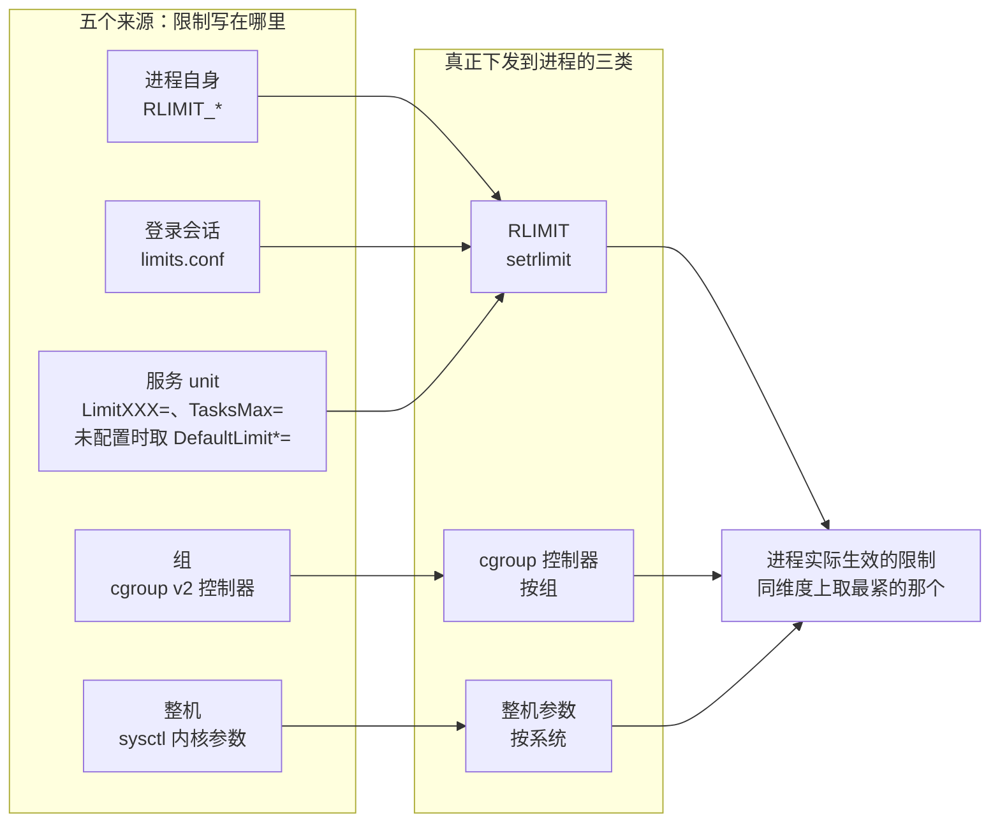

---
tags:
  - Linux
  - 进程
  - 资源限制
  - rlimit
  - cgroup
  - 原理
created: 2026-09-21
---

# 资源的边界

## 1. 没有边界会怎样

一个进程能消耗的东西，内核几乎都没给它设默认上限。这不是疏忽，而是 Unix 一贯的取舍：**资源分配按需进行，失败由申请方承担**。于是「有边界」这件事必须有人显式地加上去，否则会出现三种后果：

**故障域会失控。** 一个服务把进程表、句柄表或内存吃光，同机所有服务一起受影响。原本「一个服务不可用」的局部问题，被放大成「一台机器不可用」。这是运维视角下最贵的一种失败模式，也是限制线首先是**可用性手段**的原因。

**退化会变成悬崖。** 没有边界的系统不会「慢慢变慢」——它会一直正常，然后在某个瞬间突然申请失败。失败点不可预测，容量规划也就无从谈起。有了边界，撞墙的位置和方式都是已知的。

**资源会被安静地占用。** 一个缓慢泄漏句柄的服务可以跑上几周都看不出异常，直到某天开始偶发失败。有了水位上限并配上监控，「贴近上限」这个信号会提前很久出现。

## 2. 资源的三种性质，决定了它们该被限制在哪一层

内核里的资源按性质分三类，这决定了限制只能用哪种形式表达：

| 性质 | 例子 | 限制的表达方式 |
| --- | --- | --- |
| **计数型** | 任务的个数、打开的文件数、映射区域数、信号队列深度 | 直接给一个数：超过就失败，返回 `EAGAIN` |
| **速率型** | CPU 时间、块设备带宽与 IOPS | 给一个**时间窗口内的额度**：超过就被限速或延后 |
| **容量型** | 物理内存、虚拟地址空间、栈 | 给一个**池子的大小**：超过就失败、回收或被终止 |

计数型与容量型撞上之后是**失败**（申请返回错误），速率型撞上之后是**变慢**（被节流）。这条区别在排障时非常关键：同样叫「资源不够」，一个表现为报错，一个表现为延迟，两者的证据位置完全不同。

## 3. 五层结构：限制为什么会分散在这么多地方

同一个量（例如「最多能打开多少文件」）在 Linux 上可以有五个来源。这不是历史包袱，而是因为**内核没有「服务」这个概念**——它只认识进程和进程组，无法知道「这一组进程属于同一个业务」。于是边界只能由每一层各自加上，分工如下：

| 层 | 载体 | 作用范围 | 谁负责 | 生命周期 |
| --- | --- | --- | --- | --- |
| 进程自身 | `RLIMIT_*`（`setrlimit(2)`；shell 前端是 `ulimit`） | 单个进程（子进程继承） | 程序自己或启动它的父进程 | 随进程 |
| 登录会话 | `/etc/security/limits.conf` 与 `limits.d/*.conf`（经 PAM 的 `pam_limits` 模块） | 由 PAM 建立的登录会话及其后代 | 系统管理员 | 随会话 |
| 服务 | systemd unit 属性 `LimitXXX=`、`TasksMax=` | 该服务拉起的全部进程 | 服务负责人 | 随单元 |
| 组 | cgroup v2 控制器（`pids`/`memory`/`cpu`/`io`/`cpuset`） | 整组进程 | 编排层或服务管理器 | 随组存在 |
| 整机 | 内核参数（`sysctl`） | 全系统 | 系统管理员 | 随开机与配置文件 |

**这五层是同类上限的五个来源，不是五个执法层。** 真正把限制落到进程身上的只有三类：内核给单个进程的 `RLIMIT`（`man 2 setrlimit`）、cgroup 控制器（按组）、整机 `sysctl`（按系统）；`limits.conf` 与 unit 的 `LimitXXX=` 都只是**写 `RLIMIT` 的途径**——`pam_limits` 在登录会话里代写，systemd 在单元启动时代写，而 unit 没有显式配置 `LimitXXX=` 时，取的是 `DefaultLimit*=` 的默认值（`man 5 systemd.exec`），也就是**后者覆盖前者**。所以一个值在多处出现时，实际生效的仍是**最紧的那个**——但「最紧」是就同一维度而言；各来源的维度不同（按进程、按会话、按用户、按组、按整机），所以经常出现「整机还很空，但某个服务已经撞墙」的情况。

五个来源与三条真正下发路径的关系：

两条最常被误判的规则：

**`limits.conf` 对 systemd 服务无效。** 它的生效方式是 PAM 在**建立登录会话时**调用 `pam_limits` 应用配置。而 systemd 启动服务时直接 `fork` + `exec`，默认不建立 PAM 会话，它按自己的一套规则设置限制（unit 的 `LimitXXX=`，未配置时取 `DefaultLimit*=`）。所以往 `limits.conf` 里写 `nofile 65535` 再重启服务，进程侧不会有任何变化。唯一的例外是 unit 显式设了 `PAMName=`：这时 systemd 会为这个单元建立 PAM 会话，`pam_limits` 照常生效（本机的 `user@.service` 即是这样，用户级服务的限制就是经 PAM 继承进去的）。但常规系统服务不该靠这条路——`limits.conf` 解决的是「人登录进来跑命令」的限额，服务和容器都不归它管。

**`su`/`sudo` 是否应用 `pam_limits` 取决于发行版的 PAM 配置**，不要靠记忆下结论，要用实际生效值核对。

## 4. 进程自身：`RLIMIT` 的软硬限制

`RLIMIT` 是内核给单个进程设的边界，每一项有**软限制**与**硬限制**两个值：

- **软限制**是当前生效值；
- **硬限制**是软限制能达到的上限，也是无特权进程不能上调的那条线。

这个设计的用意是让程序可以「临时放宽自己」（在软硬之间浮动），但不能越过管理员设的天花板。它有一个人为的陷阱：**把硬限制调低是不可逆的**——但这个「不可逆」有精确条件，说的是**在初始 user namespace 内不持有 `CAP_SYS_RESOURCE`** 的进程；持该特权的进程可以用 `prlimit` 把它改回来，不必重启。反过来说，程序自己一旦调低又交不出特权，这个进程就再也升不回去，只能重启——对服务来说，这等于一次中断，所以「临时限制一下」这种想法在硬限制上要格外小心。

常用的几项及其撞上之后的表现：

| 限制项 | shell 前端 | 撞上之后 |
| --- | --- | --- |
| `RLIMIT_NOFILE` | `ulimit -n` | `open` 返回 `EMFILE`，应用报「打开文件过多」 |
| `RLIMIT_NPROC` | `ulimit -u` | `fork` 返回 `EAGAIN`——同一个失败码有四类触发点：本项、`kernel.threads-max`、`kernel.pid_max`、cgroup 的 `pids.max`（`man 2 fork`） |
| `RLIMIT_AS` | `ulimit -v` | `mmap`/`brk` 返回 `ENOMEM`（地址空间不足，与物理内存是否充足无关）；**自动栈扩展也会因它失败而 `SIGSEGV`** |
| `RLIMIT_DATA` | `ulimit -d` | `brk` 堆扩展失败，返回 `ENOMEM`；**自 4.7 起也约束 `mmap`** |
| `RLIMIT_STACK` | `ulimit -s` | 超出栈边界触发 `SIGSEGV`（**不是** `ENOMEM`） |
| `RLIMIT_CORE` | `ulimit -c` | 为 0 时不产生 core，崩溃只留日志；且**崩溃转储被管道收集时这项限制不生效**（`man 5 core`） |
| `RLIMIT_MEMLOCK` | `ulimit -l` | 锁定内存失败；影响 `mlock`、部分 RDMA 与 eBPF 场景 |
| `RLIMIT_FSIZE` | `ulimit -f` | 写超限触发 `SIGXFSZ`（默认终止进程）；捕获该信号后系统调用返回 `EFBIG`，且一次跨越上限的 `write` 可能只写进上限以内的部分——**文件不会被截断，已超限的文件也不会缩小** |
| `RLIMIT_SIGPENDING` | — | 排队信号数超限，`sigqueue` 返回 `EAGAIN`（只有 `sigqueue` 受它约束，且额度按 real UID 共享） |

**`RLIMIT_NPROC` 按 real UID 计数**，这是它最容易误判的地方。一台机器上多个服务如果用同一个用户运行，它们**共享同一份额度**，互相抢——而且它只统计该 UID 名下的 task 数（含线程），**内核线程跑在 uid 0 下、不计入普通用户配额**。真正要记的是：**持相关特权时这条限制不是被放宽，而是完全不执行**（`man 2 setrlimit`，连 real UID 为 0 的进程也在豁免范围内），所以在以 root 运行的容器里，`fork` 失败几乎总是别的层造成的。

**`RLIMIT_AS` 限制的是虚拟地址空间，不是物理内存。** 一个进程可以因为地址空间上限而申请失败，同时整机内存非常充裕；反过来，它也可能在地址空间远未触顶时被内存压力杀掉。这两个量属于不同的账本，混用会得出相反结论。

## 5. 组的边界：cgroup v2

cgroup 是唯一能表达「这一组进程共享一个额度」的机制，也是容器与 systemd 的资源边界所在。cgroup v2 的形式很有特点：**整个层级树是一棵，控制器作为可读写的文件挂在各节点上**，父节点通过 `cgroup.subtree_control` 把控制器**委派**给子树。

控制器按资源分类，与进程主题最相关的五个：

| 控制器 | 关键接口文件 | 限制的性质 |
| --- | --- | --- |
| `pids` | `pids.max`、`pids.current`、`pids.events` | 计数型：组内 task 数上限 |
| `memory` | `memory.max`（硬）、`memory.high`（软）、`memory.current`、`memory.peak`、`memory.events` | 容量型：撞硬上限触发该组的 OOM |
| `cpu` | `cpu.max`（配额）、`cpu.weight`（权重） | 速率型：配额是硬顶，权重是相对分配 |
| `io` | `io.max`、`io.weight` | 速率型：块设备的带宽与 IOPS |
| `cpuset` | `cpuset.cpus`、`cpuset.mems` | 位置型：限定可用 CPU 与 NUMA 节点 |

三条与运维判断直接相关的性质：

**计数与速率的行为不同。** `pids.max` 撞上之后 `fork` 直接失败（`EAGAIN`），内核只打第一条日志、此后静默，要计数只能读 `pids.events` 的 `max`；`cpu.max` 撞上只是被限速（表现为延迟上升，不报错）。所以「容器起不了新进程」和「容器变慢」要用完全不同的证据链。

**所有计数都是累积值。** `pids.events`、`memory.events` 里的数字回答的是「**该 cgroup 创建以来**发生过多少次」——组被销毁、服务重启重建后归零，判断「这次故障是不是它干的」必须用**两次读数的差值**。另有一个口径要注意：`memory.events` 默认是**层级累计**（含全部后代），只看本级要用 `memory.events.local`。

**父节点不是免费的。** 在 cgroup v2 的「无内部进程」规则下，一个节点要么放进程、要么放子节点；把控制器委派给子树之后，父节点的额度是所有子节点之和的上界。systemd 用 `slice`/`scope`/`service` 三层来表达这个结构，这也是为什么「整机还有内存，但服务被杀了」和「整机被某个 slice 吃满」可以同时成立。

**手工往 `cgroup.procs` 写 PID 会让账失真。** cgroup v2 的**委派（delegation）是被设计支持的**：把子树交给别的管理者，正是 `cgroup.subtree_control`、`nsdelegate` 与 systemd 的 `Delegate=` 这一套机制存在的理由（`Documentation/admin-guide/cgroup-v2.rst` 的 Delegation 一节）。要留意的是**绕开管理者**手工迁移：内核侧的计数与限制照旧生效，但 systemd 的账本会与实际不符——服务停止后进程残留、状态查询看不到它、限制与统计对不上。要在自己的子树里做委派就走 `Delegate=` 这条路；只是临时跑一个带限制的任务，正确入口是服务管理器提供的接口（例如 `systemd-run --unit=... --property=...`）。

## 6. 整机：内核全局参数

最后是整机范围的天花板。它们的共同特点是**影响面最大、回滚成本最高**，所以生产上应当先临时验证再持久化：

| 参数 | 管什么 |
| --- | --- |
| `fs.file-max` | 全系统可打开的文件句柄总数；撞上它是整机级的 `ENFILE`（与单进程的 `EMFILE` 是两个账本），且该值常被 systemd 在开机时抬高，必须现场取（`man 5 proc_sys_fs`） |
| `fs.nr_open` | 单个进程 fd 数的**硬顶**——`RLIMIT_NOFILE` 不能超过它 |
| `kernel.pid_max` | PID 编号空间上限 |
| `kernel.threads-max` | 全系统 task 总数上限（内核按内存规模推算默认值） |
| `vm.max_map_count` | 单进程的虚拟内存区域（VMA）个数上限 |
| `kernel.shmall` / `kernel.shmmax` | System V 共享内存的页数与单段大小 |

**`fs.nr_open` 与 `RLIMIT_NOFILE` 是一对上下级关系**：前者是单进程 fd 数的天花板，后者不能超过它。内核侧把 `RLIMIT_NOFILE` 的硬限制设到 `fs.nr_open` 之上，返回的是 **`EPERM`**——特权进程也一样，这项检查在 `CAP_SYS_RESOURCE` 之前（`man 5 proc_sys_fs`、`man 2 setrlimit`）。所以要分清两种走法：手工用 `prlimit` 硬设一个越界值会被直接拒绝；而 systemd 在应用 unit 限制时走的是「取最接近可行值」的回退（`setrlimit_closest()`），所以 `LimitNOFILE=` 写超通常**表现为被压低、不报错**——这解释了「明明改了上限却还是撞墙」。

**`kernel.pid_max` 不要背数字。** 现代发行版的默认值往往不是内核缺省，而是被初始化配置抬高的；`kernel.threads-max` 同理由内核按内存推算。两者都必须现场取，且它们的值会随内核版本与发行版变化。

## 7. 限度之外还有一层：应用自己

内核之外还有一层边界，它不在任何 `sysctl` 或 cgroup 文件里，但同样会让服务撞墙：**应用自己的配置**。

连接池上限、线程池大小、队列长度、并发请求数、`FD_SETSIZE`（老程序用 `select` 时的编译期上限）、语言运行时的堆上限——这些都可能是真正的天花板。一个典型的误判现场是：`/proc/<pid>/limits` 显示还有大量余量、cgroup 也没到顶，但服务一直在报资源不足。

判断方法很简单：**当内核侧的一切都还有余量时，边界就在应用里**。这一层没有统一的观测接口，只能查应用文档、配置与历史工单。

## 8. 抽象在哪里漏水

**限制的维度不统一，所以「上限」不是一个数。** 按进程、按会话、按用户、按组、按整机是五个不同的维度。问「这台机器最多能有多少个进程」本身是个不完整的问题——要问的是「哪一层、按什么口径」。

**撞墙的表现与限制的性质相关。** 计数型失败时报错、速率型失败时变慢、容量型失败时被杀。看到「报错」去找计数型与容量型，看到「变慢」去找速率型。

**取证只能看实际生效值。** 配置文件写了什么不算，`/proc/<pid>/limits`、cgroup 文件里的值才算。这是限制线唯一可靠的验收依据。

**上限与容量是一对互补手段。** 上限把故障域收窄，容量把可用空间做大。用上限替代容量规划，得到的是「稳定地撞墙」；用容量替代上限，得到的是「稳定地互相拖累」。

## 常见误解

| 常见说法 | 事实 |
| --- | --- |
| 「改了 `/etc/security/limits.conf`，重启服务就会生效」 | 对 systemd 服务无效——它默认不建立 PAM 会话（unit 设了 `PAMName=` 的例外）；要写 unit 的 `LimitXXX=` |
| 「`ulimit` 是全局配置」 | 它只改当前 shell 进程自己的限制集，影响其后续子进程；已经在跑的进程与服务都不受影响 |
| 「超过上限时系统会自动提高」 | 没有任何自动上调机制；撞上就是失败、限速或被杀 |
| 「软限制和硬限制只是两个数」 | 软是生效值、硬是能达到的天花板；**在初始 user namespace 内不持 `CAP_SYS_RESOURCE` 时，把硬限制调低不可逆**，只能重启进程恢复 |
| 「`RLIMIT_NPROC` 限制的是整个系统的进程数」 | 它按 real UID 计数，多个服务共用一个用户时会互相抢额度 |
| 「root 一定能绕过所有上限」 | root 受 cgroup 与整机参数约束；按 UID 计数的那条限制在持特权时并非「放宽」而是**完全不执行**（连 real UID 0 也在豁免范围内），但不代表其他层也放开 |
| 「`RLIMIT_AS` 限制物理内存」 | 它限制虚拟地址空间；申请失败的进程可能一点物理内存都没占 |
| 「cgroup 是文件夹，直接写文件就行」 | v2 是单一层级树、有唯一管理者（systemd/运行时）；受支持的走法是委派，绕开管理者手工迁移进程只会让它自己的账失真 |
| 「`LimitNOFILE` 想写多大就写多大」 | 内核把 `RLIMIT_NOFILE` 硬限制写到 `fs.nr_open` 之上返回 `EPERM`；systemd 应用时走「取最接近可行值」的回退（`setrlimit_closest()`），写超通常表现为被压低而不报错 |
| 「内核侧没到顶就说明没有边界问题」 | 应用自己的连接池、线程池、`FD_SETSIZE` 同样是边界 |

## 要点自测

**问：为什么限制会有五层，而不是统一设在一个地方？**
答：内核没有「服务」这个概念，只认识进程与进程组，无法判断哪些进程属于同一个业务。边界只能由每一层按自己的视角加上：进程看 `rlimit`、登录会话看 PAM、服务看 unit、业务组看 cgroup、整机看内核参数。

**问：`limits.conf` 为什么管不到 systemd 服务？那它管什么？**
答：它由 PAM 的 `pam_limits` 在**建立登录会话**时应用；systemd 启动服务默认不建立 PAM 会话（只有 unit 显式设了 `PAMName=` 才走 PAM，本机 `user@.service` 就是这种）。它管的是「人登录进来跑命令」的限额。服务要写 unit 的 `LimitXXX=`（未配置时取 `DefaultLimit*=`），容器则由运行时通过 cgroup 设定。

**问：软限制与硬限制的区别是什么？为什么说「调低硬限制」是个危险动作？**
答：软限制是当前生效值，硬限制是软限制能达到的上限。无特权（初始 user namespace 内不持 `CAP_SYS_RESOURCE`）的进程不能把硬限制调高；一旦调低，同一个进程内就无法恢复，只能重启进程——对服务而言这是一次中断；而持有该特权的进程可以用 `prlimit` 改回来。

**问：撞上 `pids.max` 和撞上 `cpu.max` 的表现有什么不同？**
答：`pids.max` 是计数型，撞上直接失败（`fork` 报 `EAGAIN`，内核只记第一条日志、此后静默，要计数得读 `pids.events` 的 `max`）；`cpu.max` 是速率型，撞上只是被限速，表现为延迟上升而不报错。两者的证据链完全不同。

**问：内核侧所有上限都还有余量，服务却还在报资源不足，该往哪找？**
答：应用自身的配置：连接池上限、线程池大小、队列长度、`FD_SETSIZE` 这类编译期限制、语言运行时的堆上限。这一层没有统一观测接口，只能查应用配置与文档。

**第一反应不要做什么**：不要在 `limits.conf` 里改完就重启服务然后疑惑为什么不生效；不要用 `ulimit` 当全局配置；不要把 `RLIMIT_AS` 当物理内存上限；不要手工往 `cgroup.procs` 写 PID；不要靠记忆说 `pid_max` 是多少。

## 参考文档

- `man 2 getrlimit`、`man 2 setrlimit`、`man 2 prlimit`：`RLIMIT_*` 各项的定义、软硬限制语义与「无特权不可上调」的规则。
- `man 1 prlimit`：查看与在线调整运行中进程的限制。
- `man 5 limits.conf`、`man 8 pam_limits`：域/类型/项/值的语法与 PAM 应用时机。
- `man 5 systemd.exec`、`man 5 systemd.resource-control`、`man 5 systemd-system.conf`：`LimitXXX=`、`TasksMax=`、cgroup 属性的映射与 `DefaultLimit*`。
- 内核文档 `Documentation/admin-guide/cgroup-v2.rst`：单一层级树、`cgroup.subtree_control` 委派、各控制器的接口文件与计数口径。
- `man 5 proc_pid_limits`、`man 5 proc_sys_fs`、`man 5 proc_sys_kernel`、`man 5 proc_sys_vm`：`/proc/<pid>/limits`、`/proc/sys/fs/file-nr`、`/proc/sys/fs/nr_open`、`/proc/sys/kernel/pid_max`、`/proc/sys/vm/max_map_count` 的字段含义（`man 5 proc` 只作 proc 文件系统的总览）。
- `man 8 sysctl`、`man 7 namespaces`：整机参数的持久化位置，以及 namespace 与 cgroup 的分工。
- 本节引用的 man 页与内核文档按**与目标机器同一主版本（当前基线 6.x）**取；路径与语义在版本间会变，所以凡涉及默认值与版本门控，以现场 `man`、`sysctl`、`systemctl show` 的实际输出为准。

上一篇：信号与优雅退出 ｜ 下一篇：命名空间与隔离
