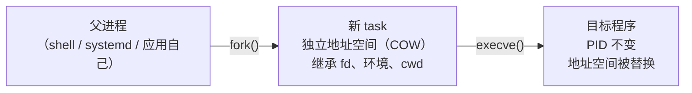

---
tags:
  - Linux
  - 进程
  - 生命周期
  - fork
created: 2026-09-18
---

# 第 1 站：进程的诞生

> [!cite] 参考资料
> `man 2 fork`、`man 2 execve`、`man 2 clone`、`man 2 wait`、`man 3 posix_spawn`、`man 5 proc`、`man 1 ps`、`man 1 systemd-run`、`man 5 systemd.service`；bpf 工具（`execsnoop`）属进阶内容，工具来源见阶段 1（实验环境与操作纪律）。
>
> 本篇结论来自上述资料，**命令输出尚未在实验机上逐条实测**；本机结果与文中不一致时以本机输出为准，并回填到对应小节。

> **这篇讲什么**：一个 task 是怎么被造出来的——`fork`/`execve`/`clone` 各做了什么、代价在哪里、失败时报什么错、失败的原因属于哪一类。
>
> **必须先读什么**：[[Linux/03_进程与信号/01_前置_进程与线程|01 前置：进程与线程]]（task/PID/TGID 的定义）。
>
> **读完能回答**：① 「启动一个程序」在内核里是哪两步？② `fork` 失败时你会看到哪两种报错，分别指向什么？③ 为什么「进程创建得太多」会把机器拖死？
>
> 所属：[[Linux/03_进程与信号/00_导读与知识地图|03 进程与信号]] 的 1.1 四站之第 1 站 · 主要练 **S4 分层定位**、**S6 耗尽处置**

## 0. 30 秒速览

> [!abstract] 这一篇只要记住五句话
> - **「启动一个程序」= `fork` + `execve` 两步**：先复制出一个新任务，再把它换成新程序；`execve` **不改变 PID**。
> - **`fork` 复制的是「控制结构」，不是内存**。物理内存靠写时复制（COW）共享，成本在页表与内核对象上。
> - **`clone` 是 `fork` 的通用版**：线程、容器、命名空间全部通过它的 flag 组合实现（`CLONE_VM` 管线程、`CLONE_NEW*` 管容器）。
> - **创建失败只有两类报错**：`EAGAIN`（资源暂时不可用，通常是撞到上限）与 `ENOMEM`（内核内存不足）——**先分清是哪一类，再谈怎么改**（子笔记 09 展开）。
> - **创建本身不贵，创建得太多才贵**。每秒几万次 `fork` 会把 CPU 花在内核里、把 PID 消耗干净，表现是「机器很卡、服务却起不来」。

## 1. 这一站要完成的事



**产出**：内核里多了一个 task，进入调度队列，可以开始吃 CPU（第 2 站）。

**注意一件事**：`fork` 之后子进程是「父进程的副本」，理论上它可以继续跑父进程的代码（shell 就是这么实现 `&` 与命令替换的）；真正让它变成「别的程序」的是 `execve`。

## 2. 三个系统调用

| 系统调用 | 做的事 | 返回值 | 用户态谁在用 |
| --- | --- | --- | --- |
| `fork()` | 复制一份当前任务，得到**独立地址空间**（COW） | 子进程里返回 `0`，父进程里返回**子进程 PID**，失败返回 `-1` | shell 的 `&`、`$(...)`、管道两侧；`systemd` 拉起服务；大多数服务端程序的 worker 模型 |
| `execve()` | 用新程序**替换**当前地址空间 | **只在失败时返回**（成功不返回） | 所有「跑一个命令」的最后一步 |
| `clone()` | 按 flag 决定共享什么 | 与 `fork` 类似 | `pthread_create()`（`CLONE_VM`/`CLONE_THREAD`…）、容器运行时（`CLONE_NEW*`） |

### 2.1 `execve` 之后，什么留下来了、什么被换掉

这是最容易答错的一个知识点，因为它决定了「服务重启时到底发生了什么」：

| 项目 | `execve` 之后 |
| --- | --- |
| **PID / TGID** | **不变**（换的是程序，不是任务） |
| 地址空间、代码、堆栈 | 全部替换 |
| 环境变量 | 由调用方传入（`execve(path, argv, envp)`） |
| 文件描述符 | **默认保留**，除非标了 `FD_CLOEXEC`（这就是「父进程打开的 fd 泄漏到子进程」的原因） |
| 信号处理函数 | **重置为默认动作**（被显式忽略的信号仍保持忽略） |
| 信号掩码 | 保留 |
| 工作目录、`umask` | 保留 |
| 父进程 | 不变（还是原来那个） |

> [!important] 「重启服务」不等于「换一个进程」
> systemd 重启一个服务时，通常是**新 fork 一个进程再 exec**，所以 PID 会变；但如果只是应用内部 `exec` 自己（部分程序的热重启做法），**PID 不变、地址空间全换**。看到「PID 没变但版本变了」，不要以为是幻觉。

### 2.2 `clone` 与容器：创建方式决定了隔离

容器运行时创建进程时走的就是 `clone`，只是 flag 组合不同：

| flag 组 | 作用 | 结果 |
| --- | --- | --- |
| `CLONE_VM`、`CLONE_FILES`、`CLONE_THREAD` | 共享地址空间、fd 表、线程组 | 得到「线程」 |
| `CLONE_NEWPID`、`CLONE_NEWNET`、`CLONE_NEWNS`、`CLONE_NEWUSER`… | 新建 namespace（子笔记 11） | 得到「容器里的进程视角」 |

```bash
lsns                                     # 验证：系统里的 namespace 列表（每个容器会带来若干个）
readlink /proc/<pid>/ns/pid              # 验证：某个进程所在的 PID namespace 标识
```

## 3. 谁在创建进程

运维视角下，「创建进程」的来源只有这几类，定位创建者时按这个清单过一遍：

| 创建者 | 典型场景 | 观测线索 |
| --- | --- | --- |
| 交互式 shell | 你敲的每一条命令、`&`、命令替换 | 父进程是登录 shell |
| systemd（PID 1） | 服务启动、定时任务、`systemd-run` | `PPID` 为 `1`，`systemctl status` 能看到单元 |
| 应用自己 | worker 池扩容、按请求 fork、CGI | `ps --forest` 下挂在业务进程下 |
| 容器运行时 | `docker run`、`kubectl exec` | 进程属于某个容器 cgroup，namespace 独立 |
| 内核 | 内核线程 | `ps` 里名字带方括号 |

```bash
ps -eo pid,ppid,lstart,etime,cmd --sort=start_time | tail -20   # 验证：最近创建的 20 个进程与它们的父进程
ps -eo pid,ppid,comm --no-headers | sort -k2 -n | head -30      # 验证：按父进程聚拢，看谁在批量创建
```

## 4. 创建失败的两种报错

`fork` 只会因为两类原因失败，把它们分清，等于定位了一半：

| 报错 | 含义 | 常见来源 |
| --- | --- | --- |
| `EAGAIN`（`Resource temporarily unavailable`） | 资源暂时不可用 | 撞到进程数上限：`RLIMIT_NPROC`（按 UID）、cgroup 的 `pids.max`、`kernel.pid_max` |
| `ENOMEM`（`Cannot allocate memory`） | 内存不足 | 内核内存不足、`RLIMIT_AS`/`RLIMIT_DATA` 限制、线程栈无法分配 |

```bash
ulimit -u                                # 验证：当前会话的进程数软限制（RLIMIT_NPROC，按 real UID 计）
cat /proc/sys/kernel/pid_max             # 验证：PID 编号上限（现代发行版常被 systemd 抬高，不要背数字）
cat /sys/fs/cgroup/system.slice/<svc>/pids.max   # 验证：某个服务所在 cgroup 的任务数上限（cgroup v2）
cat /proc/loadavg                        # 验证：最后一列是最近分配的 PID（连看两次可估算消耗速率）
dmesg -T | grep -i -E 'fork|pids' | tail -20   # 验证：内核是否记录了 cgroup: fork rejected by pids controller
```

**判断顺序**：先看报错是哪一类（`EAGAIN` / `ENOMEM`），再看是「整机范围」还是「某一组」（`pid_max` vs `pids.max`），最后才谈改哪一层——完整的四类上限与处置写在子笔记 09。

## 5. 创建的成本：为什么 fork 风暴能把机器拖死

单次 `fork` 的开销主要在三个方面：

1. **页表与内核对象**：复制页表、创建 `task_struct`、信号结构、调度实体；
2. **`execve` 的加载成本**：把可执行文件与依赖库映射进地址空间（这是「启动慢」的主要部分）；
3. **调度与记账**：新 task 进入运行队列，短命的 task 会带来大量上下文切换（`cswch/s` 飙升）。

```bash
vmstat 1 5                                # 验证：sy（内核态 CPU）与 cs（上下文切换）是否随业务量一起飙升
pidstat -w -p <pid> 1 5                   # 验证：某个进程的自愿/非自愿上下文切换速率
pidstat -u -t -p <pid> 1 5                # 验证：线程级 CPU，定位「谁在制造新进程」
```

**fork 风暴的典型现场**：`sy` 高、`cs` 高、`/proc/loadavg` 最后一列快速跳、`ps -e | wc -l` 快速上升，同时业务本身报「起不来新进程」。处置顺序写在子笔记 09，这里只记住一句：**先确认是不是创建风暴，再谈调上限；调上限只会让它晚几分钟撞墙**。

## 6. 守护进程化的标准动作

老式做法（`daemonize`）通常是这样四步，理解它有助于看懂老服务的行为：

1. `fork` 一次并让父进程退出——让进程被 PID 1 收养（脱离原会话的牵挂）；
2. `setsid()`——新建会话、脱离控制终端；
3. 再 `fork` 一次——确保自己不是会话首进程，永远不会再获得控制终端；
4. `chdir("/")`、`umask(0)`、把 stdin/stdout/stderr 重定向到 `/dev/null` 或日志文件。

**现代替代方案**：交给 systemd（`Type=forking` 兼容老程序，新的程序写 `Type=simple` 并保持前台运行，日志交给 journald）——细节在阶段 8。**不要在新脚本里手写这套 daemonize 流程**。

## 7. 常见坑

| 常见做法或说法 | 后果或事实 |
| --- | --- |
| 「进程重启之后 PID 一定会变」 | 不一定：应用内部 `exec` 自己（热重启）时 **PID 不变、地址空间全换**；只有「新 `fork` 一个再 `exec`」才会换 PID |
| 「`fork` 会复制内存，所以服务大了就不能 fork」 | 有 COW，`fork` 瞬间几乎不占额外物理内存；真正的问题是后续写入导致的复制与页表开销 |
| 在应用里对每个请求 `fork` 一次 | 高并发下变成 fork 风暴，CPU 全耗在内核态；应改用线程池/进程池或异步模型 |
| 以为子进程不会继承父进程的句柄 | 默认继承（除 `FD_CLOEXEC`）；句柄泄漏经常是「父进程的 fd 带进了子进程」 |
| 用 `ps -eo pcpu` 找「刚起来的进程为什么 CPU 这么高」 | 新进程的 `etimes` 很小，生命周期平均值的分母太小，数字虚高 |
| 看到 `fork` 失败就去调 `ulimit -u` | 报错可能来自 cgroup 的 `pids.max` 或 `kernel.pid_max`；先分类再改（子笔记 09） |
| 起一个「永久后台进程」用 `&`/`nohup` | 没有自启与重试；正式做法是写成 unit（阶段 8），临时任务用 `systemd-run`（子笔记 03） |

## 8. 决策练习

> [!question]- 场景：一个用 `fork` 处理请求的老服务，QPS 一上到 2000 就开始报 `Resource temporarily unavailable`，同机的其他服务正常，重启能暂时恢复
> 你的处理顺序是什么？
> A. 先确认报错来自哪条上限（`/proc/<pid>/limits` 的 `Max processes`、所在 cgroup 的 `pids.current`/`pids.max`、`kernel.pid_max`），再看 `/proc/loadavg` 最后一列的 PID 消耗速率确认是不是创建风暴，最后才决定「扩上限」还是「改模型」
> B. 把 `/etc/security/limits.conf` 里的 `nproc` 调大，然后重启服务
> C. 加一层限流，把 QPS 限制在 1500
>
> **答案：A。**
> B 可能完全无效：如果服务跑在 systemd 下且用 `TasksMax=` 限过，`limits.conf` 对它根本不起作用（子笔记 08）；而且不看是不是创建风暴就扩容，只是把撞墙时间往后推。
> C 是治标：限流能把事故压住，但你没有回答「为什么请求模型要每次 fork」这个根因；在容量规划上它也是靠牺牲业务换稳定。
> A 是正解：**先分类（哪条上限）→ 再定量（消耗速率）→ 最后决策（扩上限、还是改架构、还是限流过渡）**。如果确认是按请求 fork 的模型，那么长期方案是改模型，扩上限只是过渡措施。

## 9. 要点自测

> [!question]- 「启动一个程序」在内核里发生了几件事？
> - 两步：`fork`/`clone` 造出新的 task，再 `execve` 把它的地址空间换成目标程序。
> - 线程只需要第一步（`clone` 时共享地址空间）；容器是把 namespace 相关的 flag 一起交给 `clone`。
> - **第一反应不要是什么**：不要以为「进程创建」是一个系统调用完成的黑盒——`fork`、`execve`、`clone` 的分工决定了句柄、信号、PID 的继承行为。

> [!question]- `fork` 失败时你看到的两种报错分别指向什么？
> - `EAGAIN`（`Resource temporarily unavailable`）：撞到进程数上限——`RLIMIT_NPROC`、cgroup 的 `pids.max`、`kernel.pid_max`。
> - `ENOMEM`（`Cannot allocate memory`）：内核内存不足，或受 `RLIMIT_AS`/`RLIMIT_DATA` 约束。
> - **第一反应不要是什么**：不要看到「起不了进程」就先把 `ulimit` 调大——先分类，再决定改哪一层（子笔记 08、09）。

> [!question]- `execve` 之后哪些东西保留、哪些被换掉？
> - 保留：PID/TGID、父进程、工作目录、`umask`、信号掩码、未标 `FD_CLOEXEC` 的文件描述符。
> - 换掉：地址空间（代码、堆、栈）、环境变量由调用方传入、信号处理函数重置为默认。
> - **第一反应不要是什么**：不要假设「换了程序就重置了一切」——fd 继承与信号处置的保留，正是很多「重启之后还占着旧连接/旧端口」问题的原因。

> 上一篇：[[Linux/03_进程与信号/03_前置_终端会话与进程组|03 前置：终端、会话与进程组]] ｜ 下一篇：[[Linux/03_进程与信号/05_第2站_状态与调度|05 第 2 站：状态与调度]]
