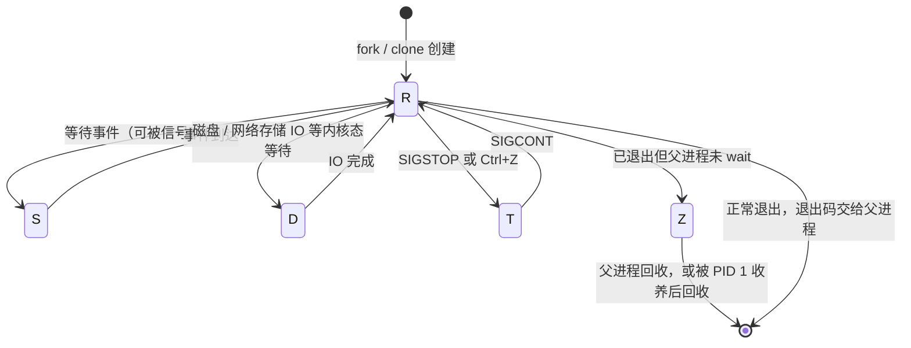

---
tags:
  - Linux
  - 进程
  - 生命周期
  - 调度
  - 排障
created: 2026-09-18
---

# 第 2 站：状态与调度

> [!cite] 参考资料
> `man 1 ps`、`man 1 top`、`man 1 pidstat`、`man 1 nice`、`man 1 ionice`、`man 1 chrt`、`man 1 taskset`、`man 7 sched`、`man 5 proc`（`/proc/<pid>/wchan`、`stack`、`schedstat`）、内核文档 `Documentation/scheduler/sched-rt-group.rst`；CPU 与延迟的深水区在阶段 10（性能分析与排障）。
>
> 本篇结论来自上述资料，**命令输出尚未在实验机上逐条实测**；本机结果与文中不一致时以本机输出为准，并回填到对应小节。

> **这篇讲什么**：进程在四站里的第 2 站——它要么在 CPU 上跑，要么在等某个事件。这一篇把「为什么它没在跑」这个问题拆成两半：**状态（在等谁）** 与 **调度（为什么没轮到它）**。
>
> **必须先读什么**：[[Linux/03_进程与信号/02_前置_进程观测与proc|02 前置：进程观测与 /proc]]（`wchan`、`stack`、`status` 的读法在那篇）。
>
> **读完能回答**：① `D` 状态为什么杀不掉，接下来查什么？② nice 调高/调低到底影响什么？③ 为什么「整机 CPU 不高」也可能是 CPU 问题？
>
> 所属：[[Linux/03_进程与信号/00_导读与知识地图|03 进程与信号]] 的 1.1 四站之第 2 站 · 主要练 **S4 分层定位**、**S7 风险与止损判断**

## 0. 30 秒速览

> [!abstract] 这一篇只要记住五句话
> - **状态字母只有两个用途**：区分「在跑」「在等」「已停」「已死」——它**不告诉你原因**。判断原因永远靠 `wchan`、`stack` 和当时的 IO/网络报错。
> - **`D` 状态杀不掉是设计**：信号要等进程回到用户态才处理，而它正卡在内核态等待。`kill -9` 只是把信号挂起来，不是没生效。
> - **`T` 与 `t` 是两类停止**：`T` 是 `SIGSTOP`/`Ctrl+Z` 造成的作业停止（`SIGCONT` 可恢复），`t` 是被调试器（`ptrace`）挂住。
> - **nice 只在「有人抢 CPU」时才有意义**：整机空闲时，nice 19 的进程照样能跑满一个核；跨容器/跨组的分配要看 cgroup 的 `cpu.weight`/`cpu.max`。
> - **实时调度（`SCHED_FIFO`/`SCHED_RR`）是双刃剑**：一个优先级 99 的 RT 线程可以把包括 `sshd` 在内的所有普通进程饿死，所以生产上要极其克制。

## 1. 状态：五个字母，四种命运

`ps` 的 `STAT` 列与 `/proc/<pid>/status` 的 `State:` 字段来自内核同一张状态表：

| 状态 | 内核含义 | 常见来源 | 对它发 `SIGKILL` 的结果 |
| --- | --- | --- | --- |
| `R` | running / runnable | 正在跑，或在运行队列里排队 | 生效 |
| `S` | interruptible sleep（可中断睡眠） | 等网络、等锁、`sleep`；绝大多数进程的常态 | 生效 |
| `D` | uninterruptible sleep（不可中断睡眠） | 等磁盘 IO、NFS/网络存储、内核态锁、驱动 | **信号被挂起**，等它回到用户态才处理 |
| `T` | stopped（作业停止） | `SIGSTOP`、`Ctrl+Z`（`SIGTSTP`） | `SIGTERM` 等普通信号会一直挂着，`SIGCONT` 之后才处理；**`SIGKILL` 可直接终止** |
| `t` | tracing stop | 被 `ptrace`（`strace`/`gdb`）挂住 | 同上；`SIGKILL` 也能终止，否则要让调试器放掉它 |
| `Z` | zombie | 已退出，等父进程回收 | **无效**：它已经终止了，问题在父进程（子笔记 07） |
| `I` | idle | 内核线程（部分内核版本显示） | 不需要也不应该管 |
| `X` | dead | 转瞬即逝的中间态 | 基本看不到 |

`STAT` 的后缀同样实用：`<` 高优先级、`N` 低优先级（nice 为正）、`L` 有内存页被锁定、`s` 是会话首进程、`l` 是多线程、`+` 位于前台进程组。例如 `Ss` = 「可中断睡眠 + 会话首进程」，正是 systemd 与多数守护进程的常态。



图里要看清一件事：**`D` 只能自己走出来，没有人能把它踢出来**。

```bash
ps -eo pid,ppid,stat,wchan:24,etime,cmd --sort=-pcpu | head -20   # 验证：状态 + 等待点 + 运行时长
cat /proc/<pid>/wchan                # 验证：正睡在哪个内核函数上（D 状态的第一手证据；在跑时是 0）
cat /proc/<pid>/stack                # 验证：内核态调用栈（需要 root 且内核开启栈回溯）
cat /proc/<pid>/status | head -8     # 验证：State 的原始值与 Tgid/Pid
```

> [!important] 「D 状态一定杀不掉」只说对了一半
> 内核自 2.6.25 起引入 `TASK_KILLABLE`：同样是不可中断睡眠，但**能被致命信号打断**（典型用于 NFS 的某些等待路径）。历史上它在状态表里单独显示为 `K`，较新的内核不再区分，**仍显示为 `D`**。
> 所以正确的判断方式不是背字母，而是**看它在等什么**：`wchan`、`/proc/<pid>/stack`，以及 `dmesg` 里同一时间点的 IO/NFS 报错。

## 2. 调度：为什么没轮到它【进阶】

本节属【进阶】：第一遍只需要知道「有这五种手段、各自管什么、别乱用」，真正要调的时候再回来读细节。

「没在跑」的另一半原因不是「在等」，而是「排队」。这一半由调度决定，能调的手段有五个，管的事完全不同：

| 手段 | 作用对象 | 取值范围 | 生产上怎么用 |
| --- | --- | --- | --- |
| `nice` / `renice` | CPU 时间分配的**相对权重**（默认调度器 `SCHED_OTHER`） | `-20`（最高）~ `19`（最低），默认 `0` | 给备份、日志压缩这类批处理降优先级；**普通用户只能往大调（降优先级）** |
| `ionice` | IO 调度优先级 | `-c 1/2/3`（实时/尽力/空闲）+ `-n 0~7` | 让备份在空闲时读写：`ionice -c3` |
| `chrt` | 调度策略与实时优先级 | 策略 `SCHED_OTHER/FIFO/RR/BATCH/IDLE/DEADLINE`，RT 优先级 `1~99` | 只在有明确实验依据时使用；**RT 会抢占一切非 RT 任务** |
| `taskset` | CPU 亲和性 | CPU 列表或掩码 | 绑定延迟敏感进程；与 cgroup 的 `cpuset` 取**交集** |
| `numactl` | NUMA 绑核 + 绑内存 | — | 跨 NUMA 场景，内存侧细节在阶段 4（内存管理与 OOM） |

五条反直觉但重要的结论：

1. **nice 只在有人抢 CPU 时起作用**。整机 CPU 空闲时，nice 19 的进程照样能跑满一个核。
2. **实时调度是双刃剑**。优先级 99 的 RT 线程若跑满 CPU，普通进程（包括 `sshd`）会被饿死，机器「看起来活着但登不上去」。内核用 RT 节流兜底（`/proc/sys/kernel/sched_rt_runtime_us` 默认 `950000`、`sched_rt_period_us` 默认 `1000000`，即最多占用 95%），**不要在没读文档的情况下动这两个值**。
3. **cgroup 与 nice 是两层**：cgroup v2 的 `cpu.weight` 决定**组之间**怎么分（子笔记 11），nice 决定**组内**谁先跑，两者叠加生效。容器里调 nice 只影响容器内部的相对顺序，跨容器要靠 `cpu.weight`/`cpu.max`。
4. **`taskset` 不等于 cgroup 的 `cpuset`**：前者改单个进程的亲和掩码，后者是整组可用的 CPU 集合，二者是**交集**关系——把进程绑到 cgroup 不允许的 CPU 上是无效的，这种「绑了但没生效」在容器里很常见。
5. **nice 值会被子进程继承**：`fork` 与 `execve` 都不会重置它。所以一次 `renice` 影响的是这条进程链后续拉起的所有任务——批量降优先级时很方便，改错了也要沿着整条链改回来。

```bash
nice -n 10 <cmd>                     # 验证：以 nice 10 启动命令（降低优先级）
renice -n 5 -p <pid>                 # 验证：调整运行中进程的 nice（普通用户只能往大调）
chrt -p <pid>                        # 验证：查看进程当前的调度策略与 RT 优先级
taskset -cp <pid>                    # 验证：查看进程当前允许的 CPU 列表
ionice -p <pid>                      # 验证：查看进程的 IO 调度类与优先级
cat /proc/<pid>/schedstat            # 验证：累计运行时间 / 等 CPU 时间 / 被调度的次数（三个数一起看）
```

## 3. 两个必须会用的观测角度

### 3.1 线程级：整机不高但服务慢

```bash
top -H -p <pid>                                  # 验证：进程内各线程的 CPU（第一列是 TID）
ps -L -p <pid> -o pid,tid,pcpu,stat,comm --sort=-pcpu | head
                                                 # 验证：同上，输出可直接留档
mpstat -P ALL 1 5                                # 验证：每颗核的使用率——找「某颗核 100%、其余空闲」
pidstat -u -w -t -p <pid> 1 5                    # 验证：线程级 CPU + 上下文切换（cswch/s、nvcswch/s）
```

（`mpstat`、`iostat`、`pidstat` 都来自 `sysstat`，阶段 1 的诊断工具箱里有；没装就先 `dnf install sysstat` 或 `apt install sysstat`。）

**单核打满**是最常见的假象：8 核机器上一个线程跑满，整机 CPU 只有 12% 左右，`top` 的进程级视图也会被平均掉。判据是 `mpstat -P ALL` 里 **`%idle` 为 0 的那一列**。

### 3.2 等 CPU 还是等事件

```bash
cat /proc/<pid>/status | grep -E 'voluntary|nonvoluntary'
                                     # 验证：主动让出（等事件）与非主动让出（被抢占）的次数
pidstat -w -p <pid> 1 5              # 验证：同上，但给出的是每秒速率
vmstat 1 5                           # 验证：r（可运行队列）与 b（阻塞队列）两列；b 长期大于 0 说明有人卡在内核态
```

经验判据（**必须在同一个进程上比较这两个数的增长速度**）：`nonvoluntary_ctxt_switches` 相对更高 → 它在排队等 CPU，查容量与争抢；`voluntary_ctxt_switches` 相对更高 → 它在等别人（IO、锁、网络），去查那件事本身；两个都高说明它既抢 CPU 又在等事件——**只看一个数字不能定性**（子笔记 12）。

## 4. 排障：进程卡死，`kill -9` 也杀不掉（D 状态）

> [!tip] 第一反应不要是「再杀一次 / 重启整机」
> `D` 状态的进程正卡在内核态等待，信号只是被挂起；反复 `kill` 没有意义，重启会把现场一起清掉。**先看它在等谁。**

按顺序排除：

1. **确认等待点**：`wchan`、`/proc/<pid>/stack`、`ps -o stat,wchan`。
2. **确认底层是不是磁盘/网络存储**：`iostat -x 1`、`dmesg -T | tail -50`、`cat /proc/mounts | grep nfs`；NFS 的 `hard` 挂载在服务端不可达时就是典型的长时间 `D`。
3. **确认是不是内核锁/驱动**：`stack` 里出现文件系统或驱动的函数名时，多半要升级内核/驱动，或先把业务切走再处理。
4. **评估业务影响面**：这类进程通常还占着内存、句柄和连接；如果它在处理请求，**先摘流量**比杀进程更现实。
5. **最后才讨论放弃**：确认数据一致性风险之后，重启机器或触发 panic 取证（阶段 2 的 kdump 场景）。

```bash
ps -o pid,ppid,stat,wchan:24,etime,cmd -p <pid>   # 验证：状态与等待点
cat /proc/<pid>/stack                             # 验证：内核态调用栈（需要 root）
cat /proc/<pid>/syscall                           # 验证：它此刻正在执行（或阻塞在）哪个系统调用
iostat -x 1 5                                     # 验证：是否有一块盘的 await/%util 异常
dmesg -T | grep -i -E 'nfs|blocked for more than|hung task'
                                                  # 验证：内核是否已报「任务阻塞超时」
```

想看「它一直在重复哪个系统调用」，用 `strace -p <pid>`；**注意它会显著拖慢被跟踪的进程**，生产上要限定时长、并先评估业务影响（这条工具链的展开在阶段 10）。

> [!warning] 内核已经报警 `hung task` 时不要再等
> 内核日志出现 `INFO: task <name>:<pid> blocked for more than 120 seconds` 时，说明有 task 卡在 `D` 状态超过阈值（`kernel.hung_task_timeout_secs`，默认 120 秒）。这时**排查重点是存储/驱动路径**，不是进程本身；同时要评估业务影响面，必要时先切流。

> **最低成本复现**：本篇第 5 节的实验 5（用 `dmsetup suspend` 挂起一个环设备，再对它做写操作）。环境不允许动 device-mapper 时，可以退一步观察 `T` 状态——`kill -STOP` 后用 `SIGCONT` 能唤醒它，而 `D` 状态谁也唤不醒，两者的差别一次就能看清。

## 5. 配套实验：亲手造一个 `D` 状态（S4、S7）

> [!warning] 只在这台机器上做
> 本实验会**挂起一个块设备**，期间对它的所有 IO 都会阻塞。**只在可快照的实验机上做，动手前先打快照**；清理不彻底会留下 loop 设备与挂载残留。

> [!example]- 实验 5：看 `kill -9` 为什么对 `D` 状态无效
> **环境**：仅实验机；需要 root 与 `dmsetup`（`device-mapper` 包）。若环境不允许动 device-mapper，退而观察 `T` 状态——`kill -STOP` 之后 `SIGCONT` 能唤醒，而 `D` 谁也唤不醒；也可以用一台不可达的 NFS `hard` 挂载做对照。
>
> **怎么做**：
> ```bash
> dd if=/dev/zero of=/tmp/lab-backing bs=1M count=64     # 造一个 64 MiB 的后端文件
> losetup --find --show /tmp/lab-backing                 # 验证：拿到环设备名，例如 /dev/loop9
> dmsetup create lab-dstate --table "0 131072 linear /dev/loop9 0"   # 建一个 device-mapper 目标
> mkfs.ext4 -F /dev/mapper/lab-dstate && mount /dev/mapper/lab-dstate /mnt
>                                                        # 验证：挂载成功
> dmsetup suspend lab-dstate                             # 挂起设备：之后对它的 IO 都会阻塞
> dd if=/dev/zero of=/mnt/lab-file bs=1M count=8         # 另开一个终端执行：这个 dd 会卡在内核态等待
> ps -o pid,stat,wchan:24,cmd -p <dd 的 PID>             # 验证：状态为 D，wchan 指向 block/dm 相关函数
> kill -9 <dd 的 PID>; ps -o pid,stat,cmd -p <dd 的 PID> # 验证：进程还在——信号只是被挂起
> dmsetup resume lab-dstate                              # 回到第一个终端执行：恢复 IO
> umount /mnt; dmsetup remove lab-dstate; losetup -d /dev/loop9; rm -f /tmp/lab-backing
>                                                        # 验证：lsblk 与 /proc/mounts 里没有残留
> ```
>
> **预期**：`D` 状态期间 `kill -9` 只是把信号挂起；IO 恢复后信号立即生效——**「D 杀不掉」的本质是信号投递不进去，不是内核拒绝执行 `kill`**。
>
> **风险**：高。挂起期间对目标设备的一切 IO 都会阻塞；清理不彻底会留下 loop 设备与挂载残留。
>
> **耗时**：约 30 分钟。
>
> **怎么退回去**：无论如何都要执行最后一行清理命令，并用 `lsblk`、`/proc/mounts` 确认没有残留。

## 6. 常见坑

| 常见做法或说法 | 后果或事实 |
| --- | --- |
| 「`D` 状态就是磁盘坏了」 | `D` 只说明「内核态不可中断等待」，NFS/网络存储、内核锁、驱动都可能；判据是 `wchan`/`stack` 与当时的报错 |
| 以为 `T` 状态的进程「必须 `SIGCONT` 才处理信号、否则杀不掉」 | 普通信号确实会挂着；但 `SIGKILL` 能直接终止停止的进程。先 `SIGCONT` 是为了让它有机会优雅收尾 |
| 「整机 CPU 只有 10%，肯定不是 CPU 问题」 | 单线程热点、绑核错误、GC 停世界都会造成这个现象；要看 `mpstat -P ALL` 的单核占用 |
| 用 `ps -eo pcpu` 判断此刻的热点 | 它是生命周期平均值；此刻的占用要看 `top`（第二次刷新起）或 `pidstat 1` |
| 给业务进程随便调 nice，以为能「提升优先级」 | 普通用户只能降优先级；即便有权限，nice 也只在 CPU 竞争时有效，且不改变跨 cgroup 的分配 |
| 用 `chrt` 把关键线程设成 RT 优先级 | 一旦跑满 CPU，普通进程（含 `sshd`）会被饿死；必须同时评估 RT 节流参数与回滚方式 |
| 把 `taskset` 当成万能的绑核手段 | 与 cgroup 的 `cpuset` 取交集；容器里经常出现「绑了但没生效」 |
| 只看 `load average` 判断 CPU 忙不忙 | 负载里混合了可运行与不可中断（`D`）两类任务；`vmstat` 的 `r`/`b` 两列才是区分的关键 |

## 7. 决策练习

> [!question]- 场景：一台数据库主机业务变慢，`iostat` 显示某块盘 `%util` 90%+，同时有三个数据库进程处于 `D` 状态
> 你会怎么做？
> A. 直接 `kill -9` 那三个进程，让业务重连
> B. 重启机器，重启之后盘应该就正常了
> C. 先确认它们在等什么（`wchan`/`stack`、`dmesg` 有没有 `hung task` 或介质错误），同时评估业务影响面、准备切流方案；把「三个 D 状态进程」当作症状而不是原因
>
> **答案：C。**
> A 行不通也可能有害：`D` 状态的进程收不到 `SIGKILL`（信号被挂起），你只会得到一个「以为杀掉了但进程还在」的错觉；如果它正持有数据库锁，杀掉还可能让恢复时间变长。
> B 是最重的选择：重启既清掉现场（`wchan`、`stack`、内核报错），也没解决盘的问题（介质错误、固件、RAID 降级都会复发）。
> C 是正解：**症状（D 状态）→ 证据（wchan/stack/dmesg）→ 影响面 → 决策（切流、换盘、等 IO 恢复）**。这类问题的根因通常在存储链路，处置细节在子笔记 12 与阶段 5（存储与文件系统）。

## 8. 要点自测

> [!question]- `D` 状态的进程为什么杀不掉？你接下来会查什么？
> - 它处在内核态不可中断睡眠，信号只能被挂起，等它回到用户态才处理；`kill` 返回成功只代表信号送出去了。
> - 边界：`TASK_KILLABLE` 属于「能被致命信号打断的不可中断等待」，新内核仍显示为 `D`，所以不能凭字母下结论。
> - 下一步：`wchan`、`/proc/<pid>/stack`，再看 `iostat`、`dmesg`、`/proc/mounts` 找它在等哪条链路。
> - **第一反应不要是什么**：不要连续 `kill -9`，也不要直接重启——重启既清掉现场，也不保证不复发。

> [!question]- nice、`cpu.weight`、`taskset` 分别解决什么问题？
> - `nice`：同一组内的相对优先级，范围 `-20~19`，只在竞争时起作用。
> - `cpu.weight`：cgroup 之间分 CPU 的权重；`cpu.max` 才是硬性上限。
> - `taskset`：单进程的 CPU 亲和，与 cgroup 的 `cpuset` 取交集。
> - **第一反应不要是什么**：不要用「调高优先级」掩盖设计问题——先量化瓶颈，再决定要不要动用优先级手段。

> [!question]- 「服务 CPU 打满但整机看着不高」该怎么定位？
> - 先看线程：`top -H -p <pid>`、`ps -L -p <pid> --sort=-pcpu`，找出跑满的 TID。
> - 再看绑核：`mpstat -P ALL 1`、`taskset -cp <pid>`，确认是不是某颗核被独占。
> - 最后看它是在算还是在等：`pidstat -u -w -t` 的 `%wait` 与上下文切换。
> - **第一反应不要是什么**：不要因为整机 CPU 低就排除 CPU 方向的排查。

> 上一篇：[[Linux/03_进程与信号/04_第1站_进程的诞生|04 第 1 站：进程的诞生]] ｜ 下一篇：[[Linux/03_进程与信号/06_第3站_信号与优雅退出|06 第 3 站：信号与优雅退出]]
