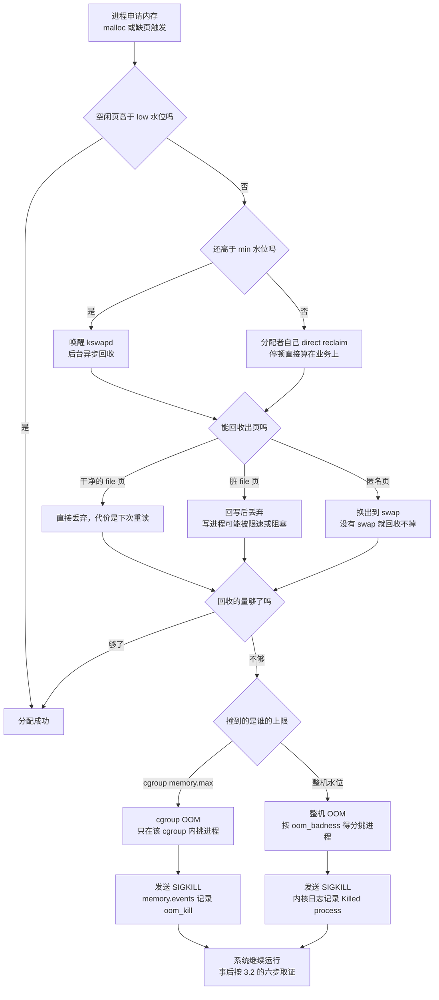

---
tags:
  - Linux
  - 内存
  - OOM
  - cgroup
  - 运维面试
created: 2026-09-16
---

# 内存管理与 OOM

> 本笔记对应 [[Linux/00_简介|Linux 大纲]] 的「阶段 4：内存管理与 OOM」。目标：能正确读 `free`／`/proc/meminfo`，能讲清 Page Cache、swap、超额分配与 OOM 判定，能回答「内存去哪了」，并且能在 OOM 之后拿出证据说清楚是谁被杀、为什么被杀。
>
> 关联复习：[[03_进程与信号]]（进程状态与 cgroup 基础）、[[05_存储与文件系统]]（swap 设备、脏页回写与 IO 延迟）、[[10_性能分析与排障]]（PSI 与延迟分析的方法论）、[[Kubernetes/03_调度_资源_QoS|Kubernetes 资源与 QoS]]（容器内存限制与 OOMKilled）。
>
> 说明：内核参数与算法以内核源码和 `Documentation/admin-guide/sysctl/vm.rst` 为准，字段口径以 `proc(5)` 与 `meminfo.c` 为准；默认值一律给查询命令，因为**发行版与 tuned 会覆盖内核默认值**。cgroup 以 **v2** 为准，v1 差异单独标注。

> [!info] 读之前：这篇笔记假设你已经具备三件事
> 1. **一台可快照的实验机并且有 root**。第 4 节有七个实验，其中三个会改内核回写参数、创建 swap、故意触发 OOM，破坏性动作只在实验机上做（见第 4 节的「前置纪律」）。
> 2. **会上机读 `/proc`**：知道 `/proc/meminfo`、`/proc/<pid>/status` 这类文件是内核暴露的实时状态，`free`、`ps`、`vmstat` 会用。不熟可以先看 [[02_启动流程与内核]]。
> 3. **知道 cgroup 是什么**：1.9 直接讲 cgroup v2 的内存控制器，前置知识（namespace 与 cgroup 各管什么、`memory.max` 这类文件的位置）在 [[03_进程与信号]]。
>
> 一个环境前提：cgroup 相关内容需要 **cgroup v2**（先跑 `stat -fc %T /sys/fs/cgroup`，输出 `cgroup2fs` 才算满足）。环境不满足时正文照读，只是相关实验做不全。

## 0. 30 秒速览

> [!abstract] 这一页只要记住六句话
> 首学读不懂很正常：先跳过这一节，读完第 1、3 节再回来逐条验证——每一条都是「结论 + 一句可复现的证据」。
> - **`free` 少不等于内存不够**：判据是 `available`／`MemAvailable`，不是 `free`。Linux 拿空闲内存做缓存，**「剩余内存很少」在正常情况下是这台机器在干活的表现**；真到紧张时会看到 `si/so`、PSI 与回收压力一起起来。
> - **Page Cache 是资产，不是浪费**：它由内核按需回收；真正的风险是**脏页太多写不回去**（`dirty_ratio`），这时写进程会被卡在回写里，表现为 `wa` 高、`await` 高、进程进 `D` 状态。
> - **swap 是「延迟换空间」**：`vm.swappiness` 是**回收倾向的权重，不是开关**——设为 0 仍可能在压力下换页，真要禁用得 `swapoff`（或 cgroup v2 的 `memory.swap.max=0`）。关掉 swap 不会消除风险，只是把「换页变慢」换成「被 OOM 杀掉」。
> - **OOM 的判定不是退出码 137**：137 只说明被 `SIGKILL` 杀死。要看 `dmesg`/`journalctl -k` 的 OOM 记录与 cgroup v2 的 `memory.events`；而在容器化环境里，**十个 OOM 有九个是 cgroup 级 OOM，整机其实还有空闲内存**。
> - **「内存去哪了」只有三类答案**：tmpfs／共享内存（`Shmem`）、内核 slab 与 dentry/inode 缓存（`Slab`/`SReclaimable`）、被 cgroup 计入的页缓存。这三样在 `free` 里都不显眼，要靠 `/proc/meminfo`、`slabtop` 与 `memory.stat` 才能对上账。
> - **泄漏要靠趋势而不是快照**：区分 `RSS`／`VSZ`／`PSS` 三个口径，按天／周取样，配合 PSI 与 `memory.current` 的斜率才能下结论；单次 `top` 的读数说明不了任何问题。

> [!tip] 怎么用这篇笔记：分三遍读
> 全篇按难度分了两层：标 **【核心】** 的属于阶段 4 必须掌握；标 **【进阶】** 的只需要知道有这条路，用到时再回来查。
> - **第一遍（约半天，先建立直觉，不动内核参数）**：第 0 节 → 1.1 全局地图与水位 → 1.2 虚拟内存 → 1.3 `free`／`meminfo` → 1.5 Page Cache → 实验 1、2、3。目标只是能回答「内存去哪了」和「`free` 少要不要紧」。
> - **第二遍（约一天，把压力与判定接上）**：1.4 进程内存口径 → 1.6 swap 与回收 → 1.7 压力信号 → 1.8 超额分配与 OOM → 1.9 cgroup v2 → 1.10 三类答案 → 2.1～2.3 → 3.1～3.3、3.5、3.7 → 实验 7。读完应该能独立走完一次 OOM 取证。
> - **第三遍（进阶与破坏性演练）**：1.11 NUMA → 2.4 常见坑 → 3.4、3.6 → 实验 4（改回写参数）、5（造内存压力）、6（触发 cgroup OOM）。这三个实验会真的把机器弄进异常状态，动手前先打快照，做完逐条回滚。
> 面试前只看第 0 节与第 5 节的问答卡。如果只做一个实验，选实验 3（tmpfs 占内存却不出现在 `used` 里）——它一次性讲清了「内存去哪了」的核心误区。

## 1. 概念

> [!info]- 名词速查（读到哪里卡住，就回这里查）
> | 名词 | 一句话解释 | 在哪一节展开 |
> | --- | --- | --- |
> | 页 / 页框 | 内核管理内存的最小单位（常见 4KB）/ 承载它的物理内存块 | 1.2 |
> | 缺页异常 | 访问的虚拟页还没映射到物理页，内核现补；minor 与 major 的代价差一个数量级 | 1.2 |
> | 按需分配 | `malloc` 只预留虚拟地址，**第一次写入**才真正拿到物理页 | 1.2、1.8 |
> | 大页 / THP | 显式预留的 HugePages / 内核自动使用的透明大页，用大页换 TLB 命中率 | 1.2、2.2 |
> | `free` / `available` | 「完全空闲」/ 内核估算的「不触发换页或 OOM 就能用多少」 | 1.3 |
> | RSS / PSS / USS | 常驻物理页（共享页重复计）/ 共享页按使用者均摊 / 只算私有页 | 1.4 |
> | Page Cache | 内核拿空闲内存缓存文件内容的部分，既是读缓存也是写缓冲 | 1.5 |
> | 脏页 | 改过但还没落盘的页，积压过多会把写进程拖住 | 1.5 |
> | 水位（watermark） | 空闲页的三条警戒线 `min`/`low`/`high`，决定什么时候开始回收 | 1.1、2.2 |
> | kswapd / direct reclaim | 后台回收线程 / 分配者自己被迫回收（停顿直接算在业务头上） | 1.6 |
> | 匿名页 / file 页 | 进程堆栈这类没有文件对应的页 / 有文件对应、可以先丢再读的页 | 1.6 |
> | swap / thrashing | 匿名页的落盘去处 / 页反复换入换出造成的抖动 | 1.6 |
> | PSI | `/proc/pressure/*`，用「被拖慢的时间占比」衡量的资源压力 | 1.7 |
> | `allocstall` / `workingset_refault` | 分配时被迫直接回收 / 刚回收的页马上又被用到 | 1.7 |
> | OOM Killer / `oom_score_adj` | 内存真的用不出来时由内核挑进程杀掉 / 给单个进程的手工权重 | 1.8 |
> | cgroup v2 / `memory.max`、`memory.high` | 分组内存控制：硬上限 / 只节流不杀人的软线 | 1.9 |
> | tmpfs / `Shmem` | 挂在内存里的文件系统；它的页算内存（`Shmem`）不算磁盘 | 1.10 |
> | slab / dentry・inode 缓存 | 内核对象缓存与目录项缓存，可回收的那部分随压力自动释放 | 1.10 |
> | NUMA | 多路服务器的分节点内存，跨节点访问更慢 | 1.11 |

### 1.1 先看全局：一次内存申请会走到哪【核心】

内存问题绕，是因为「申请内存」和「占用内存」发生在两个时刻：申请时内核只是记账（1.8 的超额分配），真正分配物理页要等到第一次访问（1.2 的缺页）。而在两者之间，内核先做**回收**，回收不动才走到 **OOM**。

回收的节奏由三条水位线决定，后面每一节的取舍都围着它们转：

| 水位 | 含义 | 越过它会发生什么 |
| --- | --- | --- |
| `min` | 每个 zone 的硬性保留 | 只有少数紧急分配能用；普通分配走到这里就要自己动手回收 |
| `low` | 后台回收的启动线 | `kswapd` 被唤醒，开始异步回收——这是「变慢」的起点 |
| `high` | 后台回收的停止线 | 空闲页回到 `high` 以上，`kswapd` 收工 |

三条线的绝对高度由 `vm.min_free_kbytes` 决定、间距由 `vm.watermark_scale_factor` 决定（调法见 2.2）。记住这一张图，后面十个小节都是在填它的细节：



图中**左边的分支（回收与回写）制造的是变慢，右边的分支（OOM）制造的是中断**——调 `swappiness`、`min_free_kbytes`、`memory.high` 这些参数，本质都是在决定「多大压力下从左边滑到右边」。

### 1.2 虚拟内存、页表与缺页【核心】

每个进程看到的是独立虚拟地址空间，内核用页表把它映射到物理页框。这个设计带来三件在排障时必须知道的事：

| 机制 | 含义 | 排障意义 |
| --- | --- | --- |
| 按需分配 | `malloc` 只是预留虚拟地址，**第一次写入才真正分配物理页**（缺页后才分配） | 「申请成功」不等于「占用内存」，反之 OOM 时进程可能已经申请了远超 RSS 的地址空间 |
| Copy-on-Write | `fork` 后父子共享物理页，只有写时才复制 | 大量 `fork` 不会立刻翻倍内存占用；`fork` 后的 RSS 之和会重复计数，别被数字骗到 |
| 缺页异常 | minor fault（页已在内存里，只是建立映射）与 major fault（需要从磁盘/swap 读入） | **major fault 陡增是内存压力的早期信号**；minor fault 高多为分配/映射行为 |
| 页表本身占内存 | 映射越多，页表越大（`PageTables`） | 大内存 + 大量映射的进程（数据库、JVM）会有几百 MB～几 GB 的页表开销 |
| 大页 | 显式 HugePages 与透明大页 THP，用 2MB/1GB 页代替 4KB 页以减少 TLB 与页表开销 | 收益是 TLB 命中与吞吐；代价是**内存碎片与偶发卡顿**（THP 的 `always` + 后台整理），取舍见 2.2、碎片排查见 3.3 |

```text
cat /proc/meminfo | grep -i -E 'AnonPages|Mapped|PageTables|AnonHugePages|HugePages'
                                     # 验证：匿名页、映射页、页表与大页占用的全局分布
cat /sys/kernel/mm/transparent_hugepage/enabled     # 验证：THP 策略 always / madvise / never
cat /sys/kernel/mm/transparent_hugepage/defrag      # 验证：THP 后台整理策略（always 会引入停顿）
grep -E 'HugePages_Total|Hugepagesize' /proc/meminfo   # 验证：显式大页数量与页大小
numastat -m                          # 验证：按 NUMA 节点的内存分布（见 1.11）
```

> 对应实验：第 4 节**实验 1**（`malloc` 成功不等于占用内存——这条直觉就是本节的「按需分配」）。

### 1.3 `free` 与 `/proc/meminfo` 的正确读法【核心】

先记住一件事：**`free` 是 `/proc/meminfo` 的再加工**，读不懂就回去看 `meminfo` 的原始字段。

| 字段（`free` 列） | 来源 | 含义 | 常见误读 |
| --- | --- | --- | --- |
| `total` | `MemTotal` | 内核可用物理内存（**小于**标称内存，固件/内核/预留内存不在这） | 「装了多少 G 就应该是多少 G」 |
| `free` | `MemFree` | 完全空闲的页 | 「free 小 = 内存不够」——**恰恰相反，free 小通常说明缓存在干活** |
| `buff/cache` | `Buffers + Cached`（较新的 procps 会把 `SReclaimable` 也算进来） | 可回收的缓存（含 tmpfs 页） | 「缓存占着内存」——大部分可回收，回收不是问题，**回写不及时才是**；用 `free -w` 与 `/proc/meminfo` 核对口径 |
| `used` | `total - free - buff/cache` | 减去缓存后的占用 | 因为减掉了 `Cached`，**tmpfs 占用往往不出现在 `used` 里** |
| `shared` | `Shmem` | tmpfs 与共享内存占用 | 这块**算内存不算磁盘**，却能被 `df` 看见（见 3.1） |
| `available` | `MemAvailable` | 内核估算的「不触发换页/OOM 就能给新程序用多少」 | 把它当唯一判据——**无 swap 且 tmpfs 很大时它偏乐观** |

`MemAvailable` 的算法值得知道一句：它取「空闲页 + file LRU 页（按低水位打折）+ 可回收 slab（按低水位打折）」，**注释里明确写的是「不触发 swap 或 OOM 的可用量估算」**。而 tmpfs 页属于 file LRU 的一部分，所以：

- 有 swap 的机器上，tmpfs 页确实能被换出去，估算大体成立；
- **没有 swap 且 tmpfs 占得很多的机器**，这些页实际回收不掉（见 3.1），`MemAvailable` 会偏乐观——这种机器必须额外盯 `Shmem`。

```text
free -h                              # 验证：人类可读的六个口径
free -w                              # 验证：把 Buffers 与 Cache 分开显示（procps-ng 较新版本）
cat /proc/meminfo | head -20         # 验证：原始字段（MemAvailable/Cached/Shmem 的真相在这里）
cat /proc/meminfo | grep -E 'Dirty|Writeback|Slab|SReclaimable|SUnreclaim'
                                     # 验证：脏页与内核缓存占用（「内存去哪了」的关键几行）
```

> 对应实验：第 4 节**实验 2**（读文件后 `Cached` 涨、`MemFree` 降，而 `MemAvailable` 基本不掉）。

### 1.4 进程内存口径：VSZ / RSS / PSS / USS【核心】

1.2 讲的是「第一次写入才拿到物理页」，这一节回答的是下一步：**怎么量一个进程到底占了多少**。四个口径分不清，「这个进程占多少内存」这句话本身就没有答案：

| 口径 | 含义 | 共享页怎么算 | 用途 |
| --- | --- | --- | --- |
| `VSZ`/`VmSize` | 虚拟地址空间总量 | 全算 | 只看「映射了多大」，**不能用来判断真实占用** |
| `RSS`/`VmRSS` | 常驻物理页 | **每个使用者都各算一份** | 快速看单进程占用；多个进程相加会大于物理内存 |
| `PSS` | 按共享者均摊后的占用 | 按使用者数量分摊 | 判断「这台机器上真正被谁吃了内存」 |
| `USS` | 私有占用（`Private_Clean + Private_Dirty`） | 完全不计共享页（全归自己） | 判断「杀了他能省多少」——泄漏排查最有用 |

```text
ps -eo pid,comm,vsz,rss --sort=-rss | head -20            # 验证：按 RSS 排序的进程表
cat /proc/<pid>/status | grep -E 'VmSize|VmRSS|VmSwap|RssAnon|RssFile|RssShmem'
                                     # 验证：单进程的内存构成（RSS = Anon + File + Shmem）
cat /proc/<pid>/smaps_rollup         # 验证：Pss 与 Private_Clean/Dirty（USS = 后两者之和）
pmap -X <pid> | tail -5              # 验证：带 Pss 列的映射明细（不同版本列名略有差异）
```

这几个口径是后面两件事的地基：OOM 打分公式里的第一项就是 `RSS`（1.8），判断泄漏要看趋势与 `USS`（3.5）。

> 对应实验：第 4 节**实验 7**（两个进程映射同一个文件，`RSS` 之和约等于 1GB，`PSS` 会说真话）。

### 1.5 Page Cache 与脏页回写【核心】

Page Cache 同时承担两件事：**读缓存**（把读过的文件页留着）和**写缓冲**（写入先进缓存，再由内核异步落盘）。读写性能都靠它，而风险集中在「写的这一半」：

| 参数 | 语义 | 内核默认值（**以 `sysctl` 实测为准**） |
| --- | --- | --- |
| `vm.dirty_background_ratio` | 脏页占到「可脏内存」的比例，超过后后台回写线程开始干活 | `10` |
| `vm.dirty_ratio` | 脏页占比上限，超过后**发起写的进程自己被阻塞去回写**（`balance_dirty_pages`） | `20` |
| `vm.dirty_expire_centisecs` | 脏页多久算「过期」，后台回写开始处理 | `3000`（30 秒） |
| `vm.dirty_writeback_centisecs` | 后台回写线程的唤醒周期 | `500`（5 秒） |
| `vm.dirty_bytes` / `dirty_background_bytes` | 上面两个比例的**绝对值**版本 | 默认 `0`（即用比例）；设置其一会把另一组自动归零 |

要点：

- **「可脏内存」不等于总内存**：内核按「空闲页 + 可回收页」计算，所以同一个 `dirty_ratio` 在内存不同的机器上是不同的绝对量。
- **`dirty_ratio` 撞上时的现象是「写入卡顿」而不是 OOM**：写进程进入 `D` 状态等回写，`iostat` 的 `await` 飙高、`vmstat` 的 `wa` 上升；在慢盘/网络存储上尤其明显。这类问题数据库与日志密集服务最常见。
- **`drop_caches` 是测量工具，不是运维手段**：它只丢**干净的**缓存与可回收 slab（`1`=pagecache、`2`=slab、`3`=两者），脏页不会被丢；丢完性能必然下降（缓存要重建），所以只应在「需要一把干净的读数」时用。

```text
sysctl vm.dirty_ratio vm.dirty_background_ratio vm.dirty_expire_centisecs vm.dirty_writeback_centisecs
                                     # 验证：本机实际生效的回写参数
grep -E '^(Dirty|Writeback|WritebackTmp):' /proc/meminfo
                                     # 验证：当前脏页与正在回写的量（Dirty 接近上限时写入会开始被限速）
sync                                 # 验证：手工把脏页推下去（改参数或做实验前的标准动作）
echo 3 > /proc/sys/vm/drop_caches    # 验证：丢掉干净缓存与可回收 slab（仅用于测量，勿日常使用）
```

> 对应实验：第 4 节**实验 3**（tmpfs 占的页在 `free` 的 `used` 里看不见）与**实验 4**（把回写阈值压低，观察写进程被拖住）。

### 1.6 Swap 与内存回收【核心】

内核回收内存有两条路：**kswapd**（后台线程，水位偏低时提前回收）与 **direct reclaim**（分配者自己动手回收，延迟直接加到业务上）。理解 swap，本质上是理解「匿名页能不能被挪走」。

| 页的类型 | 能否回收 | 回收到哪里 |
| --- | --- | --- |
| 干净的 file 页（代码、库、只读数据） | 可以直接丢弃 | 丢了再从磁盘读，代价是 IO |
| 脏的 file 页 | 先回写到磁盘再丢弃 | 磁盘（见 1.5 的回写参数） |
| 匿名页（进程的堆栈、`malloc` 出来的内存） | **只能换到 swap**，没有 swap 就回收不掉 | swap 设备/文件 |
| tmpfs/shmem 页 | 有 swap 时可以换出；**没有 swap 时基本回收不掉** | swap，或删除文件时释放 |
| `mlock` 锁定的页 | 不可回收 | — |

所以「这台机器要不要 swap」不是风格问题，而是：**有没有 swap，决定了内存压力最后表现为「变慢」还是「被杀」**。

`vm.swappiness` 的准确语义（内核文档原文）：它是回收时对匿名页的**倾向权重**；取 `0` 的含义是「在空闲页与 file-backed 页低于 high watermark 之前不主动发起换出」，**并不等于禁用 swap**。默认值 `60`。要真正禁用，只有 `swapoff -a`，或在 cgroup 层设 `memory.swap.max=0`。

| 场景 | 常见选择 | 理由与代价 |
| --- | --- | --- |
| 通用服务器 | 保留少量 swap，`swappiness` 降到一个较低值（例如 10） | 平时几乎不用 swap；真遇到突发时有缓冲，代价是可能的延迟抖动 |
| 数据库（MySQL/Oracle 等） | 关闭 swap 或只留很小，`swappiness` 很低 | 避免热数据被换出导致尾延迟；**代价是压力直接变成 OOM 风险，必须先有内存监控与上限** |
| Kubernetes 节点 | 历史上要求关闭；较新版本引入 swap 支持（分期推进，能力与限制按所用版本官方文档为准） | 编排层对 swap 的语义（QoS、驱逐）与内核不完全一致，混用容易出意外 |
| 低内存/边缘设备 | zram（压缩内存做 swap） | 用 CPU 换内存，无磁盘 IO；`zswap` 则是「swap 设备前面的压缩缓存」，两者都省 IO，但都要算 CPU 开销 |

创建与观察：

```text
fallocate -l 4G /swapfile            # 或按发行版文档用 dd 创建（swapon 拒绝带空洞的文件）
chmod 600 /swapfile
mkswap /swapfile                     # 验证：写入 swap 签名并显示 UUID
swapon /swapfile                     # 验证：swap 立即生效
swapon --show                        # 验证：当前可用的 swap 设备、总大小与优先级
free -h                              # 验证：Swap 行总量与已用
cat /proc/swaps                      # 验证：内核视角的 swap 列表
sysctl vm.swappiness                 # 验证：当前 swappiness（注意 RHEL 的 tuned profile 会覆盖它）
```

> [!important] swap 相关的两个常见误解
> **「有 swap 就是慢」**：不对。排在 LRU 末尾、长期不用的页被换出去，反而给热数据腾了内存；只有**频繁换入换出（thrashing）**才意味着灾难，判据是 `vmstat` 的 `si`/`so` 长期非 0，以及 PSI 的 `memory some/full` 上升（PSI 怎么读见 1.7）。
> **「关掉 swap 就没有换页问题」**：也不对。关掉 swap 只是把「匿名页换出去」这条路封死，压力来临时内核没有缓冲，只能选进程杀掉。**关 swap 的前提是有 cgroup 内存上限 + 告警 + 容量水位**，否则等于把延迟问题升级成可用性问题。

> 对应实验：第 4 节**实验 5**（造内存压力，看 `si/so` 与 PSI 一起起来）。

### 1.7 内存压力信号：比「水位」更早的信号【核心】

只看「还剩多少内存」会在两种情况下误判：水位看着还行但已经在疯狂换页，或者水位很低但因为都是可回收缓存所以毫无压力。**压力信号（PSI）比水位更接近业务体验**：

```text
cat /proc/pressure/memory            # 验证：内存压力（some/full 各给 avg10/avg60/avg300 与累计微秒）
cat /proc/pressure/cpu /proc/pressure/io
                                     # 验证：另外两种资源的压力（较新内核的 cpu 才带 full 行）
cat /sys/fs/cgroup/system.slice/<unit>/memory.pressure   # 验证：单个 cgroup 的内存压力
vmstat 1 5                           # 验证：si/so（换页）、r/b（队列）、wa（IO 等待）的组合
cat /proc/vmstat | grep -E 'pgscan_direct|pgscan_kswapd|pgsteal|pgmajfault|allocstall|compact_stall|workingset_refault|thp_'
                                     # 验证：回收与压缩的内核侧计数（下面逐条解释）
```

把上面这些计数翻译成人话：

| 信号 | 含义 | 说明 |
| --- | --- | --- |
| `si`/`so` 长期非 0 | 正在换页 | 延迟必然抖动；`so>0` 而 `si` 很小可能是「换出去就不怎么用了」，也未必是坏事，要结合 PSI 看 |
| `pgmajfault` 上升 | major fault 增多 | 需要回磁盘/swap 取页，业务侧的尾延迟会变差 |
| `allocstall_*`（direct reclaim 停顿） | 分配内存的进程**自己**去回收 | 这是延迟尖刺的最直接指标，比 `%sys` 更能解释「偶发卡顿」 |
| `pgscan_direct` 相对 `pgscan_kswapd` 升高 | 后台回收跟不上 | 说明水位/`watermark_scale_factor` 或内存上限设置不合理 |
| `compact_stall` | 内存压缩造成停顿 | 与 THP 的 `always`/碎片整理相关，表现为秒级卡顿 |
| `workingset_refault` | 刚被回收的页立刻又被要用 | 典型「抖动（thrashing）」信号 |
| PSI 的 `some` 上升 | 有任务因内存回收被阻塞 | 「some」可以理解为「在一段时间窗口内，至少有一部分任务因内存而停滞」的时间占比 |

> 精度提醒：`some` 只说明「有任务被内存拖慢」，不代表拖慢的就是你的业务进程——线上要结合 cgroup 级的 `memory.pressure` 与业务指标一起看。

> 对应实验：第 4 节**实验 5**（PSI 的 `some` 与 `si/so` 同时抬升）。

### 1.8 超额分配与 OOM【核心】

Linux 允许「承诺的内存大于物理内存」，因为多数程序申请内存后并不马上去用（`malloc` 只预留地址空间）。`vm.overcommit_memory` 决定承诺的松紧：

| 取值 | 语义（内核文档） | 使用建议 |
| --- | --- | --- |
| `0`（默认） | 启发式：明显过分的申请会被拒，但整体允许超额 | 绝大多数系统的正确选择 |
| `1` | 总是允许超额，直到真的用完才 OOM | 适合依赖「申请即成功」的应用，典型如 Redis 的 `BGSAVE`（`fork` + COW 场景） |
| `2` | 不允许超额：承诺总量 ≤ **swap + `vm.overcommit_ratio`% 物理内存**（默认 50%） | 想用严格承诺换确定性时使用；**代价是合法的大申请也可能被拒**，还可能让 root 登不上来（要配合 `admin_reserve_kbytes`，其默认值为 `min(3% 空闲页, 8MB)`） |

两个可直接读的字段就在 `/proc/meminfo` 里：

- `CommitLimit`：上限（受 `overcommit_ratio` / `overcommit_kbytes` 影响，只在模式 2 下有实际约束力）；
- `Committed_AS`：当前已承诺的量。**`Committed_AS` 接近甚至超过 `CommitLimit` 时，模式 2 下的新申请会直接失败**（`ENOMEM`）。

另外一条只在模式 2 下成立的规则：**`MAP_NORESERVE` 被忽略**（想用它跳过承诺计数是不行的）。

真的用完内存时，兜底的是 **OOM Killer**。它的选择逻辑可以直接从内核 `oom_badness()` 读出来：

```text
候选进程的得分 = RSS + swap 中的页 + 页表占用        （按物理内存归一化）
              + oom_score_adj × (总页数 / 1000)
```

要点：

- 得分越高越可能被杀，**「占内存最多的那个」天然排在最前**；`oom_score_adj` 是给运维手里的权重旋钮，范围 `-1000`~`1000`。
- **`oom_score_adj = -1000` 表示「永不被选」**（内核直接跳过），这是绝对保护，用之前要想清楚：保护错对象会让 OOM 去杀更关键的进程。
- 只有**同一轮 OOM 事件内的候选进程**之间比较得分，跨 cgroup 不比较（cgroup OOM 只在该 cgroup 内选，见 1.9）。
- `OOM_SCORE_ADJ_MIN`（-1000）、已被标记跳过的进程、正在 `vfork` 的进程会被直接排除。
- 在 systemd 里对应 `OOMScoreAdjust=`；也可以直接写 `/proc/<pid>/oom_score_adj` 或 `choom -p <pid> -n -500`，但**运行中改只对当前进程有效**，重启就丢。

```text
cat /proc/<pid>/oom_score              # 验证：该进程当前被打分的绝对值（0~1000）
cat /proc/<pid>/oom_score_adj          # 验证：当前权重（可写）
choom -p <pid> -n -500                 # 验证：把权重调到 -500（util-linux 提供）
cat /proc/meminfo | grep -E 'CommitLimit|Committed_AS'   # 验证：承诺上限与已承诺量
sysctl vm.overcommit_memory vm.overcommit_ratio vm.panic_on_oom   # 验证：超额与 panic 策略
```

分配不出来的那一刻，内核走的正是 1.1 那张图的右半边：**先回收，回收不动就按上限分岔**——撞到 `memory.max` 走 cgroup OOM（1.9），撞到整机水位走整机 OOM。这里的判定逻辑就是上面那三样东西：承诺的上限、打分公式、以及谁的上限被撞到。

> 对应实验：第 4 节**实验 1**（`malloc` 成功与真正占用的区别）与**实验 6**（触发一次 cgroup OOM，看 `oom_score_adj` 与 `memory.events`）。

### 1.9 cgroup v2 的内存控制【核心】

容器化环境下，**绝大多数「内存问题」都发生在 cgroup 层**：整机还有空闲内存，某个 cgroup 先撞到自己的上限。

| 文件 | 语义 | 行为 |
| --- | --- | --- |
| `memory.max` | 硬上限 | 超过即触发该 cgroup 的 OOM（先回收，回收不动就杀） |
| `memory.high` | 软上限/节流线 | 超过则**限速并加压回收**，一般不杀进程——它制造的是「变慢」而不是「被杀」 |
| `memory.low` / `memory.min` | 保护线 | 有富余内存时优先不回收这两个区间内的页 |
| `memory.current` | 当前用量（含该 cgroup 名下的页缓存） | 与 `memory.max` 对比看水位 |
| `memory.peak` | 历史峰值（较新内核提供，老内核上这个文件不存在，先 `ls` 确认） | 事后复盘「当时最高到多少」非常有用 |
| `memory.stat` | 分类明细 | `anon`/`file`/`slab`/`shmem`/`sock`、`file_dirty`、`workingset_refault` 等 |
| `memory.events` | 事件计数 | `high`/`max`/`oom`/`oom_kill`/`oom_group_kill`——**判断「这个 cgroup 是否真的被杀过」的标准答案** |
| `memory.swap.max` / `memory.swap.current` | 该 cgroup 的 swap 额度与用量 | 设为 `0` 即该组禁用 swap（比全局 `swapoff` 更精细） |
| `memory.oom.group` | 设为 `1` 时整组一起被杀 | 避免「只杀了组内一个进程，剩下的半死不活」 |
| `memory.pressure` | 该组的 PSI 压力 | 判断「这一组是不是正被内存回收拖慢」 |

```text
cat /sys/fs/cgroup/system.slice/<unit>/memory.current /sys/fs/cgroup/system.slice/<unit>/memory.max
                                     # 验证：某个 cgroup 的当前用量与上限
cat /sys/fs/cgroup/system.slice/<unit>/memory.events
                                     # 验证：high/max/oom/oom_kill 计数（oom_kill 非 0 = 真的杀过）
cat /sys/fs/cgroup/system.slice/<unit>/memory.stat | head -20
                                     # 验证：内存构成（anon/file/slab/shmem 各占多少）
systemctl show -p MemoryCurrent -p MemoryMax -p MemoryPeak <unit>   # 验证：systemd 视角的同一组数据
cat /sys/fs/cgroup/system.slice/<unit>/memory.pressure               # 验证：该组的 PSI 压力值
```

> [!important] cgroup OOM 与整机 OOM 是两件事，日志前缀也不同
> 整机 OOM 的日志形如 `Out of memory: Killed process ...`；**cgroup OOM 的日志形如 `Memory cgroup out of memory: Killed process ...`，并带有 `task_memcg=` / `oom_memcg=` 与 `memory: usage ... limit ...` 行**。
> 「整机 `free` 很宽松，服务却一直被 OOMKilled」的经典案例，就是 cgroup 上限太小或页缓存被计入该 cgroup。取证时先把这条日志找出来，再去看对应 cgroup 的 `memory.events` 与 `memory.stat`。

还有一个用户态的补充手段：**`systemd-oomd`**。它基于 **cgroup v2 + PSI** 在「内核 OOM 之前」动手，规则写在 unit 上（`ManagedOOMSwap=`、`ManagedOOMMemoryPressure=`，取值为 `kill` 时生效）；命中后它会给目标 cgroup 内的**所有进程**发 `SIGKILL`。两个边界要注意：它只会杀**被监控 unit 的后代 cgroup**（叶子 cgroup，或设了 `memory.oom.group=1` 的组），并且需要完整的统一层级（cgroup v2）。查看状态用 `oomctl`。

```text
systemctl status systemd-oomd        # 验证：用户态 OOM 守护进程是否在跑
oomctl                               # 验证：当前被监控的 cgroup 与它们的压力数据
cat /etc/systemd/oomd.conf           # 验证：全局策略（SwapUsedLimit、DefaultMemoryPressureLimit 等）
```

> 对应实验：第 4 节**实验 6**（用 `systemd-run` 限 64MB，触发一次 cgroup OOM 并按六步取证）。

### 1.10 「内存去哪了」的三类答案【核心】

「这个进程占多少内存」的口径问题在 1.4 已经解决。这一节回答另一道更常被问到的题：**`free` 里的内存被占走了，可把进程的 RSS 加起来又对不上账，内存到底去哪了？** 答案是三类，而这三类在 `free` 里都不显眼。

| 类别 | 在哪看 | 为什么容易被漏掉 |
| --- | --- | --- |
| **tmpfs 与共享内存** | `/proc/meminfo` 的 `Shmem`、`df -h /dev/shm`、`mount \| grep tmpfs`、`ipcs -m` | 它占的是**内存**却被 `df` 当成文件系统；`free` 的 `used` 里也常常看不出来（见 3.1） |
| **内核 slab 与 dentry/inode 缓存** | `Slab`、`SReclaimable`、`SUnreclaim`；`slabtop` | 属于内核内存，不在任何进程的 RSS 里；可回收的那部分会随压力自动释放，**不可回收的 `SUnreclaim` 才是真占用** |
| **被 cgroup 计入的页缓存** | cgroup 的 `memory.stat`（`file`/`slab`/`shmem`）、`memory.current` | 页缓存被算到「写它的那个 cgroup」头上，容器里写日志、读大文件都会把账记在容器名下，**宿主看很宽松、容器自己 OOM** |

三个附加答案也要记住，避免把账算错：

- `PageTables`、`KernelStack`、`VmallocUsed`、`Percpu`：内核自身的内存开销，大内存机器上不可忽略；
- **硬件与内核预留**：`MemTotal` 通常小于标称内存，因为固件、显卡、以及**为 kdump 预留的 `crashkernel=` 内存都不计入 `MemTotal`**（与 [[02_启动流程与内核]] 呼应：这也是「机器有 128G 但 `free` 显示不到」的常见原因之一）；
- HugePages 预留（`HugePages_Total × Hugepagesize`）：预留后即使没人用，也**不参与**常规内存分配。

```text
grep -E '^(Slab|SReclaimable|SUnreclaim|Shmem|PageTables|KernelStack|VmallocUsed|Percpu|AnonHugePages|HugePages_Total|MemTotal):' /proc/meminfo
                                     # 验证：三类答案 + 内核开销 + 预留的总览
slabtop -o -s c | head -20           # 验证：slab 占用排行（按字节排序），看 dentry/inode 是否异常膨胀
df -h /dev/shm /tmp && mount | grep -E 'tmpfs.*(shm|/tmp)'
                                     # 验证：tmpfs 挂载点、大小上限与当前使用量（默认上限约为内存的 50%）
sysctl vm.vfs_cache_pressure         # 验证：内核对 dentry/inode 的回收倾向（默认 100，调低会留住更多缓存）
```

> 对应实验：第 4 节**实验 3**（往 `/dev/shm` 写 256MB，看 `Shmem` 涨而 `used` 几乎不动）。

### 1.11 NUMA：跨节点访问的代价【进阶】

多路服务器上，CPU 访问本地内存与访问另一个 socket 挂的内存，延迟和带宽差别很大（典型 x86 平台上远端延迟是本地的一倍以上，具体倍数与平台、代际相关，**要用 `numactl` 在本机实测**）。这带来两类典型生产问题：「内存总量没满，但某个节点先满」和「资源都空闲但性能不达标」。

```text
numactl --hardware                   # 验证：节点数、每节点 CPU 与内存、节点间距离矩阵
numastat -m                          # 验证：各节点的内存使用与命中情况
numastat -p <pid>                    # 验证：单个进程跨节点访问的分布
grep -H . /sys/devices/system/node/node*/distance     # 验证：节点距离（10 为本地）
cat /proc/sys/kernel/numa_balancing  # 验证：自动 NUMA 平衡是否开启（默认通常为 1）
```

几个实操结论：

- **`taskset` 只绑 CPU，不绑内存**。要绑内存得用 `numactl --membind=<node>`（严格绑定）或 `--interleave=all`（跨节点交错，适合带宽型大内存应用）。
- **`numastat` 里 `numa_miss`/`numa_foreign` 高**，说明进程在远端节点分配了内存（跑到别的节点去了）；`local_node` 占比低就是跨节点访问的信号。
- **自动 NUMA 平衡（`numa_balancing`）会在检测到跨节点访问时迁移页**，多数场景是收益，但在延迟敏感型服务上可能带来抖动；要动它之前先有基线。
- **容器里 NUMA 由 `cpuset.mems` 约束**，编排层还有 Topology Manager / Memory Manager 一类的机制（见 [[Kubernetes/03_调度_资源_QoS|Kubernetes 资源与 QoS]]）。「容器里看到的 NUMA 与物理机不同」是正常现象。

## 2. 生产实践

### 2.1 环境与版本基线

```text
cat /etc/os-release; uname -r        # 验证：发行版与内核（内存行为与内核版本强相关）
free -h                              # 验证：六个口径的即时快照
cat /proc/meminfo | head -30         # 验证：MemTotal/CommitLimit/Dirty/Slab/Shmem 等关键字段
sysctl vm.swappiness vm.overcommit_memory vm.overcommit_ratio vm.panic_on_oom
                                     # 验证：内存相关的四个关键策略（tuned 可能覆盖内核默认值）
sysctl vm.min_free_kbytes vm.watermark_scale_factor vm.dirty_ratio vm.dirty_background_ratio
                                     # 验证：水位与回写参数
swapon --show; stat -fc %T /sys/fs/cgroup
                                     # 验证：swap 配置与 cgroup 版本（v2 才能用 memory.high/PSI/oomd 那一套）
cat /sys/kernel/mm/transparent_hugepage/enabled /sys/kernel/mm/transparent_hugepage/defrag
                                     # 验证：THP 策略（延迟敏感服务的常见抖动来源）
```

预期：把这几条输出连同业务基线（高峰期的 `available`、PSI `some` 值、`sar -r` 历史水位）一起记进台账。**没有基线的机器上，「内存使用异常」这个判断本身就不成立。**

### 2.2 参数调优的取舍

内存参数没有「调大就好」的说法，每一个都有明确的收益与代价，而且**必须在实验机上带指标对比**：

| 参数 | 调大的收益 | 调大的代价 | 备注 |
| --- | --- | --- | --- |
| `vm.swappiness` | 内存紧张时更早换出匿名页，腾出内存 | 业务延迟抖动增加 | 它是权重不是开关；调小则相反（更晚换页，但 OOM 风险上升） |
| `vm.min_free_kbytes` | 更早唤醒 kswapd，减少 direct reclaim 造成的停顿尖刺 | **可用内存变少，极端情况下会更快触发 OOM** | 内核默认按内存规模算出（约 `4 × √低端内存 KB`，并被夹在 128KB～256MB 之间）；文档明确警告设得过低（<1024KB）会让系统在高负载下出现隐蔽故障甚至死锁 |
| `vm.watermark_scale_factor` | 拉大水位间距，让 kswapd 更积极（单位是 1/10000，默认 10 即 0.1%） | 常驻的「保留内存」变多 | 文档给出的使用场景：`allocstall` 高或 `kswapd_low_wmark_hit_quickly` 高时，说明 kswapd 保留的空闲页对分配突发不够用 |
| THP `enabled=always` → `madvise`/`never` | 减少偶发卡顿（`compact_stall`）与内存放大 | TLB 命中率下降，某些吞吐型负载变慢 | 数据库、延迟敏感服务常见做法；改完必须做性能对比 |
| `vm.overcommit_memory=2` | 承诺严格，避免「申请成功但用不了」 | 合法大申请被拒、root 可能登不上来 | 需要同步评估 `vm.overcommit_ratio`/`overcommit_kbytes` 与 `admin_reserve_kbytes` |
| `vm.panic_on_oom` | 让「内存出不来」这件事必须留现场（设为 `2` 时连 cgroup OOM 也触发 panic，配合 kdump 能拿到完整内存快照） | **整机重启**：中断从「杀一个进程」升级为「全部进程」 | `0` 只杀进程（默认）；`1` 只在整机 OOM 时 panic；**不适合「宁可杀一个进程也不许重启」的服务** |

> [!warning] `vm.panic_on_oom=2` 会让 cgroup OOM 也导致整机 panic
> 内核文档写得很直白：`0` 只杀进程；`1` 在整机 OOM 时 panic（若只是被 mempolicy/cpuset 限制导致的局部 OOM，则不 panic）；**`2` 连 memory cgroup 内的 OOM 也会让整机 panic**。
> 文档同时给了个组合技：**`panic_on_oom=2` + kdump = 非常强的 OOM 取证手段**（能拿到完整内存快照）。这与 [[02_启动流程与内核]] 的 kdump 衔接——如果你的场景需要「OOM 必留现场」，这是一个值得评估的选项，但它显然不适合「宁可杀一个进程也不许重启」的服务。

一条纪律：**动参数之前先有 PSI 与延迟基线，动完用同一套指标复测**。内存类改动的影响往往是「延迟分布变好但吞吐变差」这类交换，只看平均值看不出来。

### 2.3 服务与容器的内存治理

1. **每个服务都要有内存上限**（systemd 的 `MemoryMax=`／`MemoryHigh=` 或容器的 limits），否则单个进程能把整机拖垮——而且拖垮的方式往往是「整机 OOM 杀掉了别人」。
2. **`MemoryHigh` 和 `MemoryMax` 的用法不同**：前者用于「超了就节流，制造变慢」，后者用于「超了就杀，制造失败」。给延迟敏感服务配 `high` 削峰、给有明确内存模型的服务配 `max` 兜底，是常见组合。
3. **`oom_score_adj` 是危险的工具**：把关键进程设成 `-1000` 意味着 OOM 一定去杀别人；如果那个「别人」同样是关键服务，你只是把事故换了个受害者。系统服务用 `OOMScoreAdjust=` 显式声明，并写清理由。
4. **`systemd-oomd` 是预防，内核 OOM 是兜底**：前者基于 PSI 在整机崩溃前主动杀一整组（避免半死不活），后者在分配不出来时无条件执行。两者可以并存，但要清楚谁先动手、杀掉的是哪一组。
5. **容器侧重点看 cgroup 而不是宿主 `free`**：容器的页缓存、`Shmem`（宿主 `/dev/shm` 默认上限约为内存的 50%，而**容器内的 `/dev/shm` 往往只有 64MB 一类的运行时默认值**）、以及 `memory.swap.max` 都可能让「宿主很宽松，容器内被杀」。排查时以 `memory.current` / `memory.stat` / `memory.events` 为准（见 3.7）。
6. **泄漏类问题要有止损预案**：先能限流/限内存（防止拖垮宿主），再谈定位；滚动重启只是止血，必须同时抓趋势数据。

### 2.4 常见坑

| 常见做法或说法 | 后果或事实 |
| --- | --- |
| 「`free` 只剩几百 MB，赶紧加内存」 | `free` 小通常只是缓存在干活，判据是 `available` 与 PSI；先看 `MemAvailable`、`Shmem`、`Slab` 再谈扩容 |
| 「`buff/cache` 太大，`drop_caches` 清一下」 | 缓存是性能资产，清了必然变慢；`drop_caches` 只用于**测量**，且不会丢脏页 |
| `swappiness=0` 就以为禁用了 swap | 它只是「不到 high watermark 不主动换出」；真禁用要 `swapoff` 或 `memory.swap.max=0` |
| 为了性能直接 `swapoff -a` | 没有 cgroup 上限与监控时，压力会直接变成「杀进程」；关 swap 的应用场景要单独评估 |
| 只看 `used` 不看 `Shmem` | tmpfs 与共享内存占用常常不体现在 `used` 里，却能吃掉大量内存（无 swap 时还回收不掉） |
| 用「所有进程 RSS 之和」判断整机占用 | RSS 对共享页重复计数，和会大于物理内存；跨进程比较要用 PSS/USS |
| 认为 `MemTotal` 应该等于标称内存 | 固件/显卡/`crashkernel=` 预留、HugePages 预留都不在里面 |
| 把 `oom_score_adj` 设成 `-1000` 保护核心服务 | OOM 会转去杀别的进程；要评估「换了个受害者」是否可接受，并配合 cgroup 上限 |
| 「整机还有空闲内存，不可能是内存问题」 | cgroup 级 OOM 与宿主空闲无关；容器/服务撞的是自己的 `memory.max`。用户态 OOM（systemd-oomd）也只看 PSI 与限制 |
| 单次 `top` 看到内存高就判定泄漏 | 判断泄漏要看**趋势**（按天斜率）与 PSS/major fault/PSI 的组合，单点快照没有意义 |
| 忽略 THP 带来的偶发卡顿 | `enabled=always` + `defrag=always` 下，后台整理会制造停顿；延迟敏感服务常改为 `madvise` |
| 改参数不做对比直接上生产 | 内存调优几乎必然有「时间换空间」的交换；没有前后基线，改动无法评估 |

## 3. 排障速查

### 3.1 「内存去哪了」

> [!tip] 第一反应不要是「加内存」或「清缓存」
> 先把账对上：`free` 少的是**哪一类**内存。三类答案（tmpfs/共享内存、内核 slab、cgroup 页缓存）各有各的去处与解法。

按顺序排除：

1. **先分大类**：`MemAvailable` 与 `free` 的差距、`buff/cache` 的构成、`Slab`/`SReclaimable`、`Shmem` 各占多少。
2. **再看是不是 tmpfs/共享内存**：`df -h` 里的 tmpfs 挂载点、`/dev/shm`、`ipcs -m`；这类页在没有 swap 时回收不掉。
3. **再看内核侧**：`slabtop` 找膨胀的 slab（dentry/inode 通常与「扫大量小文件」相关）。
4. **最后看是不是记账口径问题**：cgroup 把页缓存计到写它的组头上（`memory.stat` 的 `file`），宿主的 `used` 可能一点都不高。

```text
free -h; cat /proc/meminfo | grep -E '^(MemAvailable|Cached|Shmem|Slab|SReclaimable|SUnreclaim|PageTables|KernelStack):'
df -h | grep -i tmpfs                # 验证：tmpfs 文件系统用量（占的是内存）
df -h /dev/shm                       # 验证：共享内存目录（默认上限约为内存 50%）
slabtop -o -s c | head -15           # 验证：slab 占用排行
cat /sys/fs/cgroup/.../memory.stat | grep -E '^(file|anon|shmem|slab) '   # 验证：cgroup 侧的内存构成
```

### 3.2 判定一次 OOM 与「谁被杀」

> [!tip] 第一反应不要是「看退出码 137 就下结论」
> 137 只说明被 `SIGKILL` 杀死（人工 `kill -9` 也是 137）；OOM 的定性证据只有内核日志与 cgroup 事件计数。

一次 OOM 的日志里，信息量最大的其实是**被选中进程那一行**与它前面的内存水位块：

```text
# 典型整机 OOM 日志（字段含义逐条标注）
Out of memory: Killed process 12345 (java) total-vm:33554432kB, anon-rss:8388608kB,
  file-rss:0kB, shmem-rss:0kB, UID:1000 pgtables:20480kB oom_score_adj:0
#   ↑ 被选中进程        ↑ 虚拟地址空间    ↑ 匿名常驻         ↑ 文件页/共享页常驻    ↑ 页表占用  ↑ 权重

# 典型 cgroup OOM 日志（注意前缀与多出来的两行）
Memory cgroup out of memory: Killed process 12345 (java) total-vm:..., anon-rss:..., UID:1000 ...
  oom_memcg=/kubepods.slice/... task_memcg=/kubepods.slice/...
  memory: usage 4194304kB, limit 4194304kB, failcnt 0    # 该 cgroup 的用量与上限，failcnt 是分配失败计数
```

按六步走，顺序不要乱：

1. **定时间点与影响面**：`journalctl --since '<时间>'`、`journalctl -b -1` 对齐业务告警时间（时间与时区基线见 [[02_启动流程与内核]]）。
2. **分清整机 OOM 还是 cgroup OOM**：看日志前缀是 `Out of memory:` 还是 `Memory cgroup out of memory:`。
3. **看被选中进程与它的权重**：`oom_score_adj` 是否为负、`anon-rss` 与 `pgtables` 各占多少——这能解释「为什么杀的是它」。
4. **看当时的整机水位**：日志前面会打印各 zone 的 `free/min/low/high`，能判断是「真的没了」还是「卡在某个水位」（水位线的含义见 1.1）。
5. **看 cgroup 侧数据**：`memory.events` 的 `oom_kill` 计数、`memory.current`/`memory.peak`、`memory.stat` 里的 `file`/`anon`/`shmem`。
6. **回到限制来源**：是 `memory.max` 太小、是整机水位不足，还是某个进程/缓存突然涨上来；这一步决定改进动作（调限制、修泄漏、加内存、拆服务）。

```text
journalctl -k -b | grep -i -E 'Memory cgroup out of memory|Out of memory: Killed process'
                                     # 验证：OOM 事件与它的定性前缀
journalctl -k -b | grep -B30 'Killed process' | head -60      # 验证：连水位块一起看
cat /sys/fs/cgroup/.../memory.events                          # 验证：oom / oom_kill / oom_group_kill 计数
cat /sys/fs/cgroup/.../memory.stat | grep -E '^(anon|file|shmem|slab|sock) '   # 验证：内存构成
systemctl show -p MemoryCurrent -p MemoryMax -p MemoryPeak <unit>
```

> [!warning] 普通 OOM 不会自动留下 `vmcore`
> OOM 是「内核杀进程」，不是内核崩溃，所以默认不会有 `vmcore`（[[02_启动流程与内核]] 的 kdump 在这里帮不上忙），除非显式配了 `vm.panic_on_oom=2`（见 2.2）。
> 因此**平时就要把 journal 做持久化**（`/var/log/journal`）并保证容器侧的 cgroup 事件能被采集，否则 OOM 之后只能靠业务日志猜。

### 3.3 `free` 看着还有内存，却发生了 OOM

> [!tip] 第一反应不要是「日志骗人」
> 四种情况都能解释这个现象，而且每种都很常见：cgroup 上限、tmpfs、内核内存（slab/页表/内核栈）、以及 `MemAvailable` 的乐观估算。

按顺序排除：

1. **cgroup 上限**（最常见）：日志前缀是 `Memory cgroup out of memory`，`memory.current` 撞到 `memory.max`。
2. **tmpfs/共享内存**：`Shmem` 很大且没有 swap → 这些页回收不掉，`MemAvailable` 的估算偏乐观。
3. **内核内存**：`SUnreclaim`（不可回收 slab）、`PageTables`、`KernelStack`、`VmallocUsed` 涨上来后，用户态可用内存被挤压。
4. **水位与碎片**：`free` 有量但**不连续**（高阶分配失败）；这类问题要用 `/proc/buddyinfo`、`compact_stall` 与内核日志里的分配失败信息判断。

```text
cat /sys/fs/cgroup/.../memory.events; cat /sys/fs/cgroup/.../memory.current
cat /proc/meminfo | grep -E '^(Shmem|SUnreclaim|PageTables|KernelStack|VmallocUsed|MemAvailable):'
cat /proc/buddyinfo                  # 验证：各阶空闲块分布（碎片化时高阶块为 0）
cat /proc/vmstat | grep -E 'compact_stall|compact_fail|allocstall'   # 验证：压缩与直接回收停顿时长
```

### 3.4 `si/so` 长期非 0：换页抖动

> [!tip] 第一反应不要是「把 swappiness 调到 0 或直接 swapoff」
> 先确认是「偶尔换出去就不用了」还是「反复换入换出」，后者才是真正的抖动；盲目关 swap 会把延迟问题转成可用性问题。

按顺序排除：

1. **看方向**：`vmstat` 的 `si`（换入）与 `so`（换出）哪个持续非 0；只有 `so` 且 PSI 平稳，问题不大。
2. **看压力**：`/proc/pressure/memory` 的 `some` 是否同步升高。
3. **看是谁在用匿名页**：`ps -eo pid,comm,vsz,rss` 配合 `/proc/<pid>/status` 的 `VmSwap` 找出被换出去的进程。
4. **再谈手段**：给该服务加内存上限/扩容、降低它的常驻集、或调整 `swappiness`——而不是一刀切关 swap。

```text
vmstat 1 10                          # 验证：si/so 是否持续，以及 wa/cs 的配合
cat /proc/pressure/memory            # 验证：memory some/full 的变化
grep VmSwap /proc/*/status 2>/dev/null | sort -k2 -rn | head    # 验证：哪些进程被换出去最多
```

### 3.5 内存缓慢增长：确认「是不是真泄漏」

> [!tip] 第一反应不要是「涨了就是泄漏」
> 业务自然增长、页缓存与连接池扩张都会让 RSS 上升；**泄漏的定义是「不再需要的内存没有被释放」，只能用趋势与稳态来判断**。

按顺序排除：

1. **取趋势**：按小时/天采样 `VmRSS`、`RssAnon`、`memory.current`，看是否「只涨不落」以及斜率是否恒定。
2. **分口径**：`RssAnon` 持续涨才是典型的堆泄漏；`RssFile`/`file` 涨多半是缓存；`shmem` 涨要查共享内存/临时文件。
3. **看 PSS/USS**：共享库与共享内存多时，RSS 会误导；用 `smaps_rollup` 的 `Private_Dirty` 看私有占用。
4. **对压力**：如果涨的同时 `major fault`、PSI、GC 时间都在恶化，问题优先级就要提高。
5. **处置**：先加 cgroup 上限与告警止损，再配合 dump/heap 分析定位（必要时结合 [[03_进程与信号]] 的 core 取证）。

```text
for i in $(seq 1 6); do date; grep -E 'VmRSS|RssAnon|RssFile|RssShmem' /proc/<pid>/status; sleep 600; done
                                     # 验证：10 分钟粒度取 6 次，看哪个口径在涨
grep -E '^(anon|file|shmem|slab) ' /sys/fs/cgroup/.../memory.stat    # 验证：cgroup 口径的趋势
cat /proc/<pid>/smaps_rollup | grep -E 'Pss|Private_Dirty'           # 验证：私有占用（泄漏最相关）
```

### 3.6 写入卡顿：脏页回写把进程按住了

> [!tip] 第一反应不要是「加内存」
> 这类问题的表现是**写进程变慢甚至卡在 D 状态**，根因是回写跟不上而不是内存不够。

按顺序排除：

1. **看脏页水位**：`Dirty`、`Writeback` 与 `dirty_ratio` 的关系。
2. **看底层能力**：`iostat -x` 的 `await`/`aqu-sz`/`%util`；网络存储与慢盘尤其明显。
3. **看是谁在写**：`iotop -o`、`pidstat -d`，定位写放大或突发写入的业务。
4. **对策**：错峰批量任务、降低回写阈值让写入更平滑（`dirty_ratio`/`dirty_background_ratio` 或绝对值版本）、提升底层性能——**而不是靠 `drop_caches`**。

```text
grep -E '^(Dirty|Writeback|WritebackTmp):' /proc/meminfo
iostat -x 1 5 | grep -v '^$'         # 验证：写延迟与队列深度
pidstat -d 1 5                       # 验证：进程级写入量（kB_wr/s、kB_ccwr/s）
```

### 3.7 容器被 OOMKilled（从宿主与容器两个视角看）

> [!tip] 第一反应不要是「宿主内存还够，排除内存问题」
> 容器的内存账是 cgroup 的账，宿主 `free` 无关。

按顺序排除：

1. **确认是不是 cgroup OOM**：`dmesg`/`journalctl -k` 里的 `Memory cgroup out of memory` 与 `task_memcg=`。
2. **看该容器的上限与用量**：`memory.max`、`memory.current`、`memory.peak`、`memory.events`。
3. **看构成**：`memory.stat` 里 `anon`（堆）还是 `file`（页缓存/日志）还是 `shmem`（`/dev/shm`）在涨。
4. **看编排层状态**：Kubernetes 里容器被杀后 `kubectl describe pod` 会显示 `OOMKilled` 与 `Last State`，配合 `requests`/`limits` 判断是超限还是节点压力驱逐（见 [[Kubernetes/03_调度_资源_QoS|Kubernetes 资源与 QoS]]）。
5. **对策**：调 `limits`、限制 `/dev/shm`、给应用加内存上限与 GC 参数、把页缓存计入考虑（容器里写日志同样会把 `file` 记账到本容器）。

```text
journalctl -k -b | grep -i 'Memory cgroup out of memory' | tail -5
cat /sys/fs/cgroup/.../memory.peak /sys/fs/cgroup/.../memory.max
cat /sys/fs/cgroup/.../memory.stat | grep -E '^(anon|file|shmem|sock) '
docker stats --no-stream <ctr>       # 或 kubectl top / describe pod，看运行时视角
```

## 4. 动手验证

> [!warning] 前置纪律
> 实验 4 会改内核回写参数、实验 5 会创建 swap 并故意打压力、实验 6 会触发 cgroup OOM，**只在可快照的实验机上做**，并把改过的参数逐条恢复。生产机上只做只读观测。实验 1～3、7 不改内核参数。

> [!example]- 实验 1：`malloc` 成功不等于占用内存（超额分配与按需分配）
> ```text
> sysctl vm.overcommit_memory vm.overcommit_ratio                    # 记录基线（默认 0 与 50）
> grep -E '^(CommitLimit|Committed_AS|MemAvailable):' /proc/meminfo  # 记录承诺上限与当前承诺量
> # 第一步：只申请 1GB 虚拟地址，一页都不碰
> python3 - <<'EOF' & P1=$!
> import mmap, time
> m = mmap.mmap(-1, 1024 ** 3)                   # 匿名映射：只占虚拟地址空间
> print('mapped 1GB, pid =', __import__('os').getpid(), flush=True)
> time.sleep(180)
> EOF
> sleep 2; ps -o pid,vsz,rss,cmd -p "$P1"                            # 验证：VSZ 约 +1GB，RSS 几乎不变
> grep -E '^(Committed_AS|MemAvailable):' /proc/meminfo              # 验证：Committed_AS 已记账，MemAvailable 基本不变
> # 第二步：逐页写入，内核在缺页时才真正分配物理页
> python3 - <<'EOF' & P2=$!
> import mmap, time
> size = 1024 ** 3
> m = mmap.mmap(-1, size)
> for i in range(0, size, 4096):
>     m[i] = 1                                   # 每页写 1 字节 = 一次缺页
> print('touched all pages, pid =', __import__('os').getpid(), flush=True)
> time.sleep(180)
> EOF
> sleep 20; ps -o pid,vsz,rss,cmd -p "$P2"                           # 验证：RSS 涨到约 1GB
> kill "$P1" "$P2"
> ```
> 预期：第一步 `VSZ` 涨、`RSS` 不动、`Committed_AS` 跟着涨；第二步 `RSS` 才涨上来。**「申请成功」与「占用内存」是两件事**——这就是 1.8 的超额分配在单机上的样子。
> 环境：任意发行版，需要 python3；建议实验机内存 ≥ 4GB，若申请被拒（`ENOMEM`）就把 1GB 调小。本实验不改任何内核参数。
> 回滚：`kill "$P1" "$P2"` 已在命令里执行，确认两个进程退出即可。

> [!example]- 实验 2：Page Cache 是资产，且「可回收」
> ```text
> free -h; grep -E '^(Cached|MemFree|MemAvailable):' /proc/meminfo    # 记录基线
> dd if=/dev/zero of=/tmp/lab-cache bs=1M count=512 conv=fsync       # 写一个 512MB 文件
> cat /tmp/lab-cache > /dev/null                                      # 读一遍，填充 page cache
> free -h; grep -E '^(Cached|MemFree|MemAvailable):' /proc/meminfo    # 验证：Cached 上升、MemFree 下降、available 变化不大
> sync; echo 3 > /proc/sys/vm/drop_caches                             # 丢掉干净缓存（仅测量用）
> free -h; grep -E '^(Cached|MemFree|MemAvailable):' /proc/meminfo    # 验证：Cached 回落、MemFree 回升
> rm -f /tmp/lab-cache
> ```
> 预期：`Cached` 随读文件上涨，`MemFree` 下降，但 **`MemAvailable` 基本不掉**——因为缓存随时可回收。这正是「`free` 少不代表内存不够」的实证。
> 环境：任意发行版；若机器内存很小，把 512MB 调小。**注意**：`drop_caches` 会让后续访问变慢，这只是实验，不要当运维手段。

> [!example]- 实验 3：tmpfs 占的是内存，而 `used` 常常看不见它
> ```text
> df -h /dev/shm                       # 验证：tmpfs 的容量上限（默认为内存的 50%）
> grep -E '^(Shmem|Cached|MemAvailable):' /proc/meminfo; free -h      # 记录基线
> dd if=/dev/zero of=/dev/shm/lab-tmpfs bs=1M count=256               # 往共享内存写 256MB
> df -h /dev/shm; free -h; grep -E '^(Shmem|Cached|MemAvailable):' /proc/meminfo
>                                      # 验证：df 显示用了 256MB；Shmem/Cached 上涨；used 变化不明显
> rm /dev/shm/lab-tmpfs                # 删除文件后立即释放
> df -h /dev/shm; grep -E '^(Shmem|Cached|MemAvailable):' /proc/meminfo
> ```
> 预期：`/dev/shm` 的用量与 `Shmem` 同步变化，而 `df` 给出的「容量」让人误以为这是块磁盘。**在没有 swap 的机器上，这些页在文件被删除前基本回收不掉**——这就是「`free` 还有余量却 OOM」的经典来源之一。
> 环境：任意发行版。生产上要注意：容器里的 `/dev/shm` 默认同样是内存的一半，是常见的隐形占用。
> 回滚：`rm /dev/shm/lab-tmpfs` 即恢复；确认 `df -h /dev/shm` 用量回落。

> [!example]- 实验 4：脏页回写会把写进程按住
> ```text
> sysctl vm.dirty_bytes vm.dirty_background_bytes    # 记录原值（默认 0，0 表示用比例）
> sysctl -w vm.dirty_background_bytes=8388608        # 8MB 起后台回写
> sysctl -w vm.dirty_bytes=16777216                  # 16MB 上限，超过就让写进程自己去回写
> # 找一个慢速目标：可以用 loop 设备模拟，也可以直接写到普通磁盘上的大文件
> dd if=/dev/zero of=/tmp/lab-dirty bs=1M count=2048 oflag=direct &   # 对照：direct 绕过缓存
> dd if=/dev/zero of=/tmp/lab-dirty2 bs=1M count=2048 &               # 走缓存，观察被回写限速
> watch -n1 "grep -E '^(Dirty|Writeback):' /proc/meminfo"             # 验证：Dirty 在阈值附近被压住
> ps -o pid,stat,wchan:24,cmd -p <dd 的 PID>                            # 验证：写进程可能进入 D 状态
> sysctl -w vm.dirty_background_bytes=0; sysctl -w vm.dirty_bytes=0   # 恢复原值
> rm -f /tmp/lab-dirty*
> ```
> 预期：把阈值压低后，**Dirty 稳定停在阈值附近**，写入吞吐被限速，写进程会出现等待（`D`/`wa` 上升）。这说明「写入卡顿」不一定是内存不够，而是回写跟不上。
> 环境：任意发行版，**仅实验机**；若机器仍用比例版本，把 `dirty_ratio`/`dirty_background_ratio` 调小同样能复现。
> 回滚：把两个 `*_bytes` 归零（回到比例模式），或用最初记录的值恢复；删除实验文件。

> [!example]- 实验 5：swap 与 swappiness，以及 PSI 怎么读
> ```text
> fallocate -l 4G /swapfile && chmod 600 /swapfile && mkswap /swapfile && swapon /swapfile
> swapon --show; free -h               # 验证：swap 可用
> sysctl vm.swappiness; sysctl -w vm.swappiness=100
> cat /proc/pressure/memory            # 记录基线
> stress-ng --vm 1 --vm-bytes 90% --timeout 60s &                     # 制造内存压力
> vmstat 1 20                          # 验证：si/so 是否出现、wa 是否上升
> cat /proc/pressure/memory            # 验证：some/full 的 avg 明显抬升
> grep VmSwap /proc/*/status 2>/dev/null | sort -k2 -rn | head -5     # 验证：哪些进程被换出
> swapoff /swapfile && rm /swapfile    # 清理
> ```
> 预期：压力上来后 `si/so` 出现非 0，PSI 的 `some` 上升，被换出的进程 `VmSwap` 增加；`si` 与 `so` 同时很高就是典型的抖动。
> 环境：任意发行版，**仅实验机**（用 90% 内存压力可能触发 OOM，属预期现象；先快照）。
> 回滚：`swapoff /swapfile`、删除文件、恢复 `vm.swappiness` 原值；如果被 OOM 杀掉进程，检查 `journalctl -k` 记录（正好可以作为一次取证练习）。

> [!example]- 实验 6：触发一次 cgroup OOM，并按六步取证
> ```text
> systemd-run --unit=lab-oom --property=MemoryMax=64M --property=MemorySwapMax=0 \
>   /usr/bin/python3 -c 'x = bytearray(200*1024*1024); print(len(x))'
> systemctl status lab-oom              # 验证：结果是被杀（Result 相关字段），而不是整机 OOM
> journalctl -k -b | grep -i -A5 'Memory cgroup out of memory' | tail -30   # 1~4 步：定性、进程、水位
> cat /sys/fs/cgroup/system.slice/lab-oom.service/memory.events             # 5 步：oom_kill 计数
> cat /sys/fs/cgroup/system.slice/lab-oom.service/memory.stat | head -15    # 5 步：内存构成
> systemctl show -p MemoryMax -p MemoryPeak lab-oom                         # 6 步：限制来源与峰值
> ```
> 预期：日志前缀是 `Memory cgroup out of memory`，带 `task_memcg=` 与 `memory: usage ... limit ...`；`memory.events` 的 `oom_kill` 从 0 变 1。**整机 `free` 全程没有明显变化**——这就是「容器 OOM 与宿主内存无关」的实证。
> 环境：cgroup v2 的 systemd 发行版；Python 3 可用。
> 回滚：`systemctl reset-failed lab-oom`（单元已退出）。

> [!example]- 实验 7：RSS 会重复计数，PSS/USS 才是「真占用」
> ```text
> dd if=/dev/zero of=/tmp/lab-map bs=1M count=512     # 造一个 512MB 文件
> cat > /tmp/lab-mmap.py <<'EOF'
> import mmap, os, sys, time
> f = open('/tmp/lab-map', 'rb')
> m = mmap.mmap(f.fileno(), 0, access=mmap.ACCESS_READ)
> total = 0
> for i in range(0, len(m), 4096):
>     total += m[i]
> print('touched', os.getpid()); time.sleep(300)
> EOF
> python3 /tmp/lab-mmap.py & python3 /tmp/lab-mmap.py &   # 两个进程映射同一个文件
> ps -eo pid,comm,rss --sort=-rss | head -5               # 验证：两个进程的 RSS 各自都很大（重复计数）
> for p in $(pgrep -f lab-mmap.py); do grep -E 'Pss|Private_Dirty' /proc/$p/smaps_rollup; done
>                                                         # 验证：PSS 把共享页均摊，数值明显小于 RSS
> kill %1 %2; rm -f /tmp/lab-map /tmp/lab-mmap.py
> ```
> 预期：两个进程 RSS 相加约等于 1GB，但物理内存只被这 512MB 文件占了一份；PSS 会把它均摊。**结论：跨进程比较内存占用要用 PSS/USS，「RSS 之和」会骗人。**
> 环境：任意发行版，需要 python3；小内存机器把文件调小。

## 5. 要点自测

> [!question]- `free` 显示可用内存很少，要紧吗？怎么判断内存真的不够？
> - **先看口径**：`free` 是「完全空闲」，`available`/`MemAvailable` 才是「能给新程序用多少」；判据是后者。
> - **Linux 不上班才是浪费**：缓存占内存是设计目标；`buff/cache` 大部分可回收，回收本身就有代价，所以内核不会主动清空它。
> - **真正不够的信号**：PSI 的 `memory some` 持续升高、`si/so` 长期非 0、`pgmajfault` 上升、`allocstall`（direct reclaim）增多、`workingset_refault` 增多——**这些是「压力」，比水位更接近业务体验**。
> - **边界**：`MemAvailable` 是估算，它把 file LRU（含 tmpfs）当作可回收；无 swap 且 tmpfs 很大的机器上会偏乐观。
> - **第一反应不要是什么**：不要看到 `free` 少就加内存、更不要 `drop_caches`；先分清内存被谁占着。

> [!question]- OOM Killer 是怎么选中某个进程的？为什么容器里被杀掉的常常不是「最占内存的」？
> - **打分公式**（内核 `oom_badness()`）：`RSS + swap 中的页 + 页表占用 + oom_score_adj × (总页数/1000)`，得分最高者被杀。
> - **候选范围**：只有同一次 OOM 事件内的候选进程互相比较；`oom_score_adj = -1000` 的进程直接被排除。
> - **cgroup 场景**：容器/服务撞的是自己的 `memory.max`，OOM 只在该 cgroup 内选人——所以「被杀的进程」可能只有几百 MB，而整机还有几十 GB 空闲。
> - **第一反应不要是什么**：不要用退出码 137 定性，也不要在没看 `memory.events` 前就断言「OOM 杀错人了」。

> [!question]- `VSZ` 很大但 `RSS` 很小，说明什么？排查时该看 `PSS` 吗？
> - `VSZ` 大说明映射了很大的地址空间（例如线程栈预留、`mmap` 了大量文件、JVM 预留堆），**不代表真的占了物理内存**。
> - `RSS` 才是常驻物理页，但它对共享页重复计数（同一个库被 20 个进程用，20 份 RSS）。
> - `PSS` 按使用者均摊、`USS`（`Private_Clean + Private_Dirty`）只看私有占用：**判断「谁真正吃了内存」「杀掉它能省多少」要用这两个**。
> - 关于线程栈：`ulimit -s` 是每个线程栈的上限，几百个线程叠加会让 `VSZ` 虚高，同时也可能是「VSZ 高但内存没被真正占用」的常见来源。
> - **第一反应不要是什么**：不要把 VSZ 当内存占用报表，也不要用「所有进程 RSS 相加」去和物理内存对账。

> [!question]- 什么时候必须关闭 swap？关掉之后的风险是什么？
> - **典型必须关或严格限制的场景**：延迟敏感的数据库（避免热数据被换出后尾延迟失控）、部分分布式组件、以及对延迟一致性有硬要求的服务；Kubernetes 节点的 swap 策略按所用版本的官方文档执行。
> - **关掉的代价**：匿名页无处可去，内存压力直接转化为 OOM——**「抖动变慢」被换成「被杀」**。
> - **所以关 swap 的前提是**：有 cgroup 内存上限、有 `available`/PSI 告警、有容量水位，并且业务能接受「被杀 + 重启」这种失败模式。
> - **`swappiness=0` 不是关闭 swap**：它只是不主动换出（不到 high watermark 不动手）。
> - **第一反应不要是什么**：不要为了「提升性能」在所有机器上统一 `swapoff`——那是把一个可控的降级换成不可控的中断。

> [!question]- `free` 看起来还有余量，`dmesg` 里却出现了 OOM，可能是什么情况？
> - **cgroup 上限**：最常见。日志前缀是 `Memory cgroup out of memory`，宿主内存与本容器无关。
> - **tmpfs / 共享内存**：`Shmem` 很大且没有 swap，这些页回收不掉，`MemAvailable` 的估算显得过于乐观。
> - **内核内存**：不可回收 slab（`SUnreclaim`）、页表（`PageTables`）、内核栈、`VmallocUsed` 涨上来后挤压用户态可用内存。
> - **水位与碎片**：`min_free_kbytes` 水位要求 + 内存碎片导致高阶分配失败（`compact_stall`/`compact_fail` 上升），表现是「有量但没有连续的大块」。
> - **第一反应不要是什么**：不要说「日志写错了」，也不要加内存了事——先把这四类逐一排除。

> [!question]- 「内存去哪了」按什么顺序排查？
> - **先分类**：`MemAvailable` 与 `free` 的差距、`buff/cache` 构成、`Slab`/`SReclaimable`、`Shmem` 各多少。
> - **三类答案**：tmpfs 与共享内存（`df`/`ipcs`/`Shmem`）、内核 slab 与 dentry/inode（`slabtop`、`vfs_cache_pressure`）、被 cgroup 计入的页缓存（`memory.stat` 的 `file`）。
> - **别忘附加项**：`PageTables`、`KernelStack`、`VmallocUsed`、HugePages 预留，以及**不计入 `MemTotal` 的 `crashkernel` 预留与硬件占用**。
> - **工具顺序**：`free` → `meminfo` → `df -h`/`ipcs` → `slabtop` → cgroup `memory.stat` → 进程级 `smaps_rollup`。
> - **第一反应不要是什么**：不要在没分类前就清缓存或加内存。

> [!question]- 怎么确认「真的在泄漏」？怎么止损？
> - **取趋势不打点**：按小时/天采样同一口径（`RssAnon`、`memory.current`），看是否只涨不落、斜率是否恒定；业务自然增长会有回落窗口，泄漏通常没有。
> - **分清口径**：`RssAnon` 涨是堆/匿名内存；`file`/`RssFile` 涨是缓存；`shmem` 涨查共享内存与 tmpfs。
> - **交叉验证**：major fault、PSI、GC 时间、吞吐/延迟是否同步恶化——这些决定了优先级，而不是「涨了多少」。
> - **止损手段**：先给 cgroup 加 `MemoryHigh/MemoryMax` 与告警，防止拖垮整机；滚动重启只是止血，必须保留趋势数据与（必要时）内存 dump。
> - **第一反应不要是什么**：不要用一次 `top` 的读数下结论，也不要为了「先稳住」而无限滚动重启——那会把现场清得干干净净。

## 6. 回到路线图

完成本笔记后，回到 [[Linux/00_简介|00_简介]]：

- [ ] 能讲清虚拟内存、缺页与大页（显式 HugePages 与 THP）的关系和取舍
- [ ] 能正确读 `free` 与 `/proc/meminfo`，说清 `available`、`Cached`、`Shmem`、`Slab` 的口径
- [ ] 能讲清 Page Cache 的读缓存与写缓冲，以及脏页回写参数撞上时的现象
- [ ] 能讲清 swap 的用途、`swappiness` 的真实语义，以及「何时关、关了有什么代价」
- [ ] 能讲清 `overcommit` 三种模式、`CommitLimit`/`Committed_AS` 与 OOM 打分公式
- [ ] 能定位并解读一次 cgroup OOM（`memory.events`/`memory.stat`）与整机 OOM（内核日志）
- [ ] 能说清 `memory.max`、`memory.high`、`memory.swap.max`、`memory.oom.group` 的行为差异
- [ ] 能用 `RSS/PSS/USS` 正确核算进程内存，并解释为什么「RSS 之和」会失真
- [ ] 能按三类答案回答「内存去哪了」，并各自给出验证命令
- [ ] 能讲清 NUMA 的影响与绑核/绑内存的做法
- [ ] 能用 PSI、`si/so`、`major fault`、`allocstall`、`workingset_refault` 判断内存压力
- [ ] 能在 OOM 之后按六步把证据链补齐（时间点、类型、进程、水位、cgroup、限制来源）

> 推荐扩展阅读：`man 5 proc`（meminfo 字段）、`man 5 sysctl`、内核 `Documentation/admin-guide/sysctl/vm.rst`、`Documentation/admin-guide/cgroup-v2.rst`（memory 控制器）、`man 8 systemd-oomd.service`、`man 5 oomd.conf`、`man 1 systemd-cgls`。

## 验证进度

> [!warning] 本篇的验证状态：框架已完成，尚未逐条实测
> 本文结论来自内核源码、man 页与发行版文档，**尚未在实验机上逐条复现**：凡是「默认值」都给查本机的命令（建议先取基线：`free -h`、`cat /proc/meminfo`、`sysctl vm.swappiness vm.overcommit_memory`、`stat -fc %T /sys/fs/cgroup`）。
> 第 4 节的七个实验按「第一遍 / 第二遍 / 第三遍」的节奏做，把实测输出回填到对应小节，最后核对下面的「自检清单」。

## 自检清单

- [x] frontmatter 有 `tags` 和 `created`，全篇只有一个 `#` 标题
- [x] 速览卡 6 条，每条都是结论 + 可复现的证据
- [x] 开篇有「读之前」的前置假设（实验机、`/proc` 基础、cgroup 前置）与「分三遍读」路径，1.x 小节按【核心】/【进阶】分级
- [x] 有「名词速查」表，缩写与术语都能查到一句话解释与所在小节
- [x] 1.x 小节末尾标了对应实验，正文与第 4 节双向可达
- [x] 涉及默认值、内核行为或版本差异的地方都标注了适用版本与发行版（`min_free_kbytes` 的默认算法、`dirty_*` 默认值、`panic_on_oom` 语义均取自内核源码/文档）
- [x] 涉及时间的地方写明了时区与时间同步前提（OOM 取证第 1 步与阶段 2 的时间基线一致）
- [x] 跨笔记引用都用 wikilink；跨目录引用用路径写法；指向尚未创建的阶段笔记（[[10_性能分析与排障]]）的链接与 [[Linux/00_简介|00_简介]] 的规划保持一致，目前在 Obsidian 中显示为未解析属预期
- [x] [[Linux/00_简介|00_简介]] 的阶段 4 已有「对应笔记」链接与 checklist 条目
- [ ] 每条命令都附了「验证什么」与预期输出，并在真实实验机上跑过
- [ ] 第 4 节的七个实验全部实操完成，把实测输出与踩坑回填到对应小节
- [ ] 各条默认值（`swappiness`、`dirty_*`、`min_free_kbytes`、THP、`panic_on_oom`）已在本机确认，并记录发行版与 tuned 是否覆盖
- [ ] 破坏性实验（触发 cgroup OOM、制造内存压力、改回写参数）只在快照实验机上做过，且每次动手前都有快照
