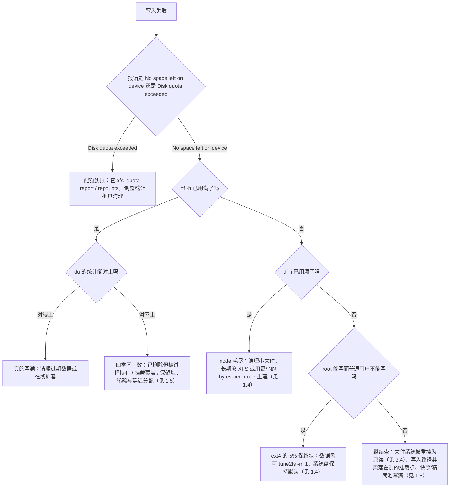

---
tags:
  - Linux
  - 存储
  - 文件系统
  - IO
  - 运维面试
created: 2026-09-16
---

# 存储与文件系统

> 本笔记对应 [[Linux/00_简介|Linux 大纲]] 的「阶段 5：存储、文件系统与 IO」。目标：能讲清「一块盘到目录」之间的每一层，能处理磁盘满、inode 满、只读文件系统、IO 变慢这四类高频故障，并且能在换盘、扩容、重建这些动作上有确定的流程。
>
> 关联复习：[[02_启动流程与内核]]（fstab 写错 = 起不来，挂载单元与 rescue）、[[03_进程与信号]]（D 状态与句柄上限）、[[04_内存管理与OOM]]（Page Cache 与脏页回写）、[[10_性能分析与排障]]（IO 瓶颈的分层定位）。
>
> 说明：命令与字段以 man 页（`e2fsck(8)`、`xfs_repair(8)`、`mdadm(8)`、`smartctl(8)`、`fio(1)`）与内核文档为准；**数字（容量、超时、阈值）都带单位并注明测试条件**，默认值一律给「查本机」的命令，因为发行版与硬件差异很大。

> [!info] 读之前：这篇笔记假设你已经具备三件事
> 1. **一台可快照的实验机并且有 root**。第 4 节的实验全部基于 loop 设备（用一个普通文件模拟磁盘），不碰真盘与生产数据，但 `losetup`/`mount`/LVM 都需要 root。
> 2. **会在 shell 里用变量传设备名**。实验之间靠 `$LOOP1` 这类变量接力，换终端、换机器或重连会话后变量就没了——第 4 节开头的「实验环境准备」写了怎么重建与统一清理。
> 3. **读过相邻两篇**：`fstab` 写错等于起不来、挂载单元与 rescue（[[02_启动流程与内核]]）、D 状态与句柄上限（[[03_进程与信号]]）。
>
> 包依赖：`parted`、`e2fsprogs`、`xfsprogs`、`lvm2`、`fio`、`smartmontools`、`sysstat`（`iostat`/`pidstat`）。**容器里做不了 loop 设备与 LVM 实验**，请用虚拟机。

## 0. 30 秒速览

> [!abstract] 这一页只要记住六句话
> 首学读不懂很正常：先跳过这一节，读完第 1、3 节再回来逐条验证——每一条都是「结论 + 一句可复现的证据」。
> - **存储是四层**：块设备 → 分区/LVM → 文件系统 → 挂载点。**`lsblk` 看设备与挂载关系，`df` 看的是文件系统容量，`du` 看的是目录树里的文件**——三个工具答的是三个不同问题，混着用就会出现「明明有空间」的争论。
> - **ext4 与 XFS 的核心差别**：ext4 的 inode 数量在 `mkfs` 时就固定了（可能 inode 耗尽），**能缩容但必须卸载且风险高**；XFS 用动态分配的 64 位 inode、**只能扩不能缩**、在线扩容非常大，所以生产上常见「XFS + LVM」的组合。
> - **「有空间却写不进去」与「`df` 和 `du` 对不上」要分清**：前者先查 inode（`df -h` 有余、`df -i` 满，小文件场景）与 ext4 为 root 保留的 5%，配额到顶同样写不进去（但报的是 `Disk quota exceeded` 而不是 `No space left on device`）；后者有四类原因——已删除但被进程持有（`lsof +L1`）、被挂载覆盖的目录、文件系统保留块、稀疏文件与延迟分配。**判据是 `df -h`、`df -i`、`du`、`lsof +L1` 一起看。**
> - **修复文件系统必须在卸载或只读挂载下做**：ext4 用 `e2fsck`、XFS 用 `xfs_repair`（**XFS 没有 fsck 的等价物，且默认不允许对已挂载的设备修复**）；动手前先备份，能重放日志就先别用强修复。
> - **IO 慢不等于盘慢**：`iostat -x` 的 `await`/`aqu-sz`/`%util` 要连起来读，**NVMe 上 `%util` 接近 100% 往往毫无意义**（多队列并行），真正的判据是延迟分位与业务表现。
> - **磁盘健康要主动看**：`smartctl -a` 的 `Reallocated_Sector_Ct`/`Current_Pending_Sector`（SATA）与 NVMe 的 `Percentage_Used`/`Available_Spare`，加上 `dmesg` 里的介质错误——**这比等到阵列降级、文件系统变只读要早得多**，而且换盘流程必须在故障前演练过。

> [!tip] 怎么用这篇笔记：分三遍读
> 全篇按难度分了两层：标 **【核心】** 的属于阶段 5 必须掌握；标 **【进阶】** 的只需要知道有这条路，用到时再回来查。
> - **第一遍（约半天，建立「盘 → 目录 → 空间账」的直觉）**：第 0 节 → 1.1 四层结构 → 1.2 ext4 与 XFS → 1.3 挂载与 fstab → 1.4 inode → 1.5 `df`/`du` → 1.6 配额 → 实验 1、2、3。这一遍全是安全实验（loop 设备 + 一个小文件系统），目标是能独立回答「有空间为什么写不进去」。
> - **第二遍（约一天，把扩容、修复与 IO 接上）**：1.7 文件系统修复 → 1.8 LVM → 1.10 IO 栈 → 1.11 `iostat` → 2.1～2.3 → 3.1～3.4 → 实验 4、6。读完应该能独立完成一次在线扩容和一次只读文件系统的取证修复。
> - **第三遍（硬件与进阶）**：1.9 RAID → 1.12 网络存储 → 1.13 磁盘健康与 SSD → 1.14 句柄与 inotify → 2.4 常见坑 → 3.5～3.8 → 实验 5。`fio` 会把设备打满，只在实验机或已下线的盘上跑。
> 面试前只看第 0 节与第 5 节的问答卡。如果只做三个实验，选实验 2（inode 耗尽）、实验 3（`df`/`du` 不一致）、实验 4（LVM 在线扩容 + 项目配额）。

## 1. 概念

> [!info]- 名词速查（读到哪里卡住，就回这里查）
> | 名词 | 一句话解释 | 在哪一节展开 |
> | --- | --- | --- |
> | 块设备 / 分区 / 逻辑卷 | 硬件或云盘的「盘」/ 盘上的分区表条目 / LVM 切出来的虚拟分区 | 1.1 |
> | GPT / MBR | 现代分区表（Linux 默认 128 个分区）/ 旧分区表（4 个主分区、单盘 2TB 上限） | 1.1 |
> | 文件系统 / 挂载点 | 管理 inode 与块的软件层 / 把文件系统接到目录树上的位置 | 1.1、1.3 |
> | inode | 文件的元数据（权限、时间、块指针），每个文件/目录占一个；ext4 上数量固定 | 1.4 |
> | 保留块 | ext4 默认留给 root 的 5% 空间，普通用户写不进去 | 1.4 |
> | 稀疏文件 / 延迟分配 | 表观大小远大于实际占用 / 数据先写缓存、稍后才分配块 | 1.5 |
> | 项目配额（project quota） | 把「一个目录树」而不是某个用户作为配额对象 | 1.6 |
> | 超级块 / 日志重放 | 文件系统的元数据总账 / 崩溃后靠日志恢复一致性的过程 | 1.7 |
> | PV / VG / LV | 物理卷 / 卷组 / 逻辑卷，LVM 的三层结构 | 1.8 |
> | thin pool | 允许超配的精简置备池，写满会波及池内所有卷 | 1.8 |
> | RAID / 重建 | 多盘冗余阵列 / 用冗余数据恢复缺失盘内容的过程 | 1.9 |
> | URE | 厂商标称的不可恢复读错误率（如 1 次/10¹⁴ 比特），直接决定重建失败概率 | 1.9 |
> | write hole | RAID5/6 掉电后校验与数据可能不一致的问题 | 1.9 |
> | blk-mq / IO 调度器 | 多队列块层框架 / 决定请求合并与排序的策略（`none`、`mq-deadline`、`kyber`、`bfq`） | 1.10 |
> | `await` / `aqu-sz` / `%util` | 平均完成时间（含排队）/ 平均队列深度 / 设备处于忙状态的时间比例 | 1.11 |
> | NFS `hard` / `soft` | 服务端不可达时无限重试（进程卡 D）/ 超时返回错误（可能数据不一致） | 1.12 |
> | multipath | 同一存储的多条路径聚合与故障切换 | 1.9、1.12 |
> | TRIM / `fstrim` | 告诉 SSD 哪些块已无效 / 定期批量下发 TRIM | 1.13 |
> | TBW / DWPD | 寿命标称：总写入字节数 / 每天可全盘写入的次数 | 1.13 |
> | inotify | 文件事件监控机制，有 watch 数量与事件队列上限 | 1.14 |

### 1.1 从块设备到目录：四个层次【核心】

| 层 | 是什么 | 看它的工具 | 典型操作 |
| --- | --- | --- | --- |
| 块设备 | 物理盘、云盘、NVMe、RAID 逻辑盘（`/dev/sda`、`/dev/nvme0n1`、`/dev/md0`） | `lsblk -d`、`lsblk -d -o NAME,ROTA,SIZE,MODEL` | 分区、加阵列、下线换盘 |
| 分区/卷 | 分区表（GPT/MBR）、LVM 逻辑卷（`/dev/mapper/vg-lv`） | `lsblk`、`blkid`、`pvs/vgs/lvs` | 扩分区、扩 LV |
| 文件系统 | ext4/XFS 等，管理 inode、块、日志 | `df -hT`、`df -i`、`tune2fs -l`、`xfs_info` | 创建、扩容、修复 |
| 挂载点 | 把文件系统接到目录树上的位置 | `findmnt`、`mount`、`/proc/mounts` | fstab 配置、只读重挂 |

三个工具回答的是三个不同的问题，**先把它们对齐**——后面所有「空间对不上」的争论都源于混用：

| 工具 | 它看的是什么 | 回答什么问题 | 什么时候会误导 |
| --- | --- | --- | --- |
| `lsblk` | 设备 → 分区 → 挂载点这棵树 | 这块盘分了几个区、挂到哪了 | 不显示容量使用率 |
| `df` | 文件系统的账本（超级块记账） | 这个挂载点还剩多少空间与 inode | 已删除但仍被进程持有的文件照样算进去，`du` 却找不到（见 1.5） |
| `du` | 目录树里每个文件的实际占用 | 空间被谁吃掉了 | 看不到被挂载覆盖的旧内容，对稀疏文件按实际块数算（见 1.5） |

几个必须记住的边界：

- **同一个文件系统可以挂到多个点**（bind mount），**一个设备也可以完全没挂载**——「设备数」与「挂载点数量」没有一一对应关系（对照上表）。
- **GPT 与 MBR**：MBR 最多 4 个主分区、单盘上限 2TB；GPT 支持 128 个分区（Linux 默认）与更大容量，现代系统（UEFI 或 >2TB 的盘）一律用 GPT。
- **一律用 UUID 或 LABEL 挂载，不用 `/dev/sdX`**：设备名会随插槽、控制器、云盘挂载顺序变化，这是「重启后挂载错盘」的经典原因（见 1.3 与 [[02_启动流程与内核]]）。

```text
lsblk -o NAME,SIZE,TYPE,FSTYPE,MOUNTPOINT,ROTA,MODEL     # 验证：设备/分区/文件系统/挂载点一屏看全（ROTA=1 为机械盘）
lsblk -d -o NAME,ROTA,SIZE,MODEL | grep -v loop          # 验证：物理盘清单（HDD/SSD 与型号）
blkid                                   # 验证：每个文件系统的 UUID、TYPE、LABEL（fstab 的取值来源）
findmnt -o TARGET,SOURCE,FSTYPE,OPTIONS  # 验证：当前挂载关系与挂载参数（比 mount 输出更好读）
parted -l                               # 验证：分区表类型（gpt/msdos）与分区起止扇区
```

> 对应实验：第 4 节**实验 1**（用 loop 设备搭一套「环设备 → 分区 → 文件系统 → 挂载点」，把这张表看出实物）。

### 1.2 ext4 与 XFS：选型与差异【核心】

| 维度 | ext4 | XFS |
| --- | --- | --- |
| inode | **创建文件系统时按固定数量分配**（`df -i` 能看到总量），可事后用 `tune2fs` 调整部分参数 | **动态分配**，不预先固定数量，几乎没有「inode 耗尽」概念（除非 `maxpct`/`imaxpct` 限制） |
| 缩容 | **支持，但必须卸载**（`resize2fs`），且风险高 | **完全不支持缩容**（只能备份 → 重建 → 恢复） |
| 扩容 | 支持在线扩容（挂载状态下 `resize2fs`） | 支持在线扩容（挂载状态下 `xfs_growfs`），可扩到很大 |
| 空间预留 | 默认**为 root 保留 5%**（`mke2fs -m` 可改，`tune2fs -m` 可后调） | 无 5% 预留概念；`df` 与 `du` 的差异另有原因（见 1.5） |
| 典型用途 | 系统盘、通用场景、需要小文件与灵活 rescale 的场景 | 大容量数据盘、日志盘、容器存储后端、需要海量 inode 的场景 |
| 修复工具 | `e2fsck` | `xfs_repair`（**不能对已挂载的 XFS 使用**） |
| 常用查询 | `tune2fs -l /dev/xxx`、`dumpe2fs -h` | `xfs_info /挂载点`、`xfs_db` |

生产上常见的组合是 **「XFS + LVM」**：LVM 负责在线扩容量，XFS 负责在线扩容文件系统——因为这个组合里**没有任何一步需要缩容**，正好绕开两者的短板。反过来，如果业务真的需要「缩容」，只有 ext4 能配合 LVM 做到，而且必须停机卸载。

```text
df -hT                                  # 验证：文件系统类型与容量（先确认是 ext4 还是 xfs）
df -i                                   # 验证：inode 使用率（ext4 要重点看这一列）
tune2fs -l /dev/<dev> | grep -E 'Block count|Reserved block count|Inode count|Filesystem features'
                                        # 验证：ext4 的块数、预留块数、inode 总数与特性
xfs_info /mountpoint                    # 验证：XFS 的块大小、inode 分配策略、日志设备等信息
```

### 1.3 挂载与 `/etc/fstab`【核心】

`/etc/fstab` 只有六个字段，但每一列都能让机器起不来：

```text
# <device>                          <mount point>  <type>  <options>                  <dump> <pass>
UUID=3f7a1c9e-...                   /data          xfs     defaults,nofail,_netdev    0      0
```

| 字段 | 要点 |
| --- | --- |
| 设备 | **用 `UUID=` 或 `LABEL=`**，不要用 `/dev/sdX`；云盘热插拔、控制器变化都会让设备名漂移 |
| 挂载点 | 目录必须已存在；注意**挂载会覆盖目录原有内容**（见 1.5 的第 2 类不一致） |
| 类型 | `ext4`、`xfs`、`nfs`、`tmpfs`、`swap`… |
| 选项 | 见下表，生产上最重要的几个是 `nofail`、`_netdev`、`errors=`、`noatime` |
| `dump` | 历史字段，现代系统填 `0` |
| `pass` | `fsck` 顺序：根文件系统为 `1`，其他为 `2`，不检查为 `0`（XFS 通常填 0） |

| 常用挂载选项 | 语义 | 什么时候必须用 |
| --- | --- | --- |
| `defaults` | `rw,suid,dev,exec,auto,nouser,async` 的简写 | 通用 |
| `nofail` | 设备不存在/挂载失败**不阻塞启动** | 数据盘、可选盘必加；少加一个就能把「一块盘掉线」升级成「机器起不来」 |
| `_netdev` | 标记为网络文件系统，systemd 会把它排在网络就绪之后 | NFS/iSCSI/云文件存储必须用 |
| `x-systemd.device-timeout=10s` | 等设备的最长时间 | 与 `nofail` 搭配，避免默认超时拖慢启动 |
| `noatime` | 不更新访问时间，减少元数据写入 | 大文件/高并发读场景的常规优化（默认是 `relatime`，已比 `atime` 省很多） |
| `errors=remount-ro` / `errors=panic`（**ext4 专有**） | 检测到错误时的动作：重挂为只读 / 触发 panic（配合 kdump 取证） | 数据盘常见 `remount-ro`；XFS 没有同名选项，出错时的行为由文件系统自身策略决定 |
| `noexec`、`nosuid`、`nodev` | 禁止执行、忽略 SUID、禁止设备文件 | 数据盘与上传目录的安全基线 |
| `discard`（SSD） | 删除时立即下发 TRIM | 见 1.13：通常更推荐 `fstrim.timer` 定期批量执行 |

几个实操要点：

- **改完 fstab 一定要先验证再重启**：`mount -a` 能立刻暴露语法与设备名错误；`findmnt --verify` 可以专门校验 fstab 的可挂载性。这是「重启起不来」的头号原因（参见 [[02_启动流程与内核]]）。
- **systemd 会把 fstab 翻译成 mount unit**：`/data` 对应 `data.mount`，`/mnt/disk1` 对应 `mnt-disk1.mount`；出问题可以 `systemctl status <name>.mount`、`journalctl -u <name>.mount`、`systemd-analyze blame | grep mount`。改完 fstab 需要 `systemctl daemon-reload`。
- **`x-systemd.*` 是 systemd 对 fstab 的扩展**（`x-systemd.automount`、`x-systemd.requires=`、`x-systemd.after=` 等）：用 automount 可以做到「首次访问才挂载」，适合冷数据盘。
- **`nofail` 与 `_netdev` 是两张不同的保单**：前者保证「挂不上也能开机」，后者保证「网络就绪再挂载」。两块都要，缺一块就可能出现启动卡 90 秒（`A start job is running for ...`）甚至进 emergency。

```text
mount -a                                # 验证：fstab 里所有条目能否挂上（不重启就能发现错误）
findmnt --verify --verbose              # 验证：逐条检查 fstab 语法与可挂载性
findmnt -o TARGET,SOURCE,FSTYPE,OPTIONS # 验证：当前实际挂载参数（比 /proc/mounts 好读）
systemctl list-units --type=mount       # 验证：fstab 生成的挂载单元及其状态
journalctl -u data.mount -b             # 验证：某个挂载单元本次启动的日志（挂载失败看这里）
```

### 1.4 inode 与「明明有空间却写不进去」【核心】

inode 存的是**元数据**（权限、属主、时间戳、块指针、链接数…），**每个文件/目录都要占一个**。ext4 的 inode 总数在 `mkfs` 时就定死了，所以「块还剩很多、inode 用光了」是 ext4 上非常经典的故障：

| 现象 | 判据 | 说明 |
| --- | --- | --- |
| 写文件报 `No space left on device` | `df -h` 有余量、**`df -i` 接近 100%** | inode 耗尽，小文件（缓存、session、mail spool、tmp 小文件）是元凶 |
| root 能写、普通用户不能写 | `df` 的 Available 已经扣掉了保留块 | ext4 默认**为 root 保留 5% 的空间**（`mke2fs -m`，默认值就是 5%） |
| `df` 显示 100% 但实际没写满 | `df` 的 `Use%` 是按「总块数 − 保留块」算的 | 保留块对普通用户不可见，属于设计而非 bug |

```text
df -h                                   # 验证：容量视角
df -i                                   # 验证：inode 视角（ext4 必看，XFS 一般不是问题）
du --inodes -s /var/* 2>/dev/null | sort -rn | head -10       # 验证：按 inode 数找出「文件最多的目录」
find /var -xdev -type f | wc -l         # 验证：某个文件系统上的文件总数（确认是不是海量小文件）
tune2fs -l /dev/<dev> | grep -E 'Inode count|Free inodes|Reserved block count|Block count'
                                        # 验证：ext4 的 inode 总量/剩余与保留块（确认是 inode 满还是保留块作怪）
```

治理思路：先删/归档海量小文件（并按业务补上过期清理），确属长期需求就**换用 XFS**（动态 inode）或用更小的 `bytes-per-inode` 重建（`mke2fs -i 4096` / `-T small`，代价是 inode 表占用更多空间）。给数据盘把保留块从 5% 调到 1%（`tune2fs -m 1`）很常见，但**系统盘不要动**——那 5% 是留给 root 与系统守护进程在磁盘写满时自救的。

> 「有空间却写不进去」还有第三类原因：**配额到顶**（下一节）。它报的错误是 `EDQUOT`/`Disk quota exceeded`，与 `No space left on device` 不是同一个 errno，所以排查时要主动问一句「这个目录有没有配额」。

> 对应实验：第 4 节**实验 2**（把 inode 造到耗尽，看 `df -h` 有余而 `df -i` 满）。

### 1.5 `df` 与 `du` 对不上：四类原因【核心】

| 原因 | 现象 | 怎么确认 | 怎么处理 |
| --- | --- | --- | --- |
| **已删除但仍被进程持有** | 删了大文件，`df` 不降；`du` 找不到它 | `lsof +L1`、`ls -l /proc/<pid>/fd \| grep deleted` | 重启/重载对应进程即释放；紧急情况下可用 `: > /proc/<pid>/fd/<n>` 截断（**要评估数据风险**） |
| **被挂载覆盖的目录** | 挂载了新盘到 `/data`，之前 `/data` 里的内容「消失」 | `mount --bind / /mnt/root` 后到 `/mnt/root/data` 用 `du` 看 | 先卸载露出原内容，再清理或迁移 |
| **文件系统保留块** | ext4 上 `df` 与实际可写量差 5% | `tune2fs -l \| grep -i reserved` | 数据盘可 `tune2fs -m 1`；系统盘保持默认 |
| **稀疏文件与延迟分配** | `du` 明显小于 `df`（如虚拟机镜像、数据库文件） | `du -h --apparent-size` 与 `du -h` 对比 | 属正常现象；容量预估要按**表观大小**算 |

```text
lsof +L1 | head -20                     # 验证：所有「已删除但仍被打开」的文件（第一类）
ls -l /proc/<pid>/fd | grep deleted     # 验证：某个进程持有的已删除文件
du -h --apparent-size <file>; du -h <file>   # 验证：稀疏文件的表观大小 vs 实际占用
df -h <挂载点>; df -i <挂载点>          # 验证：把容量与 inode 两个视角并排看
```

这里的四类不一致只是「写不进去」这条线索里的一个分支。完整的判定树（容量 → inode → 配额 → 保留块/只读/写到了别的挂载点）放在 3.1，每一步都对应一条命令——**这也是面试里最容易被追问细节的一道题**：能把「先看哪个、再看哪个、每步用什么证明」讲清楚，比背一堆命令更能说明经验。

> 对应实验：第 4 节**实验 3**（亲手制造「已删除但被进程持有」与「被挂载覆盖的目录」两类现场）。

### 1.6 配额治理：为什么共享目录必须有容量上限【核心】

「谁写满算谁的」在共享目录、上传目录、多租户与容器日志目录上是不可接受的——单个租户把盘写满，等于整机故障。配额就是给这类场景加边界的标准手段：

| 文件系统 | 启用方式 | 常用命令 |
| --- | --- | --- |
| ext4 | 挂载参数 `usrquota`/`grpquota`（或用 `tune2fs -O quota` 创建配额文件） | `quotaon`、`setquota`、`edquota`、`repquota -a` |
| XFS | 挂载参数 `uquota`/`gquota`/**`prjquota`**：**记账必须在挂载时打开**，挂载后只能用 `xfs_quota -x -c 'enable'`/`'disable'` 开关「强制」 | `xfs_quota -x -c 'report -h' /mnt`、`xfs_quota -x -c 'project -s -p <path> <id>' /mnt`、`xfs_quota -x -c 'limit -p bhard=500g <id>' /mnt` |

```text
mount | grep -E 'quota'                 # 验证：当前挂载是否启用了配额（XFS 看有没有 prjquota）
repquota -a                             # 验证：ext4 上的用户/组配额使用情况
xfs_quota -x -c 'report -h' /data       # 验证：XFS 的用户/组/项目配额报表
xfs_quota -x -c 'project -s -p /data/tenantA 1001' /data   # 验证：把目录绑定到项目配额 ID
xfs_quota -x -c 'limit -p bhard=500g 1001' /data           # 验证：给该项目设 500GB 硬上限
```

配额的三个实践要点：**优先用项目配额给目录设边界**（与业务目录一一对应，比按用户分配更好管理）；**留出缓冲**（软限制 + 宽限期，让业务有机会清理）；**把配额使用率纳入监控**（否则配额只是把「写满整盘」换成了「写满自己的配额」，业务照样挂）。

> [!important] 配额到顶报的不是 `No space left on device`
> 写穿硬配额时内核返回的是 `EDQUOT`，工具显示为 **`Disk quota exceeded`**——与容量耗尽的 `ENOSPC` 是两个不同的 errno。所以「写不进去」的排查里，配额必须单独问一句；反查用 `xfs_quota -x -c 'report -h'` 或 `repquota -a`。

> 对应实验：第 4 节**实验 4**（XFS + LVM 上给一个目录设 100MB 项目配额，写到超限为止）。

### 1.7 文件系统修复：为什么必须卸载，怎么修才安全【核心】

**原理**：`e2fsck`/`xfs_repair` 直接改写文件系统的元数据结构；如果此时文件系统还挂着（可写），内核的缓存与修复工具的改写会互相覆盖，结果是「修完更坏」。所以修复的基本前提是：**能卸载就卸载；不能卸载就先切走业务再卸载**。

| 文件系统 | 检查/修复工具 | 关键约束 |
| --- | --- | --- |
| ext4 | `e2fsck`（`fsck` 是它的前端） | 可写挂载时拒绝运行；`-n` 只读检查、`-p` 自动修复安全项、`-y` 全部回答 yes、`-f` 强制检查、`-b 32768` 使用备用超级块 |
| XFS | `xfs_repair` | **不能对已挂载的设备运行**；先 `xfs_repair -n` 干跑检查；`-L` 会丢弃日志（**有数据丢失风险**，只在日志损坏且已备份时用） |
| 只读挂载状态 | 保守做法仍是卸载 | 发行版对「只读挂载下能否检查」的说明不完全一致，**最稳的是卸载**；XFS 尤其不要抱侥幸 |

安全修复顺序（背下来）：

1. **先备份再动手**：块级快照（云盘快照 / LVM 快照）或 `dd` 镜像；`xfs_metadump`/`e2image` 可留元数据副本。
2. **取证**：`dmesg -T | tail -50`、`journalctl -k`，确认是介质错误、日志损坏还是元数据损坏。
3. **干跑检查**：`e2fsck -n <dev>` 或 `xfs_repair -n <dev>`，把输出记下来（很多情况下「日志重放」就能解决，不需要强修复）。
4. **正式修复**：ext4 用 `e2fsck -f`（有问题时再考虑 `-y`/备用超级块）；XFS 用 `xfs_repair <dev>`。
5. **重新挂载并验证**：先只读挂载核对数据，再改回可写；把过程写进故障记录。

```text
umount /data                            # 验证：卸载（用 fuser/lsof 找占用者）
e2fsck -n /dev/<dev>                    # 验证：ext4 只读检查，先看问题规模（不修改任何东西）
e2fsck -f /dev/<dev>                    # 验证：ext4 强制检查（真正修复；必要时加 -y）
xfs_repair -n /dev/<dev>                # 验证：XFS 干跑检查
xfs_repair /dev/<dev>                   # 验证：XFS 正式修复（慎用 -L，仅日志损坏且已备份时）
tune2fs -l /dev/<dev> | grep -E 'Maximum mount count|Check interval'
                                        # 验证：ext4 的自动检查策略（默认值随发行版与创建方式不同）
```

> [!warning] 文件系统变成只读时，第一件事绝不是 `mount -o remount,rw`
> ext4 的默认策略是 `errors=remount-ro`：**内核检测到错误后主动把文件系统重挂为只读**，这是保护数据的设计。此时重新挂回可写，等于让内核带着已知损坏继续写。
> 正确顺序：取证（`dmesg -T`、`journalctl -k`）→ 切走业务/停止写入 → 卸载 → 修复 → 只读挂载核对 → 恢复写。同时要判断根因是**介质故障**（见 1.13）还是**元数据损坏**，前者必须先换盘。

> 对应实验：第 4 节**实验 6**（`e2fsck -n` 干跑检查 + 只读挂载核对，顺便看 `xfs_repair` 对已挂载设备如何拒绝）。

### 1.8 LVM：为什么生产上几乎都用它【核心】

LVM 在物理盘与文件系统之间插了一层 device-mapper，换来三件事：**在线扩容量、跨盘拼容量、快照**。

| 概念 | 含义 | 关键命令 |
| --- | --- | --- |
| PV（物理卷） | 被 LVM 接管的盘/分区 | `pvcreate`、`pvs`、`pvresize` |
| VG（卷组） | 由若干 PV 组成的容量池 | `vgcreate`、`vgextend`、`vgs` |
| LV（逻辑卷） | 从 VG 里切出来的「虚拟分区」 | `lvcreate`、`lvextend`、`lvreduce`、`lvs` |

**在线扩容的完整链路**（云盘扩容后同样适用）：

```text
# 1) 加新盘/云盘扩容后，先让内核看到新容量
lsblk                                   # 验证：设备容量是否已变大
# 2) 新盘加入卷组（或在同一块盘扩容场景下调整 PV 大小）
pvcreate /dev/sdb                       # 新盘
vgextend vg0 /dev/sdb                   # 验证：vgs 的 VFree 增加
pvresize /dev/sda3                      # 云盘原地扩容时：让 PV 感知新增空间
# 3) 扩逻辑卷并同步扩文件系统
lvextend -r -L +50G /dev/vg0/lv_data    # -r 会在扩 LV 后自动扩文件系统
#    等价于分两步：
#    lvextend -L +50G /dev/vg0/lv_data
#    resize2fs /dev/vg0/lv_data         # ext4：参数是设备
#    xfs_growfs /data                   # XFS：参数是【挂载点】，不是设备（最常见的记混点）
# 4) 验证
lvs -o+lv_size,data_percent; df -h /data
```

快照的用途与代价必须讲清楚：

- **原理是 COW**：快照本身不复制数据，原卷后续被写入时，旧块才被复制到快照空间。所以**快照会随原卷的写入量增长**，写得多就涨得快。
- **代价**：原卷写入时多一次复制（写放大、性能下降）；快照空间用满会**直接失效**（`lvs` 显示 `snapshot invalid`），不再是「可回滚的副本」。
- **正确用法**：备份窗口内做一份短命快照，备份完成即删除；**不要当长期备份**（同一块盘的快照救不了盘坏、误删覆盖整盘、勒索加密这些场景）。
- **thin pool 的风险**：thin provisioning 允许超配（LV 声明 1TB、池子只有 200GB），一旦池子写满，**组内所有卷都会出问题**（常见是变只读）。必须监控 `data_percent`/`metadata_percent` 并留余量。

```text
pvs; vgs; lvs                           # 验证：PV/VG/LV 三层视图（含剩余容量）
lvs -o+lv_size,data_percent,metadata_percent   # 验证：thin pool 的水位（超配场景必看）
lvdisplay /dev/vg0/lv_data              # 验证：单个 LV 的大小、路径与状态
dmsetup ls --tree                       # 验证：device-mapper 视角的映射关系
vgcfgbackup -f /root/vg0-$(date +%F).bak   # 验证：备份 LVM 元数据（改结构前的标准动作）
```

> 对应实验：第 4 节**实验 4**（loop 上建 VG/LV → XFS → 在线扩容 → 快照 → 项目配额）。

### 1.9 RAID 与阵列：容量、性能与重建风险【核心】

| 级别 | 可用容量 | 冗余 | 读/写性能 | 重建时的风险 |
| --- | --- | --- | --- | --- |
| RAID0 | `n ×` | 无 | 最好（顺序与随机都接近线性） | 一块坏，全盘数据丢失 |
| RAID1 | `n/2 ×`（镜像） | 可容忍 `n/2` 块（同一镜像组各留一块） | 读提升、写略降 | 只需复制一份数据，压力最小 |
| RAID5 | `(n−1) ×` | 单盘冗余 | 读较好、**写有惩罚**（每次写涉及读改写与校验更新） | **重建要读全部数据盘**，遇到不可恢复读错误即失败；另有 write hole 问题 |
| RAID6 | `(n−2) ×` | 双盘冗余 | 写惩罚更高 | 重建压力与 RAID5 同量级，但允许再坏一块 |
| RAID10 | `n/2 ×` | 视镜像组而定 | 好（兼顾随机读写） | 只重建对应镜像，速度快、风险低；代价是容量利用率只有一半 |

**重建风险要有量化的说法**（面试加分点，注意单位是比特）：

- 厂商标称的不可恢复读错误率（URE）一般写作 **1 次 / 10¹⁴ 比特（消费级）** 或 **1 次 / 10¹⁵ 比特（企业级）**。
- 重建一块 10TB 盘需要读约 `8 × 10¹³` 比特。按 `P ≈ 1 − e^(−读取量/URE 分母)` 估算：消费级约 **55%**、企业级约 **8%** 会遇到至少一次不可恢复读错误。
- 这是**数量级估算**，实际还取决于厂商标称口径、盘龄、阵列能否用其他盘的数据纠错（RAID6/RAID10 的容错更好）。但它解释了为什么「大容量盘 + RAID5」在生产上越来越不受欢迎。

还有两条必须记住的判断：

- **RAID 不是备份**：它只防「盘坏了」，不防误删、勒索加密、逻辑损坏、机房级故障——这些会被阵列忠实地同步到所有盘上。
- **重建期间的性能与风险是叠加的**：阵列降级 + 全盘扫描重建 + 业务高峰期 = 双重风险，所以生产上要**给重建限速**并在必要时主动降业务压力。

```text
cat /proc/mdstat                        # 验证：阵列状态、成员盘（[U] 为正常、[_] 为缺失）与重建进度
mdadm --detail /dev/md0                 # 验证：RAID 级别、chunk 大小、bitmap、每块盘的角色
cat /proc/sys/dev/raid/speed_limit_min /proc/sys/dev/raid/speed_limit_max
                                        # 验证：重建速度下限/上限（KB/s，重建期间可调）
mdadm /dev/md0 --fail /dev/sdb1 --remove /dev/sdb1 --add /dev/sdc1
                                        # 验证：坏盘下线 + 新盘加入重建的完整动作
multipath -ll                           # 验证：iSCSI/FC 多路径设备及其路径状态（active/ghost/failed）
```

硬件 RAID 与软件 RAID（`mdadm`）的差别主要在「谁负责」：硬件 RAID 由控制器管理，OS 只看到一块逻辑盘，**监控必须靠厂商工具**（`storcli`/`perccli`/`ssacli` 等）看物理盘、缓存与电池（BBU/电容）状态；软件 RAID 的一切都在 OS 里，便于统一监控但也多一层 CPU 开销与运维面。两者都要把「**重建进度**」和「**电池/缓存状态**」纳入监控，否则掉电时写缓存策略会成为数据一致性的隐患。

> 本节没有配套实验：RAID 演练至少需要 3 块独立盘（loop 设备做不出真实的重建压力），建议在单独的实验虚拟机里用 `mdadm` 完整走一遍「降级 → 限速重建 → 换盘」的流程（见 3.7）。

### 1.10 IO 栈与调度器【核心】

一次 IO 的路径：应用 → 系统调用 → VFS → 文件系统（可能触发回写）→ Page Cache → **块层（blk-mq 多队列）→ IO 调度器 → 设备驱动 → 硬件（含阵列卡缓存）**。理解这条链的意义在于：**任何一个环节都能成为瓶颈，而 `iostat` 只能看到最底层的表现**。

介质量级（仅供建立直觉，**具体数值随型号差异极大，必须以 `fio` 实测为准**）：

| 介质 | 随机 IOPS（4K） | 顺序带宽 | 典型延迟 |
| --- | --- | --- | --- |
| 机械盘（7200rpm） | 约 100～200 | 约 150～250MB/s | 毫秒级（含寻道） |
| SATA SSD | 约 1 万～10 万 | 约 500MB/s 量级（受 SATA 限制） | 百微秒级 |
| NVMe SSD | 十万～百万级 | GB/s 级 | 几十～几百微秒 |

IO 调度器（blk-mq 时代的四种，**以 `/sys/block/<dev>/queue/scheduler` 为准**）：

| 调度器 | 适用场景 | 说明 |
| --- | --- | --- |
| `none` | NVMe、低延迟设备、阵列卡自带调度 | 直通，不做合并/排序，交给硬件 |
| `mq-deadline` | 通用（SATA/SAS、机械盘常见默认） | 给请求设置延迟上限，避免饿死 |
| `kyber` | 快速设备 | 以读/写延迟目标为调度依据 |
| `bfq` | 桌面/交互与公平性 | 按 cgroup/进程公平分配带宽，吞吐略低 |

老一代的 `cfq`/`deadline`/`noop`（单队列时代的调度器）在多队列（blk-mq）架构下已不再提供，**RHEL 8/9 上能选的就是上面这四种**（`none`/`mq-deadline`/`kyber`/`bfq`）；RHEL 9 文档给出的默认值是「NVMe 用 `none`、其它块设备用 `mq-deadline`」，改之前先确认本机现状。

```text
cat /sys/block/<dev>/queue/scheduler     # 验证：当前调度器与可选值（中括号内为当前值）
lsblk -o NAME,TYPE,SIZE,ROTA,SCHED       # 验证：设备类型与调度器一览（较新 util-linux 支持 SCHED 列）
cat /sys/block/<dev>/queue/nr_requests   # 验证：队列深度（块层的排队上限）
cat /sys/block/nvme0n1/queue/nr_requests
echo mq-deadline > /sys/block/<dev>/queue/scheduler   # 验证：临时切换（重启失效，需用 udev 规则持久化）
fio --name=randread --ioengine=libaio --direct=1 --rw=randread --bs=4k \
    --iodepth=32 --numjobs=4 --size=4G --runtime=60 --group_reporting
                                        # 验证：随机读 IOPS 与延迟分布（基线要记录 iodepth/numjobs/bs 等条件）
fio --name=seqwrite --ioengine=libaio --direct=1 --rw=write --bs=1M \
    --iodepth=8 --numjobs=1 --size=8G --runtime=60 --group_reporting
                                        # 验证：顺序写带宽（机械盘与 SSD 差异最大的项目）
```

> [!important] 建立 IO 基线是「磁盘变慢」这类问题的前提
> 没有基线时，「磁盘慢」只能是感觉；有基线（`fio` 的 IOPS/带宽/延迟分位 + 当时的队列深度与块大小）时，才能说清「从 X 掉到 Y，发生在哪个时间点」。**基线要连同硬件型号、RAID 级别、文件系统与挂载参数一起记录**，否则前后不可比。
> 注意：`fio` 会打满设备，**只能在实验机或已下线的盘上跑**；生产上优先用历史监控数据与 `iostat` 采样复盘。

> 对应实验：第 4 节**实验 5**（在 loop 上用 `fio` 跑一组基线，同时用 `iostat` 对照读指标）。

### 1.11 IO 观测：`iostat` 各列怎么读【核心】

```text
iostat -x 1 5                           # 验证：每秒采样的扩展指标（重点看 await / aqu-sz / %util）
iostat -x -m 1                          # 验证：以 MB/s 为单位输出，便于与业务吞吐对齐
pidstat -d 1 5                          # 验证：进程级读写速率（kB_rd/s、kB_wr/s）
iotop -oPa                              # 验证：只有实际产生 IO 的进程（-a 累计、-P 只看进程）
blktrace -d /dev/sda -o - | blkparse -i -      # 验证：块设备的请求级追踪（Q→G→I→D→C 各阶段耗时）
```

| 列 | 含义 | 怎么解读 |
| --- | --- | --- |
| `r/s`、`w/s` | 每秒完成的读/写请求数 | 与 IOPS 对照；注意合并后的请求大小 |
| `rkB/s`、`wkB/s` | 每秒读写量 | 与业务吞吐对齐的重要一列 |
| `await` | 平均完成时间（毫秒，**含排队时间**） | 与设备基线对比；显著高于基线说明排队或设备退化 |
| `r_await` / `w_await` | 读写分别的 await | 读慢与写慢的根因经常不同（写还牵涉回写与阵列缓存） |
| `aqu-sz`（旧名 `avgqu-sz`） | 平均队列深度（未完成请求数） | **与 await 一起看**：两者同涨 = 排队；await 涨而队列浅 = 设备本身慢 |
| `%util` | 设备忙于处理 IO 的时间比例 | **单队列设备上接近 100% 基本等于饱和；NVMe 多队列上经常 100% 却远未饱和** |
| `rareq-sz`/`wareq-sz` | 平均请求大小 | 判断是随机小 IO 还是顺序大 IO |
| `svctm` | 已废弃 | **不要再用它下结论**（sysstat 文档已标注不可靠） |

**定位到具体进程与文件**的顺序：

1. `iostat -x` 找到哪块盘、什么模式（随机/顺序、读/写）；
2. `iotop -oPa` 或 `pidstat -d` 找到哪个进程；
3. 进程内部到文件一级：`lsof -p <pid>` 看打开的文件，或用 eBPF/`blktrace` 做请求级关联（`biosnoop`/`biolatency` 一类工具能直接把 IO 延迟与进程、设备对上）。

```text
bpftrace -e 'tracepoint:block:block_rq_issue { @[comm] = count(); }'
                                        # 验证：按进程统计块设备请求数（需要 bpftrace 与相应内核权限）
cat /proc/<pid>/io                      # 验证：单进程累计读写字节（read_bytes/write_bytes 为真实落盘量）
```

> 对应实验：第 4 节**实验 5**（同一组数字，练习「一边压、一边读」）。

### 1.12 网络存储：NFS 与多路径【进阶】

网络存储把「本地 IO 快慢」变成了「本地 IO + 网络 + 对端存储」的联合问题，其中最坑的是**挂载点卡死导致进程进 D 状态**（与 [[03_进程与信号]] 的 3.1 直接相关）。

| 方案 | 关键选项 | 风险与处置 |
| --- | --- | --- |
| NFS | `hard`（默认）与 `soft`、`timeo=`、`retrans=`、`_netdev`、`nofail`、`x-systemd.automount` | `hard` 挂载在服务端不可达时会让访问进程**一直重试并卡在 D 状态**（`kill -9` 无效）；先恢复网络/服务端，或评估风险后用 `umount -f`/`-l`，最后手段是重启 |
| NFS（`soft`） | 超时后返回错误 | 换来「不卡死」，代价是**可能产生数据不一致**，一般只用于只读或可重试场景 |
| iSCSI | `iscsiadm` 发现与登录、`/etc/iscsi/` | 配合 dm-multipath 做路径冗余；单路径故障时 IO 会停顿，配置不当还会出现 `queue_if_no_path` 导致 IO 永久挂起 |
| FC / 企业存储 | 由 HBA 与 `multipath` 管理 | `multipath -ll` 看路径状态，路径切换瞬间的 IO 停顿要纳入业务超时设计 |

```text
mount | grep nfs                        # 验证：NFS 挂载点与实际生效参数（hard/soft、timeo 等）
nfsstat -m /mnt/nfs                      # 验证：每个 NFS 挂载点的版本、传输协议与参数
nfsstat -rc                              # 验证：NFS 客户端重传与错误计数（网络抖动会体现在这里）
multipath -ll                            # 验证：多路径聚合状态、每条路径的状态与优先级
iscsiadm -m session -P 3                 # 验证：iSCSI 会话与设备映射详情
```

> 本节没有配套实验：NFS 卡死与多路径切换要在两台机器之间制造「服务端不可达」，建议单独演练（处置顺序见 3.5）。

### 1.13 磁盘健康与 SSD 维护【核心】

**主动巡检的价值**：`smartctl` 的介质错误计数与内核日志的 `I/O error` 通常**早于**阵列降级、文件系统变只读出现，是最便宜的一次预警。

| 类型 | 关键字段 | 含义与判断 |
| --- | --- | --- |
| 机械盘 / SATA SSD | `Reallocated_Sector_Ct`（ID 5） | 已重映射扇区数，**增长即为坏信号**（不是「有值就立刻坏」，看趋势） |
| | `Current_Pending_Sector`（197） | 待处理的不可读扇区，**大于 0 就要重点关注** |
| | `Offline_Uncorrectable`（198） | 离线扫描无法纠正的扇区 |
| | `UDMA_CRC_Error_Count`（199） | 通常指向**线缆/背板/接口**问题，而不是盘本身 |
| NVMe | `Percentage_Used` | 寿命消耗百分比（超过厂商阈值即应计划替换） |
| | `Available_Spare` | 备用块余量，低于厂商阈值会出现在 `Critical_Warning` |
| | `Media_and_Data_Integrity_Errors` | 数据完整性错误计数（非 0 要立刻查） |
| | `Unsafe_Shutdowns` | 异常掉电次数，指向电源/固件问题 |

```text
smartctl -H /dev/sda                    # 验证：SMART 总健康判定（PASSED/FAILED）
smartctl -a /dev/sda | grep -E 'Reallocated_Sector_Ct|Current_Pending_Sector|Offline_Uncorrectable|UDMA_CRC_Error_Count|Temperature'
                                        # 验证：机械盘/SSD 的关键指标（用 -A 可得同样数据）
smartctl -a -d nvme /dev/nvme0          # 验证：NVMe 的 SMART（Percentage_Used/Available_Spare/完整性错误）
nvme smart-log /dev/nvme0               # 验证：NVMe 原生工具视角（与 smartctl 互为印证）
nvme list                               # 验证：本机 NVMe 设备清单与固件版本
dmesg -T | grep -i -E 'medium error|I/O error|critical medium|nvme.*(reset|down)'
                                        # 验证：介质错误与控制器异常（换盘决策的直接证据）
```

**SSD/NVMe 的维护动作**：

- **TRIM**：让 SSD 知道哪些块已无效，减少写放大。两种做法：挂载项 `discard`（每次删除即刻下发，部分盘上会造成延迟抖动）与 `fstrim.timer`（定期批量执行，**更常用**）。
- **`blkdiscard`**：整设备/整分区擦除（**破坏性操作**，会立刻清空数据），常用于重装或回收阵列盘前的清理。
- **寿命评估**：结合 `Percentage_Used` 与写入总量（NVMe 的 `Data Units Written` × 1000 × 512 字节可换算为写入字节数）与厂商 TBW/DWPD 对比，判断是否需要提前替换。
- **`%util` 的局限**：NVMe 依赖多队列并行，`iostat` 的 `%util` 经常接近 100%，**要看延迟分位与队列深度而不是它**。

```text
systemctl status fstrim.timer           # 验证：定期 TRIM 是否启用（多数发行版默认开启）
fstrim -av                              # 验证：手工对所有支持的文件系统执行 TRIM（输出每块盘回收的字节数）
blkid <dev>; blkdiscard -n <dev>        # 验证：擦除前先确认设备身份；-n 只做演练不真正擦除
nvme id-ctrl /dev/nvme0 | grep -E 'fr|mn|sn'   # 验证：固件版本与型号（固件升级前的记录）
```

> [!warning] 换盘流程要在故障前演练
> 一次规范的换盘包含：**确认目标盘（blink LED 或厂商工具定位槽位）→ 从阵列/集群按流程下线 → 换入新盘 → 重建并限速 → 校验数据与阵列状态 → 更新资产台账**。
> 最容易出事的三步是：**认错盘**（把好盘拔了）、**没等重建完成就上业务压力**、**换了盘但没更新台账导致下次又认错**。这些都必须有书面流程，而不是靠现场记忆。

> 本节没有配套实验：SMART 字段只能读真盘，`blkdiscard` 是破坏性操作。建议在实验机上空跑一遍巡检命令，把输出当作基线台账（见 2.1、2.3）。

### 1.14 句柄与文件事件的容量边界【进阶】

这两类上限与存储强相关，又经常被漏掉（与 [[03_进程与信号]] 的 1.7、1.8 交叉看）：

| 上限 | 位置 | 典型现象 |
| --- | --- | --- |
| 单进程 fd | `ulimit -n`、`fs.nr_open` | `too many open files`（单个进程） |
| 系统 fd 总数 | `fs.file-max`、`/proc/sys/fs/file-nr` | 全系统范围的开文件失败 |
| inotify 监控数 | `fs.inotify.max_user_watches` | 应用报 `No space left on device` 或 `inotify watch limit reached` |
| inotify 实例数 / 事件队列 | `fs.inotify.max_user_instances`、`fs.inotify.max_queued_events` | 事件丢失（`IN_Q_OVERFLOW`）或无法创建新实例 |

内核的默认值不是「小常数」：`max_user_watches` 由内核按**可寻址内存的 1%** 计算并夹在 `8192`～`1048576` 之间，`max_queued_events` 默认为 `16384`（源码值），`max_user_instances` 同样有按内存计算的上限——**具体值要 `sysctl` 实测**，RHEL/Debian 各版本差异很大。日志采集器、代码编辑器、文件同步工具是踩这个坑的常客；调大之前先确认「是不是应用在设计上就该监控这么多文件」。

```text
sysctl fs.file-max fs.nr_open fs.inotify.max_user_watches fs.inotify.max_user_instances fs.inotify.max_queued_events
                                        # 验证：五条容量边界的当前值
cat /proc/sys/fs/file-nr                # 验证：系统已分配/空闲/上限的句柄数
lsof -p <pid> | wc -l; ls /proc/<pid>/fd | wc -l      # 验证：单进程句柄数
lsof -i :<port>                         # 验证：端口被谁占用（排障常用）
lsof +D /data/tenantA 2>/dev/null | head    # 验证：某目录被哪些进程打开（+D 会递归，目录大时较慢）
```

> 本节没有配套实验：验证上限只需要 `sysctl` 读值，把 `fs.file-max` 压到极限的那类实验放在 [[03_进程与信号]] 的资源耗尽一节。

## 2. 生产实践

### 2.1 环境与版本基线

```text
lsblk -o NAME,SIZE,TYPE,FSTYPE,MOUNTPOINT,ROTA,MODEL,SERIAL   # 验证：设备全貌 + 序列号（换盘认盘的依据）
df -hT; df -i                           # 验证：容量与 inode 两个视角
findmnt -o TARGET,SOURCE,FSTYPE,OPTIONS  # 验证：挂载参数（是否有 nofail/_netdev/noatime）
cat /proc/mdstat; lvs                    # 验证：软 RAID 与 LVM 结构（如果有）
cat /sys/block/<dev>/queue/scheduler; cat /sys/block/<dev>/queue/rotational
                                        # 验证：调度器与介质类型（0=SSD/NVMe，1=HDD）
smartctl -H /dev/<dev>; nvme smart-log /dev/nvme0   # 验证：健康与寿命基线
```

预期：把这份输出（含型号与序列号）作为资产与容量台账的起点。**换盘、扩容、扩容后验证都依赖它**，没有它就只能现场猜设备。

### 2.2 容量与变更纪律

1. **挂载一律用 UUID/LABEL**，fstab 变更后必须 `mount -a` 或 `findmnt --verify` 验证；远程/可选盘一律加 `nofail`（+`_netdev` + `x-systemd.device-timeout=`）。
2. **系统盘、数据盘、日志盘分区分盘**：日志与容器数据目录写满根分区，是「整机故障」的常见入口。
3. **扩容优先走「LVM + 在线扩文件系统」**：`vgextend`/`pvextend` → `lvextend -r`（或 `lvextend` + `resize2fs`/`xfs_growfs`）；扩容后必须验证 `df` 与业务写入。
4. **不做缩容**：ext4 缩容需要卸载且风险高，XFS 根本不支持；生产上要缩容通常意味着「迁数据 + 重建」。
5. **任何文件系统级操作前先做块级快照或备份**（云盘快照/LVM 快照/`dd` 镜像），并把回滚方式写进变更单。
6. **容量水位要分级告警**：例如 70% 提示、85% 预警、95% 紧急，并**同时监控 inode 水位**（ext4 上 inode 往往比容量先满）。

### 2.3 磁盘健康巡检与换盘流程

| 动作 | 节奏 | 判据 |
| --- | --- | --- |
| `smartctl` 关键字段采集 | 每周（`cron`/`timer` 或监控 agent） | `Current_Pending_Sector > 0`、`Reallocated_Sector_Ct` 明显增长、NVMe `Percentage_Used`/`Available_Spare` 越过厂商阈值 |
| 内核日志扫描 | 每日 | `dmesg` 中的 `I/O error`、`medium error`、`nvme.*reset` |
| 阵列与电池状态 | 每日 | `mdadm --detail`/厂商工具：降级、重建进度、BBU/电容状态、缓存策略 |
| 换盘演练 | 每季度 | 在实验环境完整走一遍「定位 → 下线 → 更换 → 重建 → 校验 → 台账」 |

换盘时的三个关键动作：**先定位再动手**（序列号 + LED 闪烁/厂商工具双确认）；**重建限速**（`/proc/sys/dev/raid/speed_limit_max`，避免重建把业务 IO 打满）；**重建完成后再验证**（阵列状态、文件系统可写、业务指标），并把新旧盘序列号与时间写进台账。

### 2.4 常见坑

| 常见做法或说法 | 后果或事实 |
| --- | --- |
| fstab 用 `/dev/sdX` | 设备名会漂移，重启后可能挂错盘甚至起不来；**必须用 UUID/LABEL** |
| 改完 fstab 直接重启 | 挂载项写错 → 进 emergency、远端失联；先 `mount -a`/`findmnt --verify` |
| 数据盘不加 `nofail` | 一块可选盘掉线就能让整机进紧急模式，把「少一个挂载」升级为「业务全停」 |
| 看到 `No space left on device` 就只看 `df -h` | inode 耗尽同样报这个错；**`df -h` 与 `df -i` 必须一起看** |
| 用 `du` 的结果否定 `df` | 已删除但被持有的文件、被挂载覆盖的目录、保留块都会让 `du` 偏小 |
| 删了日志文件但空间没释放 | 进程还持有已删除的文件句柄；重启/重载进程或用 `lsof +L1` 定位 |
| 文件系统变只读就 `mount -o remount,rw` | 内核是**故意**把出错的 ext4 重挂为只读；先取证、切走业务、再卸载修复 |
| XFS 上尝试缩容 | XFS 不支持缩容；只能备份 → 重建 → 恢复 |
| 在挂载状态下跑 `xfs_repair` | 工具会拒绝（这正是保护）；务必卸载后再修 |
| 修复前不备份 | 修复工具可能加重损坏，没有快照等于没有退路 |
| LVM 快照长期保留 | 快照随原卷写入增长，写满即失效；不是备份 |
| thin pool 不做水位监控 | 池子写满会影响组内**所有**卷（常见是变只读），属于整机级故障 |
| 认为 RAID 就是备份 | RAID 只防盘坏；误删、勒索、逻辑损坏照样同步到所有盘 |
| 把 `fio` 跑在生产盘上 | 会打满设备、影响业务；生产上只能用历史监控与采样数据 |
| 只看 `%util` 判断磁盘饱和 | NVMe 上 `%util` 常接近 100% 却远未饱和；要看 `await`/`aqu-sz`/队列深度与业务延迟 |
| 生产上依赖挂载项 `discard` | 部分盘上会造成延迟抖动；通常改为 `fstrim.timer` |
| 共享目录不设配额 | 一个租户写满盘 = 整机故障；用项目配额给目录设边界 |

## 3. 排障速查

### 3.1 `No space left on device`：先分清是容量、inode 还是保留块

> [!tip] 第一反应不要是「删日志」
> 先确认是**哪种**「没空间」：容量满、inode 满、保留块占位、还是配额到顶——四种情况的处理完全不同，盲目删文件可能删掉正在排查的证据。

先看这张判定树，再按下面的顺序取证据（每一步都对应一条命令）：



按顺序排除：

1. **看容量与 inode**：`df -h` 与 `df -i` 一起看；`df -h` 有余而 `df -i` 满 = inode 耗尽。
2. **看是不是配额**：`repquota -a`（ext4）或 `xfs_quota -x -c 'report -h'`（XFS）——配额到顶报的是 `Disk quota exceeded`（`EDQUOT`），不是 `No space left on device`，但同样表现为「写不进去」，要单独问一句（见 1.6）。
3. **看是不是保留块**：ext4 上 root 能写而普通用户不能，通常是 5% 保留块。
4. **再看是不是「被占用的已删除文件」**：`lsof +L1`，这类空间只有重启进程才释放。

```text
df -h; df -i                            # 验证：容量与 inode（两条必须同时看）
du -xh --max-depth=1 / | sort -rh | head -15    # 验证：逐层找出增长源（-x 不跨文件系统，避免统计别的挂载点）
find /var/log -type f -size +100M -exec ls -lh {} + | head     # 验证：大文件（日志是头号嫌疑）
lsof +L1 | head                         # 验证：已删除但仍被持有的文件
repquota -a; xfs_quota -x -c 'report -h' /data                  # 验证：配额水位
```

### 3.2 `df` 与 `du` 差很多

> [!tip] 第一反应不要是「`du` 不准」
> 两者量的东西不同：`df` 看文件系统账本，`du` 遍历目录树。四类原因见 1.5，**逐个排除而不是互相否定**。

按顺序排除：已删除仍被持有的文件（`lsof +L1`）→ 被挂载覆盖的目录（`mount --bind / /mnt/root` 后看原目录）→ 保留块/元数据（`tune2fs -l`）→ 稀疏文件与延迟分配（`du -h` vs `du -h --apparent-size`）。

```text
lsof +L1 | awk '{print $1,$2,$7,$9}' | head -20        # 验证：进程、PID、大小、路径（第一类嫌疑）
mkdir -p /mnt/rootcheck && mount --bind / /mnt/rootcheck
du -xh --max-depth=1 /mnt/rootcheck/data | sort -rh | head
                                        # 验证：被挂载覆盖前的目录里到底有什么（用完记得 umount /mnt/rootcheck）
```

### 3.3 IO 慢：从设备定位到进程与文件

> [!tip] 第一反应不要是「磁盘坏了，换盘」
> IO 慢可能是排队（业务自己打的）、设备退化（真坏了）、回写堆积（内存侧）、网络存储抖动，四类的处理完全不同。

按顺序排除：

1. **设备与模式**：`iostat -x` 确定哪块盘、读还是写、随机还是顺序。
2. **排队还是设备**：`await` 与 `aqu-sz` 同涨 = 排队（业务压力或上层限制）；`await` 涨而队列浅 = 设备/链路本身慢。
3. **找进程**：`iotop -oPa`、`pidstat -d`。
4. **下钻到文件/请求**：`lsof -p`、`/proc/<pid>/io`、`blktrace`/eBPF 做请求级关联。
5. **别忘了非磁盘因素**：Page Cache 回写（[[04_内存管理与OOM]] 1.5）、网络存储链路（1.12）、阵列卡缓存策略与电池状态。

```text
iostat -x 1 10                          # 验证：await/aqu-sz/%util 的组合
iotop -oPa -d 2                         # 验证：产生 IO 的进程
pidstat -d 1 5                          # 验证：进程级读写速率
dmesg -T | grep -i -E 'I/O error|medium error|nvme.*reset|link is down'   # 验证：底层是否已报错
```

### 3.4 文件系统变只读或报 IO error

> [!tip] 第一反应不要是 `mount -o remount,rw`
> 只读是内核的保护动作；重挂可写只是让损坏继续扩大。

按顺序排除：

1. **取证**：`dmesg -T`、`journalctl -k`，区分介质错误（硬件）与元数据损坏（逻辑）。
2. **判断影响面**：先切走业务/停止写入，别在挂了业务的情况下修复。
3. **卸载 + 干跑检查**：`e2fsck -n` 或 `xfs_repair -n`，把问题规模看清楚。
4. **备份后修复**：块级快照或镜像先做；再 `e2fsck -f` / `xfs_repair`。
5. **只读挂载核对数据**，确认无误再恢复读写；如果是介质故障，先换盘再恢复（见 1.13）。

### 3.5 挂载点卡死：进程堆积在 D 状态

> [!tip] 第一反应不要是「批量 `kill -9`」
> 卡在不可中断等待上的进程收不到信号（见 [[03_进程与信号]] 3.1），杀不掉也不该杀——要做的是恢复 IO 通路。

按顺序排除：

1. **确认是哪个挂载点**：`df -h` 卡住、`mount` 卡住、`ps` 里大量 `D` 状态进程集中在同一路径。
2. **确认底层**：`journalctl -k` 里的 NFS/iSCSI/multipath 报错、网络可达性、`multipath -ll` 路径状态。
3. **优先恢复链路**：修网络、恢复存储对端、切路径；恢复后 D 状态会自行消解。
4. **无法恢复时的取舍**：`umount -f`/`-l` 有数据风险，需要业务方确认；最后手段才是重启，并保留日志。
5. **长期改进**：给网络存储挂载加 `nofail`/`_netdev`/超时参数，业务侧用 `automount` 按需挂载，并把「存储不可达」纳入演练。

### 3.6 开机因为挂载失败起不来

> [!tip] 第一反应不要是重装
> 这是**最常见的可修复故障之一**（[[02_启动流程与内核]] 3.3 的经典场景）。

进 emergency 后：`systemctl --failed` 找失败单元 → `journalctl -xb | grep -i 'failed to mount'` 定位行 → `mount -o remount,rw /` → 修 fstab（补 `nofail`/修正 UUID）→ `mount -a` 验证 → `systemctl default` 继续启动。

### 3.7 RAID 降级与重建

> [!tip] 第一反应不要是「立刻拔盘换新」
> 先确认阵列状态与哪块盘真的坏了；误拔好盘会让冗余度瞬间归零。

按顺序排除：

1. **看状态**：`cat /proc/mdstat`、`mdadm --detail /dev/md0`（或厂商工具），确认降级级别与失败盘。
2. **看内核日志**：`dmesg -T` 的介质错误指向哪块盘（结合序列号）。
3. **限速重建**：`/proc/sys/dev/raid/speed_limit_max`（软件 RAID）或厂商策略，避免重建打满业务 IO。
4. **换盘并验证**：加入新盘后观察重建进度，完成后核对阵列状态与文件系统。
5. **复盘**：是盘老化、线缆/背板、供电还是固件问题？同一批盘同时老化（同批次同寿命）是常见诱因，需要提前规划批量替换。

### 3.8 SSD 写入变慢或寿命告警

> [!tip] 第一反应不要是「SSD 坏了要换」
> 先区分 TRIM 缺失（可修）、写放大与垃圾回收（可优化）、寿命耗尽（该换）与固件问题（升级/回滚）。

按顺序排除：`nvme smart-log`/`smartctl` 看 `Percentage_Used` 与 `Available_Spare` → 检查 `fstrim.timer` 与是否长期依赖 `discard` → 看写放大与写入量是否异常（`Data Units Written`）→ 查固件版本与已知问题 → 判断是「清理与调优」还是「计划更换」。

```text
systemctl status fstrim.timer; fstrim -av          # 验证：TRIM 是否正常工作
nvme smart-log /dev/nvme0 | grep -E 'percentage_used|available_spare|data_units_written|media_errors'
                                        # 验证：寿命、备用块、写入总量与完整性错误
smartctl -a -d nvme /dev/nvme0 | grep -i -E 'Percentage Used|Available Spare|Data Units Written'
```

## 4. 动手验证

> [!warning] 前置纪律与安全设计
> 下面的实验**全部基于 loop 设备（用一个普通文件模拟磁盘）**，不需要真盘、不会碰生产数据；仍然建议在可快照的实验机上做。唯一有破坏性的是 `blkdiscard`（本篇只在 1.13 说明用法，不放进实验）。

> [!info]- 实验环境准备与统一清理（换终端或做失败后先看这里）
> 实验之间靠 shell 变量（`$LOOP1`、`$LOOP2`…）传递设备名，**变量只在当前终端有效**：换终端、重连 SSH、`sudo -i` 新建会话后都要重新执行建变量的那几行。
> ```text
> # 准备：确认工具齐全（缺哪个补哪个），并记录环境
> command -v losetup parted mkfs.ext4 mkfs.xfs pvcreate xfs_quota fio e2fsck xfs_repair iostat
> cat /etc/os-release | head -2; uname -r; e2fsck -V 2>&1 | head -1; xfs_repair -V 2>&1 | head -1
> ```
> ```text
> # 统一清理：实验做乱了，先跑这一段回到干净状态
> for d in /mnt/rootcheck /mnt/lab/data /mnt/lab /mnt/labinode /mnt/lvmdata; do
>     mountpoint -q "$d" && umount "$d"
> done
> lvremove -f vglab/snapdata vglab/lvdata 2>/dev/null; vgremove -f vglab 2>/dev/null
> losetup -a | grep '/tmp/lab-' | cut -d: -f1 | xargs -r -n1 losetup -d   # 只分离本实验的环设备
> rm -f /tmp/lab-*.img
> ```
> 预期：清理后 `losetup -a` 里不再出现 `/tmp/lab-` 开头的条目，`vgs` 里不再有 `vglab`。
> **不要用 `losetup -D`**：它会把系统里所有 loop 设备都分离，Ubuntu 的 snap 包正是靠 loop 设备挂载的。

> [!example]- 实验 1：搭一套 loop 设备，把「四层结构」看清楚
> ```text
> dd if=/dev/zero of=/tmp/lab-disk0.img bs=1M count=1024     # 造一个 1GB 的"磁盘"
> LOOP1=$(losetup --find --show /tmp/lab-disk0.img)           # 记录环设备名，例如 /dev/loop9
> parted -s "$LOOP1" mklabel gpt mkpart primary ext4 1MiB 100%   # 建 GPT 分区表 + 一个分区
> partprobe "$LOOP1"; lsblk "$LOOP1"                           # 验证：看到环设备与其分区（如 loop9p1）
> mkfs.ext4 -L labdata "${LOOP1}p1"                            # 建 ext4 并打标签
> mkdir -p /mnt/lab && mount "${LOOP1}p1" /mnt/lab             # 挂载
> lsblk -o NAME,SIZE,TYPE,FSTYPE,LABEL,MOUNTPOINT,UUID; blkid "${LOOP1}p1"; findmnt /mnt/lab
>                                                            # 验证：设备/分区/文件系统/挂载点四层信息一一对应
> df -hT /mnt/lab; df -i /mnt/lab; tune2fs -l "${LOOP1}p1" | head -20
>                                                            # 验证：容量、inode 与文件系统元数据（含 Reserved block count）
> ```
> 预期：`lsblk` 显示树状结构（环设备 → 分区 → /mnt/lab），`blkid` 给出 UUID，`tune2fs -l` 能看到块数与 inode 总数。**这一屏就是 1.1 那张表的实物版。**
> 环境：任意发行版，需要 root（`losetup`、`parted`、`mount`）。
> 说明：`$LOOP1` 在同一终端会话中会一直保留，实验 3 与实验 6 会复用它。
> 回滚：`umount /mnt/lab; losetup -d "$LOOP1"; rm -f /tmp/lab-disk0.img`。

> [!example]- 实验 2：亲手制造一次 inode 耗尽，并看清 5% 保留块
> ```text
> dd if=/dev/zero of=/tmp/lab-inode.img bs=1M count=64
> LOOP2=$(losetup --find --show /tmp/lab-inode.img)   # 记录实际设备名，例如 /dev/loop10
> mkfs.ext4 -i 1048576 "$LOOP2"          # 每 1MB 才给一个 inode：64MB 上只有约 64 个
> mkdir -p /mnt/labinode && mount "$LOOP2" /mnt/labinode
> df -h /mnt/labinode; df -i /mnt/labinode     # 验证：容量还剩很多，inode 却已接近 100%
> for i in $(seq 1 100); do : > /mnt/labinode/f$i || break; done
>                                      # 验证：报 No space left on device —— 但 df -h 仍有空间
> df -h /mnt/labinode; df -i /mnt/labinode     # 验证：inode 用尽、容量富余（这就是最经典的误判现场）
> tune2fs -l "$LOOP2" | grep -E 'Inode count|Free inodes|Reserved block count|Block count'
> ```
> 预期：循环创建小文件时提前失败，`df -i` 显示 100% 而 `df -h` 还有余量。**再对比 `Reserved block count` 与 `Block count`，就能算出 ext4 预留的 5%。**
> 环境：任意发行版；`-i` 只是放大演示效果，生产上 inode 耗尽同样真实存在。
> 回滚：`umount /mnt/labinode; losetup -d "$LOOP2"; rm -f /tmp/lab-inode.img`。

> [!example]- 实验 3：制造 `df` 与 `du` 不一致的两类现场
> ```text
> # 前提：实验 1 的 ext4 文件系统仍可挂载（下面用 $LOOP1 表示它的环设备名）
> # $LOOP1 沿用实验 1 的变量；若换了终端，重新执行 LOOP1=/dev/loopX
> # 第一类：已删除但被进程持有
> mount "${LOOP1}p1" /mnt/lab 2>/dev/null || mount "$LOOP1" /mnt/lab
> dd if=/dev/zero of=/mnt/lab/bigfile bs=1M count=200
> df -h /mnt/lab                         # 记录当前用量
> sleep 900 < /mnt/lab/bigfile &         # 让某个进程持有这个文件
> rm /mnt/lab/bigfile                    # 删除文件（但进程还持有句柄）
> df -h /mnt/lab                         # 验证：用量没有下降
> du -sh /mnt/lab                        # 验证：du 找不到它（文件已从目录树中消失）
> lsof +L1 | grep bigfile                # 验证：找到持有它的进程
> kill %1; df -h /mnt/lab                # 验证：进程退出后空间立即释放
> # 第二类：被挂载覆盖的目录
> mkdir -p /mnt/lab/data && dd if=/dev/zero of=/mnt/lab/data/hidden bs=1M count=100
> dd if=/dev/zero of=/tmp/lab-disk1.img bs=1M count=256
> LOOP3=$(losetup --find --show /tmp/lab-disk1.img)
> mkfs.ext4 -F "$LOOP3" && mount "$LOOP3" /mnt/lab/data   # 覆盖挂载：原目录内容被遮住
> du -sh /mnt/lab/data                   # 验证：看不到那 100MB 的 hidden 文件
> mkdir -p /mnt/rootcheck && mount --bind / /mnt/rootcheck
> du -sh /mnt/rootcheck/mnt/lab/data     # 验证：通过 bind mount 从"上面"看，hidden 文件还在
> ```
> 预期：两类不一致都能复现，并且都能用 1.5 的方法找到证据。**「删了文件空间没释放」和「挂载之后旧数据不见了」在生产上都非常常见。**
> 环境：任意发行版，需要 root；两个 loop 的设备名都以实际 `losetup` 输出为准（示例用变量记录）。
> 回滚：`umount /mnt/rootcheck /mnt/lab/data /mnt/lab`，`losetup -d` 释放所有 loop，删除 `/tmp/lab-*.img`。

> [!example]- 实验 4：LVM 全链路（创建 → XFS → 在线扩容 → 快照 → 项目配额）
> ```text
> dd if=/dev/zero of=/tmp/lab-lvm.img bs=1M count=2048
> LOOP4=$(losetup --find --show /tmp/lab-lvm.img)      # 记录实际环设备名
> pvcreate "$LOOP4" && vgcreate vglab "$LOOP4" && lvcreate -L 1G -n lvdata vglab
> mkfs.xfs /dev/vglab/lvdata && mkdir -p /mnt/lvmdata
> mount -o prjquota /dev/vglab/lvdata /mnt/lvmdata     # 项目配额要求挂载时就带上 prjquota
> df -hT /mnt/lvmdata; lvs -o+lv_size            # 验证：初始 1GB 的 XFS
> # 在线扩容：VG 还有空间，直接把 LV 扩到 1.5G 并同步扩文件系统
> lvextend -r -L 1536M /dev/vglab/lvdata
> df -hT /mnt/lvmdata                            # 验证：XFS 在线长大（xfs_growfs 由 -r 自动调用）
> xfs_info /mnt/lvmdata | head -5
> # 快照：做一份、写点数据、观察快照空间增长
> lvcreate -L 200M -s -n snapdata /dev/vglab/lvdata
> dd if=/dev/zero of=/mnt/lvmdata/fill bs=1M count=100
> lvs -o+lv_size,data_percent vglab              # 验证：snapdata 的 data_percent 随写入增长
> # 项目配额：给一个目录设 100MB 硬上限（挂载时带了 prjquota 才有效）
> mkdir -p /mnt/lvmdata/tenantA
> xfs_quota -x -c 'project -s -p /mnt/lvmdata/tenantA 1001' /mnt/lvmdata
> xfs_quota -x -c 'limit -p bhard=100m 1001' /mnt/lvmdata
> dd if=/dev/zero of=/mnt/lvmdata/tenantA/f1 bs=1M count=200
>                # 验证：写到约 100MB 就被拦下，报 Disk quota exceeded（不是 No space left on device）
> xfs_quota -x -c 'report -h' /mnt/lvmdata      # 验证：项目 1001 的用量与硬上限
> ```
> 预期：`lvextend -r` 一步完成「扩 LV + 扩文件系统」，`df` 立即可见；快照的 `data_percent` 随原卷写入上升——**这正是「快照会涨、会写满、不能当长期备份」的原因**；配额部分会看到 `dd` 在 100MB 处停下并报 `Disk quota exceeded`，那是 `EDQUOT` 而不是 `ENOSPC`（见 1.6）。
> 环境：任意发行版，需要 `lvm2`、`xfsprogs` 与 root。**注意**：`-r` 会调用 `xfs_growfs`（参数是挂载点），这就是 1.8 里强调的那个差异。
> 回滚：`umount /mnt/lvmdata; lvremove -f vglab/snapdata vglab/lvdata; vgremove vglab; pvremove "$LOOP4"; losetup -d "$LOOP4"; rm -f /tmp/lab-lvm.img`。

> [!example]- 实验 5：在 loop 上跑一次 `fio` 基线，同时用 `iostat` 验证
> ```text
> # 给 fio 单独建一个文件，不要复用实验 1 的镜像（那个镜像上挂着文件系统）
> dd if=/dev/zero of=/tmp/lab-fio.img bs=1M count=1024
> LOOP5=$(losetup --find --show /tmp/lab-fio.img)
> # 终端 A：开始采集（设备名用 $LOOP5 的实际值）
> iostat -x 1 30 "$LOOP5"
> # 终端 B：对环设备本身跑随机读与顺序写两组基线
> fio --name=lab-randread --filename="$LOOP5" --ioengine=libaio --direct=1 \
>     --rw=randread --bs=4k --iodepth=32 --numjobs=2 --size=512M --runtime=30 --group_reporting
> fio --name=lab-seqwrite --filename="$LOOP5" --ioengine=libaio --direct=1 \
>     --rw=write --bs=1M --iodepth=8 --numjobs=1 --size=512M --runtime=30 --group_reporting
> losetup -d "$LOOP5"; rm -f /tmp/lab-fio.img     # 清理
> ```
> 预期：`fio` 输出 IOPS/带宽/延迟（注意看 `clat` 的 p99、p99.9，不只看平均值）；同一时间 `iostat` 里能看到 `r/s`、`w/s`、`wkB/s`、`await`、`aqu-sz` 的对应变化。**把这两份输出拼在一起，就是一份可复用的 IO 基线模板。**
> 环境：任意发行版（`fio` 需安装）；**loop 设备的数字不代表真实磁盘性能**，本实验练的是「怎么读指标、怎么记录条件」。
> 为什么单独建文件：实验 1 的镜像上挂着文件系统，在有 loop 映射的情况下直接对它跑 `fio --direct=1`，缓存层与文件系统层会互相干扰，结果不可比，也容易把实验环境弄脏。
> 回滚：命令里已 `losetup -d` 并删除临时文件；若中途失败，用「实验环境准备」里的统一清理。

> [!example]- 实验 6：文件系统「干跑检查」与只读挂载取证
> ```text
> umount /mnt/lab
> e2fsck -n "${LOOP1}p1"                 # 验证：ext4 只读检查（绝不修改），输出会报告文件系统状态
> e2fsck -fn "${LOOP1}p1"                # 验证：强制完整检查（仍为只读，耗时更长）
> mount -o ro "${LOOP1}p1" /mnt/lab       # 验证：只读挂载用于核对数据
> findmnt /mnt/lab                        # 验证：OPTIONS 里含 ro
> umount /mnt/lab; mount "${LOOP1}p1" /mnt/lab    # 验证：确认无误后再恢复读写挂载
> xfs_repair -n /dev/vglab/lvdata 2>/dev/null || echo 'XFS 已挂载时会拒绝 -n，这是保护机制'
> ```
> 预期：`e2fsck -n` 只报不改；`xfs_repair` 对已挂载设备会直接拒绝——**这正是 1.7 的核心约束**：修复必须在卸载状态下做。
> 环境：任意发行版；实验前务必先 `umount`，否则工具会拒绝执行（这本身就是最好的教学时刻）。

## 5. 要点自测

> [!question]- `df` 显示还有空间、`du` 也找不到大文件，却写不进去，可能是哪几种原因？
> - **inode 耗尽**：`df -i` 满而 `df -h` 有余，小文件场景（缓存、session、mail spool、容器日志）最常见。
> - **已删除但仍被进程持有**：`df` 不减、`du` 看不见，`lsof +L1` 能找到持有者，重启/重载进程释放。
> - **被挂载覆盖的目录**：旧数据还在盘上，只是被新挂载盖住了；用 `mount --bind / /mnt/root` 从上层看。
> - **保留块 / 配额**：ext4 默认 5% 只给 root（root 能写、普通用户不能写）；配额到顶报的是 `Disk quota exceeded`（`EDQUOT`），与 `No space left on device` 不是同一个 errno，但现象一样是写不进去。
> - **第一反应不要是什么**：不要只看 `df -h`，也不要一上来就删文件——先分清是这四类里的哪一类。

> [!question]- ext4 与 XFS 在扩缩容上的差别？为什么生产上常见 XFS + LVM 的组合？
> - ext4：可在线扩容；**可缩容但必须卸载、且风险高**，inode 数量在 `mkfs` 时固定（可能耗尽）。
> - XFS：可在线扩容到很大；**完全不支持缩容**，inode 动态分配（几乎不会耗尽）。
> - XFS + LVM 的组合避开了两者唯一的短板：扩容由 LVM 供容量、XFS 在线长大，**整条链路不需要缩容**。
> - 需要缩容时只有「ext4 + LVM」可行（停机卸载），或者迁数据重建。
> - **第一反应不要是什么**：不要在 XFS 上尝试 `resize2fs`/`lvreduce` 之后才发现不支持——那会直接破坏文件系统。

> [!question]- 磁盘 IO 慢怎么查？为什么不能只看 `%util`？
> - **看组合而不是单值**：`await`（含排队）+ `aqu-sz`（队列深度）同涨 = 排队压力；`await` 涨而队列浅 = 设备/链路本身慢；`%util` 只说明「设备有多少时间在处理 IO」。
> - **NVMe 的 `%util` 特别不可靠**：多队列并行让设备几乎总是「忙」，但远未饱和；要结合延迟分位与队列深度。
> - **分层下钻**：`iostat -x` 定位盘 → `iotop`/`pidstat -d` 定位进程 → `lsof`/`/proc/<pid>/io`/`blktrace` 定位文件与请求阶段。
> - **别忽略非磁盘因素**：Page Cache 回写（`Dirty` 高、写进程进 `D`）、网络存储链路、阵列卡缓存与电池状态。
> - **第一反应不要是什么**：不要看 `%util` 到 100% 就宣布磁盘饱和，也不要平均 `await` 一高就换盘。

> [!question]- RAID5 在大容量盘上的风险是什么？重建期间系统会经历什么？
> - **重建要读全部成员盘**：期间任何一块盘出现不可恢复读错误，重建就可能失败；按 URE 1 次/10¹⁴ 比特估算，重建 10TB 规模遇到错误的概率在**数十个百分点**量级（消费级盘），企业级盘低一个数量级——说明「大容量 + RAID5」的重建风险不是理论问题。
> - **性能下降**：重建占满磁盘带宽，业务 IO 的 `await` 与队列深度会明显恶化，所以生产上要给重建限速并避开高峰。
> - **冗余度归零**：降级期间再坏一块盘就会丢数据（RAID6/RAID10 的容错更好，代价是容量或成本）。
> - **写洞（write hole）**：断电等异常下 RAID5 的校验与数据可能不一致，这也是不少场景改用 RAID6 或 RAID10 的原因。
> - **第一反应不要是什么**：不要把 RAID 当备份，也不要在重建期间上高压力业务或者立刻插拔可疑盘。

> [!question]- 磁盘开始报 `I/O error` 与介质错误，怎么处理？
> - **先确认是哪块盘**：用序列号与型号（`lsblk -o NAME,MODEL,SERIAL`）配合 `dmesg`/`smartctl`，不要凭 `/dev/sdX` 猜。
> - **看健康趋势**：`Current_Pending_Sector > 0`、`Reallocated_Sector_Ct` 增长、NVMe `Media_and_Data_Integrity_Errors` 非 0、`Available_Spare` 下降。
> - **按流程下线替换**：从阵列/集群按流程下线 → 换盘（LED/厂商工具定位槽位）→ 重建限速 → 校验 → 台账更新。
> - **文件系统侧**：出现只读或元数据错误时，先取证再卸载修复；**修复前先做块级快照**。
> - **第一反应不要是什么**：不要在生产盘上直接跑修复/擦除，也不要先重启试试（重启会清掉现场且可能起不来）。

> [!question]- inode 满怎么定位与治理？
> - **定位**：`df -i` 确认哪个文件系统；`du --inodes -s /path/*` 或 `find ... -type f | wc -l` 找出「文件最多的目录」。
> - **常见元凶**：session 文件、mail spool、缓存目录、容器可写层的小文件、日志目录里的海量小片段。
> - **治理**：清理 + 加上过期策略；长期需求换 XFS（动态 inode）或用更小的 `bytes-per-inode` 重建 ext4（代价是 inode 表占更多空间）。
> - **监控**：把 inode 使用率与容量使用率**一起**报警，否则会重复踩坑。
> - **第一反应不要是什么**：不要因为 `df -h` 有余量就否掉「磁盘满」这条线索。

> [!question]- NFS `hard` 挂载卡死导致 D 状态堆积，怎么处置？
> - **先看清整体**：大量进程卡在 `D`、`df`/`mount` 命令也卡住，说明问题在挂载点而不是单个进程。
> - **恢复通路优先**：修复网络/服务端/多路径，通路恢复后 D 状态会自行消解；**杀进程没用**（不可中断等待）。
> - **无法恢复时的取舍**：`umount -f`/`-l` 有数据一致性风险，需业务确认；最后手段是重启并保留日志。
> - **长期改进**：`hard` + 合理 `timeo`/`retrans`、`_netdev`/`nofail`、可用 `automount` 按需挂载、监控 `nfsstat -rc` 的重传与错误。
> - **第一反应不要是什么**：不要为「不卡死」把关键挂载改成 `soft`——那会把卡顿换成静默的数据错误。

> [!question]- 为什么共享目录必须有容量上限？怎么做？
> - **因为「谁写满算谁的」不成立**：单租户写满盘会成为整机故障，影响所有业务与系统自身（日志、`/tmp` 都可能写不进去）。
> - **实施方式**：XFS 用**项目配额**（目录 ↔ 项目 ID，最适合共享目录/多租户），ext4 用用户/组配额；配合软限制 + 宽限期留出缓冲。
> - **必须监控**：把配额使用率纳入告警；否则只是把「写满整盘」换成「写满自己的配额」，业务一样挂。
> - **顺带治理**：容器可写层与日志目录也应有独立分区/配额（见 [[Kubernetes/03_调度_资源_QoS|Kubernetes 资源与 QoS]] 的存储与驱逐部分）。
> - **第一反应不要是什么**：不要指望「用完再说」，容量类故障几乎都是累积到临界点才暴露。

## 6. 回到路线图

完成本笔记后，回到 [[Linux/00_简介|00_简介]]：

- [ ] 能讲清块设备、分区/LVM、文件系统、挂载点四层关系，并用 `lsblk`/`blkid`/`df`/`findmnt` 各自取数
- [ ] 能讲清 GPT 与 MBR 的差别，并说明为什么必须用 UUID/LABEL 挂载
- [ ] 能对比 ext4 与 XFS 的 inode 行为、扩缩容能力与保留块差异
- [ ] 能讲清挂载参数（`noatime`、`errors=`、`_netdev`、`nofail`、`x-systemd.*`）的作用与风险
- [ ] 能解释 `df` 与 `du` 不一致的四类原因，并各自给出验证命令
- [ ] 能讲清 inode 耗尽的定位与治理，以及 ext4 保留块的取舍
- [ ] 能说出文件系统修复的前提与顺序（卸载/只读、备份、干跑、正式修复、验证）
- [ ] 能完整走一遍 LVM 在线扩容链路，并说明快照的用途与代价
- [ ] 能讲清 RAID0/1/5/6/10 的容量、性能与重建风险，以及 RAID 不是备份
- [ ] 能讲清 blk-mq 时代四种 IO 调度器的取舍，并用 `fio` 建立可复现的基线
- [ ] 能读懂 `iostat -x` 的 `await`/`aqu-sz`/`%util`，并说明 NVMe 上 `%util` 的局限
- [ ] 能讲清 NFS `hard`/`soft` 的取舍与挂载点卡死的处置顺序
- [ ] 能读懂 `smartctl`/`nvme smart-log` 的关键健康字段，并说出换盘流程
- [ ] 能说明 SSD 的 TRIM 维护动作与寿命评估方法
- [ ] 能讲清软 RAID 与硬件 RAID 的差异，以及降级/重建时的处置
- [ ] 能为共享目录实施配额，并说明为什么必须监控配额使用率

> 推荐扩展阅读：`man 8 e2fsck`、`man 8 xfs_repair`、`man 8 mdadm`、`man 8 smartctl`、`man 1 fio`、`man 5 fstab`、`man 5 systemd.mount`，以及发行版文档中的「Managing storage devices / Managing file systems / Monitoring and managing SSD」章节。

## 验证进度

> [!warning] 本篇的验证状态：框架已完成，尚未逐条实测
> 本文结论来自 man 页、内核文档与发行版文档，**尚未在实验机上逐条复现**（`xfs_quota` 的挂载前提与 `EDQUOT` 语义已对照 man 页与 `errno(3)` 核对）。
> 建议顺序：先取基线（`lsblk`、`df -hT`、`df -i`、`lsblk -d -o NAME,ROTA`），再按第 4 节的六个实验（全部基于 loop 设备）逐个做，把实测输出回填到对应小节，最后核对下面的「自检清单」。

## 自检清单

- [x] frontmatter 有 `tags` 和 `created`，全篇只有一个 `#` 标题
- [x] 速览卡 6 条，每条都是结论 + 可复现的证据
- [x] 开篇有「读之前」的前置假设（实验机与 root、shell 变量、相邻笔记）与「分三遍读」路径，1.x 小节按【核心】/【进阶】分级
- [x] 有「名词速查」表，缩写与术语都能查到一句话解释与所在小节
- [x] 1.x 小节末尾标了对应实验；确实没有配套实验的小节（RAID、网络存储、磁盘健康、句柄）写明了原因与替代演练方式
- [x] 第 4 节开头有「实验环境准备与统一清理」，实验之间用变量接力这一点已写明
- [x] 涉及默认值与版本差异的地方都标注了适用环境（ext4 保留块 5% 引自 `mke2fs` man 页；inotify 上限引自内核源码；调度器默认值标注「以本机为准」）
- [x] 数字都带单位，并注明了测试条件（RAID 重建风险给了 URE 假设与计算口径；介质性能标注为量级）
- [x] 跨笔记引用都用 wikilink；跨目录引用用路径写法；指向尚未创建的阶段笔记（[[10_性能分析与排障]]）的链接与 [[Linux/00_简介|00_简介]] 的规划保持一致，目前在 Obsidian 中显示为未解析属预期
- [x] [[Linux/00_简介|00_简介]] 的阶段 5 已有「对应笔记」链接与 checklist 条目
- [ ] 每条命令都附了「验证什么」与预期输出，并在真实实验机上跑过
- [ ] 第 4 节的六个实验全部实操完成（全部基于 loop 设备），把实测输出与踩坑回填到对应小节
- [ ] 本机 `lsblk`/`df -hT`/`df -i`/`smartctl -H` 基线已采集，并确认介质类型（ROTA）与调度器
- [ ] Mermaid 图（3.1 的「写不进去」判定树）已在 Obsidian 里预览过，能正常渲染
- [ ] 涉及真实盘的操作（换盘、RAID 重建、`blkdiscard`）只在实验机或已下线的盘上做过，且每次动手前都有快照
