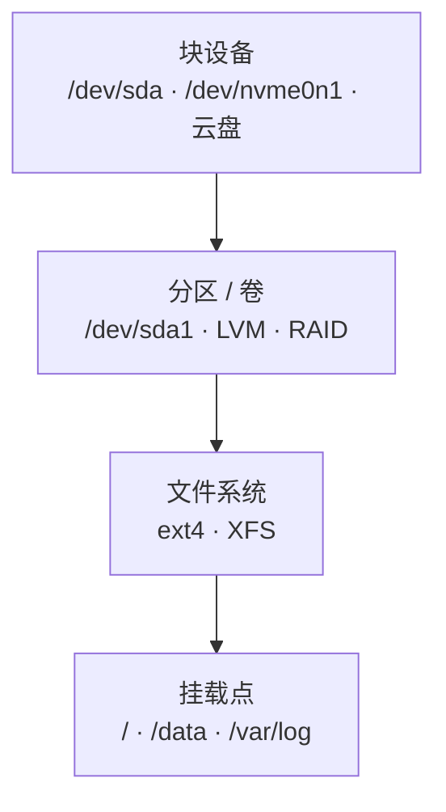
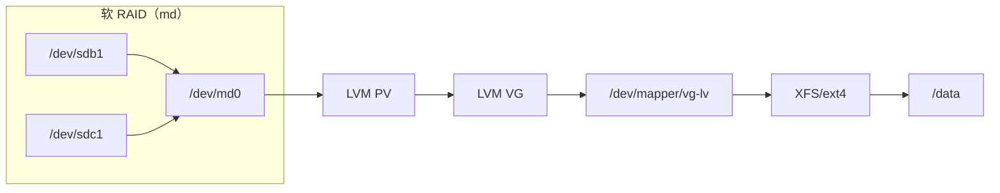

---
tags:
  - Linux
  - 存储
  - 块设备
  - 分区
  - 前置
created: 2026-09-18
---

# 前置：一块盘是怎么被认识的

> [!cite] 参考资料
> `man 8 lsblk`、`man 8 blkid`、`man 8 findmnt`、`man 8 mount`、`man 8 parted`、`man 8 fdisk`、`man 8 sfdisk`、`man 8 partprobe`、`man 4 sd`（`/dev/sd*` 的命名与设备节点）、`man 8 nvme`、`man 8 mdadm`、`man 8 dmsetup`、`man 5 systemd.mount`，以及内核文档 `Documentation/admin-guide/blockdev/`。
>
> 本篇结论来自上述资料，**命令输出尚未在实验机上逐条实测**；本机结果与文中不一致时以本机输出为准。

> **这篇讲什么**：Linux 眼里的「一块盘」到底长什么样。讲清四层结构（块设备 → 分区/卷 → 文件系统 → 挂载点）、设备名是怎么来的、为什么它靠不住、LVM 和 RAID 插在哪一层。**这是整章的坐标系**，后面每一站都在这四层里找位置。
>
> **必须先读什么**：无。这是阶段 5 的第一篇；只需要会用 shell、知道 `/dev` 是设备文件目录。
>
> **读完能回答**：① `lsblk`、`df`、`du` 分别在说什么？② 为什么不能拿 `/dev/sdb` 去写 fstab？③ 一块盘上同时有 LVM 和 RAID 时，谁在谁上面？④ 分区和文件系统是一回事吗？
>
> 所属：[[Linux/05_存储与文件系统/00_导读与知识地图|05 存储与文件系统]] 的 1.3 前置地基 · 主要练 **M1 存储基线与资产台账**

## 0. 30 秒速览

> [!abstract] 这一篇只要记住五句话
> - **四层结构**：块设备 → 分区/卷 → 文件系统 → 挂载点。**少了哪一层，后面所有命令都会问错对象。**
> - **分区不是文件系统**：分区只是「盘上的一段区间」，`mkfs` 之后那段区间里才有文件系统。`lsblk` 的 `TYPE` 列（`disk`/`part`/`lvm`/`raid1`）就是在告诉你它现在是哪一层。
> - **设备名会变**：`/dev/sdb` 的 `b` 取决于内核识别的顺序（插槽、控制器、云盘挂载顺序），重启后就可能变成 `sdc`；**fstab 与任何持久配置里只能用 `UUID=`/`LABEL=`**。
> - **`lsblk`/`df`/`du` 答三个问题**：设备与挂载关系、文件系统的账本、目录树里的实际占用。三者对不上是常态，不是 bug（原因见子笔记 09）。
> - **LVM 与 RAID 是「夹在中间的一层」**：它们在块设备与文件系统之间造出一块「虚拟盘」（`/dev/mapper/vg-lv`、`/dev/md0`），所以文件系统看到的不是物理盘。

## 1. 四层结构

| 层 | 是什么 | 典型名字 | 看它的工具 | 典型操作 |
| --- | --- | --- | --- | --- |
| 块设备 | 物理盘、云盘、NVMe、RAID 逻辑盘 | `/dev/sda`、`/dev/nvme0n1`、`/dev/vda`、`/dev/md0` | `lsblk -d`、`lsblk -d -o NAME,ROTA,SIZE,MODEL` | 分区、加阵列、下线换盘 |
| 分区/卷 | 分区表里的条目，或 LVM/RAID 造出来的「虚拟盘」 | `/dev/sda1`、`/dev/nvme0n1p1`、`/dev/mapper/vg-lv` | `lsblk`、`blkid`、`parted -l`、`pvs/vgs/lvs`、`cat /proc/mdstat` | 建分区、扩 LV、组阵列 |
| 文件系统 | 管理 inode、块、目录与日志的软件层 | ext4、XFS、NFS、tmpfs | `df -hT`、`df -i`、`tune2fs -l`、`xfs_info` | 创建（`mkfs`）、扩容、修复 |
| 挂载点 | 文件系统接到目录树上的位置 | `/`、`/data`、`/var/lib/docker` | `findmnt`、`cat /proc/mounts` | 配 fstab、只读重挂、卸载 |



三个必须记住的边界：

- **同一个文件系统可以挂到多个位置**（bind mount），**一块设备也可以完全没挂载**——「设备数量」和「挂载点数量」没有一一对应关系。
- **一个块设备上可以没有分区表**：整盘直接 `mkfs` 也是合法用法（常见于云盘、容器节点的数据盘），此时 `lsblk` 的 `TYPE` 直接是 `disk` 带 `FSTYPE`。
- **挂载点目录里原本如果有东西，挂载后会「看不见」**——不是被删除了，只是被盖住了（见子笔记 09 的第二类不一致）。

## 2. 设备名是怎么来的，为什么不能依赖它

```bash
lsblk -o NAME,SIZE,TYPE,FSTYPE,MOUNTPOINT,ROTA,MODEL
                                     # 验证：设备 → 分区 → 文件系统 → 挂载点，一屏看全
lsblk -d -o NAME,ROTA,SIZE,MODEL,SERIAL | grep -v loop
                                     # 验证：物理盘清单与序列号（换盘认盘的依据，ROTA=1 是机械盘）
ls -l /dev/disk/by-id/ /dev/disk/by-uuid/ 2>/dev/null | head -20
                                     # 验证：内核按识别顺序建的稳定别名（by-id 用的是盘自己的序列号）
```

常见设备名与它们的含义：

| 名字 | 谁 | 说明 |
| --- | --- | --- |
| `/dev/sda`、`/dev/sdb` | SCSI/SATA/SAS/USB 盘 | 数字与字母由**内核识别顺序**决定：`a` 是第一个被扫到的，可能与插槽无关 |
| `/dev/vda`、`/dev/vdb` | 虚拟化（VirtIO）盘 | 云主机常见；同样按识别顺序编号 |
| `/dev/nvme0n1`、`/dev/nvme0n1p1` | NVMe 盘与它的分区 | `nvmeX` 是控制器、`nY` 是命名空间；分区用 `p` 分隔，**不是** `nvme0n1-1` |
| `/dev/mapper/vg-lv` | LVM 逻辑卷 | device-mapper 造出来的「虚拟盘」，通常也软链到 `/dev/dm-0` |
| `/dev/md0` | 软 RAID 阵列 | `mdadm` 用多块盘拼出来的「虚拟盘」 |
| `/dev/loop0` | loop 设备 | 用一个普通文件模拟的盘，实验里最常用（`losetup`） |

> [!important] 设备名漂移是「重启后挂错盘」的头号原因
> 同一块盘在换插槽、换控制器、加新盘、云盘重新挂载之后，名字都可能改变。**持久配置（`/etc/fstab`、`/etc/crypttab`、监控、备份脚本）里一律用 `UUID=`、`LABEL=` 或 `/dev/disk/by-id/`**，不要写 `/dev/sdX`。
> 例外只有一种：**一次性操作**（现在就要 `mkfs` 一块盘）可以用 `/dev/sdX`，但动手前必须用 `lsblk -o NAME,SIZE,SERIAL,MODEL` 核对「是不是这块盘」——**认错盘等于当场删数据**。

## 3. 分区表：GPT 与 MBR

分区表回答「这块盘被切成几段、每段从哪个扇区到哪个扇区」。它写在盘的头部，**不属于任何分区**。

| | MBR（msdos） | GPT |
| --- | --- | --- |
| 分区数 | 最多 4 个主分区（或 3 主 + 1 扩展分区里再切逻辑分区） | Linux 默认 128 个分区 |
| 单盘容量 | 分区上限 2TiB | 远超 2TiB（用 64 位 LBA） |
| 可靠性 | 只有一份分区表，写坏就完了 | 头部与**盘尾各一份**，带 CRC 校验 |
| 标识 | 分区按顺序编号 | 每个分区有 GUID 与可读名字 |
| 什么时候还用 | 老设备、U 盘兼容性、某些 BIOS 引导场景 | 现代系统一律用 GPT（UEFI 或 >2TiB 的盘必须用） |

```bash
parted -l                            # 验证：每块盘的分区表类型（gpt/msdos）与分区起止扇区
lsblk -o NAME,SIZE,TYPE,PARTTYPENAME # 验证：分区类型名（Linux filesystem、EFI System 等）
wipefs -n /dev/<dev>                 # 验证：盘上有没有旧的文件系统/分区表签名（-n 只显示不擦除）
```

三个容易混的概念：

- **分区 vs 文件系统**：`parted` 切出来的只是一段空间；`mkfs` 才会在里面放文件系统。**先分区再 `mkfs`，顺序不能反**（也有整盘直接 `mkfs` 的用法，那就没有分区表）。
- **分区表 ≠ 目录**：分区不会自动挂上，必须 `mount` 到某个目录才进入目录树（子笔记 06）。
- **`wipefs -n` 是「动盘前必跑的一条命令」**：新接的盘如果是回收盘，上面可能还有旧的分区表或文件系统签名，不先看清楚就 `mkfs` 非常危险。

## 4. LVM 与 RAID 插在哪一层

两者都在「块设备」与「文件系统」之间插了一层 device-mapper 或 md，**对文件系统来说，它们造出来的东西就是一块盘**：



| 机制 | 提供的价值 | 代价 | 在哪一篇展开 |
| --- | --- | --- | --- |
| LVM | 在线扩容、跨盘拼容量、快照、thin provisioning | 多一层映射与元数据（`/etc/lvm/backup`）、thin pool 写满会波及全组 | 子笔记 07 |
| RAID（md） | 冗余：坏一块盘还能继续用 | 容量利用率下降、重建有风险与性能代价 | 子笔记 08 |
| LVM on RAID | 既有冗余又能在线扩容（生产常见） | 两层都要监控 | 子笔记 07、08 |
| RAID on LVM | 不推荐：LVM 盘出现问题时阵列也跟着遭殃 | — | 子笔记 07 |

```bash
pvs; vgs; lvs                       # 验证：有 LVM 时，三层视图（PV 是物理卷、VG 是池、LV 是切出来的卷）
cat /proc/mdstat                    # 验证：有软阵列时的状态与成员盘（[U] 正常、[_] 缺失）
dmsetup ls --tree                   # 验证：device-mapper 视角的映射关系（LVM/加密/多路径都在这层）
```

## 5. 三个工具，三个问题

这是新手最容易混的一组工具。**先记住每个工具回答的是哪一个问题**，后面的「空间对不上」就少一半：

| 工具 | 它看的是什么 | 回答什么问题 | 什么时候会误导 |
| --- | --- | --- | --- |
| `lsblk` | 设备 → 分区 → 挂载点这棵树 | 这块盘分了几个区、挂到哪了、什么类型 | 不显示容量使用率与 inode |
| `df` | 文件系统的账本（超级块记账） | 这个挂载点还剩多少空间与 inode | 已删除但仍被进程持有的文件照样算进去（子笔记 09） |
| `du` | 目录树里每个文件的实际占用 | 空间被哪些目录吃掉了 | 看不到被挂载覆盖的旧内容，对稀疏文件按实际块数算（子笔记 09） |
| `blkid` | 每个文件系统的身份 | 这个分区的 UUID、LABEL、TYPE 是什么 | 需要 root（或正是 root 才看得全） |
| `findmnt` | 当前挂载关系与参数 | 是只读还是可写？用了哪些挂载选项？ | 只显示「已挂载」的东西，不会告诉你还有哪些盘没挂 |

```bash
findmnt -o TARGET,SOURCE,FSTYPE,OPTIONS   # 验证：当前挂载关系与参数（比 mount 输出好读）
findmnt --df                              # 验证：按挂载点的容量视角（df 的另一种排版）
cat /proc/partitions                      # 验证：内核当前认到的块设备与区块数（设备被接管后才会出现）
blkid                                     # 验证：每个文件系统的 UUID/TYPE/LABEL（fstab 的取值来源）
```

## 6. 生产动作：只读巡检清单（生产机也可以做）

接一台新机器、或者接手一套别人维护的存储时，按这个顺序取一遍数，**全程只读**：

1. **设备层**：`lsblk -o NAME,SIZE,TYPE,FSTYPE,MOUNTPOINT,ROTA,MODEL,SERIAL` —— 有几块盘、是机械还是 SSD、什么型号。
2. **池与阵列层**：`pvs; vgs; lvs`、`cat /proc/mdstat` —— 有没有 LVM/RAID，水位如何。
3. **文件系统层**：`df -hT; df -i` —— 容量与 inode 两个视角。
4. **挂载层**：`findmnt -o TARGET,SOURCE,FSTYPE,OPTIONS` —— 有没有 `nofail`/`_netdev`/`noatime`，有没有只读挂载。
5. **身份层**：`blkid` —— 把 UUID 与设备对上，写进台账。

> [!tip] 第一反应不要是「先看 `df -h` 就够了」
> `df -h` 只回答「文件系统还剩多少」。判断一台机器的存储状态至少要四层数据：设备（几块盘、什么介质）、池（有没有 LVM/RAID）、文件系统（容量与 inode）、挂载（参数与读写状态）。**只看一层，就会在「还有空间为什么写不进去」这类问题上卡住。**

## 常见坑

| 常见做法或说法 | 后果或事实 |
| --- | --- |
| 把 `/dev/sdb` 写进 fstab | 重启后设备名可能漂移，轻则挂错盘、重则起不来；必须用 UUID/LABEL/by-id |
| 认为「分区 = 文件系统」 | 分区只是一段空间；没 `mkfs` 之前 `df`/`mount` 都不认它 |
| 用 `lsblk` 判断还剩多少空间 | `lsblk` 只给设备容量，不给使用率；那是 `df` 的事 |
| 拿 `du` 的结果去否定 `df` | 两者量的是不同的东西，对不上有四类正常原因（子笔记 09） |
| 新盘不 `wipefs -n` 就直接 `mkfs` | 回收盘上可能有旧签名，`mkfs` 会立刻清掉旧数据；先看再动 |
| 在容器里做 loop/LVM 实验 | 容器通常没有 `CAP_SYS_ADMIN` 与设备节点，实验会失败；用虚拟机 |
| 认为「盘没挂上就是坏了」 | 没挂载的设备很正常；`lsblk` 里 `MOUNTPOINT` 为空不代表故障 |

## 决策练习

> [!question]- 场景：你接管一台机器，`df -h` 显示 `/data` 用了 92%，`du -sh /data` 只统计出 40GiB，而 `lsblk` 显示这块盘 200GiB。同事说「`du` 统计不全，再删点东西就好了」。你怎么办？
> A. 直接按 `du` 的结果清理 `/data`，删到 `df` 降到 80% 以下
> B. 先分层取证：确认 `/data` 是哪个设备/文件系统（`findmnt /data`）、`df -h /data` 与 `df -i /data` 各是多少、再用 `lsof +L1` 看有没有已删除但仍被持有的文件——三份数据对不上时，先说明差值出在哪一类
> C. 立刻扩容 `/data`，反正空间越多越安全
>
> **答案：B。**
> A 是盲删：`du` 与 `df` 对不上有四类原因，其中「已删除但仍被持有」和「被挂载覆盖」都**删不掉**——你会删掉正常数据，问题还在。
> C 掩盖问题：如果是 inode 耗尽或配额到头，扩容量完全无效。
> B 是正解：**先确定「差在哪一层」，再决定动作**。这一步走完，你甚至可能发现 `/data` 根本不是独立文件系统，而是根分区上的一个目录。

## 要点自测

> [!question]- 块设备、分区、文件系统、挂载点四层，各自用什么命令看？
> - 块设备：`lsblk -d -o NAME,ROTA,SIZE,MODEL,SERIAL`；分区/卷：`lsblk`、`parted -l`、`pvs/vgs/lvs`、`cat /proc/mdstat`。
> - 文件系统：`df -hT`、`df -i`、`tune2fs -l`、`xfs_info`；挂载点：`findmnt`、`/proc/mounts`。
> - **第一反应不要是什么**：不要拿一个工具的输出回答另一个层的问题（例如用 `lsblk` 判断剩余空间）。

> [!question]- 为什么 fstab 里必须用 UUID 或 LABEL？
> - 因为 `/dev/sdX` 由内核识别顺序决定，换插槽、加盘、云盘重挂都会改变它；UUID/LABEL 写在文件系统里，跟着盘走。
> - 另一种稳定写法是 `/dev/disk/by-id/`（用盘自己的序列号），适合需要「认物理盘」的场景（如换盘、备份）。
> - **第一反应不要是什么**：不要以为「装系统时它是 sdb，以后就一直是 sdb」。

> [!question]- 一块盘上既有 RAID 又有 LVM，谁在谁上面？
> - 生产常见的是 **RAID 在下、LVM 在上**：`/dev/md0` 作为 PV 进卷组，LV 再给文件系统。
> - 反过来（LVM 在下、RAID 在上）会把单块 LV 的故障放大到整个阵列，通常不推荐。
> - **第一反应不要是什么**：不要看到 `lsblk` 里既有 `raid1` 又有 `lvm` 就以为是两套无关的东西，它们是一条链路上的两层。

> [!question]- 一块「新接的盘」要动手之前，必须先确认哪三件事？
> - **是不是这块盘**：`lsblk -o NAME,SIZE,MODEL,SERIAL`，序列号与工单/资产台账对上。
> - **上面有没有东西**：`wipefs -n /dev/<dev>`、`blkid /dev/<dev>`，有没有旧的分区表或文件系统。
> - **有没有别人在用**：`lsblk`/`findmnt` 里是否已挂载，`lsof`/`fuser` 是否有进程占用（子笔记 06）。
> - **第一反应不要是什么**：不要凭「它看起来是新盘」就直接 `mkfs`。

> 下一篇：[[Linux/05_存储与文件系统/02_前置_文件系统的内部结构|02 前置：文件系统的内部结构]]
