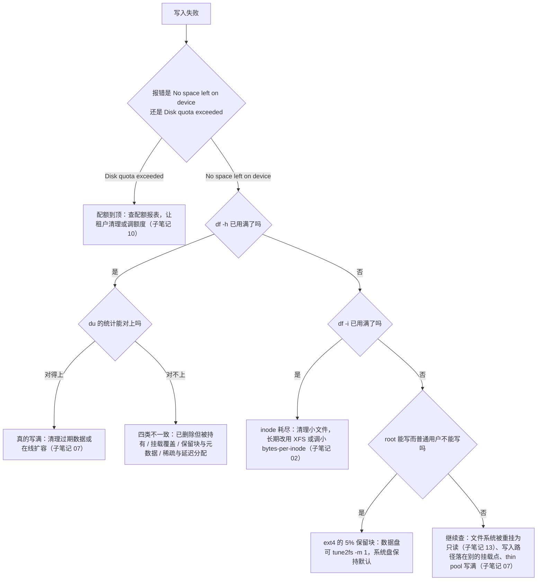

---
tags:
  - Linux
  - 存储
  - inode
  - df
  - du
created: 2026-09-18
---

# 空间账：inode、保留块与 df/du 不一致

> [!cite] 参考资料
> `man 1 df`、`man 1 du`、`man 1 lsof`、`man 8 tune2fs`、`man 8 mke2fs`、`man 8 find`、`man 1 stat`、`man 5 proc`（`/proc/<pid>/fd`）、`man 8 mount`（bind mount 一节）、`man 3 errno`（`ENOSPC` 与 `EDQUOT`），以及内核文档 `Documentation/filesystems/ext4/` 中关于预留块的部分。
>
> 本篇结论来自上述资料，**命令输出尚未在实验机上逐条实测**；本机结果与文中不一致时以本机输出为准。

> **这篇讲什么**：存储最经典的一类故障——**「明明有空间却写不进去」**。它至少有六种完全不同的原因（容量、inode、保留块、配额、只读、写到了别的挂载点），加上 **`df` 与 `du` 对不上的四类原因**。这一篇把它们做成一棵判定树，每一步都给一条能取到证据的命令。
>
> **必须先读什么**：[[Linux/05_存储与文件系统/02_前置_文件系统的内部结构|02 前置：文件系统的内部结构]]（inode、块、日志）、[[Linux/05_存储与文件系统/03_前置_容量口径与观测工具|03 前置：容量口径与观测工具]]（三个大小口径）。
>
> **读完能回答**：① `df -h` 还有 40% 却写不进去，按什么顺序查？② 删了文件空间为什么不释放？③ 挂载之后原来的数据去哪了？④ 怎么用一句话说清「差在哪一层」？
>
> 所属：[[Linux/05_存储与文件系统/00_导读与知识地图|05 存储与文件系统]] 的**空间线** · 主要练 **M2 空间账核对**

## 0. 30 秒速览

> [!abstract] 这一篇只要记住五句话
> - **`No space left on device` 至少有四种来源**：容量满、inode 满、ext4 的保留块、只读文件系统；**报错文本一样，处置完全不同**。
> - **配额到顶报的是另一个错误**：`Disk quota exceeded`（`EDQUOT`），与 `ENOSPC` 不是同一个 errno，但现象也是「写不进去」。
> - **`df` 与 `du` 对不上有四类**：已删除但仍被持有、被挂载覆盖、保留块与元数据、稀疏文件与延迟分配。
> - **第一组判据永远是三条命令**：`df -h`、`df -i`、`lsof +L1`。三条一起看，六种原因里的四种当场就能排除。
> - **「删了文件空间没释放」不是系统 bug**：只要有进程还打开着它，数据块就不会释放，重启或重载该进程才回收。

## 1. 「写不进去」的判定树



```bash
df -h; df -i                         # 验证：容量与 inode 两个视角（必须同时看）
lsof +L1 2>/dev/null | head -20      # 验证：已删除但仍被进程持有的文件
findmnt -T <写入路径>                 # 验证：这个路径实际落在哪个挂载点（避免"写到别的盘"）
```

## 2. inode 耗尽：`df -h` 有余而 `df -i` 满

ext4 的 inode 数量在 `mkfs` 时就定死了，**块还剩很多但 inode 用光**是完全可能的。典型元凶：session 文件、mail spool、缓存目录、容器可写层的小文件、日志目录里的海量小片段。

```bash
df -i                                # 验证：哪个文件系统的 inode 接近 100%（IUse% 列）
du --inodes -s /var/* 2>/dev/null | sort -rn | head -10
                                     # 验证：按 inode 数找出"文件最多的目录"
find /var -xdev -type f | wc -l      # 验证：某个文件系统上的文件总数（-xdev 不跨文件系统）
sudo tune2fs -l /dev/<dev> | grep -E 'Inode count|Free inodes|Bytes per inode'
                                     # 验证：ext4 的 inode 总量、剩余与"每个 inode 摊到多少字节"
```

治理思路（短期 + 长期 + 监控三条都要有）：

1. **短期**：清理或归档过期的小文件，并**按业务补上过期清理策略**（否则一周后复发）。
2. **长期**：确属长期需求，就换 XFS（动态 inode），或重建 ext4 并给更小的 `bytes-per-inode`（`mke2fs -i 16384` / `-T small`，代价是 inode 表占更多空间）。
3. **监控**：**把 inode 使用率与容量使用率一起告警**——只报容量一定会漏掉这类故障。

> [!important] ext4 扩容不会自动解决 inode 耗尽
> `resize2fs` 默认按原有比例增加 inode，不是「容量翻倍 inode 就翻倍到够用」。**收到 inode 告警时，先想清理与换文件系统，而不是先扩容。**

## 3. 保留块：root 能写、普通用户不能写

ext4 默认**为 root 保留 5% 的空间**（`mke2fs -m` 设定，`tune2fs -m` 可后调）。这 5% 对普通用户不可见，所以会出现「`df` 的 `Use%` 接近 100% 但文件没写满」的观感。

```bash
sudo tune2fs -l /dev/<dev> | grep -E 'Block count|Reserved block count'
                                     # 验证：总块数与预留块数（相除就是预留比例）
sudo tune2fs -m 1 /dev/<dev>         # 验证：把预留比例调到 1%（只建议数据盘；系统盘保持默认）
df -h /data                          # 验证：调整后普通用户可见的可用空间变大
```

| 场景 | 建议 |
| --- | --- |
| 系统盘（`/`、`/var`、`/usr`） | **保持默认 5%**：那是留给 root 与系统守护进程在磁盘写满时自救的空间 |
| 纯数据盘（业务数据、日志归档） | 可以调到 1%（甚至 0），但要知道**写满时 root 也写不进去** |
| 大型数据盘（几 TiB） | 5% 可能意味着几百 GiB，值得评估后调整 |

## 4. `df` 与 `du` 对不上的四类原因

| 原因 | 现象 | 怎么确认 | 怎么处理 |
| --- | --- | --- | --- |
| **已删除但仍被进程持有** | 删了大文件，`df` 不降；`du` 找不到它 | `lsof +L1`、`ls -l /proc/<pid>/fd \| grep deleted` | 重启或重载对应进程即释放；紧急时可截断 `/proc/<pid>/fd/<n>`（**要评估数据风险**） |
| **被挂载覆盖的目录** | 挂载了新盘到 `/data`，之前 `/data` 里的内容「消失」 | `mount --bind / /mnt/rootcheck` 后到 `/mnt/rootcheck/data` 用 `du` 看 | 先卸载露出原内容，再清理或迁移 |
| **保留块与元数据** | ext4 上 `df` 与实际可写量差 5%；inode 表、日志也占空间 | `tune2fs -l \| grep -i reserved`、`dumpe2fs -h` | 数据盘可调 `-m`；元数据占用属正常 |
| **稀疏文件与延迟分配** | `du` 明显小于 `df`（虚拟机镜像、数据库文件） | `du -h --apparent-size` 与 `du -h` 对比 | 属正常现象；容量预估按**表观大小**算 |

```bash
lsof +L1 2>/dev/null | awk '{print $1,$2,$7,$9}' | head -20
                                     # 验证：进程、PID、大小、路径（第一类嫌疑）
sudo mkdir -p /mnt/rootcheck && sudo mount --bind / /mnt/rootcheck
sudo du -xh --max-depth=1 /mnt/rootcheck/data | sort -rh | head
                                     # 验证：被挂载覆盖前那个目录里到底有什么
sudo umount /mnt/rootcheck           # 验证：用完立刻卸载（否则它会一直被算作一个挂载点）
du -h --apparent-size <file>; du -h <file>
                                     # 验证：稀疏文件的表观大小 vs 实际占用
sudo tune2fs -l /dev/<dev> | grep -i -E 'reserved|block count'
                                     # 验证：保留块（第三类）
```

## 5. 还有两类容易漏的

**第一类：写到了别的挂载点。** 目录 `/var/log` 如果不是独立挂载点，它就落在根文件系统上——「我明明给日志盘留了 500GiB」的前提根本不成立。**判断方法**：`findmnt -T /var/log`（或 `df -h /var/log`）看它实际属于哪个文件系统。

**第二类：thin pool 或快照写满。** 使用 LVM thin provisioning 或快照时，「卷还没满、池子满了」会让整组卷出问题（常见是变只读）。**判断方法**：`lvs -o+data_percent,metadata_percent`（子笔记 07）。

```bash
findmnt -T /var/log                  # 验证：这个路径实际属于哪个挂载点
sudo lvs -o+lv_size,data_percent,metadata_percent
                                     # 验证：thin pool 与快照水位（有 LVM 时）
```

## 6. 生产动作：一次空间故障的取证清单

按顺序做，**每一条都要留下输出**（写进故障记录）：

1. **报错原文**：`No space left on device` 还是 `Disk quota exceeded`（这一条决定了排查方向）。
2. **写入路径**：`findmnt -T <路径>`，确认落在哪个文件系统/挂载点。
3. **两个视角**：`df -h <挂载点>`、`df -i <挂载点>`。
4. **谁在占**：`du -xh --max-depth=1 <挂载点> | sort -rh | head -15`（`-x` 不跨文件系统）。
5. **谁在持有**：`lsof +L1 | head -20`。
6. **配额**：`xfs_quota -x -c 'report -h' <挂载点>` 或 `repquota -a`。
7. **只读与否**：`findmnt -o TARGET,OPTIONS <挂载点>`（看有没有 `ro`）与 `dmesg -T | tail -30`。
8. **结论**：写出「差在哪一类、证据是哪几条命令、下一步动作是什么」。

> [!example]- 实验 5：亲手制造一次 inode 耗尽，并看清 5% 保留块
> **怎么做**：在一个很小的 ext4 文件系统上把 inode 密度调低，然后不停创建空文件，看它什么时候失败。
> ```bash
> dd if=/dev/zero of=/tmp/lab-inode.img bs=1M count=64
> LOOP2=$(losetup --find --show /tmp/lab-inode.img)
> sudo mkfs.ext4 -i 1048576 "$LOOP2"   # 每 1MiB 才给一个 inode：64MiB 上只有约 64 个
> sudo mkdir -p /mnt/labinode && sudo mount "$LOOP2" /mnt/labinode
> df -h /mnt/labinode; df -i /mnt/labinode
>                                      # 验证：容量还剩很多，inode 却已接近 100%
> for i in $(seq 1 100); do sudo : > /mnt/labinode/f$i || break; done
>                                      # 验证：报 No space left on device —— 但 df -h 仍有空间
> df -h /mnt/labinode; df -i /mnt/labinode
>                                      # 验证：inode 用尽、容量富余（最经典的误判现场）
> sudo tune2fs -l "$LOOP2" | grep -E 'Inode count|Free inodes|Reserved block count|Block count'
>                                      # 验证：对比 Reserved 与 Block count，算出 ext4 预留的 5%
> ```
> **预期**：循环创建小文件时提前失败，`df -i` 显示 100% 而 `df -h` 还有余量。**这一屏就是「有空间却写不进去」的实物证据。**
> **风险**：低。全部作用在 `/tmp` 的普通文件上（需要 root）；`-i 1048576` 只是放大演示效果。
> **环境**：任意发行版，需要 `e2fsprogs`。**容器里做不了。**
> **耗时**：约 20 分钟。
> **怎么退回去**：`sudo umount /mnt/labinode; sudo losetup -d "$LOOP2"; rm -f /tmp/lab-inode.img`。

> [!example]- 实验 6：制造 `df` 与 `du` 不一致的两类现场
> **怎么做**：先造「已删除但被进程持有」，再造「被挂载覆盖的目录」。
> ```bash
> LOOP1=/dev/loop9                     # 沿用子笔记 04 实验 1 的 ext4 环设备
> sudo mount "${LOOP1}p1" /mnt/lab
> sudo dd if=/dev/zero of=/mnt/lab/bigfile bs=1M count=200
> df -h /mnt/lab                       # 验证：记录当前用量
> sudo sh -c 'sleep 900 < /mnt/lab/bigfile &'
>                                      # 验证：让一个进程持有这个文件
> sudo rm /mnt/lab/bigfile             # 验证：删除文件（但进程还持有句柄）
> df -h /mnt/lab                       # 验证：用量没有下降
> sudo du -sh /mnt/lab                 # 验证：du 找不到它（文件已从目录树中消失）
> sudo lsof +L1 | grep bigfile         # 验证：找到持有它的进程
>                                      # 处理：结束该进程后 df 立即下降
> sudo mkdir -p /mnt/lab/data && sudo dd if=/dev/zero of=/mnt/lab/data/hidden bs=1M count=100
> dd if=/dev/zero of=/tmp/lab-disk1.img bs=1M count=256
> LOOP3=$(losetup --find --show /tmp/lab-disk1.img)
> sudo mkfs.ext4 -F "$LOOP3" && sudo mount "$LOOP3" /mnt/lab/data
>                                      # 验证：覆盖挂载：原目录内容被遮住
> sudo du -sh /mnt/lab/data            # 验证：看不到那 100MiB 的 hidden 文件
> sudo mkdir -p /mnt/rootcheck && sudo mount --bind / /mnt/rootcheck
> sudo du -sh /mnt/rootcheck/mnt/lab/data
>                                      # 验证：通过 bind mount 从"上面"看，hidden 文件还在
> ```
> **预期**：两类不一致都能复现，并且都能用本节的命令找到证据。**「删了文件空间没释放」和「挂载之后旧数据不见了」在生产上都非常常见。**
> **风险**：低。全部作用在 loop 文件上（需要 root）。
> **环境**：任意发行版。
> **耗时**：约 25 分钟。
> **怎么退回去**：`sudo umount /mnt/rootcheck /mnt/lab/data /mnt/lab`，`sudo losetup -d "$LOOP3"`，删除 `/tmp/lab-disk1.img`；或跑子笔记 17 的统一清理段。

## 常见坑

| 常见做法或说法 | 后果或事实 |
| --- | --- |
| 看到 `No space left on device` 就只看 `df -h` | inode 耗尽、保留块、只读文件系统都报同一个错；必须 `df -h` 与 `df -i` 一起看 |
| 用 `du` 的结果否定 `df` | 两者量的是不同的东西；对不上有四类正常原因，要说明差在哪一类 |
| 删了日志文件但空间没释放 | 进程还持有已删除的文件句柄；用 `lsof +L1` 定位，重启或重载进程才释放 |
| 用「再删一遍」解决空间不释放 | 文件已经从目录树里消失，再删没有对象；要做的是让持有者关闭句柄 |
| 在生产机上直接截断 `/proc/<pid>/fd/<n>` | 会让进程后续写入出现空洞或损坏（如日志错位）；只有在评估过数据风险、且确无其他办法时用 |
| 认为「挂载后旧数据被删了」 | 数据还在，只是被遮住；卸载或用 bind mount 从上层看 |
| 只报容量告警不报 inode | ext4 上 inode 往往先满；这类故障会被漏掉 |
| 认为「扩容能解决 inode 满」 | 扩容只按比例增加 inode，不能解决海量小文件的长期需求 |
| 给系统盘调低保留块比例 | 磁盘写满时 root 失去自救空间，故障会放大 |
| 假设 `/var/log` 在日志盘上 | 目录不一定独立挂载；先 `findmnt -T` 确认它落在哪 |

## 决策练习

> [!question]- 场景：业务报「写入失败：No space left on device」。你登上去看，`df -h /data` 显示 `Use% = 61%`，`du -sh /data` 只有 300GiB 而文件系统是 1TiB。同事说「肯定是 `du` 统计不全，再删点东西」。你怎么做？
> A. 按同事说的做：删掉 `/data` 下最大的几个目录，再看能不能写
> B. 先按顺序取证：`df -i /data`（inode 是否满）→ `lsof +L1`（有没有已删除仍被持有的文件）→ `findmnt -T <业务写入路径>`（是不是真写在 `/data`）→ `tune2fs -l | grep Reserved`（保留块）→ 配额报表；拿到证据后再决定动作
> C. 直接在线扩容 `/data`，让容量翻倍
>
> **答案：B。**
> A 是盲删：如果是 inode 满、保留块或写到了别的挂载点，删 `/data` 里的数据一点用都没有，还会误伤业务数据。
> C 可能无效：inode 满或配额到顶时，扩容解决不了问题。
> B 是正解：**`df -h` 有余 + `du` 偏小，正好对应「inode 满」和「已删除仍被持有」这两类高频原因**；先把六种原因过一遍，再决定清理、扩容还是调整。

## 要点自测

> [!question]- `df` 还有空间却写不进去，可能是哪几种原因？
> - inode 耗尽（`df -i` 满）、ext4 保留块（root 能写、普通用户不能）、配额到顶（报 `Disk quota exceeded`）、文件系统被重挂为只读、写入路径其实落在别的挂载点、thin pool/快照写满。
> - 判据：`df -h`、`df -i`、`lsof +L1`、`findmnt -T`、配额报表、`findmnt` 的 `ro` 选项、`lvs` 水位。
> - **第一反应不要是什么**：不要一上来就删文件或扩容。

> [!question]- `df` 与 `du` 对不上的四类原因是什么？
> - 已删除但仍被进程持有（`lsof +L1`）、被挂载覆盖的目录（bind mount 从上层看）、保留块与元数据（`tune2fs -l`）、稀疏文件与延迟分配（`du --apparent-size` 对比）。
> - 每一类都要给出**证据命令**，而不是「大概是这样」。
> - **第一反应不要是什么**：不要说「`du` 不准」就结束排查。

> [!question]- 「删了大文件空间没释放」怎么处理？
> - 找持有者：`lsof +L1` 或 `ls -l /proc/<pid>/fd | grep deleted`。
> - 释放方式：重启或重载该进程；紧急止损时可在评估风险后截断 `/proc/<pid>/fd/<n>`。
> - **第一反应不要是什么**：不要在没确认持有者的情况下重启整机——那会同时清掉其他现场。

> [!question]- 保留块该怎么设置？
> - ext4 默认 5% 给 root；系统盘保持默认，数据盘可评估降到 1%。
> - 代价是「写满时 root 也没有自救空间」，所以调整要连同监控水位一起考虑。
> - **第一反应不要是什么**：不要为了多出几百 GiB 就在所有盘上统一 `-m 0`。

> 上一篇：[[Linux/05_存储与文件系统/08_第5站_冗余健康与换盘|08 第 5 站：冗余、健康与换盘]] ｜ 下一篇：[[Linux/05_存储与文件系统/10_配额与共享目录治理|10 配额与共享目录治理]]
