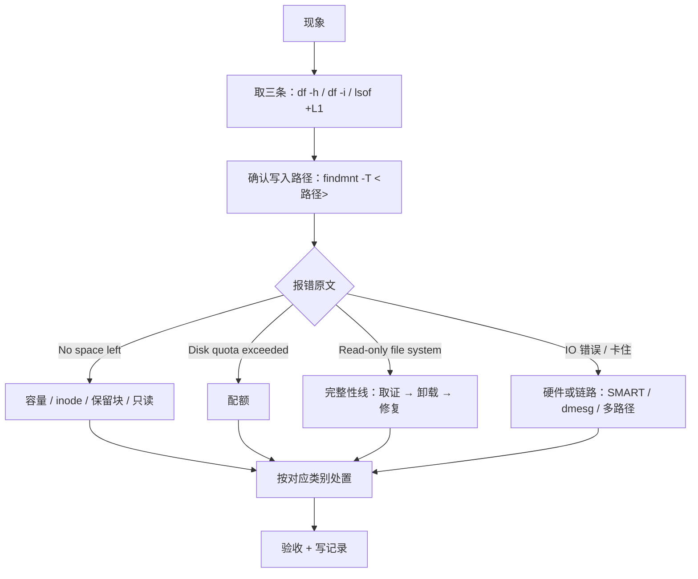

---
tags:
  - Linux
  - 存储
  - 排障
  - Runbook
created: 2026-09-18
---

# 存储故障处置手册

> [!cite] 参考资料
> 本篇不引入新机制，只是把各子笔记的排障内容按「现象 → 分层 → 证据 → 处置」重组。每条命令的出处见对应子笔记开头的「参考资料」；判定树与阈值口径以 `df(1)`、`du(1)`、`tune2fs(8)`、`xfs_quota(8)`、`mdadm(8)`、`smartctl(8)` 与 `iostat(1)` 为准。
>
> 本篇结论来自上述资料，**命令输出尚未在实验机上逐条实测**；本机结果与文中不一致时以本机输出为准。

> **这篇讲什么**：存储出故障时的统一动作模板——**先用三条命令定性，再沿分层取证，最后才动手**。每一类现象都给出「第一反应不要做什么」，因为存储故障的代价大多是不可逆的。
>
> **必须先读什么**：[[Linux/05_存储与文件系统/00_导读与知识地图|00 导读]] 第 6 节的「故障现场定位表」。
>
> **读完能做什么**：面对任何一类存储现象，都能说出「先看哪三条、再沿哪一层下钻、证据留给谁」，并把处置过程写成一份能被复盘的记录。
>
> 所属：[[Linux/05_存储与文件系统/00_导读与知识地图|05 存储与文件系统]] 的收口篇 · 练 **M2、M6、M7、M8**

## 0. 30 秒速览

> [!abstract] 排障只要记住五句话
> - **第一组命令永远是三条**：`df -h` + `df -i` + `lsof +L1`。它们能当场分开「容量满 / inode 满 / 删了没释放」。
> - **第二问永远是「这个路径落在哪个挂载点」**：`findmnt -T <路径>`。很多「明明有空间」是因为写到了别的文件系统。
> - **第三问是「报错原文是什么」**：`No space left on device`、`Disk quota exceeded`、`Read-only file system` 指向完全不同的方向。
> - **三类动作不可逆**：`mkfs`/`blkdiscard`（清数据）、`xfs_repair -L`（丢日志）、`lvreduce`/缩容（切空间）。**动手前必须有快照或备份。**
> - **写好记录**：现象、证据、根因、动作、验收、后续改进。**没有记录的处置，下次还会重来一遍。**

## 1. 通用处置流程



```bash
df -h; df -i                         # 验证：容量与 inode 两个视角（第一步永远是这个）
lsof +L1 2>/dev/null | head -20      # 验证：已删除但仍被进程持有的文件
findmnt -T <业务写入路径>             # 验证：实际落在哪个挂载点
findmnt -o TARGET,SOURCE,FSTYPE,OPTIONS <挂载点>
                                     # 验证：挂载参数（是否 ro、有没有 nofail/_netdev）
dmesg -T | tail -50                  # 验证：内核最近报了什么
```

## 2. `No space left on device`，但 `df -h` 有余量

> [!tip] 第一反应不要是「删日志」
> 「没空间」至少有四种来源：容量、inode、保留块、只读（还有配额这一支报的是另一个错误）。**盲目删文件可能删掉正在排查的证据**，而且对后三种完全无效。

按顺序排除：

1. **inode**：`df -i` 是否满（`IUse%` 接近 100%）？`du --inodes -s /path/* | sort -rn | head` 找文件最多的目录（子笔记 09）。
2. **保留块**：root 能写、普通用户不能写？`tune2fs -l | grep -E 'Block count|Reserved block count'`（子笔记 09）。
3. **只读**：`findmnt -o TARGET,OPTIONS` 里有没有 `ro`？有就去子笔记 13（**不要 `remount,rw`**）。
4. **写到了别的挂载点**：`findmnt -T <路径>` 确认（子笔记 09）。
5. **thin pool / 快照写满**：`lvs -o+data_percent,metadata_percent`（子笔记 07）。
6. **配额**：报错文本是 `Disk quota exceeded` 吗？如果是，看第 3 节。

## 3. `Disk quota exceeded`

> [!tip] 第一反应不要是「扩容」
> 这个错误与容量无关，扩容量不会解决它。要么调额度，要么让租户清理。

1. **确认是哪种配额**：`xfs_quota -x -c 'report -h' <挂载点>`（XFS，含项目配额）或 `repquota -a`（ext4）。
2. **确认对象**：是某个项目 ID、某个用户还是某个组？对照台账找到业务方（子笔记 10）。
3. **处置**：让业务清理 → 或在评估后调 `bsoft`/`bhard` → 更新台账与监控阈值。
4. **验收**：业务写入恢复正常，`report -h` 里用量低于限额。

## 4. `df` 与 `du` 差很多

> [!tip] 第一反应不要是「`du` 不准」
> 两者量的是不同的东西：`df` 看文件系统账本，`du` 遍历目录树。四类原因要逐个排除，而不是互相否定。

1. **已删除但仍被持有**：`lsof +L1`（删了大文件空间不降的元凶）。
2. **被挂载覆盖的目录**：`mount --bind / /mnt/rootcheck` 后从上层 `du`（用完记得卸载）。
3. **保留块与元数据**：`tune2fs -l`、`dumpe2fs -h`。
4. **稀疏文件与延迟分配**：`du -h` 与 `du -h --apparent-size` 对比。

## 5. 文件系统变只读或报 `I/O error`

> [!tip] 第一反应不要是 `mount -o remount,rw`
> 只读是内核的保护动作；重挂可写只是让损坏继续扩大。

按顺序排除：

1. **取证**：`dmesg -T`、`journalctl -k`，区分**介质错误**（硬件）与**元数据损坏**（逻辑）。
2. **看硬件**：`smartctl -H`/`-a`、`nvme smart-log`；`Current_Pending_Sector > 0` 说明先要保数据与换盘（子笔记 08）。
3. **切走业务**：`mount -o remount,ro` 让写入停下（这不是修复）。
4. **卸载 + 干跑**：`e2fsck -n` 或 `xfs_repair -n`。
5. **备份后修复**：块级快照/镜像先做；再 `e2fsck -f` / `xfs_repair`。
6. **只读挂载核对**，确认无误再恢复读写（子笔记 13）。

## 6. IO 慢：`await` 高

> [!tip] 第一反应不要是「磁盘坏了，换盘」
> `await` **含排队时间**。队列深浅决定了是「业务把压力打上去了」还是「设备/链路本身退化」。

按顺序排除：

1. **看组合**：`iostat -x 1 10` 的 `await` + `aqu-sz` + `%util`。
   - 同涨 = 排队（找源头进程）；`await` 涨而队列浅 = 设备或链路慢。
2. **找进程**：`iotop -oPa`、`pidstat -d 1 5`。
3. **下钻到文件与请求**：`lsof -p`、`/proc/<pid>/io`（看 `read_bytes`/`write_bytes`）、`blktrace`/eBPF。
4. **排除非磁盘因素**：回写积压（`Dirty`/`Writeback`，阶段 4 的领域）、网络存储链路（子笔记 14）、阵列缓存与电池状态（子笔记 08）。
5. **别忘底层报错**：`dmesg -T | grep -i -E 'I/O error|medium error|nvme.*reset|link is down'`。

## 7. 磁盘报介质错误 / 阵列降级

> [!tip] 第一反应不要是「立刻拔盘换新」
> 先确认**哪块盘真的坏了**。误拔好盘会让冗余度瞬间归零。

按顺序排除：

1. **看阵列状态**：`cat /proc/mdstat`、`mdadm --detail /dev/md0`（或厂商工具），确认降级级别与失败盘。
2. **看内核日志**：`dmesg -T` 的 `medium error` 指向哪块盘，用**序列号**核对。
3. **看健康**：`smartctl -a` / `nvme smart-log` 的关键计数。
4. **限速重建**：`/proc/sys/dev/raid/speed_limit_max`（软 RAID）或厂商策略。
5. **换盘并验证**：定位槽位（LED/厂商工具）→ 下线 → 更换 → 重建 → 核对阵列与文件系统（子笔记 08）。
6. **复盘**：是盘老化、线缆/背板、供电还是固件？同批次盘是否需要批量替换？

## 8. 挂载点卡死、进程堆积在 D 状态

> [!tip] 第一反应不要是「批量 `kill -9`」
> `D` 状态是不可中断睡眠，进程收不到信号。要恢复的是 IO 通路。

按顺序排除：

1. **确认是哪个挂载点**：`df`/`mount` 卡住的位置、`D` 进程的共同路径。
2. **确认底层**：`journalctl -k`、网络可达性、`multipath -ll`、NFS/iSCSI 服务端状态。
3. **优先恢复链路**：修网络、恢复对端、切路径；通路恢复后 D 状态自行消解。
4. **无法恢复时的取舍**：`umount -f`/`-l` 有数据风险，需业务确认；最后手段是重启并保留日志。
5. **长期改进**：`_netdev`/`nofail`/`automount`/超时参数、监控重传与延迟（子笔记 14）。

## 9. 重启后进 emergency，报挂载失败

> [!tip] 第一反应不要是「重装」
> 这是最常见的可修复故障之一。进控制台，按下面的顺序走。

```bash
systemctl --failed                   # 验证：哪个单元失败
journalctl -xb | grep -i -E 'failed to mount|dependency failed'
                                     # 验证：具体是哪一行/哪个 UUID 出错
sudo mount -o remount,rw /           # 验证：让根分区可写，才能改文件
sudo vi /etc/fstab                   # 验证：修正 UUID、补 nofail/_netdev，或先注释掉出问题的行
sudo mount -a                        # 验证：改完立刻验证（不要用重启验证）
sudo systemctl default               # 验证：继续启动到默认 target
```

事后要检查：**是不是批量下发过的写法**（其他机器是否同病），以及变更流程里为什么没有 `mount -a` 这一步（子笔记 06）。

## 10. 云盘扩容了，`df` 没变大

> [!tip] 第一反应不要是「云厂商没给扩容」
> 扩容是一条链，**每一层都要单独长大**：盘 → 分区 → PV → LV → 文件系统。

```bash
lsblk                                # 验证：内核是否已看到新的设备容量
sudo growpart /dev/<disk> <partnum>  # 验证：分区是否已长大（云盘常见）
sudo partprobe /dev/<disk>           # 验证：内核重读分区表
sudo pvresize /dev/<pv>              # 验证：PV 是否感知新空间（pvs 的 PSize/VFree 变大）
sudo lvextend -r -l +100%FREE /dev/<vg>/<lv>
                                     # 验证：扩 LV 并自动扩文件系统
df -h <挂载点>                        # 验证：最终验收（这里不变就等于没做完）
```

## 11. 共享目录被一个租户写满

> [!tip] 第一反应不要是「先去清理」
> 清理只是止血。没有边界，明天还会再来一次。

1. **止血**：确认当前用量与增长源（`du -xh --max-depth=1 <目录> | sort -rh | head`）。
2. **建边界**：`prjquota` + 项目配额，一个业务目录一个项目 ID（子笔记 10）。
3. **接监控**：配额用量百分比与宽限期状态纳入告警。
4. **写台账**：目录 ↔ 项目 ID ↔ 业务方 ↔ 额度 ↔ 变更时间。

## 12. 应用报 `too many open files` 或 inotify 相关错误

> [!tip] 第一反应不要是「直接把上限调到最大」
> 上限是保护机制；先确认撞的是哪一道、以及应用的设计是否合理。

1. **句柄**：`grep -E 'Max open files' /proc/<pid>/limits`、`ls /proc/<pid>/fd | wc -l`、`cat /proc/sys/fs/file-nr`；服务层看 `systemctl show -p LimitNOFILE`。
2. **inotify**：`sysctl fs.inotify.max_user_watches fs.inotify.max_user_instances fs.inotify.max_queued_events`。
3. **处置**：改应用设计（目录级 watch、批量打开、连接复用）优先；确认需要后再调上限，并记录原值与回滚方式（子笔记 15）。

## 处置记录模板

```text
【现象】谁在什么时间报了什么错（贴原文）
【影响面】哪些业务/租户受影响，是否还在恶化
【证据】df -h / df -i / lsof +L1 / findmnt -T / dmesg -T / smartctl / iostat 的关键输出
【根因判断】属于哪一类（容量 / inode / 保留块 / 配额 / 只读 / 介质 / 链路 / 配置）
【动作】按时间列出命令与结果（含被否决的方案与原因）
【验收】业务恢复标志 + 命令输出（例如 df -h 变化、写入测试成功）
【后续】监控补什么、台账改什么、要不要演练、有没有同类机器
```

## 常见坑

| 常见做法或说法 | 后果或事实 |
| --- | --- |
| 排障只留结论不留证据 | 无法复盘、无法判断是否真的修好；下次从头再来 |
| 先动手再取证 | 存储的多数动作不可逆；现场（内核日志、D 状态、`df` 快照）会被清掉 |
| 只看 `df -h` 就下结论 | inode、配额、只读、挂载覆盖都会给出相反的结论 |
| 把 `df` 与 `du` 的矛盾当成工具 bug | 有四类正常原因，要说清差在哪一类 |
| 不区分「变慢」与「写坏」 | 前者可调优，后者要立刻保数据；处置方向完全相反 |
| 在没备份的情况下跑修复类命令 | 修复可能加重损坏，且不可逆 |
| 处置完不更新台账与监控 | 同一类故障会在同机或同批次机器上重演 |

## 决策练习

> [!question]- 场景：值班时同时来两个告警——A 机器「/data 写入失败」，B 机器「磁盘 `await` 从 2ms 涨到 60ms」。你只有 15 分钟，先处理哪个、怎么分派？
> A. 先看 A：写入失败是业务中断，属于可用性问题；用三条命令定性（`df -h`/`df -i`/`lsof +L1`）与 `findmnt -T` 确认路径，判断是容量、inode、配额还是只读。B 属于性能问题，可以让同事同时按「`await` + `aqu-sz`」组合判读，先找源头进程
> B. 先看 B：性能问题往往影响面更大
> C. 两个都先重启机器，恢复服务后再慢慢分析
>
> **答案：A。**
> B 不一定错，但本题的关键是：**A 是「中断」，B 是「变慢」**，前者优先级更高，而且 A 的定性只需要三条命令、几分钟内就能给出方向。
> C 是最差选择：重启会清掉两边的现场（内核日志、D 状态、队列深度），而且如果 A 是 fstab 或存储链路问题，重启后可能直接起不来。
> A 是正解：**按影响面排序、按定性速度分派、同时并行推进**——这也是 T4 限时模拟要练的能力。

## 要点自测

> [!question]- 存储排障的「第一组三条命令」是什么，为什么是这三条？
> - `df -h`（容量）、`df -i`（inode）、`lsof +L1`（已删除但仍被持有）。
> - 它们能在几分钟内分开三种最常见的「写不进去」原因，且全部只读、生产机可做。
> - **第一反应不要是什么**：不要跳过定性直接删文件或扩容。

> [!question]- 哪些存储动作是不可逆的？
> - `mkfs`/`blkdiscard`（清数据）、`xfs_repair -L`（丢日志）、`lvreduce` 与任何缩容、`wipefs`（不带 `-n`）。
> - 这类动作前必须有块级快照或备份，并且要有人复核。
> - **第一反应不要是什么**：不要靠「我记得这块盘是空的」来判断。

> [!question]- 为什么处置完一定要写记录？
> - 存储故障多是累积性问题：没有记录就看不出趋势，也无法判断是否只是暂时缓解。
> - 记录里的「被否决的方案与原因」对下一次最有用。
> - **第一反应不要是什么**：不要把「服务恢复了」当成故障结束。

> 上一篇：[[Linux/05_存储与文件系统/15_另一种容量上限_句柄与inotify|15 另一种容量上限：句柄与 inotify]] ｜ 下一篇：[[Linux/05_存储与文件系统/17_动手实验与要点自测|17 动手实验与要点自测]]
