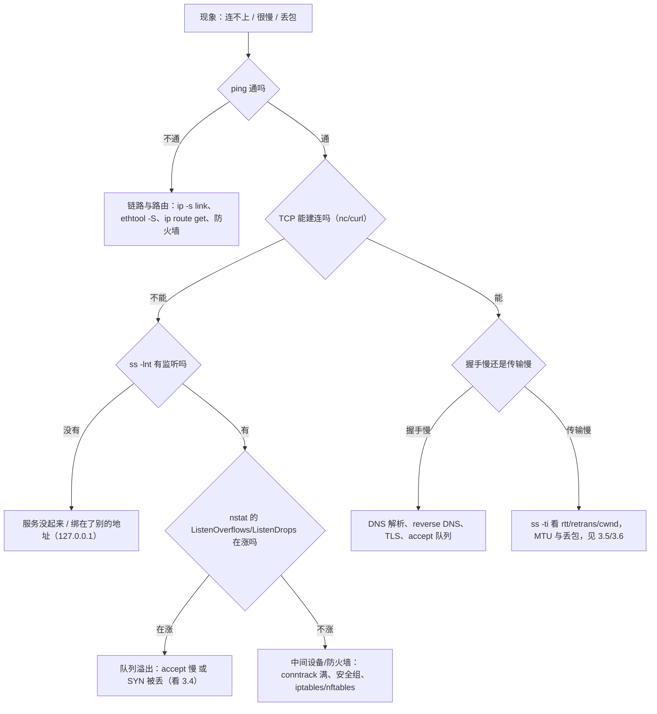
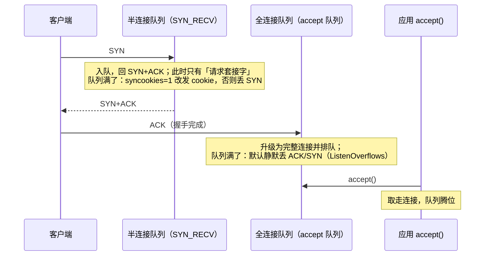
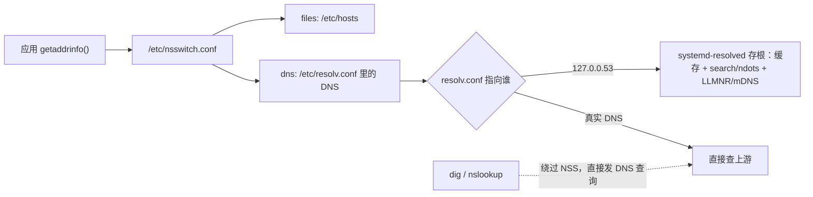

---
tags:
  - Linux
  - 网络
  - TCP
  - 排障
  - 运维面试
created: 2026-09-16
---

# 网络协议栈与排障

> 本笔记对应 [[Linux/00_简介|Linux 大纲]] 的「阶段 6：网络协议栈与排障」。目标：能从一次连接的四元组出发，讲清「握手/挥手、两个队列、状态机、内核参数」四件事的边界，并用 `ss` / `nstat` / `ethtool` / `tc` 把「连不上、连得慢、丢包、吞吐上不去」四类现象定位到具体一层。
>
> 关联复习：[[02_启动流程与内核]]（启动时的网络就绪、`_netdev` 与网络配错后的救援）、[[03_进程与信号]]（D 状态、句柄上限，与 conntrack 满的区别）、[[04_内存管理与OOM]]（把缓冲区调大换吞吐的内存代价）、[[05_存储与文件系统]]（NFS 挂载点卡死与 `_netdev`）、[[08_systemd与服务管理]]（`network-online.target` 与服务起不来的另一条线索）、[[10_性能分析与排障]]（`si` 高、软中断与单核打满）、[[Kubernetes/04_网络|Kubernetes 网络]]（Pod/Service/NetworkPolicy 的宿主侧机制）。
>
> 说明：结论以 man 页（`tcp(7)`、`ss(8)`、`tcpdump(8)`、`tc(8)`、`ethtool(8)`）、内核文档 `Documentation/networking/ip-sysctl.rst` 与内核源码（`net/ipv4/tcp_input.c` 的 `tcp_conn_request()`、`include/net/inet_connection_sock.h`）为准。凡涉及默认值、内核版本与发行版差异的地方，都标注适用环境并给「查本机」的命令；**本文的数字默认来自 Ubuntu 24.04 / 内核 6.6 的实测**，换发行版或内核要重新取一遍。

> [!success] 本篇的验证状态：核心结论已在实验机上实测（与 02~05 篇不同）
> 本文第 4 节的每个实验都在实验机上跑过，输出为**实测粘贴**；第 0、1、3 节的关键数字都来自这些实验。实测环境：
>
> - **WSL2 上的 Ubuntu 24.04.4 LTS**，内核 `6.6.87.2-microsoft-standard-WSL2`，cgroup v2，24 vCPU，虚拟网卡驱动 `hv_netvsc`（*虚拟网卡不是物理网卡，`ethtool` 的部分字段与计数器不能代表物理设备*）。
> - 破坏性/干扰性实验（半连接队列、netem 注入、MTU 不一致）全部在**独立的 network namespace** 里做：`ip netns add srv|cli` + 一对 veth（`10.0.0.1/24` ↔ `10.0.0.2/24`）。实验结束已删除命名空间，宿主网络栈未改动（实测 `net.ipv4.tcp_syncookies` 仍为 `1`）。
>
> **尚未实测、按 man 页与内核文档撰写**的部分：`tcpdump`/`mtr`/`iperf3`/`conntrack` 的命令输出（实验机未安装这些工具）、`ethtool -G/-L` 的**修改**动作、BBR 的实际收益、物理网卡/云网络侧的丢包。这些地方都在文中显式标注了「未实测」。

## 0. 30 秒速览

> [!abstract] 这一页只要记住七句话
> - **服务端有两个队列，不是一个**：半连接队列（`SYN_RECV`）和全连接队列（已握手、等 `accept()`）。**`ss -lnt` 的 `Recv-Q` 是当前队列深度、`Send-Q` 才是队列上限**——`Recv-Q > Send-Q` 就直接说明「队列满了」。实测 `listen(1)` 时能塞进 **2** 条（内核判满是 `>` 而非 `>=`，即上限 = backlog + 1）。
> - **`TIME_WAIT` 和 `CLOSE_WAIT` 是两件完全不同的事**：前者是**主动关闭方**的正常状态，Linux 固定 **60 秒**（实测 61.5s 仍在、66.5s 消失），**没有任何 sysctl 能改**；后者是**应用收到 FIN 却没调 `close()`**，只能改应用。**`tcp_fin_timeout` 管的是 `FIN_WAIT2` 的超时，不是 `TIME_WAIT`**——这是最高频的面试误解。
> - **半连接队列满不一定丢包**：`tcp_syncookies=1`（现代发行版默认，实测 Ubuntu 24.04 为 1）时，内核改发 cookie，计数落在 `TcpExtSyncookiesSent`/`TcpExtTCPReqQFullDoCookies` 上，**`ListenDrops` 不增长**；关掉 syncookies 才变成丢包（`TcpExtTCPReqQFullDrop` 与 `TcpExtListenDrops` 同步增长，实测 20 个 SYN 里 18 个被丢）。
> - **「客户端偶发连不上、服务端啥日志都没有」的头号嫌疑是全连接队列溢出**：`listen(N)` 且应用 `accept()` 慢时，内核**静默丢弃**后续 SYN（`tcp_abort_on_overflow=0` 默认值），客户端表现为 `SYN-SENT` 重传、`connect` 超时；服务端只在 `nstat` 的 `TcpExtListenOverflows`/`ListenDrops` 里留下痕迹——**实测就是这个形状**。
> - **`somaxconn` 是 `listen()` 的硬上限**：实测 `listen(10000)` 在 `somaxconn=4096` 的机器上，`ss -lnt` 的 `Send-Q` 只有 **4096**。所以「调大应用 backlog」这一步经常是无效动作。
> - **不抓包也能看出链路质量**：`ss -ti` 直接给出 `rtt`/`minrtt`/`cwnd`/`retrans`/`pacing_rate`/`delivered`/`app_limited`。实测空闲连接：`cubic wscale:7,7 rto:204 rtt:0.011/0.005 mss:1448 pmtu:1500 cwnd:10 ... minrtt:0.011`。
> - **分层是唯一可靠的方法**：`ping` 通 ≠ TCP 能连（防火墙/`ListenDrops`）≠ 应用正常（DNS、证书、后端）；反过来 TCP 能连也不代表吞吐正常（MTU、窗口、丢包）。按 **link/driver → IP/路由 → 端口/防火墙 → DNS → 应用** 自下而上看，见 3.1。

> [!tip] 怎么用这篇笔记
> 首学按 1 → 2 → 3 读；面试前只看第 0、5 节。
> 第 4 节的实验**全部可以在一台能装 `iproute2` 的 Linux 上复现，且不碰生产网络**：实验 1（全连接队列溢出）与实验 3（syncookies 对照）是这篇最值钱的两个，建议先做；`ip netns` 那套拓扑建好之后，MTU、netem、抓包实验都可以复用。

## 1. 概念

### 1.1 先建立地图：一次连接要穿过哪几层

排障的难点从来不是命令，而是**「现在该看哪一层」**。先把一条链路拆成五层，每层配一个「判据」和一组命令：

| 层            | 管什么                            | 判据（看什么）                   | 主要命令                                                   |
| ------------ | ------------------------------ | ------------------------- | ------------------------------------------------------ |
| 链路/驱动        | 网卡、队列、环缓冲、offload、bond/VLAN/网桥 | 错包、丢包、`mtu`、队列数           | `ip -s link`、`ethtool -S/-i/-g/-l/-k`、`ip -br link`    |
| IP/路由        | 地址、路由表、转发、NAT                  | 路由对不对、有没有转发、conntrack 满没满 | `ip addr`、`ip route get`、`ip rule`、`ip neigh`、`nstat`  |
| 传输层（TCP/UDP） | 握手、队列、状态机、拥塞控制、重传              | 状态分布、队列深度、重传/丢包计数         | `ss -tanp`、`ss -lnt`、`ss -ti`、`nstat`、`/proc/net/snmp` |
| 名称解析         | `nsswitch` → hosts → DNS       | 解析结果、耗时、走的是不是同一个源         | `getent`、`resolvectl`/`dig`、`cat /etc/nsswitch.conf`   |
| 应用层          | 证书、HTTP、协议、业务                  | 应用日志、`curl -v` 的握手细节      | `curl -v`、`openssl s_client`                           |



这张图的价值在于：**每一步都有「判据」，而不是凭感觉换命令**。面试里被问「服务连不上你怎么查」，按这张图从上往下讲，比背命令清单得分高得多。

### 1.2 三次握手与两个队列

服务端在 `listen()` 之后，内核为它维护**两个队列**，这是理解「连接堆积」「偶发连不上」的全部基础：



| 队列 | 内核视图 | 上限由谁决定 | 溢出计数 | 溢出后客户端看到什么 |
| --- | --- | --- | --- | --- |
| 半连接队列 | `SYN_RECV` 状态的请求套接字 | **`listen()` 的 backlog**（现代内核据此推导；`tcp_max_syn_backlog` 不再是唯一决定因素） | `TcpExtTCPReqQFullDrop`（丢）/ `TcpExtTCPReqQFullDoCookies`（发 cookie） | 丢包时：`SYN-SENT` 重传、connect 超时；发 cookie 时：握手照常完成 |
| 全连接队列 | `ESTAB` 但还没被 `accept()` | **`min(backlog, net.core.somaxconn)`** | `TcpExtListenOverflows` + `TcpExtListenDrops` | `SYN-SENT` 重传、connect 超时；`tcp_abort_on_overflow=1` 时是 `connection reset` |

**实测证据**（实验 1、2、3 的完整输出见第 4 节）：

```text
# 实验 1：listen(1) 且应用不 accept()，用 6 个真实客户端依次连接
LISTEN 2      1           10.0.0.1:9999      0.0.0.0:*      # ← Recv-Q=2 > Send-Q=1，队列已满
0 ok                                                          # ← 第 1 条连接进队列
1 ok                                                          # ← 第 2 条连接进队列（backlog+1）
SYN-SENT 0      1           10.0.0.2:43848     10.0.0.1:9999 # ← 第 3 条卡在 SYN-SENT，内核直接把 SYN 丢了
TcpExtListenOverflows           0 -> 3                       # ← 溢出计数，服务端日志里什么都看不到
TcpExtListenDrops               80 -> 83
```

几个必须记住的边界：

- **队列里的连接是「已完成握手」的**：服务端 `ss` 里它们显示 `ESTAB`，但应用还没 `accept()`，所以「服务端没收到请求」和「服务端建立了连接」可以同时成立。这也是「客户端说连上了、服务端说没见过」这类扯皮的根源。
- **上限是 `min(backlog, somaxconn)`，而且实际能塞进 backlog+1 条**：内核判满的 `sk_acceptq_is_full()` 用的是 `>`（`include/net/sock.h`：`sk_ack_backlog > sk_max_ack_backlog`），所以 `listen(1)` 时实测 `Recv-Q=2`（`Send-Q=1`）。**别用「等于多少」的直觉去推，用 `ss` 实测。**
- **溢出时默认是「静默丢弃」而不是回 RST**：`net.ipv4.tcp_abort_on_overflow=0`（实测默认 0）。客户端会按 `tcp_syn_retries=6`（实测默认 6）重传 SYN，最终超时——**这就是「客户端偶发超时、服务端没有日志」的经典现场**。
- **半连接队列在现代内核里由 backlog 决定**：实测 `listen(1)` 时半连接只留存 2 条，而本机 `tcp_max_syn_backlog=1024`——**把 `tcp_max_syn_backlog` 调大并不会让 `listen(1)` 的队列变长**，这是老资料里最常见的过时结论。

```text
ss -lnt                                  # 验证：所有监听套接字的 Recv-Q（当前队列深度）/Send-Q（上限）
ss -lntp                                 # 验证：同上，并显示是哪个进程在监听
ss -tan state syn-recv                   # 验证：半连接（SYN_RECV）有多少条
ss -s                                    # 验证：按状态汇总的连接数总览
nstat -az | grep -E 'ListenOverflows|ListenDrops|TCPReqQFull|SyncookiesSent'
                                         # 验证：计数器口径的「队列溢出」证据（比看 ss 更早发现问题）
sysctl net.core.somaxconn net.ipv4.tcp_max_syn_backlog net.ipv4.tcp_abort_on_overflow net.ipv4.tcp_syncookies
                                         # 验证：本机这四个参数的取值（默认值随发行版与版本变化）
```

### 1.3 四次挥手：TIME_WAIT 与 CLOSE_WAIT

挥手比握手更值得花时间，因为生产上「连接数异常」九成落在这两个状态上。

| 状态 | 谁会出现 | 含义 | 停留时间（Linux） | 能不能调 |
| --- | --- | --- | --- | --- |
| `FIN_WAIT1` / `FIN_WAIT2` | 主动关闭方 | 已发 FIN，等对方 FIN | `FIN_WAIT2` 上限由 **`tcp_fin_timeout`**（实测默认 60s）控制 | 能（但改它只影响半关闭的连接） |
| `TIME_WAIT` | 主动关闭方 | 双方 FIN 都完成，等 2MSL 以确保对端收到最后的 ACK、并让旧报文在网络中消散 | **内核常量固定 60 秒**（`TCP_TIMEWAIT_LEN`），实测 61.5s 仍在、66.5s 消失 | **不能**（没有对应 sysctl） |
| `CLOSE_WAIT` | 被动关闭方 | 收到对端 FIN，**本端应用还没 `close()`** | 由应用的代码路径决定，可以停到进程结束 | **只能改应用** |
| `LAST_ACK` | 被动关闭方 | 已发 FIN，等最后的 ACK | 秒级 | 不用管 |

> [!important] `tcp_fin_timeout` 与 `TIME_WAIT` 没有任何关系
> `tcp_fin_timeout` 控制的是 **`FIN_WAIT2`** 的超时（对端没回 FIN 时，本端等多久后放弃）。
> `TIME_WAIT` 的 2MSL 由协议常量决定，Linux 把它写死为 **60 秒**（`include/net/tcp.h` 的 `TCP_TIMEWAIT_LEN`），**没有任何 sysctl 可以调整**。
> 所以「调 `tcp_fin_timeout` 减少 `TIME_WAIT`」是错的；真正能动的只有下面三件事：**减少主动关闭（长连接/连接池）、`tcp_tw_reuse` 复用出向连接、`tcp_max_tw_buckets` 兜底**。

```text
# 实测：主动关闭方进入 TIME_WAIT，并计时到消失（客户端脚本每 5 秒采一次）
客户端本地端口: 33868
0.0 秒: TIME-WAIT      # 主动 close() 后立刻进入
...
61.5 秒: TIME-WAIT
66.5 秒: GONE          # ≈ 60 秒后消失，与内核常量 TCP_TIMEWAIT_LEN 一致
```

`TIME_WAIT` 到底要不要处理，先看**三个数**再决定，别看到几百条就动手：

1. **本地端口是否够用**：`sysctl net.ipv4.ip_local_port_range`（实测 `32768 60999`，即 **28232** 个端口）。短连接 QPS × 60 秒 = 同时存在的 `TIME_WAIT` 上限，超不过就没问题。
2. **有没有溢出**：`nstat TcpExtTCPTimeWaitOverflow`（非 0 说明撞上了 `tcp_max_tw_buckets`，实测本机 65536，日志里会有 `TCP: time wait bucket table overflow`）。
3. **是不是应用的设计问题**：HTTP 短连接把 `TIME_WAIT` 留在客户端，长连接/连接池则几乎不产生。

```text
ss -tan state time-wait | head -20       # 验证：谁在 TIME_WAIT（本地端口/对端端口），看清是「主动关闭方」
ss -tan | awk '{print $1}' | sort | uniq -c | sort -rn   # 验证：按状态统计连接数，一眼看出哪个状态在涨
ss -s                                    # 验证：timewait 汇总数（比逐个 grep 快）
sysctl net.ipv4.tcp_fin_timeout net.ipv4.tcp_tw_reuse net.ipv4.tcp_max_tw_buckets net.ipv4.ip_local_port_range
                                         # 验证：四个相关参数的取值（注意 fin_timeout 只影响 FIN_WAIT2）
```

`CLOSE_WAIT` 的排查思路完全不同：**它永远是应用侧的 bug 或长耗时的处理逻辑**（连接池泄漏、异常分支没 `close`、上游不读导致阻塞）。定位方法是把 `CLOSE_WAIT` 关联到进程与代码路径：

```text
ss -tanp state close-wait | head -20     # 验证：哪些进程（PID/进程名）持有 CLOSE_WAIT
ls -l /proc/<pid>/fd | wc -l             # 验证：该进程的句柄数是否在缓慢增长（连接泄漏的典型形状）
cat /proc/<pid>/limits | grep 'open files'   # 验证：是不是已经撞到句柄上限（配合 03 篇）
```

> [!tip] `CLOSE_WAIT` 堆积时，第一反应不要是「重启服务」
> 重启确实能清空状态，但**下一次泄漏照样发生**。正确顺序是：先按 `CLOSE_WAIT` 找到进程 → 看句柄是否单调增长 → 定位是哪段代码/哪个上游没关连接 → 用 `strace -p <pid> -e trace=network` 或应用自身指标佐证 → 最后才是止血（重启/扩容）与修复（升级带修复的版本）。
> 尤其在数据库、消息队列、网关这类长连接组件上，`CLOSE_WAIT` 增长往往先表现为「连接池被打满」而不是「服务报错」。

### 1.4 关键内核参数：语义、默认值与副作用

网络参数是面试重灾区，因为**大部分人记的是「调大它就好了」，说不出它管什么**。下表把「管什么 / 本机实测默认值 / 什么时候动」对齐：

| 参数                               | 管什么                                                           | Ubuntu 24.04 实测默认                            | 什么时候动                                                | 副作用                                                                           |
| -------------------------------- | ------------------------------------------------------------- | -------------------------------------------- | ---------------------------------------------------- | ----------------------------------------------------------------------------- |
| `net.core.somaxconn`             | 全连接队列的**全局上限**（`listen()` 的 backlog 会被它截断）                    | `4096`                                       | 高并发短连接服务，且确认 `ss -lnt` 的 `Send-Q` 被它卡住               | 几乎无；但**它只是上限**，应用 `listen(backlog)` 也要跟上                                      |
| `net.ipv4.tcp_max_syn_backlog`   | 半连接队列的**传统上限**                                                | `1024`                                       | 老内核或明确被 SYN 洪水打的场景                                   | 现代内核里半连接队列主要由 backlog 推导，**单独调它往往没用**（实测见 1.2）                                |
| `net.ipv4.tcp_abort_on_overflow` | 全连接队列满时：`0` 静默丢弃，`1` 回 RST                                    | `0`                                          | 想让「队列溢出」在客户端立刻显形（`connection reset`）时才设 1            | 设 1 会把「慢失败」变成「快速失败」，**可能把本可恢复的抖动放大成用户可见错误**                                   |
| `net.ipv4.tcp_syncookies`        | 半连接队列满时是否发 cookie 继续服务                                        | `1`（启用）                                      | 默认就开着；**不建议关**                                       | 开启时握手会丢失部分选项（如窗口缩放/时间戳在某些路径下不携带），代价远小于被 SYN 洪水打死                              |
| `net.ipv4.tcp_tw_reuse`          | 是否允许**出向**连接复用 `TIME_WAIT` 的四元组（取值 `0` 关 / `1` 开 / `2` 只对回环开） | `2`                                          | 主动发起大量短连接（反向代理、网关、爬虫）时才考虑设 `1`                       | 需要时间戳支持；对**入向**连接无效，也不会让 `TIME_WAIT` 变少                                       |
| `net.ipv4.tcp_fin_timeout`       | `FIN_WAIT2` 的等待超时                                             | `60`                                         | 极少需要动                                                | **与 `TIME_WAIT` 无关**，别为了「减少 TIME_WAIT」改它                                      |
| `net.ipv4.tcp_max_tw_buckets`    | `TIME_WAIT` 套接字总数上限                                           | `65536`（内核与发行版差异大，以本机为准）                     | 端口/内存吃紧且确认已溢出时才调                                     | 溢出时内核会**直接销毁** `TIME_WAIT`（日志留痕），破坏 2MSL 的保护语义                                |
| `net.ipv4.ip_local_port_range`   | 本机作为客户端时的源端口范围                                                | `32768 60999`（28232 个）                       | 出向连接数打满、`connect: Cannot assign requested address` 时 | 扩到 `1024 65535` 会与系统保留端口重叠，需评估                                                |
| `net.ipv4.tcp_rmem` / `tcp_wmem` | 单个 TCP 连接的收发缓冲（min/default/max，自动调优在 min~max 之间）              | `4096 131072 6291456` / `4096 16384 4194304` | 高 BDP 链路（跨地域、高延迟）吞吐上不去时                              | 调大换吞吐，代价是内存；`net.core.rmem_max/wmem_max`（实测均为 `212992`）会限制应用 `setsockopt` 的上限 |
| `net.core.netdev_max_backlog`    | 收包软中断的 backlog 队列                                             | `1000`                                       | 万兆以上网卡、`/proc/net/softnet_stat` 的 dropped 列在涨时       | 调大占用内存；**它治的是「软中断来不及」，不是「网卡丢包」**                                              |
| `net.ipv4.ip_forward`            | 是否转发（三层路由）                                                    | `0`                                          | 网关/路由器/容器节点需要转发时                                     | 打开即变成路由器，**必须同时配置防火墙与 conntrack 策略**                                          |

> [!warning] 调参的正确姿势：先量化，再改，然后复测
> 上面每一行都写着「什么时候动」——**没有量化依据的调参就是赌博**。生产上的标准动作是：
> ① 记录改之前的计数器与业务表现（`nstat`、`ss -s`、`ss -ti`、业务 P99）；② 一次只改一项，写进变更记录；③ 观察至少一个业务周期；④ 有效则固化，无效则回滚。
> 高并发短连接场景最常见的四项是 `conntrack` 表大小、`somaxconn`、`ip_local_port_range`、`tcp_tw_reuse`——**它们治的是四种不同的病**，别一起改，否则出了事说不清是谁的功劳或锅。

```text
sysctl -a 2>/dev/null | grep -E 'net\.(core|ipv4)\.' | head -40   # 验证：本机网络参数总览
sysctl net.core.somaxconn net.ipv4.tcp_syncookies net.ipv4.tcp_tw_reuse net.ipv4.ip_forward
                                                                   # 验证：四个最常被问到的取值
sysctl -w net.ipv4.ip_forward=1                                    # 验证：临时生效（重启即失效）
echo 'net.ipv4.ip_forward=1' > /etc/sysctl.d/99-net.conf && sysctl --system
                                                                   # 验证：持久化；用 sysctl --system 立刻生效而不必重启
```

### 1.5 拥塞控制与「不抓包看链路」

拥塞控制决定「丢包之后发多快」，是吞吐问题的分水岭。

| 维度 | `cubic`（默认） | `BBR` |
| --- | --- | --- |
| 判据 | 基于**丢包**（丢包即认为拥塞） | 基于**带宽与 RTT 的估计**（模型驱动） |
| 适用链路 | 低丢包的局域网/数据中心 | 有随机丢包、RTT 较长的链路（跨地域、跨境） |
| 典型收益 | 标准 | 丢包链路上吞吐明显提升，延迟波动更小 |
| 代价与注意 | 高丢包链路上会过早降速 | 需要 `fq` 队列做 pacing；**与传统流的公平性有争议**，可能挤占同链路其他流量；**不是所有场景都有收益** |
| 启用 | 默认可用 | 需加载 `tcp_bbr` 模块（`modprobe tcp_bbr`），再改 `net.ipv4.tcp_congestion_control` |

```text
sysctl net.ipv4.tcp_congestion_control net.ipv4.tcp_available_congestion_control
                                         # 验证：当前算法与可用算法（实测本机：cubic / reno cubic，说明未加载 tcp_bbr）
modprobe tcp_bbr                         # 验证：加载模块后 available 里会出现 bbr（改前先记录当前值）
sysctl -w net.core.default_qdisc=fq net.ipv4.tcp_congestion_control=bbr
                                         # 验证：BBR 的标准组合（fq 提供 pacing），改完用 ss -ti 看 pacing_rate 是否有变化
```

**不抓包看链路质量**，靠的是 `ss -ti`。实测输出（空闲的 ESTAB 连接）：

```text
ESTAB 0 0 10.0.0.1:9998 10.0.0.2:39548
	 cubic wscale:7,7 rto:204 rtt:0.011/0.005 mss:1448 pmtu:1500 rcvmss:536 advmss:1448
	 cwnd:10 segs_in:2 send 10.5Gbps lastsnd:1992 lastrcv:1992 lastack:1992
	 pacing_rate 21.1Gbps delivered:1 app_limited rcv_space:14600 rcv_ssthresh:64076
	 minrtt:0.011 snd_wnd:64256
```

| 字段 | 怎么读 |
| --- | --- |
| `rtt:x/y` | 平滑后的 RTT / 波动（毫秒） |
| `minrtt` | 观测到的最小 RTT，**判断「路径基线」的最有价值字段**：与 `rtt` 差距大 = 有排队 |
| `cwnd` | 拥塞窗口（以 MSS 计），小 cwnd + 高 `minrtt` = 典型的「窗口受限」 |
| `retrans`/`lost` | 出现即说明丢包重传（**空闲连接不显示这两个字段，说明没有重传**） |
| `pacing_rate`/`send` | 当前 pacing / 估算发送速率 |
| `app_limited` | **应用没喂饱连接**——此时「变慢」不是网络问题，先去查应用 |
| `snd_wnd`/`rcv_space` | 对端通告窗口与本端接收窗口，窗口为 0 就是「对端不读」 |

```text
ss -ti                                  # 验证：所有连接的拥塞控制细节（关键字段见上表）
ss -ti dport = :443                     # 验证：只看某个服务（也可用 sport/state 组合过滤）
ss -tinp                                # 验证：加上进程与定时器信息
nstat -az | grep -E 'TcpRetransSegs|TcpExtTCPSynRetrans|TcpExtTCPTimeouts|TcpExtTCPLostRetransmit'
                                        # 验证：全网重传/超时计数（TcpRetransSegs/TcpOutSegs 就是重传率）
```

UDP 要单独说一句：**没有重传、没有拥塞控制（除非应用自己实现）**，所以指标上「没有重传」不等于「没有丢包」。DNS（UDP 53，被截断时才回落到 TCP）、QUIC（UDP 上自带重传与拥塞控制）、SNMP/监控采集都属于「丢包无感知」的典型——**要靠应用层计数或抓包才能发现**，这也是为什么「UDP 服务偶发超时」经常查不出原因。

### 1.6 地址、路由与转发

`ip` 命令族取代了 `ifconfig`/`route`/`arp`，四张表对应四件事：

| 子命令                | 管什么         | 排障时的用法                                 |
| ------------------ | ----------- | -------------------------------------- |
| `ip addr`（`ip a`）  | 接口上的地址      | 确认「服务绑的地址」和「我能连的地址」是不是同一个              |
| `ip route`         | 路由表         | 确认有没有到目标的路由、走哪个出口、源地址选谁                |
| `ip neigh`（旧称 ARP） | 邻居表（二层地址映射） | 同网段不通先看它（`INCOMPLETE`/`FAILED` = 二层没通） |
| `ip rule`          | 策略路由规则      | 多网卡/多出口/容器场景下「为什么走了另一条路」               |

```text
ip -br addr                             # 验证：接口与地址的紧凑视图（比 ifconfig 更好读）
ip route                                # 验证：路由表（default 走哪个网关）
ip route get 223.5.5.5                  # 验证：内核「实际会怎么走」——包含出口网卡与源地址，这是最有用的一条
ip rule show                            # 验证：策略路由规则顺序（实测默认三条：local/main/default）
ip neigh                                # 验证：邻居表状态（REACHABLE/STALE/INCOMPLETE/FAILED）
ip -s link                              # 验证：每个接口的收发包数与 errors/dropped/missed
```

实测输出（隔离命名空间里的 veth，对照真实主机即可看懂结构）：

```text
ip netns exec cli ip route get 10.0.0.1
10.0.0.1 dev veth1 src 10.0.0.2 uid 0     # ← 出口 veth1、源地址 10.0.0.2，一目了然
ip route get 223.5.5.5
223.5.5.5 via 172.20.96.1 dev eth0 src 172.20.108.6 uid 0
ip netns exec cli ip neigh
10.0.0.1 dev veth1 lladdr 8a:30:65:3c:a4:49 REACHABLE
```

**转发与 NAT 的三个要点**：

- `net.ipv4.ip_forward=1`（实测默认 0）才允许三层转发；它**不是**「打开端口转发」的开关，打开后必须自己保证防火墙与路由完整。
- NAT 与状态跟踪由 **conntrack** 记录每条连接的状态；`nftables`/`iptables` 的 `nat`/`state`（或 `ct state established`）规则**都依赖它**。
- **conntrack 表满 = 静默丢包**，是云主机/网关「偶发连不上」的常见根因。本机实测默认值：`nf_conntrack_max=262144`、`nf_conntrack_buckets=262144`、`nf_conntrack_tcp_timeout_established=432000`（**5 天**）、`nf_conntrack_tcp_timeout_time_wait=120`、`nf_conntrack_tcp_timeout_syn_recv=60`。

```text
sysctl net.netfilter.nf_conntrack_max net.netfilter.nf_conntrack_count
                                        # 验证：上限与当前用量（count 逼近 max 就是危险信号）
conntrack -S                            # 验证：conntrack 统计数据，重点看 insert_failed / drop（需要 conntrack 工具，本文未实测）
conntrack -C                            # 验证：当前连接跟踪条目数（与 nf_conntrack_count 一致）
dmesg -T | grep -i conntrack            # 验证：日志里的 "nf_conntrack: table full, dropping packet"
nstat -az | grep -iE 'conntrack|drop'   # 验证：内核计数口径的丢包线索
```

> [!important] conntrack 满的现场是「D 状态、丢包、日志」三选一，不是「连接被拒绝」
> 表满时内核**直接丢包**（默认不回复），所以客户端看到超时而不是拒绝；服务端应用层毫无反应，只在 `dmesg`/`journalctl -k` 与 `conntrack -S` 的计数里留痕。
> 处置顺序：先确认 `nf_conntrack_count / max` 的比例 → 看是不是「短连接太多」或「ESTABLISHED 超时太长」（`tcp_timeout_established=432000` 意味着闲置五天的连接仍占着表项）→ 再决定是调大表、缩短超时，还是从应用侧改成连接池/长连接（**治本**）。

### 1.7 链路层：bond/VLAN/网桥/MTU

| 概念 | 一句话 | 关键命令 | 典型坑 |
| --- | --- | --- | --- |
| bond（bonding） | 多块物理网卡合成一块逻辑网卡 | `cat /proc/net/bonding/bond0`、`ip link` | 模式选错（`balance-rr` 对交换机会乱序）；**LACP（mode 4）必须两端都配** |
| team | bond 的替代实现，新发行版已不推荐 | `teamdctl` | RHEL 9 起文档建议用 bond，**以发行版文档为准** |
| VLAN | 在一条链路上划分二层广播域（802.1Q） | `ip link add link eth0 name eth0.100 type vlan id 100` | 交换机侧 trunk 没放通；VLAN 标签**不占用 MTU**（在链路层） |
| 网桥 | 二层转发（虚拟机/K8s 常用） | `ip link add br0 type bridge`、`bridge fdb show` | `br_netfilter` 未加载时 `iptables` 看不到桥接流量（K8s 的 `bridge-nf-call-iptables` 就是这个） |
| MTU | 单帧最大载荷 | `ip link show`、`ping -M do -s` | **两端不一致 = 大包丢、小包通**，见下 |

MTU 是这块最容易踩的坑，因为它**只影响大包**，所以握手、`ping`、小请求全部正常，只有「传文件/大响应」卡住：

```text
# 实测：一端 MTU=1400、另一端 MTU=1500
ip netns exec cli ping -M do -s 1472 -c2 10.0.0.1     # 需要 1500 字节承载
--- 10.0.0.1 ping statistics ---
2 packets transmitted, 0 received, 100% packet loss   # ← 设了 DF，不能被分片，直接丢

ip netns exec cli ping -M do -s 1372 -c2 10.0.0.1     # 需要 1400 字节承载
2 packets transmitted, 2 received, 0% packet loss     # ← 放得下就通
```

几个必须记住的边界：

- **`-s` 是载荷大小**：`-s 1472` 对应 1500 字节的 IP 包（1472 + 20 IP + 8 ICMP）。IPv6 头是 40 字节，同样的 MTU 下 `-s` 要再减 20。
- **`-M do` 是关键**：不设 DF 时内核会分片，就把问题掩盖了——**测试 MTU 必须带 `-M do`**。
- **PMTUD 依赖 ICMP**：路径 MTU 发现靠路由器回 `ICMP fragmentation needed`；**中间防火墙把 ICMP 全禁了，就会出现「小包通、大包黑洞」**——这是「能连上但下载卡死」的经典原因。
- **`tcp_mtu_probing`（实测默认 0）**：ICMP 被禁时的兜底手段（设 1 后内核会主动探测），改之前先确认现象确实是 PMTU 黑洞。
- **巨帧（jumbo frame）必须全链路一致**：主机、交换机、虚拟化层、存储网络任何一跳不支持 9000，整体都退回 1500，收益为零。

### 1.8 DNS 解析链：为什么 `getent` 和 `dig` 结果不一样

这是面试高频题，答案在于**两者走的是两条不同的路径**：



实测（Ubuntu 24.04，`resolv.conf` 由 WSL 生成、`nameserver 10.255.255.254`）：

```text
grep -v '^#' /etc/nsswitch.conf | grep hosts      # hosts:          files dns   ← 先查 hosts，再查 DNS
getent hosts example.com                          # 2606:4700:10::ac42:93f3 example.com  ← 只显示一族地址
resolvectl query example.com                      # 104.20.23.154 / 172.66.147.243 / 2606:... ← 显示全部记录
```

| 现象 | 原因 | 怎么确认 |
| --- | --- | --- |
| `getent hosts` 能解析，`dig` 不能 | 名字在 `/etc/hosts` 里（`files` 优先于 `dns`） | 直接 `grep` 那台机器上的 `/etc/hosts` |
| 两者结果不同 | `getent` 走 NSS + `resolved`（含缓存、search 域、`ndots`），`dig` 直接问 DNS | `resolvectl query <name>` 与 `dig @<真实DNS> <name>` 对照 |
| `dig` 查不到而应用能解析 | `resolv.conf` 指向 `127.0.0.53`（存根），`dig` 默认也问它但**不带 search 域** | `dig @127.0.0.53 <name>`、`resolvectl status` 看 `resolv.conf mode` |
| 解析慢、`getent` 卡住 | search 域 × `ndots` 导致「先试 4 个后缀再查原名」；或 `resolved` 的上游超时 | `resolvectl statistics`、`options timeout/attempts`、抓 53 端口 |
| 容器里解析行为与宿主机不同 | 容器有独立的 `resolv.conf`/`nsswitch.conf`，K8s 还注入 `ndots:5` | 进容器 `cat /etc/resolv.conf`，用 `nsenter -t <pid> -n` 进网络命名空间验证 |

```text
getent hosts <name>                     # 验证：应用实际会拿到的结果（含 NSS 顺序）
getent ahosts <name>                    # 验证：逐行输出 A/AAAA（比 hosts 更适合脚本解析）
resolvectl status                       # 验证：systemd-resolved 的上游、协议开关、resolv.conf 模式
resolvectl query <name>                 # 验证：resolved 视角的解析结果与耗时
dig <name> +short; dig @<dns> <name>    # 验证：绕过 NSS 的纯 DNS 结果（与 getent 对照着看）
cat /etc/resolv.conf /etc/nsswitch.conf # 验证：解析链路的两个配置源
```

> [!warning] 排 DNS 问题的第一句话永远是「用 `getent` 复现一下」
> 应用走的是 `getaddrinfo()`（NSS），不是 `dig`。**「dig 能查出来」不代表应用能解析**，「`getent` 能解析」也不代表 Kubernetes 里的 Pod 能解析（后者有自己的 `resolv.conf` 与 `search` 域）。
> 同样地，生产上不要用 `dig` 的耗时去猜应用体验——**要带着 `ndots`/`search` 去看 `getent` 的行为**。

### 1.9 抓包与故障注入：`tcpdump` 与 `tc`

（本节命令的**输出格式**按 man 页撰写，实验机未安装 `tcpdump`，未实测；`tc netem` 已实测。）

`tcpdump` 的底线纪律：**限流、限时、限文件，抓完就删**。生产机上不限流抓包能把业务拖死。

```text
tcpdump -i any -nn -c 100                       # 验证：前 100 个包，不解析主机名/端口名（-nn 避免反向解析放大延迟）
tcpdump -i eth0 -nn host 10.0.0.5 and port 443  # 验证：只看某个对端与端口
tcpdump -i eth0 -nn 'tcp[tcpflags] & (tcp-syn|tcp-fin) != 0'   # 验证：只看 SYN/FIN，快速看清「谁主动连、谁主动断」
tcpdump -i eth0 -nn -s 0 -w /tmp/cap.pcap -c 2000 -Z root      # 验证：落盘给小规模、限制包数，抓完拉回本地用 Wireshark 分析
tcpdump -i eth0 -nn -c 20 'tcp port 9999 and tcp[tcpflags] & tcp-rst != 0'  # 验证：是否有人回 RST（连接被拒/被重置）
```

几条必须记住的边界：

- **`-i any` 看到的接口名与真实链路不同**（Linux 用 cooked capture），做精确的二层分析要指定具体接口。
- **抓包本身有成本**：`-s 0` 全量抓 + 高 PPS 会把 CPU 与磁盘吃满；用 `-c`、`-w` 到独立目录、`timeout 60` 三重限制。
- **看不到 ≠ 不存在**：抓不到包说明**这一跳没收到/没发出**，正好用来二分定位（在客户端抓、服务端抓、中间抓）。
- **UDP 与小包也没问题，但 TLS 之后的载荷是密文**：只能看握手与统计，看不到内容——想看清楚就得上 `openssl s_client`/应用日志。

`tc` 有两个用途：**看现在的队列规则** 与 **注入故障复现问题**。

```text
tc qdisc show dev eth0                  # 验证：当前队列规则（实测本机 net.core.default_qdisc=fq_codel）
tc -s qdisc show dev eth0               # 验证：加统计（dropped/backlog 直接说明队列在丢包）

# 实测：在隔离环境的 veth 上注入 50ms 延迟
tc qdisc add dev veth0 root netem delay 50ms
ping -c3 10.0.0.1                       # 实测 RTT：0.029ms → 50.044/50.161/50.250 ms

# 实测：追加 20% 丢包
tc qdisc change dev veth0 root netem delay 50ms loss 20%
ping -c10 10.0.0.1                      # 实测：10 包收到 7 包（30% 丢包，样本小，量级吻合即可）

tc qdisc del dev veth0 root             # 验证：删除后 RTT 立刻回到 0.016/0.023/0.031 ms
```

> [!tip] `netem` 只作用于**出口（egress）**
> `tc qdisc add dev X root netem ...` 影响的是**从本机 X 接口发出去的包**。所以：
> ① 想模拟「对端回包延迟」，要在**对端**加或在中间设备加；② 双向不对称延迟要分别在两端加；③ **回环接口（`lo`）也能加**，但会同时影响本机所有走 `lo` 的服务（包括 DNS 存根），实验机上才好这么干。
> 除了 `delay`/`loss`，`netem` 还支持 `duplicate`、`reorder`、`corrupt`、`rate`，是复现「偶发变慢/偶发失败」最便宜的手段（见 [[10_性能分析与排障]] 的演练部分）。

### 1.10 延伸：主机侧网络调优的观测入口

高吞吐/低延迟场景的调优只有五个抓手，**每一个都要有量化依据**，否则就是「凭感觉调内核参数」：

| 抓手 | 观测入口 | 实测/默认 | 取舍 |
| --- | --- | --- | --- |
| 中断与队列分布 | `/proc/interrupts`、`/proc/irq/<N>/smp_affinity_list` | 实测 `smp_affinity_list` = `0-23`（每个中断可被任意 CPU 处理）；多队列网卡会**每个队列一个中断行** | 绑核换确定性，但绑死可能让某个 CPU 成为瓶颈；不绑核则依赖 `irqbalance`/内核分配 |
| 接收软中断 | `/proc/net/softnet_stat`（**15 列，第 2 列是 dropped**）、`net.core.netdev_max_backlog`、`net.core.netdev_budget` | `netdev_max_backlog=1000`、`netdev_budget=300`、`netdev_budget_usecs=8000` | backlog 调大占用内存，治的是「软中断来不及」，**不是网卡丢包** |
| 多队列与分流 | `ethtool -l`（队列数）、`/sys/class/net/<dev>/queues/rx-*/rps_cpus`、`rps_flow_cnt`、`rps_sock_flow_entries` | 实测 `Combined: 8`（上限 24）；`rps_cpus=000000`（**RPS 关闭**）、`rps_flow_cnt=0` | 队列多 = 并行处理（需网卡支持）；RPS/RFS 是「队列不够时用软件补」的兜底，会吃 CPU |
| 环缓冲 | `ethtool -g`（current vs pre-set maximum） | 实测 RX `9362`（上限 18139）、TX `170`（上限 2560） | 调大换「抗突发」，**修改会重置网卡**（短暂断流），必须排窗口 |
| offload | `ethtool -k` | 实测 checksum/TSO/scatter-gather 均 `on` | 打开换 CPU（少做分段与校验），代价是抓包看到的是「大包/未分段」；**排障时临时关掉再抓更清楚** |

另外两条属于「基线管理」，不属于调优：

- **驱动与固件版本纳入基线**：`ethtool -i`（实测虚拟网卡是 `driver: hv_netvsc`、`firmware-version: N/A`）。**升级网卡固件/驱动前先记录版本与当前配置**，否则出问题无法回滚比对。
- **`tuned` profile 是发行版给的成套参数**：RHEL 系默认带 `tuned`（`tuned-adm profile network-throughput` / `network-latency`），Debian/Ubuntu 需自行安装；**用它之前先确认它到底改了哪些 sysctl**（它会覆盖你的手工配置，也是「参数莫名变了」的常见来源）。本次实测的 Ubuntu 环境未安装 `irqbalance`/`tuned-adm`。

```text
grep -E 'eth0|virtio|ens' /proc/interrupts   # 验证：网卡中断在各 CPU 上的分布（多队列会有多行）
cat /proc/irq/<N>/smp_affinity_list          # 验证：某个中断允许被哪些 CPU 处理（实测 0-23）
head -2 /proc/net/softnet_stat               # 验证：每个 CPU 的收包统计（第 2 列 dropped，非 0 就要查 backlog/预算）
ethtool -l eth0; ethtool -g eth0             # 验证：队列数与环缓冲的「当前 vs 上限」
cat /sys/class/net/eth0/queues/rx-0/rps_cpus # 验证：RPS 是否启用（全 0 = 关闭）
sysctl net.core.netdev_max_backlog net.core.netdev_budget net.core.rps_sock_flow_entries
                                             # 验证：软中断预算与 RPS 全局开关
ethtool -i eth0; ethtool -k eth0             # 验证：驱动/固件版本与 offload 开关（纳入基线）
```

> [!tip] `netstat` 已经不在默认安装里了
> 实测 Ubuntu 24.04 上 `command -v netstat` 为空（`net-tools` 不再随系统安装）。老资料里的 `netstat -antp` / `netstat -s` 请替换为 **`ss -tanp` / `ss -s`（连接与状态）** 与 **`nstat -az`（协议计数器）**——后者的口径比 `netstat -s` 更细，且能按增量观察（`nstat` 默认只显示变化）。

## 2. 生产实践

### 2.1 环境与版本基线

动网络之前，先把下面几条记录下来（本文的数字就是按这套模板采集的）：

```text
# 1) 系统与内核
cat /etc/os-release | head -3; uname -r
# 2) 网络参数基线
sysctl net.core.somaxconn net.ipv4.tcp_max_syn_backlog net.ipv4.tcp_syncookies \
       net.ipv4.tcp_tw_reuse net.ipv4.tcp_fin_timeout net.ipv4.ip_local_port_range \
       net.ipv4.tcp_congestion_control net.core.default_qdisc net.ipv4.ip_forward
# 3) 设备与驱动基线
ip -br addr; ip route; ethtool -i eth0; ethtool -g eth0; ethtool -l eth0
# 4) 连接与错误基线（留档，后面才有「变差了」的参照）
ss -s; nstat -az | head -40
```

实测采集到的 Ubuntu 24.04 / 内核 6.6 基线（**换环境必须重采**）：

| 参数 | 实测值 | 备注 |
| --- | --- | --- |
| `net.core.somaxconn` | 4096 | 内核 5.4+ 的默认值；老内核是 128，**这是最常被差版本坑到的一项** |
| `net.ipv4.tcp_max_syn_backlog` | 1024 | 半连接队列的**传统**上限 |
| `net.ipv4.tcp_syncookies` | 1 | 现代发行版默认开启 |
| `net.ipv4.tcp_tw_reuse` | 2 | **只对回环复用**（Linux 4.12+ 的取值）；内核原始默认是 0，发行版改过 |
| `net.ipv4.tcp_fin_timeout` | 60 | 管 `FIN_WAIT2` |
| `net.ipv4.ip_local_port_range` | 32768 60999 | 28232 个源端口 |
| `net.ipv4.tcp_max_tw_buckets` | 65536 | 各内核/发行版口径差异大，**用 `sysctl` 查本机** |
| `net.ipv4.tcp_congestion_control` | cubic | 可用：`reno cubic`（未加载 `tcp_bbr`） |
| `net.core.default_qdisc` | fq_codel | 现代发行版默认 |
| `net.core.netdev_max_backlog` | 1000 | 收包软中断队列 |
| `net.ipv4.tcp_rmem` / `tcp_wmem` | `4096 131072 6291456` / `4096 16384 4194304` | 自动调优区间 |
| `net.core.rmem_max` / `wmem_max` | 212992 / 212992 | 会限制应用 `setsockopt` 的上限 |
| `net.ipv4.conf.all.rp_filter` | 2（loose） | 反向路径过滤；**改之前先确认有没有非对称路由** |
| `nf_conntrack_max` | 262144 | 与 `nf_conntrack_buckets` 同值 |
| `nf_conntrack_tcp_timeout_established` | 432000（5 天） | 短连接多的机器要重点看这一项 |

### 2.2 常见坑

| 常见做法或说法 | 后果或事实 |
| --- | --- |
| 「`TIME_WAIT` 太多，调 `tcp_fin_timeout` 变短」 | **完全无效**：`tcp_fin_timeout` 只管 `FIN_WAIT2`；`TIME_WAIT` 是内核常量 60 秒，没有 sysctl |
| 「`CLOSE_WAIT` 是内核参数问题」 | `CLOSE_WAIT` = 应用没 `close()`，**只能改应用**；调内核参数只会让问题换个形态 |
| 「把 `somaxconn` 调大就解决了连接堆积」 | 全连接队列上限是 `min(backlog, somaxconn)`，**应用 `listen()` 的 backlog 不跟上照样溢出**（实测 `listen(10000)` 被 4096 截断） |
| 「把 `tcp_max_syn_backlog` 调到 65535 就行」 | 现代内核里半连接队列长度由 `listen()` 的 backlog 推导，**单独调它经常没有效果**；判据是 `nstat` 计数 |
| 「`tcp_tw_reuse` 能减少 `TIME_WAIT`」 | 它只作用于**本机主动发起**的连接，且需要时间戳；对**入向**连接与 `TIME_WAIT` 总量没有帮助 |
| 「关掉 `tcp_syncookies` 能提高性能」 | 关掉后 SYN 队列满就**真丢包**（实测 20 个 SYN 丢 18 个），代价远大于收益 |
| 「`ping` 通就说明网络没问题」 | `ping` 通只证明 ICMP 可达；TCP 可能被防火墙拦、端口可能没监听、应用可能不响应（见 3.1） |
| 「`ping` 通、大文件传不动，是带宽不够」 | 优先查 **MTU/PMTU 黑洞**（实测 1400/1500 不一致时 1472 字节直接 100% 丢包）与丢包重传 |
| 「`%util`/`ss -s` 的数字变了就是故障」 | 先用基线对比趋势，再看业务表现；**瞬时值没有意义** |
| 「生产机上全量抓包最保险」 | 不限流抓包能把业务拖死；必须 `-c`/`-w`/`timeout` 三重限制 |
| 「`getent` 和 `dig` 结果不一样，说明 DNS 坏了」 | 两者走的是两条路径（NSS vs 纯 DNS），**不一致本身是信息，不是故障** |
| 「`ethtool -S` 的计数器名字能用同一套告警模板」 | **计数器是驱动私有的**（实测本机 `hv_netvsc` 是 `tx_scattered`/`rx_no_memory`/`stop_queue`），换网卡就要重做映射 |

### 2.3 分层排查的固定姿势

把「现象 → 分层 → 证据 → 结论 → 止损 → 改进」落到网络场景，就是下面这条固定路径。**面试时按它讲，比背命令列表高一个档次**：

1. **先定影响面**：全部还是部分？同一机房/同一网段/同一客户端？什么时候开始（对齐变更时间线）？
2. **自下而上排除**：链路（`ip -s link`、`ethtool -S`）→ IP/路由（`ip route get`、`ip neigh`）→ 端口/防火墙（`ss -lnt`、`nstat`、conntrack）→ DNS（`getent`）→ 应用（`curl -v`、日志）。
3. **用计数器而不是感觉**：`nstat` 的重传/丢包/溢出计数、`ss -ti` 的 RTT/重传/cwnd、`ethtool -S` 的错包。
4. **区分「主机内」与「主机外」**：云上先分清安全组/负载均衡/云网络与主机内的问题——**主机侧计数干净时，别在主机上反复折腾**。
5. **止损与改进分开**：故障中做影响面最小的动作（换路径、限流、扩容），根因留到复盘阶段查。

## 3. 排障速查

### 3.1 「服务连不上」：一条固定的排查顺序

> [!tip] 第一反应不要是「重启服务」
> 重启会把现场（`ss` 状态、`nstat` 计数、conntrack 表项）一起清掉；而且多数「连不上」根本不是服务进程的问题。
> **先在服务端和客户端各取一组证据，再决定动不动手。**

按下面顺序排除，每一步都有明确的「期待看到什么」：

1. **进程在不在、监听在哪**：`ss -lntp`。看到 `LISTEN 0.0.0.0:8080` 才说明服务对全网可达；只有 `127.0.0.1:8080` 则**外部永远连不上**（最常见的低级问题）。
2. **链路通不通**：`ping -c3 <ip>`。不通 → 查 IP/路由/安全组/云网络；通 → 进第 3 步（**注意 ICMP 可能被单独放行或禁止，`ping` 通不代表 TCP 能通，反之亦然**）。
3. **端口通不通**：`nc -vz <ip> <port>`（或 `ss -tn` 看有没有 `SYN-SENT` 堆积）。**在服务端同时看 `nstat`**：
   - `TcpExtListenOverflows`/`ListenDrops` 在涨 → **服务端队列溢出**（第 5 步，见 3.4）。
   - 计数不涨且客户端 `SYN-SENT` → **SYN 被中间设备丢弃**（防火墙/安全组/conntrack 满）。
   - 客户端立刻 `Connection refused` → 服务端回了 RST：**没监听**，或 `tcp_abort_on_overflow=1` 时的队列溢出。
4. **DNS 与名称**：用 `getent hosts <name>` 复现应用行为（不是 `dig`），确认解析到的是同一个地址、且没有走错 `search` 域。
5. **服务端队列与进程状态**：`ss -lnt` 的 `Recv-Q` vs `Send-Q`、应用是否在 `accept()`（`strace -p <pid> -e trace=accept`）、进程是否卡在 `D` 状态（见 [[03_进程与信号]]）。
6. **应用层**：`curl -v` 看 TLS/HTTP 握手细节，确认不是证书、重定向、后端依赖的问题。

```text
# 服务端：三件事一起看，证据最完整
ss -lntp                                    # 验证：监听地址/端口/进程，以及 Recv-Q(队列深度) vs Send-Q(上限)
nstat -az | grep -E 'ListenOverflows|ListenDrops|TCPReqQFull|SyncookiesSent'
                                            # 验证：队列溢出与 SYN 被丢的计数（服务端日志看不到这些）
conntrack -C; sysctl net.netfilter.nf_conntrack_max   # 验证：conntrack 是否逼近上限

# 客户端：看卡在哪一步
nc -vz <ip> <port>                          # 验证：TCP 能否建连（超时=被丢，refused=被拒）
ss -tan | grep -E 'SYN-SENT|SYN-RECV'       # 验证：卡在握手哪个阶段
```

### 3.2 大量 `TIME_WAIT`

> [!tip] 第一反应不要是「调 `tcp_fin_timeout`」或者「开 `tcp_tw_recycle`」
> 前者**与 `TIME_WAIT` 无关**；后者**已在 Linux 4.12 移除**，在 NAT 环境下会造成连接随机失败。看到老资料里的这两个建议，直接跳过。

先算一遍再决定要不要治：

```text
ss -s                                       # 验证：timewait 总数
ss -tan state time-wait | wc -l             # 验证：精确条数
sysctl net.ipv4.ip_local_port_range         # 验证：可用源端口数（实测 28232）
nstat -az | grep TCPTimeWaitOverflow        # 验证：是否撞到 tcp_max_tw_buckets
dmesg -T | grep -i 'time wait bucket'      # 验证：内核是否报过 overflow
```

判断标准：**「同时存在的 `TIME_WAIT`」上限 ≈ 出向短连接 QPS × 60 秒**。远小于源端口数就不用管；接近上限时按下面的顺序处理：

1. **改应用**（最有效）：用连接池/长连接（HTTP `keep-alive`）替代短连接——`TIME_WAIT` 会成数量级下降。
2. **扩源端口**：`net.ipv4.ip_local_port_range = 1024 65535`（评估与保留端口的冲突）。
3. **`net.ipv4.tcp_tw_reuse = 1`**：只对本机主动发起的连接生效（需时间戳），能缓解「端口耗尽」，**不会减少 `TIME_WAIT` 的条数**。
4. **`tcp_max_tw_buckets` 兜底**：只在确认溢出且端口/内存确有压力时调，代价是破坏 2MSL 保护。

**注意方向**：`TIME_WAIT` 只出现在**主动关闭方**。如果 `TIME_WAIT` 堆在**客户端**，那是客户端在频繁短连接（改客户端）；堆在**服务端**，说明服务端在主动关连接（常见于 `Connection: close`、LB 主动断开、超时设置过短）。

### 3.3 `CLOSE_WAIT` 堆积

> [!tip] 第一反应不要是「重启服务」或「调内核参数」
> `CLOSE_WAIT` 的含义非常明确：**对端发了 FIN，本端应用没关这个连接**。这在 Linux 上是纯应用侧问题，内核参数里**没有**任何一项能让它消失。

```text
ss -tanp state close-wait | head -20        # 验证：哪些进程持有（PID 直接给出了责任方）
ss -tanp state close-wait | awk 'NR>1{print $NF}' | sort | uniq -c | sort -rn | head
                                            # 验证：按进程聚合，找出「谁在泄漏」
ls -l /proc/<pid>/fd | wc -l                # 验证：句柄数是否随时间单调增长（泄漏的典型形状）
cat /proc/<pid>/limits | grep -i 'open files'   # 验证：是否已撞到句柄上限（见 03 篇）
```

定位后的处置顺序：**先止血**（扩容/重启/摘流量，看业务能否接受）→ **再修根因**（连接池未归还、异常分支漏 `close()`、上游不读导致阻塞、依赖库版本 bug）→ **补监控**（`CLOSE_WAIT` 数量与进程句柄数纳入告警，比「连接池满」更早暴露问题）。

### 3.4 连接堆积：全连接队列溢出（**最高频、最难发现的网络故障之一**）

> [!tip] 第一反应不要是「网络抖动」「服务端没收到请求」
> 这个故障的特征是：**客户端偶发超时、服务端应用日志里完全没有记录**。因为连接**握手完成了但还没进到应用**，应用根本不知道它存在过。

典型现场（实测复现，见实验 1）：

```text
LISTEN 2      1           10.0.0.1:9999      0.0.0.0:*    # Recv-Q(2) > Send-Q(1)：队列已满
SYN-SENT 0      1           10.0.0.2:43848     10.0.0.1:9999  # 客户端卡在 SYN-SENT，等着重传
TcpExtListenOverflows           0 -> 3                      # 只有计数器知道真相
TcpExtListenDrops               80 -> 83
```

按顺序排除：

1. **确认溢出**：`ss -lnt` 的 `Recv-Q > Send-Q`（队列满）+ `nstat` 的 `TcpExtListenOverflows`/`ListenDrops` 在涨。**两者对上才算证据齐全**。
2. **确认谁是瓶颈**：`Send-Q` 等于 `min(backlog, somaxconn)`（实测 `listen(10000)` 被 `somaxconn=4096` 截断）。所以要么应用 `listen()` 的 backlog 太小，要么 `somaxconn` 太小，**先判断是哪一种**。
3. **确认应用是否 `accept()` 得慢**：`strace -p <pid> -e trace=accept -T`（`-T` 给出每次调用的耗时）、`perf top` 看热点、`ss -lnt` 队列是否长期非 0。常见原因是**应用把 `accept()` 放在同一个线程里做业务处理**，或 GC/全局锁导致周期性停顿。
4. **处理方向**：短期扩容/摘流量；长期修应用（多 worker 或多线程 `accept()`、把耗时逻辑挪走）+ 调大 `somaxconn` 与应用 backlog + **给 `ListenOverflows` 配告警**（这是唯一能在故障发生前发现它的手段）。

**半连接队列溢出（SYN 队列满）** 的现场不同，要分开记：

| 现象 | `tcp_syncookies` | 计数表现（实测） | 客户端感受 |
| --- | --- | --- | --- |
| 正常 | 1 | 无异常 | 正常 |
| 半连接队列满 | **1（默认）** | `TcpExtSyncookiesSent` 与 `TcpExtTCPReqQFullDoCookies` 同步增长，**`ListenDrops` 不涨** | **仍然能连上**（内核用 cookie 完成握手） |
| 半连接队列满 | **0（关闭）** | `TcpExtTCPReqQFullDrop` 与 `TcpExtListenDrops` 同步增长 | 连接超时（SYN 被丢） |

实测数据：`listen(1)`、`syncookies=1` 时发 20 个伪造源 SYN → `SyncookiesSent +18`、`ReqQFullDoCookies +18`、`ListenDrops` **不变**；把该命名空间内 `syncookies=0` 后同样发 20 个 → `ReqQFullDrop +18`、`ListenDrops +18`。

```text
nstat -az | grep -E 'SyncookiesSent|TCPReqQFullDoCookies|TCPReqQFullDrop|ListenDrops|ListenOverflows'
                                        # 验证：五种计数一起看，就能区分「发 cookie」「丢 SYN」「accept 队列溢出」
ss -lnt                                 # 验证：Recv-Q vs Send-Q
sysctl net.ipv4.tcp_syncookies          # 验证：是否处于「发 cookie」而非「丢包」模式
```

### 3.5 TCP 能连但吞吐上不去

> [!tip] 第一反应不要是「带宽不够」
> 先分清三类瓶颈：**应用没喂满**（`app_limited`）、**窗口/带宽延迟积受限**（`cwnd`、`minrtt`）、**丢包与 MTU**（`retrans`、`lost`、PMTU）。三条路的处理完全不同。

```text
ss -ti dport = :<port>                  # 验证：rtt/minrtt/cwnd/retrans/pacing_rate/app_limited（关键字段见 1.5）
nstat -az | grep -E 'TcpRetransSegs|TCPSynRetrans|TCPTimeouts|TCPLostRetransmit'
                                        # 验证：重传率（TcpRetransSegs/TcpOutSegs）；持续 >0.1% 就值得查
ip link show <dev>                      # 验证：MTU
ping -M do -s 1472 <ip>                 # 验证：路径能否承载 1500 字节（100% 丢包就是 MTU/PMTU 问题）
iperf3 -c <ip> -P 4 -t 30               # 验证：带宽基线（本文未实测；与业务侧吞吐对比才有意义）
tracepath <ip> / mtr -n -c 100 <ip>     # 验证：逐跳的丢包与延迟（本文未实测 mtr/traceroute）
```

判断顺序：`app_limited` 存在 → **先去查应用**；`retrans` 明显 → 查链路丢包与路径（含 MTU）；`cwnd` 小且 `minrtt` 大 → 窗口/缓冲受限（`tcp_rmem`/`tcp_wmem`、`rmem_max`）或中间设备限速。

### 3.6 偶发延迟与丢包

> [!tip] 第一反应不要是「先在业务高峰期抓包看」
> 偶发问题在生产上抓到的概率极低，而且抓包本身有代价。**先在实验链路上用 `tc netem` 把现象复现出来**，再决定要不要在生产上取证。

按顺序排除（都对应可复现的证据）：

1. **是不是本机出口排队**：`tc -s qdisc show dev eth0` 的 `dropped`/`backlog`、`nstat` 的 `TcpExtTCPBacklogDrop`。
2. **是不是收包软中断来不及**：`/proc/net/softnet_stat` 第 2 列（dropped）是否增长；`nstat` 的 `TcpExtTCPRcvQDrop`；必要时调 `net.core.netdev_max_backlog`（实测 1000）。
3. **是不是 conntrack 满**：`sysctl net.netfilter.nf_conntrack_count` 与 `max` 的比值、`dmesg` 里的 `table full`。
4. **是不是网卡侧丢包**：`ip -s link`（`errors`/`dropped`/`missed`）与 `ethtool -S`（驱动私有计数器），配合 `ethtool -g` 看环缓冲是否被打满。
5. **是不是路径问题**：多跳逐跳对比（`mtr`/`traceroute`），或两侧同时 `tcpdump` 做二分。

```text
/proc/net/softnet_stat                  # 验证：每个 CPU 的收包统计，第 2 列是 dropped（增长说明软中断来不及）
tc -s qdisc show                        # 验证：队列是否在丢包（积压/丢弃计数）
ip -s link                              # 验证：网卡 errors/dropped/missed
ethtool -S eth0 | grep -iE 'drop|miss|err|no_buffer|fifo'   # 验证：驱动级丢包线索（名称随驱动变化）
ethtool -g eth0                         # 验证：环缓冲 current vs pre-set maximum（实测 RX 9362/18139、TX 170/2560）
```

### 3.7 MTU 不一致（大包不通）

> [!tip] 第一反应不要是「丢包了，先扩带宽」
> 这个现象的指纹很干净：**`ping` 通、小请求通、TLS 握手通，但大响应/大文件卡住或超时**。先用 `ping -M do` 验证，两分钟内能定性。

```text
ping -M do -s 1472 <ip>                 # 验证：1500 字节能否通过（一次对比就能定位）
ping -M do -s 1400 <ip>                 # 验证：逐步缩小，找出实际可用的 MTU
ip link show <dev>                      # 验证：本机 MTU（隧道/VPN/overlay 常导致不一致）
ip link set dev <dev> mtu 1400          # 验证：临时调整（会短暂中断该接口流量，生产需窗口）
sysctl net.ipv4.tcp_mtu_probing         # 验证：ICMP 被禁时的兜底开关（实测默认 0）
tracepath <ip>                          # 验证：看到哪一跳的 MTU 变小（本文未实测）
```

常见场景：VPN/隧道（GENEVE/VXLAN/IPIP 有额外封装开销）、overlay 网络（容器 CNI）、跨运营商链路。**处置方式**：统一两端 MTU、或在网关上做 MSS clamping（`iptables -t mangle -A FORWARD -p tcp --tcp-flags SYN,RST SYN -j TCPMSS --clamp-mss-to-pmtu`），而不是把 MTU 一调了之。

### 3.8 DNS 解析慢或结果不一致

> [!tip] 第一反应不要是「DNS 服务器挂了」
> 大多数「DNS 慢」是**本机配置**造成的：`search` 域 + `ndots` 组合导致每次解析要试多个后缀；`resolved` 的上游超时；或应用与 `dig` 走的根本不是同一条路。

```text
getent hosts <name>                     # 验证：应用视角（含 NSS 顺序与 search 域）
resolvectl statistics                   # 验证：resolved 的缓存命中率与上游失败数
resolvectl status                       # 验证：当前上游、协议开关（LLMNR/mDNS/DNSOverTLS）、resolv.conf 模式
cat /etc/resolv.conf; cat /etc/nsswitch.conf      # 验证：解析链的两个配置源
time getent hosts <name>                # 验证：耗时（区分「解析慢」与「连接慢」）
```

容器/K8s 场景要额外注意：Pod 的 `resolv.conf` 通常带 `search <ns>.svc.cluster.local ...` 与 **`ndots:5`**，意味着 `foo.bar` 这种名字会**先尝试拼接 4 个 search 后缀**，全部 NXDOMAIN 之后才查原名——**单次解析可能产生 4~5 次 DNS 查询**，这是「服务偶发变慢」的常见隐性来源。

### 3.9 SSH 登录很慢 / 时通时断

这是上面几类问题的综合场景，按指纹区分：

| 现象 | 首要嫌疑 | 验证命令 |
| --- | --- | --- |
| 停在 `Connecting...` 很久才出密码提示 | 服务端反向 DNS 解析（`UseDNS`）/ GSSAPI 认证超时 | 服务端 `sshd -T \| grep -i usedns`；`sshd_config` 里关掉 `UseDNS`/`GSSAPIAuthentication` |
| 输密码后卡住 | PAM/`nsswitch` 里的远程模块（LDAP/NIS）超时 | `time getent passwd <user>`、`getent hosts <client_ip>` |
| 时通时断、偶发超时 | MTU/PMTU、`ListenOverflows`、conntrack 满 | 3.1、3.4、3.6 的命令组合 |
| 连接被立刻拒绝 | `sshd` 未监听/被防火墙拦/`fail2ban` 封禁 | `ss -lntp \| grep :22`、`iptables -L`/`nft list ruleset` |

### 3.10 容器与 Kubernetes 视角的衔接

宿主机上的网络排查能力，在容器场景里全部复用，只是**要先进对命名空间**：

```text
ip netns list                           # 验证：本机网络命名空间（容器运行时常用 /var/run/netns 或通过 PID 进入）
nsenter -t <pid> -n ip -br addr         # 验证：进入容器的网络命名空间看地址（pid 是容器内某进程在宿主机的 PID）
nsenter -t <pid> -n ss -lntp            # 验证：容器里到底监听了哪些端口、队列多长
ip link | grep -A1 veth                 # 验证：容器的 veth 两端（宿主机一侧与容器一侧）
ip route get <pod_ip>                   # 验证：到 Pod 的路由是谁在管（CNI 还是主机）
```

要点（细节见 [[Kubernetes/04_网络|Kubernetes 网络]]）：

- **Pod 网络 = 一个网络命名空间 + 一对 veth + 宿主机上的路由/网桥**。所以在宿主机抓包能看到 Pod 的流量（veth 一侧），在 Pod 里抓则是容器视角。
- **Service 转发**在多数实现里由 `iptables`/`nftables` 或 IPVS 完成，**依赖 conntrack**——所以集群规模一大，`nf_conntrack_max` 与相关超时是必须纳入基线的参数。
- **NetworkPolicy 的排障入口**在宿主机的 `iptables`/`nftables` 规则链与 CNI 组件日志里，不在应用侧。
- **容器里的「连不上」同样按 3.1 的顺序查**，只是「服务端」变成「Pod + kube-proxy/CNI」这一层，别在应用侧反复折腾。

## 4. 动手验证

> [!warning] 前置纪律
> 下面 7 个实验的输出全部是**在实验机上实测粘贴**的（环境见开头的验证状态说明）。其中实验 3~6 会改动网络配置，**统一在独立 network namespace 里做**，宿主网络栈不受影响；实验结束后按各实验的「回滚」列清理。
> 破坏性/干扰性动作（伪造 SYN、netem 注入、改 MTU）**只在实验机做**，且动手前先确认自己在哪台机器上。

### 实验 1：用真实客户端复现「全连接队列溢出」

这个实验不需要 root 之外的特殊权限、不需要抓包、不需要伪造报文——**一条 Python 脚本就能复现生产上最常见的「偶发连不上」**。

```text
# ① 服务端：只 listen(1)，永不 accept()（保持 10 分钟）
python3 - <<'PY'
import socket, time
s = socket.socket()
s.setsockopt(socket.SOL_SOCKET, socket.SO_REUSEADDR, 1)
s.bind(("127.0.0.1", 9999))
s.listen(1)                 # backlog = 1
time.sleep(600)
PY

# ② 客户端：依次建 6 条连接，每条都保持不关
python3 - <<'PY'
import socket, time
held = []
for i in range(6):
    s = socket.socket(); s.settimeout(5)
    try:
        s.connect(("127.0.0.1", 9999)); print(i, "ok", flush=True); held.append(s)
    except Exception as e:
        print(i, type(e).__name__, flush=True)
time.sleep(90)
PY

# ③ 取证（在 ② 运行期间执行）
ss -lnt | grep 9999
ss -tan | grep 9999
nstat -az | grep -E 'ListenOverflows|ListenDrops'
```

**实测输出**：

```text
0 ok
1 ok                                   # ← 只有 2 条能进队列（backlog+1）
LISTEN 2      1           10.0.0.1:9999      0.0.0.0:*     # ← Recv-Q=2 > Send-Q=1：队列已满
SYN-SENT 0      1           10.0.0.2:43848     10.0.0.1:9999  # ← 第 3 条卡在 SYN-SENT
ESTAB  0      0           10.0.0.1:9999     10.0.0.2:43830 # ← 队列里的连接是「已握手、未 accept」
TcpExtListenOverflows           0 -> 3
TcpExtListenDrops               80 -> 83
```

**这一屏就是 3.4 的全部证据**：`Recv-Q > Send-Q`（队列满）+ `ListenOverflows` 增长（内核在丢 SYN）+ 客户端 `SYN-SENT`（应用永远不知道这条连接存在过）。
回滚：Ctrl-C 掉两个 Python 进程即可（`ss -lnt | grep 9999` 应无输出）。

### 实验 2：`somaxconn` 是 `listen()` 的硬上限

```text
sysctl net.core.somaxconn                     # 验证：本机上限（实测 4096）
python3 - <<'PY'                              # 验证：listen(10000) 会怎样
import socket, time
s = socket.socket()
s.setsockopt(socket.SOL_SOCKET, socket.SO_REUSEADDR, 1)
s.bind(("127.0.0.1", 9997))
s.listen(10000)                               # 远超 somaxconn
time.sleep(300)
PY
ss -lnt | grep 9997
```

**实测输出**：

```text
LISTEN 0      4096        10.0.0.1:9997      0.0.0.0:*     # ← Send-Q 被截断成 4096，不是 10000
```

**结论**：应用调大 backlog 之后，**一定回到 `ss -lnt` 确认 `Send-Q` 真的变大了**——被 `somaxconn` 静默截断是极常见的「调了但没用」。

### 实验 3：半连接队列与 syncookies（隔离命名空间 + 伪造源 SYN）

先搭一套**完全隔离**的两命名空间拓扑（后面实验 5、6 复用），再往里灌 SYN：

```text
# ① 建拓扑：srv(10.0.0.1) —— veth —— cli(10.0.0.2)
ip netns add srv; ip netns add cli
ip link add veth0 type veth peer name veth1
ip link set veth0 netns srv; ip link set veth1 netns cli
ip netns exec srv ip link set lo up; ip netns exec cli ip link set lo up
ip netns exec srv ip addr add 10.0.0.1/24 dev veth0
ip netns exec cli ip addr add 10.0.0.2/24 dev veth1   # 先配地址、再起接口
ip netns exec srv ip link set veth0 up
ip netns exec cli ip link set veth1 up
ip netns exec cli ping -c2 10.0.0.1                  # 验证：实测 RTT 0.029/0.040/0.051 ms，通即说明拓扑正确

# ② srv 里起一个 listen(1) 且不 accept 的服务端
cat > /tmp/lab_srv2.py <<'PY'
import socket, sys, time
addr, port, backlog = sys.argv[1], int(sys.argv[2]), int(sys.argv[3])
s = socket.socket()
s.setsockopt(socket.SOL_SOCKET, socket.SO_REUSEADDR, 1)
s.bind((addr, port)); s.listen(backlog)
print("listening", addr, port, "backlog", backlog, flush=True)
time.sleep(900)
PY
ip netns exec srv python3 /tmp/lab_srv2.py 10.0.0.1 9999 1 &

# ③ cli 里用原始套接字发带伪造源地址的 SYN（只在本命名空间内，出不了这台机器）
cat > /tmp/lab_syn2.py <<'PY'
import socket, struct, sys, random
def csum(data):
    if len(data) % 2: data = data + b"\x00"
    s = 0
    for i in range(0, len(data), 2): s = s + (data[i] << 8) + data[i + 1]
    while s >> 16: s = (s & 0xffff) + (s >> 16)
    return (~s) & 0xffff
def syn(dst, dport, sport, src_ip):
    seq = random.randint(0, 2 ** 32 - 1)
    tcp = struct.pack("!HHIIBBHHH", sport, dport, seq, 0, 5 << 4, 0x02, 65535, 0, 0)
    pseudo = struct.pack("!4s4sBBH", socket.inet_aton(src_ip), socket.inet_aton(dst), 0, 6, len(tcp))
    tcp = struct.pack("!HHIIBBHHH", sport, dport, seq, 0, 5 << 4, 0x02, 65535, csum(pseudo + tcp), 0)
    ip_sum = csum(struct.pack("!BBHHHBBH4s4s", 0x45, 0, 40, random.randint(0, 65535), 0, 64, 6, 0,
                              socket.inet_aton(src_ip), socket.inet_aton(dst)))
    ip = struct.pack("!BBHHHBBH4s4s", 0x45, 0, 40, random.randint(0, 65535), 0, 64, 6, ip_sum,
                     socket.inet_aton(src_ip), socket.inet_aton(dst))
    return ip + tcp
dst, dport, cnt, prefix = sys.argv[1], int(sys.argv[2]), int(sys.argv[3]), sys.argv[4]
s = socket.socket(socket.AF_INET, socket.SOCK_RAW, socket.IPPROTO_RAW)
s.setsockopt(socket.IPPROTO_IP, socket.IP_HDRINCL, 1)
for i in range(cnt):
    s.sendto(syn(dst, dport, random.randint(1024, 65535), prefix + "." + str(random.randint(3, 254))), (dst, 0))
print("sent", cnt, "SYNs to", dst, dport)
PY

# ④ 对照实验：syncookies=1（默认） vs syncookies=0
ip netns exec srv sysctl -n net.ipv4.tcp_syncookies              # 1
ip netns exec cli python3 /tmp/lab_syn2.py 10.0.0.1 9999 20 10.0.0
sleep 1
ip netns exec srv nstat -az | grep -E 'SyncookiesSent|TCPReqQFull|ListenDrops'
ip netns exec srv sysctl -w net.ipv4.tcp_syncookies=0            # 只改这个命名空间，不影响宿主
ip netns exec cli python3 /tmp/lab_syn2.py 10.0.0.1 9999 20 10.0.0
sleep 1
ip netns exec srv nstat -az | grep -E 'SyncookiesSent|TCPReqQFull|ListenDrops'
```

**实测输出**：

```text
# syncookies = 1（默认）：队列满 → 发 cookie，不丢
TcpExtSyncookiesSent            18
TcpExtTCPReqQFullDoCookies      18        # ← 18 个 SYN 走了 cookie 路径
TcpExtListenDrops                0        # ← 一个都没丢

# syncookies = 0：队列满 → 丢 SYN
TcpExtTCPReqQFullDrop           18 + 18 = 36   # ← 第二次实验又涨 18
TcpExtListenDrops               22 -> 40       # ← 同步涨 18
```

**结论**：默认配置下半连接队列满**不会导致连接失败**，只是丢了握手选项、计数落在 `SyncookiesSent`/`ReqQFullDoCookies` 上；**关掉 syncookies 才会真的丢 SYN**——所以「为了性能关掉 syncookies」是典型的负优化。

> [!warning] 踩坑记录：**在 loopback 上伪造源地址做 SYN 实验会得出错误结论**
> 我最初的实验是在宿主命名空间的 `127.0.0.1` 上伪造 `10.x.x.x` 源地址。结果每个 SYN 都精确地让 `TcpExtListenDrops +1`、且**不留任何半连接**，看起来像「内核把 SYN 全丢了」。
> 真相是：**SYN-ACK 需要发往那个伪造的源地址，而回包没有可用路由，内核在 `route_req()` 阶段就失败了**——`IpOutNoRoutes` 同步 +3 就是证据（`TcpOutSegs` 完全没动，说明 SYN-ACK 一个都没发出去）。
> **教训**：伪造报文的实验必须有「回程可路由」的环境（本实验用 veth 对解决），**并且要用第二个计数器交叉验证**（`IpOutNoRoutes` 与 `TcpOutSegs`）。只看一个计数器就下结论，是排障里最容易犯的错。

回滚：`ip netns del srv; ip netns del cli; rm -f /tmp/lab_srv2.py /tmp/lab_syn2.py`（veth 会随命名空间一起消失，实测无残留）。

### 实验 4：`TIME_WAIT` 到底停多久

```text
cat > /tmp/lab_tw.py <<'PY'
import socket, subprocess, time, threading
def server():
    s = socket.socket()
    s.setsockopt(socket.SOL_SOCKET, socket.SO_REUSEADDR, 1)
    s.bind(("127.0.0.1", 44445)); s.listen(5)
    c, _ = s.accept(); c.close()          # 被动关闭方立刻关
threading.Thread(target=server, daemon=True).start()
time.sleep(0.5)
c = socket.socket(); c.connect(("127.0.0.1", 44445))
port = c.getsockname()[1]; print("客户端本地端口:", port, flush=True)
c.close()                                  # 主动关闭方 → TIME_WAIT
t0 = time.time()
while time.time() - t0 < 120:
    out = subprocess.run(["ss", "-tan"], capture_output=True, text=True).stdout
    rows = [l for l in out.splitlines() if ":" + str(port) in l]
    state = rows[0].split()[0] if rows else "GONE"
    print(round(time.time() - t0, 1), "秒:", state, flush=True)
    if state == "GONE": break
    time.sleep(5)
PY
python3 /tmp/lab_tw.py
```

**实测输出**（节选）：

```text
客户端本地端口: 33868
0.0 秒: TIME-WAIT
...
61.5 秒: TIME-WAIT
66.5 秒: GONE          # ← ≈60 秒后消失，与内核常量 TCP_TIMEWAIT_LEN (60*HZ) 一致
```

**结论**：`TIME_WAIT` 的时长是**内核写死的 60 秒**，与 `tcp_fin_timeout`（实测 60、管 `FIN_WAIT2`）无关，也没有任何 sysctl 可调——**这就是 1.3 那条「面试误解」的实测依据**。
同时注意：**主动关闭的一方才有 `TIME_WAIT`**，这决定了「该改客户端还是改服务端」。

### 实验 5：用 `tc netem` 注入延迟与丢包（复用实验 3 的拓扑）

```text
ip netns exec srv tc qdisc add dev veth0 root netem delay 50ms     # 注入 50ms 出口延迟
ip netns exec cli ping -c3 -W2 10.0.0.1
ip netns exec srv tc qdisc change dev veth0 root netem delay 50ms loss 20%   # 追加 20% 丢包
ip netns exec cli ping -c10 -W2 10.0.0.1
ip netns exec srv tc qdisc del dev veth0 root                      # 恢复
ip netns exec cli ping -c2 -W2 10.0.0.1
```

**实测输出**：

```text
# ① 注入 50ms 之前：rtt min/avg/max/mdev = 0.016/0.023/0.031/0.007 ms
# ② delay 50ms 之后
3 packets transmitted, 3 received, 0% packet loss, time 2026ms
rtt min/avg/max/mdev = 50.044/50.161/50.250/0.086 ms        # ← 基线 0.02ms → 50ms，注入精确生效
# ③ 再追加 loss 20%
10 packets transmitted, 7 received, 30% packet loss, time 9233ms   # ← 小样本，量级吻合
rtt min/avg/max/mdev = 50.054/50.086/50.203/0.050 ms
# ④ 删除 qdisc 之后
rtt min/avg/max/mdev = 0.016/0.023/0.031/0.007 ms           # ← 立即恢复，说明没有残留
```

**要点**：`netem` 作用于**出口**；这样注入延迟/丢包之后，就能拿真实应用去复现「偶发超时」，再验证限流、重试、超时参数是否合理——**比在生产上等下一次故障便宜得多**。
回滚：`tc qdisc del dev <dev> root`（本实验已在最后执行）。

### 实验 6：MTU 不一致（同一拓扑）

```text
ip netns exec srv ip link set veth0 mtu 1400      # 一端 1400
ip netns exec cli ip link set veth1 mtu 1500      # 另一端 1500（不对称）
ip netns exec cli ping -M do -s 1472 -c2 -W2 10.0.0.1    # 需要 1500 字节承载
ip netns exec cli ping -M do -s 1372 -c2 -W2 10.0.0.1    # 需要 1400 字节承载
ip netns exec srv ip link set veth0 mtu 1500      # 恢复
```

**实测输出**：

```text
# 1500 字节（-s 1472）
2 packets transmitted, 0 received, 100% packet loss        # ← DF 位已设，放不下就丢
# 1400 字节（-s 1372）
2 packets transmitted, 2 received, 0% packet loss
rtt min/avg/max/mdev = 0.022/0.024/0.027/0.002 ms
```

**结论**：MTU 不一致时**小包全通、大包全丢**——这正好解释了「能 SSH、能 `ping`，一传文件就卡死」的现象。`-M do` 必须带，否则内核分片会掩盖问题。

### 实验 7：不抓包也能拿到链路证据（`ss -ti` 与 `ethtool`）

```text
# 一个会 accept 并保持连接的服务端（本实验用监听 9998）
ip netns exec srv python3 /tmp/lab_acc.py 10.0.0.1 9998 1 &
ip netns exec cli python3 /tmp/lab_cli3.py 10.0.0.1 9998 1 &
ip netns exec srv ss -ti | grep -A1 9998
```

**实测输出**（`ss -ti`）：

```text
ESTAB 0 0 10.0.0.1:9998 10.0.0.2:39548
	 cubic wscale:7,7 rto:204 rtt:0.011/0.005 mss:1448 pmtu:1500 rcvmss:536 advmss:1448
	 cwnd:10 segs_in:2 send 10.5Gbps lastsnd:1992 lastrcv:1992 lastack:1992
	 pacing_rate 21.1Gbps delivered:1 app_limited rcv_space:14600 rcv_ssthresh:64076
	 minrtt:0.011 snd_wnd:64256
```

**逐字段读法见 1.5 的表**：`minrtt:0.011` 就是这条路径的延迟基线（veth 直连）；没有 `retrans`/`lost` 字段说明无重传；`app_limited` 说明这条空闲连接没被应用喂满——**「慢」不在网络上**。

`ethtool` 在同一台机器上的实测输出（注意：**这是虚拟网卡 `hv_netvsc`，字段与计数器不能代表物理网卡**）：

```text
ethtool -i eth0          # driver: hv_netvsc / version: 6.6.87.2-microsoft-standard-WSL / firmware-version: N/A
ethtool -g eth0          # RX: 9362（上限 18139）  TX: 170（上限 2560）  ← current vs pre-set maximum
ethtool -l eth0          # Combined: 8（上限 24）                       ← RSS 队列数
ethtool -k eth0          # rx/tx-checksumming: on、scatter-gather: on、tcp-segmentation-offload: on
ethtool -S eth0          # tx_scattered / tx_no_memory / tx_no_space / rx_no_memory / stop_queue ...（驱动私有命名）
ethtool -c eth0          # netlink error: Operation not supported       ← 并非所有驱动都实现全部子命令
```

**三个必须记住的边界**：

① **计数器名字是驱动私有的**（`hv_netvsc` 的 `stop_queue`/`rx_no_memory` 在物理网卡上根本不存在），做告警模板前先在目标机型上 `ethtool -S` 采一遍；
② **`ethtool -g` 改环缓冲会重置网卡**（本实验未做修改动作，改前务必排窗口并记录原值）；
③ **虚拟网卡没有固件版本**，`ethtool -i` 的 `firmware-version: N/A` 是正常的，别当成故障。

## 5. 要点自测

> [!question]- 大量 `TIME_WAIT` 是问题吗？为什么 `CLOSE_WAIT` 只能改应用？
> - **判定**：`TIME_WAIT` 是**主动关闭方**的正常状态，Linux 固定 60 秒（实测 61.5s→66.5s 消失），**没有 sysctl 可调**；`CLOSE_WAIT` 是**被动关闭方**收到 FIN 后应用没 `close()`。
> - **影响什么**：`TIME_WAIT` 只占**源端口**（上限 = 源端口数 ÷ 60s 的出向 QPS）；`CLOSE_WAIT` 占**进程句柄**，会一路涨到 `open files` 上限。
> - **不影响什么**：`TIME_WAIT` 不影响服务端接受新连接，也不会「拖慢」系统；`tcp_fin_timeout` 与它无关（只管 `FIN_WAIT2`）。
> - **落点**：`TIME_WAIT` 多 → 连接池/长连接、必要时 `tcp_tw_reuse=1`、扩端口范围；`CLOSE_WAIT` 多 → 定位进程 + 看句柄增长 + 修代码。
> - **第一反应不要是什么**：不要为了「消灭 `TIME_WAIT`」去调 `tcp_fin_timeout`，也不要尝试 `tcp_tw_recycle`（内核 4.12 已移除，NAT 环境下会导致随机连接失败）。

> [!question]- 用户说「服务连不上」，你的排查顺序是什么？每一步期待看到什么？
> - **① 监听**：`ss -lntp` → 期待看到 `0.0.0.0:<port>`；只有 `127.0.0.1:<port>` 就是根因。
> - **② 链路**：`ping` → 区分「到不了主机」还是「到不了服务」；**但别把 `ping` 通当成 TCP 通**。
> - **③ 端口**：`nc -vz` + 服务端同时看 `nstat` → `ListenOverflows`/`ListenDrops` 在涨就是队列溢出；都不涨且客户端 `SYN-SENT` → SYN 被中间设备/conntrack 丢；`refused` → 没监听或 `tcp_abort_on_overflow=1`。
> - **④ 名称**：`getent hosts`（不是 `dig`）→ 确认应用视角能解析到正确地址。
> - **⑤ 应用**：`curl -v`、`journalctl -u`、进程是否 `D` 状态。
> - **第一反应不要是什么**：不要先重启服务（会毁掉 `ss`/`nstat`/conntrack 里唯一的现场）。

> [!question]- 抓包怎么抓才能既拿到证据又不影响生产？
> - **三重限制**：`-c`（包数）、`-w`（落到独立目录/文件）、`timeout`（时间）；必要时再加 `-s <len>` 截断载荷。
> - **先想清楚抓哪一跳**：客户端抓、服务端抓、中间抓——**「这一跳有没有」比「抓全了」更有价值**（二分定位）。
> - **过滤表达式要精确**：`host`/`port`/`tcp[tcpflags]` 组合，避免把无关流量也写进盘。
> - **落盘分析而不是盯着屏幕**：`-w` 落 pcap → 拉回本地 Wireshark；生产机上不做复杂显示过滤（非常耗 CPU）。
> - **第一反应不要是什么**：不要在业务高峰无参数直接 `tcpdump -i any`——那是最容易把机器抓挂的做法。

> [!question]- `getent hosts` 和 `dig` 结果不一致，说明什么？
> - **两条不同的路径**：`getent` 走 `getaddrinfo()` → `nsswitch.conf`（`files` 优先于 `dns`）；`dig` 直接发 DNS 查询，**完全绕过 NSS**。
> - **四种常见原因**：名字在 `/etc/hosts` 里；`resolv.conf` 指向 `systemd-resolved` 存根（`127.0.0.53`）；`search` 域 + `ndots` 让 `getent` 试了多个后缀；`getent hosts` 只显示一族地址而 `dig` 显示全部记录（实测：`getent` 只给 IPv6，`resolvectl query` 给 A+AAAA）。
> - **所以**：「`dig` 通」不能证明应用能解析；排障要用 `getent` 复现。
> - **落点**：容器里还要额外看 `ndots:5` 与 `search` 域（K8s 默认），单次解析可能触发 4~5 次查询。

> [!question]- MTU 不一致的典型现象是什么？怎么验证？
> - **指纹**：`ping` 通、SSH 能登录、小请求正常，**大响应/大文件卡住或超时**；HTTP 表现为「请求发出去了但一直收不到完整响应」。
> - **验证**：`ping -M do -s 1472 <ip>`（实测 100% 丢包）→ 缩小到 `-s 1372`（实测 0% 丢包）就能定位可用 MTU；**必须带 `-M do`**，否则分片会掩盖问题。
> - **根因方向**：VPN/隧道/overlay 封装开销、两端配置不一致、路径 MTU 发现依赖的 ICMP 被防火墙屏蔽（PMTU 黑洞）。
> - **落点**：统一两端 MTU，或在网关上做 MSS clamping；`tcp_mtu_probing=1` 只作为 ICMP 被禁时的兜底。
> - **第一反应不要是什么**：不要一上来就扩容带宽——大包全丢而小包正常，不是带宽问题。

> [!question]- TCP 能连通但吞吐上不去，你会看哪些指标？
> - **`ss -ti`**：`rtt` vs `minrtt`（有排队）、`cwnd`（窗口受限）、`retrans`/`lost`（丢包）、`pacing_rate`/`delivered`（实际速率）、**`app_limited`（应用没喂满，先去查应用）**。
> - **`nstat`**：`TcpRetransSegs/TcpOutSegs` 的重传率、`TcpExtTCPTimeouts`、`TcpExtTCPLostRetransmit`。
> - **路径侧**：`ping -M do` 验证 MTU（实测不一致时大包全丢）、`mtr`/`tracepath` 看逐跳、`iperf3` 建带宽基线（本文未实测）。
> - **缓冲区侧**：`tcp_rmem`/`tcp_wmem` 的 max 与 `rmem_max`/`wmem_max`（实测 212992）是否卡住了高 BDP 链路。
> - **第一反应不要是什么**：不要只看带宽峰值——`app_limited` 与 `cwnd` 受限都不表现为「带宽跑满」。

> [!question]- 客户端偶发连接失败、服务端却没有日志，可能和什么有关？
> - **全连接队列溢出（首选嫌疑）**：实测 `Recv-Q(2) > Send-Q(1)`、`TcpExtListenOverflows` 增长、客户端卡在 `SYN-SENT`；**应用根本不知道连接存在过**，所以没有日志。
> - **半连接队列满 + syncookies=0**：`TcpExtTCPReqQFullDrop`/`ListenDrops` 同步增长（实测 20 个 SYN 丢 18 个）。
> - **conntrack 表满**：内核静默丢包，只在 `dmesg`/`conntrack -S` 里留痕。
> - **中间设备限速/抖动/安全组**：主机侧计数器干净，要去对端或网络侧看。
> - **第一反应不要是什么**：不要把「服务端没日志」当成「请求没到达」——**握手成功但没 `accept()` 的情况下，两者同时成立**。

> [!question]- 半连接队列与全连接队列，分别由什么决定？溢出的计数在哪里？
> - **半连接（`SYN_RECV`）**：长度由 `listen()` 的 backlog 推导（实测 `listen(1)` 只留存 2 条，**与 `tcp_max_syn_backlog=1024` 无关**）；溢出时 `tcp_syncookies=1` 走 cookie（`TcpExtSyncookiesSent`/`ReqQFullDoCookies`），`=0` 才丢（`TcpExtTCPReqQFullDrop`）。
> - **全连接（accept 队列）**：上限 = `min(backlog, somaxconn)`（实测 `listen(10000)` 被 `somaxconn=4096` 截断），实际能放 backlog+1 条；溢出计数是 `TcpExtListenOverflows` + `ListenDrops`。
> - **判据**：`ss -lnt` 看 `Recv-Q`/`Send-Q`，`nstat` 看计数——**两个一起看才算证据齐全**。
> - **落点**：`ListenOverflows` 必须配告警，它是这类故障唯一的早期信号。

> [!question]- `conntrack` 表满是怎样的现场？怎么处置？
> - **现场**：客户端间歇性超时、服务端应用无感，`dmesg` 里 `nf_conntrack: table full, dropping packet`；`nf_conntrack_count` 逼近 `nf_conntrack_max`（实测默认 262144）。
> - **定性**：它是**丢包**不是拒绝——所以「重试能好」的偶发故障要优先怀疑它。
> - **处置**：调大 `nf_conntrack_max`（同时看内存与 buckets）→ 缩短 `nf_conntrack_tcp_timeout_established`（实测默认 432000s = 5 天，短连接多的机器影响很大）→ **根治是让应用用长连接/连接池**。
> - **第一反应不要是什么**：不要直接关掉 conntrack（NAT/Service 转发都依赖它）。

## 6. 回到路线图

完成本笔记后，回到 [[Linux/00_简介|00_简介]]：

- [ ] 能画出三次握手/四次挥手，并说明**两个队列**各自的长度由什么决定
- [ ] 能讲清 `listen()`、`somaxconn`、`tcp_max_syn_backlog` 三者的关系（含实测 `listen(10000)` 被 4096 截断）
- [ ] 能解释 `TcpExtListenOverflows`/`ListenDrops`/`TCPReqQFullDrop`/`SyncookiesSent` 分别在什么情况下增长
- [ ] 能区分 `TIME_WAIT` 与 `CLOSE_WAIT` 的成因，并说清 `tcp_fin_timeout` 到底管谁（实测 60 秒）
- [ ] 能说出 `somaxconn`/`tcp_max_syn_backlog`/`tcp_tw_reuse`/`tcp_fin_timeout`/`tcp_syncookies`/`ip_local_port_range` 的语义与副作用
- [ ] 能用 `ss -ti` 读出 RTT、cwnd、重传、pacing_rate、`app_limited`，并据此判断瓶颈在应用还是网络
- [ ] 能说明 `cubic` 与 `BBR` 的判据差异与适用场景，以及 BBR 需要的 `fq` 队列
- [ ] 能用 `ip addr/route/neigh/rule` 与 `ip route get` 定位「为什么走了这条路」
- [ ] 能解释 conntrack 满时的现场，并给出「调表 / 缩超时 / 改应用」的处置顺序
- [ ] 能讲清 MTU 不一致与 PMTU 黑洞的现象，并用 `ping -M do` 验证
- [ ] 能讲清 DNS 解析链（`nsswitch` → hosts → DNS/resolved），并解释 `getent` 与 `dig` 为何会不一致
- [ ] 能写出 `tcpdump` 的限流限时用法，并用 `tc netem` 复现「偶发变慢」
- [ ] 能说清主机侧调优的五个抓手（中断/软中断/队列/环缓冲/offload）与「缓冲换延迟、offload 换 CPU」的取舍，并会读 `/proc/net/softnet_stat` 与 `ethtool -g/-l/-k`
- [ ] 能在这台实验机上复现并定位：全连接队列溢出、半连接队列满（syncookies 对照）、MTU 不一致
- [ ] 能站在宿主机视角排查容器网络（`nsenter -t <pid> -n`、veth、conntrack、CNI 规则）

> 推荐扩展阅读：`man 7 tcp`、`man 8 ss`、`man 8 tcpdump`、`man 8 tc`、`man 8 tc-netem`、`man 8 ethtool`、`man 5 nsswitch.conf`、`man 5 resolv.conf`、`man 5 systemd-resolved`，内核文档 `Documentation/networking/ip-sysctl.rst` 与 `Documentation/networking/filter.rst`，以及发行版文档中的「Configuring and managing networking / Monitoring and tuning the network stack」章节。

## 自检清单

- [x] frontmatter 有 `tags` 和 `created`，全篇只有一个 `#` 标题
- [x] 速览卡 7 条，每条都是结论 + 可复现的证据（实测数字或计数命令）
- [x] 第 4 节的 7 个实验都在实验机上跑过，输出为实测粘贴，并标注了环境与回滚方式
- [x] 涉及默认值的地方都注明「本文数字来自 Ubuntu 24.04 / 内核 6.6 实测」，并给了「查本机」的命令
- [x] 数字都带单位（毫秒、端口数、秒、字节），并注明测试环境（WSL2 + 隔离 network namespace）
- [x] 未实测的部分（`tcpdump`/`mtr`/`iperf3`/`conntrack` 的输出、`ethtool -G/-L` 的修改动作、`irqbalance`/`tuned` 的实际行为）已显式标注
- [x] 跨笔记引用都用 wikilink；跨目录引用用路径写法（`[[Kubernetes/04_网络|Kubernetes 网络]]`）；指向尚未创建的阶段笔记（[[10_性能分析与排障]]）的链接与 [[Linux/00_简介|00_简介]] 的规划保持一致，目前在 Obsidian 中显示为未解析属预期
- [x] 实验产生的 network namespace、veth、临时脚本与 qdisc 已清理；宿主网络参数经复查未被改动
- [x] [[Linux/00_简介|00_简介]] 的阶段 6 已有「对应笔记」链接与 checklist 条目
- [ ] Mermaid 图（分层排查决策树、握手与两个队列时序图、DNS 解析链）在 Obsidian 里预览过，能正常渲染
- [ ] 在**物理网卡**上补一次基线（`ethtool -S/-g/-l`、`/proc/interrupts` 的队列分布），把「虚拟网卡 ≠ 物理网卡」的差异补全
- [ ] 在真实跨网链路（有丢包/跨地域）上复测 `cubic` vs `BBR`，把量化收益回填到 1.5
