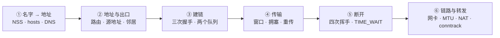

---
tags:
  - Linux
  - 网络
  - TCP
  - 排障
  - 学习地图
created: 2026-09-22
---

# 网络协议栈与排障

## 知识地图

### 一次请求的生命周期

时间主线跟着**一次请求**走：从应用拿到一个名字开始，到选定地址与出口，到握手建链、传输数据、断开连接，再到包经过链路与转发设备离开本机。

| # | 站点 | 内核在做什么 | 到这里要能说清 |
| --- | --- | --- | --- |
| 1 | 名字 → 地址 | `getaddrinfo()` → NSS → `/etc/hosts` → DNS/resolved | 为什么 `getent` 与 `dig` 可以不一致；一次解析被放大成几次查询 |
| 2 | 地址与出口 | 策略路由选表、最长前缀匹配、源地址选择、邻居解析 | 内核实际从哪张网卡、用哪个源地址、发给谁 |
| 3 | 建链 | 三次握手、半连接队列与全连接队列、`accept()` | 两个队列分别由谁决定长度、溢出后客户端看到什么 |
| 4 | 传输 | 窗口、拥塞控制、重传、MTU/MSS | `ss -ti` 里哪几个字段能判定瓶颈在应用、窗口还是丢包 |
| 5 | 断开 | 四次挥手、`TIME_WAIT`/`CLOSE_WAIT`、端口复用 | 两个状态的归属方是谁、能不能调、什么时候才需要处理 |
| 6 | 链路与转发 | 网卡与队列、bond/VLAN/网桥、`ip_forward`、NAT 与 conntrack | 「小包通、大包不通」怎么定性；主机内外的界线在哪 |

**贯穿全章的一个三问**：这条连接是谁（四元组）；它卡在哪一层、那一层的计数器在动什么；哪些动作会毁掉现场、哪些动作不可逆。

**读法上要注意方向**：站点 1~5 是「应用发起请求」的顺序，站点 6 是「包离开本机」之后的路径；而排障通常从站点 6 往上反向排除。两个方向都对，混用会得出「应用日志没问题所以网络没问题」这类结论。

### 五条横切线

| 横切线 | 贯穿内容 | 收口于 |
| --- | --- | --- |
| 队列与上限线 | 解析查询 → 半连接队列 → 全连接队列 → 源端口 → 发送队列 → 收包软中断 → 环缓冲 → conntrack 表 | 「偶发失败」的判定树：先确定是哪个排队点 |
| 证据与计数线 | `ss` 的瞬时状态 → `nstat` 的累计计数 → `ss -ti` 的连接细节 → `ethtool -S` 的驱动计数 → 抓包 | 用计数器而不是感觉定位，且必须交叉验证 |
| 名字解析线 | `nsswitch.conf` 顺序 → `/etc/hosts` → `resolv.conf` → resolved 存根与缓存 → 容器内独立配置 | 「解析慢、结果不一致」的归因 |
| 边界线 | 主机内（协议栈、队列、参数、驱动）→ 主机外（防火墙、安全组、LB、云网络、对端） | 「主机侧干净时不要在本机反复折腾」 |
| 变更纪律线 | 参数载体 → 生效方式 → 持久化位置 → 回滚与验收 | 任何影响连通性的改动都要能回滚 |

## 术语速查

| 名词 | 一句话解释 | 在哪一篇展开 |
| --- | --- | --- |
| 四元组 | 源地址 + 源端口 + 目的地址 + 目的端口（加协议即五元组），一条连接的身份 | 原理：分层模型与数据包的一生 |
| 端口 / 源端口 / 监听端口 | 标识应用的那 16 位整数 / 本机主动发起连接时内核分配的端口 / 服务绑定的那个端口，可被多条连接共用 | 原理：端口、套接字与多路复用 |
| socket / 监听与已连接 | 内核里代表通信的对象 / 前者带队列、后者带缓冲区 | 原理：端口、套接字与多路复用 |
| `LISTEN` / `ESTABLISHED` / `SYN_SENT` / `SYN_RECV` / `TIME_WAIT` / `CLOSE_WAIT` | 连接状态机里的几个关键态：在监听 / 已建立 / 已发 SYN 等回应 / 收到 SYN 待完成 / 主动关闭后等 2MSL / 收到对端 FIN 但应用没 `close()` | 原理：端口、套接字与多路复用 |
| MTU / MSS | 链路层一帧的最大载荷 / TCP 一段里应用数据的上限（MSS ≈ MTU − 40） | 原理：分层模型与数据包的一生 |
| PMTU / PMTUD | 路径 MTU / 依赖 ICMP 的发现机制，ICMP 被禁就成黑洞 | 原理：分层模型与数据包的一生 · 体系 |
| MSS clamping | 在网关上改写 SYN 的 MSS，用来规避 PMTU 黑洞 | 体系 · 治理 |
| CIDR / 前缀长度 | 地址与「前多少位是网络位」的合写，判断同网段靠它截断比较 | 原理：地址、路由与邻居 |
| 最长前缀优先 | 路由匹配规则：能匹配的条目里选前缀最长的一条 | 原理：地址、路由与邻居 |
| 源地址选择 | 内核为出包挑选源地址的过程，`ip route get` 的 `src` 是最终答案 | 原理：地址、路由与邻居 |
| 策略路由（`ip rule`） | 先按规则选出用哪张路由表，再查表；编号越小越优先 | 原理：地址、路由与邻居 |
| ARP / NDP | IPv4 的地址解析协议 / IPv6 的邻居发现，负责把 IP 换成 MAC | 原理：地址、路由与邻居 |
| `rp_filter` | 反向路径过滤，非对称路由下会误杀正常流量 | 原理：地址、路由与邻居 · 治理 |
| network namespace | 一套独立的网络栈（接口、路由、邻居、socket、conntrack、`net.ipv4.*`） | 原理：分层模型与数据包的一生 |
| veth pair | 一对虚拟网线，一端进另一端出；容器网络的基础积木 | 原理：分层模型与数据包的一生 |
| NSS | 名字服务开关，决定应用解析名字时按什么顺序问谁 | 原理：连接的生命周期 |
| `ndots` / `search` | `resolv.conf` 的后缀尝试规则，会让一次解析放大成多次查询 | 原理：连接的生命周期 · 体系 |
| 递归解析器 / TTL / 否定缓存 | 替你问根与权威的 DNS 服务器 / 记录可缓存秒数 / 「不存在」也会被缓存 | 原理：连接的生命周期 |
| `getaddrinfo()` | 应用解析名字的库函数，走 NSS；`dig` 绕过它 | 原理：连接的生命周期 |
| 三次握手 | SYN → SYN+ACK → ACK；完成后连接进入 `ESTABLISHED` | 原理：连接的生命周期 |
| 半连接队列 / 全连接队列 | 收到 SYN 后的 `SYN_RECV` 队列 / 握手完成、等 `accept()` 的队列 | 原理：连接的生命周期 · 体系 |
| `Recv-Q` / `Send-Q`（`LISTEN`） | 监听 socket 的当前队列深度 / 队列上限 | 原理：端口、套接字与多路复用 |
| `backlog` / `somaxconn` | 应用 `listen()` 传入的长度 / 全连接队列被截断时的全局上限 | 原理：连接的生命周期 |
| syncookies | 半连接队列满时不排队、直接用 cookie 完成握手的兜底机制 | 原理：连接的生命周期 |
| `cwnd` / `rwnd` / BDP | 拥塞窗口 / 对端通告的接收窗口 / 带宽延迟积（带宽 × RTT） | 原理：连接的生命周期 |
| `rtt` / `minrtt` | 平滑 RTT / 观测到的最小 RTT，两者差距大说明路径上有排队 | 原理：连接的生命周期 · 实操 |
| `app_limited` | 应用没喂满连接——瓶颈在应用，不在网络 | 原理：连接的生命周期 · 实操 |
| 拥塞控制 / CUBIC / BBR | 决定发送速率的机制 / 以丢包为判据 / 以带宽与最小 RTT 估计为判据 | 原理：连接的生命周期 |
| 四次挥手 | FIN → ACK → FIN → ACK；**主动关闭方**才会进入 `TIME_WAIT` | 原理：连接的生命周期 |
| `TIME_WAIT` / 2MSL | 主动关闭方的等待状态 / 等两个最大报文生存期，Linux 固定 60 秒 | 原理：连接的生命周期 |
| `FIN_WAIT2` | 已发 FIN、等对端 FIN 的状态，由 `tcp_fin_timeout` 控制 | 原理：连接的生命周期 |
| `CLOSE_WAIT` | 被动关闭方收到 FIN、应用没 `close()`；只能改应用 | 原理：连接的生命周期 |
| conntrack | 内核连接跟踪表，NAT 与状态化规则的基础；表满是静默丢包 | 体系 · 治理 |
| `ip_forward` | 是否允许三层转发；不等于放行 | 原理：地址、路由与邻居 · 体系 |
| 五链 | `PREROUTING` / `INPUT` / `FORWARD` / `OUTPUT` / `POSTROUTING` 的处理顺序 | 原理：地址、路由与邻居 |
| bond / LACP | 多网卡聚合 / 需要两端协商的模式 4，只配一端等于没聚合 | 体系 |
| VLAN / 网桥 | 在一条链路上划分二层广播域（802.1Q）/ 二层转发设备 | 体系 |
| offload | 把校验、分段交给网卡做（TSO/GSO/checksum），用 CPU 换吞吐 | 实操 · 治理 |
| RSS / RPS / RFS | 网卡多队列 / 软件收包分流 / 按流分流 | 实操 · 治理 |
| `netem` | `tc` 的故障注入模块（delay/loss/reorder/corrupt/rate），只作用于出口 | 实操 |
| `softnet_stat` | `/proc/net/softnet_stat`，每个 CPU 的收包统计（第 2 列是 dropped） | 实操 |
| `TcpExt*` 计数器 | `nstat` 暴露的协议栈计数（`ListenOverflows`、`SyncookiesSent`、`TCPReqQFull*`…） | 实操 · 治理 |

## 故障现场定位表

排障的第一问不是「怎么修」，而是「**这条连接卡在哪一层、哪一层的计数器在动**」。用这张表把现象定位到类别，再进对应篇目。

| 你看到的现象 | 属于哪一类 | 现场在哪 | 第一反应不要做 |
| --- | --- | --- | --- |
| 客户端偶发超时、服务端应用无日志 | 全连接队列溢出 | `ss -lnt` 的 `Recv-Q > Send-Q`、`nstat` 的 `ListenOverflows`/`ListenDrops` 增量 | 不要先怀疑网络抖动，也不要重启服务 |
| 客户端 `SYN-SENT` 堆积、服务端计数不涨 | SYN 被中间设备丢 / conntrack 满 | 两侧限流抓包对照、`nf_conntrack_count/max` | 不要在服务端反复重启应用 |
| 连接被立刻 `Connection refused` | 没监听，或溢出时回了 RST | `ss -lntp`、`tcp_abort_on_overflow` | 不要把它当成「网络不通」 |
| `ping` 通但端口连不上 | 端口或过滤设备 | `ss -lntp`、`nc -vz`、`nft list ruleset` | 不要把 `ping` 通当成 TCP 通 |
| 大量 `TIME_WAIT` | 主动关闭方的正常状态 | `ss -s`、`ip_local_port_range`、`TcpExtTCPTimeWaitOverflow` | **不要调 `tcp_fin_timeout`**（与它无关） |
| `CLOSE_WAIT` 堆积 | 应用没 `close()` | `ss -tanp state close-wait`、`/proc/<pid>/fd` | 不要调内核参数（没有这项） |
| 句柄数单调增长、连接池被打满 | 应用连接泄漏 | 进程句柄数、上游连接数 | 不要只重启不做定位 |
| `ss -ti` 里出现 `app_limited` | 应用没喂满连接 | `ss -ti`、应用侧指标 | 不要在网络上找原因 |
| 吞吐上不去、`retrans` 明显 | 丢包与重传 | `nstat` 重传率、`ss -ti` | 不要先扩带宽 |
| `ping` 通、小请求通、大响应卡住 | MTU/PMTU 黑洞 | `ping -M do -s 1472`、`ip link show`、`ss -ti` 的 `pmtu` | 不要先扩带宽 |
| `getent` 能解析、`dig` 不能（或相反） | 两条解析路径不同 | `/etc/nsswitch.conf`、`/etc/resolv.conf`、`resolvectl status` | 不要说「DNS 坏了」 |
| 解析慢、应用偶发变慢 | `search` × `ndots` 放大 | `time getent hosts`、`resolvectl statistics`、容器内 `resolv.conf` | 不要只怪 DNS 服务器 |
| SSH 登录慢 | 反向 DNS / PAM 远程模块 / MTU | `sshd -T`、`getent hosts <client_ip>`、`ping -M do` | 不要直接重装 SSH |
| 收包软中断来不及、单核打满 | 中断与队列分布 | `/proc/net/softnet_stat`、`/proc/interrupts` | 不要盲目调大 `netdev_max_backlog` |
| 网卡计数器出现丢包/错误 | 链路与驱动 | `ip -s link`、`ethtool -S`、`ethtool -g` | 不要只看 `ss`（那里看不到） |
| 云主机偶发连不上、主机侧干净 | 主机外 | 两侧计数对照、安全组/LB/云网络 | 不要在本机反复折腾 |
| 容器/Pod 里连不上，宿主机正常 | 命名空间与转发 | `nsenter -t <pid> -n ss -lntp`、veth、CNI 规则、conntrack | 不要用宿主机视图推断 Pod 状态 |

两个容易被忽略的边界：

- **「够不够」与「谁在用」是两个问题。** 队列够不够看 `Recv-Q`/`Send-Q` 与 `somaxconn`；谁在用看 `ss -tanp` 的进程归属。混在一起问，就会得出「机器很空闲怎么可能连不上」。
- **「变慢」与「失败」是两种结局。** 重传、窗口受限、缓冲区不足制造的是变慢（可观测、可调优）；队列溢出、conntrack 满、MTU 黑洞制造的是失败（先取证，再动手）。**失败类故障里，主机侧计数器往往比应用日志更早说话。**

## 篇目

| # | 篇目 | 一句话 |
| --- | --- | --- |
| 01 | [[Linux/06_网络协议栈与排障/01_原理_分层模型与数据包的一生\|原理：分层模型与数据包的一生]] | 四层各管什么、封装与解封装、MTU/MSS、四元组与命名空间 |
| 02 | [[Linux/06_网络协议栈与排障/02_原理_地址子网路由与邻居\|原理：地址、路由与邻居]] | 前缀与网段、最长前缀匹配、源地址选择、ARP/NDP、转发与五链 |
| 03 | [[Linux/06_网络协议栈与排障/03_原理_端口套接字与多路复用\|原理：端口、套接字与多路复用]] | 端口分段、两种 socket、状态集合、源端口是一种有限资源 |
| 04 | [[Linux/06_网络协议栈与排障/04_原理_连接的生命周期\|原理：连接的生命周期]] | NSS 与 DNS、三次握手与两个队列、窗口与拥塞、四次挥手与两个状态 |
| 05 | [[Linux/06_网络协议栈与排障/05_体系_一次请求的生命周期\|体系：一次请求的生命周期]] | 六段主线一条线走完，含五条横切线与字段读法 |
| 06 | [[Linux/06_网络协议栈与排障/06_实操_观测与基线\|实操：协议栈观测与网络基线]] | 一个问题一把工具、字段怎么读、十类现象的排查方向 |
| 07 | [[Linux/06_网络协议栈与排障/07_判例_高频误判\|判例：高频误判]] | 现象 → 误判 → 判据 → 出处 |
| 08 | [[Linux/06_网络协议栈与排障/08_治理_网络基线与变更治理\|治理：网络基线与变更治理]] | 上限配在哪一层、容量怎么算、基线与变更记录模板 |
| 09 | [[Linux/06_网络协议栈与排障/09_验收_盲区排查\|验收：盲区排查]] | 八类现象逐层剖析、五条横切线的四层定位、缺口类型与补法、交付物与核对方式 |

## 参考文档

- `man 7 ip`、`man 7 tcp`、`man 7 udp`、`man 7 socket`、`man 7 arp`、`man 3 getaddrinfo`、`man 2 listen`、`man 2 accept`、`man 2 close`。
- `man 8 ip`、`man 8 ip-route`、`man 8 ip-rule`、`man 8 ip-neighbour`、`man 8 ip-link`、`man 8 ip-netns`、`man 8 ss`、`man 8 nstat`、`man 8 ethtool`、`man 8 tc`、`man 8 tc-netem`、`man 8 tcpdump`、`man 7 pcap-filter`、`man 8 nsenter`。
- `man 5 nsswitch.conf`、`man 5 resolv.conf`、`man 5 hosts`、`man 1 getent`、`man 1 dig`、`man 1 resolvectl`、`man 5 systemd-resolved.service`。
- `man 8 conntrack`、`man 8 nft`、`man 8 iptables`、`man 8 sysctl`、`man 5 sysctl.d`、`man 8 systemd-sysctl`、`man 5 proc`。
- 内核 6.x 文档 `Documentation/networking/ip-sysctl.rst`、`Documentation/networking/nf_conntrack-sysctl.rst`、`Documentation/networking/snmp_counter.rst`、`Documentation/networking/scaling.rst`、`Documentation/networking/bonding.rst`、`Documentation/networking/vxlan.rst`、`Documentation/networking/veth.rst`、`Documentation/networking/bridge.rst`。内核文档一律按与目标机器同一主版本取（当前基线 6.x）。
- RFC 5681（TCP 拥塞控制）、RFC 6298（重传超时）、RFC 1034/1035（DNS 基础）、RFC 6761（`localhost` 等特殊名字）。

