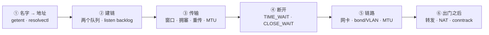

---
tags:
  - Linux
  - 网络
  - TCP
  - 排障
  - 学习地图
created: 2026-09-18
---

# 网络协议栈与排障

> [!cite] 参考资料
> `man 7 tcp`、`man 7 ip`、`man 7 socket`、`man 8 ss`、`man 8 nstat`、`man 8 ip`、`man 8 ip-route`、`man 8 ip-neighbour`、`man 8 tc`、`man 8 tc-netem`、`man 8 tcpdump`、`man 8 ethtool`、`man 5 nsswitch.conf`、`man 5 resolv.conf`、`man 5 systemd-resolved`、`man 8 resolvectl`、`man 8 conntrack`、`man 8 nft`、`man 8 iptables`，内核文档 `Documentation/networking/ip-sysctl.rst`、`Documentation/networking/filter.rst`，以及内核源码 `net/ipv4/tcp_input.c`（`tcp_conn_request()`）、`include/net/inet_connection_sock.h`、`include/net/tcp.h`（`TCP_TIMEWAIT_LEN`）。
>
> **实测状态**：全章 15 篇的实测输出已在**本实验机**上本次重跑并粘贴，替换了原 WSL2 输出。实测环境：**Ubuntu 24.04.5 LTS（VMware 虚拟机）/ 内核 `6.8.0-139-generic` / systemd 255（`255.4-1ubuntu8.17`）/ cgroup2fs（v2）/ 4 vCPU / `MemTotal` 7894 MiB / root 可用。** 本章的网络事实基线：网卡 `ens33`（驱动 `e1000`，`192.168.246.128/24`，网关 `192.168.246.2`）；DNS 走 `systemd-resolved` 存根 `127.0.0.53`（真实上游 `192.168.246.2`，`resolv.conf mode: stub`）；`tcp_max_syn_backlog=512`、`tcp_max_tw_buckets=32768`、`somaxconn=4096`、`tcp_syncookies=1`、`ip_forward=0`；`nf_conntrack` 模块**默认未加载**；**非特权 user namespace 被 AppArmor 禁用**（`kernel.apparmor_restrict_unprivileged_userns=1`），隔离实验一律用 root 直接建 `ip netns`。
>
> **仍未实测**（各篇已标注）：真实 Kubernetes 集群与云网络/安全组/LB 的行为；两台机器同时抓包的二分定位；真实跨地域长肥链路；真实交换机侧的 LACP 协商；物理网卡（非 VMware 模拟网卡）的队列与中断分布。
>
> 实测状态与未实测部分集中写在各子笔记开头的「参考资料」里；本文与子笔记中未实测的命令输出都显式标注，不能当作实测结论使用。

> 本笔记对应《Linux 运维学习大纲》的「阶段 6：网络协议栈与排障」，也是全书中**难度最高、面试区分度最大**的一章。
>
> **本页是子目录 `06_网络协议栈与排障/` 的 00 号导读，不是全部正文。** 知识脉络、生产技能地图、术语速查、故障现场定位表都在这一页；逐项深入的正文按知识点拆成子笔记，索引见第 7 节。
>
> **读者定位：刚入职的运维/SRE。** 假设你会基本 shell、会用 `ip a`/`ping`/`curl`、知道 IP 和端口是什么，但**没系统学过「一次连接从名字到断开会穿过哪些层、每层的证据在哪、出了问题先动哪里」**。这一章要补的前置知识在第 1.3 节，并单独成篇（子笔记 01–03）。
>
> 说明：默认值、字段与行为以 man 页、内核文档与发行版官方文档为准。文中「预期输出」若来自实测会明确写「实测」，否则标注为按 man 页撰写。**网络章节的全部破坏性演练（伪造 SYN、注入延迟丢包、改 MTU）只在实验机的独立 network namespace 里做**，边界见第 3 节。

> [!info] 读之前：先自检三条前提
> 1. **一台能 root 的 Linux 实验机**（本套笔记的实测环境是一台 Ubuntu 24.04.5 虚拟机，root 可用），装有 `iproute2`、`python3`、`ss`、`nstat`、`tcpdump`、`ethtool`。子笔记 13 的 7 个实验里，实验 3 及复用它的实验 5/6/7 会建 **network namespace + veth 拓扑**，需要 `CAP_NET_ADMIN`（伪造 SYN 还需要 `CAP_NET_RAW`）——**在普通容器里通常做不了**。**非 root 身份在这类环境上会碰壁**：Ubuntu 24.04 起 AppArmor 默认禁用非特权 user namespace（实测 `kernel.apparmor_restrict_unprivileged_userns=1`，非 root 下 `unshare -U -r -n` 与 `ip netns add` 都报 `Operation not permitted`），**正确做法是用 root/`sudo` 直接做，而不是去找绕过手段**。
> 2. **能接受「先建立直觉、再抠细节」**。这一章最难的地方不是命令，而是「现在该看哪一层」。第 1 节的六站地图和子笔记 01 的「数据包的一生」就是为此写的，**看不懂 1.x 小节时先看这两处，再回来**。
> 3. **知道 `/proc` 和 `/sys` 是内核暴露的实时状态**，不是磁盘上的普通文件（本阶段要看 `/proc/net/snmp`、`/proc/net/softnet_stat`、`/sys/class/net/*/queues/*`）。不熟可以先看子笔记 03。
>
> 相邻章节的概念会在正文里被提到（例如 `D` 状态与句柄上限、缓冲区换吞吐的内存代价、`_netdev` 与网络存储挂载、`network-online.target`、软中断与单核打满、Pod/Service 的宿主侧机制），**但正文只引用本章内部的子笔记**；需要复习相邻章节时，回大纲页找对应章节即可。

## 0. 30 秒速览

> [!abstract] 这一章只要记住七句话
> 首学读不懂很正常：先跳过这一节，读完第 1 节与子笔记 01 再回来逐条验证——每一条都是「结论 + 一句可复现的证据」。
> - **一次连接要走六站**：名字 → 地址 → 建链 → 传输 → 断开 → 链路 → 出门之后。**排障的难点从来不是命令，而是「现在该看哪一层」**；每站都有一张「看什么、用什么命令」的判据表（子笔记 01–09）。
> - **服务端有两个队列，不是一个**：半连接队列（`SYN_RECV`）和全连接队列（已握手、等 `accept()`）。**`ss -lnt` 的 `Recv-Q` 是当前队列深度、`Send-Q` 才是队列上限**——`Recv-Q > Send-Q` 就直接说明「队列满了」。实测 `listen(1)` 时能塞进 2 条（内核判满是 `>` 而非 `>=`，即上限 = backlog + 1）。
> - **全连接队列的上限是 `min(backlog, somaxconn)`**：实测 `listen(10000)` 在 `somaxconn=4096` 的机器上被静默截断成 4096，所以「只调大应用 backlog」经常是无效动作；溢出时内核默认**静默丢弃** SYN（`tcp_abort_on_overflow=0`），客户端从第 3 条起超时（实测 `TimeoutError: timed out (1.001 s)`），服务端只在 `nstat` 的 `TcpExtListenOverflows`/`ListenDrops` 里留下痕迹（实测从 0 涨到 6）——**这就是「客户端偶发超时、服务端没日志」的经典现场**。
> - **半连接队列满不一定丢包**：`tcp_syncookies=1`（本机默认）时内核改发 cookie，实测 20 个伪造源 SYN → `TcpExtSyncookiesSent 18`/`TcpExtTCPReqQFullDoCookies 18`、**`ListenDrops 0`**；关掉 syncookies 才变成真丢包（同样 20 个 → `TCPReqQFullDrop 20`、`ListenDrops 20`）。
> - **`TIME_WAIT` 和 `CLOSE_WAIT` 是两件完全不同的事**：前者是**主动关闭方**的正常状态，Linux 固定 **60 秒**（实测进入 `TIME-WAIT` 后 **62.06 秒**消失），**没有任何 sysctl 能改**；后者是**应用收到 FIN 却没调 `close()`**，只能改应用。**`tcp_fin_timeout` 管的是 `FIN_WAIT2` 的超时，不是 `TIME_WAIT`**——这是最高频的面试误解。
> - **不抓包也能看出链路质量**：`ss -ti` 直接给出 `rtt`/`minrtt`/`cwnd`/`retrans`/`pacing_rate`/`delivered`/`app_limited`。实测空闲连接：`cubic wscale:7,7 rto:201 rtt:0.014/0.007 mss:1448 pmtu:1500 cwnd:10 … minrtt:0.014`；**出现 `app_limited` 说明「慢」不在网络上**。
> - **分层是唯一可靠的方法**：`ping` 通 ≠ TCP 能连（防火墙/`ListenDrops`）≠ 应用正常（DNS、证书、后端）；反过来 TCP 能连也不代表吞吐正常（MTU、窗口、丢包）。按 **link/driver → IP/路由 → 端口/防火墙 → DNS → 应用** 自下而上看，见子笔记 12。

> [!tip] 这一页怎么用：三条入口
> - **系统学（推荐，按阶段 6 的 5~7 天）**：从第 4 节的「四级训练台阶」开始，T0 → T4 逐级往上；每一级都用第 2 节的技能表核对交付物。
> - **出事急救**：直接看第 6 节「故障现场定位表」，定位到类别后进对应子笔记，或直接翻子笔记 12《网络故障处置手册》。
> - **面试速览**：第 0 节 + 第 1 节 + 第 5 节术语表 + 各子笔记末尾的自测卡；每道题都要能补一句「第一反应不要是什么」。

## 1. 知识地图（第一条主线）

### 1.1 一次连接的一生：六站

阶段 2 的启动流程是一条「接力」时间线，阶段 3 是「一个进程的一生」，阶段 4 是「一次内存分配的旅程」，阶段 5 跟着**一块盘**走；网络这一章跟着**一次连接**走：从应用拿到一个名字开始，到这条连接断开、直到对方的中间设备上留下什么痕迹为止。

| # | 站点 | 内核/设备在做什么 | 这一站的证据 | 主要子笔记 |
| --- | --- | --- | --- | --- |
| 1 | 名字 → 地址 | `getaddrinfo()` → `nsswitch` → `/etc/hosts` → DNS/resolved | `getent`、`resolvectl`、`dig`、`resolv.conf`/`nsswitch.conf` | 04 |
| 2 | 建链 | 三次握手、半连接队列 → 全连接队列、`accept()` | `ss -lnt` 的 `Recv-Q`/`Send-Q`、`nstat` 的 `ListenOverflows`/`ListenDrops` | 05 |
| 3 | 传输 | 窗口、拥塞控制、重传、MTU 与分片 | `ss -ti` 的 `rtt`/`minrtt`/`cwnd`/`retrans`/`app_limited`、`nstat` 重传计数 | 06 |
| 4 | 断开 | 四次挥手、`TIME_WAIT`/`CLOSE_WAIT`、连接复用 | 状态分布、`tcp_max_tw_buckets`、`ip_local_port_range` | 07 |
| 5 | 链路 | 网卡与队列、bond/VLAN/网桥、MTU/PMTU | `ip -s link`、`ethtool -S/-g/-l/-i/-k`、`/proc/interrupts` | 08 |
| 6 | 出门之后 | 转发、NAT、conntrack、中间设备与云网络 | `nf_conntrack_count`/`max`、`dmesg` 的 `table full`、`nft list ruleset` | 09 |

> [!note] 六站是「排障视角」的顺序，不是「封包视角」的顺序
> 内核真正发一个包时，是从应用往下逐层封装：TCP → IP → 链路 → 网卡。而排障时人是从现象往上找：先看服务在不在、再看端口、再看地址与路由、最后看网卡。**这两个方向都对，不要混着用**：子笔记 01 讲「封包视角」（数据包的一生），第 1.1 节这张表讲「排障视角」（一次连接的一生）。

**这一章真正要练出来的，是同一个三问：**

1. **这条连接的「身份」是什么？** —— 四元组（源地址、源端口、目的地址、目的端口）+ 协议。同一个服务上「连不上」「连得慢」「连上了但拿不到数据」是三个不同的四元组状态问题；分不清身份，就会在错的对象上取证（子笔记 01、03）。
2. **卡在哪一层、证据是什么？** —— 是名字没解析、路由没有出口、握手被丢、队列溢出、窗口受限、MTU 黑洞，还是 conntrack 满？每一层都有**计数器**，能用计数器说话就不要用感觉说话（子笔记 02–09、11）。
3. **哪些动作会毁掉现场、哪些动作不可逆？** —— 重启服务会清掉 `ss`/`nstat`/conntrack 里唯一的现场；生产机上不限流抓包能把机器抓挂；改 MTU、改环缓冲会短暂断流；关掉 syncookies、打开 `tcp_abort_on_overflow` 会把「慢失败」变成用户可见的错误（子笔记 10、12）。

把这三问记住，后面每一篇你都能自己往里填内容，而不是背一堆命令。

### 1.2 四条横切线

六站是时间线，但有几件事会横穿多个站点。新人最容易「每一站都看过、却串不起来」，就是因为没抓住这四条线：

| 横切线 | 贯穿内容 | 收口于 | 主要子笔记 |
| --- | --- | --- | --- |
| **队列与上限线** | 半连接队列 → 全连接队列 → 源端口范围 → conntrack 表 → 环缓冲与 backlog | 「没有报错，但偶发失败」的判定树 | 05、07、09、11、12 |
| **状态与生命周期线** | 四元组 → 状态机（`LISTEN`/`SYN_SENT`/`ESTAB`/`TIME_WAIT`/`CLOSE_WAIT`）→ 谁主动关闭 → 连接池 | 「连接数异常」的归属判定 | 03、05、06、07 |
| **计数与证据线** | `ss` 的队列与状态 → `nstat` 的协议计数 → `ss -ti` 的连接细节 → `ethtool -S` 的驱动计数 → 抓包 | 用计数器而不是感觉定位 | 03、06、10、11 |
| **边界线** | 主机内（协议栈、队列、参数）→ 主机外（防火墙、安全组、LB、云网络、对端） | 「主机侧干净时不要在本机反复折腾」 | 09、11、12 |

还有一条不是机制、而是动作：**变更纪律**。它不贯穿某一层，而是每一站都要练的习惯——改参数前先留基线（`nstat`/`ss`/`sysctl`），一次只改一项，改完用同一条命令复测；任何影响连通性的动作（改 MTU、改环缓冲、动防火墙、重启网络）都先排窗口、先想回滚（子笔记 11、12）。

### 1.3 前置地基

以下三块是读懂六站的最低门槛。**它们不是「扩展阅读」，是必修**——缺哪块补哪块，再回来看主线。网络这一章的难点几乎全部来自「前置没铺平就直接看握手与队列」。

| 前置篇 | 你要先建立的概念 | 对应子笔记 |
| --- | --- | --- |
| 分层模型与数据包的一生 | 应用/TCP/IP/链路四层各自管什么、封装与解封装、MTU 与 MSS、四元组与 socket；一次请求在抓包里长什么样 | [[Linux/06_网络协议栈与排障/01_前置_分层模型与数据包的一生\|01 前置：分层模型与数据包的一生]] |
| 地址、子网与路由 | IP 地址与 CIDR、网关与默认路由、同一个网段内为什么要 ARP、源地址怎么选、`ip` 命令族与 `ip route get` | [[Linux/06_网络协议栈与排障/02_前置_地址子网与路由\|02 前置：地址、子网与路由]] |
| 端口、套接字与观测工具 | 端口与四元组、socket 的两种身份（监听/已连接）、`ss`/`nstat`/`/proc/net/*`/`ethtool` 各答什么问题 | [[Linux/06_网络协议栈与排障/03_前置_端口套接字与观测工具\|03 前置：端口、套接字与观测工具]] |

> [!warning] 网络比存储更容易「看起来懂了」
> 存储的错配是「有空间却写不进去」，网络的错配是「能 `ping` 通却连不上」。两者都靠**把现象拆到具体一层**才能解决。如果读完子笔记 01–03 还画不出「一次 `curl` 从名字解析到收到响应」的链路图，先别急着做队列实验——那会变成背命令。

## 2. 生产技能地图（第二条主线）

知识和技能是两条线。**读完不等于会做**，所以这一章明确交付 8 项技能，每项都有可观察的行为和一个交付物。学每一篇的时候，对照这张表看自己在练哪一项。

| # | 技能 | 可观察的行为 | 在哪几篇练 | 交付物 |
| --- | --- | --- | --- | --- |
| N1 | 网络基线与资产台账 | 拿到一台陌生机器，15 分钟内说清「有几张网卡、地址与路由怎么走、监听哪些端口、关键网络参数是多少、当前连接状态分布如何」 | 02、03、11、13 | 一份网络基线卡 |
| N2 | 连接状态判读 | 用 `ss` 的状态分布说清「谁在连接、谁在等、谁在关」，并把 `TIME_WAIT`/`CLOSE_WAIT` 归到正确的一方 | 03、05、06、07 | 一份连接状态判读记录 |
| N3 | 队列与上限治理 | 判断一次「偶发连不上」是半连接队列、全连接队列、源端口还是 conntrack，并给出参数与应用的对应动作 | 05、07、09、12 | 一份队列/上限核对表 |
| N4 | 分层排障 | 对「连不上 / 很慢 / 吞吐上不去 / 丢包」四类现象，按 link → IP → 端口 → DNS → 应用给出证据链 | 02、03、12 | 一份分层排障记录 |
| N5 | 名字解析治理 | 用 `getent` 复现应用行为，解释与 `dig` 不一致的原因，并处理 `search`/`ndots` 带来的解析放大 | 04、12 | 一份解析链路核对表 |
| N6 | 链路与 MTU 处置 | 用 `ping -M do` 在两分钟内定性 MTU 问题，并说清 bond/VLAN/网桥的常见坑与回滚方式 | 08、12、13 | 一份 MTU/链路处置记录 |
| N7 | 抓包与故障注入 | 在生产上按「限流限时落盘」抓一次包；在实验链路上用 `netem` 复现「偶发变慢」 | 10、13 | 一份抓包记录 + 一份注入复现记录 |
| N8 | 主机侧调优 | 用中断/软中断/队列/环缓冲/offload 五个抓手，在**有量化依据**的前提下改一项并复测 | 08、11、13 | 一份调优变更记录（含基线与回滚） |

这 8 项里，N2、N3、N4 是**判断力**，也是新人最容易卡住的三项：状态看不懂、上限说不清、分层顺序讲不出，后面所有结论都会歪。N5、N6、N7 是**取证力**，N1 是共同起点，N8 才是调优——**顺序不能颠倒**：没有基线与证据就调参，等于赌博。

## 3. 四级训练台阶

技能靠难度递增、风险可控的重复练习获得。**每一级都写明了在哪台机器上做**，这条边界本身就是 N4 的训练内容。

| 台阶 | 做什么 | 在哪台机器 | 交付物 |
| --- | --- | --- | --- |
| **T0 读通** | 画出「名字 → 地址 → 握手 → 传输 → 断开」这条链路；说清「连不上 / 很慢 / 吞吐上不去 / 丢包」四类现象各应该先看哪一层 | 纸面/白板 | 自己画的一张网络分层与连接生命周期图 |
| **T1 观测** | 采集网卡、地址、路由、监听端口、参数、连接状态、计数器七类基线；全程只读 | **生产机可以做（只读）** | 网络基线卡 |
| **T2 可回滚变更** | 在实验机上：用 `tc netem` 注入延迟/丢包并复现现象 → 复原 → 用 `ping -M do` 验证 MTU；改一项 sysctl 并复测（**注意 `net.core.*` 与 `nf_conntrack_max` 只能在全局改，`net.ipv4.*` 可以在 netns 内改**） | 实验机 | 变更记录（含验证与回滚命令） |
| **T3 故障注入与恢复** | 造一次全连接队列溢出；造一次半连接队列满（syncookies 对照）；造一次 MTU 不一致；拔掉 bond 的一个成员口验证冗余 | **可快照实验机 + 独立 network namespace** | 演练记录 + 四类现象的判读结论 |
| **T4 限时模拟** | 给一个现象（例如「客户端偶发超时、服务端没有日志」），10 分钟内定位到类别并写出处置记录 | 实验机 + 计时 | 一份排障报告 |

> [!warning] 三条不能破的边界
> **只有 T1 允许在生产机上做，而且全程只读**（`ss`、`ip`、`nstat`、`sysctl`、`ethtool` 的查询子命令这类）。
> **T2 到 T4 一律在实验机的独立 network namespace 里做**：`ip netns add srv|cli` + 一对 veth，删命名空间即回收，宿主网络栈不受影响。伪造源地址的 SYN 实验必须有**回程可路由**的环境，且要用第二个计数器交叉验证（子笔记 05 有踩坑记录）。
> **三个生产禁做动作**：不限参数抓包（`tcpdump -i any` 直接跑在高峰期）、在业务接口上改 MTU 或环缓冲（会短暂断流）、在生产机上打开 `tcp_abort_on_overflow=1` 或关掉 `tcp_syncookies`（把可恢复的抖动放大成用户可见错误）。

## 4. 学习路线

**系统学的三遍读法（对应 00_学习大纲 给的 5~7 天）：**

- **第一遍（约一天半，先把「连不上」处理掉）**：第 1 节 → 前置 01–03 → 04（名字到地址）→ 05（建链与两个队列）→ 12 的「连不上」一节 → 实验 1、2、3。这一遍结束应该能独立处理「偶发超时、服务端没日志」。
- **第二遍（约两天，把状态、传输与链路补齐）**：06（窗口与拥塞）→ 07（挥手与两个状态）→ 08（链路与 MTU）→ 09（转发与 conntrack）→ 11（基线与调优）→ 12 其余各节 → 实验 4、5、6、7。
- **第三遍（进阶与演练）**：10（抓包纪律与故障注入）→ 14（容器与 Kubernetes 视角）→ 13 汇总自测 → T3、T4。

**只想解决手头问题的快捷入口：**

| 你的问题 | 去哪 |
| --- | --- |
| 客户端偶发超时、服务端没有日志 | 子笔记 05、12 |
| 服务连不上，先查什么 | 子笔记 12 |
| 大量 `TIME_WAIT` / `CLOSE_WAIT` | 子笔记 07、12 |
| 连接堆积、队列溢出 | 子笔记 05、12 |
| TCP 能连但吞吐上不去 | 子笔记 06、12 |
| `ping` 通、大文件传不动 | 子笔记 08、12 |
| `getent` 与 `dig` 结果不一致 | 子笔记 04、12 |
| SSH 登录很慢 | 子笔记 04、12 |
| 想抓包但怕影响生产 | 子笔记 10 |
| 想复现「偶发变慢」 | 子笔记 10、13 |
| 要建网络基线 / 准备调参 | 子笔记 11 |
| 云主机偶发连不上、主机侧计数正常 | 子笔记 09、12 |
| 对端不回 RST 也不回 ACK | 子笔记 05、09 |
| 容器 / Pod 里的网络怎么查 | 子笔记 14 |

## 5. 术语速查

> [!info]- 名词速查（读到哪里卡住，就回这里查）
> | 名词 | 一句话解释 | 在哪一节展开 |
> | --- | --- | --- |
> | 四元组 | 源地址 + 源端口 + 目的地址 + 目的端口（加协议就是五元组），一条连接的身份 | 01、03 |
> | socket | 内核里代表一次通信的对象；监听 socket 与已连接 socket 是两种身份 | 01、03 |
> | MTU / MSS | 单帧最大载荷 / TCP 单段最大载荷（MSS ≈ MTU − IP 头 − TCP 头） | 01、08 |
> | PMTU / PMTUD | 路径 MTU / 依赖 ICMP 的发现机制，ICMP 被禁就成黑洞 | 08 |
> | MSS clamping | 在网关上改写 SYN 的 MSS，规避 PMTU 黑洞 | 08、12 |
> | 三次握手 | SYN → SYN+ACK → ACK；完成后连接进入 `ESTABLISHED` | 05 |
> | 半连接队列 / 全连接队列 | 收到 SYN 后的 `SYN_RECV` 队列 / 握手完成、等 `accept()` 的队列 | 05 |
> | `Recv-Q` / `Send-Q`（LISTEN） | 监听套接字的当前队列深度 / 队列上限 | 03、05 |
> | `backlog` / `somaxconn` | `listen()` 传入的队列长度 / 它被截断时的全局上限 | 05 |
> | syncookies | 半连接队列满时不排队、直接用 cookie 完成握手的兜底机制 | 05 |
> | `cwnd` / `rwnd` / BDP | 拥塞窗口 / 对端通告的接收窗口 / 带宽延迟积（带宽 × RTT） | 06 |
> | `rtt` / `minrtt` | 平滑 RTT / 观测到的最小 RTT，两者差距大就是有排队 | 06 |
> | `app_limited` | 连接没被应用喂满——瓶颈在应用，不在网络 | 06 |
> | 四次挥手 | FIN → ACK → FIN → ACK；**主动关闭方**才会进入 `TIME_WAIT` | 07 |
> | `TIME_WAIT` / `2MSL` | 主动关闭方等 60 秒的状态 / 等两个最大报文生存期，确保 ACK 送达且旧包消散 | 07 |
> | `FIN_WAIT2` | 已发 FIN、等对端 FIN 的状态，由 `tcp_fin_timeout` 控制 | 07 |
> | `CLOSE_WAIT` | 被动关闭方收到 FIN、应用还没 `close()`；只能改应用 | 07 |
> | NSS（`nsswitch.conf`） | 名称解析的插件顺序，默认 `files` 先于 `dns` | 04 |
> | `ndots` / `search` | `resolv.conf` 的后缀尝试规则，导致一次解析可能查 4~5 次 | 04 |
> | conntrack | 内核连接跟踪表，NAT 与 state 规则的基础；表满会静默丢包 | 09 |
> | 策略路由（`ip rule`） | 按源地址、fwmark 等条件选择不同的路由表 | 02 |
> | `rp_filter` | 反向路径过滤，非对称路由下会误杀正常流量 | 02、11 |
> | bond / LACP | 多网卡聚合 / 需要两端协商的模式 4 | 08 |
> | VLAN | 在一条链路上划分二层广播域（802.1Q） | 08 |
> | 网桥（bridge） | 二层转发设备，虚拟机与 Kubernetes 常用 | 08 |
> | offload | 把校验、分段等交给网卡做（TSO/GSO/checksum） | 08、11 |
> | RSS / RPS / RFS | 网卡多队列 / 软件收包分流 / 按流分流 | 08、11 |
> | `netem` | `tc` 的故障注入模块（delay/loss/reorder/corrupt/rate） | 10 |
> | `fq` / `fq_codel` | BBR 需要的 pacing 队列 / 现代发行版的默认队列规则 | 06、11 |
> | `softnet_stat` | 每个 CPU 的收包统计（第 2 列是 dropped） | 11 |
> | `TcpExt*` 计数器 | `nstat` 暴露的协议栈计数（`ListenOverflows`、`SyncookiesSent`、`TCPReqQFull*`…） | 03、05 |

## 6. 故障现场定位表

排障的第一问不是「怎么修」，而是「**这条连接卡在哪一层、哪一层的计数器在动**」。用这张表把现象定位到类别，再进对应子笔记。

| 你看到的现象 | 属于哪一类 | 现场在哪 | 第一反应不要做 | 去哪一篇 |
| --- | --- | --- | --- | --- |
| 客户端偶发超时、服务端应用无日志 | 全连接队列溢出 | `ss -lnt` 的 `Recv-Q > Send-Q`、`nstat` 的 `ListenOverflows`/`ListenDrops` | 不要先怀疑网络抖动 | 05、12 |
| 客户端 `SYN-SENT` 堆积、服务端计数不涨 | SYN 被中间设备丢 / conntrack 满 | 两侧同时 `tcpdump`、`nf_conntrack_count` 与 `max` | 不要在服务端反复重启应用 | 09、10、12 |
| 连接被立刻 `Connection refused` | 没监听 / RST 被回 | `ss -lntp`、`nstat` 的 `ListenDrops`、`tcp_abort_on_overflow` | 不要把它当成「网络不通」 | 05、12 |
| `ping` 通但端口连不上 | 端口/防火墙 | `ss -lntp`、`nft list ruleset`、`nc -vz` | 不要把 `ping` 通当成 TCP 通 | 12 |
| 大量 `TIME_WAIT` | 主动关闭方的正常状态 | `ss -s`、`ip_local_port_range`、`tcp_max_tw_buckets` | **不要调 `tcp_fin_timeout`**（与它无关） | 07、12 |
| `CLOSE_WAIT` 堆积 | 应用没 `close()` | `ss -tanp state close-wait`、`/proc/<pid>/fd` | 不要调内核参数（没有这项） | 07、12 |
| 句柄数单调增长、连接池被打满 | 应用连接泄漏 | 进程句柄数、上游连接数 | 不要只重启不做定位 | 07、12 |
| `ss -ti` 里出现 `app_limited` | 应用没喂满连接 | `ss -ti`、应用侧指标 | 不要在网络上找原因 | 06、12 |
| 吞吐上不去、`retrans` 明显 | 丢包与重传 | `nstat` 重传计数、`ss -ti` | 不要先扩带宽 | 06、12 |
| `ping` 通、小请求通、大响应卡住 | MTU/PMTU 黑洞 | `ping -M do -s 1472`、`ip link`、`ip route get` | 不要先扩带宽 | 08、12 |
| `getent` 能解析、`dig` 不能（或相反） | 解析链路两条路径 | `/etc/nsswitch.conf`、`/etc/resolv.conf`、`resolvectl status` | 不要说「DNS 坏了」 | 04、12 |
| 解析慢、应用偶发变慢 | `search` × `ndots` 放大 | `resolvectl statistics`、容器内 `resolv.conf` | 不要只怪 DNS 服务器 | 04、12 |
| SSH 登录慢 | 反向 DNS / PAM 远程模块 / MTU | `sshd -T`、`getent hosts <client_ip>`、`journalctl -u sshd` | 不要直接重装 SSH | 12 |
| SSH 传输大文件卡、小命令正常 | MTU/PMTU | `ping -M do` | 不要只怀疑带宽 | 08、12 |
| 收包软中断来不及、单核打满 | 中断与队列分布 | `/proc/net/softnet_stat`、`/proc/interrupts` | 不要盲目调大 `netdev_max_backlog` | 11、12 |
| 网卡计数器出现丢包/错误 | 链路与驱动 | `ip -s link`、`ethtool -S`、`ethtool -g` | 不要只看 `ss`（那里看不到） | 08、11、12 |
| 云主机偶发连不上、主机侧干净 | 主机外 | 两侧计数对照、安全组/LB/云网络 | 不要在本机反复折腾 | 09、12 |
| 容器/Pod 里连不上，宿主机正常 | 命名空间与转发 | `nsenter -t <pid> -n ss -lntp`、veth、CNI 规则 | 不要只查应用日志 | 14 |

两个容易被忽略的边界：

- **「够不够」和「谁在用」是两个问题。** 队列够不够看 `Recv-Q`/`Send-Q` 与 `somaxconn`（子笔记 05），谁在用看 `ss -tanp` 的进程归属（子笔记 03、07）。混在一起问，就会得出「机器很空闲怎么可能连不上」这种结论。
- **「变慢」和「失败」是两种结局。** 重传、拥塞窗口受限、缓冲区不足制造的是变慢（可观测、可调优）；队列溢出、conntrack 满、MTU 黑洞制造的是失败（先取证，再动手）。**失败类故障里，主机侧计数器往往比应用日志更早说话**——这也是 N3 必须单独练的原因。

## 7. 子笔记索引

| # | 子笔记 | 一句话 | 主要技能 | 难度 |
| --- | --- | --- | --- | --- |
| 01 | [[Linux/06_网络协议栈与排障/01_前置_分层模型与数据包的一生\|前置：分层模型与数据包的一生]] | 四层各管什么、封装与解封装、MTU/MSS、四元组是什么 | N1、N4 | 前置 |
| 02 | [[Linux/06_网络协议栈与排障/02_前置_地址子网与路由\|前置：地址、子网与路由]] | IP/CIDR、网关与默认路由、ARP、源地址选择、`ip` 命令族 | N1、N4 | 前置 |
| 03 | [[Linux/06_网络协议栈与排障/03_前置_端口套接字与观测工具\|前置：端口、套接字与观测工具]] | 端口与 socket、`ss` 全家桶、`nstat`、`/proc/net/*`、工具地图 | N1、N2 | 前置 |
| 04 | [[Linux/06_网络协议栈与排障/04_第1站_名字到地址_DNS与名字解析\|第 1 站：名字 → 地址（DNS 与名字解析）]] | NSS → hosts → DNS/resolved；`getent` 与 `dig` 为什么不一样 | N5 | 核心 |
| 05 | [[Linux/06_网络协议栈与排障/05_第2站_建链_三次握手与两个队列\|第 2 站：建链（三次握手与两个队列）]] | 两个队列、backlog 与 somaxconn、syncookies、溢出计数 | N3、N4 | 核心 |
| 06 | [[Linux/06_网络协议栈与排障/06_第3站_传输_窗口拥塞与重传\|第 3 站：传输（窗口、拥塞与重传）]] | `rwnd`/`cwnd`/BDP、cubic 与 BBR、`ss -ti` 逐字段读法 | N4 | 核心 |
| 07 | [[Linux/06_网络协议栈与排障/07_第4站_断开_四次挥手与TIME_WAIT\|第 4 站：断开（四次挥手与两个状态）]] | `TIME_WAIT` 与 `CLOSE_WAIT`、`tcp_fin_timeout` 的误解、端口耗尽 | N2、N3 | 核心 |
| 08 | [[Linux/06_网络协议栈与排障/08_第5站_链路_网卡bondVLAN网桥与MTU\|第 5 站：链路（网卡、bond/VLAN/网桥与 MTU）]] | 链路层概念、MTU 不一致与 PMTU 黑洞、MSS clamping | N6 | 核心 |
| 09 | [[Linux/06_网络协议栈与排障/09_第6站_出门之后_转发NAT与conntrack\|第 6 站：出门之后（转发、NAT 与 conntrack）]] | `ip_forward`、NAT、conntrack 表满、主机内外的分界 | N3、N4 | 核心 |
| 10 | [[Linux/06_网络协议栈与排障/10_抓包与故障注入_tcpdump与tc\|抓包与故障注入：`tcpdump` 与 `tc`]] | 限流限时落盘、精确过滤、二分定位；用 `netem` 复现偶发问题 | N7 | 核心 |
| 11 | [[Linux/06_网络协议栈与排障/11_主机侧调优与网络基线\|主机侧调优与网络基线]] | 中断/软中断/队列/环缓冲/offload 五抓手；基线采集模板 | N1、N8 | 进阶 |
| 12 | [[Linux/06_网络协议栈与排障/12_网络故障处置手册\|网络故障处置手册]] | 十类现象 → 分层 → 证据 → 处置记录 | N2–N6 | 核心 |
| 13 | [[Linux/06_网络协议栈与排障/13_动手实验与要点自测\|动手实验与要点自测]] | 七个实验的索引与总自测 | 全部 | 汇总 |
| 14 | [[Linux/06_网络协议栈与排障/14_容器与Kubernetes视角的网络衔接\|容器与 Kubernetes 视角的网络衔接]] | 命名空间、veth、Service 转发与 NetworkPolicy 的宿主侧入口 | N4、N7 | 进阶 |

## 自检清单

- [x] frontmatter 有 `tags` 和 `created`，全篇只有一个一级标题
- [x] 速览卡 7 条，每条都是结论 + 可复现的证据（数字取自本实验机本次实测）
- [x] 涉及默认值、内核行为或版本差异的地方都标注了适用版本与发行版（统一为 Ubuntu 24.04.5 LTS / 内核 6.8.0-139-generic）
- [x] 章节内引用只用章节内 wikilink；提及其他阶段一律用纯文本（不跨章节引用）
- [x] 阶段 6 已按「主笔记（地图）+ 子笔记（正文）」拆分，索引完整
- [x] 知识主线（六站 + 四条横切线）与技能主线（N1–N8 + T0–T4）都在本页可见
- [x] 全章 15 篇的「实测状态」块都已改成虚拟机口径，未实测项逐条标注
- [ ] 第 6 节的每一种现象都在对应子笔记里演练过一次
- [ ] 每张 Mermaid 图都在 Obsidian 里预览过，能正常渲染
