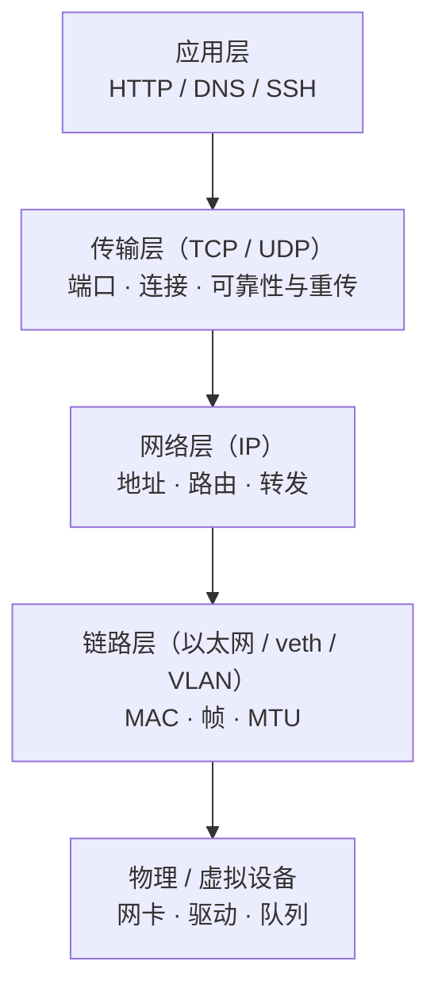
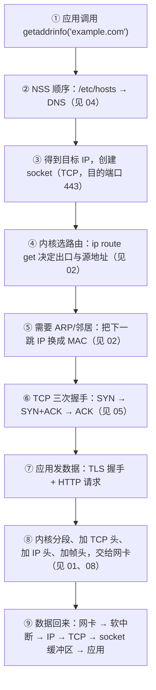

---
tags:
  - Linux
  - 网络
  - 分层模型
  - TCP/IP
  - 前置
created: 2026-09-18
---

# 前置：分层模型与数据包的一生

> [!cite] 参考资料
> `man 7 ip`、`man 7 tcp`、`man 7 udp`、`man 7 socket`、`man 7 packet`、`man 7 arp`、`man 8 ip-link`、`man 8 tcpdump`、`man 8 ss`，内核文档 `Documentation/networking/`，以及《TCP/IP 详解 卷 1》与《UNIX 网络编程 卷 1》中的分层与封装章节。
>
> **实测状态**：本篇是概念篇，**不含需要专门实测的默认值**；出现的命令都是只读观测命令。文中引用的实测数字来自同目录子笔记 05–09、13 在**本实验机**上的重跑，实测环境：**Ubuntu 24.04.5 LTS（VMware 虚拟机）/ 内核 `6.8.0-139-generic` / 4 vCPU / root 可用**；网卡 `ens33`（驱动 `e1000`，`192.168.246.128/24`，网关 `192.168.246.2`），DNS 走 `systemd-resolved` 存根 `127.0.0.53`。需要结论时请到那些篇目看证据。
>
> **未实测**：本机没有真实物理链路与中间设备，「路径 MTU 变小导致 PMTU 黑洞」这一类现象只能在隔离 netns 里用不一致 MTU 模拟（子笔记 08），真实的运营商/隧道中间设备行为未实测。

> **这篇讲什么**：网络排障的第一道门槛不是命令，而是**「一个包在每一层长什么样、每层能出什么错」**。先把分层模型、封装、四元组、MTU 与 MSS 这四件事建立起来，后面看握手、队列、拥塞窗、MTU 黑洞才有地方放。
>
> **必须先读什么**：不需要前置。会基本 shell、知道「IP 是地址、端口是门牌号」就够了。
>
> **读完能回答**：① 一次 `curl https://example.com` 从输入域名到收到响应，中间经过哪些层？② 每一层各自能出什么故障？③ `MTU` 和 `MSS` 差在哪？④ 抓包里的一行记录，对应的是哪一层的什么内容？
>
> 所属：[[Linux/06_网络协议栈与排障/00_导读与知识地图|06 网络协议栈与排障]] 的**前置地基** · 主要练 **N1 网络基线** 与 **N4 分层排障** 的思维底座

## 0. 30 秒速览

> [!abstract] 这一篇只要记住六句话
> - **分层的意义是「分工 + 定位」**：每一层只负责一件事，出问题时的证据也只在自己那一层。**排障慢，通常是因为在错误的层找证据。**
> - **一次通信是「从上往下封装、从下往上解封装」**：应用数据 → TCP 段 → IP 包 → 以太网帧。抓包抓到的是**某一层的头 + 它的载荷**，载荷里通常还套着上一层。
>   - 证据：本机实测抓包 `IP 127.0.0.1.51296 > 127.0.0.1.9303: Flags [S] … length 0` 就是「拆掉帧头之后的 IP 层视角」，四个元素（源地址、源端口、目的地址、目的端口）全在一行里。
> - **四元组是一条连接的身份**：源地址 + 源端口 + 目的地址 + 目的端口。**同一个服务上「连不上」和「连得慢」往往是不同四元组的两个问题。**
> - **监听 socket 与已连接 socket 是两种东西**：前者只有一个（`LISTEN`，带队列），后者每来一条连接就多一个（`ESTAB`）。这是理解「两个队列」的前提（子笔记 05）。
>   - 证据：本机实测 `ss -lntp` 只有 4 行 LISTEN（两个 `sshd` 的 22 端口 + 两个 `systemd-resolved` 的 53 端口），而 `ss -tan` 里的 `ESTAB` 行数随连接数增长。
> - **MTU 是二层单帧上限，MSS 是 TCP 单段上限**：MSS ≈ MTU − 20（IPv4 头）− 20（TCP 头）。**MTU 不一致或 PMTU 黑洞的表现是「小包通、大包不通」**（子笔记 08）。
>   - 证据：真实链路（`ens33`，MTU 1500）实测 `ping -M do -s 1472 192.168.246.2` 通、veth 上实测 `pmtu:1500 mss:1448`（1448 = 1460 − 12 字节时间戳）；两端 MTU 1400/1500 不一致时 `-s 1472` 100% 丢包。
> - **每一层都有自己的计数器**：链路看 `ip -s link`/`ethtool -S`，IP 与转发看 `nstat`/conntrack，TCP 看 `ss`/`nstat`，名字解析看 `getent`。**先想清楚「我现在在哪一层」，再选命令。**

## 1. 为什么要有「层」

网络天生是**分工**的：把「怎么在网线上传比特」和「怎么把文件传完整」拆成不同的层，每层只依赖下一层提供的服务，不去关心下面怎么实现。这样做带来三个直接好处，也都和排障有关：

1. **可以替换**：链路层从以太网换成 Wi-Fi、从物理网卡换成 veth，上面的 IP 与 TCP 不用改。这也是容器网络能在宿主机上「凭空造出一张网卡」的原因。
2. **可以定位**：每一层的错误有自己的表现形式与计数器。`ping` 通不通属于 IP 层的事，端口通不通属于传输层的事，能不能拿到正确响应属于应用层的事。
3. **可以组合**：隧道、overlay、VPN 都是「把一层的包塞进另一层的载荷里」，理解了封装，就理解了为什么它们会额外消耗 MTU。



> [!note] 五层还是四层，不影响排障
> 教科书里有两套模型：OSI 七层（应用/表示/会话/传输/网络/数据链路/物理）和 TCP/IP 四层（应用/传输/网络/链路）。**运维排障用四层就够了**，把「表示层、会话层」合并进应用层思考。真正要背下来的不是模型名字，而是下面这张「每层管什么、看什么」的表。

## 2. 四层各自管什么、能出什么错

| 层                | 管什么                                   | 典型故障                                     | 证据从哪里来                                                                 |
| ---------------- | ------------------------------------- | ---------------------------------------- | ---------------------------------------------------------------------- |
| **应用层**          | 协议语义：HTTP 状态码、TLS 证书、DNS 报文、SSH 认证    | 证书过期、后端 5xx、返回内容不对、认证失败                  | 应用日志、`curl -v`、`openssl s_client`、`journalctl -u`                      |
| **传输层（TCP/UDP）** | 端口、连接状态、可靠性（重传/排序/流控）、拥塞控制            | 队列溢出、`TIME_WAIT`/`CLOSE_WAIT` 异常、重传、窗口受限 | `ss`、`nstat`、`/proc/net/snmp`、`ss -ti`                                 |
| **网络层（IP）**      | 地址、路由、转发、分片、NAT/连接跟踪                  | 路由缺失、走错出口、`rp_filter` 误杀、conntrack 满     | `ip addr`、`ip route get`、`ip neigh`、`nstat`、conntrack                  |
| **链路层（含驱动）**     | MAC、帧、VLAN、bond、网桥、MTU、offload、队列与环缓冲 | 链路 down、错包、驱动丢包、MTU 不一致、bond 模式选错        | `ip -s link`、`ethtool -S/-g/-l/-i/-k`、`/proc/net/softnet_stat`、`dmesg` |

**给新人的用法**：遇到现象，先在脑子里问一句「**这属于哪一层？**」，再去找那一层的证据。例如：

- 「`ping` 通但连不上」→ IP 层没问题，去传输层与防火墙（端口、`nstat`、`nft list ruleset`）。
- 「能连上但传大文件卡住」→ 传输层与链路层的交界（MTU/MSS、重传、窗口），去子笔记 06 与 08。
- 「域名解析慢」→ 应用层依赖的名字解析服务，去子笔记 04。
- 「偶发超时、服务端没日志」→ 传输层队列（全连接队列溢出），去子笔记 05。

## 3. 数据包的一生：封装与解封装

### 3.1 一次 `curl` 的完整链路

下面这条链路是后面每一篇的「地图」。**建议在纸上照着画一遍**：



每一步都能单独失败，而且失败的现象完全不同：

| 步骤 | 失败现象 | 先看哪里 |
| --- | --- | --- |
| ② 名字解析 | `Could not resolve host`、解析慢 | 子笔记 04 |
| ④ 路由选择 | `Network is unreachable`、走错出口 | 子笔记 02 |
| ⑤ 邻居解析 | 同网段不通、`ip neigh` 显示 `FAILED`/`INCOMPLETE` | 子笔记 02 |
| ⑥ 握手 | 连接超时（被丢）、`Connection refused`（RST）、握手慢 | 子笔记 05 |
| ⑦ 应用协议 | `curl: (60) SSL certificate problem`、401/403 | 应用日志、`curl -v` |
| ⑧ 分段与发送 | `ping` 通但大响应卡住、重传 | 子笔记 06、08 |
| ⑨ 接收与上送 | 收包被丢、单核打满、应用读得慢 | 子笔记 06、11 |

### 3.2 一封「信」的封装

把「发一个 HTTP 请求」想成寄一封信：

| 层次 | 类比 | 头里有什么 | 谁是收件人 |
| --- | --- | --- | --- |
| 应用数据 | 信纸上的内容 | 请求行、头、正文 | 对端应用 |
| TCP 段 | 信封上写「第几封、共几封」 | 源端口、目的端口、序号、确认号、标志位、窗口 | 对端内核的 TCP |
| IP 包 | 信封上写「寄到哪个城市」 | 源 IP、目的 IP、TTL、协议号 | 对端主机（或中间路由器） |
| 帧 | 邮递员之间的交接单 | 源 MAC、目的 MAC、VLAN 标签、类型 | 同一网段内的下一跳设备 |

两个容易搞混的点：

- **IP 地址负责「跨网络送到主机」，MAC 负责「在同一段链路内送到下一跳」。** 跨网段通信时，目的 MAC 是**网关**的 MAC，不是最终主机的 MAC——这一点在抓包时最容易看错（子笔记 02）。
- **每一层的头都是「本层的信封」，解封装就是一层层拆。** 抓包里看到的 `IP 10.0.0.2 > 10.0.0.1: ICMP echo request` 就是「拆掉帧头之后的 IP 层视角」；`-e` 参数才会把 MAC 一起显示出来。

### 3.3 抓包里的一行是什么意思

只读观测：看一眼回环流量（会一直输出，Ctrl-C 结束）：

```bash
tcpdump -i lo -nn -c 5
```

```text
IP 127.0.0.1.52012 > 127.0.0.1.9999: Flags [S], seq 1234567890, win 65495, options [...], length 0
IP 127.0.0.1.9999 > 127.0.0.1.52012: Flags [S.], seq 987654321, ack 1234567891, ... length 0
IP 127.0.0.1.52012 > 127.0.0.1.9999: Flags [.], ack 1, ... length 0
```

（以上是**按 `tcpdump` 输出格式写的示例**，格式以本机 `tcpdump` 版本为准；子笔记 10 讲怎么限制流量、怎么落盘。）

逐项读法：

| 片段 | 含义 | 属于哪一层 |
| --- | --- | --- |
| `IP` | 这是 IP 层的数据 | 网络层 |
| `127.0.0.1.52012 > 127.0.0.1.9999` | 源地址.源端口 → 目的地址.目的端口（默认不解析名字，`-nn` 保证端口号也原样显示） | 传输层 |
| `Flags [S]` | SYN（建连请求）；`[S.]` 是 SYN+ACK；`[.]` 是纯 ACK；`[F]` FIN；`[R]` RST | 传输层 |
| `seq` / `ack` | 序号与确认号（TCP 的「第几封、收到第几封」） | 传输层 |
| `win 65495` | 本端通告给对端的接收窗口（`rwnd`） | 传输层 |
| `length 0` | 这个段携带的**应用数据**长度（握手包为 0） | 传输层 |

**这三行就是一次握手。** 后面子笔记 05 会用 `ss` 与服务端计数器讲「同一个握手在服务端内核里长什么样」——**抓包看的是线上发生了什么，`ss`/`nstat` 看的是内核怎么记账，两者互为佐证**。

本机实测的一行真包（子笔记 10 在 `lo` 上用端口 `9303` 采集，**可直接对照上表读**）：

```text
08:32:29.777519 IP 127.0.0.1.51296 > 127.0.0.1.9303: Flags [S], seq 2422559021, win 65495, options [mss 65495,sackOK,TS val 2968868735 ecr 0,nop,wscale 7], length 0
08:32:29.777527 IP 127.0.0.1.9303 > 127.0.0.1.51296: Flags [S.], seq 3676773960, ack 2422559022, win 65483, options [mss 65495,sackOK,TS val 2968868735 ecr 2968868735,nop,wscale 7], length 0
08:32:29.777535 IP 127.0.0.1.51296 > 127.0.0.1.9303: Flags [.], ack 1, win 512, options [nop,nop,TS val 2968868735 ecr 2968868735], length 0
08:32:29.777640 IP 127.0.0.1.9303 > 127.0.0.1.51296: Flags [P.], seq 1:6, ack 1, win 512, options [nop,nop,TS val 2968868735 ecr 2968868735], length 5
```

（回环链路的 `mss 65495` 是因为 `lo` 的 MTU 是 65536，不是 1500——**这正好说明 MSS 是跟着接口 MTU 走的**，别拿它当真实网络的典型值；真实链路见子笔记 08 的 veth 实测 `mss:1448`。）

## 4. 四元组与 socket：连接的「身份」

### 4.1 四元组

```text
源地址 : 源端口  →  目的地址 : 目的端口
10.0.0.2 : 43848  →  10.0.0.1 : 9999
```

加上协议（TCP/UDP）就是五元组。**四元组唯一确定一条连接**，所以：

- 同一台客户端到同一台服务端，可以同时有**很多条连接**（只是源端口不同）。
- 「客户端说连上了、服务端没见过」可以同时成立——因为服务端内核里有这条连接（`ESTAB`），但应用还没 `accept()` 它（子笔记 05）。
- 排障时必须区分「连到端口 A」和「连到端口 B」，「从客户端 A 发」和「从客户端 B 发」：**不同四元组走的可能是完全不同的路径与规则**。

### 4.2 监听 socket 与已连接 socket

| 对象 | 状态 | 数量 | 队列 | 出现在 `ss` 里的样子 |
| --- | --- | --- | --- | --- |
| 监听 socket | `LISTEN` | 一个端口一个（一个进程可以监听多个） | **有**：半连接队列 + 全连接队列 | `LISTEN 0 4096 0.0.0.0:8080 0.0.0.0:*` |
| 已连接 socket | `ESTABLISHED` 等 | 每条连接一个 | 无（有收发缓冲区） | `ESTAB 0 0 10.0.0.1:8080 10.0.0.2:43848` |

新人最容易踩的坑：**看到 `LISTEN` 的 `Recv-Q` 非零就以为「有数据没读」**。对监听 socket 来说，`Recv-Q` 表示的是**当前已完成握手、还没被 `accept()` 的连接数**，`Send-Q` 是队列上限——这是子笔记 05 的核心内容。

```bash
ss -lnt              # 验证：所有监听 socket（含队列深度与上限）
ss -tan              # 验证：所有 TCP 连接及其状态
ss -tanp             # 验证：同上，并显示进程（需要 root 才能看全别人的进程）
```

## 5. 两个必须提前建立的概念：MTU 与 MSS

这一节只讲概念，具体故障与验证在子笔记 08。

| 概念 | 定义 | 典型值 | 谁决定 |
| --- | --- | --- | --- |
| **MTU** | 链路层一帧能承载的最大载荷（通常是 IP 包大小） | 以太网 1500；veth 默认 1500；VXLAN/GENEVE 隧道下会变小 | 链路类型与配置 |
| **MSS** | 一个 TCP 段里**应用数据**的最大长度 | 1500 − 20（IPv4 头）− 20（TCP 头） = **1460**；抓包里常见 1448 是因为带时间戳选项 | 两端在握手时协商 |

```text
一个以太网帧（MTU 1500）里最多放：
[ 以太网头 14B ] [ IP 头 20B ] [ TCP 头 20B ] [ 应用数据 ≤ 1460B ] [ FCS 4B（不算进 MTU） ]
```

三个必须记住的边界：

1. **MSS 是「商量」出来的，MTU 是「配置」出来的**。握手时双方各自通告自己愿意接收的 MSS（`ss -ti` 里的 `advmss`），内核再按路径 MTU 与自身能力选一个。
2. **MTU 不一致时，DF 标志决定结局**：允许分片就分片成功（慢一点），设置 DF 就直接丢——这就是「小包通、大包不通」的由来。
3. **隧道与 overlay 会额外吃掉 MTU**：VXLAN 额外约 50 字节，IPIP 约 20 字节。**跨 overlay 与物理网络时，MTU 必须一路对齐**，否则表现为「握手正常、传文件卡死」。

```bash
ip link show                       # 验证：每个接口的 mtu 值
ss -ti                             # 验证：连接上协商到的 mss / pmtu / advmss
ping -M do -s 1472 <ip>            # 验证：1500 字节的 IP 包能否通过（-M do 禁止分片，必须带）
```

## 6. 用分层思维做第一次排障

把子笔记 12 的判定表提前简化成一串自问自答。**先不出手，先回答这五个问题**：

1. **是名字的问题还是地址的问题？** —— 用 `getent hosts <name>`（不是 `dig`）复现应用视角（子笔记 04）。
2. **地址和路由对不对？** —— `ip route get <ip>` 一句话给出「出口、源地址、下一跳」（子笔记 02）。
3. **端口通不通？** —— `nc -vz <ip> <port>`；同时在服务端看 `ss -lntp` 与 `nstat`（子笔记 05）。
4. **是连不上还是连得慢？** —— 连不上看队列与防火墙，连得慢看 `ss -ti` 的 `rtt`/`retrans`/`app_limited`（子笔记 06）。
5. **主机内还是主机外？** —— 主机侧 `nstat`/`ss`/`ethtool -S` 全部干净时，把注意力移到对端、中间设备与云网络（子笔记 09、12）。

```bash
getent hosts <name>            # 验证：应用视角的名字解析结果
ip route get <ip>              # 验证：内核实际会怎么走（出口 + 源地址 + 下一跳）
nc -vz <ip> <port>             # 验证：TCP 能否建连（超时=被丢，refused=被拒）
ss -lntp                       # 验证：监听地址、队列深度与上限、监听进程
nstat -az | head -40           # 验证：协议栈计数器快照（留档，用于前后对比）
```

> [!tip] 这五条命令就是「网络版听诊器」
> 它们全是只读的，**在生产机上随时可用**。真正要练的是「先问哪一层、再看哪条命令」，而不是把命令背全。子笔记 11 会把它们组织成一份可复制的基线采集模板。

## 常见坑

| 常见做法或说法 | 后果或事实 |
| --- | --- |
| 「先抓包看看」 | 抓包成本高、信息杂；**先用 `ss`/`nstat` 等只读计数器缩小范围，再决定抓哪一跳**（子笔记 10） |
| 「`ping` 通说明网络没问题」 | 只能证明 IP 层可达；TCP 可能被防火墙拦、端口可能没监听、应用可能不响应 |
| 「MTU 是 TCP 的参数」 | MTU 属于链路层，MSS 才是 TCP 参数；**改 MTU 影响整块网卡上所有流量** |
| 「分片是坏事，所以永远不要分片」 | 分片本身是正常机制；问题出在「路径 MTU 变小但 ICMP 被禁」，导致 DF 包被静默丢弃 |
| 「一个端口只能有一条连接」 | 端口是四元组的一部分，一个监听端口可以承载成千上万条连接 |
| 把 `LISTEN` 的 `Recv-Q` 当成「未读数据」 | 对监听 socket，它是「已握手未 `accept()` 的连接数」，`Send-Q` 是上限 |
| 认为「抓不到包 = 网络没发」 | 只能说明**这一跳没收到**；用两侧对照做二分定位才是正确用法 |
| 把 `dig`/`nslookup` 的结果当成应用看到的解析结果 | 应用走 `getaddrinfo()`/NSS，`dig` 绕过 NSS，两者可以不一致（子笔记 04） |

## 决策练习

> [!question]- 场景：同事报告「某服务连不上」。你 `ping` 目标 IP 是通的，于是回复「网络没问题，是你们应用的问题」。这个判断有什么问题？你会怎么继续？
> A. 没问题，`ping` 通就说明网络是好的
> B. `ping` 只覆盖了 IP 层（ICMP）；**要继续按层往下问**：端口是否监听（`ss -lntp`）→ TCP 能否建连（`nc -vz`）→ 服务端队列是否溢出（`nstat` 的 `ListenOverflows`）→ 名字解析是否一致（`getent hosts`）→ 是否被防火墙/conntrack 拦（`nft list ruleset`、`nf_conntrack_count`）
> C. 直接抓包，看有没有流量
>
> **答案：B。**
> `ping` 通只说明「ICMP 能到达这台主机」，四层里的第二层（IP）通过了。**端口、队列、DNS、应用都还没查**，而且 ICMP 与 TCP 可能被防火墙区别对待——`ping` 通而 TCP 不通、`ping` 不通而 TCP 通，都是常见现象。
> C 不是错，是**太早**：没有先缩小范围就抓包，成本高、噪声大，而且很可能抓不到偶发问题（子笔记 10 的纪律：先在实验链路复现，再决定是否上生产取证）。

## 要点自测

> [!question]- 一次 `curl https://example.com` 会经过哪些层？每层能出什么故障？
> - **名字解析**（应用层依赖）：解析慢、解析到错的地址、`/etc/hosts` 与 DNS 不一致（子笔记 04）。
> - **IP/路由**：没有路由、走错出口、`rp_filter` 误杀、conntrack 满（子笔记 02、09）。
> - **TCP**：握手被丢、队列溢出、重传、窗口受限、`TIME_WAIT`/`CLOSE_WAIT` 异常（子笔记 05、06、07）。
> - **链路**：链路 down、错包、驱动丢包、MTU 不一致（子笔记 08）。
> - **应用**：证书、认证、后端依赖、业务错误（`curl -v` 与应用日志）。
> - **第一反应不要是什么**：不要一上来就抓包，也不要把 `ping` 通当成「网络没问题」。

> [!question]- MTU 与 MSS 有什么区别？为什么抓包时看到 `mss:1448` 而不是 `1460`？
> - **MTU 属于链路层**（一帧能承载的最大载荷，典型 1500），**MSS 属于 TCP**（一段里的应用数据上限，1500 − 20 − 20 = 1460）。
> - MSS 是握手时协商的；`ss -ti` 里的 `mss`/`advmss` 是实际值，`pmtu` 是当前路径 MTU。
> - `1448` = 1460 − 12（TCP 时间戳选项占 12 字节）；**看不到 12 字节不是 bug，而是选项占位**。
> - **第一反应不要是什么**：不要把 MSS 当成「可以随便调大的参数」——它受路径 MTU 约束。

> [!question]- 为什么「监听 socket」的 `Recv-Q` 不是「没读的数据」？
> - 因为监听 socket 不承载数据，它维护的是**队列**：`Recv-Q` 是当前已完成握手、等待 `accept()` 的连接数，`Send-Q` 是队列上限。
> - 已连接 socket（`ESTAB`）的 `Recv-Q`/`Send-Q` 才是收发缓冲区的字节数。
> - 判据：看第一列的状态；`LISTEN` 与 `ESTAB` 的 `Recv-Q` 语义不同。
> - **第一反应不要是什么**：不要拿 `LISTEN` 的 `Recv-Q` 去判断「应用有没有及时读数据」。

> 下一篇：[[Linux/06_网络协议栈与排障/02_前置_地址子网与路由|02 前置：地址、子网与路由]]
