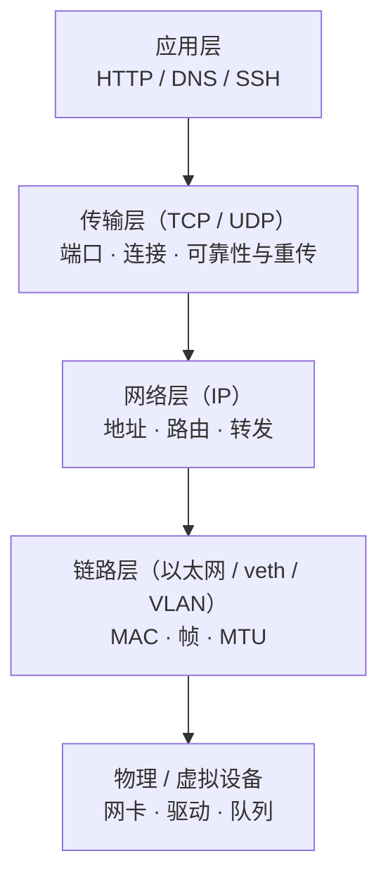
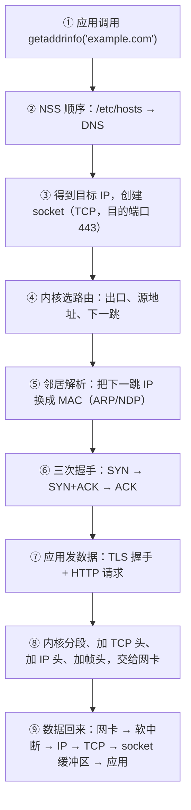

---
tags:
  - Linux
  - 网络
  - 分层模型
  - TCP/IP
  - 原理
created: 2026-09-22
---

# 分层模型与数据包的一生

## 1. 网络排障最难的一步，是决定「现在该看哪一层」

一个包从应用写到网卡，中间要经过名字解析、路由选择、邻居解析、分段、校验、排队、驱动、链路；一个环节出错，用户看到的往往是同一句话：「连不上」。

如果所有环节都能产生同一个现象，那么从现象出发的排查就必须先回答一个分类问题：**这次失败发生在哪一层、那一层留下什么证据**。分层模型的价值不在「七层还是四层」这个分类法本身，而在于它把「证据」按层切开：传输层的计数器不会记录网卡丢包，网卡的驱动计数器也不会记录握手队列溢出。

真实世界里「排障慢」的绝大多数原因，是在错误的层反复找证据：`ping` 通就去翻应用日志、抓包抓到一堆 TCP 重传却在查 DNS、看到 `ss` 干净就宣布网络没问题。

## 2. 分层解决了「可替换」「可定位」「可组合」

把「怎么在网线上传比特」和「怎么把一份文件完整送到」拆成不同的层，每层只依赖下层提供的服务、不关心下层怎么实现。这个决定换来三件事，每一件都直接对应排障：

**可替换。** 链路层从以太网换成 Wi-Fi、从物理网卡换成一对 veth（virtual Ethernet，虚拟网线），上面的 IP 与 TCP 一行都不用改。容器能在宿主机上「凭空造出一张网卡」，靠的就是这条性质。

**可定位。** 每层的错误有各自的形态与计数器。`ping` 通不通属于 IP 层；端口通不通属于传输层；拿到的响应对不对属于应用层。**排障的第一动作是分类，不是敲命令。**

**可组合。** 隧道、overlay、VPN 都是「把一层的包塞进另一层的载荷里」。理解了封装，就理解了它们为什么会额外吃掉 MTU，也就理解了为什么跨 overlay 的链路要单独核对 MTU。



OSI 七层与 TCP/IP 四层两套模型的名字之争不影响任何一次排障：把「表示层、会话层」合并进应用层思考即可。真正要记住的是下面这张「每层管什么、错在哪、证据在哪」的表。

## 3. 四层各自管什么、能出什么错、证据在哪

| 层 | 管什么 | 典型故障 | 证据从哪里来 |
| --- | --- | --- | --- |
| 应用层 | 协议语义：HTTP 状态码、TLS 证书、DNS 报文、SSH 认证 | 证书过期、后端 5xx、返回内容不对、认证失败 | 应用日志、`curl -v`、`openssl s_client`、`journalctl -u` |
| 传输层（TCP/UDP） | 端口、连接状态、可靠性（重传/排序/流控）、拥塞控制 | 队列溢出、`TIME_WAIT`/`CLOSE_WAIT` 异常、重传、窗口受限 | `ss`、`nstat`、`/proc/net/snmp`、`ss -ti` |
| 网络层（IP） | 地址、路由、转发、分片、NAT 与连接跟踪 | 路由缺失、走错出口、`rp_filter` 误杀、conntrack 满 | `ip addr`、`ip route get`、`ip neigh`、`nstat`、`conntrack` |
| 链路层（含驱动） | MAC、帧、VLAN、bond、网桥、MTU、offload、队列与环缓冲 | 链路 down、错包、驱动丢包、MTU 不一致、bond 模式选错 | `ip -s link`、`ethtool -S/-g/-l/-i/-k`、`/proc/net/softnet_stat`、`dmesg` |

四个把现象定位到层的例子：

- 「`ping` 通但连不上」→ IP 层没问题，去传输层与防火墙查端口、`nstat`、`nft list ruleset`。
- 「能连上但传大文件卡住」→ 传输层与链路层的交界：MTU/MSS、重传、窗口。
- 「域名解析慢」→ 应用层依赖的名字解析服务，落在应用层与网络层之间。
- 「偶发超时、服务端没有日志」→ 传输层的队列，且**证据只在服务端的协议栈计数器里**。

## 4. 数据包的一生：从上往下封装，从下往上解封装

一次 `curl https://example.com` 在内核里经历的完整链路如下，后面每一篇讲的都是这条链上的某一段：



每一步都能单独失败，且失败的现象完全不同：

| 步骤 | 失败现象 | 先看哪里 |
| --- | --- | --- |
| ② 名字解析 | `Could not resolve host`、解析慢 | `getent hosts`、`/etc/nsswitch.conf`、`resolvectl status` |
| ④ 路由选择 | `Network is unreachable`、走错出口 | `ip route get`、`ip rule show` |
| ⑤ 邻居解析 | 同网段不通、`ip neigh` 显示 `FAILED`/`INCOMPLETE` | `ip neigh` |
| ⑥ 握手 | 连接超时（被丢）、`Connection refused`（收到 RST）、握手慢 | `ss -lnt`、`nstat` 的队列计数 |
| ⑦ 应用协议 | `curl: (60) SSL certificate problem`、401/403 | 应用日志、`curl -v` |
| ⑧ 分段与发送 | `ping` 通但大响应卡住、重传 | `ss -ti`、`ping -M do` |
| ⑨ 接收与上送 | 收包被丢、单核打满、应用读得慢 | `/proc/net/softnet_stat`、`ss -ti` 的 `app_limited` |

一个容易被忽略的方向问题：**封包是自上而下逐层加头，排障却是自下而上逐层排除**。内核发一个包时先封装 TCP 段、再封装 IP 包、再封装帧；而接到「连不上」的报障时，人应当先从链路与 IP 层往上问。两个方向都对，混用会得出「应用日志没问题所以网络没问题」这类结论。

## 5. 封装与解封装：一封信的四层信封

| 层次 | 类比 | 头里有什么 | 谁是收件人 |
| --- | --- | --- | --- |
| 应用数据 | 信纸上的内容 | 请求行、头、正文 | 对端应用 |
| TCP 段 | 信封上写「第几封、共几封」 | 源端口、目的端口、序号、确认号、标志位、窗口 | 对端内核的 TCP |
| IP 包 | 信封上写「寄到哪个城市」 | 源 IP、目的 IP、TTL、协议号 | 对端主机（或中间路由器） |
| 帧 | 邮递员之间的交接单 | 源 MAC、目的 MAC、VLAN 标签、类型 | 同一网段内的下一跳设备 |

两个概念边界必须分清：

- **IP 地址负责「跨网络送到主机」，MAC 负责「在同一段链路内送到下一跳」。** 跨网段通信时，目的 MAC 是**网关的 MAC**，不是最终主机的 MAC——这一点在抓包时最容易看错。
- **每一层的头是本层的信封，解封装就是一层层拆。** 抓包里看到的 `IP 10.0.0.2 > 10.0.0.1: ICMP echo request` 是「拆掉帧头之后的 IP 层视角」；只有加 `-e` 才会把 MAC 一起显示出来。

## 6. 抓包里的一行到底是什么

只读观测：看几行回环流量（会一直输出，`-c` 限定包数）。

```bash
tcpdump -i lo -nn -c 5          # 验证：回环上的前 5 个包，-nn 保证地址与端口保持数字形态
```

```text
IP 127.0.0.1.52012 > 127.0.0.1.9999: Flags [S], seq 1234567890, win 65495, options [...], length 0
IP 127.0.0.1.9999 > 127.0.0.1.52012: Flags [S.], seq 987654321, ack 1234567891, ... length 0
IP 127.0.0.1.52012 > 127.0.0.1.9999: Flags [.], ack 1, ... length 0
```

（以上按 `tcpdump` 输出格式书写，数值仅示意，具体排版以本机 `tcpdump` 版本为准。）

| 片段 | 含义 | 属于哪一层 |
| --- | --- | --- |
| `IP` | 这是 IP 层的数据 | 网络层 |
| `127.0.0.1.52012 > 127.0.0.1.9999` | 源地址.源端口 → 目的地址.目的端口 | 传输层 |
| `Flags [S]` | SYN（建连请求）；`[S.]` 是 SYN+ACK；`[.]` 是纯 ACK；`[F]` FIN；`[R]` RST | 传输层 |
| `seq` / `ack` | 序号与确认号 | 传输层 |
| `win 65495` | 本端通告给对端的接收窗口（`rwnd`） | 传输层 |
| `length 0` | 这个段携带的应用数据长度（握手包为 0） | 传输层 |

三条判读规则：

- **抓包里看到的「一行」永远是某一层的头加它的载荷。** 想知道载荷里套着什么，得按 `length` 与偏移继续拆，或者让 Wireshark 按协议解码。
- **`[R]`（RST）是最值钱的一行**：它直接说明「端口没有监听」或「连接被内核强制重置」，比在应用日志里找原因快得多。
- **回环链路的 MSS 不是真实网络的典型值**：`lo` 的 MTU 是 65536，所以抓包里会看到 `mss 65495`。**MSS 跟着接口 MTU 走**，别拿回环的数字去推断物理链路。

## 7. MTU 与 MSS：两个尺寸，两种归属

| 概念 | 定义 | 典型值 | 谁决定 | 属于哪一层 |
| --- | --- | --- | --- | --- |
| MTU（Maximum Transmission Unit，最大传输单元） | 链路层一帧能承载的最大载荷（通常按 IP 包计） | 以太网 1500；veth 默认 1500；VXLAN/GENEVE 隧道下会变小 | 链路类型与配置 | 链路层 |
| MSS（Maximum Segment Size，最大段长度） | 一个 TCP 段里应用数据的最大长度 | 1500 − 20（IPv4 头）− 20（TCP 头）= 1460；带时间戳选项时常见 1448 | 两端在握手时协商 | 传输层 |

```text
一个以太网帧（MTU 1500）里最多放：
[ 以太网头 14B ] [ IP 头 20B ] [ TCP 头 20B ] [ 应用数据 ≤ 1460B ] [ FCS 4B（不计入 MTU） ]
```

三条边界：

1. **MSS 是「商量」出来的，MTU 是「配置」出来的。** 握手时双方各自通告自己愿意接收的 MSS，内核再按路径 MTU 与自身能力选一个。`ss -ti` 里的 `advmss` 是本端通告值，`mss` 是实际协商值，`pmtu` 是当前路径 MTU。
2. **MTU 不一致时，DF（Don't Fragment，禁止分片）标志决定结局**：允许分片就分片成功（慢一点），置了 DF 就直接丢。这就是「小包通、大包不通」的由来。
3. **隧道与 overlay 会额外吃掉 MTU**：VXLAN 约 50 字节，IPIP 约 20 字节。跨 overlay 与物理网络时 MTU 必须一路对齐，否则表现为「握手正常、传文件卡死」。

```bash
ip link show                    # 验证：每个接口的 mtu 值
ss -ti                          # 验证：连接上协商到的 mss / pmtu / advmss
ping -M do -s 1472 <ip>         # 验证：1500 字节的 IP 包能否通过（-M do 禁止分片，必须带）
```

`-s` 是**载荷**大小：`-s 1472` 对应 1500 字节的 IP 包（1472 + 20 IP 头 + 8 ICMP 头）。IPv6 的固定头是 40 字节（不含扩展头），同样 MTU 下 `-s` 要再减 20。

## 8. 连接的身份：四元组与两种 socket

```text
源地址 : 源端口  →  目的地址 : 目的端口
10.0.0.2 : 43848  →  10.0.0.1 : 9999
```

加上协议（TCP/UDP）就是五元组。**四元组唯一确定一条连接**，由此得到三条实务结论：

- 同一台客户端到同一台服务端可以同时有很多条连接，区别只在源端口。
- 「客户端说连上了、服务端说没见过」可以同时成立：服务端内核里有这条连接（`ESTAB`），但应用还没 `accept()` 它。
- 排障必须区分「连到端口 A」与「连到端口 B」、「从客户端 A 发」与「从客户端 B 发」——**不同四元组走的可能是完全不同的路径与规则**。

内核里代表通信的对象叫 **socket（套接字）**，它有两种身份：

| 对象 | 状态 | 数量 | 队列 | 出现在 `ss` 里的样子 |
| --- | --- | --- | --- | --- |
| 监听 socket | `LISTEN` | 一个监听地址端口一个 | 有：半连接队列 + 全连接队列 | `LISTEN 0 4096 0.0.0.0:8080 0.0.0.0:*` |
| 已连接 socket | `ESTABLISHED` 等 | 每条连接一个 | 无队列，有收发缓冲区 | `ESTAB 0 0 10.0.0.1:8080 10.0.0.2:43848` |

**同样两列 `Recv-Q`/`Send-Q`，在两种 socket 上语义完全不同**：监听 socket 上它们是「当前已握手未 `accept()` 的连接数」与「队列上限」；已连接 socket 上它们是收发缓冲区里的字节数。把监听 socket 的 `Recv-Q` 当成「有数据没读」是新人最常踩的坑，这类读法错误与纠正判据见判例篇第 4 条。

```bash
ss -lnt              # 验证：所有监听 socket（含队列深度与上限）
ss -tan              # 验证：所有 TCP 连接及其状态
ss -tanp             # 验证：同上并显示进程归属（非 root 只能看到自己的进程）
```

## 9. 一套栈，多个副本：命名空间与 veth

上面讲的「一套网络栈」并不是全局唯一的。**网络命名空间（network namespace）** 让一个系统同时存在多套彼此独立的网络栈：各自有独立的接口、路由表、邻居表、socket、连接跟踪表与 `net.ipv4.*` 参数。

把两套栈连起来的常用积木是 **veth pair（虚拟网线对）**：一对接口，从一端进去的包从另一端出来；一端 down 掉，两端都不通。

```bash
ip netns list                       # 验证：本机有哪些网络命名空间
ip netns add lab                    # 需要 root：新建一个（删命名空间即回收其中的接口与进程）
ip netns exec lab ip -br addr       # 验证：进入该命名空间执行命令，看到的是它自己的栈
ip link add veth0 type veth peer name veth1     # 建一对虚拟网线
```

四个直接推论：

1. **容器就是这样实现的**：一个容器 = 一个网络命名空间 + 一对 veth + 宿主机上的路由/网桥/NAT。
2. **宿主机上看到的接口名与容器里不同**：容器里叫 `eth0`，宿主机上叫 `vethXXXX`，名字对不上是正常的。
3. **在宿主机抓包能看到容器的流量**（veth 的宿主侧、网桥侧），在容器里抓则是容器视角——**两侧对照做二分定位**的套路完全一样。
4. **破坏性实验应当放进命名空间里做**：删掉命名空间就全部回收，宿主网络栈不受影响。这也是「改 MTU、注入丢包、伪造 SYN」这类演练唯一安全的做法。

命名空间带来的第一个排障纪律是：**先确认自己在谁的栈里**。宿主机的 `ss -lntp` 看不到容器的监听端口，宿主机的 `ip route` 也不等于容器里的路由。

## 常见误解

| 常见说法 | 事实 |
| --- | --- |
| 「`ping` 通说明网络没问题」 | 只证明 ICMP 到达了那台主机；TCP 可能被防火墙拦、端口可能没监听、应用可能不响应 |
| 「一个端口只能有一条连接」 | 端口是四元组的一部分；一个监听端口可以承载成千上万条连接 |
| 「MTU 是 TCP 的参数」 | MTU 属于链路层，MSS 才是 TCP 参数；改 MTU 影响这块网卡上所有流量 |
| 「分片是坏事，所以要永远禁止」 | 分片本身是正常机制；问题出在「路径 MTU 变小但 ICMP 被禁」，导致 DF 包被静默丢弃 |
| 「抓不到包 = 这张网卡没有流量」 | 只说明**这一跳**没收到；要对照位置与过滤条件才能下结论 |
| 「监听 socket 的 `Recv-Q` 是没读的数据」 | 对监听 socket，它是「已握手未 `accept()` 的连接数」，`Send-Q` 是上限 |
| 「容器里的 `eth0` 就是宿主机的某张网卡」 | 它的对端是宿主机上的一只 veth，名字与数量都不对应 |
| 「分层只是教科书的分类法」 | 每层的故障形态与证据来源不同；分层的实际用途是**决定先看哪里** |

## 要点自测

**问：为什么「排障慢」常常等于「在错误的层找证据」？举一个具体例子。**
答：因为同一个用户可见现象可以由多层故障产生，而每层的证据只在自己那一层。例如「服务偶发超时」可能是传输层队列溢出、网络层 conntrack 表满、链路层丢包、也可能是应用 `accept()` 慢；如果先去翻应用日志，很可能什么都没有——队列溢出的连接从未进入应用。

**问：MTU 与 MSS 分别属于哪一层、由谁决定？为什么抓包里常看到 `mss:1448` 而不是 `1460`？**
答：MTU 属于链路层，由链路类型与配置决定；MSS 属于传输层，由两端在握手时协商，并受路径 MTU 约束。`1448 = 1460 − 12`，那 12 字节是 TCP 时间戳选项占的位置，不是异常。

**问：为什么「监听 socket 的 `Recv-Q`」和「已连接 socket 的 `Recv-Q`」不能混着读？**
答：监听 socket 不承载应用数据，它的 `Recv-Q` 是已完成握手、等待 `accept()` 的连接数，`Send-Q` 是队列上限；已连接 socket 的 `Recv-Q`/`Send-Q` 才是收发缓冲区的字节数。判据是看第一列的状态：`LISTEN` 与 `ESTAB` 语义不同。

**问：为什么破坏性网络实验要放进 network namespace？**
答：每个命名空间是一套独立网络栈，删掉它，里面的接口、路由、socket 与 conntrack 一并回收，宿主的栈不受影响。因此「改 MTU、注入延迟丢包、伪造 SYN」这类操作可以在里面反复做。

**第一反应不要做什么**：不要一上来就抓包；不要把 `ping` 通当成「网络没问题」；不要在宿主机的视图里推断容器的状态。

## 参考文档

- `man 7 ip`、`man 7 tcp`、`man 7 udp`、`man 7 socket`、`man 7 arp`、`man 7 packet`：各层的对象与行为。
- `man 8 ip-link`、`man 8 ip-netns`、`man 8 ip-neighbour`、`man 8 tcpdump`、`man 7 pcap-filter`、`man 8 ss`。
- `man 5 proc`：`/proc/net/snmp`、`/proc/net/tcp`、`/proc/net/softnet_stat`。
- 内核 6.x 文档 `Documentation/networking/veth.rst`、`Documentation/networking/bridge.rst`、`Documentation/networking/filter.rst`、`Documentation/networking/ip-sysctl.rst`。内核文档一律按与目标机器同一主版本取（当前基线 6.x）。
- 教科书性的背景（OSI 与 TCP/IP 两套模型的由来、封装与解封装的定义）用于解释每一步解决什么，不作为精度依据。

文中标注为实测的数字来自 Ubuntu 24.04.5 LTS（VMware 虚拟机）/ 内核 `6.8.0-139-generic` / 4 vCPU / 网卡 `ens33`（驱动 `e1000`）这台实验机；换环境必须重新采集。封装与分片的行为以 `man 7 ip`、内核 6.x 文档与 RFC 为准；隔离命名空间的搭法与清理验收见实操篇第 3 节。

