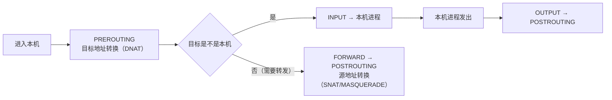

---
tags:
  - Linux
  - 网络
  - IP
  - 路由
  - ARP
  - 原理
created: 2026-09-22
---

# 地址、路由与邻居

## 1. 「连不上」的一半，卡在地址与下一跳上

IP 层的职责只有一句话：**把包从一台主机送到另一台主机**。为此它必须回答三个问题：目标地址在不在我这条链路上、从哪张网卡出去、下一跳交给谁。三个问题分别由子网掩码、路由表、邻居表回答。

这一层出错的形态很集中：地址配错导致「看起来该通却不通」；路由选错出口导致「流量走了不该走的那张网卡」；邻居解析失败导致「同网段的两台机器互相看不见」。它们的共同点是——**主机上看不到任何错误日志，只能靠主动查询**。

## 2. 地址与前缀：判断「在不在同一个网段」是一个算法，不是感觉

一个 IPv4 地址是 32 位，写成 `10.0.0.1`；它总是和**前缀长度**一起出现，例如 `10.0.0.1/24`。前缀长度表示前多少位是网络位，剩下的位是主机位。

| 写法 | 含义 | 这个网段里的可用地址 |
| --- | --- | --- |
| `10.0.0.1/24` | 前 24 位是网络位，后 8 位是主机位 | `10.0.0.1` ~ `10.0.0.254`（`.0` 是网络地址、`.255` 是广播地址） |
| `10.0.0.1/32` | 只有这一个地址 | `10.0.0.1`（常见于回环、VIP、容器地址） |
| `192.168.240.128/20` | 前 20 位是网络位 | `192.168.240.0` ~ `192.168.255.255` |

**判断两个地址在不在同一个网段：把两个地址都按前缀长度截断，看结果是否相同。** 这是唯一可靠的办法——`10.0.0.1/24` 与 `10.0.1.1/24` 看起来「像」同一个网段，实际不是。结论决定后续路径：

- **在同一个网段** → 直接找对方（走邻居解析）；
- **不在同一个网段** → 交给网关（走路由表）。

```bash
ip -br addr                     # 验证：所有接口的地址（紧凑视图）
ip addr show dev ens33          # 验证：某个接口的地址、掩码、状态、MAC
```

```text
lo               UNKNOWN        127.0.0.1/8 ::1/128
ens33            UP             192.168.246.128/24 fe80::20c:29ff:fe66:2c0f/64
```

（以上格式按 `ip -br addr` 的输出书写，数值仅示意。`ip -br` 的 `UP`/`DOWN` 是接口的管理状态，`LOWER_UP` 才代表链路层真的通了。）

**IPv6 的三条最低限度认知**：地址更长但结构一样（`/64` 的网段占绝大多数）；没有广播，用多播与 NDP（Neighbor Discovery Protocol，邻居发现协议）代替 ARP；一个接口通常同时有多个地址（链路本地 `fe80::/10`、全球地址、临时地址）。

`ss -lnt` 里出现 `[::]:8080` 时，多数系统的行为是同时接受 IPv6 与 IPv4（取决于 `net.ipv6.bindv6only`）；但如果应用显式绑定了某个 IPv6 地址，IPv4 客户端就连不上。**判据永远是 `ss -lntp` 看实际绑定，不要凭记忆推断。**

## 3. 路由表：内核怎么决定「从哪出去」

```bash
ip route                            # 验证：主路由表
ip route show table all | head -40  # 验证：所有路由表（含 local 与策略路由用到的自定义表）
```

```text
default via 192.168.246.2 dev ens33 proto static
192.168.246.0/24 dev ens33 proto kernel scope link src 192.168.246.128
```

| 字段 | 含义 | 怎么读 |
| --- | --- | --- |
| `default via 192.168.246.2` | 默认路由：所有不匹配其他条目的流量都发给这个网关 | 有多条默认路由时看 `metric` 挑 |
| `dev ens33` | 出口网卡 | 与实际物理出口不符时查策略路由 |
| `proto kernel` / `proto static` | 这条路由是谁装的：内核按地址自动生成 / 静态配置 | `kernel` 路由随地址存在，删地址即消失 |
| `scope link` | 目标直接在链路上可达，不需要网关 | 有它就不该有 `via` |
| `src 192.168.246.128` | 这条路由倾向使用的源地址 | 与 `ip route get` 的 `src` 可能不同（后者含策略约束） |
| `metric` | 优先级，**数值越小越优先** | 多条等价路由时用得上；单出口机器上通常不显示 |

**匹配规则是「最长前缀优先」**：在所有能匹配目标地址的条目里，选前缀最长（最具体）的那一条。只有默认路由能匹配时才会走默认路由。

## 4. 不要用脑子算路由：`ip route get`

排障时最有用的一条命令是直接问内核「你会怎么走」：

```bash
ip route get 223.5.5.5                        # 验证：到公网目标实际怎么走
ip route get 8.8.8.8 from 192.168.246.128     # 验证：指定源地址时的结果
ip route get 8.8.8.8 iif ens33                # 验证：从某接口进来的流量怎么走
```

```text
223.5.5.5 via 192.168.246.2 dev ens33 src 192.168.246.128 uid 0
8.8.8.8 from 192.168.246.128 via 192.168.246.2 dev ens33 uid 0
```

四个关键字段：

| 字段 | 是什么 | 单位与范围 | 判据与下一步 |
| --- | --- | --- | --- |
| `via` | 下一跳地址 | 一个 IP | 与本网段网关配置一致；不一致则查是否有更具体的路由或策略路由 |
| `dev` | 出口接口 | 接口名 | 多网卡机器上重点看：是不是从管理口出去了；不对就查 `ip rule show` |
| `src` | 内核选定的源地址 | 一个 IP | 对端报「源地址不对」时的第一现场；与预期不符先查地址是否配在出口接口上、再看策略路由 |
| `uid` | 发起查询的 uid | 0 表示 root | 配合 `ip rule` 里基于 uid 的规则使用 |

加上 `from` / `iif` 就能模拟不同发起条件，这是回答「为什么走了另一条路」的标准问法。

## 5. 源地址是「选」出来的

内核发一个包时会选一个**最合适的源地址**：优先选与出口接口在同一网段、且满足策略约束的地址。所以：

- 同一个目标，从不同 `iif` 或不同 `uid` 发起，可能选到不同源地址；
- 应用如果 `bind()` 了具体地址，内核就按它绑的来（**服务绑在 `127.0.0.1` 时外部永远连不上**，这是绑定问题而不是路由问题）；
- `ip route get` 的 `src` 字段就是最终答案。

多网卡机器上「从 `eth1` 发起、源地址却是 `eth0` 的」这种现场，处置必须按顺序：先看 `ip rule show` 有没有自定义规则，再看 `ip route get <目标> from <源地址>` 的实际选择，最后确认应用是否绑定。**先关掉另一张网卡是破坏性动作，会中断别的业务。**

## 6. 策略路由：先选表，再查表

```bash
ip rule show                # 验证：策略路由规则
ip route show table 100     # 验证：某张自定义表的内容
```

```text
0:      from all lookup local
32766:  from all lookup main
32767:  from all lookup default
```

**编号越小越优先。** 内核先用规则选出「用哪张路由表」，再到那张表里查路由——**先规则、后查表**。`local` 表放本机地址，`main` 表就是平时 `ip route` 看到的内容。

什么时候会出现自定义规则：多网卡多出口（内网流量走内网口、公网走公网口）、按源地址分流、容器与 CNI 插件、VPN 分流。**判据：`ip route` 看起来没问题但流量走了另一条路时，第一反应是 `ip rule show`，而不是去改主路由表。**

## 7. 邻居：把 IP 换成 MAC

跨网段时，IP 包会被送进网关；同网段时，必须知道对端的 MAC 地址才能把帧发出去。这一步由 **ARP（Address Resolution Protocol，地址解析协议）** 完成，IPv6 用 NDP 承担同样的角色。

```bash
ip neigh                        # 验证：邻居表状态（旧命令是 arp -n）
ip -s neigh                     # 验证：加上 used/confirmed 等统计
ip neigh show 192.168.246.2     # 验证：单独看某个邻居
```

| 状态 | 含义 | 是否正常 |
| --- | --- | --- |
| `REACHABLE` | 最近确认过，可以直接用 | 正常 |
| `STALE` | 条目还有效，但使用前需要重新确认 | 正常，且很常见 |
| `DELAY` / `PROBE` | 正在确认可达性 | 过渡状态 |
| `INCOMPLETE` | 发出请求，尚未收到回应 | **二层可能不通** |
| `FAILED` | 多次重试无回应 | **二层不通或对端不响应** |

两类现场要分清：

- **同网段不通、邻居表显示 `INCOMPLETE`/`FAILED`**：对端没开机、网线/VLAN 不对、被隔离，或地址配错了网段。**这时候查路由表是浪费时间**。
- **`REACHABLE` 一片正常但流量还是不通**：邻居层没问题，往上查 IP 之上的层（路由、防火墙、端口）。

`ping` 一次网关就会触发邻居解析并更新邻居表，所以「先 ping 一下再看 `ip neigh`」是常用手法。

## 8. 转发：从「终端」变成「路由器」

```bash
sysctl net.ipv4.ip_forward      # 验证：是否开启三层转发
```

| 取值 | 含义 | 典型机器 |
| --- | --- | --- |
| `0` | 不做三层转发：目的地址不是本机的包被丢弃或回 ICMP | 普通业务服务器 |
| `1` | 做三层转发：像路由器一样把包从一个接口转到另一个接口 | 网关、容器节点、Kubernetes 节点、VPN 服务器 |

三个要点：

1. **转发不等于放行**：`ip_forward=1` 只放开转发能力，能不能过还要看 `FORWARD` 链与连接跟踪。「我明明开了转发还是不通」的答案通常在这里。
2. **转发会引入新的失败点**：路由查找、邻居解析、转发路径上更小的 MTU、连接跟踪表容量。
3. **`rp_filter`（反向路径过滤）在转发场景下更容易误杀**：它检查「这个包的源地址，从我这里回过去是否也走同一个接口」，在非对称路由、部分隧道与容器场景下会丢掉正常流量。它是有安全意义的防护（防源地址伪造），**只在确认存在非对称路由且有其他手段兜底时才考虑调整，并要写进变更记录**。

## 9. 防火墙与 NAT 的挂载点：包按什么顺序过链

无论前端是 `firewalld`、`ufw` 还是云厂商的安全组，最终都要落到 netfilter 的表与链上。



| 链 | 处理什么 | 常见用途 |
| --- | --- | --- |
| `PREROUTING` | 刚进入本机、尚未做路由判定 | DNAT（端口映射）、流量标记 |
| `INPUT` | 目标是本机的包 | 放行或限制访问本机服务（最常见的「端口没开」） |
| `FORWARD` | 需要转发出去的包 | 网关、容器节点、Kubernetes 的转发放行 |
| `OUTPUT` | 本机发出的包 | 限制出站 |
| `POSTROUTING` | 即将离开本机的包 | SNAT/MASQUERADE（出网地址转换） |

**「服务连不上」时不要只看 `INPUT`。** 如果这台机器是网关或容器节点，流量走的是 `FORWARD`；只看 `INPUT` 会得出「规则是空的，应该能过」这种错误结论。先确认这个包对这台机器来说是「发给我的」还是「要我转发的」。

NAT（Network Address Translation，网络地址转换）与状态化放行都建立在**连接跟踪（conntrack）**之上：内核要记住「这个改写对应哪条连接」，回包才能还原。这条链的完整机制与故障现场属于主机转发路径的一部分，见体系篇「出门之后」一节。

## 常见误解

| 常见说法 | 事实 |
| --- | --- |
| 「两个地址看起来像同一个网段」 | 必须按前缀长度截断后比较；`10.0.0.1/24` 与 `10.0.1.1/24` 不在同一网段 |
| 「`ip route` 正常就说明选路正常」 | 可能被 `ip rule` 提前分流；要看 `ip rule show` 与 `ip route get` |
| 「同网段不通就先查路由」 | 先看 `ip neigh`：`INCOMPLETE`/`FAILED` 说明二层就没通 |
| 「默认路由只有一条」 | 多网卡/多网关时可能有多条，靠 `metric` 决定优先级 |
| 「`ping` 通说明端口也通」 | 只说明 ICMP 可达；TCP 与 ICMP 会被防火墙区别对待 |
| 「服务只监听了 IPv6」 | 多数系统上 `[::]` 同时接受 IPv4；判据是 `ss -lntp` 看实际绑定 |
| 「`ip_forward=1` 就是打开了端口转发」 | 它只放开转发能力；放行取决于 `FORWARD` 链与连接跟踪 |
| 「为了通就把 `rp_filter` 关掉」 | 有安全代价；先确认存在非对称路由，再评估替代方案 |
| 「用 `ifconfig`/`route`/`arp` 排障」 | 新系统默认不安装 `net-tools`；用 `ip -br addr`、`ip route`、`ip neigh` |

## 要点自测

**问：`ip route get 8.8.8.8` 的四个关键字段分别是什么？它比人脑算路由表强在哪？**
答：`via`（下一跳）、`dev`（出口网卡）、`src`（内核选定的源地址）、`uid`（发起者）。它直接给出内核的最终决定，包含策略路由、`src` 选择等全部约束；人脑只查 `ip route` 看不到规则表与源地址选择的参与。

**问：同网段不通和跨网段不通，排查起点有什么不同？**
答：同网段先看 `ip neigh`——`INCOMPLETE`/`FAILED` 说明二层不通，方向是 VLAN、网桥、交换机端口与对端状态；跨网段先看 `ip route get` 的网关与 `dev`，再看网关本身是否可达。两者都要看 `ip -s link` 的 errors/dropped。

**问：`ip rule` 与 `ip route` 是什么关系？**
答：`ip rule` 决定「用哪张表」，`ip route` 决定「表里怎么查」——**先规则、后查表**。默认三条规则的顺序是 `local` → `main` → `default`，编号越小越优先。

**问：为什么 `ip_forward=1` 之后还是不通？**
答：转发开关只放开能力。还要查：目的地址的路由与下一跳是否存在（`ip route get`）、`FORWARD` 链是否放行、连接跟踪是否满、出口 MTU 与链路是否正常。

**第一反应不要做什么**：不要用「看起来像同一网段」代替前缀计算；不要在没看 `ip rule show` 的前提下改主路由表；不要为了「通」先关 `rp_filter` 或先停掉另一张网卡。

## 参考文档

- `man 8 ip`、`man 8 ip-address`、`man 8 ip-route`、`man 8 ip-rule`、`man 8 ip-neighbour`、`man 8 ip-link`、`man 8 ip-netns`。
- `man 7 arp`、`man 7 ip`：邻居与 IP 层行为。
- `man 8 sysctl`、`man 5 sysctl.conf`、`man 5 sysctl.d`：`ip_forward`、`rp_filter` 等参数的持久化方式。
- `man 8 nft`、`man 8 iptables`、`man 8 conntrack`：链的顺序、NAT 与连接跟踪的命令侧接口。
- 内核 6.x 文档 `Documentation/networking/ip-sysctl.rst`（`conf/*/forwarding`、`conf/*/rp_filter`）、`Documentation/networking/arp.txt`、`Documentation/networking/nf_conntrack-sysctl.rst`。

文中标注为实测的数值来自 Ubuntu 24.04.5 LTS（VMware 虚拟机）/ 内核 `6.8.0-139-generic` / 网卡 `ens33`（`192.168.246.128/24`，网关 `192.168.246.2`）这台实验机；换环境必须重新采集。

上一篇：分层模型与数据包的一生 ｜ 下一篇：端口、套接字与多路复用
