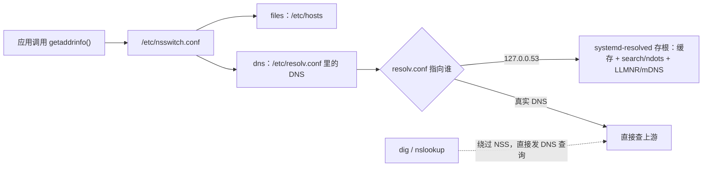
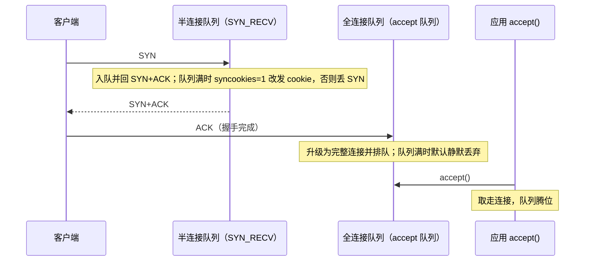
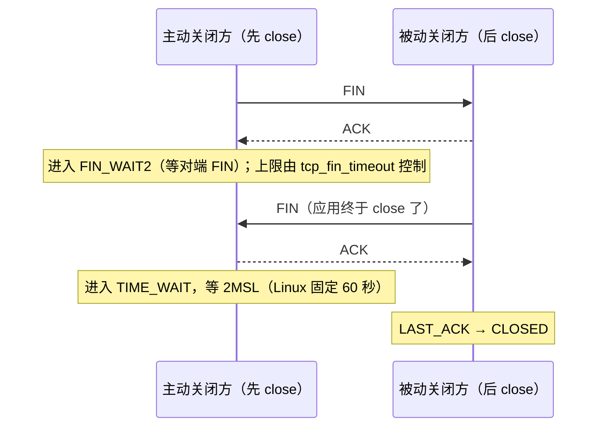

---
tags:
  - Linux
  - 网络
  - DNS
  - TCP
  - 三次握手
  - 拥塞控制
  - TIME_WAIT
  - 原理
created: 2026-09-22
---

# 连接的生命周期

## 1. 一条连接从「名字」开始，而不是从 IP 开始

应用拿到的「地址」，几乎从来不是 DNS 直接给的，而是 **NSS（Name Service Switch，名字服务开关）** 按顺序问出来的结果。这个中间层的存在，解释了网络排障里最常见的一类扯皮：**同一台机器上 `dig` 成功、应用却报解析失败**。



读法：**应用只走上面那条路**（`getaddrinfo()` → NSS）；`dig` 走下面那条虚线，两者可以给出完全不同的结果，而且都不算「坏」。

### 1.1 解析链上的两个配置文件

| 配置 | 字段 | 影响 |
| --- | --- | --- |
| `/etc/nsswitch.conf` | `hosts: files dns` | 先查 `/etc/hosts`，再查 DNS；顺序可改，也可插入 `myhostname`、`resolve` 等模块 |
| `/etc/resolv.conf` | `nameserver` | 查询发往谁（可多个，按顺序尝试） |
| `/etc/resolv.conf` | `search` | 短名字会依次拼接这些后缀 |
| `/etc/resolv.conf` | `options ndots:N` | 名字里**点数少于 N** 时先试 `search` 后缀，最后才查原名 |
| `/etc/resolv.conf` | `options timeout:` / `attempts:` | 每个服务器的超时与重试次数，直接决定「解析慢」能慢多久 |

```bash
grep -v '^#' /etc/nsswitch.conf | grep hosts    # 验证：NSS 顺序（典型：hosts: files dns）
ls -l /etc/resolv.conf                          # 验证：它是不是指向 systemd-resolved 存根的软链
cat /etc/resolv.conf                            # 验证：实际使用的 nameserver/search/options
resolvectl status                               # 验证：真实上游、协议开关、resolv.conf 模式
```

两个不能凭记忆下的结论：

- **`nameserver` 不一定是上游 DNS**。现代发行版上 `/etc/resolv.conf` 常是指向 `/run/systemd/resolve/stub-resolv.conf` 的软链，内容是 `nameserver 127.0.0.53`，即 **systemd-resolved 的本地存根**；真实上游要看 `resolvectl status` 里的 `Current DNS Server`。
- **`files` 默认排在 `dns` 之前**，所以 `/etc/hosts` 里的条目会**覆盖** DNS 结果。这不是「本地小把戏」，而是默认行为。

### 1.2 三个工具、三个视角

| 工具 | 视角 | 说明 |
| --- | --- | --- |
| `getent hosts <name>` | **应用视角** | 走 NSS，先 hosts 后 DNS，会应用 `search`/`ndots`；只显示被选中的一族地址 |
| `resolvectl query <name>` | resolved 视角 | 显示 resolved 缓存与上游的完整结果（A + AAAA） |
| `dig @<真实DNS> <name>` | 纯 DNS 视角 | 绕过 NSS、不应用 `search`（除非加 `+search`） |

三者对同一个名字给出不同结果是**正常现象**，差异来自三处：解析路径不同、记录选择不同（`getent hosts` 只给一族地址）、后缀规则不同。**排障第一步是用 `getent` 复现应用行为，而不是用 `dig` 证明「DNS 正常」。**

```bash
getent hosts <name>                   # 应用视角
getent -s files hosts <name>          # 只走 /etc/hosts
getent -s dns hosts <name>            # 只走 DNS
time getent hosts <name>              # 量化耗时（区分「解析慢」与「连接慢」）
dig <name> A +noall +answer           # 纯 DNS，只看答案段（含 TTL）
dig -x <ip> +short                    # 反查（PTR）
```

### 1.3 DNS 本身的四个概念

| 概念 | 含义 | 排障意义 |
| --- | --- | --- |
| 递归解析器 | 配置的 DNS 服务器，由它替你去问根与权威 | 它慢或不可达，本机解析就慢或失败 |
| 记录类型 | `A`、`AAAA`、`CNAME`、`MX`、`TXT`、`PTR` 等 | 「有 A 没 AAAA」「只有 CNAME」会让不同工具给出不同结果 |
| TTL | 记录可缓存的时间（秒） | 改完 DNS 没生效，往往是 TTL 未过期或本地缓存还在 |
| 否定缓存 | 「这个名字不存在」（NXDOMAIN）也会被缓存 | 新上线的域名解析失败，可能是此前的不存在结果还在缓存里 |

### 1.4 解析慢的三个层次

1. **本机配置放大**：`search` 域多 + `ndots` 大 → 一次解析按后缀数量被放大成多次查询，每次都要等超时才轮到下一个。查询次数是可以事先算的：名字里的点数少于 `ndots` 时，先按 `search` 域逐个尝试，最后才查原名，因此次数 = `search` 域数量 + 1。容器与 Kubernetes 注入的 `ndots:5` 是这类问题的常见来源：`foo.bar` 这种带一个点的名字会**先试 `search` 列表里的每个后缀**，全部 NXDOMAIN 之后才查原名。
2. **上游不可达或慢**：`options timeout:N attempts:M` 决定每个服务器等多久、重试几次。这两个选项缺省时由解析库的默认值决定（`man 5 resolv.conf` 给出了 glibc 的默认值），所以「单个上游挂掉」这种故障的体感时长是可以算出来的；实际系统里这个值常被 `systemd-resolved` 或应用自身的解析器改写，**要按实际配置现场核对**。
3. **缓存未命中**：缓存命中率低、查询次数高，说明一直在往上问。

```bash
resolvectl statistics                 # 验证：缓存命中数、上游失败数、查询总数
resolvectl flush-caches               # 验证：清理 resolved 缓存（改记录后验证用）
```

**判据必须先量化再看配置**：先量 `time getent hosts <name>`，再看 `search` 与 `ndots` 的数量，最后看 `resolvectl statistics` 的缓存与上游表现。「解析慢就换个更快的 DNS」在没有量化依据时是无效动作——很多环境里上游就在网关旁边，慢的是查询次数，不是服务器。

## 2. 建链：三次握手与两个队列

### 2.1 握手是内核完成的



三个容易忽略的细节：

1. **握手、重传都是内核做的**，应用只是 `listen()` 之后不断 `accept()`。所以「握手成功」与「应用收到请求」之间隔着一个全连接队列。
2. **`SYN+ACK` 是内核回的**；只有 `accept()` 之后，数据才会真正进到应用的 socket 缓冲区。
3. **两个队列的长度决定方式不同**：半连接队列在现代内核里由 `listen()` 的 backlog 推导；全连接队列上限是 `min(backlog, somaxconn)`。

### 2.2 两个队列对照

| 队列 | 内核视图 | 上限由谁决定 | 溢出计数 | 溢出后客户端看到什么 |
| --- | --- | --- | --- | --- |
| 半连接队列 | `SYN_RECV` 状态的请求套接字 | 由 `listen()` 的 backlog 推导（`tcp_max_syn_backlog` 不再是唯一决定因素） | `TcpExtTCPReqQFullDoCookies`（发 cookie）/ `TcpExtTCPReqQFullDrop`（丢） | 发 cookie 时握手照常完成；丢包时 `SYN-SENT` 重传、`connect` 超时 |
| 全连接队列 | 已完成握手、未被 `accept()` | `min(backlog, net.core.somaxconn)` | `TcpExtListenOverflows` + `TcpExtListenDrops` | `SYN-SENT` 重传、`connect` 超时；`tcp_abort_on_overflow=1` 时是 `connection reset` |

四个必须记住的边界：

1. **队列里的连接在 `ss` 里是 `ESTAB`，但应用还没有它。** 所以「服务端没收到请求」与「服务端建立了连接」可以同时成立。
2. **判定队列已满的判据是监听 socket 上 `Recv-Q > Send-Q`**，内核比较用的是 `>`，因此实际容量是 `backlog + 1`。别用「等于多少」的直觉推，用 `ss` 实测。
3. **溢出时默认静默丢弃**，服务端应用完全不知道；**唯一能在故障前发现它的是协议栈计数器**的增量（`TcpExtListenOverflows`、`TcpExtListenDrops`），所以这两项必须纳入监控。
4. **半连接队列满不一定失败**：`tcp_syncookies=1` 时内核改发 cookie，握手仍能完成（代价是丢失部分握手选项）；关掉它才会真丢 SYN。

### 2.3 相关内核参数

| 参数 | 管什么 | 载体 | 什么时候动 | 副作用 |
| --- | --- | --- | --- | --- |
| `net.core.somaxconn` | 全连接队列的**全局上限** | 内核参数（`sysctl`） | 高并发短连接服务，且确认 `ss -lnt` 的 `Send-Q` 被它卡住 | 几乎没有；但它只是上限，应用 `listen(backlog)` 也要跟上 |
| `net.ipv4.tcp_max_syn_backlog` | 半连接队列的**传统上限** | 内核参数 | 老内核，或明确被 SYN 洪水打的场景 | 现代内核里半连接队列主要由 backlog 推导，单独调它往往无效 |
| `net.ipv4.tcp_abort_on_overflow` | 全连接队列满时：`0` 静默丢弃，`1` 回 RST | 内核参数 | 想让「队列溢出」在客户端立刻显形时 | 把「慢失败」变成「快速失败」，可能把可恢复的抖动放大成用户可见错误 |
| `net.ipv4.tcp_syncookies` | 半连接队列满时是否发 cookie 继续服务 | 内核参数 | 保持默认开启 | 开启时握手可能丢失部分选项，代价远小于被 SYN 洪水打死 |
| `net.ipv4.tcp_syn_retries` | 客户端 SYN 重传次数 | 内核参数 | 极少需要动 | 次数越多，客户端「卡住」的时间越长——它决定了队列溢出的体感时长 |

**默认值一律现场取**：内核与发行版都在改这些值，凭记忆写下的数字很容易错。`sysctl` 一次查完五个即可。

## 3. 传输：可靠与不压垮网络是两件事

### 3.1 可靠传输的三个机制

| 机制 | 解决什么 | 在 `ss -ti` 里的痕迹 |
| --- | --- | --- |
| 序号与确认 | 乱序、丢包、重复都能被识别 | `segs_in`/`segs_out`、`delivered` |
| 重传 | 丢了就再发一次 | `retrans`/`lost`、`rto` |
| 滑动窗口 | 一次能有多少在途数据（流控） | `snd_wnd`（对端通告）、`rcv_space`（本端可收）、`wscale` |
| 拥塞控制 | 网络能承受多快（避免把链路压垮） | `cwnd`、`pacing_rate`、算法名 |

### 3.2 两个窗口，取小者生效

```text
发送方真正能发的在途数据 ≈ min(cwnd, rwnd)

cwnd  ← 发送方自己估的「网络能承受多少」（拥塞控制）
rwnd  ← 接收方通告的「我还能收多少」（流控，ss -ti 里是 snd_wnd）
```

三种被「憋住」的形态完全不同，处置方向也不同：

| 现象 | 判据 | 责任方 |
| --- | --- | --- |
| 接收方来不及读 | `snd_wnd` 很小甚至为 0 | **接收方的应用**（不读数据）或接收缓冲区太小 |
| 发送方认为链路拥塞 | `cwnd` 小、`ssthresh` 被压得很低、有 `retrans` | 链路丢包或路径排队 |
| 应用没数据可发 | `app_limited` 出现 | **发送方的应用**，此时网络再调也没用 |

**BDP（Bandwidth-Delay Product，带宽延迟积）= 带宽 × RTT**：高延迟链路要跑满带宽，就必须有足够的在途数据量。在途数据量受窗口与缓冲限制，这就是窗口缩放选项（`wscale`）与 `tcp_rmem`/`tcp_wmem` 存在的意义——**「带宽没用满但单流上不去」的典型形态就是 BDP 大于当前窗口能覆盖的量**。

### 3.3 拥塞控制的四个动作

1. **慢启动**：刚建连时从小窗口开始，每收到一个 ACK 就增大 `cwnd`，快速探测链路容量。
2. **拥塞避免**：接近估计容量后改为缓慢增长，避免过冲。
3. **丢包检测与降速**：`cubic` 把丢包当作拥塞信号，`cwnd` 大幅回退。
4. **恢复**：逐步重新增长。

**BBR 换了一套判据**：它持续估计「瓶颈带宽」与「最小 RTT」，据此决定发送速率，而不是「丢包即降速」。

| 维度 | `cubic`（多数发行版默认） | `BBR` |
| --- | --- | --- |
| 判据 | 基于丢包 | 基于带宽与最小 RTT 的估计（模型驱动） |
| 适用链路 | 低丢包的局域网与数据中心 | 有随机丢包、RTT 较长的链路 |
| 代价与注意 | 高丢包链路上会过早降速 | 需要 `fq` 队列提供 pacing；**与传统流的公平性有争议**，可能挤占同链路其他流量；不是所有场景都有收益 |
| 启用方式 | 默认可用 | 需加载 `tcp_bbr` 模块，再改 `net.ipv4.tcp_congestion_control` |

它是**全机所有 TCP 连接**的算法，所以换算法是一次影响面未知的变更：必须有基线（吞吐、P99、重传率）、必须确认 `fq` 生效、必须复测，还要评估共享链路上的公平性影响。

### 3.4 重传用计数器说话

| 计数器 | 含义 | 什么时候要警惕 |
| --- | --- | --- |
| `TcpRetransSegs` | 重传的段数 | 与 `TcpOutSegs` 的比值持续偏高就值得查（阈值要按自己的基线定） |
| `TcpExtTCPSynRetrans` | SYN 的重传 | 增长说明握手阶段就有丢包（配合队列判据一起看） |
| `TcpExtTCPTimeouts` | RTO 超时次数 | 大量出现说明链路质量或对端异常 |
| `TcpExtTCPLostRetransmit` | 重传也丢了 | 链路严重劣化 |

**这些计数器必须取差值**：它们从开机累计，单次读数不能说明「现在有问题」。

### 3.5 UDP：另一条路

UDP 没有重传、没有拥塞控制（除非应用自己实现），所以**「没有重传」不等于「没有丢包」**。DNS（UDP 53，被截断时回落到 TCP）、SNMP 采集、以及自带重传与拥塞控制的 QUIC 都在这一条路上。UDP 服务的「偶发超时」经常查不出原因，就是因为**内核不替你记账**——只能靠应用层指标或抓包。

## 4. 断开：四次挥手与两个状态

### 4.1 挥手与握手的关键区别：双向独立



一端发 FIN 只表示「我没有数据要发了」，不代表「我不能再收」——所以存在**半关闭**，也所以会出现 `FIN_WAIT2`（我发了 FIN，对端迟迟不发 FIN）。

### 4.2 状态归属与可调性

| 状态 | 谁会出现 | 含义 | 停留时间（Linux） | 能不能调 |
| --- | --- | --- | --- | --- |
| `FIN_WAIT1` / `FIN_WAIT2` | 主动关闭方 | 已发 FIN，等对端 FIN | `FIN_WAIT2` 上限由 `tcp_fin_timeout` 控制 | 能，但只影响半关闭的连接 |
| `TIME_WAIT` | 主动关闭方 | 双方 FIN 都完成，等 2MSL | **内核常量固定 60 秒** | **不能**（没有对应 sysctl） |
| `CLOSE_WAIT` | 被动关闭方 | 收到对端 FIN，本端应用还没 `close()` | 由应用代码路径决定 | **只能改应用** |
| `LAST_ACK` | 被动关闭方 | 已发 FIN，等最后的 ACK | 秒级 | 不用管 |

**`tcp_fin_timeout` 与 `TIME_WAIT` 没有任何关系**，这是网络知识里传播最广的错误之一：它控制的是 `FIN_WAIT2` 的超时（对端没回 FIN 时本端等多久后放弃）。`TIME_WAIT` 的 2MSL 由协议常量决定，Linux 把它写死为 60 秒（内核源码 `include/net/tcp.h` 的 `TCP_TIMEWAIT_LEN`）。

### 4.3 `TIME_WAIT` 为什么必须存在

它承担两件事：

1. **确保主动关闭方最后发出的那个 ACK 能到达对端**——如果它丢了，对端会重传 FIN，本端还能再回一个 ACK；
2. **让本次连接里的旧报文在网络中彻底消散**，避免它们被后续复用同一四元组的新连接误收。

因此「消灭 `TIME_WAIT`」不是目标，**减少主动关闭的次数**才是。`tcp_max_tw_buckets` 溢出时内核会直接跳过 `TIME_WAIT` 关连接，代价正是破坏上面两条保护——它是兜底手段，不是优化手段。

### 4.4 相关内核参数

| 参数 | 管什么 | 什么时候动 | 副作用 |
| --- | --- | --- | --- |
| `net.ipv4.tcp_fin_timeout` | `FIN_WAIT2` 的等待超时 | 极少需要动 | **与 `TIME_WAIT` 无关** |
| `net.ipv4.tcp_tw_reuse` | 是否允许**出向**连接复用处于 `TIME_WAIT` 的四元组（`0` 关 / `1` 开 / `2` 只对回环开） | 主动发起大量短连接（反向代理、网关）时才考虑 | 需要时间戳支持；对**入向**连接无效，也**不会让 `TIME_WAIT` 条数变少** |
| `net.ipv4.tcp_max_tw_buckets` | `TIME_WAIT` 套接字总数上限 | 端口/内存吃紧且确认已溢出时 | 溢出时跳过 `TIME_WAIT`，破坏 2MSL 保护；**该计数器是唯一信号，日志里可能什么都没有** |
| `net.ipv4.ip_local_port_range` | 本机作为客户端时的源端口范围 | 出向连接打满、报 `Cannot assign requested address` 时 | 扩到低位区间会与系统保留端口重叠，需评估 |
| `net.ipv4.tcp_tw_recycle` | — | **不要动** | 该选项已在 Linux 4.12 移除；在它存在时，NAT 环境下会造成连接随机失败 |

### 4.5 `CLOSE_WAIT` 是彻头彻尾的应用问题

`CLOSE_WAIT` 的含义非常明确：**对端发了 FIN，本端应用没有关这个连接**。内核已经把该做的做完了，剩下的动作在应用代码里——**内核参数里没有任何一项能让它消失**。

典型原因：连接池泄漏、异常分支没有 `close()`、上游不读导致阻塞、依赖库 bug。定位路径是「找进程 → 看句柄是否单调增长 → 结合代码或上游分析」，而不是「调参数」或「重启了事」。**它往往先表现为「连接池被打满」，而不是「服务报错」。**

## 常见误解

| 常见说法 | 事实 |
| --- | --- |
| 「`dig` 通了说明应用能解析」 | `dig` 绕过 NSS；应用走 `getaddrinfo()` → NSS，可能查 hosts、经 resolved 存根、在不同命名空间里 |
| 「`/etc/hosts` 只是本地小把戏」 | `files` 默认排在 `dns` 之前，hosts 条目会覆盖 DNS 结果 |
| 「解析慢就换 DNS 服务器」 | 先量化：是后缀放大、上游超时还是缓存未命中；换服务器常常无效 |
| 「改完 DNS 记录立刻验证」 | 要等 TTL 到期并清理本地缓存 |
| 「`tcp_fin_timeout` 能减少 `TIME_WAIT`」 | 它只管 `FIN_WAIT2`；`TIME_WAIT` 是内核常量 60 秒，没有 sysctl |
| 「`tcp_tw_reuse` 能减少 `TIME_WAIT`」 | 它只作用于本机主动发起的连接，且需要时间戳；条数一个都不会少 |
| 「`CLOSE_WAIT` 是内核参数问题」 | 它是应用没 `close()`，只能改应用 |
| 「`TIME_WAIT` 会拖慢服务端」 | 它不占服务端端口，也不影响服务端接受新连接；影响的是主动关闭方的源端口 |
| 「`somaxconn` 调大就能解决连接堆积」 | 上限是 `min(backlog, somaxconn)`，应用 `listen()` 的 backlog 不跟上照样溢出 |
| 「`tcp_max_syn_backlog` 调到很大就能扛 SYN 洪水」 | 现代内核里半连接队列主要由 backlog 推导；判据是计数器，不是参数值 |
| 「关掉 `tcp_syncookies` 能提高性能」 | 关掉后 SYN 队列满就真丢包，代价远大于收益 |
| 「没有重传就没有丢包」 | 对 TCP 成立，对 **UDP 不成立**（内核不记账） |
| 「`cubic` 换 `BBR` 一定更快」 | 收益取决于链路是否存在随机丢包；换算法影响全机所有连接，且有公平性争议 |

## 要点自测

**问：`getent hosts` 与 `dig` 结果不一致，说明什么？**
答：说明两者走了两条不同的路径——`getent` 走 `getaddrinfo()` → NSS（`files` 优先于 `dns`），`dig` 直接发 DNS 查询。差异可能来自 `/etc/hosts`、resolved 存根、`search`/`ndots` 后缀尝试，或「只显示一族地址」的记录选择。**「`dig` 通」不能证明应用能解析。**

**问：解析慢，先量哪三个数？**
答：应用视角耗时（`time getent hosts <name>`）、查询放大倍数（`search` 域数量与 `ndots`）、上游表现（`resolvectl statistics` 的缓存命中与上游失败，以及 `timeout`/`attempts` 决定的单次失败等待时长）。

**问：全连接队列溢出为什么会让「客户端超时、服务端无日志」同时发生？**
答：握手由内核完成，连接先进入全连接队列（`ss` 里显示 `ESTAB`），等应用 `accept()` 才算交给应用。队列满时内核默认静默丢弃，客户端只能等重传超时，而应用从未见过这些连接——日志里当然什么都没有。

**问：`TIME_WAIT` 与 `CLOSE_WAIT` 的处置方向为什么完全不同？**
答：`TIME_WAIT` 是主动关闭方的正常状态，由协议常量决定时长，处置方向是「减少主动关闭」（连接池/长连接）与「扩源端口」；`CLOSE_WAIT` 是应用收到 FIN 后没有 `close()`，内核已经无能为力，只能改应用。**判据是「谁是主动关闭方」**：看 `ss` 里本地端口是服务端口还是临时端口。

**问：`tcp_tw_reuse` 到底解决什么问题？**
答：它让**本机主动发起**的新连接可以复用仍处于 `TIME_WAIT` 的四元组（需要时间戳支持），解决的是「源端口耗尽导致的 `Cannot assign requested address`」；它**不减少 `TIME_WAIT` 的条数**，对入向连接也无效。

**第一反应不要做什么**：不要用 `dig` 的结果否定应用的报错；不要为了减少 `TIME_WAIT` 去调 `tcp_fin_timeout` 或尝试已移除的 `tcp_tw_recycle`；不要看到 `CLOSE_WAIT` 就去调内核参数；不要在链路上有随机丢包时把 `cubic` 的表现当成「网络坏」。

## 参考文档

- `man 3 getaddrinfo`、`man 5 nsswitch.conf`、`man 5 resolv.conf`、`man 5 hosts`、`man 5 hostname`、`man 1 getent`、`man 1 dig`。
- `man 5 systemd-resolved.service`、`man 1 resolvectl`、`man 8 systemd-networkd`：存根、上游与缓存。
- `man 7 tcp`、`man 7 tcp_bbr`、`man 2 listen`、`man 2 accept`、`man 2 close`：握手、窗口、拥塞与关闭的语义。
- `man 8 ss`（`-i` 信息段）、`man 8 nstat`、`man 8 sysctl`。
- 内核 6.x 文档 `Documentation/networking/ip-sysctl.rst`（`tcp_syncookies`、`tcp_abort_on_overflow`、`tcp_max_syn_backlog`、`tcp_fin_timeout`、`tcp_tw_reuse`、`tcp_max_tw_buckets`、`tcp_congestion_control`、`tcp_rmem`/`tcp_wmem`、`tcp_mtu_probing`）、`Documentation/networking/snmp_counter.rst`（`TcpExt*` 计数器）、`Documentation/networking/tcp_conn_scheduling.rst` 与 `include/net/tcp.h` 中 `TCP_TIMEWAIT_LEN` 的定义。
- RFC 5681（TCP 拥塞控制）、RFC 6298（重传超时）、RFC 1034/1035（DNS 基础）、RFC 6761（特殊名字）。
- Kubernetes 官方文档的网络与 DNS 章节：Pod 的 `resolv.conf` 与 `ndots:5`（本机无集群，属文档值）。

文中标注为实测的数值来自 Ubuntu 24.04.5 LTS（VMware 虚拟机）/ 内核 `6.8.0-139-generic` / systemd-resolved 存根 `127.0.0.53` / 网卡 `ens33` 这台实验机；涉及 `cubic` 与 `BBR` 的对照来自人为注入延迟与丢包的隔离链路，**不能外推成生产收益**。`cubic` 与 `BBR` 的行为以 `man 7 tcp`、`man 7 tcp_bbr` 与内核 6.x 文档为准；两者的对照实验如何搭、用哪个字段验收，见实操篇「采样纪律与网络基线卡」与「TCP 能连但吞吐上不去」两节。

