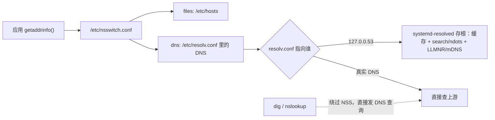

---
tags:
  - Linux
  - 网络
  - DNS
  - systemd-resolved
  - 名字解析
created: 2026-09-18
---

# 第 1 站：名字 → 地址（DNS 与名字解析）

> [!cite] 参考资料
> `man 5 nsswitch.conf`、`man 5 resolv.conf`、`man 5 hostname`、`man 5 hosts`、`man 5 systemd-resolved.service`、`man 1 resolvectl`、`man 1 getent`、`man 1 dig`、`man 1 host`、`man 1 nslookup`、`man 3 getaddrinfo`、`man 3 gethostbyname`、`man 8 systemd-networkd`，以及 RFC 1034/1035（DNS 基础）、RFC 6761（`localhost` 等特殊名字）。
>
> **实测状态**：本篇全部输出已在**本实验机**上本次重跑并粘贴，替换了原 WSL2 输出。实测环境：**Ubuntu 24.04.5 LTS（VMware 虚拟机）/ 内核 `6.8.0-139-generic` / 4 vCPU / root 可用。** 解析链的关键事实：`/etc/resolv.conf` 是指向 `/run/systemd/resolve/stub-resolv.conf` 的**符号链接**，内容是 `nameserver 127.0.0.53` + `options edns0 trust-ad` + `search localdomain`，`resolvectl status` 报 `resolv.conf mode: stub`，真实上游是网关 `192.168.246.2`（由 `systemd-networkd` 从该链路学到）。`dig`（`9.18.39-0ubuntu0.24.04.7-Ubuntu`）与 `getent` 都在本机实测过。
>
> **未实测**：真实 Kubernetes 集群里 Pod 的 `resolv.conf`（本机没有集群，`ndots:5` 与 `search <ns>.svc.cluster.local` 属按 Kubernetes 官方文档撰写）；上游 DNS 超时导致的「解析卡住很多秒」（本机上游 41 ms 可达、没有超时样本）。

> **这篇讲什么**：应用拿到的「地址」，几乎都不是 DNS 直接给的，而是 **NSS（名字服务开关）按顺序问出来的结果**。这一篇把「应用视角」和「`dig` 视角」两条路径讲清，并给出排「解析慢、结果不一致」的具体步骤。
>
> **必须先读什么**：[[Linux/06_网络协议栈与排障/01_前置_分层模型与数据包的一生|01 前置：分层模型与数据包的一生]]、[[Linux/06_网络协议栈与排障/02_前置_地址子网与路由|02 前置：地址、子网与路由]]。
>
> **读完能回答**：① 为什么 `getent hosts` 和 `dig` 结果不一样？② 解析慢在哪里、怎么量化？③ 容器里的解析为什么和宿主机不同？④ 排 DNS 问题的第一句话是什么？
>
> 所属：[[Linux/06_网络协议栈与排障/00_导读与知识地图|06 网络协议栈与排障]] 的**第 1 站** · 主要练 **N5 名字解析治理**

## 0. 30 秒速览

> [!abstract] 这一篇只要记住六句话
> - **应用不直接用 DNS**
>   - 怎么验证：它调用 `getaddrinfo()`，由 **NSS** 决定去问谁——实测本机 `/etc/nsswitch.conf` 是 `hosts:          files dns`，即 `/etc/hosts` 先于 DNS。
> - **`dig` 绕过 NSS、直接发 DNS 查询**
>   - 证据：本机 `getent hosts linux-lab` 给 `127.0.1.1`（来自 `/etc/hosts`），而 `getent -s dns hosts linux-lab` 走纯 DNS 给 `fdfe:dcba:9876::86 linux-lab.localdomain`——**同一个名字，两条路径两个结果**。排障第一句话是「用 `getent` 复现一下」。
> - **`resolv.conf` 指向 `127.0.0.53` 时问的是 systemd-resolved 存根**
>   - 证据：`/etc/resolv.conf` 是 `../run/systemd/resolve/stub-resolv.conf` 的软链，`resolvectl status` 报 `resolv.conf mode: stub`，存根在 `127.0.0.53%lo:53` 与 `127.0.0.54:53` 上监听（`ss -lntp` 可直接看到两个 `systemd-resolve` 端口）。
> - **解析慢的头号原因是「一次解析被放大成多次查询」**
>   - 怎么验证：先量 `time getent hosts <name>`（本机缓存命中时实测 `0.002`~`0.004 秒`，冷查询 `0.003 秒`），再看 `search` 域数量与 `ndots`；Kubernetes 默认 `ndots:5`，单次解析可能产生 4~5 次查询。
> - **容器有独立的 `resolv.conf`/`nsswitch.conf`**
>   - 怎么验证：进容器或它的网络命名空间看（`nsenter -t <pid> -n cat /etc/resolv.conf`）；本机的 `/etc/resolv.conf` 与容器内那份没有关系（子笔记 14）。
> - **验证工具分工**：`getent`（应用视角）→ `resolvectl query`（resolved 视角）→ `dig @<真实DNS>`（纯 DNS 视角）
>   - 证据：本机三个视角对 `example.com` 分别给 `fdfe:dcba:9876::81`（只一族）、`198.18.0.97` + `fdfe:dcba:9876::81`（A+AAAA）、`198.18.0.97`（纯 A）。**三个一起对照，才能说清差在哪一段。**

## 1. 前置：DNS 到底是什么

新人容易把 DNS 当成「一个把域名变成 IP 的魔法服务」。建立下面四个概念，后面的排障就顺了：

| 概念 | 含义 | 排障意义 |
| --- | --- | --- |
| **递归解析器** | 你配置的 DNS 服务器（`resolv.conf` 里的 `nameserver`），由它去替你问根/权威 | 它慢或不可达，本机解析就慢/失败 |
| **记录类型** | `A`（IPv4）、`AAAA`（IPv6）、`CNAME`（别名）、`MX`、`TXT`、`PTR`（反查）等 | 「有 A 没 AAAA」「只有 CNAME」会导致不同工具结果不同 |
| **TTL** | 记录可缓存的时间（秒） | 改了 DNS 但没生效，往往是 TTL 还没过期或本地缓存 |
| **否定缓存（NXDOMAIN）** | 「这个名字不存在」也会被缓存 | 新上线域名解析失败，可能是缓存了此前的不存在结果 |

```bash
dig example.com +short                 # 验证：A/AAAA 的简洁结果
dig example.com A +noall +answer       # 验证：只看答案段（含 TTL）
dig example.com AAAA +noall +answer    # 验证：IPv6 记录
dig -x 8.8.8.8 +short                  # 验证：反查（PTR）
```

实测（本实验机，`dig` 由 `dnsutils` 提供，已安装）：

```text
$ dig example.com +short
198.18.0.97
fdfe:dcba:9876::81

$ dig example.com A +noall +answer
example.com.		4	IN	A	198.18.0.97

$ dig example.com AAAA +noall +answer
example.com.		4	IN	AAAA	fdfe:dcba:9876::81
```

注意 `dig` 的默认服务器与 `Query time`：本机实测 `;; SERVER: 127.0.0.53#53(127.0.0.53) (UDP)`、`;; Query time: 0 msec`——**`dig` 也在问 resolved 存根**，只是它不走 NSS、也不应用 `search` 域。这就是「`dig` 与应用结果不一致」的一半原因。

## 2. 应用视角：`getaddrinfo()` → NSS → hosts → DNS

### 2.1 解析链



读法：**应用只走上面那条路**（`getaddrinfo()` → NSS）；`dig` 走的是下面那条虚线，两条路可能给出完全不同的结果。

### 2.2 两个配置文件

```bash
grep -v '^#' /etc/nsswitch.conf | grep hosts    # 验证：NSS 顺序（典型：hosts: files dns）
cat /etc/resolv.conf                            # 验证：实际使用的 DNS 服务器与 search/options
```

`/etc/nsswitch.conf` 里典型是：

```text
hosts:          files dns
```

`/etc/resolv.conf` 在本机是一个**指向存根的软链**（实测）：

```text
lrwxrwxrwx 1 root root 39 Sep  9 06:37 /etc/resolv.conf -> ../run/systemd/resolve/stub-resolv.conf

nameserver 127.0.0.53
options edns0 trust-ad
search localdomain
```

**别再照抄「`nameserver` 就是上游 DNS」的老结论**：这里 `127.0.0.53` 只是本机存的 resolved 存根，真实上游要看 `resolvectl status`——本机实测 `Link 2 (ens33)` 的 `Current DNS Server: 192.168.246.2`（就是网关，由 `systemd-networkd` 下发），且 `resolv.conf mode: stub`。

| 配置 | 字段 | 影响 |
| --- | --- | --- |
| `nsswitch.conf` | `hosts: files dns` | 先查 `/etc/hosts`，再查 DNS；顺序可以改，也可以加入 `myhostname`、`resolve` 等模块 |
| `resolv.conf` | `nameserver` | 查询发往谁（可能有多个，按顺序尝试） |
| `resolv.conf` | `search` | 短名字会依次拼接这些后缀 |
| `resolv.conf` | `options ndots:N` | 名字里**点数少于 N** 时，先试 `search` 后缀，最后才查原名 |
| `resolv.conf` | `options timeout:` / `attempts:` | 每个服务器的超时与重试次数（直接影响「解析慢」的时长） |

### 2.3 实测：`getent` 与 `dig` 结果不一致

```bash
grep -v '^#' /etc/nsswitch.conf | grep hosts   # hosts:          files dns   ← 先 hosts，再 DNS
getent hosts example.com                       # fdfe:dcba:9876::81 example.com  ← 只显示一族地址
getent -s dns hosts linux-lab                  # fdfe:dcba:9876::86 linux-lab.localdomain  ← 走纯 DNS 的结果
getent -s files hosts linux-lab                # 127.0.1.1       linux-lab      ← 走 /etc/hosts 的结果
resolvectl query example.com                   # 198.18.0.97 + fdfe:dcba:9876::81  ← 显示全部记录
dig example.com A +short                       # 198.18.0.97    ← 只有 A
```

（以上均为**本实验机实测输出**；域名与地址会随时间变化，`example.com` 在这个环境里解析到 `198.18.0.97`——这是实验网络的上游行为，不是公网真实地址。）

差异的来源不是「谁坏了」，而是三个不同：

1. **解析路径不同**：`getent` 走 NSS（先 hosts，可能经过 resolved 存根）；`dig` 直接发 DNS 查询。
2. **记录选择不同**：`getent hosts` 只显示被选中的一族地址（可能是 A，也可能是 AAAA）；`resolvectl query`/`dig` 会把 A 与 AAAA 都列出来。
3. **后缀规则不同**：`getent` 会应用 `search` 与 `ndots`；`dig` 默认不应用（除非用 `+search`）。

### 2.4 现象对照表

| 现象 | 原因 | 怎么确认 |
| --- | --- | --- |
| `getent hosts` 能解析，`dig` 不能 | 名字在 `/etc/hosts` 里（`files` 优先于 `dns`） | `grep <name> /etc/hosts` |
| 两者结果不同 | 路径不同：NSS/resolved（含缓存、`search`、`ndots`）vs 纯 DNS | `resolvectl query <name>` 与 `dig @<真实DNS> <name>` 对照 |
| `dig` 查不到而应用能解析 | `resolv.conf` 指向 `127.0.0.53`（存根）；`dig` 默认问它但不带 `search` | `dig @127.0.0.53 <name>`、`resolvectl status` 看 `resolv.conf mode` |
| 解析慢、`getent` 卡住 | `search` × `ndots` 造成「先试多个后缀再查原名」；或上游超时 | `resolvectl statistics`、`options timeout/attempts`、抓 53 端口 |
| 容器里行为与宿主机不同 | 容器有独立的 `resolv.conf`/`nsswitch.conf`；K8s 注入 `ndots:5` | 进容器 `cat /etc/resolv.conf`，或 `nsenter -t <pid> -n` 验证 |
| 改完 DNS 不生效 | TTL / 否定缓存 / 本地缓存（`resolved` 或应用自身缓存） | `resolvectl flush-caches`、`dig` 看 TTL 剩余 |

## 3. 解析慢：把「慢」量化

```bash
time getent hosts <name>            # 验证：应用视角的耗时（区分「解析慢」与「连接慢」）
resolvectl statistics               # 验证：resolved 的缓存命中、上游失败、查询次数
resolvectl status                   # 验证：上游 DNS、协议开关（LLMNR/mDNS/DNSOverTLS）、resolv.conf 模式
```

解析慢的三个层次，要分开看：

1. **本机配置放大**：`search` 域多 + `ndots` 大 → 一次解析发 4~5 个查询，每个都等超时才轮到下一个。
2. **上游不可达或慢**：`options timeout:N attempts:M` 决定「每个服务器等多久、重试几次」；本机 `resolv.conf` 没有这两个选项，用的是 **glibc 默认值 `timeout:5 attempts:2`**，且只有一个上游（`192.168.246.2`），所以单个上游挂掉时最坏要等 **10 秒**才返回失败。
3. **缓存没命中**：`resolvectl statistics` 的 cache hit 低、query 数高，说明一直在往上问。本机实测 `Cache Hits: 18 / Cache Misses: 49`、`Total Transactions: 66`、上游超时 `0`。

> [!tip] 本机实测的两个「反直觉」数字
> **缓存命中不等于快**：本机 `getent hosts example.com` 无论冷热都是 `0.00 秒`；真正的冷查询（换一个没查过的域名）实测 `0.003 秒`——因为上游就在网关（`mtr` 实测 1 跳 0.2 ms，公网目标 41 ms）。**在这台机器上「解析慢」是量不出来的**，别把「换个更快的 DNS」当成通用解药。
> **`ndots` 的放大要用查询次数看，不要用耗时看**：本机 `search localdomain` 只有一个后缀，`getent hosts nonexistent-lab-host` 走两个后缀也只要 `0.004 秒`。

> [!warning] 容器与 Kubernetes 的 `ndots:5` 是「偶发变慢」的常见隐性来源
> Pod 的 `resolv.conf` 通常带 `search <ns>.svc.cluster.local svc.cluster.local cluster.local` 与 `ndots:5`。这意味着 `foo.bar` 这种带一个点的名字会**先尝试 4 个 search 后缀**，全部 NXDOMAIN 之后才查原名——**单次解析可能产生 4~5 次 DNS 查询**。
> 判据：`cat /etc/resolv.conf`（在 Pod 内）看 `ndots` 与 `search`；对照 `resolvectl statistics` 或 `dig +search` 的查询次数。**处置方向**是使用完全限定名（结尾加点）、减少 `search` 域，或调整应用的调用方式，而不是「换个更快的 DNS」。

## 4. 生产动作：一次解析故障的取证清单

按顺序做，**每一条都要留下输出**：

1. **用应用视角复现**：`getent hosts <name>`（这一步最重要，不要用 `dig` 代替）。
2. **看配置**：`cat /etc/nsswitch.conf`、`cat /etc/resolv.conf`（如果有 `resolved`，再看 `resolvectl status`）。
3. **对照纯 DNS**：`dig @<真实DNS> <name>`、`dig @127.0.0.53 <name>`。
4. **量化耗时**：`time getent hosts <name>`；`resolvectl statistics`。
5. **确认后缀放大**：`getent` 是否卡在多个后缀上；容器内 `ndots`/`search` 是多少。
6. **确认缓存状态**：TTL 剩余、`resolvectl flush-caches` 前后对比。
7. **结论**：写出「差在哪一段」（NSS 顺序 / 存根 / 上游 / 后缀放大 / 缓存）+ 证据命令。

```bash
getent hosts <name>; time getent hosts <name>
cat /etc/nsswitch.conf /etc/resolv.conf
resolvectl status; resolvectl query <name>
resolvectl statistics
```

## 常见坑

| 常见做法或说法 | 后果或事实 |
| --- | --- |
| 用 `dig` 判断「DNS 是否正常」 | 应用走 NSS，`dig` 走纯 DNS；两者不一致是**信息**，不是「谁坏了」 |
| 认为 `/etc/hosts` 只是本地小把戏 | `files` 默认排在 `dns` 之前，hosts 里的条目会**覆盖** DNS 结果 |
| 「解析慢」就去换 DNS 服务器 | 先量化：是后缀放大、上游超时还是缓存未命中；换服务器常常无效 |
| 只看 `resolv.conf`，不看 `resolvectl status` | 有的系统 `resolv.conf` 只是存根的转发配置，真实上游在 resolved 里 |
| 在宿主机验证后就去改容器里的问题 | 容器有独立的解析配置；必须进容器或它的网络命名空间 |
| 改 DNS 记录后立即验证 | 要等 TTL 到期并清理本地缓存（`resolvectl flush-caches`） |
| 认为「IPv6 记录也用同一套命令就行」 | `getent hosts` 可能只给一族地址；排查双栈问题要看 A 与 AAAA 两条 |
| 在生产机上用 `dig` 做大批量查询排查 | 会对 DNS 服务器造成压力；先看本机缓存与统计，必要时再逐条查 |

## 决策练习

> [!question]- 场景：应用报「DNS 解析失败」，但你在机器上跑 `dig example.com` 是好的。你怎么继续？
> A. 告诉开发「DNS 正常，是你们应用的问题」
> B. 用 `getent hosts example.com` 按应用路径复现；如果 `getent` 失败，再比较 `/etc/nsswitch.conf`、`/etc/resolv.conf`、`resolvectl query`，并确认应用是在**本机**还是**容器**里跑（`nsenter -t <pid> -n cat /etc/resolv.conf`）
> C. 直接改 `/etc/resolv.conf` 换成公共 DNS
>
> **答案：B。**
> `dig` 绕过 NSS，**它的成功不能证明应用能解析**：应用可能查的是 hosts、可能经过 `resolved` 存根、可能在不同的命名空间里、也可能走 `search` 域。C 是没取证就改配置，会破坏原有的内网解析并可能造成更大范围的故障。
> **第一反应不要是什么**：不要用 `dig` 的结果否定应用的报错，也不要先改配置。

## 要点自测

> [!question]- `getent hosts` 与 `dig` 结果不一致，说明什么？
> - 两条不同的路径：`getent` 走 `getaddrinfo()` → NSS（`files` 优先于 `dns`）；`dig` 直接发 DNS 查询，**完全绕过 NSS**。
> - 四种常见原因：名字在 `/etc/hosts` 里；`resolv.conf` 指向 `systemd-resolved` 存根；`search` + `ndots` 让 `getent` 试了多个后缀；`getent hosts` 只显示一族地址而 `dig` 显示全部记录。
> - **所以**：「`dig` 通」不能证明应用能解析；排障要用 `getent` 复现。
> - **第一反应不要是什么**：不要因为两边不一致就宣布 DNS 坏了。

> [!question]- 解析慢，你会先量哪三个数？
> - **应用视角耗时**：`time getent hosts <name>`。
> - **查询放大倍数**：`resolv.conf` 的 `search` 域数量与 `ndots`（容器里常见 `ndots:5`）。
> - **上游表现**：`resolvectl statistics` 的缓存命中率与上游失败数；`options timeout/attempts` 决定每次失败要等多久。
> - **第一反应不要是什么**：不要只凭「感觉慢」就去换 DNS 服务器。

> [!question]- 为什么容器里的解析要单独验证？
> - 容器有自己的 `resolv.conf` 与 `nsswitch.conf`（由运行时或编排系统注入），与宿主机不同。
> - 容器可能处在独立 network namespace 中：宿主机能解析、容器不一定；反之亦然。
> - 验证方式：进容器 `cat /etc/resolv.conf`，或 `nsenter -t <pid> -n cat /etc/resolv.conf`（子笔记 14）。
> - **第一反应不要是什么**：不要用宿主机的解析结果推断 Pod 里的解析结果。

> 上一篇：[[Linux/06_网络协议栈与排障/03_前置_端口套接字与观测工具|03 前置：端口、套接字与观测工具]] ｜ 下一篇：[[Linux/06_网络协议栈与排障/05_第2站_建链_三次握手与两个队列|05 第 2 站：建链（三次握手与两个队列）]]
