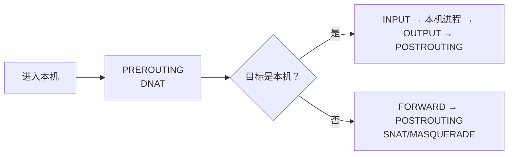

---
tags:
  - Linux
  - 网络
  - TCP
  - DNS
  - conntrack
  - 体系
created: 2026-09-22
---

# 一次请求的生命周期

一次请求从应用拿到一个名字开始，到连接断开、到转发设备与对端留下痕迹为止，中间穿过了本章所有机制。下面按这条线一次讲完，最后把贯穿多个环节的五条横切线（队列与上限、证据与计数、名字解析、主机内外、变更纪律）收在一起。

## 一、名字到地址

### 1.1 应用拿到的是 NSS 的结果，不是 DNS 的结果

应用调用 `getaddrinfo()`，内核之外的 **NSS（Name Service Switch，名字服务开关）** 按 `/etc/nsswitch.conf` 的顺序去问：典型配置是 `hosts: files dns`，即**先查 `/etc/hosts`，再查 DNS**。所以 `/etc/hosts` 里的条目会**覆盖** DNS 结果——这是默认行为，不是技巧。

```bash
grep -v '^#' /etc/nsswitch.conf | grep hosts   # 验证：NSS 顺序
cat /etc/resolv.conf                           # 验证：nameserver / search / options
ls -l /etc/resolv.conf                         # 验证：它是不是指向 resolved 存根的软链
resolvectl status                              # 验证：真实上游与 resolv.conf 模式
```

```text
hosts:          files dns

nameserver 127.0.0.53
options edns0 trust-ad
search localdomain

Link 2 (ens33)
    Current DNS Server: 192.168.246.2
    DNS Servers: 192.168.246.2
```

（以上格式按 Ubuntu 24.04 上 `systemd-resolved` 的常见输出书写，数值仅示意。）

**关键读法**：`resolv.conf` 里的 `127.0.0.53` 不是上游 DNS，而是 **systemd-resolved 的本地存根**；真实上游在 `resolvectl status` 的 `Current DNS Server` 里。把这行当成「DNS 服务器地址」会让排障走错方向。

### 1.2 三个视角要分开问

| 你想知道 | 用什么 | 关键字段 |
| --- | --- | --- |
| 应用能解析成什么 | `getent hosts <name>` | 结果行（只显示被选中的一族地址） |
| resolved 缓存与上游给了什么 | `resolvectl query <name>` | A 与 AAAA 全部记录、来源 |
| 纯 DNS 视角 | `dig @<上游> <name> A +noall +answer` | 答案段与 TTL |

三者结果不一致是**信息**而不是故障：路径不同（NSS vs 纯 DNS）、记录选择不同（一族 vs 全部）、后缀规则不同（`search`/`ndots` 只作用于前者）。

### 1.3 解析慢怎么定位

| 你看到 | 含义 | 单位与判据 | 和谁一起看 | 转向哪一步 |
| --- | --- | --- | --- | --- |
| `time getent hosts <name>` 明显偏大 | 应用视角的解析耗时 | 秒；与「连接耗时」分开量 | `resolvectl statistics` | 若解析本身快、连接慢，转传输层 |
| `search` 域多、`ndots` 大 | 一次解析被放大成多次查询 | 次数：`search` 域数 + 1 | 容器内 `resolv.conf` | 用完全限定名（结尾加点）或减少 `search` 域 |
| `resolvectl statistics` 缓存命中低 | 一直在往上问 | 比值：命中/（命中+未命中） | 上游可达性与 TTL | 先确认上游 `timeout`/`attempts` |
| 冷查询耗时远大于热查询 | 上游往返决定体感 | 秒 | `mtr` 到上游的延迟 | 上游确实远时才考虑换解析路径 |
| 容器里慢、宿主正常 | 容器有自己的 `resolv.conf` | — | `nsenter -t <pid> -n cat /etc/resolv.conf` | 在容器视角里核对 `ndots` 与 `search` |

**判据的共同前提是先量化**：没有「解析消耗了多少秒」这个数，「解析慢」就只是感觉。

## 二、地址、路由与下一跳

### 2.1 内核怎么决定从哪出去

```bash
ip route get <目标地址>                    # 验证：出口、源地址、下一跳的最终答案
ip route get <目标地址> from <源地址>      # 验证：指定源地址时的选择
ip rule show                               # 验证：先选哪张表（策略路由）
ip neigh show <下一跳>                     # 验证：二层的下一跳是否可达
```

| 字段 | 是什么 | 单位/范围 | 判据 | 和谁一起看 | 转向哪一步 |
| --- | --- | --- | --- | --- | --- |
| `via` | 下一跳地址 | 一个 IP | 与本网段网关配置一致 | `ip route`、`ip rule show` | 不一致 → 查更具体的路由或策略路由 |
| `dev` | 出口接口 | 接口名 | 多网卡机器上是否为预期出口 | `ip -br addr` | 走错口 → `ip rule show`，再看应用是否绑定 |
| `src` | 内核选定的源地址 | 一个 IP | 是否为对端期望的地址 | 接口地址、`ip rule` | 不对 → 查源地址选择与绑定 |
| `uid` | 发起查询的 uid | 数字 | 配合基于 uid 的规则判断 | `ip rule show` | 规则里出现 uid 条件时才有意义 |

| 你看到 | 含义 | 和谁一起看 | 转向哪一步 |
| --- | --- | --- | --- |
| `Network is unreachable` | 没有任何路由能匹配 | `ip route`、`ip rule show` | 补路由或修网关 |
| `ip neigh` 显示 `INCOMPLETE`/`FAILED` | 二层没通（同网段场景） | `ip -s link`、VLAN/网桥配置 | 查链路与对端，不要查路由表 |
| `ip -s link` 的 `errors`/`dropped` 增长 | 链路层在丢 | `ethtool -S` 的驱动计数 | 查驱动、环缓冲、对端设备 |
| `ip route` 正常但走错出口 | 策略路由提前分流 | `ip rule show` | 核对规则的编号与条件 |

### 2.2 转发路径上的四道关

包离开本机之后，若经过一个 Linux 转发节点（网关、容器节点、Kubernetes 节点），要依次过四道关：



| 关 | 载体 | 失败时的现场 | 转向哪一步 |
| --- | --- | --- | --- |
| 转发开关 | 内核参数 `net.ipv4.ip_forward` | 目的地址非本机的包被丢弃或回 ICMP | `sysctl net.ipv4.ip_forward` |
| 路由与邻居 | 路由表、邻居表 | `ip route get` 无结果或邻居 `FAILED` | 查路由与二层 |
| 过滤 | `FORWARD` 链（nftables/iptables） | 包被丢弃，主机侧计数器可能完全干净 | `nft list ruleset` |
| 连接跟踪 | conntrack 表 | **静默丢包**，只在 `dmesg` 与统计里留痕 | `nf_conntrack_count/max`、`conntrack -S` |

**`ip_forward=1` 不等于放行**：它只放开转发能力，能不能过还取决于 `FORWARD` 链与连接跟踪。

## 三、建链与两个队列

握手由内核完成，应用只是 `listen()` 之后不断 `accept()`。中间隔着两个队列，它们的长度、计数与失败形态完全不同。

| 你看到 | 含义 | 单位与判据 | 和谁一起看 | 转向哪一步 |
| --- | --- | --- | --- | --- |
| `ss -lnt` 的 `Recv-Q > Send-Q` | 全连接队列已满 | 个数；`Recv-Q` 是深度、`Send-Q` 是上限 | `nstat` 的 `TcpExtListenOverflows`/`ListenDrops` | 确认是 backlog 太小还是 `somaxconn` 截断 |
| `Send-Q` 等于 `somaxconn` | 上限被全局参数截断 | 个数 | `sysctl net.core.somaxconn`、应用 `listen()` 值 | 先确认是哪一侧的瓶颈，再决定改谁 |
| `TcpExtListenOverflows`/`ListenDrops` 增量非 0 | 全连接队列溢出，**静默丢包** | 次数；必须取差值 | 客户端 `SYN-SENT` 状态 | 查 `accept()` 快慢与队列上限 |
| `TcpExtTCPReqQFullDoCookies` 增长、`ListenDrops` 不涨 | 半连接队列满但 syncookies=1 | 次数 | `sysctl net.ipv4.tcp_syncookies` | 客户端仍能连上，无需动作 |
| `TcpExtTCPReqQFullDrop` 与 `ListenDrops` 同步增长 | 半连接队列满且 syncookies=0 | 次数 | 同上 | 恢复 syncookies |
| `ss -tan` 里 `SYN-SENT` 堆积 | 客户端发出去没人回 | 条数 | 服务端 `nstat`、中间设备与 conntrack | 服务端计数干净 → 查中间设备 |

**证据齐全的标准是「两个维度对上」**：`ss` 的瞬时队列状态 + `nstat` 的累计计数增量。只看其中一个都可能错过偶发事件。这一节常见的三类误判（一次 `ss` 干净就排除队列、只调 `somaxconn`、`tcp_abort_on_overflow` 的取舍被当成开关）在判例篇逐条给出判据。

## 四、传输：窗口、拥塞与重传

### 4.1 `ss -ti`：不抓包也能看链路

```bash
ss -ti                    # 验证：所有 TCP 连接的内部细节
ss -tinp 'dport = :443'   # 验证：只看某个服务，并显示进程与定时器
```

```text
ESTAB 0 0 10.0.0.1:9998 10.0.0.2:53658
	 cubic wscale:7,7 rto:201 rtt:0.014/0.007 mss:1448 pmtu:1500 rcvmss:536 advmss:1448
	 cwnd:10 segs_in:2 send 8.27Gbps lastsnd:1992 lastrcv:1992 lastack:1992
	 pacing_rate 16.5Gbps delivered:1 app_limited rcv_space:14480 rcv_ssthresh:64088
	 minrtt:0.014 snd_wnd:64256
```

（以上格式按 `ss -ti` 输出书写，数值仅示意。）

| 字段 | 是什么 | 单位 | 判据 | 和谁一起看 |
| --- | --- | --- | --- | --- |
| `cubic` / `bbr` | 当前拥塞控制算法 | — | 与 `sysctl net.ipv4.tcp_congestion_control` 一致 | 是否有 `fq` 队列 |
| `rtt:x/y` | 平滑 RTT / 波动 | 毫秒 | 与 `minrtt` 差距大 = 路径上有排队 | `minrtt` |
| `minrtt` | 观测到的最小 RTT，**路径基线** | 毫秒 | 稳定值即为这条路径的下限 | `rtt`、`retrans` |
| `cwnd` | 拥塞窗口 | 以 MSS 计 | 小 `cwnd` + 大 `minrtt` = 窗口受限 | `snd_wnd`、BDP |
| `snd_wnd` | 对端通告的接收窗口 | 字节 | 很小或为 0 = 对端应用不读 | 对端的 `Recv-Q` |
| `mss` / `pmtu` / `advmss` | 协商 MSS / 路径 MTU / 本端通告 | 字节 | `pmtu` 异常小 → 查到路径上的隧道 | `ip link show` |
| `retrans` / `lost` | 重传段数 / 判定丢失的段数 | 个数 | 出现即说明有丢包；结合重传率看量级 | `nstat` 的 `TcpRetransSegs`/`TcpOutSegs` |
| `pacing_rate` / `send` | 当前 pacing 速率 / 估算发送速率 | 比特每秒 | 与链路带宽比率对照 | 业务吞吐 |
| `delivered` | 已被确认的字节数 | 字节 | 用于估算有效发送量 | `segs_out` |
| `app_limited` | **应用没有喂满连接** | — | 出现即说明瓶颈在应用 | 应用指标 |
| `wscale` | 窗口缩放因子 | 无 | 缺少它时高 BDP 链路的窗口撑不起来 | `snd_wnd` |

**四类瓶颈的判据**（处置方向完全不同，所以第一步是分类）：

| 现象 | 判据 | 责任方 |
| --- | --- | --- |
| 应用没喂满 | `app_limited` 出现 | 应用（加并发、改发送逻辑） |
| 窗口/缓冲受限 | `cwnd` 小、`minrtt` 大、无重传 | 路径 BDP 与 `tcp_rmem`/`tcp_wmem` |
| 丢包重传 | `retrans`/`lost` 明显、`TcpRetransSegs/TcpOutSegs` 偏高 | 链路质量、中间设备 |
| MTU/PMTU | `ping -M do` 大包全丢、`pmtu` 偏小 | 隧道/overlay 的封装开销 |

### 4.2 断开的两个状态属于谁

| 你看到 | 含义 | 单位与判据 | 和谁一起看 | 转向哪一步 |
| --- | --- | --- | --- | --- |
| 大量 `TIME-WAIT` | 主动关闭方的正常状态 | 条数；上限 ≈ 出向 QPS × 60 秒 | `ip_local_port_range` 的端口数 | 远小于端口数 → 不动手；接近 → 改应用 |
| `TcpExtTCPTimeWaitOverflow` 增量非 0 | 撞上 `tcp_max_tw_buckets`，内核跳过 `TIME_WAIT` | 次数 | `sysctl net.ipv4.tcp_max_tw_buckets` | 优先减少主动关闭；该计数是唯一信号 |
| `CLOSE-WAIT` 堆积 | 应用收到 FIN 没有 `close()` | 条数 | `/proc/<pid>/fd` 的句柄数增长 | 改应用，补监控 |
| `FIN-WAIT2` 堆积 | 对端迟迟不发 FIN | 条数 | `tcp_fin_timeout` | 看对端应用行为 |

**先判断方向，再决定动作**：`TIME_WAIT` 只出现在主动关闭方。堆在客户端说明客户端在频繁短连接；堆在服务端说明服务端在主动关连接（`Connection: close`、LB 主动断开、超时过短）。`CLOSE_WAIT` 则永远是被动关闭方的应用问题。

### 4.3 出门之后：NAT 与连接跟踪

```bash
sysctl net.ipv4.ip_forward
nft list ruleset | head -40                        # 验证：当前规则集（nftables 后端）
iptables -S | head -40                             # 验证：iptables 兼容层的规则（视发行版而定）
sysctl net.netfilter.nf_conntrack_max net.netfilter.nf_conntrack_count
conntrack -C; conntrack -S                         # 验证：条目数与统计（需 conntrack-tools）
dmesg -T | grep -i conntrack                       # 验证：table full 的日志
lsmod | grep conntrack; ls /proc/net/stat/nf_conntrack   # 验证：这台机器到底有没有在做跟踪
```

| 你看到 | 含义 | 单位与判据 | 和谁一起看 | 转向哪一步 |
| --- | --- | --- | --- | --- |
| `nf_conntrack_count` 逼近 `max` | 表将满，后续包会被静默丢弃 | 条数；看比值与趋势 | `dmesg` 的 `table full`、`conntrack -S` 的 `drop` | 先治本（连接复用），再谈调大表 |
| `dmesg` 出现 `table full, dropping packet` | 已经在丢 | 次数 | `count/max` | 同上 |
| `conntrack -C` 为 0，而业务有大量连接 | 可能**根本没有在跟踪** | 条数 | `lsmod`、`/proc/net/stat/nf_conntrack` 是否存在 | 「没有 conntrack」是正常状态，不是故障 |
| `nf_conntrack_tcp_timeout_established` 很大 | 闲置连接长期占表项 | 秒 | 业务连接模式 | 缩短它会让「长连接但长期空闲」的连接被提前回收 |
| 转发了几十 GiB 但表里一条都没有 | 没有规则显式引用 conntrack，内核未注册钩子 | — | `nft list ruleset` 是否为空 | 加 NAT/`ct state` 规则后才会开始记账 |

**最容易误读的一行是「`conntrack -C` 是 0」**：它既可能是「没有连接」，也可能是**「这台机器根本没有在做连接跟踪」**——现代内核在没有 NAT/状态化规则时不会注册 conntrack 钩子。判据是 `lsmod` 与 `/proc/net/stat/nf_conntrack` 是否存在。

## 五、链路：MTU 与组合件

| 你看到 | 含义 | 单位与判据 | 和谁一起看 | 转向哪一步 |
| --- | --- | --- | --- | --- |
| `ping -M do -s 1472` 100% 丢包 | 路径承载不了 1500 字节 | 字节；`-s` 是载荷 | 逐步缩小 `-s` 找出可用 MTU | 查隧道/overlay 封装与两端 MTU |
| `ip link show` 的 `mtu` 两端不同 | 配置不一致 | 字节 | `ss -ti` 的 `pmtu`/`mss` | 统一 MTU 或做 MSS clamping |
| `tracepath` 的 `pmtu` 偏小 | 路径上某一跳更小 | 字节 | `mtr -n -r` | 定位那一跳 |
| `ethtool -S` 的 `rx_no_buffer_count` 增长 | 环缓冲不够 | 次数 | `ethtool -g` 的 current vs maximum | 排窗口后调大（会重置网卡） |
| `/proc/net/softnet_stat` 第 2 列增长 | 收包软中断来不及 | 次数（每 CPU 一行） | `net.core.netdev_max_backlog` | 治的是软中断队列，不是网卡丢包 |
| `/proc/net/bonding/*` 的 `Partner Mac Address` 全 0 | LACP 协商未成功 | — | 成员口的 `Aggregator ID` | 两端都要配 LACP；只有一端配等于没聚合 |

`netem` 注入的边界：**队列规则只作用于出口（egress）**。想模拟「对端回包慢」要在对端注入，双向不对称延迟要两端分别注入；在 `lo` 上注入会影响本机所有走回环的流量（含 DNS 存根）。

## 六、五条横切线

前面按时间顺序讲的是一次请求的旅程；下面五条线横穿其中多个环节，排障时按它们来切更快。

### 6.1 队列与上限线：把「够不够」和「谁在排队」分开

一条请求链上有一串排队点，每一个都有自己的上限、计数与溢出后果：

| 排队点 | 上限是谁 | 溢出计数 | 溢出后果 |
| --- | --- | --- | --- |
| 名字解析查询 | 上游超时与重试（`timeout`/`attempts`） | `resolvectl statistics` 的上游失败 | 解析失败或耗时成倍 |
| 路由/邻居表 | 内核数据结构 | 邻居状态 `FAILED` | 同网段不通 |
| 半连接队列 | 由 `listen()` 的 backlog 推导 | `TcpExtTCPReqQFull*` | syncookies 兜底，或丢 SYN |
| 全连接队列 | `min(backlog, somaxconn)` | `TcpExtListenOverflows`/`ListenDrops` | 静默丢弃，客户端超时 |
| 源端口 | `ip_local_port_range` | `TcpExtTCPTimeWaitOverflow` | `Cannot assign requested address` |
| 发送队列 | `tc qdisc`（默认 `fq_codel`） | `tc -s qdisc show` 的 `dropped`、`TcpExtTCPBacklogDrop` | 出口丢包 |
| 收包软中断 | `net.core.netdev_max_backlog` | `/proc/net/softnet_stat` 第 2 列、`TcpExtTCPRcvQDrop` | 内核侧丢包 |
| 网卡环缓冲 | `ethtool -g` 的 maximum | `ethtool -S`（驱动私有名） | 网卡侧丢包 |
| 连接跟踪表 | `nf_conntrack_max` | `conntrack -S` 的 `drop`、`dmesg` 的 `table full` | 静默丢包 |

**这张表的用法**：遇到「偶发失败」时，先确定是哪一个排队点，再去看它的上限与计数——表里九类排队点治的是九种不同的病，一起改就失去了归因能力。

### 6.2 证据与计数线：为什么必须两个维度对照

| 维度 | 只看它会给出的错误结论 | 正确的用法 |
| --- | --- | --- |
| `ss` 的瞬时状态 | 「队列是空的，所以没溢出」 | 偶发事件抓不到；必须与计数器的增量对照 |
| `nstat` 的累计计数 | 「计数很大，一定有问题」 | 从开机累计；必须取差值并结合业务 |
| 应用日志 | 「服务端没日志说明请求没到」 | 握手完成但未 `accept()` 时应用确实不知情 |
| `ethtool -S` 的驱动计数 | 「所有机器都能用同一套告警模板」 | 计数器名是驱动私有的，换机型即失效 |
| 抓包 | 「抓不到就是没问题」 | 只说明这一跳没有；要用两侧对照做二分 |

两条通用纪律：**计数器一律取差值**；**任何单一计数器都不能单独定性，必须交叉验证**。

### 6.3 主机内外线：什么时候可以判定「问题不在本机」

| 判据 | 说明 | 结论方向 |
| --- | --- | --- |
| 本机 `nstat`/`ss`/`ethtool -S` 全干净 | 没有丢包、没有溢出、没有重传异常 | 先怀疑对端或中间设备 |
| 本机发出去了、对端没收到 | 两侧同时限流限时 `tcpdump` 对照 | 中间链路或过滤设备 |
| 本机收到但没回 | `INPUT` 链、`rp_filter`、conntrack | 本机过滤与跟踪 |
| 主机侧干净且路径经过安全组/LB/云网络 | 这些设备在主机之外 | 找云平台侧确认 |

**这一节的实用价值是省时间**：主机侧计数干净时，继续在本机调参数不会让问题消失。

### 6.4 变更纪律线：任何一次改动都要能回滚

网络参数的存放位置本身就决定了「改了会不会生效、什么时候生效」：

| 载体 | 例子 | 生效方式 | 持久化位置 |
| --- | --- | --- | --- |
| 内核参数 | `net.ipv4.tcp_*`、`net.core.*` | `sysctl -w` 立即，但重启即失效 | `/etc/sysctl.d/*.conf`（由 `systemd-sysctl` 开机应用） |
| 内核接口文件 | `/sys/...`、`/proc/sys/...` | 直接写入立即生效 | 需自己确保开机重现（sysctl 或 unit） |
| 防火墙规则 | `nft`/`iptables` 规则集 | 命令立即，但重启即失效 | 发行版对应的持久化机制或自建 unit |
| 链路与设备 | MTU、bond 模式、队列数、环缓冲 | 命令立即，部分动作**会重置网卡（短暂断流）** | 发行版的网络配置（`systemd-networkd`/`NetworkManager`） |
| 模块与算法 | `tcp_bbr`、`nf_conntrack` | `modprobe` 是**全局内核状态变更** | `/etc/modules-load.d/`、`/etc/modprobe.d/` |
| 名字解析 | `resolv.conf`、`resolved` 配置 | 视文件是否被程序接管 | `systemd-resolved` 配置或网络管理程序 |

四条纪律：

1. **先量化**：记录改之前的计数器与业务表现（`nstat`、`ss -s`、`ss -ti`、业务 P99）。
2. **一次只改一项**：写进变更记录（改动原因、期望效果、观察指标、回滚命令）。
3. **观察至少一个业务周期再固化**；无效则回滚，不要「先留着看看」。
4. **任何影响连通性的动作**（改 MTU、改 bond、动防火墙、重启网络）都要排窗口、准备回滚，并在有带外或控制台的前提下操作。

## 七、常见坑

| 常见做法或说法 | 后果或事实 |
| --- | --- |
| 用 `dig` 判断「DNS 是否正常」 | 应用走 NSS；两者不一致是信息，不是故障 |
| 用 `ip route` 代替 `ip route get` | 看不到策略路由与源地址选择的参与 |
| 同网段不通先查路由 | 先看 `ip neigh`：`INCOMPLETE`/`FAILED` 说明二层没通 |
| 看到 `Recv-Q > Send-Q` 以为是内核 bug | 内核判满用 `>`，容量是 `backlog + 1`，属设计行为 |
| 只在客户端排查队列溢出 | 溢出只在**服务端**计数里有痕迹 |
| 用 `nstat` 的绝对值下结论 | 计数器从开机累计，要看增量 |
| 看到 `Recv-Q` 是 0 就排除队列问题 | 瞬时值抓不到偶发；要看计数器的增量 |
| 「没有重传」用于排除 UDP 丢包 | UDP 内核不记账，必须靠应用指标或抓包 |
| 看到 `conntrack -C` 是 0 就认为「表很健康」 | 也可能是这台机器根本没有在跟踪连接 |
| 把 `ip_forward=1` 当成「端口转发」开关 | 放行取决于 `FORWARD` 链与连接跟踪 |
| 表满时指望应用报错 | conntrack 满静默丢包，应用只会超时 |
| 为了减少 `TIME_WAIT` 调 `tcp_fin_timeout` | 它只管 `FIN_WAIT2` |
| 用 `CLOSE_WAIT` 去调内核参数 | 它是应用没 `close()`，内核参数无效 |
| 在生产机上做 `netem` 注入 | 会直接改变业务流量；注入只在实验机的独立命名空间里做 |

**第一反应不要做什么**（三条最有用的）：不要在没有基线时改参数；不要在主机侧计数干净时继续调本机；不要用一个计数器给故障定性。

## 常见误解

| 常见说法 | 事实 |
| --- | --- |
| 「看到栈里 `Recv-Q` 不为 0，就是有数据堵着」 | 监听 socket 的 `Recv-Q` 是「已握手未 `accept()` 的连接数」，已连接 socket 的才是未读字节数 |
| 「握手完成了，说明应用一定收到了请求」 | 中间隔着全连接队列；队列满时内核静默丢弃，应用从未见过这条连接 |
| 「主机侧计数器干净，所以问题肯定不在本机」 | 干净只说明「主机内这几层」正常；还要看对端、中间设备与转发路径 |
| 「`conntrack -C` 是 0 说明表是空的、容量充足」 | 也可能是这台机器根本没有在跟踪连接 |
| 「`si`/`so` 非 0 就是内存不够」 | 这两个数衡量的是换入换出速率；判据要与压力指标和 `pgmajfault` 一起看（见内存章） |
| 「主机侧计数干净，多调几个参数试试」 | 主机外的问题不会因为本机调参而消失，还会破坏可回滚的状态 |
| 「抓不到包就说明这段没问题」 | 只能说明这一跳没有；要对照位置与过滤条件才能下结论 |

## 要点自测

**问：一次请求从名字到断开，中间有哪些「排队点」，为什么不能把它们当同一件事？**
答：解析查询、路由/邻居表、半连接队列、全连接队列、源端口、发送队列、收包软中断、网卡环缓冲、连接跟踪表。每一处的上限载体、计数口径与溢出后果都不同——有的丢包、有的拒绝、有的只是变慢；一起改会失去归因能力。

**问：为什么「客户端偶发超时、服务端没有日志」几乎总要先看全连接队列？**
答：握手由内核完成，连接先进入全连接队列（`ss` 里是 `ESTAB`），队列满时内核默认静默丢弃，应用从未见过这些连接，所以不会有日志。判据是 `ss -lnt` 的 `Recv-Q > Send-Q` 与 `nstat` 的 `TcpExtListenOverflows`/`ListenDrops` 增量。

**问：`conntrack -C` 是 0 有哪两种完全不同的含义？怎么区分？**
答：一是「当前没有连接跟踪条目」，二是「这台机器根本没有在做连接跟踪」（没有 NAT/状态化规则时内核不注册钩子）。区分方式是 `lsmod | grep conntrack` 与 `/proc/net/stat/nf_conntrack` 是否存在。

**问：什么条件下可以判定「问题不在本机」？**
答：本机 `nstat`/`ss`/`ethtool -S` 全部干净；两侧限流限时抓包对照显示「这边发了、那边没收到」；按出口路径能定位到安全组、LB、云网络或对端设备。

**问：为什么网络变更必须写清「载体」？**
答：因为载体决定生效方式与持久化位置：内核参数用 `sysctl` 改、重启即失效，要写进 `/etc/sysctl.d/`；链路与队列的改动会重置网卡（短暂断流）；`modprobe` 是全机状态变更；防火墙规则不持久化。写不清载体，等于不知道「下一次重启后它还在不在」。

**第一反应不要做什么**：不要在没有基线时改参数；不要把「主机侧干净」当成「已经查完」；不要用一次采样或一个计数器下结论。

## 参考文档

- `man 5 nsswitch.conf`、`man 5 resolv.conf`、`man 3 getaddrinfo`、`man 1 getent`、`man 1 resolvectl`、`man 5 systemd-resolved.service`。
- `man 8 ip`、`man 8 ip-route`、`man 8 ip-rule`、`man 8 ip-neighbour`、`man 8 ip-link`、`man 8 bridge`。
- `man 7 tcp`、`man 2 listen`、`man 2 accept`、`man 7 tcp_bbr`、`man 8 ss`、`man 8 nstat`、`man 5 proc`。
- `man 8 sysctl`、`man 5 sysctl.d`、`man 8 systemd-sysctl` 与内核 6.x 文档 `Documentation/admin-guide/sysctl/net.rst`、`Documentation/networking/ip-sysctl.rst`、`Documentation/networking/nf_conntrack-sysctl.rst`、`Documentation/networking/snmp_counter.rst`。
- `man 8 nft`、`man 8 iptables`、`man 8 conntrack`、`man 8 ethtool`、`man 8 tc`、`man 8 tc-netem`、`man 8 tc-qdisc`、`man 8 tcpdump`、`man 7 pcap-filter`。
- 内核 6.x 文档 `Documentation/networking/bonding.rst`、`Documentation/networking/vxlan.rst`、`Documentation/networking/scaling.rst`、`Documentation/networking/veth.rst`、`Documentation/networking/bridge.rst`。

文中标注为实测的数值来自 Ubuntu 24.04.5 LTS（VMware 虚拟机）/ 内核 `6.8.0-139-generic` / 4 vCPU / 网卡 `ens33`（驱动 `e1000`）/ systemd-resolved 存根 `127.0.0.53` 这台实验机；涉及转发、NAT、conntrack 与 MTU 的验证在独立 network namespace 内完成；换环境必须重新采集。

上一篇：连接的生命周期 ｜ 下一篇：协议栈观测与网络基线
