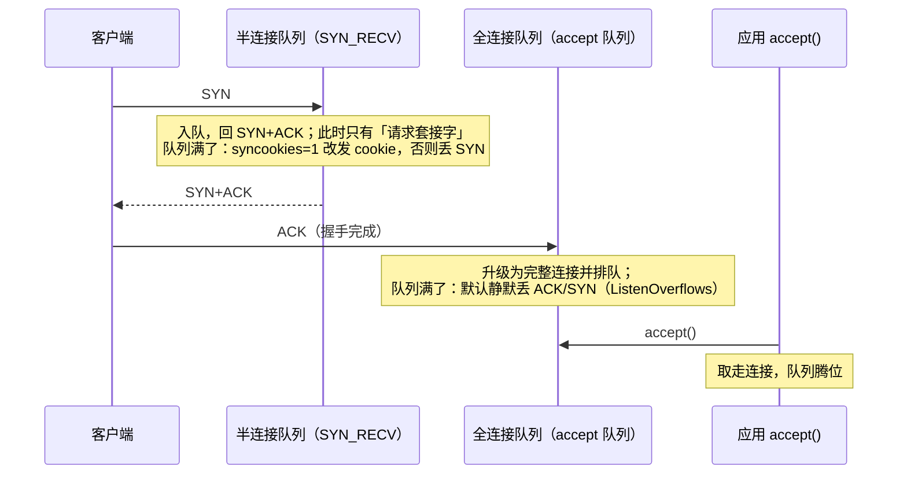

---
tags:
  - Linux
  - 网络
  - TCP
  - 三次握手
  - 队列
created: 2026-09-18
---

# 第 2 站：建链（三次握手与两个队列）

> [!cite] 参考资料
> `man 7 tcp`、`man 2 listen`、`man 2 accept`、`man 7 socket`（`listen(2)` 的 `backlog`）、`man 8 ss`、`man 8 nstat`、`man 8 sysctl`、`man 1 nc`、`man 8 ping`，内核文档 `Documentation/networking/ip-sysctl.rst`（`tcp_syncookies`、`tcp_abort_on_overflow`、`tcp_max_syn_backlog`、`somaxconn`），内核源码 `include/net/sock.h`（`sk_acceptq_is_full()`）、`include/net/inet_connection_sock.h`、`net/ipv4/tcp_input.c`（`tcp_conn_request()`）。
>
> **实测状态**：本篇数据已在**本实验机**上本次重跑并粘贴，替换了原 WSL2 输出。实测环境：**Ubuntu 24.04.5 LTS（VMware 虚拟机）/ 内核 `6.8.0-139-generic` / 4 vCPU / root 可用。** 实验在**独立 network namespace + veth 拓扑**里跑（完整脚本见子笔记 13）：本机 `somaxconn=4096`、**`tcp_max_syn_backlog=512`**、`tcp_abort_on_overflow=0`、`tcp_syncookies=1`、`tcp_syn_retries=6`、`tcp_synack_retries=5`。**换发行版或内核，这些默认值要重采。**
>
> **未实测**：真实云网络/负载均衡器对队列行为的介入（本实验环境是单台虚拟机，没有 LB、没有第二台机器）；`tcp_abort_on_overflow=1` 在生产流量下的具体表现（**改它会把「慢失败」变成用户可见错误，本机不做**——要在可快照且有控制台的机器上做）。文中已标注。

> **这篇讲什么**：这是全章最重要的一篇。**服务端有两个队列**，而生产上「客户端偶发超时、服务端应用毫无日志」的绝大多数根因就在这两个队列上。本篇把三次握手、两个队列的长度由谁决定、溢出的计数在哪、以及对应的内核参数一次讲透。
>
> **必须先读什么**：[[Linux/06_网络协议栈与排障/01_前置_分层模型与数据包的一生|01 前置：分层模型与数据包的一生]]（socket 的两种身份）、[[Linux/06_网络协议栈与排障/03_前置_端口套接字与观测工具|03 前置：端口、套接字与观测工具]]（`ss`/`nstat`）。
>
> **读完能回答**：① 两个队列分别在握手的哪一步、由谁的长度决定？② `ss -lnt` 的 `Recv-Q`/`Send-Q` 为什么会「`Recv-Q` 大于 `Send-Q`」？③ 队列满时客户端看到什么？服务端为什么没有日志？④ `tcp_syncookies` 到底改变了什么？
>
> 所属：[[Linux/06_网络协议栈与排障/00_导读与知识地图|06 网络协议栈与排障]] 的**第 2 站** · 主要练 **N3 队列与上限治理** 与 **N4 分层排障**

## 0. 30 秒速览

> [!abstract] 这一篇只要记住六句话
> - **两个队列**：半连接队列（`SYN_RECV`，握手进行中）与全连接队列（已握手完成、等应用 `accept()`）。
> - **`ss -lnt` 的 `Recv-Q` 是当前队列深度、`Send-Q` 才是队列上限**
>   - 证据：`listen(1)` 的隔离拓扑实测 `LISTEN 2      1          10.66.0.1:9001`——`Recv-Q(2) > Send-Q(1)` 就直接说明「队列满了」（内核判满是 `>` 而非 `>=`，所以实际容量是 **backlog + 1**）。
> - **全连接队列的上限 = `min(listen() 的 backlog, net.core.somaxconn)`**
>   - 证据：实测 `listen(10000)` 在 `somaxconn=4096` 的机器上被静默截断成 **4096**（`LISTEN 0      4096       127.0.0.1:9302`），所以「只调大应用 backlog」经常是无效动作。
> - **溢出时默认静默丢弃**（`tcp_abort_on_overflow=0`）
>   - 证据：客户端 attempt 1、2 `CONNECTED in 0.000 s`，attempt 3 起连续 6 次 `TimeoutError: timed out (1.001 s)`，而服务端 `TcpExtListenOverflows`/`TcpExtListenDrops` 从 0 涨到 3、最终 6——应用**完全不知道这些连接存在过**。
> - **半连接队列满不一定丢包**
>   - 证据：`tcp_syncookies=1`（本机默认）时灌 20 个伪造源 SYN，`TcpExtSyncookiesSent 18`/`TcpExtTCPReqQFullDoCookies 18`、**`ListenDrops 0`**；把该 netns 内改成 `syncookies=0` 再灌 20 个，`TcpExtTCPReqQFullDrop` 与 `ListenDrops` 才各自涨到 **20**。
> - **唯一能在故障前发现它的是告警**：`TcpExtListenOverflows`/`ListenDrops` 必须纳入监控——应用日志与 `ss` 的瞬时值都抓不到它。

## 1. 三次握手：从 SYN 到 `accept()`

### 1.1 正常流程



三个容易忽略的细节：

1. **握手是内核完成的，不是应用完成的**。应用只是 `listen()` 之后不断 `accept()`。所以「握手成功」与「应用收到请求」之间隔着一个**全连接队列**。
2. **`SYN+ACK` 是内核回的**，重传也是内核做的；只有在 `accept()` 之后，数据才会真正进到应用的 socket 缓冲区。
3. **两个队列的长度与内核参数、`listen()` 的 `backlog` 都有关**，但决定方式不同（见下一节）。

### 1.2 两个队列对照

| 队列 | 内核视图 | 上限由谁决定 | 溢出计数 | 溢出后客户端看到什么 |
| --- | --- | --- | --- | --- |
| **半连接队列** | `SYN_RECV` 状态的请求套接字 | **`listen()` 的 `backlog`**（现代内核据此推导；`tcp_max_syn_backlog` 不再是唯一决定因素） | `TcpExtTCPReqQFullDoCookies`（发 cookie）/ `TcpExtTCPReqQFullDrop`（丢） | 发 cookie 时握手照常完成；丢包时 `SYN-SENT` 重传、connect 超时 |
| **全连接队列** | `ESTAB` 但还没被 `accept()` | **`min(backlog, net.core.somaxconn)`** | `TcpExtListenOverflows` + `TcpExtListenDrops` | `SYN-SENT` 重传、connect 超时；`tcp_abort_on_overflow=1` 时是 `connection reset` |

> [!important] 队列里的连接是「已完成握手」的
> 服务端 `ss` 里它们显示 `ESTAB`，但应用还没 `accept()`。所以「服务端没收到请求」和「服务端建立了连接」**可以同时成立**——这就是「客户端说连上了、服务端说没见过」这类扯皮的根源。
> 应用视角的判据：`ss -lnt` 的 `Recv-Q` 长时间非零，或 `strace -p <pid> -e trace=accept -T` 显示 `accept` 调用间隔很长。

### 1.3 实测证据：`listen(1)` 时到底能塞进几条

实验 1/3（完整脚本见子笔记 13）用 `listen(1)` 且应用不 `accept()`，先让 8 个真实客户端依次连接，再在隔离拓扑里取证：

```bash
ip netns exec lab6a ss -lnt | grep 9001
ip netns exec lab6a ss -tan | grep 9001
ip netns exec lab6a nstat -az | grep -E 'ListenOverflows|ListenDrops'
```

```text
--- ss -lnt in lab6a (during flood, t=3s) ---
LISTEN 2      1          10.66.0.1:9001      0.0.0.0:*      # ← Recv-Q=2 > Send-Q=1，队列已满

--- ss -tan in lab6a (t=3s) ---
LISTEN     2      1          10.66.0.1:9001      0.0.0.0:*           
CLOSE-WAIT 1      0          10.66.0.1:9001    10.66.0.2:53522
CLOSE-WAIT 1      0          10.66.0.1:9001    10.66.0.2:53506

--- ss -tan in lab6b (t=3s，客户端侧) ---
SYN-SENT   0      1          10.66.0.2:53544    10.66.0.1:9001       # ← 第 3 条卡在 SYN-SENT

--- client log ---
attempt 1: CONNECTED in 0.000 s                                        # ← 第 1 条进队列
attempt 2: CONNECTED in 0.000 s                                        # ← 第 2 条进队列（backlog+1）
attempt 3: TimeoutError: timed out (1.001 s)                           # ← 之后全部超时
...
attempt 8: TimeoutError: timed out (1.001 s)

--- nstat（实验中 t=3s → 实验后）---
TcpExtListenOverflows           3  →  6
TcpExtListenDrops               3  →  6

--- accept 掉第一条之后，队列立刻腾出位置 ---
LISTEN 1      1          10.66.0.1:9001
```

（以上为**实测输出**，环境见本篇开头。注意 `CLOSE-WAIT` 出现在服务端、`SYN-SENT` 出现在客户端：**同一时刻两个队列、两种状态各有各的现场**。）

四个必须记住的边界：

1. **上限是 `min(backlog, somaxconn)`，实际能塞进 `backlog + 1` 条**：内核判满的 `sk_acceptq_is_full()` 用的是 `>`（`include/net/sock.h`），所以 `listen(1)` 时实测 `Recv-Q=2`（`Send-Q=1`）。**别用「等于多少」的直觉推，用 `ss` 实测。**
2. **溢出时默认静默丢弃**：`tcp_abort_on_overflow=0` 时客户端只能等重传超时；这也是为什么「服务端日志里什么都没有」。
3. **半连接队列在现代内核里由 backlog 决定**：实测 `listen(1)` 时半连接只留存 2 条，而本机 `tcp_max_syn_backlog=512`——**把 `tcp_max_syn_backlog` 调大并不会让 `listen(1)` 的队列变长**，这是老资料里最常见的过时结论。
4. **新建连接会重传 SYN，所以计数器涨得比客户端条数多**：实测 8 个客户端最终让 `ListenOverflows`/`ListenDrops` 涨到 6（客户端 8 条里有 2 条进了队列，其余 6 条被丢的 SYN 会被重传，所以看趋势比看绝对值重要）。

## 2. 相关内核参数：语义、默认值与副作用

| 参数 | 管什么 | 本机实测默认 | 什么时候动 | 副作用 |
| --- | --- | --- | --- | --- |
| `net.core.somaxconn` | 全连接队列的**全局上限**（`listen()` 的 backlog 会被它截断） | `4096` | 高并发短连接服务，且确认 `ss -lnt` 的 `Send-Q` 被它卡住 | 几乎无；但**它只是上限**，应用 `listen(backlog)` 也要跟上 |
| `net.ipv4.tcp_max_syn_backlog` | 半连接队列的**传统上限** | **`512`** | 老内核或明确被 SYN 洪水打的场景 | 现代内核里半连接队列主要由 backlog 推导，**单独调它往往没用** |
| `net.ipv4.tcp_abort_on_overflow` | 全连接队列满时：`0` 静默丢弃，`1` 回 RST | `0` | 想让「队列溢出」在客户端立刻显形时才设 1 | 把「慢失败」变成「快速失败」，**可能把本可恢复的抖动放大成用户可见错误** |
| `net.ipv4.tcp_syncookies` | 半连接队列满时是否发 cookie 继续服务 | `1`（启用） | 默认就开着；**不建议关** | 开启时握手会丢失部分选项（窗口缩放/时间戳在某些路径下不携带），代价远小于被 SYN 洪水打死 |
| `net.ipv4.tcp_syn_retries` | 客户端 SYN 重传次数 | `6` | 极少需要动 | 次数越多，客户端「卡住」的时间越长（这决定了队列溢出的体感时长） |

```bash
sysctl net.core.somaxconn net.ipv4.tcp_max_syn_backlog \
       net.ipv4.tcp_abort_on_overflow net.ipv4.tcp_syncookies net.ipv4.tcp_syn_retries
                                         # 验证：本机五个参数的取值（默认值随发行版与版本变化）
```

> [!warning] 调参的正确姿势：先量化，再改，然后复测
> 没有量化依据的调参就是赌博。标准动作是：① 记录改之前的计数器与业务表现（`nstat`、`ss -lnt`、业务 P99）；② 一次只改一项，写进变更记录；③ 观察至少一个业务周期；④ 有效则固化，无效则回滚。
> **`somaxconn` 与 `tcp_max_syn_backlog` 治的是两种不同的病**，别一起改，否则出了事说不清是谁的锅。

## 3. 观测与取证

```bash
ss -lnt                                  # 验证：所有监听套接字的 Recv-Q（当前深度）/Send-Q（上限）
ss -lntp                                 # 验证：同上，并显示是哪个进程在监听
ss -tan state syn-recv                   # 验证：半连接（SYN_RECV）有多少条
ss -s                                    # 验证：按状态汇总的连接数总览
nstat -az | grep -E 'ListenOverflows|ListenDrops|TCPReqQFull|SyncookiesSent'
                                         # 验证：计数器口径的「队列溢出」证据（比看 ss 更早发现问题）
strace -p <pid> -e trace=accept -T       # 验证：应用调用 accept 的间隔（是否 accept 得太慢）
```

### 3.1 半连接队列与 syncookies 的实测对照

| 现象 | `tcp_syncookies` | 计数表现（实测） | 客户端感受 |
| --- | --- | --- | --- |
| 正常 | 1 | 无异常 | 正常 |
| 半连接队列满 | **1（默认）** | `TcpExtSyncookiesSent` 与 `TcpExtTCPReqQFullDoCookies` 同步增长，**`ListenDrops` 不涨** | **仍然能连上**（内核用 cookie 完成握手） |
| 半连接队列满 | **0（关闭）** | `TcpExtTCPReqQFullDrop` 与 `TcpExtListenDrops` 同步增长 | 连接超时（SYN 被丢） |

实测数据：`listen(1)`、`syncookies=1` 时发 20 个伪造源 SYN → `SyncookiesSent 18`、`ReqQFullDoCookies 18`、`ListenDrops` **0**，且半连接现场还留得下 2 条（交叉验证 `TcpOutSegs 20`、`IpOutNoRoutes 0`，说明回程路由是通的）；把该命名空间内 `syncookies=0` 后同样发 20 个 → `ReqQFullDrop 20`、`ListenDrops 20`。**宿主命名空间的 `tcp_syncookies` 全程保持 `1`。**

**结论**：默认配置下半连接队列满**不会导致连接失败**，只是丢了握手选项；**关掉 syncookies 才会真的丢 SYN**——所以「为了性能关掉 syncookies」是典型的负优化。

### 3.2 踩坑记录：在 loopback 上伪造源地址会得出错误结论

> [!warning] 一个真实的教训，值得完整读一遍
> 最初的做法是在宿主命名空间的 `127.0.0.1` 上伪造 `10.x.x.x` 源地址。结果每个 SYN 都精确地让 `TcpExtListenDrops +1`、且**不留任何半连接**，看起来像「内核把 SYN 全丢了」。
> 真相是：**SYN-ACK 需要发往那个伪造的源地址，而回包没有可用路由，内核在 `route_req()` 阶段就失败了**——这时 `IpOutNoRoutes` 会增长，而 `TcpOutSegs` 几乎不动（SYN-ACK 一个都没发出去）。本机改用 veth 对之后实测 `TcpOutSegs 20`、`IpOutNoRoutes 0`，两个计数器一对照就能确认「回程是通的」。
> **教训**：伪造报文的实验必须有「回程可路由」的环境（用 veth 对解决），**并且要用第二个计数器交叉验证**（`IpOutNoRoutes` 与 `TcpOutSegs`）。只看一个计数器就下结论，是排障里最容易犯的错——这一点在真实故障里同样成立：**任何单一计数器都不能单独定性，必须交叉验证。**

## 4. 生产动作：一次「队列溢出」的取证清单

按顺序做，**每一条都要留下输出**：

1. **确认队列满**：`ss -lntp` 看 `Recv-Q` 与 `Send-Q`，确认是哪个进程在监听。
2. **确认溢出计数在涨**：`nstat -az | grep -E 'ListenOverflows|ListenDrops'`，隔 10~30 秒再采一次比较。
3. **确认是哪一个队列**：半连接看 `TcpExtTCPReqQFullDrop`/`SyncookiesSent` 与 `ss -tan state syn-recv`；全连接看 `ListenOverflows`。
4. **确认谁是瓶颈**：`Send-Q` 是不是被 `somaxconn` 截断了（实测 `listen(10000)` 被截到 4096）。
5. **确认应用 `accept()` 慢不慢**：`strace -p <pid> -e trace=accept -T`、`ss -lnt` 的 `Recv-Q` 是否长期非 0；常见原因是把 `accept()` 与业务处理放在同一线程，或 GC/全局锁造成周期性停顿。
6. **结论与动作**：短期扩容/摘流量；长期修应用（多 worker 或多线程 `accept()`）+ 调整 backlog 与 `somaxconn` + **给 `ListenOverflows` 配告警**。

```bash
ss -lntp
nstat -az | grep -E 'ListenOverflows|ListenDrops|TCPReqQFull|SyncookiesSent'
ss -tan state syn-recv | wc -l
sysctl net.core.somaxconn net.ipv4.tcp_syncookies net.ipv4.tcp_abort_on_overflow
strace -p <pid> -e trace=accept -T
```

## 常见坑

| 常见做法或说法 | 后果或事实 |
| --- | --- |
| 「把 `somaxconn` 调大就解决了连接堆积」 | 上限是 `min(backlog, somaxconn)`，**应用 `listen()` 的 backlog 不跟上照样溢出**（实测 `listen(10000)` 被 4096 截断） |
| 「把 `tcp_max_syn_backlog` 调到 65535 就行」 | 现代内核里半连接队列由 backlog 推导，**单独调它经常没有效果**；判据是 `nstat` 计数 |
| 「关掉 `tcp_syncookies` 能提高性能」 | 关掉后 SYN 队列满就**真丢包**（实测 20 个 SYN 全丢：`ReqQFullDrop 20`/`ListenDrops 20`），代价远大于收益 |
| 看到 `Recv-Q > Send-Q` 以为是内核 bug | 内核判满用的是 `>`，所以容量是 `backlog + 1`；这是设计行为，不是 bug |
| 只在客户端排查 | 队列溢出**只在服务端计数**里有痕迹；必须两端同时取证 |
| 用 `ListenOverflows` 的绝对值下结论 | 计数器从开机累计；要看**增量或前后差值** |
| 认为「应用日志没有 = 请求没到」 | 握手完成但未 `accept()` 时，应用不知道连接存在过 |
| 用「重启服务」作为处理手段 | 能清空队列，但根因（`accept()` 慢、backlog 太小）没解决，且毁掉现场 |

## 决策练习

> [!question]- 场景：客户端偶发连接超时，服务端应用日志里什么都没有，而服务端进程的 CPU 与内存都很低。你最怀疑什么？下一步做什么？
> - 先把三个选项在脑子里过一遍：直接找网络团队 / 怀疑全连接队列溢出并取证 / 重启服务观察。
> - **正确答案是第二项**：`ss -lntp` 看 `Recv-Q` 是否大于 `Send-Q`；`nstat` 看 `ListenOverflows` 与 `ListenDrops` 是否在涨；再看是应用 `accept()` 慢，还是 `somaxconn` 太小。
> - **为什么**：这个现象的指纹很明确——连接握手完成了，但还没进到应用，所以应用不可能有日志，CPU/内存也可以很低（`accept()` 慢不等于忙）。找网络团队会在主机侧计数器干净时浪费大量时间；重启会清掉现场，而且是 `somaxconn` 太小或应用结构问题时照样复发。
> - **第一反应不要是什么**：不要把「服务端没日志」当成「请求没到达」——握手成功但没 `accept()` 时，两者同时成立。

## 要点自测

> [!question]- 半连接队列与全连接队列，分别由什么决定？溢出的计数在哪里？
> - **半连接（`SYN_RECV`）**：长度由 `listen()` 的 backlog 推导（实测 `listen(1)` 只留存 2 条，**与 `tcp_max_syn_backlog=512` 无关**）；溢出时 `tcp_syncookies=1` 走 cookie（`TcpExtSyncookiesSent`/`ReqQFullDoCookies`），`=0` 才丢（`TcpExtTCPReqQFullDrop`）。
> - **全连接（accept 队列）**：上限 = `min(backlog, somaxconn)`（实测 `listen(10000)` 被 `somaxconn=4096` 截断），实际能放 `backlog + 1` 条；溢出计数是 `TcpExtListenOverflows` + `ListenDrops`（实测从 3 涨到 6）。
> - **判据**：`ss -lnt` 看 `Recv-Q`/`Send-Q`，`nstat` 看计数——**两个一起看才算证据齐全**。
> - **落点**：`ListenOverflows` 必须配告警，它是这类故障唯一的早期信号。

> [!question]- 客户端偶发连接失败、服务端却没有日志，可能和什么有关？
> - **全连接队列溢出（首选嫌疑）**：实测 `Recv-Q(2) > Send-Q(1)`、`TcpExtListenOverflows`/`ListenDrops` 从 0 涨到 6、客户端从第 3 条起全部 `TimeoutError`；**应用根本不知道连接存在过**。
> - **半连接队列满 + syncookies=0**：`TcpExtTCPReqQFullDrop`/`ListenDrops` 同步增长（实测 20 个 SYN 全丢）。
> - **conntrack 表满**：内核静默丢包，只在 `dmesg`/`conntrack -S` 里留痕（子笔记 09）。
> - **中间设备限速/抖动/安全组**：主机侧计数器干净，要去对端或网络侧看。
> - **第一反应不要是什么**：不要把「服务端没日志」当成「请求没到达」。

> [!question]- `tcp_abort_on_overflow=1` 有什么代价？
> - 队列溢出时内核直接回 RST，客户端立刻得到 `connection reset`——**故障从「慢失败」变成「快速失败」**。
> - 好处是问题更显眼、更容易被监控发现；代价是**原本可能自愈的短时抖动会变成用户可见的错误**。
> - 是否设 1 要与应用的重试策略一起评估；**生产中默认不动**。
> - **第一反应不要是什么**：不要为了「让问题显形」就在生产机上直接打开它。

> 上一篇：[[Linux/06_网络协议栈与排障/04_第1站_名字到地址_DNS与名字解析|04 第 1 站：名字 → 地址]] ｜ 下一篇：[[Linux/06_网络协议栈与排障/06_第3站_传输_窗口拥塞与重传|06 第 3 站：传输（窗口、拥塞与重传）]]
