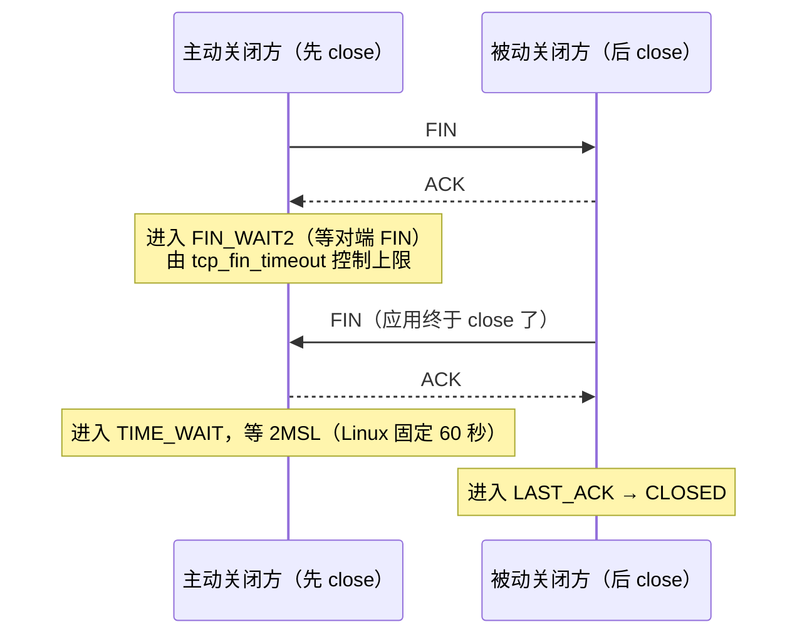

---
tags:
  - Linux
  - 网络
  - TCP
  - TIME_WAIT
  - CLOSE_WAIT
created: 2026-09-18
---

# 第 4 站：断开（四次挥手与两个状态）

> [!cite] 参考资料
> `man 7 tcp`、`man 7 socket`、`man 2 close`、`man 8 ss`、`man 8 nstat`、`man 8 sysctl`、`man 8 lsof`、`man 5 proc`（`/proc/<pid>/fd`、`/proc/<pid>/limits`），内核源码 `include/net/tcp.h`（`TCP_TIMEWAIT_LEN`）、`net/ipv4/tcp_minisocks.c`（`tcp_time_wait()`）。
>
> 本文的实测数据来自 **Ubuntu 24.04 / 内核 6.6（WSL2）** 的实验 4（完整脚本见子笔记 13）：客户端主动 `close()` 后观测本地端口状态，**61.5 秒仍为 `TIME-WAIT`、66.5 秒已消失**；本机 `tcp_fin_timeout=60`、`tcp_tw_reuse=2`、`tcp_max_tw_buckets=65536`、`ip_local_port_range=32768 60999`。**换内核或发行版要重采。**
>
> 未实测部分：`tcp_tw_reuse=1` 在真实出向短连接场景下的端口复用效果、`tcp_max_tw_buckets` 溢出时的内核告警原文。

> **这篇讲什么**：生产上「连接数异常」九成落在 `TIME_WAIT` 与 `CLOSE_WAIT` 这两个状态上，而它们**成因完全不同、责任方完全不同、处置方式也完全不同**。这一篇把四次挥手、两个状态的归属、以及「要不要处理」的量化判据讲清。
>
> **必须先读什么**：[[Linux/06_网络协议栈与排障/01_前置_分层模型与数据包的一生|01 前置：分层模型与数据包的一生]]（四元组与 socket）、[[Linux/06_网络协议栈与排障/03_前置_端口套接字与观测工具|03 前置：端口、套接字与观测工具]]（状态分布）。
>
> **读完能回答**：① `TIME_WAIT` 到底停多久、能不能调？② 为什么 `tcp_fin_timeout` 与它无关？③ `CLOSE_WAIT` 为什么只能改应用？④ 什么样的 `TIME_WAIT` 才需要处理、按什么顺序处理？
>
> 所属：[[Linux/06_网络协议栈与排障/00_导读与知识地图|06 网络协议栈与排障]] 的**第 4 站** · 主要练 **N2 连接状态判读** 与 **N3 队列与上限治理**

## 0. 30 秒速览

> [!abstract] 这一篇只要记住六句话
> - **`TIME_WAIT` 只出现在主动关闭方**：谁先 `close()`，谁承担这个状态。这决定了「该改客户端还是改服务端」。
> - **Linux 上 `TIME_WAIT` 固定 60 秒，没有任何 sysctl 能改**：实测 61.5 秒仍在、66.5 秒消失，对应内核常量 `TCP_TIMEWAIT_LEN`（60 秒）。它的意义是「确保最后的 ACK 送到 + 让旧报文在网络中消散」。
> - **`tcp_fin_timeout` 管的是 `FIN_WAIT2`，与 `TIME_WAIT` 无关**——这是最高频的面试误解，也是老资料里最常见的错误建议。
> - **`CLOSE_WAIT` 永远是应用侧问题**：对端发了 FIN，本端应用没调 `close()`。内核参数里**没有任何一项**能让它消失。
> - **要不要治 `TIME_WAIT` 先算一遍**：同时存在的 `TIME_WAIT` 上限 ≈ 出向短连接 QPS × 60 秒，与 `ip_local_port_range`（实测 28232 个端口）比较；远小于就没问题。
> - **真正有效的处置顺序**：改应用（连接池/长连接）→ 扩源端口 → `tcp_tw_reuse=1`（只对出向、需时间戳）→ `tcp_max_tw_buckets` 兜底（代价是破坏 2MSL 保护）。

## 1. 四次挥手

### 1.1 正常流程



和握手的关键区别：**挥手是「双向独立」的**。一端发 FIN 只表示「我没有数据要发了」，不代表「我不能再收」——所以存在**半关闭**状态，也所以会出现 `FIN_WAIT2`（我发了 FIN，但对方迟迟不发 FIN）。

### 1.2 状态对照表

| 状态 | 谁会出现 | 含义 | 停留时间（Linux） | 能不能调 |
| --- | --- | --- | --- | --- |
| `FIN_WAIT1` / `FIN_WAIT2` | 主动关闭方 | 已发 FIN，等对方 FIN | `FIN_WAIT2` 上限由 **`tcp_fin_timeout`**（实测默认 60s）控制 | 能（但只影响半关闭的连接） |
| `TIME_WAIT` | 主动关闭方 | 双方 FIN 都完成，等 2MSL 以确保对端收到最后的 ACK、并让旧报文消散 | **内核常量固定 60 秒**（`TCP_TIMEWAIT_LEN`），实测 61.5s 仍在、66.5s 消失 | **不能**（没有对应 sysctl） |
| `CLOSE_WAIT` | 被动关闭方 | 收到对端 FIN，**本端应用还没 `close()`** | 由应用代码路径决定，可以停到进程结束 | **只能改应用** |
| `LAST_ACK` | 被动关闭方 | 已发 FIN，等最后的 ACK | 秒级 | 不用管 |

> [!important] `tcp_fin_timeout` 与 `TIME_WAIT` 没有任何关系
> `tcp_fin_timeout` 控制的是 **`FIN_WAIT2`** 的超时（对端没回 FIN 时，本端等多久后放弃）。
> `TIME_WAIT` 的 2MSL 由协议常量决定，Linux 把它写死为 **60 秒**（`include/net/tcp.h` 的 `TCP_TIMEWAIT_LEN`），**没有任何 sysctl 可以调整**。
> 所以「调 `tcp_fin_timeout` 减少 `TIME_WAIT`」是错的；真正能动的只有三件事：**减少主动关闭（长连接/连接池）、`tcp_tw_reuse` 复用出向连接、`tcp_max_tw_buckets` 兜底**。

### 1.3 实测：`TIME_WAIT` 到底停多久

实验 4（完整脚本见子笔记 13）让主动关闭方进入 `TIME_WAIT` 并计时到消失：

```text
客户端本地端口: 33868
0.0 秒: TIME-WAIT      # 主动 close() 后立刻进入
...
61.5 秒: TIME-WAIT
66.5 秒: GONE          # ≈ 60 秒后消失，与内核常量 TCP_TIMEWAIT_LEN 一致
```

（以上为**实测输出**，环境见本篇开头；采样间隔 5 秒，所以消失时刻落在 60~65 秒之间是正常的。）

## 2. 相关内核参数

| 参数 | 管什么 | Ubuntu 24.04 实测默认 | 什么时候动 | 副作用 |
| --- | --- | --- | --- | --- |
| `net.ipv4.tcp_fin_timeout` | `FIN_WAIT2` 的等待超时 | `60` | 极少需要动 | **与 `TIME_WAIT` 无关**，别为了「减少 TIME_WAIT」改它 |
| `net.ipv4.tcp_tw_reuse` | 是否允许**出向**连接复用 `TIME_WAIT` 的四元组（`0` 关 / `1` 开 / `2` 只对回环开） | `2` | 主动发起大量短连接（反向代理、网关、爬虫）时才考虑设 `1` | 需要时间戳支持；对**入向**连接无效，也不会让 `TIME_WAIT` 变少 |
| `net.ipv4.tcp_max_tw_buckets` | `TIME_WAIT` 套接字总数上限 | `65536`（内核与发行版差异大，以本机为准） | 端口/内存吃紧且确认已溢出时才调 | 溢出时内核**直接销毁** `TIME_WAIT`（日志留痕），破坏 2MSL 的保护语义 |
| `net.ipv4.ip_local_port_range` | 本机作为客户端时的源端口范围 | `32768 60999`（28232 个） | 出向连接数打满、`connect: Cannot assign requested address` 时 | 扩到 `1024 65535` 会与系统保留端口重叠，需评估 |

```bash
sysctl net.ipv4.tcp_fin_timeout net.ipv4.tcp_tw_reuse \
       net.ipv4.tcp_max_tw_buckets net.ipv4.ip_local_port_range
                                         # 验证：四个相关参数的取值
```

> [!warning] `tcp_tw_recycle` 已经被移除
> 老资料里常见的「开 `tcp_tw_recycle` 解决 `TIME_WAIT`」是**过时且危险**的建议：它在 Linux 4.12 已被移除，而在此之前它在 NAT 环境下会造成连接随机失败。看到这个建议直接跳过。

## 3. `TIME_WAIT` 要不要处理：先算三个数

**别看到几百条就动手**。先看这三个数再决定：

1. **本地端口够不够用**：`sysctl net.ipv4.ip_local_port_range`（实测 `32768 60999`，即 **28232** 个端口）。短连接 QPS × 60 秒 = 同时存在的 `TIME_WAIT` 上限，超不过就没问题。
2. **有没有溢出**：`nstat TcpExtTCPTimeWaitOverflow`（非 0 说明撞上了 `tcp_max_tw_buckets`，实测本机 65536，日志里会有 `TCP: time wait bucket table overflow`）。
3. **是不是应用的设计问题**：HTTP 短连接把 `TIME_WAIT` 留在客户端，长连接/连接池则几乎不产生。

```bash
ss -s                                       # 验证：timewait 总数
ss -tan state time-wait | wc -l             # 验证：精确条数
ss -tan state time-wait | head -20          # 验证：谁在 TIME_WAIT（看清是哪一方的本地端口）
sysctl net.ipv4.ip_local_port_range         # 验证：可用源端口数
nstat -az | grep TCPTimeWaitOverflow        # 验证：是否撞到 tcp_max_tw_buckets
dmesg -T | grep -i 'time wait bucket'      # 验证：内核是否报过 overflow
```

**注意方向**：`TIME_WAIT` 只出现在**主动关闭方**。如果堆在**客户端**，那是客户端在频繁短连接（改客户端）；堆在**服务端**，说明服务端在主动关连接（常见于 `Connection: close`、LB 主动断开、超时设置过短）。

### 3.1 处置顺序（从治本到兜底）

1. **改应用**（最有效）：用连接池/长连接（HTTP `keep-alive`）替代短连接——`TIME_WAIT` 会成数量级下降。
2. **扩源端口**：`net.ipv4.ip_local_port_range = 1024 65535`（评估与保留端口的冲突）。
3. **`net.ipv4.tcp_tw_reuse = 1`**：只对本机主动发起的连接生效（需时间戳），能缓解「端口耗尽」，**不会减少 `TIME_WAIT` 的条数**。
4. **`tcp_max_tw_buckets` 兜底**：只在确认溢出且端口/内存确有压力时调，代价是破坏 2MSL 保护。

## 4. `CLOSE_WAIT`：只能改应用

`CLOSE_WAIT` 的含义非常明确：**对端发了 FIN，本端应用没关这个连接**。这在 Linux 上是纯应用侧问题，内核参数里**没有**任何一项能让它消失。典型原因：连接池泄漏、异常分支没 `close()`、上游不读导致阻塞、依赖库 bug。

```bash
ss -tanp state close-wait | head -20        # 验证：哪些进程持有（PID 直接给出了责任方）
ss -tanp state close-wait | awk 'NR>1{print $NF}' | sort | uniq -c | sort -rn | head
                                            # 验证：按进程聚合，找出「谁在泄漏」
ls -l /proc/<pid>/fd | wc -l                # 验证：句柄数是否随时间单调增长（泄漏的典型形状）
cat /proc/<pid>/limits | grep -i 'open files'   # 验证：是否已撞到句柄上限
```

定位后的处置顺序：

1. **先止血**：扩容/重启/摘流量（看业务能否接受）。
2. **再修根因**：连接池未归还、异常分支漏 `close()`、上游不读导致阻塞、依赖库版本 bug。
3. **补监控**：`CLOSE_WAIT` 数量与进程句柄数纳入告警，**比「连接池满」更早暴露问题**。

> [!tip] `CLOSE_WAIT` 堆积时，第一反应不要是「重启服务」
> 重启确实能清空状态，但**下一次泄漏照样发生**。正确顺序是：先按 `CLOSE_WAIT` 找到进程 → 看句柄是否单调增长 → 定位是哪段代码/哪个上游没关连接 → 用 `strace -p <pid> -e trace=network` 或应用自身指标佐证 → 最后才是止血与修复。
> 尤其在数据库、消息队列、网关这类长连接组件上，`CLOSE_WAIT` 增长往往先表现为「连接池被打满」而不是「服务报错」。

## 5. 生产动作：一次「连接数异常」的取证清单

按顺序做，**每一条都要留下输出**：

1. **状态分布**：`ss -tan | awk 'NR>1{print $1}' | sort | uniq -c | sort -rn`（先看谁在涨）。
2. **数量**：`ss -s`（`timewait` 计数）与 `ss -tan state <状态> | wc -l`。
3. **归属**：`ss -tanp state <状态>`（进程、本地端口、对端）。
4. **方向**：本地端口是服务端口还是临时端口？——决定「谁是主动关闭方」。
5. **上限**：`ip_local_port_range`、`tcp_max_tw_buckets`、`nstat` 的 overflow 计数；`CLOSE_WAIT` 则看进程句柄与 `limits`。
6. **结论与动作**：`TIME_WAIT` 走「改应用 → 扩端口 → `tw_reuse` → 兜底」；`CLOSE_WAIT` 走「找进程 → 看句柄增长 → 修代码 → 补监控」。

```bash
ss -s
ss -tan state time-wait | wc -l
ss -tanp state close-wait | head -20
nstat -az | grep -E 'TCPTimeWaitOverflow|ListenOverflows'
sysctl net.ipv4.ip_local_port_range net.ipv4.tcp_max_tw_buckets net.ipv4.tcp_fin_timeout
```

## 常见坑

| 常见做法或说法 | 后果或事实 |
| --- | --- |
| 「`TIME_WAIT` 太多，调 `tcp_fin_timeout` 变短」 | **完全无效**：`tcp_fin_timeout` 只管 `FIN_WAIT2`；`TIME_WAIT` 是内核常量 60 秒，没有 sysctl |
| 开 `tcp_tw_recycle` | 内核 4.12 已移除；在它存在时，NAT 环境下会造成连接随机失败 |
| 「`CLOSE_WAIT` 是内核参数问题」 | `CLOSE_WAIT` = 应用没 `close()`，**只能改应用**；调内核参数只会让问题换个形态 |
| 「`tcp_tw_reuse` 能减少 `TIME_WAIT`」 | 它只作用于**本机主动发起**的连接，且需要时间戳；对入向连接与 `TIME_WAIT` 总量没有帮助 |
| 看到 `TIME_WAIT` 数量多就扩容 | 先算「QPS × 60s 是否接近端口数」；很多「很多」其实完全在安全范围内 |
| 为了消除 `TIME_WAIT` 把 `tcp_max_tw_buckets` 调小 | 会提前触发内核销毁 `TIME_WAIT`，破坏 2MSL 保护，可能造成旧报文被误收 |
| 用 `ss` 的瞬时值判断「泄漏」 | 要看**趋势**：隔几分钟采两次，比较句柄数与状态数是否单调增长 |
| 认为 `TIME_WAIT` 会「拖慢」服务端 | 它不占用服务端端口，也不影响服务端接受新连接；影响的是**主动关闭方的源端口** |

## 决策练习

> [!question]- 场景：一台反向代理上 `TIME_WAIT` 数量很高，同事查资料后建议「调小 `tcp_fin_timeout`」。
> A. 调小 `tcp_fin_timeout`
> B. 先判断谁在主动关闭、算「QPS × 60s vs 源端口数」，再看 `TCPTimeWaitOverflow`；真接近上限才按「改应用 → 扩源端口 → `tcp_tw_reuse=1` → `tcp_max_tw_buckets` 兜底」处理
> C. 开 `tcp_tw_recycle`
>
> **答案：B。**
> `tcp_fin_timeout` 只管 `FIN_WAIT2`，与 `TIME_WAIT` 无关；`tcp_tw_recycle` 已被移除且在 NAT 下有害。多数「很多 `TIME_WAIT`」其实远没到端口上限。
> **第一反应不要是什么**：不要为了消灭 `TIME_WAIT` 去动这两个参数。

## 要点自测

> [!question]- 大量 `TIME_WAIT` 是问题吗？什么情况下才需要处理？
> - **判定**：`TIME_WAIT` 是**主动关闭方**的正常状态，Linux 固定 60 秒（实测 61.5s→66.5s 消失），**没有 sysctl 可调**。
> - **影响什么**：只占**源端口**（上限 = 源端口数 ÷ 60s 对应的出向 QPS）；不影响服务端接受新连接，也不会「拖慢」系统。
> - **什么时候处理**：接近端口上限、出现 `TCPTimeWaitOverflow` 或 `connect: Cannot assign requested address`，或者服务端在频繁主动关闭连接。
> - **处置顺序**：改应用（连接池/长连接）→ 扩源端口 → `tcp_tw_reuse=1` → `tcp_max_tw_buckets` 兜底。
> - **第一反应不要是什么**：不要为了「消灭 `TIME_WAIT`」去调 `tcp_fin_timeout`，也不要尝试 `tcp_tw_recycle`。

> [!question]- 为什么 `CLOSE_WAIT` 只能改应用？
> - 它表示「对端已经发了 FIN，本端内核在等应用关闭这个 socket」——**内核已经把该做的做完了**，剩下的动作在应用代码里。
> - 内核参数没有一项能让应用「忘记关闭的连接」自动消失；调参数只会改变表现形态。
> - 定位：`ss -tanp state close-wait` 找进程 → 看 `/proc/<pid>/fd` 增长 → 结合代码/上游分析。
> - **落点**：`CLOSE_WAIT` 数量与进程句柄数都应纳入监控。
> - **第一反应不要是什么**：不要只重启，也不要指望调内核参数。

> [!question]- 用一句话说清 `TIME_WAIT` 存在的意义。
> - **确保主动关闭方最后发的那一个 ACK 能到达对端**（如果它丢了，对端会重传 FIN，本端还能回一个 ACK），**并让本次连接中的旧报文在网络中彻底消散**，避免它们被后续复用同一四元组的新连接误收。
> - 所以 `tcp_max_tw_buckets` 溢出、内核直接销毁 `TIME_WAIT` 是**有代价**的兜底动作。
> - **第一反应不要是什么**：不要把 `TIME_WAIT` 当成「系统垃圾」，它是协议正确性的一部分。

> 上一篇：[[Linux/06_网络协议栈与排障/06_第3站_传输_窗口拥塞与重传|06 第 3 站：传输]] ｜ 下一篇：[[Linux/06_网络协议栈与排障/08_第5站_链路_网卡bondVLAN网桥与MTU|08 第 5 站：链路]]
