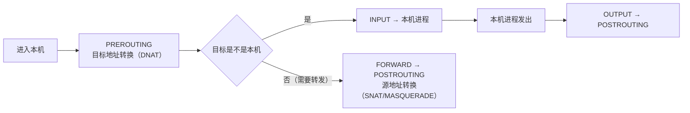

---
tags:
  - Linux
  - 网络
  - NAT
  - conntrack
  - 转发
  - 防火墙
created: 2026-09-18
---

# 第 6 站：出门之后（转发、NAT 与 conntrack）

> [!cite] 参考资料
> `man 8 iptables`、`man 8 nft`、`man 8 conntrack`、`man 8 sysctl`、`man 8 ip`、`man 8 ss`、`man 8 nstat`，内核文档 `Documentation/networking/nf_conntrack-sysctl.rst` 与 `Documentation/networking/ip-sysctl.rst`（`ip_forward`、`rp_filter`）。
>
> 实测数据来自 **Ubuntu 24.04 / 内核 6.6（WSL2）** 的 `sysctl` 采集：`nf_conntrack_max=262144`、`nf_conntrack_buckets=262144`、`nf_conntrack_tcp_timeout_established=432000`（5 天）、`nf_conntrack_tcp_timeout_time_wait=120`、`nf_conntrack_tcp_timeout_syn_recv=60`、`net.ipv4.ip_forward=0`。
> **未实测**：`conntrack -S`/`conntrack -C` 的输出、`dmesg` 里 `nf_conntrack: table full, dropping packet` 的原文、云厂商安全组的具体行为。文中已标注。

> **这篇讲什么**：包离开本机之后会发生什么，以及**为什么「主机侧一切正常」时不应该继续在本机上折腾**。核心是三件事：转发（`ip_forward`）、地址转换（NAT）、以及把这两件事串起来的**连接跟踪表（conntrack）**。
>
> **必须先读什么**：[[Linux/06_网络协议栈与排障/02_前置_地址子网与路由|02 前置：地址、子网与路由]]（路由与转发的关系）、[[Linux/06_网络协议栈与排障/05_第2站_建链_三次握手与两个队列|05 第 2 站：建链]]（队列溢出的现象）。
>
> **读完能回答**：① `ip_forward=1` 到底打开了什么？② NAT 与 conntrack 是什么关系？③ conntrack 表满时现场是什么样、为什么应用毫无感觉？④ 什么时候该判定「问题不在本机」？
>
> 所属：[[Linux/06_网络协议栈与排障/00_导读与知识地图|06 网络协议栈与排障]] 的**第 6 站** · 主要练 **N3 队列与上限治理** 与 **N4 分层排障**

## 0. 30 秒速览

> [!abstract] 这一篇只要记住六句话
> - **`ip_forward=1` 才允许三层转发**（实测默认 `0`）；它**不是**「打开端口转发」的开关，打开后必须自己保证路由与防火墙策略完整。容器节点、网关、Kubernetes 节点默认是开的。
> - **NAT 与 `state`/`ct state` 规则都依赖 conntrack**：连接跟踪表记录每条连接的状态，SNAT/DNAT、`established` 放行、Service 转发全靠它。
> - **conntrack 表满 = 静默丢包**：内核默认不回复任何错误，所以客户端看到的是**超时**而不是拒绝，应用层毫无感觉——只在 `dmesg`、`conntrack -S` 与相关计数器里留痕。
> - **两个最该看的数是 `nf_conntrack_count / nf_conntrack_max`**（实测默认 262144），以及 `nf_conntrack_tcp_timeout_established`（实测 **432000 秒 = 5 天**）。
> - **ESTABLISHED 超时 5 天意味着闲置连接也会一直占表项**：短连接多的机器要重点看这一项——它是「表满」最常见的慢性原因。
> - **判定「问题不在本机」的三个条件**：本机 `ss`/`nstat`/`ethtool -S` 都干净、两侧抓包对照显示「这边发了那边没收到」（或反之）、按出口路径排查到云网络/安全组/LB。此时继续在本机调参是浪费时间。

## 1. 转发：从「终端」变成「路由器」

```bash
sysctl net.ipv4.ip_forward          # 验证：是否开启三层转发（实测默认 0）
```

| 取值 | 含义 | 典型机器 |
| --- | --- | --- |
| `0` | 不做三层转发：目的地址不是本机的包被丢弃（或回 ICMP） | 普通业务服务器 |
| `1` | 做三层转发：像路由器一样把包从一个接口转到另一个接口 | 网关、容器节点、K8s 节点、VPN 服务器 |

三个要点：

1. **转发不等于放行**：`ip_forward=1` 只是放开转发能力，**能不能过还取决于 `FORWARD` 链与 conntrack**。所以「我明明开了转发还是不通」的答案通常在这里。
2. **转发会引入新的失败点**：路由查找、邻居解析、MTU（转发路径上的 MTU 可能更小）、conntrack 表容量。
3. **`rp_filter` 会在转发场景下更容易误杀**：见子笔记 02 的说明——先确认是否存在非对称路由，再考虑调整。

```bash
sysctl net.ipv4.ip_forward net.ipv4.conf.all.rp_filter
nft list ruleset | head -40          # 验证：当前防火墙规则（nftables 后端；部分系统用 iptables-nft）
iptables -S | head -40               # 验证：iptables 兼容层的规则（视发行版而定）
```

## 2. 防火墙：规则挂在哪、按什么顺序过

无论前端是 `firewalld`、`ufw` 还是云厂商的安全组，**最终都要落到 netfilter 的表和链**上。新人只需要先建立这张「经过顺序」：



| 链 | 处理什么 | 常见用途 |
| --- | --- | --- |
| `PREROUTING` | 刚进入本机、尚未路由判定 | DNAT（端口映射）、流量标记 |
| `INPUT` | 目标是本机的包 | 放行/限制访问本机服务（最常见的「端口没开」） |
| `FORWARD` | 需要转发出去的包 | 网关、容器节点、K8s 的转发放行 |
| `OUTPUT` | 本机发出的包 | 限制出站 |
| `POSTROUTING` | 即将离开本机的包 | SNAT/MASQUERADE（出网地址转换） |

```bash
nft list ruleset                      # 验证：完整规则集（nftables 后端）
iptables -t nat -S                    # 验证：NAT 规则（若使用 iptables 兼容层）
iptables -t filter -S                # 验证：过滤规则
```

> [!warning] 「服务连不上」时不要只看 `INPUT`
> 如果这台机器是网关/容器节点，流量走的是 `FORWARD`；只看 `INPUT` 会得出「规则是空的，应该能过」的错误结论。**先确认这个包对这台机器来说是「发给我的」还是「要我转发的」**。

## 3. conntrack：连接跟踪表

### 3.1 它是什么

conntrack 记录每条连接（及其关联连接，如 FTP 的数据连接）的**状态与超时**。它支撑三件事：

1. **NAT**：SNAT/DNAT 需要记住「这个转换对应哪条连接」，否则回包无法还原。
2. **状态化放行**：`ct state established,related -j ACCEPT` 这类规则依赖它，而不是每次重看包内容。
3. **容器与 Service 转发**：节点上的 iptables/IPVS 规则把流量转给 Pod 时，回程同样依赖 conntrack。

```bash
sysctl net.netfilter.nf_conntrack_max net.netfilter.nf_conntrack_count
                                        # 验证：上限与当前用量（count 逼近 max 就是危险信号）
cat /proc/sys/net/netfilter/nf_conntrack_count   # 验证：与上面的 count 同源，适合脚本采集
conntrack -C                            # 验证：当前连接跟踪条目数（本文未实测，需要 conntrack 工具）
conntrack -S                            # 验证：conntrack 统计数据，重点看 insert_failed / drop（未实测）
dmesg -T | grep -i conntrack            # 验证：日志里的 "nf_conntrack: table full, dropping packet"
nstat -az | grep -iE 'conntrack|drop'   # 验证：内核计数口径的丢包线索
```

### 3.2 实测默认值（必须按本机重采）

| 参数 | 实测默认 | 含义 |
| --- | --- | --- |
| `nf_conntrack_max` | `262144` | 表的最大条目数 |
| `nf_conntrack_buckets` | `262144` | 哈希桶数（影响查找性能与内存） |
| `nf_conntrack_tcp_timeout_established` | `432000`（**5 天**） | 已建立连接的空闲超时 |
| `nf_conntrack_tcp_timeout_time_wait` | `120` | `TIME_WAIT` 状态的跟踪超时 |
| `nf_conntrack_tcp_timeout_syn_recv` | `60` | 半开连接的超时 |

> [!important] conntrack 表满的现场是「超时、丢包、日志」三选一，不是「连接被拒绝」
> 表满时内核**直接丢包**（默认不回复），所以客户端看到超时而不是拒绝；服务端应用层毫无反应，只在 `dmesg`/`journalctl -k` 与 `conntrack -S` 的计数里留痕。
> 处置顺序：先确认 `count / max` 的比例 → 看是不是「短连接太多」或「ESTABLISHED 超时太长」（5 天意味着闲置连接仍占着表项）→ 再决定是调大表、缩短超时，还是从应用侧改成连接池/长连接（**治本**）。

### 3.3 三个容易搞错的点

- **调大 `nf_conntrack_max` 需要同时关注内存**：每个表项都占内存，数十万到数百万条目时是可观的常驻开销。
- **缩短 ESTABLISHED 超时会让「长连接但长时间空闲」的连接被提前回收**：表现为「偶发需要重连」，所以它同样是影响业务的变更，不是「调小就更好」。
- **关掉 conntrack 不是选项**：NAT、Service 转发、状态化防火墙都依赖它。**不要用 `nf_conntrack` 模块卸载来「解决」问题。**

## 4. 主机内 vs 主机外：怎么判定

| 判据 | 说明 | 结论方向 |
| --- | --- | --- |
| 本机 `nstat`/`ss`/`ethtool -S` 全干净 | 没有丢包、没有溢出、没有重传异常 | 先怀疑对端或中间设备 |
| 本机发出去了、对端没收到 | 两侧同时 `tcpdump` 对照（子笔记 10） | 中间链路/过滤设备 |
| 本机收到但没回 | 本机 `INPUT`/`rp_filter`/conntrack | 本机过滤与跟踪 |
| 本机连接表正常但业务超时 | 应用层或后端依赖 | 往应用层查 |
| 云主机：安全组/LB/云网络 | 主机侧计数器干净，且路径经过这些设备 | 找云平台侧确认 |

两侧对照的最小做法（需要两台机器同时操作）：

```bash
tcpdump -i eth0 -nn -c 20 host <server_ip> and port <port>   # 客户端
tcpdump -i eth0 -nn -c 20 host <client_ip> and port <port>   # 服务端
```

（抓包必须限流限时，完整纪律见子笔记 10；此处的 `-c 20` 只是最小示例。）

> [!tip] 「先证明问题在哪一段」比「猜哪个参数不对」快得多
> 网络排障最大的浪费不是查错方向，而是**在正确的方向上没有证据就改参数**。两侧对照抓包是划分「本机 / 中间 / 对端」最直接的证据。

## 5. 生产动作：一次「偶发丢包」的取证清单

按顺序做，**每一条都要留下输出**：

1. **本机计数器**：`nstat -az` 采两次对比（重传、超时、队列溢出、conntrack drop）。
2. **连接跟踪**：`nf_conntrack_count` 与 `nf_conntrack_max` 的比值；`dmesg -T | grep -i conntrack`。
3. **防火墙与转发**：`sysctl net.ipv4.ip_forward`、`nft list ruleset`（或 `iptables -S`）。
4. **接口计数**：`ip -s link`、`ethtool -S <dev>`。
5. **两侧对照**：必要时在客户端与服务端同时限流抓包。
6. **结论**：写明「本机内（哪一层）/ 中间 / 对端」+ 证据；如果是云环境，附上安全组/LB 的确认结果。

```bash
nstat -az > /tmp/nstat.before
sysctl net.netfilter.nf_conntrack_count net.netfilter.nf_conntrack_max
dmesg -T | grep -i conntrack
sysctl net.ipv4.ip_forward
ip -s link
```

## 常见坑

| 常见做法或说法 | 后果或事实 |
| --- | --- |
| 把 `ip_forward=1` 当成「端口转发」开关 | 它只放开三层转发能力；放行还取决于 `FORWARD` 链与 conntrack |
| 「`INPUT` 是空的所以应该能通」 | 转发流量走 `FORWARD`，与 `INPUT` 无关 |
| 表满时指望应用报错 | conntrack 满**静默丢包**，应用只会超时；证据在内核日志与 conntrack 统计里 |
| 直接把 `nf_conntrack_max` 调到很大 | 内存开销随之上升；且短连接多时表会继续被填满，**治本在应用连接复用** |
| 为了「省表项」把 ESTABLISHED 超时改得很短 | 长时间空闲的长连接会被提前回收，表现为业务偶发重连 |
| 「云主机通不通先看本机防火墙」 | 安全组/LB 在主机之外；主机侧规则与计数器都干净时，要找云平台侧确认 |
| 认为 conntrack 只和 NAT 有关 | 状态化防火墙、容器 Service 转发都依赖它 |
| 在容器里查 conntrack 却看宿主机的数据 | 命名空间不同；容器有自己的一套（子笔记 14） |

## 决策练习

> [!question]- 场景：云上 K8s 节点偶发新连接超时，老连接正常，主机侧 `ss`/`nstat` 基本干净。同事说「重启一下网络，或者把 `ip_forward` 重写一遍」。
> A. 重启网络服务
> B. 先查 `nf_conntrack_count/max`、`dmesg` 的 `table full`、`conntrack -S`；主机侧真干净就按「中间设备/安全组/LB/对端」方向排查
> C. 直接把 `nf_conntrack_max` 调到最大
>
> **答案：B。**
> 新连接失败、老连接正常是 conntrack 满或中间过滤的常见形状；重启网络会毁掉现场，且不解决表满。C 会放大内存开销，未必对症。
> **第一反应不要是什么**：不要在主机侧没有异常时继续反复调本机参数。

## 要点自测

> [!question]- conntrack 表满是怎样的现场？怎么处置？
> - **现场**：客户端间歇性超时、服务端应用无感，`dmesg` 里 `nf_conntrack: table full, dropping packet`；`nf_conntrack_count` 逼近 `nf_conntrack_max`（实测默认 262144）。
> - **定性**：它是**丢包**不是拒绝——所以「重试能好」的偶发故障要优先怀疑它。
> - **处置**：调大 `nf_conntrack_max`（同时看内存与 buckets）→ 缩短 `nf_conntrack_tcp_timeout_established`（实测默认 432000s = 5 天，短连接多的机器影响很大）→ **根治是让应用用长连接/连接池**。
> - **第一反应不要是什么**：不要直接关掉 conntrack（NAT 与 Service 转发都依赖它）。

> [!question]- 转发场景下，「开了 `ip_forward` 还是不通」应查哪几项？
> - **路由**：目的地址的路由是否存在、下一跳是否可达（`ip route get`）。
> - **过滤**：`FORWARD` 链（`nft list ruleset` / `iptables -S`）是否放行。
> - **跟踪**：conntrack 是否满、是否有 `insert_failed`。
> - **链路与 MTU**：出口接口状态、`ip -s link`、路径 MTU（子笔记 08）。
> - **第一反应不要是什么**：不要在只看 `INPUT` 链后就下结论。

> [!question]- 什么时候可以判定「问题不在本机」？
> - 本机侧计数器（`nstat` 的重传/超时/溢出、`ss` 的队列与状态、`ethtool -S` 的驱动计数）全部干净。
> - 两侧对照抓包证明「这边的包没有到达那边」（或反之）。
> - 按出口路径能定位到安全组、LB、云网络、对端设备。
> - **第一反应不要是什么**：不要在主机侧已经没有异常的情况下继续反复调本机参数。

> 上一篇：[[Linux/06_网络协议栈与排障/08_第5站_链路_网卡bondVLAN网桥与MTU|08 第 5 站：链路]] ｜ 下一篇：[[Linux/06_网络协议栈与排障/10_抓包与故障注入_tcpdump与tc|10 抓包与故障注入]]
