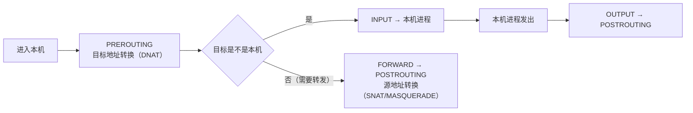

---
tags:
  - Linux
  - 网络
  - NAT
  - conntrack
  - 转发
  - 防火墙
created: 2026-09-18
---

# 第 6 站：出门之后（转发、NAT 与 conntrack）

> [!cite] 参考资料
> `man 8 iptables`、`man 8 nft`、`man 8 conntrack`、`man 8 sysctl`、`man 8 ip`、`man 8 ss`、`man 8 nstat`，内核文档 `Documentation/networking/nf_conntrack-sysctl.rst` 与 `Documentation/networking/ip-sysctl.rst`（`ip_forward`、`rp_filter`）。
>
> **实测状态**：本篇已在**本实验机**上本次重跑并粘贴，替换了原 WSL2 输出。实测环境：**Ubuntu 24.04.5 LTS（VMware 虚拟机）/ 内核 `6.8.0-139-generic` / 4 vCPU / root 可用。** 实验全部在**独立 network namespace** 里做（`c6 —— r6（路由器） —— s6` 三命名空间 + nftables DNAT/MASQUERADE，脚本留存为 `.labvm/evidence/06_nat_conntrack_router`、`06_conntrack_table_full`），宿主网络栈未改动（实测宿主 `net.ipv4.ip_forward` 始终为 `0`、`conntrack -C` 始终为 `0`）。
>
> **本机最重要的事实：`nf_conntrack` 模块默认未加载、而且默认不参与记账。**
> - `lsmod` 里没有 `nf_conntrack`，`/proc/sys/net/netfilter/` 下只有 `nf_hooks_lwtunnel`/`nf_log`/`nf_log_all_netns`，**`nf_conntrack_max` 不存在**；
> - 加载后（`modprobe nf_conntrack`）才有值：`nf_conntrack_max=262144`、`nf_conntrack_buckets=262144`、`nf_conntrack_tcp_timeout_established=432000`（5 天）、`nf_conntrack_tcp_timeout_time_wait=120`、`nf_conntrack_tcp_timeout_syn_recv=60`；
> - **`nf_conntrack_max` 是全局参数**：在 netns 内 `sysctl -w net.netfilter.nf_conntrack_max=64` 会被拒（`Operation not permitted`）；
> - 更关键的一条：**没有 NAT/状态化规则时，conntrack 根本不注册钩子**。实测宿主命名空间有活跃的 SSH 流量，但 `nf_conntrack_count` 与 `conntrack -C` 都是 **0**；在 netns 的路由器上转发了几十 GB 的 `iperf3` 流量（38.7 Gbits/sec），`nf_conntrack_count` 依然是 **0**——直到加上 `dnat`/`masquerade` 与 `ct state` 规则，表里才出现条目。
>
> **未实测**：云厂商安全组/LB 的具体行为（本实验环境没有云控制台）。文中已标注。

> **这篇讲什么**：包离开本机之后会发生什么，以及**为什么「主机侧一切正常」时不应该继续在本机上折腾**。核心是三件事：转发（`ip_forward`）、地址转换（NAT）、以及把这两件事串起来的**连接跟踪表（conntrack）**。
>
> **必须先读什么**：[[Linux/06_网络协议栈与排障/02_前置_地址子网与路由|02 前置：地址、子网与路由]]（路由与转发的关系）、[[Linux/06_网络协议栈与排障/05_第2站_建链_三次握手与两个队列|05 第 2 站：建链]]（队列溢出的现象）。
>
> **读完能回答**：① `ip_forward=1` 到底打开了什么？② NAT 与 conntrack 是什么关系？③ conntrack 表满时现场是什么样、为什么应用毫无感觉？④ 什么时候该判定「问题不在本机」？
>
> 所属：[[Linux/06_网络协议栈与排障/00_导读与知识地图|06 网络协议栈与排障]] 的**第 6 站** · 主要练 **N3 队列与上限治理** 与 **N4 分层排障**

## 0. 30 秒速览

> [!abstract] 这一篇只要记住六句话
> - **`ip_forward=1` 才允许三层转发**
>   - 证据：宿主本机默认 `net.ipv4.ip_forward = 0`；在 netns 的路由器里实测「`ip_forward=0` 时 `c6 → s6` 100% 丢包，改成 `1` 后 2 发 2 收 0% 丢包」，而**宿主的 `ip_forward` 全程保持 0**（netns 内改不影响宿主）。它**不是**「打开端口转发」的开关，打开后必须自己保证路由与防火墙策略完整。
> - **NAT 与 `state`/`ct state` 规则都依赖 conntrack**
>   - 证据：实测在路由器 netns 里加 `dnat to 10.66.2.2:9002` 前后，`10.66.1.1:9002` 从 `ConnectionRefusedError` 变成可连通；此时 `conntrack -L` 给出改写后的四元组（见第 3.3 节）。
> - **没有 NAT/状态化规则时，conntrack 一条都不记**
>   - 证据：宿主有活跃 SSH、路由器 netns 转发过 38.7 Gbits/sec 的流量，`nf_conntrack_count` 与 `conntrack -C` **都是 0**，`/proc/net/stat/nf_conntrack` 甚至不存在。**「机器上没有 conntrack」是正常状态，不是故障。**
> - **conntrack 表满 = 静默丢包 + 一条内核日志**
>   - 证据：把全局 `nf_conntrack_max` 压到 `64` 后从 `c6` 建 120 条并发长连接，只有 **63 条**成功、**57 条**失败；`dmesg`/`journalctl -k` 出现 `nf_conntrack: nf_conntrack: table full, dropping packet`，`conntrack -S` 里 `invalid=126 drop=27`。
> - **两个最该看的数是 `nf_conntrack_count / nf_conntrack_max`，以及 `nf_conntrack_tcp_timeout_established`**
>   - 证据：加载后实测 `262144` / `262144`，ESTABLISHED 超时 **432000 秒 = 5 天**——闲置连接也会一直占表项，是「表满」最常见的慢性原因。
> - **判定「问题不在本机」的三个条件**：本机 `ss`/`nstat`/`ethtool -S` 都干净、两侧抓包对照显示「这边发了那边没收到」（或反之）、按出口路径排查到云网络/安全组/LB。此时继续在本机调参是浪费时间。

## 1. 转发：从「终端」变成「路由器」

```bash
sysctl net.ipv4.ip_forward          # 验证：是否开启三层转发（实测默认 0）
```

| 取值 | 含义 | 典型机器 |
| --- | --- | --- |
| `0` | 不做三层转发：目的地址不是本机的包被丢弃（或回 ICMP） | 普通业务服务器 |
| `1` | 做三层转发：像路由器一样把包从一个接口转到另一个接口 | 网关、容器节点、K8s 节点、VPN 服务器 |

三个要点：

1. **转发不等于放行**：`ip_forward=1` 只是放开转发能力，**能不能过还取决于 `FORWARD` 链与 conntrack**。所以「我明明开了转发还是不通」的答案通常在这里。
2. **转发会引入新的失败点**：路由查找、邻居解析、MTU（转发路径上的 MTU 可能更小）、conntrack 表容量。
3. **`rp_filter` 会在转发场景下更容易误杀**：见子笔记 02 的说明——先确认是否存在非对称路由，再考虑调整。

```bash
sysctl net.ipv4.ip_forward net.ipv4.conf.all.rp_filter
nft list ruleset | head -40          # 验证：当前防火墙规则（nftables 后端；部分系统用 iptables-nft）
iptables -S | head -40               # 验证：iptables 兼容层的规则（视发行版而定）
```

## 2. 防火墙：规则挂在哪、按什么顺序过

无论前端是 `firewalld`、`ufw` 还是云厂商的安全组，**最终都要落到 netfilter 的表和链**上。新人只需要先建立这张「经过顺序」：



| 链 | 处理什么 | 常见用途 |
| --- | --- | --- |
| `PREROUTING` | 刚进入本机、尚未路由判定 | DNAT（端口映射）、流量标记 |
| `INPUT` | 目标是本机的包 | 放行/限制访问本机服务（最常见的「端口没开」） |
| `FORWARD` | 需要转发出去的包 | 网关、容器节点、K8s 的转发放行 |
| `OUTPUT` | 本机发出的包 | 限制出站 |
| `POSTROUTING` | 即将离开本机的包 | SNAT/MASQUERADE（出网地址转换） |

```bash
nft list ruleset                      # 验证：完整规则集（nftables 后端）
iptables -t nat -S                    # 验证：NAT 规则（若使用 iptables 兼容层）
iptables -t filter -S                # 验证：过滤规则
```

> [!warning] 「服务连不上」时不要只看 `INPUT`
> 如果这台机器是网关/容器节点，流量走的是 `FORWARD`；只看 `INPUT` 会得出「规则是空的，应该能过」的错误结论。**先确认这个包对这台机器来说是「发给我的」还是「要我转发的」**。

## 3. conntrack：连接跟踪表

### 3.1 它是什么

conntrack 记录每条连接（及其关联连接，如 FTP 的数据连接）的**状态与超时**。它支撑三件事：

1. **NAT**：SNAT/DNAT 需要记住「这个转换对应哪条连接」，否则回包无法还原。
2. **状态化放行**：`ct state established,related -j ACCEPT` 这类规则依赖它，而不是每次重看包内容。
3. **容器与 Service 转发**：节点上的 iptables/IPVS 规则把流量转给 Pod 时，回程同样依赖 conntrack。

```bash
sysctl net.netfilter.nf_conntrack_max net.netfilter.nf_conntrack_count
                                        # 验证：上限与当前用量（count 逼近 max 就是危险信号）
                                        # 本机注意：模块默认未加载时这两行会报 No such file or directory
cat /proc/sys/net/netfilter/nf_conntrack_count   # 验证：与上面的 count 同源，适合脚本采集
conntrack -C                            # 验证：当前连接跟踪条目数（需要 conntrack-tools；本机已装 v1.4.8）
conntrack -S                            # 验证：conntrack 统计数据，重点看 insert_failed / drop
dmesg -T | grep -i conntrack            # 验证：日志里的 "nf_conntrack: table full, dropping packet"
nstat -az | grep -iE 'conntrack|drop'   # 验证：内核计数口径的丢包线索
```

本机实测的三种「读不到值」的情形，都不是故障。

**情形①：模块未加载时**（本机默认状态）——`/proc/sys/net/netfilter/` 下没有 conntrack 相关键：

```text
$ ls /proc/sys/net/netfilter/
nf_hooks_lwtunnel  nf_log  nf_log_all_netns
$ cat /proc/sys/net/netfilter/nf_conntrack_max
cat: /proc/sys/net/netfilter/nf_conntrack_max: No such file or directory
$ lsmod | grep -c conntrack
0
```

**情形②：模块加载了、但没有规则用它**——计数恒为 0，且 `/proc/net/stat/nf_conntrack` 不存在：

```text
$ sysctl -n net.netfilter.nf_conntrack_max      # 262144
$ conntrack -C                                  # 0
$ ls /proc/net/stat/nf_conntrack
ls: cannot access '/proc/net/stat/nf_conntrack': No such file or directory
```

**情形③：`conntrack -S` 的形态**——它按「可能的 CPU」展开（本机 4 vCPU 却打了 128 行），未启用时全是 0；真正有流量时 `invalid`/`drop` 才会动：

```text
$ conntrack -S | head -1
cpu=0   	found=0 invalid=126 insert=0 insert_failed=0 drop=27 early_drop=0 error=0 search_restart=0 clash_resolve=0 chaintoolong=0 
```

### 3.2 实测默认值（必须按本机重采）

先说明取值方式：**本机默认没有这个模块**，下面的值都是 `modprobe nf_conntrack` 之后读到的（顺带把 `nf_conntrack_netlink` 一起带了起来，所以 `rmmod nf_conntrack` 会报 `Module nf_conntrack is in use by: nf_conntrack_netlink`——**要还原就先卸 `nf_conntrack_netlink`**）。

| 参数 | 加载后实测值 | 含义 |
| --- | --- | --- |
| `nf_conntrack_max` | `262144` | 表的最大条目数（**全局参数，netns 内不可写**） |
| `nf_conntrack_buckets` | `262144` | 哈希桶数（影响查找性能与内存） |
| `nf_conntrack_tcp_timeout_established` | `432000`（**5 天**） | 已建立连接的空闲超时 |
| `nf_conntrack_tcp_timeout_time_wait` | `120` | `TIME_WAIT` 状态的跟踪超时 |
| `nf_conntrack_tcp_timeout_syn_recv` | `60` | 半开连接的超时 |
| `nf_conntrack_tcp_timeout_close_wait` | `60` | 半关闭（应用没 `close()`）的跟踪超时 |
| `nf_conntrack_udp_timeout` | `30` | UDP 会话超时 |
| `nf_conntrack_icmp_timeout` | `30` | ICMP 会话超时 |
| `nf_conntrack_expect_max` | `4096` | 关联连接（如 FTP 数据连接）的期望表上限 |

> [!important] conntrack 表满的现场是「超时、丢包、一条日志」，不是「连接被拒绝」
> 表满时内核**直接丢包**（不回复 RST），所以客户端看到的是**超时**而不是拒绝。**本机实测**：把上限压到 `64` 后建 120 条并发长连接，客户端侧 `connected = 63  failed = 57`；日志侧出现
> `nf_conntrack: nf_conntrack: table full, dropping packet`（`dmesg -T` 与 `journalctl -k` 都能看到，同一秒内可能连续多条）；统计侧 `conntrack -S` 的 `invalid=126 drop=27`。
> 处置顺序：先确认 `count / max` 的比例 → 看是不是「短连接太多」或「ESTABLISHED 超时太长」（5 天意味着闲置连接仍占着表项）→ 再决定是调大表、缩短超时，还是从应用侧改成连接池/长连接（**治本**）。

### 3.3 实测：一台 netns 路由器上的转发、DNAT、MASQUERADE 与 conntrack

拓扑（全部在 netns，可整机回收）：`c6(10.66.1.2) —— veth —— r6(10.66.1.1 / 10.66.2.1，路由器) —— veth —— s6(10.66.2.2)`，`s6` 上跑一个真实 HTTP 服务在 `9001`。

```bash
ip netns exec r6 sysctl -w net.ipv4.ip_forward=1     # 只在 r6 里开转发
ip netns exec r6 nft -f /tmp/06-nat.nft              # DNAT + masquerade（规则见下）
```

```text
table ip nat6 {
  chain prerouting { type nat hook prerouting priority dstnat; policy accept;
    iifname "v6cp" tcp dport 9001 dnat to 10.66.2.2:9001 }
  chain postrouting { type nat hook postrouting priority srcnat; policy accept;
    oifname "v6sp" masquerade }
}
```

实测四步。

**① 转发开关**：`ip_forward=0` 时 `c6 -> s6` 不通；在 `r6` 内改成 `1` 后立刻连通（宿主命名空间的 `ip_forward` 全程仍是 `0`）：

```text
2 packets transmitted, 0 received, 100% packet loss, time 1045ms     ← 改之前
2 packets transmitted, 2 received, 0% packet loss, time 1041ms       ← 改之后
```

**② 没有 DNAT 规则时**访问路由器自己的 `9001`：被拒（该地址上没有监听者）：

```text
DNAT 之前： ConnectionRefusedError [Errno 111] Connection refused
```

**③ 有 DNAT 规则后**：拿到真实响应：

```text
DNAT 生效：connected，本地端口 35748 → HTTP/1.0 200 OK
```

**④ `r6` 里的 conntrack 表**把 DNAT 与 MASQUERADE 记在同一行（前半段是原始方向，后半段是改写后的应答方向）：

```text
tcp      6 59 CLOSE_WAIT src=10.66.1.2 dst=10.66.1.1 sport=35748 dport=9002 \
         src=10.66.2.2 dst=10.66.2.1 sport=9002 dport=35748 [ASSURED] mark=0 use=1
```

服务端 `s6` 看到的对端是 MASQUERADE 之后的 `10.66.2.1`（而不是原始的 `10.66.1.2`）：
CLOSE-WAIT 1      0          10.66.2.2:9002    10.66.2.1:35748
```

**怎么读这一行 `conntrack -L`**：前半段 `src=10.66.1.2 dst=10.66.1.1` 是**原始方向**（客户端以为自己在连路由器），后半段 `src=10.66.2.2 dst=10.66.2.1` 是**应答方向**（经过 DNAT 与 MASQUERADE 之后）——**NAT 就是在改写这两组地址，而 conntrack 负责记住「怎么还原」**。

**同一个实验还顺带证明了另一件事**：在加 NAT 规则之前，`r6` 转发了几十 GB 的 `iperf3` 流量（`38.7 Gbits/sec`），`nf_conntrack_count` 仍然是 **0**、`r6` 里 `nft list ruleset` 是空的、`/proc/net/stat/nf_conntrack` 不存在。**内核只在有规则显式引用 conntrack 时才为这个命名空间注册钩子**（`nf_ct_netns_get`）。所以：「`conntrack -C` 是 0」既可能是「没有连接」，也可能是**「这台机器根本没有在做连接跟踪」**——判据是 `lsmod | grep conntrack` 与 `/proc/net/stat/nf_conntrack` 是否存在。

### 3.4 三个容易搞错的点

- **调大 `nf_conntrack_max` 需要同时关注内存**：每个表项都占内存，数十万到数百万条目时是可观的常驻开销。
- **缩短 ESTABLISHED 超时会让「长连接但长时间空闲」的连接被提前回收**：表现为「偶发需要重连」，所以它同样是影响业务的变更，不是「调小就更好」。
- **关掉 conntrack 不是选项**：NAT、Service 转发、状态化防火墙都依赖它。**不要用 `nf_conntrack` 模块卸载来「解决」问题。**

## 4. 主机内 vs 主机外：怎么判定

| 判据 | 说明 | 结论方向 |
| --- | --- | --- |
| 本机 `nstat`/`ss`/`ethtool -S` 全干净 | 没有丢包、没有溢出、没有重传异常 | 先怀疑对端或中间设备 |
| 本机发出去了、对端没收到 | 两侧同时 `tcpdump` 对照（子笔记 10） | 中间链路/过滤设备 |
| 本机收到但没回 | 本机 `INPUT`/`rp_filter`/conntrack | 本机过滤与跟踪 |
| 本机连接表正常但业务超时 | 应用层或后端依赖 | 往应用层查 |
| 云主机：安全组/LB/云网络 | 主机侧计数器干净，且路径经过这些设备 | 找云平台侧确认 |

两侧对照的最小做法（需要两台机器同时操作）：

```bash
tcpdump -i v6cp -nn -c 20 host <server_ip> and port <port>   # 路由器入口侧（netns 内，等价于「客户端方向」）
tcpdump -i v6sp -nn -c 20 host <client_ip> and port <port>   # 路由器出口侧（netns 内，等价于「服务端方向」）
```

（抓包必须限流限时，完整纪律见子笔记 10；此处的 `-c 20` 只是最小示例。**跨两台真机的对照抓包在本环境未实测**——只有一台虚拟机；但可以在本机用「路由器两侧的 veth 各抓一次」做到等价的分段定位，本机的 DNAT 实验就是这么做的。）

> [!tip] 「先证明问题在哪一段」比「猜哪个参数不对」快得多
> 网络排障最大的浪费不是查错方向，而是**在正确的方向上没有证据就改参数**。两侧对照抓包是划分「本机 / 中间 / 对端」最直接的证据。

## 5. 生产动作：一次「偶发丢包」的取证清单

按顺序做，**每一条都要留下输出**：

1. **本机计数器**：`nstat -az` 采两次对比（重传、超时、队列溢出、conntrack drop）。
2. **连接跟踪**：`nf_conntrack_count` 与 `nf_conntrack_max` 的比值；`dmesg -T | grep -i conntrack`。**本机要先确认「有没有在跟踪」**（`lsmod | grep conntrack`、`/proc/net/stat/nf_conntrack`），否则 `count` 恒为 0 会误导判断。
3. **防火墙与转发**：`sysctl net.ipv4.ip_forward`、`nft list ruleset`（或 `iptables -S`）。
4. **接口计数**：`ip -s link`、`ethtool -S <dev>`。
5. **两侧对照**：必要时在客户端与服务端同时限流抓包。
6. **结论**：写明「本机内（哪一层）/ 中间 / 对端」+ 证据；如果是云环境，附上安全组/LB 的确认结果。

```bash
nstat -az > /tmp/nstat.before
sysctl net.netfilter.nf_conntrack_count net.netfilter.nf_conntrack_max
dmesg -T | grep -i conntrack
sysctl net.ipv4.ip_forward
ip -s link
```

## 常见坑

| 常见做法或说法 | 后果或事实 |
| --- | --- |
| 看到 `conntrack -C` 是 0 就以为「表是空的、很健康」 | 本机实测：模块未加载（`nf_conntrack_max` 不存在）或没有 NAT/`ct` 规则时，**连钩子都没注册**，计数恒为 0 且 `/proc/net/stat/nf_conntrack` 不存在——先确认「有没有在跟踪」，再看「表里有多少」 |
| 在 netns 里改 `nf_conntrack_max` 做实验 | 实测被拒：`sysctl: setting key "net.netfilter.nf_conntrack_max": Operation not permitted`——**它是全局参数**，要改就得全局改并立刻还原 |
| 把 `ip_forward=1` 当成「端口转发」开关 | 它只放开三层转发能力；放行还取决于 `FORWARD` 链与 conntrack |
| 「`INPUT` 是空的所以应该能通」 | 转发流量走 `FORWARD`，与 `INPUT` 无关 |
| 表满时指望应用报错 | conntrack 满**静默丢包**，应用只会超时；本机实测证据是 `dmesg`/`journalctl -k` 的 `nf_conntrack: nf_conntrack: table full, dropping packet` 与 `conntrack -S` 的 `drop=27` |
| 直接把 `nf_conntrack_max` 调到很大 | 内存开销随之上升；且短连接多时表会继续被填满，**治本在应用连接复用** |
| 为了「省表项」把 ESTABLISHED 超时改得很短 | 长时间空闲的长连接会被提前回收（实测默认 `432000` 秒 = 5 天），表现为业务偶发重连 |
| 「云主机通不通先看本机防火墙」 | 安全组/LB 在主机之外；主机侧规则与计数器都干净时，要找云平台侧确认 |
| 认为 conntrack 只和 NAT 有关 | 状态化防火墙、容器 Service 转发都依赖它 |
| 在容器里查 conntrack 却看宿主机的数据 | 命名空间不同；容器有自己的一套（子笔记 14） |

## 决策练习

> [!question]- 场景：云上 K8s 节点偶发新连接超时，老连接正常，主机侧 `ss`/`nstat` 基本干净。同事说「重启一下网络，或者把 `ip_forward` 重写一遍」。
> A. 重启网络服务
> B. 先查 `nf_conntrack_count/max`、`dmesg` 的 `table full`、`conntrack -S`；主机侧真干净就按「中间设备/安全组/LB/对端」方向排查
> C. 直接把 `nf_conntrack_max` 调到最大
>
> **答案：B。**
> 新连接失败、老连接正常是 conntrack 满或中间过滤的常见形状；重启网络会毁掉现场，且不解决表满。C 会放大内存开销，未必对症。
> **第一反应不要是什么**：不要在主机侧没有异常时继续反复调本机参数。

## 要点自测

> [!question]- conntrack 表满是怎样的现场？怎么处置？
> - **现场**：客户端间歇性超时、服务端应用无感，`dmesg` 里有 `nf_conntrack: nf_conntrack: table full, dropping packet`；`nf_conntrack_count` 逼近 `nf_conntrack_max`。
> - **本机实测**：`nf_conntrack` **默认未加载**，先 `modprobe nf_conntrack`（加载后 `max=262144`）；把上限压到 `64` 后从客户端建 120 条并发长连接，只有 **63 条**成功、**57 条**失败，`conntrack -S` 的 `invalid=126 drop=27`，日志里出现上述消息——**它是丢包不是拒绝**，所以「重试能好」的偶发故障要优先怀疑它。
> - **处置**：调大 `nf_conntrack_max`（同时看内存与 buckets）→ 缩短 `nf_conntrack_tcp_timeout_established`（实测默认 432000s = 5 天，短连接多的机器影响很大）→ **根治是让应用用长连接/连接池**。
> - **第一反应不要是什么**：不要直接关掉 conntrack（NAT 与 Service 转发都依赖它）；也不要在只看到 `count` 小的时候就断定「这台机器没在跟踪连接」——先用 `lsmod` 与 `/proc/net/stat/nf_conntrack` 确认钩子注册了没有。

> [!question]- 转发场景下，「开了 `ip_forward` 还是不通」应查哪几项？
> - **路由**：目的地址的路由是否存在、下一跳是否可达（`ip route get`）。
> - **过滤**：`FORWARD` 链（`nft list ruleset` / `iptables -S`）是否放行。
> - **跟踪**：conntrack 是否满、是否有 `insert_failed`。
> - **链路与 MTU**：出口接口状态、`ip -s link`、路径 MTU（子笔记 08）。
> - **第一反应不要是什么**：不要在只看 `INPUT` 链后就下结论。

> [!question]- 什么时候可以判定「问题不在本机」？
> - 本机侧计数器（`nstat` 的重传/超时/溢出、`ss` 的队列与状态、`ethtool -S` 的驱动计数）全部干净。
> - 两侧对照抓包证明「这边的包没有到达那边」（或反之）。
> - 按出口路径能定位到安全组、LB、云网络、对端设备。
> - **第一反应不要是什么**：不要在主机侧已经没有异常的情况下继续反复调本机参数。

> 上一篇：[[Linux/06_网络协议栈与排障/08_第5站_链路_网卡bondVLAN网桥与MTU|08 第 5 站：链路]] ｜ 下一篇：[[Linux/06_网络协议栈与排障/10_抓包与故障注入_tcpdump与tc|10 抓包与故障注入]]
