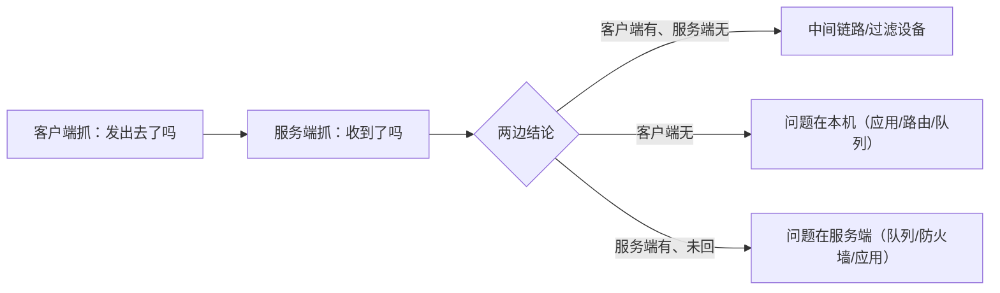

---
tags:
  - Linux
  - 网络
  - tcpdump
  - tc
  - netem
  - 抓包
created: 2026-09-18
---

# 抓包与故障注入：`tcpdump` 与 `tc`

> [!cite] 参考资料
> `man 8 tcpdump`、`man 7 pcap-filter`（过滤表达式语法）、`man 8 tc`、`man 8 tc-netem`、`man 8 tc-qdisc`、`man 8 ping`、`man 8 wireshark`（图形分析）、`man 8 ip-netns`，内核文档 `Documentation/networking/filter.rst` 与 `Documentation/networking/timestamping.rst`。
>
> **实测状态**：`tc`/`netem` 的注入与恢复在 **Ubuntu 24.04 / 内核 6.6（WSL2）** 的隔离 veth 上**已实测**（实验 5）；`tcpdump` 的输出与过滤表达式**本机未实测**（实验机未安装 `tcpdump`），按 man 页撰写，文中已标注。
>
> 本篇涉及**会影响流量的动作**（注入延迟丢包、改队列规则）：全部只在**实验机的独立 network namespace** 里做；生产取证只允许「限流限时的抓包」这一类只读动作。

> **这篇讲什么**：排障里最贵的两个动作——**在生产上抓包**（成本高、容易出事）与**复现偶发故障**（很难等）。这一篇把抓包的纪律与过滤写法讲清，并给出用 `tc netem` 在实验链路上「造出问题」的标准做法。
>
> **必须先读什么**：[[Linux/06_网络协议栈与排障/01_前置_分层模型与数据包的一生|01 前置：分层模型与数据包的一生]]（抓包里一行是什么）、[[Linux/06_网络协议栈与排障/06_第3站_传输_窗口拥塞与重传|06 第 3 站：传输]]（先用 `ss -ti` 缩小范围，再决定是否抓包）。
>
> **读完能回答**：① 怎么抓包才既拿到证据又不影响生产？② 为什么「抓不到」也是一种有效信息？③ `netem` 为什么只影响出口？④ 怎么用注入复现一次「偶发超时」并验证重试与超时参数？
>
> 所属：[[Linux/06_网络协议栈与排障/00_导读与知识地图|06 网络协议栈与排障]] · 主要练 **N7 抓包与故障注入**

## 0. 30 秒速览

> [!abstract] 这一篇只要记住六句话
> - **抓包的底线纪律：限流、限时、限文件，抓完就删**。生产机上不限流抓包能把业务拖死。
> - **三重限制**：`-c`（包数）、`-w`（落到独立目录/文件）、`timeout`（时间）；必要时再加 `-s <len>` 截断载荷。
> - **「看不到」也是证据**：抓不到包说明**这一跳没收到/没发出**，正好用来二分定位（客户端抓、服务端抓、中间抓）。
> - **始终加 `-nn`**：不解析主机名与端口名，避免反向 DNS 放大延迟。
> - **`netem` 只作用于出口（egress）**：`tc qdisc add dev X root netem ...` 影响的是从本机 X 接口发出的包；双向不对称延迟要在两端分别注入。
> - **偶发问题不要在高峰期硬抓**：先在实验链路上用 `netem` 把现象复现出来，再决定是否上生产取证——**这比等下一次故障便宜得多**。

## 1. `tcpdump`：纪律与基本功

### 1.1 三条底线

| 限制 | 参数 | 为什么 |
| --- | --- | --- |
| 包数 | `-c <N>` | 防止无限增长把磁盘写满 |
| 时间 | `timeout <秒> tcpdump ...` | 防止忘记停止 |
| 落盘位置 | `-w <文件>` | 写到独立目录（如 `/tmp` 或专用分区），避免占满根分区 |
| 载荷长度 | `-s <len>` 或 `-s 0` | 只看头时不需要全量载荷；**全量抓包代价最大** |

### 1.2 常用写法

```bash
tcpdump -i any -nn -c 100                       # 验证：前 100 个包，不解析主机名/端口名
tcpdump -i eth0 -nn host 10.0.0.5 and port 443  # 验证：只看某个对端与端口
tcpdump -i eth0 -nn 'tcp[tcpflags] & (tcp-syn|tcp-fin) != 0'
                                                # 验证：只看 SYN/FIN，快速看清「谁主动连、谁主动断」
tcpdump -i eth0 -nn -s 0 -w /tmp/cap.pcap -c 2000 -Z root
                                                # 验证：落盘，限制包数，抓完拉回本地用 Wireshark 分析
tcpdump -i eth0 -nn -c 20 'tcp port 9999 and tcp[tcpflags] & tcp-rst != 0'
                                                # 验证：是否有人回 RST（连接被拒/被重置）
timeout 60 tcpdump -i eth0 -nn -w /tmp/cap.pcap 'host 10.0.0.5'
                                                # 验证：三重限制的标准组合（时间 + 落盘 + 过滤）
```

（以上命令**本文未实测**，过滤表达式语法以 `man 7 pcap-filter` 为准。）

### 1.3 几条必须记住的边界

- **`-i any` 看到的接口名与真实链路不同**（Linux 用 cooked capture），做精确的二层分析要指定具体接口。
- **抓包本身有成本**：`-s 0` 全量抓 + 高 PPS 会把 CPU 与磁盘吃满；用 `-c`、`-w` 到独立目录、`timeout` 三重限制。
- **看不到 ≠ 不存在**：抓不到包说明**这一跳没收到/没发出**，正好用来二分定位（在客户端抓、服务端抓、中间抓）。
- **UDP 与小包也没问题，但 TLS 之后的载荷是密文**：只能看握手与统计，看不到内容——想看清楚就得上 `openssl s_client` 或应用日志。
- **落盘分析而不是盯着屏幕**：生产机上不做复杂显示过滤（非常耗 CPU）；`-w` 落到 pcap 后拉回本地用 Wireshark 分析。

### 1.4 二分定位：抓包最值钱的用法



```bash
timeout 30 tcpdump -i eth0 -nn -c 50 host <server_ip> and port <port>   # 客户端
timeout 30 tcpdump -i eth0 -nn -c 50 host <client_ip> and port <port>   # 服务端（同时执行）
```

（**未实测**；两台机器的时间要大致对齐，最好先 `date` 对一下。）

## 2. `tc`：看队列规则与注入故障

### 2.1 看当前队列规则

```bash
tc qdisc show dev eth0                  # 验证：当前队列规则（实测本机 net.core.default_qdisc=fq_codel）
tc -s qdisc show dev eth0               # 验证：加统计（dropped/backlog 直接说明队列在丢包）
tc -s qdisc show                        # 验证：所有设备的队列与丢包计数
```

### 2.2 注入延迟与丢包（实测）

实验 5（完整脚本见子笔记 13）先在隔离环境的 veth 上注入 50ms 延迟：

```bash
tc qdisc add dev veth0 root netem delay 50ms
ping -c3 10.0.0.1                       # 实测 RTT：0.029ms → 50.044/50.161/50.250 ms
```

再追加 20% 丢包，最后删除 qdisc 恢复：

```bash
tc qdisc change dev veth0 root netem delay 50ms loss 20%
ping -c10 10.0.0.1                      # 实测：10 包收到 7 包（30% 丢包，样本小，量级吻合即可）
tc qdisc del dev veth0 root             # 验证：删除后 RTT 立刻回到 0.016/0.023/0.031 ms
```

（以上为**实测输出**，环境见本篇开头。）

### 2.3 `netem` 的能力与边界

| 能力 | 参数 | 用来复现什么 |
| --- | --- | --- |
| 延迟 | `delay 50ms` | 高 RTT 链路、跨地域访问 |
| 抖动 | `delay 50ms 10ms` | 延迟波动、音视频卡顿 |
| 丢包 | `loss 20%` | 重传、拥塞控制降速、偶发失败 |
| 乱序 | `reorder 25% 50%` | 乱序重组与重传 |
| 损坏 | `corrupt 0.1%` | 校验失败 |
| 限速 | `rate 10mbit` | 带宽不足、pacing 行为 |

> [!tip] `netem` 只作用于**出口（egress）**
> `tc qdisc add dev X root netem ...` 影响的是**从本机 X 接口发出去的包**。所以：
> ① 想模拟「对端回包延迟」，要在**对端**加或在中间设备加；② 双向不对称延迟要分别在两端加；③ **回环接口（`lo`）也能加**，但会同时影响本机所有走 `lo` 的服务（包括 DNS 存根），实验机上才好这么干。
> 除了 `delay`/`loss`，`netem` 还支持 `duplicate`、`reorder`、`corrupt`、`rate`，是复现「偶发变慢/偶发失败」最便宜的手段。

## 3. 复现一个「偶发超时」的标准流程

这是把 N7 从「会敲命令」变成「会做实验」的关键步骤：

1. **先定义现象**：例如「客户端设置 1 秒超时，服务端偶发不响应」。
2. **建隔离拓扑**：`ip netns add srv|cli` + veth（子笔记 13 的实验 3）。
3. **注入故障**：`tc qdisc add dev veth0 root netem delay 50ms loss 20%`。
4. **跑真实应用或脚本**：观察超时、重试、报错是否符合预期。
5. **改一个参数（例如超时、重试次数、连接池大小）再跑一次**：**这才是注入的价值——验证参数是否合理**。
6. **恢复**：`tc qdisc del dev <dev> root`，确认 RTT 回到基线。
7. **清理**：`tc qdisc show` 确认无残留，`ip netns del` 回收拓扑。

在 `delay 50ms loss 20%` 的状态下跑应用并改参数，随后加大难度、最后恢复：

```bash
tc qdisc add dev veth0 root netem delay 50ms loss 20%
tc qdisc change dev veth0 root netem delay 200ms      # 加大难度再跑一次
tc qdisc del dev veth0 root                            # 恢复
ping -c3 10.0.0.1                                      # 验证：RTT 回到基线
```

> [!warning] 生产环境的三条红线
> ① **不要在生产机上做注入实验**（netem 会直接改变业务流量）；② **不要在高峰期无参数抓包**；③ **不要把抓到的包长期留在机器上**（含业务数据，且占空间）。

## 4. 生产动作：一次抓包取证的检查表

抓包前：

- [ ] 明确**要验证的假设**（例如「客户端发了 SYN，服务端没回」）。
- [ ] 明确**抓哪一跳**（客户端 / 服务端 / 中间）。
- [ ] 写好**过滤表达式**（host/port/flags）。
- [ ] 准备好 `-c`、`-w`、`timeout` 三重限制。
- [ ] 确认**落盘目录有空间**且不在根分区上。
- [ ] 记录**开始时间**（与另一台机器对齐）。

抓包后：

- [ ] 立即停止并确认文件大小合理。
- [ ] 拉回本地分析（Wireshark），生产机上不做复杂显示过滤。
- [ ] 记录结论与证据行（时间戳、四元组、flags）。
- [ ] **删除或归档**临时抓包文件，并把结论写进故障记录。

```bash
df -h /tmp                                       # 验证：落盘目录空间
date                                             # 验证：记录开始时间
timeout 60 tcpdump -i eth0 -nn -w /tmp/cap.pcap -c 20000 'host <ip> and port <port>'
ls -lh /tmp/cap.pcap                             # 验证：文件大小是否合理
```

## 常见坑

| 常见做法或说法 | 后果或事实 |
| --- | --- |
| 直接 `tcpdump -i any` 跑在高峰期 | 最容易把机器抓挂的做法；必须限流限时落盘 |
| 抓包不加 `-nn` | 反向 DNS 解析会拖慢甚至卡住输出 |
| 认为「抓不到就是没问题」 | 抓不到只说明这一跳没有；要用两侧对照做二分 |
| 全程 `-s 0` 全量抓 | CPU 与磁盘开销最大；只看头时截断载荷 |
| 在生产机上做 `netem` 注入 | 会直接改变业务流量；注入只在实验机做 |
| 只在 `lo` 上做注入实验 | `lo` 会影响本机所有走回环的服务（含 DNS 存根） |
| 注入后忘记删除 qdisc | 残留会持续影响流量；收尾必须 `tc qdisc show` 确认 |
| 抓到的包长期留在服务器上 | 占空间且含业务数据；分析完应及时删除或归档 |

## 决策练习

> [!question]- 场景：生产偶发 50ms 延迟，只在高峰期出现。同事说「在业务机上 `tcpdump -i any` 抓一天总能看到」。
> A. 直接抓一天
> B. 先在实验链路上用 `tc netem` 复现延迟/丢包，再决定是否在生产限流限时抓包；生产抓包要过滤、落盘、限数量
> C. 放弃抓包，直接改内核参数
>
> **答案：B。**
> 偶发问题直接抓一天命中率低、代价高；先用注入复现能确定抓包过滤条件。生产抓包必须有「限流、限时、落盘」纪律，否则高峰期会把机器抓挂。
> **第一反应不要是什么**：不要在生产高峰 `tcpdump -i any` 全量抓。

## 要点自测

> [!question]- 抓包怎么抓才能既拿到证据又不影响生产？
> - **三重限制**：`-c`（包数）、`-w`（落到独立目录/文件）、`timeout`（时间）；必要时再加 `-s <len>` 截断载荷。
> - **先想清楚抓哪一跳**：客户端抓、服务端抓、中间抓——**「这一跳有没有」比「抓全了」更有价值**（二分定位）。
> - **过滤表达式要精确**：`host`/`port`/`tcp[tcpflags]` 组合，避免把无关流量写进盘。
> - **落盘分析而不是盯着屏幕**：`-w` 落 pcap → 拉回本地 Wireshark。
> - **第一反应不要是什么**：不要在业务高峰无参数直接 `tcpdump -i any`。

> [!question]- 为什么「抓不到包」也是有效信息？
> - 它把问题范围缩小了一半：**这一跳没有收到（或没有发出）**。
> - 在客户端与服务端同时抓，四种组合直接给出结论：两边都有 → 问题在服务端处理；只有客户端有 → 中间链路/过滤；只有服务端有 → 客户端方向异常；两边都没有 → 流量根本没发起或抓错了接口。
> - 前提是**抓的位置与过滤条件正确**（接口、方向、命名空间）。
> - **第一反应不要是什么**：不要把「没抓到」当成「没有问题」。

> [!question]- `netem` 为什么只影响出口？这带来什么使用约束？
> - `tc qdisc` 挂在设备的**发送路径**上，所以只作用于从该接口发出的包。
> - 想模拟双向延迟，要在两端分别注入；想模拟「对端回包慢」，要在对端注入。
> - 在 `lo` 上注入会影响本机所有走回环的流量（包括 DNS 存根、本地服务调用）。
> - **第一反应不要是什么**：不要以为在一端加了 `delay` 就是「双向都慢了」。

> 上一篇：[[Linux/06_网络协议栈与排障/09_第6站_出门之后_转发NAT与conntrack|09 第 6 站：出门之后]] ｜ 下一篇：[[Linux/06_网络协议栈与排障/11_主机侧调优与网络基线|11 主机侧调优与网络基线]]
