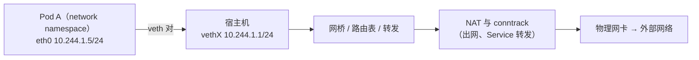

---
tags:
  - Linux
  - 网络
  - 容器
  - Kubernetes
  - namespace
  - veth
created: 2026-09-18
---

# 容器与 Kubernetes 视角的网络衔接

> [!cite] 参考资料
> `man 8 ip-netns`、`man 8 ip-link`（`veth`、`bridge`）、`man 8 nsenter`、`man 8 ss`、`man 8 conntrack`、`man 8 nft`、`man 8 iptables`、`man 8 ip-route`、`man 5 resolv.conf`，内核文档 `Documentation/networking/veth.rst`、`Documentation/networking/bridge.rst`，以及 Kubernetes 官方文档的网络模型、Service 与 NetworkPolicy 章节。
>
> 本篇是**概念与观测命令**篇：不做需要权限的破坏性实验，所有命令在宿主机上以 root 执行为可读操作。**文中未在真实 Kubernetes 集群上实测**（本机为单机 WSL2 环境），涉及具体 CNI 实现（Calico/Cilium/Flannel）的规则细节请以该实现的官方文档为准。

> **这篇讲什么**：宿主机上学到的每一件网络排障本事，在容器场景里都继续有效——**只是要先弄清「你在谁的命名空间里」**。这一篇把 namespace、veth、网桥、Service 转发与 NetworkPolicy 的宿主侧入口串起来，作为本章与容器/Kubernetes 主题的衔接。
>
> **必须先读什么**：[[Linux/06_网络协议栈与排障/02_前置_地址子网与路由|02 前置：地址、子网与路由]]（命名空间与 veth 的概念）、[[Linux/06_网络协议栈与排障/09_第6站_出门之后_转发NAT与conntrack|09 第 6 站：出门之后]]（转发与 conntrack）。
>
> **读完能回答**：① 为什么容器里有自己的 `ss`/`ip route`/`resolv.conf`？② 怎么从宿主机进到容器的网络命名空间取证？③ Service 转发为什么依赖 conntrack？④ NetworkPolicy 的排障入口在哪一层？
>
> 所属：[[Linux/06_网络协议栈与排障/00_导读与知识地图|06 网络协议栈与排障]] 的**进阶篇** · 主要练 **N4 分层排障** 与 **N7 抓包取证**（在容器场景中的复用）

## 0. 30 秒速览

> [!abstract] 这一篇只要记住六句话
> - **Pod 网络 = 一个网络命名空间 + 一对 veth + 宿主机上的路由/网桥**。理解了这三件东西，容器网络就不神秘了。
> - **每个命名空间是一套独立网络栈**：独立的接口、路由表、邻居表、socket、conntrack、`resolv.conf`。**宿主机能通 ≠ 容器能通。**
> - **取证要「进对命名空间」**：`nsenter -t <pid> -n ss -lntp`（PID 是容器内进程在宿主机的 PID），或用运行时的 `exec` 进容器。
> - **在宿主机抓包能看到 Pod 的流量**（从 veth 宿主侧或网桥侧），在 Pod 里抓则是容器视角——**两侧对照做二分**的套路完全一样。
> - **Service 转发**多数实现由 `iptables`/`nftables` 或 IPVS 完成，**依赖 conntrack**：集群规模一大，`nf_conntrack_max` 与超时必须纳入基线。
> - **NetworkPolicy 的排障入口在宿主机的规则链与 CNI 组件日志里**，不在应用侧；同时别忘了容器里的 `resolv.conf` 通常带 `ndots:5`（子笔记 04）。

## 1. 前置：容器网络的三个积木

| 积木 | 是什么 | 在本章的对应位置 |
| --- | --- | --- |
| **network namespace** | 一套独立的网络栈（接口、路由、邻居、socket、conntrack、sysctl） | 子笔记 02、03 |
| **veth pair** | 一对「虚拟网线」，一端发、另一端收 | 子笔记 02、13 |
| **网桥 / 路由 / NAT** | 把 veth 的流量接到宿主机的转发路径上 | 子笔记 08、09 |



**关键认识**：Pod 里的 `eth0` 不是物理网卡，它的对端是宿主机的 `vethX`。所以：

- **在宿主机上能看到 Pod 的流量**（veth 宿主侧、网桥侧），也能对它抓包；
- **在 Pod 里看到的接口名是 `eth0`，在宿主机上看到的是 `vethXXXX`**——名字对不上是正常的；
- **删掉命名空间，veth 对会一起消失**。

```bash
ip netns list                       # 验证：本机网络命名空间（容器运行时常用 /var/run/netns 或通过 PID 进入）
ip link | grep -A1 veth             # 验证：宿主机上的 veth（容器网络的一半）
ip -d link show type veth           # 验证：veth 的详细信息（含 peer 接口索引）
bridge link show                    # 验证：网桥与它的成员口
```

## 2. 进入容器的网络视角

```bash
ip netns list                           # 验证：命名空间清单（未必包含容器运行时创建的）
nsenter -t <pid> -n ip -br addr         # 验证：进入容器的网络命名空间看地址
nsenter -t <pid> -n ip route            # 验证：容器内的路由表（含默认路由指向谁）
nsenter -t <pid> -n ss -lntp            # 验证：容器里到底监听了哪些端口、队列多长
nsenter -t <pid> -n cat /etc/resolv.conf   # 验证：容器内实际的解析配置（含 search/ndots）
```

三个使用要点：

1. **`<pid>` 是「容器内某个进程在宿主机上的 PID」**，不是容器 ID。取法：`docker inspect -f '{{.State.Pid}}' <容器>`、`crictl inspect <id>`，或从 `ps -ef` 里找容器进程。
2. **`nsenter` 只切你要切的那一项**：`-n` 是网络，`-m` 是挂载，`-p` 是 PID。**排查网络时用 `-n` 就够了**，不要混用造成误判。
3. **`ip netns list` 不一定列出容器**：有些运行时不把命名空间挂到 `/var/run/netns`，所以「列表里没有」不代表没有容器网络。

> [!tip] 容器里连不上时的最小取证集
> ① 容器内：`ip -br addr`、`ip route`、`ss -lntp`、`cat /etc/resolv.conf`；
> ② 宿主机：`ip link | grep -A1 veth`、`ip route get <pod_ip>`、`sysctl net.ipv4.ip_forward`、`nf_conntrack_count/max`；
> ③ 必要时两侧同时限流抓包（子笔记 10）。
> **这三步能回答 80% 的「Pod 里连不上」。**

## 3. Service 转发与 conntrack

在多数集群里，访问 `Service` 的虚拟 IP 会被**节点上的规则**改写为某个 Pod 的真实 IP（DNAT），回程再被还原。这套机制**完全依赖 conntrack**：

| 环节 | 依赖什么 | 出问题时看哪里 |
| --- | --- | --- |
| Service → Pod 的 DNAT | `iptables`/`nftables` 或 IPVS 规则 + conntrack | 宿主机的规则链（`nft list ruleset` / `iptables -t nat -S`）、CNI/kube-proxy 日志 |
| 出集群的 SNAT/MASQUERADE | `POSTROUTING` + conntrack | 宿主机 `nf_conntrack_count/max`、`dmesg` 的 `table full` |
| 同一节点内的 Pod 互访 | 网桥 / 路由 / 转发 | `ip route get <pod_ip>`、`sysctl net.ipv4.ip_forward` |

```bash
sysctl net.netfilter.nf_conntrack_max net.netfilter.nf_conntrack_count
                                        # 验证：连接跟踪表的容量与当前用量（集群规模大时必看）
dmesg -T | grep -i conntrack            # 验证：有没有 "nf_conntrack: table full, dropping packet"
ip route get <pod_ip>                   # 验证：到 Pod 的路由是谁在管（CNI 还是主机）
nft list ruleset | head -40             # 验证：当前规则集（kube-proxy/CNI 会写入大量规则）
```

> [!warning] 集群越大，conntrack 越容易成为瓶颈
> 每个 Service 访问、每个出站连接、每个 NAT 会话都占表项，而默认 `nf_conntrack_tcp_timeout_established` 可能是 **5 天**（实测 432000 秒）。**表满时同样是静默丢包**（子笔记 09），表现为「偶发连不上、应用无日志」。
> 规模型集群必须把 conntrack 容量与超时纳入基线，并在设计上尽量用长连接与合理的超时。

## 4. NetworkPolicy 与 DNS

**NetworkPolicy 的排障入口**在宿主机的规则链与 CNI 组件里：

```bash
nft list ruleset | grep -iE 'policy|deny|drop' | head -20    # 验证：规则链里的策略痕迹（实现相关）
journalctl -u <cni-组件> -n 100                              # 验证：CNI 组件的日志（实现相关的服务名）
```

两个容易被忽略的点：

- **「能 ping 通」不代表策略放行**：很多策略只对特定协议/端口生效，ICMP 与 TCP 是分开的（子笔记 01 的分层思维在这里同样适用）。
- **策略排查要看方向与选择器**：是入向还是出向、作用于哪些标签的 Pod、放行的是哪个端口；**不要只凭「我加了一条规则」就认为已生效**。

**DNS** 方面，Pod 的 `resolv.conf` 通常带 `search <ns>.svc.cluster.local ...` 与 `ndots:5`，单次解析可能产生 4~5 次查询（子笔记 04）。验证方式：

```bash
nsenter -t <pid> -n cat /etc/resolv.conf   # 验证：容器内的 search 域与 ndots
nsenter -t <pid> -n getent hosts <name>    # 验证：容器视角的解析结果（注意容器里可能没有 getent，用 nslookup 替代）
```

> [!tip] 容器里的名字解析失败，先分清三件事
> ① **配置**：`resolv.conf` 的 `nameserver`/`search`/`ndots` 是否正确；② **网络**：DNS 服务的 ClusterIP 是否可达（`nc -vz <dns_ip> 53`）；③ **策略**：NetworkPolicy 是否放行了到 DNS 的流量。**三者混在一起查，最容易得出「DNS 坏了」的模糊结论。**

## 5. 生产动作：一次「Pod 连不上」的取证清单

按顺序做，**每一条都要留下输出**：

1. **容器视角**：`nsenter -t <pid> -n ip -br addr`、`ip route`、`ss -lntp`。
2. **名字解析**：`cat /etc/resolv.conf`、在容器内实测一次解析。
3. **宿主机转发**：`sysctl net.ipv4.ip_forward`、`ip route get <pod_ip>`。
4. **conntrack**：`count/max` 比值、`dmesg` 的 `table full`。
5. **规则**：`nft list ruleset`（或 `iptables -S`），确认 Service/NetworkPolicy 的规则是否存在。
6. **两侧抓包**：宿主机 veth 侧与容器内对照（限流限时，子笔记 10）。
7. **结论**：写明「容器内配置 / 宿主机转发与 NAT / 集群规则 / 外部网络」中的哪一段 + 证据。

```bash
nsenter -t <pid> -n ip -br addr
nsenter -t <pid> -n ss -lntp
nsenter -t <pid> -n cat /etc/resolv.conf
ip route get <pod_ip>
sysctl net.netfilter.nf_conntrack_count net.netfilter.nf_conntrack_max
```

## 常见坑

| 常见做法或说法 | 后果或事实 |
| --- | --- |
| 用宿主机的 `ss` 看容器的监听端口 | 命名空间不同，看不到；要 `nsenter -t <pid> -n ss -lntp` |
| 认为「宿主机能解析，容器就能解析」 | 容器有独立的 `resolv.conf` 与 `nsswitch.conf`，含 `ndots:5` |
| 在宿主机抓包却抓不到 Pod 流量 | 抓错接口或方向；Pod 流量走 veth/网桥，注意选取正确的接口与命名空间 |
| 把 `ip netns list` 当成容器清单 | 有些运行时不把命名空间挂在 `/var/run/netns` |
| 只看应用日志排查 Pod 连不上 | 转发、NAT、conntrack、NetworkPolicy 都在应用之外 |
| 认为「ping 通」说明策略放行 | ICMP 与 TCP 是分开的；策略可能只对特定协议/端口生效 |
| 忽略 conntrack 容量 | 集群规模大时它是常见瓶颈，且表满是**静默丢包** |
| 直接把 `nf_conntrack_max` 调到极大 | 内存开销上升，且治标不治本；要靠连接复用与合理超时 |

## 要点自测

> [!question]- Pod 网络由哪三部分构成？这解释了哪些现象？
> - **network namespace + 一对 veth + 宿主机的路由/网桥/NAT**。
> - 解释的现象：为什么在宿主机能看到 Pod 流量；为什么「容器里的 `eth0`」在宿主机上叫 `vethXXXX`；为什么删掉容器后接口自动消失；为什么 Pod 出网要经过 SNAT 与 conntrack。
> - **第一反应不要是什么**：不要把 Pod 网络当成「另一套完全无关的机制」，它用的就是本章的命名空间、veth、路由与转发。

> [!question]- 在宿主机上如何排查「容器里的服务连不上」？
> - **进对命名空间**：`nsenter -t <pid> -n ...` 看容器内的地址、路由、监听端口与 `resolv.conf`。
> - **看宿主机**：`ip route get <pod_ip>`、`net.ipv4.ip_forward`、conntrack 用量与 `dmesg`。
> - **看规则**：`nft list ruleset`/`iptables -S`，确认 Service 与 NetworkPolicy 的规则。
> - **必要时抓包**：宿主机 veth 侧与容器内两侧对照。
> - **第一反应不要是什么**：不要在只看了应用日志后就断定「是网络问题」。

> [!question]- 为什么 Service 转发依赖 conntrack？规模大时要注意什么？
> - Service 通过 DNAT 把虚拟 IP 改写为某个 Pod 的真实 IP，**回程必须靠 conntrack 还原**；出集群还要 SNAT。
> - 集群规模大时，连接数与会话数随之上升，`nf_conntrack_max` 与 `tcp_timeout_established` 都需要按容量规划；**表满是静默丢包**。
> - 缓解手段：连接池与长连接、合理的超时、按容量调整表大小，并纳入监控与基线。
> - **第一反应不要是什么**：不要把 conntrack 当成「可以关掉的负担」——转发与 NAT 都依赖它。

> 上一篇：[[Linux/06_网络协议栈与排障/13_动手实验与要点自测|13 动手实验与要点自测]]
