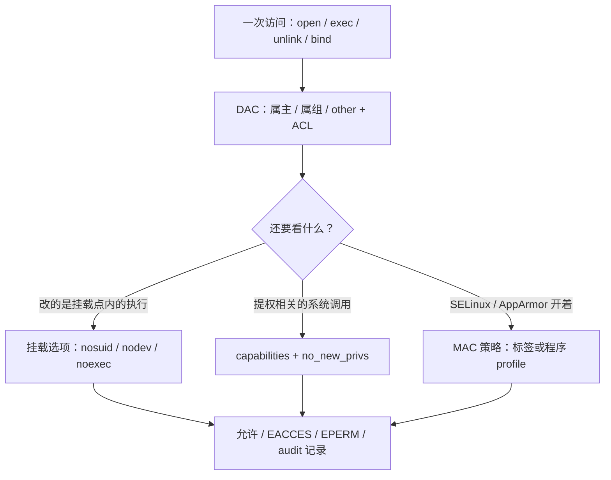
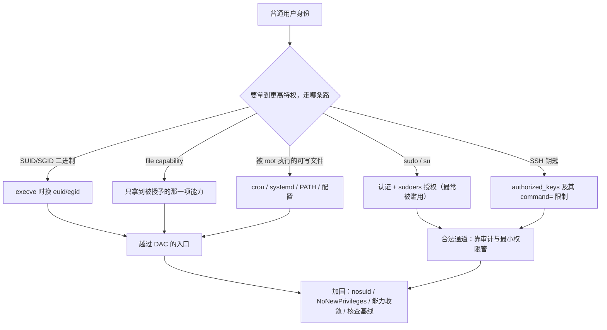
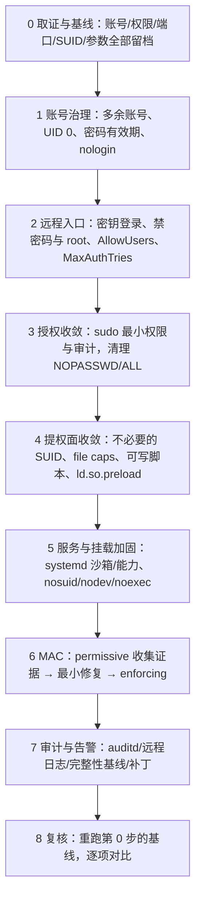

---
tags:
  - Linux
  - 权限
  - 账号安全
  - 安全加固
  - 运维面试
created: 2026-09-17
---

# 权限、账号与安全加固

> 本笔记对应 [[Linux/00_简介|Linux 大纲]] 的「阶段 7：权限、账号与安全加固」。目标：把「谁能对什么做什么」讲成一条完整的判定链——DAC 权限位与 ACL → 特殊位与 capabilities → 账号与认证（PAM / sudo / SSH）→ 强制访问控制（SELinux / AppArmor）→ 审计与核查——并能用一套固定命令把「异常提权面」找出来。
>
> 关联复习：[[01_实验环境与操作纪律]]（变更前三件事、取证纪律、发行版差异四件套）、[[03_进程与信号]]（`ulimit` / `limits.conf` / systemd 三层限制，容器里的 PID 1 与 capability）、[[05_存储与文件系统]]（`nosuid` / `noexec` 挂载选项、`chattr`、inode 与属主）、[[06_网络协议栈与排障]]（防火墙、conntrack、SSH 登录慢）、[[08_systemd与服务管理]]（unit 的沙箱与能力选项、timer 是一类持久化点）、[[09_日志与监控]]（审计日志的落点与轮转）、[[11_生产运维与高可用]]（补丁窗口、证书与密钥生命周期）、[[12_复习与自测]]（场景题：机器疑似被入侵的处置），以及 [[Kubernetes/03_调度_资源_QoS|Kubernetes 资源与 QoS]]（容器里 `--cap-drop all` 与宿主机视角）。
>
> 说明：结论以 man 页（`credentials(7)`、`capabilities(7)`、`execve(2)`、`passwd(5)`、`shadow(5)`、`chage(1)`、`sudoers(5)`、`faillock.conf(5)`、`login.defs(5)`、`acl(5)`、`sshd_config(5)`）与发行版官方文档为准。**本文的数字默认来自 Ubuntu 24.04.4 LTS / 内核 `6.6.87.2-microsoft-standard-WSL2` 的实测**，换发行版或内核要重新取一遍；RHEL 系的差异单列并标注「未在本机实测」。

> [!info] 读之前：这篇笔记假设你已经具备三件事
> 1. **一台能 root 的实验机**（虚拟机最好，能快照；WSL2 只能做本文的一部分实验）。本文涉及改 `sshd_config`、`sudoers`、PAM、`chattr`、SELinux 的部分都需要 root 与快照，**不要在生产机上第一次动手**。
> 2. **读过阶段 3 的资源限制与阶段 5 的挂载选项**：`/etc/security/limits.conf` 与 systemd 的 `LimitNOFILE` 是两套东西（[[03_进程与信号]]），`nosuid`/`noexec` 是挂载层的能力（[[05_存储与文件系统]]）。
> 3. **知道本文的「实测」与「未实测」是分开标的**：WSL2 上没有 SELinux、auditd、sshd 服务端、firewalld/nftables，也没有两个真实用户，所以 MAC、审计、防火墙、双用户 sticky 语义这些小节的输出**不是实测**，文末「验证进度」逐项列了。

> [!tip] 怎么用这篇笔记：分三遍读
> 全篇按难度分了两层：标 **【核心】** 的属于阶段 7 必须掌握；标 **【进阶】** 的只需知道有这条路，用到时再回来查。
> - **第一遍（约半天，先把「谁能做什么」讲清楚）**：第 0 节 → 1.1 权限模型 → 1.2 特殊位与提权面 → 1.3 capabilities → 3.1 权限拒绝 → 实验 1、2、3。这一遍结束应该能回答「文件 755 与目录 755 差在哪」「SUID 为什么危险」「80 端口有哪几种做法」。
> - **第二遍（约一天，把账号与远程入口补齐）**：1.4 ACL → 1.5 账号与 PAM → 1.6 sudo → 1.7 SSH 加固 → 2.x 加固顺序 → 3.3、3.4、3.5 → 实验 4～7。
> - **第三遍（加固与应急）**：1.8 MAC → 1.9 防火墙与内核参数 → 1.10 审计与核查 → 3.2、3.6、3.7 → 在实验机上按 2.2 的顺序做一遍基线加固，并按 3.6 演练一次「疑似被入侵」的取证。
> 面试前只看第 0 节与第 5 节的问答卡。只会 `chmod`/`chown` 的人在「权限与安全」这一阶段拿不到分，**能说清提权面清单与核查命令**才是区分度。

## 0. 30 秒速览

> [!abstract] 这一页只要记住六句话
> 首学读不懂很正常：先跳过这一节，读完第 1、3 节再回来逐条验证——每一条都是「结论 + 一句可复现的证据」。
> - **`rwx` 对文件和目录是两套语义**：文件的 `x` 是「可执行」，目录的 `x` 是「能穿过（`cd`、访问里面的文件）」、`r` 才是「能列出名字」。实测目录 `chmod 400` 时 `ls` 成功而 `cat`/`cd` 报 `Permission denied`；`chmod 100` 时 `ls` 失败、但只要知道文件名仍能 `cat` 成功——**目录权限是「路径上的每一级」都要满足**。
> - **SUID 是提权面之首，但它只对二进制生效**：内核在 `execve()` 时把 `euid` 换成文件属主；`execve(2)` 明确写了「Linux（以及多数现代 UNIX）忽略脚本上的 set-user-ID/set-group-ID 位」，且 `no_new_privs`、`nosuid` 挂载、被 `ptrace` 时一律忽略。实测本机 SUID 文件 14 个、SGID 7 个，`find -perm -4000`（包含）/`-perm 4000`（精确）/`-perm /6000`（任一）三种写法结果不同（见 1.2）。
> - **capabilities 是 SUID 的现代替代**：实测 `/usr/bin/ping cap_net_raw=ep`；非 root 直接 `bind(80)` 得到 `PermissionError [Errno 13]`（`net.ipv4.ip_unprivileged_port_start=1024`）；而发行版自带的 `systemd-resolved.service` 用的是 `AmbientCapabilities=CAP_NET_BIND_SERVICE` 而不是给二进制加 SUID——**能 `setcap` 就不 SUID，能在 systemd 里限定就不给整个 root**。
> - **账号的默认值几乎都是「不过期」**：实测 `/etc/login.defs` 的 `PASS_MAX_DAYS=99999`、`PASS_WARN_AGE=7`，Ubuntu 的 root 密码字段被锁成 `!*`（`getent shadow root` 实测），`/etc/shadow` 是 `640 root:shadow`、非 root 读被拒。**基线加固必须主动收紧密码有效期与失败锁定，不能指望默认值**。
> - **sudo 与 SSH 是两条最常被走的「合法通道」，也是最该留痕的地方**：实测 `sudo` 认证失败会写进 journald/`auth.log`，含 `TTY=`、`PWD=`、`USER=`、`COMMAND=`；`sudo 1.9.14+` 起 `use_pty` 默认打开（本机 `sudo -V` 为 1.9.15p5）。SSH 侧用 `sshd -T` 看生效配置、`sshd -T -C user=...,addr=...` 看 `Match` 对某个人/某个网段的最终结果（实测矩阵见 1.7），**不要只看配置文件里写没写**。
> - **加固的验收标准是「可核查」，不是「感觉关掉了」**：定期跑五类核查——多余账号、SUID/SGID/file capabilities、监听端口、定时任务与自启、SSH 授权文件；MAC 报错走「`ausearch` → `audit2allow`/`semanage` → `restorecon` → `setsebool`」四步。**`setenforce 0` 只是把证据关掉，不是修复**。

## 1. 概念

> [!info]- 名词速查（读到哪里卡住，就回这里查）
> | 名词 | 一句话解释 | 在哪一节展开 |
> | --- | --- | --- |
> | DAC / MAC | 自主访问控制（属主自己决定权限位）/ 强制访问控制（策略决定，属主也绕不过） | 1.1、1.8 |
> | `umask` | 新建文件/目录时「按位减掉」的权限掩码，`022` → 文件 644、目录 755 | 1.1 |
> | SUID / SGID / Sticky | 执行时换 `euid` / 换 `egid`、目录内继承属组 / 目录内只有属主能删 | 1.2 |
> | capabilities | 把 root 的特权拆成 40 项（`cap_last_cap=40` 实测），按项授予 | 1.3 |
> | `AmbientCapabilities` | systemd 让**非 root 用户**运行的服务跨 `execve` 保留指定的 capability | 1.3 |
> | ACL | 在属主/属组/other 之外，按「某个用户/某个组」授权；`ls -l` 上的 `+` | 1.4 |
> | `mask`（ACL） | named user/group 与 owning group 的**有效权限上限**，会显示在 `ls -l` 的属组位上 | 1.4 |
> | `chattr +i` / `+a` | 文件不可修改/只能追加（ext4 等），需要 `CAP_LINUX_IMMUTABLE` | 1.4 |
> | PAM | 认证的模块化框架：`auth`/`account`/`password`/`session` 四类栈 | 1.5 |
> | `pam_faillock` | 连续失败锁定；`deny=3`、`unlock_time=600`（`faillock.conf(5)` 默认） | 1.5 |
> | sudoers | `User Host=(Runas) NOPASSWD: Cmds` 的授权语法；文件必须 `0440` | 1.6 |
> | `use_pty` | 让 sudo 的命令跑在独立伪终端里，防终端注入；sudo 1.9.14+ 默认开 | 1.6 |
> | `sshd -T` / `sshd -t` | 打印**生效配置** / 只做语法检查 | 1.7 |
> | `authorized_keys` 选项 | `command=`、`from=`、`restrict`、`no-port-forwarding` 等按钥匙限权 | 1.7 |
> | SELinux 上下文 | `user:role:type:level`，安全标签随 inode 走，不随路径走 | 1.8 |
> | AppArmor | 以**程序路径**为中心的策略（Ubuntu 默认），与 SELinux 的模型不同 | 1.8 |
> | `auditd` | 内核审计事件的用户态收集者；规则用 `-w`/`-a` 写，`ausearch` 查 | 1.10 |
> | 持久化点 | 攻击者用来「下次还进得来」的位置：cron/timer、systemd unit、`authorized_keys`、服务配置 | 1.2、1.10 |
> | `dpkg -V` / `rpm -Va` | 用包数据库校验文件是否被改（Debian 系 / RHEL 系） | 1.10 |



这张图是整篇的骨架：**权限问题永远先问「卡在哪一层」**——DAC 位、挂载选项、capabilities、MAC，四层的报错长得很像，处置完全不同。

### 1.1 权限模型：`rwx` 对文件与目录是两套语义【核心】

#### 文件与目录的 `rwx`

| 位 | 对文件 | 对目录 |
| --- | --- | --- |
| `r` | 读取内容（`cat`、`read()`） | 列出名字（`ls`，需要能读目录项） |
| `w` | 修改内容（`write()`、`truncate`） | 新建/删除/改名目录内的条目（**删文件看的是目录的 `w`，不是文件的 `w`**） |
| `x` | 作为程序执行（还需要 `#!` 解释器或可执行格式） | 穿过目录（`cd`、打开 `dir/file` 的路径解析） |

> [!important] 「删一个只读文件」到底需要什么权限？
> 需要**它所在目录**的 `w` + `x`，与文件本身的 `w` 无关；只有目录带 sticky 位（`1777`）时，才额外要求「你是文件属主、目录属主或 root」。这就是 `/tmp` 用 `1777` 的原因，也是「权限位看着没问题，却删不掉/被删了」的头号误解来源。

实测（非 root，`/tmp` 下的临时目录）：

```text
# ① 目录 chmod 400（r--，能列目录但不能穿过）
$ chmod 400 dr400
$ ls dr400                 # 验证：只看目录项，需要目录的 r
secret
$ cat dr400/secret         # 验证：路径解析需要目录的 x
cat: dr400/secret: Permission denied
$ cd dr400
bash: cd: dr400: Permission denied

# ② 目录 chmod 100（--x，不能列目录但能穿过）
$ chmod 100 dr400
$ ls dr400
ls: cannot open directory 'dr400': Permission denied
$ cat dr400/secret         # 验证：知道文件名就能打开；本次文件为空，所以无输出且退出码 0
$ cd dr400 && pwd
/tmp/sec-lab.AkGIlx/dr400
```

两段输出的差别就是「目录的 `r` 与 `x` 各管什么」的全部证据。排障时它对应一个高频现象：**服务报 `Permission denied`，但最后一级文件的权限是对的——问题出在路径上某一级目录少了 `x`**（`namei -l /path/to/file` 能一次列出每一级的权限，见 3.1）。

#### `umask`：新建对象的默认权限从哪来

新建文件的基础权限是 `0666`、目录是 `0777`，再按位减掉 `umask`：

| `umask` | 新建文件 | 新建目录 | 典型用途 |
| --- | --- | --- | --- |
| `022` | `644` | `755` | 默认值（实测本机 `umask` = `0022`，`/etc/login.defs` 的 `UMASK` = `022`） |
| `027` | `640` | `750` | 同组可读、其他人无权限 |
| `077` | `600` | `700` | 私钥、配置等只给自己 |

实测（同一次会话里切换 `umask` 后新建对象）：

```text
$ umask 022; : > f022; mkdir d022
$ umask 027; : > f027; mkdir d027
$ umask 077; : > f077; mkdir d077
$ stat -c "%a %n" f022 d022 f027 d027 f077 d077
644 f022
755 d022
640 f027
750 d027
600 f077
700 d077
```

`umask` 最容易踩的坑是「改错了地方」——它有三个落点，分别管三类进程：

- **登录会话**：PAM 的 `pam_umask` 读 `/etc/login.defs` 的 `UMASK`（本机实测 `common-session` 与 `common-session-noninteractive` 里有 `session optional pam_umask.so`），登录 shell 启动脚本里的 `umask` 会覆盖它。
- **systemd 服务**：unit 的 `UMask=`，以及 PID 1 的 `DefaultUMask`；**改 `/etc/login.defs` 对已运行的服务没有影响**。
- **单个进程**：进程自己 `umask()` 设置，或用 `install -m` / `open(..., mode)` 显式指定，不再依赖默认值。

> [!warning] `chmod -R 777` 不是「解决权限问题」
> 它同时做三件事：给所有用户写权限、给所有用户执行权限、破坏 SELinux 上下文之外的 ACL 语义（`chmod` 会重置 ACL mask）。在 Web 根目录上这么做的直接后果是「任何人上传一个脚本就能执行」。正确顺序永远是：先看**谁需要什么权限**（`id`、`namei -l`、`getfacl`），再用最小改动满足它。

### 1.2 特殊权限位与提权面：SUID / SGID / Sticky【核心】

三个特殊位在 `ls -l` 的显示与数值：

```text
$ stat -c "%A %a %n" f d sticky
-rwsr-xr-x 4755 f          # SUID：执行时 euid 变成文件属主
drwxr-sr-x 2755 d          # SGID：执行时 egid 变成文件属组；对目录则是「新建文件继承目录属组」
drwxrwxrwt 1777 sticky     # Sticky：目录内只有文件属主/目录属主/root 能删除或改名
```

**SUID 的提权机制**：`execve()` 在加载程序时检查文件模式位，若置了 set-user-ID，就把进程的 `euid` 换成文件属主（通常是 root），于是程序虽由普通用户启动，却带着 root 的特权运行。`passwd`、`sudo`、`mount` 这些命令正是靠它工作。

但有三类情况会让它失效，这正是加固时要利用的杠杆——`execve(2)` 的原文是：

```text
# man 2 execve（本机实测原文）
The aforementioned transformations of the effective IDs are not performed
(i.e., the set-user-ID and set-group-ID bits are ignored) if any of the
following is true:
  • the no_new_privs attribute is set for the calling thread;
  • the underlying filesystem is mounted nosuid;
  • the calling process is being ptraced.

# 以及 Interpreter scripts 一节：
Linux (like most other modern UNIX systems) ignores the set-user-ID and
set-group-ID bits on scripts.
```

所以：**给自写脚本加 SUID 是无效动作**（内核直接忽略，脚本不会以 root 身份运行）；systemd 的 `NoNewPrivileges=yes`、容器安全选项 `no-new-privileges`、挂载 `/tmp` 时的 `nosuid`，都是让 SUID/file capabilities 失效的手段。

**SGID 的两种用途**：对可执行文件是「执行时把 `egid` 换成文件属组」；对目录是「目录里新建的文件/子目录自动继承该目录的属组」，团队共享目录常用它（配合 `2775` + 组）而不是把目录开成 `777`。

**Sticky 位**：只对目录有意义，`1777` 表示「所有人都能写，但只能删自己的文件」。`/tmp`、`/var/tmp`、`/dev/shm` 实测都是 `drwxrwxrwt 1777`。

#### 用 `find -perm` 核查异常 SUID/SGID

`find -perm` 有三种写法，差一个字符语义就不同，实测（同一个 `mode=4755` 的文件）：

```text
$ find . -maxdepth 1 -type f -perm -4000   # 「所有位都包含」：匹配 SUID 位已置的文件
./suidfile
$ find . -maxdepth 1 -type f -perm 4000    # 「精确等于 4000」：4755 的额外权限位使它不匹配
(空)
$ find . -maxdepth 1 -type f -perm /6000   # 「任一位匹配」：SUID 或 SGID 均命中
./suidfile
```

核查时用「包含」写法，别用精确写法（否则 4755 的 `su`、`sudo` 会被漏掉）：

```text
# ① 系统盘上的 SUID / SGID 文件（-xdev 避免跨挂载点扫到网络盘、/mnt）
$ find / -xdev -type f -perm -4000 2>/dev/null | sort
/usr/bin/chfn
/usr/bin/chsh
/usr/bin/fusermount3
/usr/bin/gpasswd
/usr/bin/mount
/usr/bin/newgrp
/usr/bin/passwd
/usr/bin/su
/usr/bin/sudo
/usr/bin/umount
/usr/lib/dbus-1.0/dbus-daemon-launch-helper
/usr/lib/landscape/apt-update
/usr/lib/openssh/ssh-keysign
/usr/lib/polkit-1/polkit-agent-helper-1

$ find / -xdev -type f -perm -4000 2>/dev/null | wc -l
14
$ find / -xdev -type f -perm -2000 2>/dev/null | wc -l
7

# ② 其他人可写的文件/目录（换句话说是「谁都能改」的落点）
$ find /etc /usr /var /opt /srv -xdev -type f -perm -0002 2>/dev/null | wc -l
0
$ find /etc /usr /var /opt /srv -xdev -type d -perm -0002 2>/dev/null
/var/crash
/var/tmp

# ③ 无主/无属组文件（删了账号但文件还在，常是入侵或误操作的痕迹）
$ find / -xdev \( -nouser -o -nogroup \) 2>/dev/null | wc -l
0
```

> [!important] SUID 清单必须两件事一起做：**比对基线** + **看文件本身是否可信**
> `find` 只能告诉你「哪些文件有 SUID」。真正判断异常要再走两步：① 与上次留档的清单对比（多出来的是什么、谁装的、什么时间装的）；② 用包管理器反查属主（RHEL 系 `rpm -qf`、Debian 系 `dpkg -S`）——**不是发行版包、也没有变更记录**的 SUID 文件就是最高优先级的事件。**本机实测 14 个 SUID 文件全部来自发行版包（其中一个要走 usrmerge 的路径别名，见下）；新增/变更的 SUID 文件才是异常信号。**

> [!note] usrmerge 会让 `dpkg -S /usr/bin/xxx` 查不到
> 本机 `/bin -> usr/bin`（实测同一 inode），而包里登记的是 `/bin/fusermount3`；因此 `dpkg -S /usr/bin/fusermount3` 报「no path found」，但 `dpkg -S fusermount3` 能查到 `fuse3`。**按绝对路径反查为空时，先用 basename 再查一次**，别急着判定「不属于任何包」。

#### 提权面全景：不止 SUID 一处

「提权面」是所有能把普通身份换成更高特权的位置。只盯 SUID 会漏掉一半：

| 提权面 | 典型形态 | 核查方法 | 加固方向 |
| --- | --- | --- | --- |
| SUID/SGID 二进制 | `passwd`、`sudo`、自编译程序 | `find / -xdev -type f -perm -4000/-2000`；比对基线 | 删除不必要的；`nosuid` 挂载；`NoNewPrivileges=yes` |
| file capabilities | `/usr/bin/ping cap_net_raw=ep`（实测） | `getcap -r / 2>/dev/null` | 只授单项；能力记入变更记录 |
| `sudo` / `su` | sudoers 里的 `NOPASSWD`、`ALL`、`!requiretty` 等 | `sudo -l`（需要密码）、`visudo -c`（root）、审阅 `/etc/sudoers.d/` | 最小权限、按角色分组、开启 I/O 审计 |
| root 执行的**可写脚本/配置** | cron 脚本、systemd `ExecStart=`、被 root 调用的 PATH 程序 | `find / -xdev -type f -perm -0002`、检查 cron/unit 里的脚本路径与属主 | 脚本不可被非 root 写；用绝对路径；固定 PATH |
| 服务配置文件 | 能以 root 运行服务的配置（如 `ExecStart=` 指向的脚本、`sudo` 的 `Defaults` 文件） | `systemctl cat`、`dpkg -V` 校验 | 配置文件属主 root、权限收紧、变更留痕 |
| SSH 授权 | `~/.ssh/authorized_keys`、`authorized_keys` 中的 `command=` | `find /home /root -name authorized_keys`、`stat` | 关闭密码登录、按钥匙限权、定期轮换 |
| 动态链接器 | `/etc/ld.so.preload`（实测本机不存在）、`LD_PRELOAD` | `ls -l /etc/ld.so.preload`、检查服务环境变量 | 不存在就保持不存在；出现即视为事件 |
| 内核与设备 | `/dev/mem`、`kexec`、内核模块、eBPF | `ls -l /dev/mem`、`sysctl kernel.kexec_load_disabled`、`unprivileged_bpf_disabled` | 收权限、关 unprivileged bpf、限制模块加载 |
| 容器 | `--privileged`、挂载宿主目录、`--cap-add` | `docker inspect`、`--cap-drop all` 基线 | 去特权、只加必需能力、禁止挂宿主根目录 |
| 挂载选项 | 共享目录漏掉 `nosuid`/`noexec`/`nodev` | `findmnt -o TARGET,OPTIONS`、`mount` | 对 `/tmp`、`/dev/shm`、数据盘按需收紧 |



### 1.3 capabilities：把 root 拆成 40 项【核心】

传统模型的粗粒度是「要么 root、要么不是」。capabilities 把 root 的特权拆成离散项，进程/文件/服务各拿自己需要的那几项。本机实测：`kernel.cap_last_cap = 40`，即当前内核有 41 项（编号 0~40）；`capsh --print` 显示普通用户的 `Current: =`（有效集为空），而 bounding set 列全了 41 项。

五个集合的分工（面试常问「文件 capabilities 的 `=ep` 是什么」）：

| 集合 | 含义 | 常见检查 |
| --- | --- | --- |
| Permitted | 进程**允许持有**的能力上限 | `capsh --print` 的 `Current` |
| Effective | 当前**真正生效**的能力 | 同上；file caps 的 `e` |
| Inheritable | 跨 `execve` 可继承的能力 | 少用，容易踩坑 |
| Bounding | 能力上限，**一旦丢掉就不能再加回来** | `CapabilityBoundingSet=`（systemd）、容器 |
| Ambient | 非 root 进程跨 `execve` 保留的能力 | systemd `AmbientCapabilities=` |

`getcap`/`setcap` 的写法是「能力列表 + 集合字母」，实测：

```text
# ① 看系统里哪些文件有 capabilities
$ getcap -r /usr 2>/dev/null | sort
/usr/bin/ping cap_net_raw=ep
/usr/lib/snapd/snap-confine cap_chown,cap_dac_override,cap_dac_read_search,cap_fowner,cap_setgid,cap_setuid,cap_sys_chroot,cap_sys_ptrace,cap_sys_admin,cap_sys_resource=p
/usr/lib/x86_64-linux-gnu/gstreamer1.0/gstreamer-1.0/gst-ptp-helper cap_net_bind_service,cap_net_admin,cap_sys_nice=ep

# ② 0x400 就是 cap_net_bind_service（第 10 位）
$ capsh --decode=0x400
0x0000000000000400=cap_net_bind_service

# ③ 普通用户没有 CAP_SETFCAP，改不了文件能力
$ setcap cap_net_raw+ep ./pingcopy
unable to set CAP_SETFCAP effective capability: Operation not permitted
```

**80 端口四种做法**，对应四种安全边界（这是阶段 7 与阶段 8 的交汇点）：

| 做法 | 生效方式 | 安全边界 | 适用场景 |
| --- | --- | --- | --- |
| root 直接运行进程 | 天然有 `CAP_NET_BIND_SERVICE` | 整个进程都是 root，被攻破即 root | 不推荐 |
| `setcap cap_net_bind_service+ep <二进制>` | 文件能力，任何用户执行都带上该能力 | 只多这一项；但**二进制被替换/写坏就变成提权点** | 独立二进制、能保证文件属主与权限 |
| systemd `AmbientCapabilities=CAP_NET_BIND_SERVICE` | unit 里给非 root 服务保留能力 | 权限随 unit 走，可审计、可在 `systemctl show` 里核对 | 自研服务（推荐） |
| 反向代理 / socket 激活 | 用 443/8080 等高位端口，前面放 Nginx/HAProxy；或 `systemd` socket 激活 | 业务进程完全不需要特权端口 | 标准 Web 架构（首选） |

把端口降到「非特权端口」也是一条路，但它改的是**整机策略**：实测本机 `net.ipv4.ip_unprivileged_port_start=1024`，普通用户 `bind(80)` 得到 `PermissionError [Errno 13]`；把它设为 0 就等于允许任何用户绑任意端口，**不要为了一个服务改整机的这条线**。

systemd 的用法实测（发行版自带单元就是最好的样例）：

```text
$ systemctl cat systemd-resolved.service | grep -E "^(User|AmbientCapabilities|CapabilityBoundingSet|NoNewPrivileges|ProtectSystem|PrivateTmp|SystemCallFilter)="
User=systemd-resolve
CapabilityBoundingSet=CAP_SETPCAP CAP_NET_RAW CAP_NET_BIND_SERVICE
AmbientCapabilities=CAP_SETPCAP CAP_NET_RAW CAP_NET_BIND_SERVICE
NoNewPrivileges=yes
PrivateTmp=yes
ProtectSystem=strict
SystemCallFilter=@system-service

$ systemctl cat systemd-timesyncd.service | grep -E "^(User|CapabilityBoundingSet|AmbientCapabilities)="
User=systemd-timesync
CapabilityBoundingSet=CAP_SYS_TIME
AmbientCapabilities=CAP_SYS_TIME
```

对照一下：**同一个系统里，`cron.service` 的 `CapabilityBoundingSet` 是全集、`ProtectSystem=no`、`NoNewPrivileges=no`（实测）**——发行版自带单元并不都是加固样板；这也是「服务加固要逐个看 unit，而不是以为装了系统就安全了」的实例。

> [!important] `setcap` 不是万能钥匙，它和 SUID 受同一类限制
> `execve(2)` 明确：`no_new_privs`、`nosuid` 挂载、被 `ptrace` 时，**file capabilities 与 SUID 一样被忽略**。此外，脚本上的 file capabilities 同样无效（内核只认脚本的 `#!` 解释器，忽略脚本自身的特权位）。所以给脚本 `setcap` 是无效动作，要么把逻辑写成二进制，要么用 systemd 的能力/用户选项。

### 1.4 扩展能力：ACL、`chattr` 与扩展属性【核心 + 进阶】

#### ACL：属主/属组/other 之外的第四种授权

ACL 存在 inode 的扩展属性里（`system.posix_acl_access`），`setfacl`/`getfacl` 是它的操作入口。实测（先造一个「属主 rw、组 r、其他人无权限」的文件，再加两个 named 条目）：

```text
$ chmod 640 f
$ setfacl -m u:1001:r -m g:1002:w f
$ getfacl --omit-header f
user::rw-
user:1001:r--
group::r--
group:1002:-w-
mask::rw-
other::---

$ ls -l f
-rw-rw----+ 1 realtyz realtyz 0 ... f
#           ↑ 结尾的 + 就表示「这个 inode 带 ACL」
#             注意属组位显示的是 mask，不是 group:: 自己的权限
$ stat -c "%A %a" f
-rw-rw---- 660
```

**mask 是 ACL 的核心概念**：只要有 named user/group 或 `default` 条目，内核就用 mask 去「盖」named 条目和 owning group 的有效权限。把 mask 改成 0，权限立刻被削掉，`getfacl` 会把每一项标成 `#effective:---`：

```text
$ setfacl -m m::0 f
$ getfacl --omit-header f
user::rw-
user:1001:r--          #effective:---
group::r--             #effective:---
group:1002:-w-         #effective:---
mask::---
other::---
$ ls -l f
-rw-------+ 1 realtyz realtyz 0 ... f
```

**默认 ACL** 让目录成为「权限模板」，目录里新建的对象自动继承 `default:` 条目（实测目录 `d` 设 `default:user:1001:rwx` 后，`getfacl` 同时显示 access 与 default 两组）：

```text
$ setfacl -m d:u:1001:rwx,d:m::rwx,m::rwx d
$ getfacl --omit-header d
user::rwx
group::r-x
mask::rwx
other::r-x
default:user::rwx
default:user:1001:rwx
default:group::r-x
default:mask::rwx
default:other::r-x
```

三个必须记住的边界：

- **`chmod` 会重算 ACL mask**：`chmod g-w` 之后，named 条目的有效权限可能一起变小；改完 ACL 又改 `chmod`，要用 `getfacl` 复查。
- **`ls -l` 只给一个 `+`**：想知道到底给了谁、mask 多少，必须 `getfacl`。
- **备份要带上扩展属性**：`cp -a` 保留 ACL，`tar --acls` / `rsync -A` 才是完整备份；只 `cp -r` 会把 ACL 丢掉（`xattr`/SELinux 标签同理，见 2.4）。

#### `chattr`：文件系统层的「不可变」

`chattr +i` 让文件不能被修改、改名、删除（root 也不行，除非先去掉属性）；`+a` 只允许追加，适合日志。它需要 `CAP_LINUX_IMMUTABLE`，普通用户实测：

```text
$ chattr +i suidfile
chattr: Operation not permitted while setting flags on suidfile
$ lsattr /etc/passwd
--------------e------- /etc/passwd      # e = ext4 的 extent 标志，是正常值
$ lsattr /etc/shadow
lsattr: Permission denied While reading flags on /etc/shadow
```

`chattr +i` 的两个真实副作用：**`logrotate` 轮转失败**、**包管理器升级时写不进去**。所以它只适合放在「明确不会变、且变更流程里记得先解锁」的文件上（如备份盘的基线脚本、静态配置），不要给 `/var/log/*` 和 `/etc/**` 批量加。

### 1.5 账号体系：`passwd` / `shadow` / PAM【核心】

#### 三个文件与它们的字段

| 文件 | 内容 | 实测权限（Ubuntu 24.04） | 关键点 |
| --- | --- | --- | --- |
| `/etc/passwd` | 账号、UID/GID、GECOS、家目录、登录 shell | `644 root:root` | 密码字段是 `x`，真实哈希在 `shadow`；7 个字段 |
| `/etc/shadow` | 密码哈希与有效期 | `640 root:shadow` | 非 root 读被拒（实测 `Permission denied`） |
| `/etc/group` / `/etc/gshadow` | 组与组管理 | `644 root:root` / `640 root:shadow` | 附加组用 `usermod -aG`，不是 `-G` |

`/etc/passwd` 的 7 个字段：`name:passwd:UID:GID:GECOS:home:shell`（实测 `getent passwd 1000` → `realtyz:x:1000:1000:,,,:/home/realtyz:/bin/bash`）。

`/etc/shadow` 的 9 个字段，与 `chage -l` 的输出一一对应（实测 `passwd -S` 输出 `realtyz P 2025-07-26 0 99999 7 -1`）：

| 字段 | 含义 | 本机实测值 |
| --- | --- | --- |
| 1 | 用户名 | `realtyz` |
| 2 | 密码哈希（前缀决定算法） | 本机非 root 读不到（`Permission denied`）；`getent shadow root` 实测 `!*` = 已锁定；`passwd -S` 的第 2 列 `P` 表示「已设置可用密码」 |
| 3 | 最后一次修改密码的日期（自 1970-01-01 的天数） | `2025-07-26` |
| 4 | 最小间隔天数（`PASS_MIN_DAYS`） | `0` |
| 5 | 最大有效期天数（`PASS_MAX_DAYS`） | `99999`，**相当于永不过期** |
| 6 | 到期前提醒天数（`PASS_WARN_AGE`） | `7` |
| 7 | 到期后多少天禁用（`INACTIVE`） | `-1`，**永不禁用** |
| 8 | 账号过期日期（`EXPIRE`） | 空 = 永不过期 |
| 9 | 保留字段 | 空 |

> [!important] 「密码策略」改三处，不是一处
> `chage`/`useradd` 只改**这个账号**（或新建账号的默认值），`/etc/login.defs` 只是 `useradd` 等工具的默认来源，**不会回头改已有账号**；PAM 的 `pam_unix`/`pam_faillock`/`pam_pwquality` 决定**认证时的行为**。真正的基线要三层一起做：`login.defs` 定默认 → 对存量账号跑 `chage` → PAM 定「弱密码/连续失败怎么办」。

本机 `login.defs` 实测（这些默认值几乎都是「等于不设限」）：

```text
$ grep -E "^(UMASK|PASS_MAX_DAYS|PASS_MIN_DAYS|PASS_WARN_AGE|UID_MIN|UID_MAX|ENCRYPT_METHOD)" /etc/login.defs
UMASK		022
PASS_MAX_DAYS	99999
PASS_MIN_DAYS	0
PASS_WARN_AGE	7
UID_MIN			 1000
UID_MAX			60000
ENCRYPT_METHOD SHA512
```

#### 密码哈希与「谁在设密码」

哈希格式由**设密码的那条路径**决定，不能只看 `login.defs` 的 `ENCRYPT_METHOD`：

- 本机 `python3 -c "import crypt; print(crypt.crypt('test'))"` 实测输出 `$6$...`（SHA-512，`crypt(3)` 的默认）。
- 本机 `/etc/pam.d/common-password` 实测是 `password [success=1 default=ignore] pam_unix.so obscure yescrypt`——**通过 PAM 改密码（`passwd`）时优先用 yescrypt（`$y$`）**。
- `login.defs` 的 `ENCRYPT_METHOD` 主要影响 `useradd`/`chpasswd` 等工具。想要一个统一的结论，**看 `/etc/shadow` 里现有条目的前缀**（`$1$` MD5、`$5$` SHA-256、`$6$` SHA-512、`$y$` yescrypt），不要背默认值。

#### 账号清单：先确认「谁存在」

实测本机（Ubuntu 24.04，最小化安装痕迹很少）：

```text
$ wc -l < /etc/passwd
28
$ awk -F: "$3<1000" /etc/passwd | wc -l          # 系统账号
26
$ awk -F: "$7 ~ /(nologin|false)$/" /etc/passwd | wc -l   # 不能登录的系统账号
25
$ awk -F: "$3>=1000 && $3<65534 {print $1, $3, $7}" /etc/passwd
realtyz 1000 /bin/bash
$ awk -F: "$3==0 {print}" /etc/passwd              # UID 0 只能有 root 一个
root:x:0:0:root:/root:/bin/bash
$ getent shadow root
root:!*:::::::                                     # Ubuntu 默认锁定 root 密码
$ grep -E "^(passwd|group|shadow):" /etc/nsswitch.conf
passwd:         files systemd
group:          files systemd
shadow:         files systemd
```

核查时关注四种异常：**UID 0 的非 root 账号**、**UID/GID 落在系统区间却有人类名字**、**shell 是可登录 shell 但没人认得**、**`/etc/passwd` 与 `/etc/shadow` 条数对不上**（前者有后者无 = 可能被手工加过）。

`nsswitch.conf` 里的 `files systemd` 说明**当前只有本地账号**；接 LDAP/SSSD 后，`passwd`/`group` 行会变成 `files sss` 之类——那时「账号在不在」要问 `getent`，不能直接读 `/etc/passwd`。

#### PAM：认证的执行栈

PAM 的四类栈各管一段：`auth`（你是谁）、`account`（能不能现在登录）、`password`（改密码的规则）、`session`（登录后做什么）。本机 `common-auth` / `common-password` 实测内容：

```text
$ grep -vE "^[[:space:]]*(#|$)" /etc/pam.d/common-auth
auth	[success=1 default=ignore]	pam_unix.so nullok
auth	requisite			pam_deny.so
auth	required			pam_permit.so
auth	optional			pam_cap.so

$ grep -vE "^[[:space:]]*(#|$)" /etc/pam.d/common-password
password	[success=1 default=ignore]	pam_unix.so obscure yescrypt
password	requisite			pam_deny.so
password	required			pam_permit.so

$ grep -rl pam_umask /etc/pam.d
/etc/pam.d/common-session
/etc/pam.d/common-session-noninteractive
$ grep -rl "pam_faillock\|pam_pwquality" /etc/pam.d
（空：Ubuntu 24.04 默认没有启用失败锁定与密码质量检查）
```

对照 RHEL 9（**未在本机实测，以发行版文档为准**）：`/etc/pam.d/` 走 `authselect` 的 `system-auth`/`password-auth` 链，默认 profile 带 `with-faillock`，即失败锁定是开箱即用的；Debian/Ubuntu 要自己装 `libpam-pwquality` 并把模块加进 `common-password`。这也是「同一件事在 RHEL 与 Ubuntu 上入口不同」的典型例子。

失败锁定的参数与默认值（`faillock.conf(5)` 实测原文）：`deny=3`（连续失败超过 3 次）、`fail_interval=900`（15 分钟窗口）、`unlock_time=600`（锁定 10 分钟）。本机 `/etc/security/faillock.conf` 存在且 `644 root:root`，但**没有任何生效配置、也没有被 `pam.d` 引用**——即「文件在、策略没开」。

> [!warning] `usermod -L` / `passwd -l` 不等于「停用账号」
> 它们只是把密码哈希前加 `!`，锁的是**密码认证这一条路**：已经部署的 SSH 公钥、`sudo` 的 `NOPASSWD`、其他 PAM 来源仍可能登录。要真正停用：`usermod -e 1`（或 `chage -E 0`）让账号过期，再清理 `authorized_keys` 与 `sudoers`，必要时把 shell 改成 `/usr/sbin/nologin` 并确认没有长期会话（`who`/`w`/`loginctl`）。

### 1.6 `su` 与 `sudo`：合法通道的最小权限与留痕【核心】

`su` 和 `sudo` 的区别不只是「要不要 root 密码」：

| 维度 | `su` | `sudo` |
| --- | --- | --- |
| 认证 | 切换到目标用户的密码（`su -`） | 输入**自己的**密码（或免密） |
| 授权粒度 | 有目标密码就能完整切换 | sudoers 按「用户/主机/以谁身份/哪些命令」授权 |
| 审计 | 只留下「有人 su 到 root」的会话记录 | 每条命令一行日志，含 TTY、工作目录、命令 |
| 运维首选 | 应急、切换整个身份 | 日常（推荐）：最小权限 + 可追溯 |

实测 sudo 失败的日志（`journalctl -t sudo` / `/var/log/auth.log`，`/var/log/auth.log` 权限 `640 syslog:adm`）：

```text
realtyz : a password is required ; TTY=pts/2 ; PWD=/mnt/c/... ; USER=root ; COMMAND=/usr/bin/true
realtyz : a password is required ; TTY=pts/2 ; PWD=/mnt/c/... ; USER=root ; COMMAND=list
```

`USER=root` 是「以谁身份执行」，`COMMAND=` 是实际命令——**这就是 sudo 比 su 更适合运维审计的原因**。要更完整（连输入输出都留），用 `Defaults log_input, log_output`。

sudoers 语法骨架与关键 `Defaults`：

```text
# 授权一条：用户  主机=(以谁身份)  命令列表
ops   ALL=(root)  /usr/bin/systemctl restart nginx, /usr/bin/journalctl -u nginx
deploy ALL=(root) NOPASSWD: /usr/bin/systemctl restart myapp.service

# 关键 Defaults（写法见 man 5 sudoers）
Defaults use_pty                # sudo 1.9.14+ 默认开：命令跑在独立伪终端，防终端注入
Defaults timestamp_timeout=5    # 免密缓存 5 分钟；0 = 每次都问
Defaults passwd_tries=3
Defaults log_input, log_output  # 记录 I/O（注意隐私与磁盘占用）
Defaults secure_path="/usr/sbin:/usr/bin:/sbin:/bin"
```

本机 `sudo -V` 实测 `1.9.15p5`，按 `sudoers(5)` 原文「This flag is on by default for sudo 1.9.14 and above」，`use_pty` 已是默认打开——但**发行版配置可能再用 `Defaults` 覆盖它**，所以核对该用 `sudo -V` + 实际 `/etc/sudoers`（或 `sudo -l` 里的默认项），不要只看 man 页。

> [!important] 四条硬规则
> ① **sudoers 只能用 `visudo` 改**（它会做语法检查并加锁）；`/etc/sudoers` 与 `/etc/sudoers.d/*` 必须是 `0440`，且 `sudoers.d` 目录不能被普通用户写，否则 sudo 会拒绝加载或直接出安全问题（本机实测 `/etc/sudoers` 是 `440 root:root`）。
> ② **`NOPASSWD` 是授权的等价物**：能免密执行 `systemctl` 就等于能改任意服务（`systemctl` 可拉起任意 unit），别给「管道」「编辑器」「解释器」「打包工具」这类能任意执行命令的程序免密。
> ③ **`sudo -l` 看的是「以当前身份实际能做什么」**；给人排查或交接时要连 `sudo -l -U <user>` 一起核对（需要相应权限）。
> ④ **改坏了 sudoers 不要重启机器**：用控制台或 `pkexec`/`su` 进 root，`visudo -c` 验证后修回；生产机上应先 `cp -a /etc/sudoers /etc/sudoers.bak.$(date +%F)`，并且**保留一个已登录的 root 会话**再改。

### 1.7 SSH 加固：从「能登录」到「只能这样做」【核心】

SSH 是生产机最主要、也最常被攻击的入口。加固的目标不是「把密码关掉」这一句，而是**同时收窄认证方式、来源、目标账号与钥匙能力**。

#### 关键配置项与实测默认值

本机没有安装 sshd（实测 `dpkg -l openssh-server` 为 `un`），为了验证 `sshd -T` 的行为，用发行版包解出的 `sshd` 二进制 + 自写的临时配置在 `/tmp` 里跑了 `-T`（不安装、不改系统）。用最小配置打印的 OpenSSH 默认值：

```text
# 只看关键项（OpenSSH 9.6p1；发行版的 /etc/ssh/sshd_config 通常还会覆盖若干项）
port 22
addressfamily any
listenaddress [::]:22
listenaddress 0.0.0.0:22
permitrootlogin without-password        # 等价于 prohibit-password：root 只能用密钥
passwordauthentication yes
pubkeyauthentication yes
permitemptypasswords no
maxauthtries 6
logingracetime 120
strictmodes yes
authorizedkeysfile .ssh/authorized_keys .ssh/authorized_keys2
x11forwarding no
allowtcpforwarding yes
kbdinteractiveauthentication yes
permituserenvironment no
maxsessions 10
usepam no                               # 最小配置下的默认；发行版一般显式写 UsePAM yes
```

把这台「默认机器」改成一份加固配置，同一份配置再打印出来的生效值（实测）：

```text
# 测试配置
Port 2222
PermitRootLogin no
PasswordAuthentication no
PubkeyAuthentication yes
MaxAuthTries 3
AllowUsers ops deploy
PermitEmptyPasswords no
X11Forwarding no

# sshd -T 解析结果（节选）
port 2222
permitrootlogin no
passwordauthentication no
pubkeyauthentication yes
maxauthtries 3
allowusers ops
allowusers deploy
permitemptypasswords no
x11forwarding no
```

#### `sshd -T`、`sshd -t` 与 `Match`：看生效值，不看注释

配置文件里很多项是「注释掉的默认值」或「重复出现只取第一个」，还有 `Include`（发行版常用 `/etc/ssh/sshd_config.d/*.conf`）。所以核对 SSH 配置的正确顺序是：

```text
sshd -t                       # 验证：语法检查，通过则无输出
sshd -T                       # 验证：打印【生效】的全部配置（需要 root）
sshd -T -C user=ops,host=h,addr=10.1.2.3   # 验证：某个人从某个地址连进来时，Match 之后的最终值
grep -R "^[^#]" /etc/ssh/sshd_config /etc/ssh/sshd_config.d/   # 验证：显式配置项来自哪个文件
```

`Match` 让「同一台机器对不同人/不同来源用不同策略」。用自写配置实测（`PasswordAuthentication` 与 `MaxAuthTries` 分别按用户和来源区分）：

```text
# 配置：全局允许密码；Match User ops 关密码；Match Address 10.0.0.0/8 把 maxauthtries 降到 2
$ for spec in "user=bob,host=h,addr=192.168.1.1" "user=ops,host=h,addr=192.168.1.1" \
              "user=bob,host=h,addr=10.1.2.3" "user=ops,host=h,addr=10.1.2.3"; do
    printf "%-34s " "$spec"
    sshd -T -f ./c2 -C "$spec" | grep -E "^(passwordauthentication|maxauthtries) " | tr "\n" " "
    echo
  done
user=bob,host=h,addr=192.168.1.1   maxauthtries 6 passwordauthentication yes
user=ops,host=h,addr=192.168.1.1   maxauthtries 6 passwordauthentication no
user=bob,host=h,addr=10.1.2.3      maxauthtries 2 passwordauthentication yes
user=ops,host=h,addr=10.1.2.3      maxauthtries 2 passwordauthentication no
```

**四个值同一条连接上叠加生效**——这就是「为什么配置文件里明明写了，实际却不是这样」的标准答案，也是面试里最能加分的一步。

#### 钥匙、权限与限制

- 密钥类型：实测本机 OpenSSH 9.6p1 支持 16 种（`ssh -Q key`），推荐 `ssh-keygen -t ed25519`；`ssh-ed25519-cert-v01@openssh.com` 这类 `*-cert-v01` 是 CA 签发的证书公钥，不是普通公钥。
- 文件权限：`~/.ssh` 必须 `700`、`authorized_keys` 必须 `600`、家目录不能让组/其他人可写；`strictmodes yes`（默认）下不满足会直接拒绝登录，报错通常只有一句 `Permission denied (publickey)`。
- `authorized_keys` 的行首选项能按钥匙限权，比「多开一个账号」更精细：

```text
command="/usr/local/bin/backup.sh",from="10.0.0.0/8",no-port-forwarding,no-pty,no-agent-forwarding,no-X11-forwarding ssh-ed25519 AAAA... backup@host
# 更简洁的现代写法：restrict 先关掉全部，再逐个打开
restrict,command="/usr/local/bin/backup.sh" ssh-ed25519 AAAA...
```

- 密钥轮换与主机身份：客户端 `known_hosts` 里主机指纹变化只有两种解释——**对方换了主机密钥（重装/重建）**或**中间人**。不要 `ssh-keygen -R` 一删了之，先用带外渠道核对 `ssh-keygen -lf /etc/ssh/ssh_host_ed25519_key.pub` 的 SHA256 指纹；规模大时用 SSH CA 签发主机证书与用户证书，避免逐个分发 `authorized_keys`。
- 暴力破解：`MaxAuthTries`、`pam_faillock`（RHEL 9 默认启用，Ubuntu 需自行配置）、边界设备/`fail2ban` 做 IP 封禁。注意 **`fail2ban` 只能降低噪声，不能替代密钥认证与最小权限**，且它用 `nftables` 后端封 IP 时要和已有规则集共存（别把自己依赖的管理通道一起封掉）。
- 跳板：`ProxyJump`（`ssh -J bastion target`）让生产机只接受来自堡垒机的连接，配合 `AllowUsers`/`Match Address` 把直连路径收掉。

### 1.8 强制访问控制：SELinux 与 AppArmor【核心】

DAC 的问题是「属主能自己决定权限」；MAC 在其之上再加一层**只有策略能决定**的检查。RHEL 系默认 SELinux，Ubuntu/Debian 默认 AppArmor（Ubuntu 的 snap、桌面组件大量依赖它）。

本机（WSL2 内核）实测：`ls -Z /etc/passwd` 输出 `?`，`stat -c %C` 报 `No data available`，`aa-status` 报 `apparmor filesystem is not mounted`——**WSL 内核不支持这两套 MAC**，所以本节内容未在本机实测，命令以 RHEL 9 / Ubuntu 官方文档为准。

#### SELinux：标签随 inode 走

上下文格式是 `user:role:type:level`（如 `system_u:object_r:httpd_sys_content_t:s0`），**决定访问的是 `type`**：

```text
getenforce                          # Enforcing / Permissive / Disabled
sestatus                           # 策略与模式概览
ls -Z /var/www/html                # 看文件标签
ps -eZ | grep httpd                # 看进程标签
restorecon -Rv /var/www/html       # 按策略把标签恢复成「该路径该有的样子」
semanage fcontext -a -t httpd_sys_content_t "/web(/.*)?" && restorecon -Rv /web
```

三种模式与持久化：`enforcing`（拒绝并审计）、`permissive`（只审计不拒绝）、`disabled`（关）。运行时 `setenforce 0|1` 只切 `enforcing`/`permissive`；持久化写 `/etc/selinux/config`，或用内核参数 `enforcing=0`/`selinux=0`。**从 disabled 切回 enforcing 通常需要重新打标签（`touch /.autorelabel` + 重启），这是最容易把机器弄到起不来的操作之一。**

服务被 SELinux 挡住时的四步处置（RHEL 9 基线，未实测）：

```text
# ① 找拒绝记录（avc: denied ...）
ausearch -m AVC,USER_AVC -ts recent
journalctl -t audit -g avc --since "10 min ago"
# ② 判断是「标签错了」还是「策略缺规则」
#    路径/端口/布尔值能解释 → 修标签或端口或布尔值，不要写新策略
restorecon -Rv /path                       # 标签错误
semanage port -a -t http_port_t -p tcp 8080  # 非标准端口
getsebool -a | grep httpd                  # 布尔值
setsebool -P httpd_can_network_connect on  # -P 才持久化
# ③ 确实是自定义程序需要新规则 → 用审计日志生成最小策略，再人工复核
audit2allow -w -a                          # 先看它建议什么
audit2allow -a -M myapp && semodule -i myapp.pp
# ④ 复查
ausearch -m AVC -ts recent
```

> [!warning] 为什么 `setenforce 0` 不算解决问题
> 它把 MAC 关成只审计：服务「好了」，但**攻击面回到 DAC**，而且没人再看得见被拒绝的行为。更糟的是「改了标签/布尔值之后忘了切回 enforcing」——下次重启就按 `/etc/selinux/config` 的模式运行，问题在几个月后以另一种形式回来。正确姿势是：**先用 `permissive` 收集 `ausearch` 证据，再做最小修复，最后切回 `enforcing` 并验证**。

#### AppArmor：以程序为中心的 profile

AppArmor 直接在 `/etc/apparmor.d/` 里按程序路径写策略（相比 SELinux 不需要维护标签）：

```text
aa-status                                  # 已加载 profile、enforce/complain 数量
aa-enforce /etc/apparmor.d/usr.sbin.nginx  # 强制模式
aa-complain /etc/apparmor.d/usr.sbin.nginx # 只记录不拒绝（排障用）
apparmor_parser -r /etc/apparmor.d/usr.sbin.nginx   # 重新加载单个 profile
journalctl -k -g apparmor                  # 看 DENIED 记录（dmesg 也有）
```

两者的取舍：SELinux 表达力强、标签机制对「同一进程按不同数据分类」更细，但学习曲线陡；AppArmor 简单直观、按路径，但策略粒度粗。**在同一个团队里最重要的是「选一个并真正维护」，而不是两套都开一半。**

### 1.9 防火墙与内核/网络加固参数【核心 + 进阶】

#### 防火墙：工具在变，最终都落到 nftables

```text
firewall-cmd --state                     # RHEL 系：firewalld 是否运行
firewall-cmd --get-active-zones
firewall-cmd --permanent --add-service=https && firewall-cmd --reload
ufw status verbose                       # Debian/Ubuntu 的友好封装
nft list ruleset                         # 底层事实：实际生效的 nftables 规则集
```

三个必答的边界：

- **`--permanent` 的规则不会立即生效，必须 `--reload`**；反过来运行时加的规则重启会消失。两边都要看。
- **云主机的第一道防线不在主机里**：安全组/网络 ACL/NAT 在主机之外，`ss -lntup` 看不到它；排障顺序按 [[06_网络协议栈与排障]] 的「安全组 → 主机防火墙 → 服务监听」。
- **conntrack 表满同样是「防火墙层故障」**：NAT/stateful 规则依赖它，表满时内核静默丢包，见 [[06_网络协议栈与排障]]。

#### 内核安全参数：安全与可观测性的取舍

本机实测值（Ubuntu 24.04 / WSL2 内核）与加固方向：

| 参数 | 本机实测 | 含义 | 加固建议与副作用 |
| --- | --- | --- | --- |
| `kernel.randomize_va_space` | `2` | ASLR 全开 | 保持 2（除非调试特定问题） |
| `kernel.kptr_restrict` | `1` | 隐藏 `/proc/kallsyms` 的地址 | `1` 即可；`2` 更严，可能影响部分性能工具 |
| `kernel.dmesg_restrict` | `0` | 普通用户可读 `dmesg` | 生产可设 `1`，但会挡住非 root 排障（[[09_日志与监控]]） |
| `kernel.perf_event_paranoid` | `2` | 限制非特权 `perf` | `2` 是常见默认；`3` 更严但会限制 profiling |
| `kernel.unprivileged_bpf_disabled` | `2` | 非特权 eBPF 永久禁用（自启动起） | 保持；依赖 eBPF 的工具需 root |
| `kernel.yama.ptrace_scope` | `1` | 只能 `ptrace` 自己的子进程 | 保持 1（`0` 放宽，`3` 最严） |
| `vm.mmap_min_addr` | `65536` | 禁止映射低地址 | 保持；老式 Wine/DOS 程序可能受影响 |
| `fs.protected_symlinks` | `1` | 防 `/tmp` 符号链接攻击 | 保持 |
| `fs.protected_hardlinks` | `1` | 禁止对非自己拥有的文件建硬链接 | 保持 |
| `fs.protected_fifos` / `fs.protected_regular` | `1` / `2` | 防止在全局可写粘滞目录里做 FIFO/普通文件的攻击 | 保持发行版默认 |
| `net.ipv4.conf.all.rp_filter` | `2` | 宽松反向路径过滤（WSL 默认） | 简单拓扑可设 `1`（严格）；多路径/非对称路由下会误杀 |
| `net.ipv4.conf.all.accept_redirects` | `1` | 接受 ICMP 重定向 | 主机建议 `0`；作为路由器时才可能需要 |
| `net.ipv4.conf.all.send_redirects` | `1` | 发送 ICMP 重定向 | 主机建议 `0` |
| `net.ipv4.tcp_syncookies` | `1` | SYN flood 兜底 | 保持 1（见 [[06_网络协议栈与排障]]） |
| `net.ipv4.icmp_echo_ignore_broadcasts` | `1` | 忽略广播 ping | 保持 |
| `net.ipv4.conf.all.log_martians` | `0` | 记录非法源地址包 | 排障期设 `1` 观察，注意日志量 |
| `kernel.kexec_load_disabled` | `0` | 允许加载 kexec 镜像 | 设为 `1` 更安全，但**会与 `kdump`/kexec 快速重启冲突**（[[02_启动流程与内核]]） |

持久化统一走 `/etc/sysctl.d/*.conf` + `sysctl --system`（加载顺序见 [[02_启动流程与内核]]、[[11_生产运维与高可用]]）；**先 `sysctl -w` 验证，再写文件**，改错了至少能立刻回退。

#### 挂载选项：`nosuid` / `nodev` / `noexec`

这三项是「文件系统层的提权限制」，对共享目录尤其重要。本机实测：

```text
$ stat -c "%A %a %U:%G %n" /tmp /var/tmp /dev/shm
drwxrwxrwt 1777 root:root /tmp
drwxrwxrwt 1777 root:root /var/tmp
drwxrwxrwt 1777 root:root /dev/shm
$ findmnt -no SOURCE,FSTYPE,OPTIONS --target /dev/shm
none tmpfs rw,nosuid,nodev,noatime
$ findmnt -no SOURCE,FSTYPE,OPTIONS --target /tmp
/dev/sdd ext4 rw,relatime,discard,errors=remount-ro,data=ordered
```

注意这里的差别：本机 `/dev/shm` 是 `tmpfs` 且带 `nosuid,nodev`，而 `/tmp`、`/var/tmp` 只是根文件系统上的普通目录（WSL 没有给它们单独挂载）。**systemd 发行版通常把 `/tmp` 挂成 `tmp.mount`（默认带 `nosuid,nodev`），但 `noexec` 不是默认值**——加 `noexec` 前先确认没有服务从 `/tmp` 执行程序（很多安装脚本、`pip`、`npm` 会踩到）。核查命令：

```text
findmnt -o TARGET,SOURCE,FSTYPE,OPTIONS | grep -E "tmp|shm"
findmnt --verify                          # 验证：fstab 语法与挂载点（改 fstab 后必做，见 05）
```

### 1.10 审计、核查与应急取证【核心】

#### `auditd`：内核事件的落点

`auditd` 规则两类最常见：**按文件/路径**（`-w`）与**按系统调用**（`-a ... -S`）。规则要写进 `/etc/audit/rules.d/*.rules` 才持久化，`auditctl -l` 看运行时规则：

```text
# 关键文件写入与属性变化
-w /etc/passwd -p wa -k identity
-w /etc/shadow -p wa -k identity
-w /etc/sudoers -p wa -k privileged
-a always,exit -F arch=b64 -S execve -F euid=0 -k rootcmd
-a always,exit -F arch=b64 -S setuid -S setgid -F auid>=1000 -F auid!=4294967295 -k priv_esc

auditctl -l                    # 运行时规则
ausearch -k identity -ts recent
ausearch -m AVC,USER_AVC -ts recent
aureport -au -k priv_esc       # 认证/提权相关汇总
```

**审计系统的容量治理和规则本身同等重要**：日志写满时的行为由 `/etc/audit/auditd.conf` 的 `max_log_file`、`num_logs`、`space_left_action`、`admin_space_left_action`、`disk_full_action` 决定。默认值随发行版不同（**本机未安装 auditd，未实测**），上线前必须确认「日志满 = 停止审计还是拒绝写入」，并给 `/var/log/audit` 单独留容量；审计中断比没有审计更危险，因为它会让人误以为「没有异常」。

> [!warning] `history` 不是审计
> `history` 只是当前用户 shell 的功能：可被 `HISTFILE`/`HISTSIZE` 改掉、可被 `history -c` 清掉、多会话互相覆盖、直接执行的命令可能不入栈；**root 的 `history` 更不能当作证据**。要可用的证据，靠 `sudo` 日志、`auditd`、堡垒机录像与集中式日志（[[09_日志与监控]]）。

#### 登录痕迹：`last` / `lastb` / `who` / `w`

```text
$ last -n 4
reboot   system boot  6.6.87.2-microso Thu Sep 17 20:33   still running
...
$ lastb -n 2
lastb: cannot open /var/log/btmp: Permission denied    # 实测：btmp 是 660 root:utmp，要有 utmp 组
$ who
realtyz  pts/1        2026-09-17 20:33
$ w
 21:08:04 up 32 min,  1 user,  load average: 0.76, 0.37, 0.14
```

对应文件的实测权限与含义：`/var/log/wtmp`（`664 root:utmp`，成功登录/重启，`last` 读）、`/var/log/btmp`（`660 root:utmp`，失败登录，`lastb` 读）、`/var/log/lastlog`（`664 root:utmp`，每个账号最后一次登录，`lastlog` 读）。**注意 `wtmp`/`btmp` 是可被 root 改写的二进制文件**，真正的审计要送到远端。

#### 文件完整性与补丁

```text
$ dpkg -V | head -6           # Debian/Ubuntu：用包数据库校验文件（相当于 RHEL 的 rpm -Va）
missing   c /etc/apparmor.d/nautilus
????????? c /etc/sudoers
????????? c /etc/sudoers.d/README
missing     /var/lib/polkit-1/localauthority (Permission denied)
...
$ rpm -Va                     # RHEL 系（未在本机实测）
$ debsums -c                  # Debian/Ubuntu 的补充工具（未安装，未实测）
$ aide --init && aide --check # 跨发行版的文件完整性基线（未安装，未实测）
```

**`dpkg -V` 的 `?????????` 是权限不足，不是文件被改**：`/etc/sudoers` 是 `0440`，非 root 读不到内容就校验不了——所以完整性核查必须以 root 跑，且结果要留档。

补丁管理的实测口径（本机 Ubuntu 24.04）：

```text
$ apt list --upgradable 2>/dev/null | grep -c upgradable
16
$ apt-get -s upgrade | tail -1
12 upgraded, 0 newly installed, 0 to remove and 4 not upgraded.
$ apt-cache policy libnetplan1 | head -6
     1.1.2-8ubuntu1~24.04.3 500 (phased 20%)      # 分阶段发布（phased updates）
```

**16 个可升级、实际只会装 12 个**，差的 4 个是 Universe/Main 的 phased updates（渐进放量），不是「源坏了」。RHEL 系对应 `dnf updateinfo list security`、`dnf --security update`；两台机器上都要区分「补丁可用」与「已重启生效」，内核/glibc 类补丁必须重启或 `kpatch`/Livepatch（[[02_启动流程与内核]]）。

#### 五类定期核查（阶段 7 的验收动作）

| 类别 | 命令（可直接抄） | 判据 |
| --- | --- | --- |
| 多余账号 | `awk -F: '($3>=1000&&$3<65534)||$2==""{print}' /etc/passwd`；`awk -F: '$3==0' /etc/passwd`；`chage -l` | UID 0 只有 root；新增的普通账号有归属与到期日 |
| 提权面 | `find / -xdev \( -type f -a -perm -4000 \) -o \( -type f -a -perm -2000 \) 2>/dev/null`；`getcap -r / 2>/dev/null`；`find / -xdev \( -nouser -o -nogroup \)` | 与基线清单一致；新增项有变更单 |
| 监听端口 | `ss -lntup`；`systemctl list-units --type=service --state=running` | 每个端口都能对应到服务与用途（本机实测 8 个监听项，全部是 resolved/timesyncd） |
| 计划任务与自启 | `crontab -l`、`ls /etc/cron.*`、`systemctl list-timers --all`、`systemctl list-unit-files --state=enabled` | 每个任务/自启项有用途与负责人（本机实测 12 个 timer、30 个 enabled 服务） |
| SSH 授权文件 | `find /home /root -name authorized_keys -exec stat -c "%A %U:%G %n" {} \;`；`grep -R "^[^#]" /etc/ssh/sshd_config*` | 权限 600/700、内容与人员清单一致；`command=` 限制可解释 |

## 2. 生产实践

### 2.1 环境与版本基线

安全基线必须和「版本」一起留档，否则半年后无法解释「为什么这条规则现在不生效」。建议每个季度更新一次：

```text
# ① 系统与访问控制基线
. /etc/os-release; echo "$PRETTY_NAME"; uname -r; systemctl --version | head -1
getenforce 2>/dev/null || echo "no selinux"; aa-status --quiet 2>/dev/null && echo "apparmor present" || echo "no apparmor"
sudo -V | head -1; ssh -V 2>&1            # sudo / OpenSSH 版本（use_pty 之类的默认值跟版本走）

# ② 账号与密码策略基线
stat -c "%A %a %U:%G %n" /etc/passwd /etc/shadow /etc/group /etc/gshadow /etc/sudoers /etc/sudoers.d
grep -E "^(UMASK|PASS_MAX_DAYS|PASS_MIN_DAYS|PASS_WARN_AGE|ENCRYPT_METHOD)" /etc/login.defs
awk -F: "$3>=1000 && $3<65534 {print $1,$3,$7}" /etc/passwd
chage -l "$(id -un)"

# ③ 提权面基线
find / -xdev \( -type f -a -perm -4000 \) -o \( -type f -a -perm -2000 \) 2>/dev/null | sort > /root/baseline-suid.txt
getcap -r / 2>/dev/null | sort > /root/baseline-caps.txt
find / -xdev \( -nouser -o -nogroup \) 2>/dev/null | sort > /root/baseline-nouser.txt

# ④ 内核安全参数基线
sysctl kernel.randomize_va_space kernel.kptr_restrict kernel.dmesg_restrict kernel.perf_event_paranoid \
       kernel.unprivileged_bpf_disabled kernel.yama.ptrace_scope vm.mmap_min_addr \
       fs.protected_symlinks fs.protected_hardlinks fs.protected_fifos fs.protected_regular \
       net.ipv4.conf.all.rp_filter net.ipv4.conf.all.accept_redirects net.ipv4.tcp_syncookies

# ⑤ 入口与可追溯性基线
ss -lntup; systemctl list-unit-files --type=service --state=enabled --no-legend | wc -l
find /home /root -name authorized_keys -exec stat -c "%A %U:%G %n" {} \; 2>/dev/null
```

本机实测的基线样张（用于对照格式，不要照抄数值）：

```text
Ubuntu 24.04.4 LTS
6.6.87.2-microsoft-standard-WSL2
systemd 255 (255.4-1ubuntu8.17)
-rw-r--r-- 644 root:root   /etc/passwd
-rw-r----- 640 root:shadow /etc/shadow
-r--r----- 440 root:root   /etc/sudoers
realtyz 1000 /bin/bash
运行中服务 14 个 / 已启用服务 30 个 / timer 12 个
```

> [!note] 发行版差异要写进台账，而不是凭记忆
> 同一件东西在 RHEL 与 Debian 系上的入口和默认值都不同：访问控制（SELinux + `authselect` + `firewalld` 对 AppArmor + `pam-auth-update` + `ufw`）、`/etc/shadow` 的属组与权限、`useradd` 的默认 shell（本机实测 `/etc/default/useradd` 只设了 `SHELL=/bin/sh`，而 Debian 的 `adduser` 默认 `/bin/bash`）、`sudo` 编译选项。**每一次基线登记都要写清楚发行版与版本**。

### 2.2 加固顺序：先收敛入口，再上强制策略

加固不能按「想到哪条做哪条」，而要按「影响面从小到大、可回滚优先」推进，并且**全程保留一条带外通道**（控制台/IPMI、堡垒机、第二个 SSH 端口或仍开着的现有会话）：



每一步的验收都是「同一条基线命令再跑一遍，结果可解释」；**第 2 步与第 6 步是最容易把机器锁死/弄停的两步**，必须先在测试机验证、准备回滚命令，并在变更窗口内做。

### 2.3 变更与留痕纪律

- **改前留三样**：原文件带时间戳备份、明确回滚命令、确认有带外通道与变更窗口（[[01_实验环境与操作纪律]]）。
- **改 SSH/sudo/PAM 时保留一个已登录会话**，不要 `exit` 到只剩新配置这一条路。
- 配置类改动先跑语法检查：`sshd -t`、`visudo -c`、`findmnt --verify`、`sysctl --system`（先 `-w` 试）。**语法检查通过 ≠ 生效值正确**，SSH 用 `sshd -T` 复核。
- 所有特权操作走 `sudo`（而不是 `su`）并集中到堡垒机；`sudo`、`auditd`、会话录像三者留痕，时间统一由 `chrony` 保证（[[08_systemd与服务管理]]）。
- 安全事件的第一动作是**隔离 + 保全现场**，不是重装（见 3.6）。

### 2.4 常见坑

| 常见做法或说法 | 后果或事实 |
| --- | --- |
| 「给脚本加 SUID 就能让普通用户以 root 跑」 | 内核忽略脚本上的 SUID/SGID（`execve(2)`）；改成二进制或用 systemd 能力 |
| 「`chmod -R 777` 先让服务跑起来」 | 任何用户可替换/写入 Web 目录，等于开后门；且 `chmod` 会重置 ACL mask |
| 「`usermod -L` 就停用了账号」 | 只锁密码认证；SSH 公钥、`NOPASSWD`、其他 PAM 来源仍可用；要用 `usermod -e 1` 或 `chage -E 0` |
| 「改 `/etc/security/limits.conf` 就能提高服务句柄数」 | systemd 服务走 `LimitNOFILE=`/`TasksMax=`；`limits.conf` 由 `pam_limits` 在登录会话生效（[[03_进程与信号]]） |
| 「只改运行时的 `sysctl -w`」 | 重启即失效；要写 `/etc/sysctl.d/*.conf` 并 `sysctl --system` |
| 「`setenforce 0` 先把服务救起来」 | 关掉的是 MAC 与证据；正确做法是 `permissive` + `ausearch` + 最小修复 + 切回 |
| 「只加一条防火墙规则」 | 忘了 `--permanent` + `--reload`，或只改主机忘了云安全组 |
| 「备份用 `cp -r`/`tar` 不带扩展属性」 | ACL、SELinux 标签、capabilities 全丢；`tar` 用 `--acls --xattrs --selinux`，`rsync` 用 `-A -X`，恢复后 `restorecon` |
| 「给 `/tmp` 加 `noexec` 一定更安全」 | 很多安装脚本、解释器、打包工具依赖 `/tmp` 可执行；先确认业务，再按需开 |
| 「审计日志先关掉，等要用再开」 | 事件发生时没日志就永远查不出来；容量治理要在开启前就做 |
| 「私钥/证书无所谓权限」 | 本机扫描实测曾在家目录发现 `666` 的 key/cert 文件；私钥必须 `600`，证书至少不可被他人改写 |
| 「SELinux 只有 RHEL 用，Ubuntu 不用管」 | Ubuntu 用 AppArmor，snap/服务同样会被 profile 拒绝；审计入口是 `journalctl -k -g apparmor` |

### 2.5 最小权限的落地写法

「最小权限」不是一句口号，落到四类对象上：

| 对象 | 做法 |
| --- | --- |
| 人 | 一人一号、不共享；按角色分 sudo 命令白名单；离职/离项当天停用并清钥匙 |
| 进程 | 非 root 用户 + 只给必需 capability；systemd 里 `User=`/`CapabilityBoundingSet=`/`ProtectSystem=` |
| 文件 | 属主 root、目录不给组写；共享用组 + SGID 目录，不用 777；ACL 只给到具体人 |
| 凭据 | 私钥 600、`sudoers` 440、配置不放明文口令；定期轮换与吊销（[[11_生产运维与高可用]]） |

## 3. 排障速查

### 3.1 服务报 `Permission denied`（EACCES）

> [!tip] 第一反应不要是 `chmod 777`
> 先把「谁、在哪一层、被谁拒绝」问清楚：进程身份（`id` 的是哪个用户）、路径上每一级的权限、ACL、挂载选项、MAC 标签。四层的报错都是 `Permission denied`，但修复手段互不相同。

按顺序排除：

1. **确认进程身份与目标路径**：`ps -o user,group,cmd -p <pid>`，再 `namei -l <path>` 一次列出路径每一级的权限——**90% 的「权限明明对」都是某一级目录少了 `x`**。
2. **看 ACL**：`getfacl -p <path>`（`ls -l` 的 `+` 只是提示存在 ACL）。
3. **看挂载与不可变属性**：`findmnt -no OPTIONS --target <path>`、`lsattr <path>`；`nosuid`/`noexec` 会让「位都对」的程序无法执行。
4. **看 MAC**：`ausearch -m AVC -ts recent`（SELinux）、`journalctl -k -g apparmor`（AppArmor）——如果这两处有同时刻记录，权限位再改也没用。

```text
$ namei -l /etc/nginx/conf.d/site.conf     # 验证：路径每一级的属主/权限
$ getfacl -p /var/www/html/index.html      # 验证：是否有 named 用户/组或 mask 限制
$ findmnt -no OPTIONS --target /var/www    # 验证：是否 noexec/nosuid，或只读挂载
$ lsattr /usr/local/bin/myapp              # 验证：是否被 chattr +i
```

### 3.2 SELinux 挡住服务（`enforcing` 下服务起不来）

> [!tip] 第一反应不要是 `setenforce 0` 然后收工
> 先用 `permissive` 让服务跑起来并留下完整 `avc` 记录，再据此判断是「标签/端口/布尔值」还是「策略真的缺规则」；修完切回 `enforcing` 复验。

```text
getenforce                                   # 当前模式
ausearch -m AVC,USER_AVC -ts recent          # 拒绝记录（先看它）
journalctl -t setroubleshoot --since "10 min ago"   # 装了 setroubleshoot 时的可读建议
# 常见三类修复，按代价从小到大：
restorecon -Rv /path                         # ① 标签错（复制/解压/迁移文件后最常见）
semanage port -a -t http_port_t -p tcp 8080  # ② 服务要监听非标准端口
getsebool -a | grep <service>; setsebool -P <bool> on   # ③ 布尔值开关
# 只有在确认「自定义程序确实需要而策略没有」时才生成模块，并复核规则范围：
audit2allow -w -a; audit2allow -a -M myapp; semodule -i myapp.pp
```

判断「是不是 SELinux」的两条硬证据：`ausearch` 里有同时刻 `avc: denied`，且把模式切到 `permissive` 后行为变化。**只有前者才算嫌疑，只有后者不算定性**（也可能是重启顺带解决了别的问题）。

### 3.3 SSH 登录失败、变慢或主机指纹变化

> [!tip] 第一反应不要是「密码改错了」
> 先看**失败的是哪一步**：`Permission denied (publickey)` 是密钥/权限/`AllowUsers` 的问题；`Connection refused` 是 sshd 没起来或端口不对；`Connection timed out` 才轮到网络与防火墙（[[06_网络协议栈与排障]]）。

```text
# 服务端（在能登进去的会话里做）
sshd -t; sshd -T | grep -E "^(port|passwordauthentication|pubkeyauthentication|permitrootlogin|allowusers|maxauthtries)"
journalctl -u ssh --since "10 min ago" -o short     # 或 /var/log/auth.log
ls -ld /home/<user> /home/<user>/.ssh; ls -l /home/<user>/.ssh/authorized_keys

# 客户端
ssh -vvv user@host                          # 验证：卡在 TCP、banner、认证还是权限
ssh-keygen -lf ~/.ssh/id_ed25519.pub        # 验证：本地公钥指纹
ssh -o IdentitiesOnly=yes -i ~/.ssh/id_ed25519 user@host   # 验证：排除 agent 里别的钥匙干扰
```

常见结论对照：家目录或 `.ssh` 可被组/其他人写 → `StrictModes` 拒绝（日志明确写 `Authentication refused: bad ownership or modes`）；`AllowUsers` 没有该用户或 `Match` 覆盖后不允许 → 认证成功也进不去；`known_hosts` 指纹变化 → 先按 1.7 的顺序带外核对，**不要直接删掉记录**；登录慢而最终成功 → 多为反向 DNS/`GSSAPIAuthentication`/日志同步（[[06_网络协议栈与排障]]）。

### 3.4 `sudo` 报错

| 报错 | 判据 | 处理方向 |
| --- | --- | --- |
| `user is not in the sudoers file` | 该用户在 sudoers 里没有匹配项 | 由有权限的人按角色加最小授权；不要直接抄 `ALL=(ALL) NOPASSWD: ALL` |
| `a password is required` / 反复要密码 | 当前非交互会话、`sudo -n`、或 `timestamp_timeout=0` | 交互式执行；脚本里用 `-n` 显式检测而不是盲跑 |
| `command not allowed` | 命令路径不在授权清单（sudoers 按**绝对路径**匹配） | 核对 `sudo -l` 的实际命令路径与别名 |
| 改完 sudoers 后 sudo 直接不可用 | 语法错误导致加载失败 | 用 root 会话/控制台 `visudo -c` 检查并回滚备份；**不要重启** |

```text
sudo -l                       # 验证：当前身份实际可执行的命令与默认项
sudo -l -U ops                # 验证：某个用户的授权（需要相应权限）
visudo -c                     # 验证：sudoers 语法（需要能读 0440 的文件，非 root 会 Permission denied）
```

### 3.5 账号或提权面出现异常

> [!tip] 第一反应不要是「先删掉那个文件/账号」
> 你删掉的可能是唯一的现场。先记录（命令输出、时间、文件哈希与属性），再决定处置；能保住内存与磁盘再动手。

发现「多出来一个 SUID/账号/监听端口/cron/timer」时，按这个顺序定性：

```text
# ① 这个文件是谁装的（发行版包？本地变更单？）
rpm -qf /path/to/file        # RHEL 系
dpkg -S  /path/to/file       # Debian 系；返回空时先用 basename 再查（usrmerge 会把 /bin 登记成真实路径）

# ② 什么时候变成这样的
stat -c "%y %z %U:%G %A %n" /path/to/file
journalctl --since "7 days ago" -g "/path/to/file" 2>/dev/null | head
ausearch -f /path/to/file -ts recent 2>/dev/null

# ③ 谁在用它
ss -lntup; lsof +L1 2>/dev/null | head; crontab -l; systemctl list-timers --all
```

半分钟判据：**不属于任何发行版包 + 有 SUID 或 capability + 属主 root + 近期时间戳**，这四条同时成立时，按安全事件处理，而不是「先留着观察」。

### 3.6 怀疑机器被入侵：处置顺序

> [!warning] 第一反应不要是重启、重装、`kill -9` 或直接删木马
> 重启清空内存证据，重装丢掉全部线索与横向移动范围，`kill -9` 让进程来不及留下行为细节、还可能触发守护/看门狗重新拉起或自毁。**正确顺序是：隔离 → 保全 → 取证 → 判定 → 恢复或重建。**

**① 隔离（网络，不是关机）**：先确认影响面与合规要求，再决定动作。云上先做**磁盘快照**（在动任何东西之前），主机侧优先「限制网络访问」而不是断电：安全组/防火墙只放行管理通道，或把机器挪到隔离 VLAN。**不要直接在原机跑杀毒/清理脚本**，那会改文件时间戳与内容。

**② 保全（先记录，再操作）**：记录当前时间（时区）、谁在操作、做了什么。内存里的证据（进程、连接、未落盘日志）优先取；有内存取证工具就取内存镜像，没有就至少把 `/proc` 与命令行、连接、环境变量落盘。

```text
date -Is; uptime; who -a; last -n 20; lastb -n 20
ps -eo pid,ppid,user,lstart,etime,args --forest
ss -antup; ss -lntup
ls -l /proc/*/exe 2>/dev/null | grep -i deleted          # 已删除但仍运行的二进制
for p in $(pgrep -d" " -f .); do ls -l /proc/$p/cwd /proc/$p/exe 2>/dev/null; done | head -40
lsof -nP -i 2>/dev/null | head -40
```

**③ 取证（持久化点与完整性）**：

```text
# 账号与授权
awk -F: '$3==0{print}' /etc/passwd; awk -F: '($3>=1000&&$3<65534){print}' /etc/passwd
ls -l /etc/passwd /etc/shadow /etc/group /etc/sudoers /etc/sudoers.d/
find /home /root -maxdepth 3 \( -name authorized_keys -o -name .ssh \) 2>/dev/null | head -20

# 持久化点（每一类都要看，不能只看 cron）
crontab -l 2>/dev/null; ls -la /etc/cron.d /etc/cron.daily /etc/cron.hourly 2>/dev/null
systemctl list-timers --all; systemctl list-unit-files --state=enabled
ls -l /etc/ld.so.preload; systemctl cat <可疑服务> | head -40
find /etc /usr /var -xdev -newermt "7 days ago" -type f 2>/dev/null | head -50

# 提权面与完整性
find / -xdev \( -type f -a -perm -4000 \) -o \( -type f -a -perm -2000 \) 2>/dev/null
getcap -r / 2>/dev/null
dpkg -V 2>/dev/null | head -50      # 或 rpm -Va
ausearch -ts recent 2>/dev/null | head -100
```

**④ 判定**：把时间线、账号、连接、持久化点、文件完整性五类证据对齐，判断是「误操作/配置漂移」还是「真的有入侵」，以及**横向移动的范围**（同一密钥/同一口令在多少台机器上用过）。

**⑤ 恢复或重建**：确认清楚之后再决定。**被 root 完全控制的机器，标准答案是重建而不是清理**——清理无法保证没有残留，也无法证明「干净」。重建前先轮换所有可能泄露的凭据（SSH 私钥、sudo 口令、云 AK/SK、数据库口令、证书），并检查同一批机器的相同弱点。

### 3.7 权限改了「还是不生效」

按这张表逐项排除，顺序就是「从下到上」：

| 现象 | 检查 | 结论方向 |
| --- | --- | --- |
| 改了 `chmod` 但 named 用户仍无权限 | `getfacl` 看 `mask` 与 `#effective` | ACL mask 把有效权限卡住了（1.4） |
| ACL/chmod 都对，程序还是不能执行 | `findmnt -no OPTIONS` | `noexec`/`nosuid` 挂载选项 |
| 追加写日志失败、包升级失败 | `lsattr` | 文件被 `chattr +i`，或 SELinux 标签 |
| SUID 程序不换身份 | `capsh`/`cat /proc/self/status` 的 `NoNewPrivs` | `no_new_privs` 或 `nosuid`（execve(2) 的三条规则） |
| 服务以非 root 用户启动却拿不到能力 | `systemctl show -p AmbientCapabilities -p CapabilityBoundingSet` | 只加了 file capability 但跨 `execve` 丢了；需要 `AmbientCapabilities=` |
| 同一份文件在别的机器上可以 | `stat -c %C`、`getenforce`、`uname -r` | MAC 模式或内核参数差异；跨发行版不要直接比 |
| root 也删不掉/改不了 | `lsattr`、`findmnt` | `chattr +i` 或只读挂载；先确认文件系统没有异常 |

## 4. 动手验证

> [!info]- 实验环境与顺序
> - **实测环境**：Ubuntu 24.04.4 LTS / 内核 `6.6.87.2-microsoft-standard-WSL2` / systemd 255 / cgroup v2 / 非 root 用户 `uid=1000`。`setfacl`/`getfacl` 与 `sshd` 是通过 `apt-get download` **下载发行版包后在 `/tmp` 解包运行**的（不安装、不改系统）；实验结束已删除临时目录。
> - **需要 root 的实验（实验 3 的后半、实验 5 的部分、实验 8）在 WSL 上做不了**：没有第二个真实用户、没有 auditd/SELinux、没有包管理权限。请在有快照与控制台的实验机上补做，文末「验证进度」逐项列了。
> - **顺序**：实验 1～7 相互独立，可以按任意顺序做；每个实验都在 `mktemp -d` 出来的临时目录里进行，**收尾命令写在每个实验末尾**。
> - **实验 ↔ 小节对应**：实验 1 → 1.1；实验 2 → 1.2；实验 3 → 1.3；实验 4 → 1.4；实验 5 → 1.5；实验 6 → 1.6；实验 7 → 1.7；实验 8 → 1.2/1.5/1.8/1.10（MAC、审计、双用户语义）。

### 实验 1：`umask` 与「文件 vs 目录」的权限语义

```text
L=$(mktemp -d /tmp/sec-lab1.XXXXXX); cd "$L" || exit 1

# ① umask 决定新建对象的默认权限（验证：022/027/077 三组对照）
umask 022; : > f022; mkdir d022
umask 027; : > f027; mkdir d027
umask 077; : > f077; mkdir d077
umask 022
stat -c "%a %n" f022 d022 f027 d027 f077 d077
# 预期：644/755、640/750、600/700

# ② 目录的 r 与 x 各管什么（验证：400 能 ls 不能 cd；100 能 cd 不能 ls）
mkdir -p dr; : > dr/secret
chmod 400 dr; ls dr; cat dr/secret        # 预期：ls 成功；cat 报 Permission denied
chmod 100 dr; ls dr; cat dr/secret        # 预期：ls 报 Permission denied；cat 成功（文件为空）
chmod 755 dr

cd /; rm -rf "$L"
```

### 实验 2：提权面盘点（SUID/SGID/可写/无主/能力）

```text
# ① 三种 -perm 写法的差别（验证：-4000 包含、4000 精确、/6000 任一）
L=$(mktemp -d /tmp/sec-lab2.XXXXXX); cd "$L" || exit 1
: > s; chmod 4755 s
find . -maxdepth 1 -type f -perm -4000 -printf "%f\n"   # 预期：s
find . -maxdepth 1 -type f -perm  4000 -printf "%f\n"   # 预期：空（4755 不是精确 4000）
find . -maxdepth 1 -type f -perm /6000 -printf "%f\n"   # 预期：s
cd /; rm -rf "$L"

# ② 系统盘点（验证：与基线清单比对）
find / -xdev \( -type f -a -perm -4000 \) -o \( -type f -a -perm -2000 \) 2>/dev/null | sort
getcap -r /usr 2>/dev/null | sort
find /etc /usr /var /opt /srv -xdev -type f -perm -0002 2>/dev/null   # 预期：0 条
find / -xdev \( -nouser -o -nogroup \) 2>/dev/null                     # 预期：0 条

# ③ 反查每个 SUID 文件属于哪个包（验证：不属于任何包的要解释来源）
for f in $(find / -xdev -type f -perm -4000 2>/dev/null); do
  printf "%-50s " "$f"
  dpkg -S "$f" 2>/dev/null | head -1 || dpkg -S "$(basename "$f")" 2>/dev/null | head -1 || echo "NOT OWNED BY PACKAGE"
done
# 注意：usrmerge 系统上 dpkg 可能登记的是 /bin/xxx，需要按 basename 再查一次（见 1.2）
```

### 实验 3：capabilities 与「非 root 绑 80 端口」

```text
# ① 看当前进程与文件能力（验证：普通用户有效集为空；ping 有 cap_net_raw）
capsh --print | head -6            # 预期：Current: =
getcap /usr/bin/ping               # 预期：/usr/bin/ping cap_net_raw=ep
sysctl -n kernel.cap_last_cap      # 预期：40（编号 0~40）
capsh --decode=0x400               # 预期：cap_net_bind_service

# ② 非 root 绑 80 会被拒（验证：EACCES/Errno 13）
sysctl -n net.ipv4.ip_unprivileged_port_start     # 预期：1024
python3 -c "import socket; s=socket.socket(); s.bind((\"0.0.0.0\",80))"
# 预期：PermissionError: [Errno 13] Permission denied

# ③ 普通用户不能改文件能力（验证：需要 CAP_SETFCAP）
cp /usr/bin/ping ./pingcopy && setcap cap_net_raw+ep ./pingcopy
# 预期：unable to set CAP_SETFCAP effective capability: Operation not permitted
rm -f ./pingcopy

# ④ 看 systemd 是怎么给非 root 服务能力的（验证：用 AmbientCapabilities 而不是 SUID）
systemctl cat systemd-resolved.service | grep -E "^(User|AmbientCapabilities|CapabilityBoundingSet|NoNewPrivileges)="
```

在有 root 的实验机上可以补做真正的 SUID/能力对照（**改前先快照**）：

```text
# 实验机、root、先在 /tmp 建一个临时账号
useradd -M -s /bin/bash capdemo
cp /usr/bin/id /tmp/idcopy && chown root:root /tmp/idcopy && chmod 4755 /tmp/idcopy
su - capdemo -c /tmp/idcopy            # 预期：euid=0(root)
# 对照：脚本上的 SUID 无效（内核忽略），即便权限显示 rwsr-xr-x
printf "#!/bin/bash\nid -u\n" > /tmp/suid.sh && chown root:root /tmp/suid.sh && chmod 4755 /tmp/suid.sh
su - capdemo -c /tmp/suid.sh           # 预期：打印 1000（不是 0）
# 清理
userdel -r capdemo 2>/dev/null; rm -f /tmp/idcopy /tmp/suid.sh
```

### 实验 4：ACL、mask 与默认 ACL

```text
# 环境准备：本机若没有 acl 包，可用发行版包解出二进制（不安装）
command -v setfacl >/dev/null || {
  D=$(mktemp -d /tmp/acl-pkg.XXXXXX); cd "$D" && apt-get download acl >/dev/null 2>&1
  for p in acl_*.deb; do dpkg-deb -x "$p" root; done
  export PATH="$PWD/root/usr/bin:$PATH"
}

L=$(mktemp -d /tmp/sec-lab4.XXXXXX); cd "$L" || exit 1

# ① 加 named user/group，观察 mask 与 ls 的 +
: > f; chmod 640 f
setfacl -m u:1001:r -m g:1002:w f
getfacl --omit-header f           # 预期：user:1001 / group:1002 / mask::rw-
ls -l f                           # 预期：-rw-rw----+（属组位显示的是 mask）

# ② 把 mask 改成 0：named 条目的有效权限被削掉
setfacl -m m::0 f
getfacl --omit-header f           # 预期：user:1001:r-- #effective:---
ls -l f                           # 预期：-rw-------+；stat -c %a 为 600

# ③ 默认 ACL：目录里新建的对象自动继承
mkdir d
setfacl -m d:u:1001:rwx,d:m::rwx,m::rwx d
getfacl --omit-header d           # 预期：同时有 access 与 default 两组条目

cd /; rm -rf "$L"
```

### 实验 5：账号、密码有效期与 PAM 的落点

```text
# ① 关键文件权限与账号清单（验证：shadow 非 root 读不到）
stat -c "%A %a %U:%G %n" /etc/passwd /etc/shadow /etc/group /etc/gshadow /etc/sudoers
awk -F: '$3==0{print}' /etc/passwd                 # 预期：只有 root
awk -F: '$3>=1000 && $3<65534 {print $1,$3,$7}' /etc/passwd
getent shadow root                                 # 预期：!*（Ubuntu 默认锁定 root 密码）

# ② 当前账号的密码与有效期（验证：各字段与 chage -l 的对应）
passwd -S                                          # 预期：<user> P <日期> <min> <max> <warn> <inactive>
chage -l "$USER"
grep -E "^(UMASK|PASS_MAX_DAYS|PASS_MIN_DAYS|PASS_WARN_AGE|ENCRYPT_METHOD)" /etc/login.defs

# ③ PAM 栈与失败锁定是否启用（验证：模块引用的位置）
grep -vE "^[[:space:]]*(#|$)" /etc/pam.d/common-auth /etc/pam.d/common-password 2>/dev/null
grep -rl pam_umask /etc/pam.d; grep -rl "pam_faillock\|pam_pwquality" /etc/pam.d

# ④ RHEL 9 对照（在 RHEL 实验机上做，未在本机实测）
authselect current; authselect list; grep -rl pam_faillock /etc/pam.d
faillock --user <user>            # 查看失败计数
```

在有 root 的实验机上，按 2.2 的顺序把「多余账号 → 密码有效期 → 失败锁定」做一遍，并保留回滚记录：

```text
chage -M 90 -W 14 -I 30 <user>          # 最长 90 天、提前 14 天提醒、过期后 30 天禁用
usermod -e 1 <leftover-user>            # 停用（账号过期），而不是只 -L
truncate -s 0 /etc/security/faillock.conf.tmp 2>/dev/null   # 示例占位，实际用 visudo 类工具改配置前先备份
```

### 实验 6：`sudo` 留痕与 `sudoers` 校验

```text
# ① 认证失败会留痕（验证：journald/auth.log 有 TTY、PWD、USER、COMMAND）
sudo -n true 2>/dev/null || true
journalctl -t sudo -n 3 --no-pager | tail -3      # 预期：包含 "a password is required ... ; COMMAND="
tail -n 3 /var/log/auth.log 2>/dev/null           # Debian/Ubuntu：auth.log 是 640 syslog:adm

# ② sudoers 必须由 root 校验（验证：非 root 读不到 0440 的文件）
sudo -V | head -1                                  # 预期：Sudo version 1.9.15p5（版本影响 use_pty 等默认值）
sudo -n -l                                         # 预期：a password is required（非交互会话）
visudo -c                                          # 预期：非 root 报 Permission denied

# ③ 在实验机上用 visudo 写最小授权并验证（root）
visudo -f /etc/sudoers.d/ops-check
# 内容：ops ALL=(root) /usr/bin/systemctl status nginx
visudo -c && sudo -l -U ops                        # 预期：语法 OK，且只列出该命令
```

### 实验 7：`sshd -T`、`sshd -t` 与 `Match`

```text
# 本机没有 sshd 服务端时，用发行版包解出来做「配置解析」实验（不启动服务、不监听端口）
D=$(mktemp -d /tmp/ssh-lab.XXXXXX); cd "$D" || exit 1
apt-get download openssh-server libwrap0 >/dev/null 2>&1
mkdir -p ssh lib; for p in openssh-server*.deb; do dpkg-deb -x "$p" ssh; done
for p in libwrap0*.deb; do dpkg-deb -x "$p" lib; done
export LD_LIBRARY_PATH="$(dirname $(find "$PWD/lib" -name "libwrap.so.0*" | head -1))"
S="$PWD/ssh/usr/sbin/sshd"
ssh-keygen -q -t ed25519 -N "" -f "$PWD/hk"        # -T 需要能加载一个 HostKey

# ① 看默认值（验证：不猜测内置默认）
printf "HostKey %s\n" "$PWD/hk" > c0
"$S" -T -f "$PWD/c0" | grep -E "^(port|permitrootlogin|passwordauthentication|maxauthtries|strictmodes|authorizedkeysfile|permitemptypasswords) "

# ② 看自写配置的生效值（验证：写进去 ≠ 生效，可能被后续/Include 覆盖）
printf "%s\n" "HostKey $PWD/hk" "Port 2222" "PermitRootLogin no" "PasswordAuthentication no" \
  "PubkeyAuthentication yes" "MaxAuthTries 3" "AllowUsers ops deploy" > c1
"$S" -T -f "$PWD/c1" | grep -E "^(port|permitrootlogin|passwordauthentication|maxauthtries|allowusers) "

# ③ Match 叠加（验证：同一条连接按 user/addr 取最终值）
printf "%s\n" "HostKey $PWD/hk" "PasswordAuthentication yes" \
  "Match User ops" "    PasswordAuthentication no" \
  "Match Address 10.0.0.0/8" "    MaxAuthTries 2" > c2
for spec in "user=bob,host=h,addr=192.168.1.1" "user=ops,host=h,addr=10.1.2.3"; do
  printf "%-34s " "$spec"; "$S" -T -f "$PWD/c2" -C "$spec" | grep -E "^(passwordauthentication|maxauthtries) " | tr "\n" " "; echo
done

cd /; rm -rf "$D"
```

### 实验 8：必须用「两个真实用户 / root / 支持 MAC 的机器」补做的部分

> [!example]- 实验机（可快照）上的补做清单
> ```text
> # ① sticky 位：两个用户 + 1777 目录
> mkdir /srv/share && chmod 1777 /srv/share
> su - usera -c "touch /srv/share/a" ; su - userb -c "touch /srv/share/b"
> su - usera -c "rm -f /srv/share/b"        # 预期：Operation not permitted（只能删自己的）
> chmod 0777 /srv/share
> su - usera -c "rm -f /srv/share/b"        # 预期：成功（sticky 去掉后按目录 w 判定）
>
> # ② SUID 二进制 vs 脚本（见实验 3 的补做部分）
>
> # ③ pam_faillock：连续失败后锁定，再用 faillock --user 查看、faillock --reset 解锁
> #    注意先给自己留一个已登录的 root 会话，别把自己锁在外面
>
> # ④ SELinux：安装 policycoreutils-python-utils + setroubleshoot
> #    把服务目录移到非标准路径 → 制造 avc denied → 走「ausearch → restorecon/semanage/setsebool」四步
>
> # ⑤ auditd：加一条 -w /etc/passwd -p wa -k identity 规则，改一次用户再 ausearch -k identity
> #    同时观察 /var/log/audit 的容量与 auditd.conf 的 space_left_action/disk_full_action
> ```
> 环境：RHEL 9 或 Ubuntu 24.04 虚拟机（能快照、有控制台）；这一组是本文唯一必须在真机上补做的部分。

## 5. 要点自测

> [!question]- 文件 755 与目录 755 分别意味着什么？为什么目录的 `x` 代表「能进入」？
> - **文件 755**：属主 `rwx`（可读可写可执行）、同组与其他可读可执行、不可写。
> - **目录 755**：属主可列目录/建删文件/穿过，同组与其他可读可列但不可写、可穿过。
> - **目录的 `x` 是路径解析**：打开 `dir/file` 时内核要逐级「穿过」目录，缺 `x` 就直接 `EACCES`，哪怕最后一级文件权限是 777；`r` 只决定能不能列出目录项（实测：目录 400 能 `ls` 不能 `cat`；目录 100 能 `cat` 不能 `ls`）。
> - **落点**：排障先 `namei -l <path>` 看每一级；共享目录用 SGID + 组，不要 777。
> - **第一反应不要是什么**：不要对目录 `chmod -R 777`——它同时开放写与执行，等于把「谁能替换文件」也交出去了。

> [!question]- SUID 是怎么被用来提权的？你会怎么排查异常 SUID 文件？
> - **机制**：`execve()` 看到文件置了 set-user-ID，就把进程 `euid` 换成文件属主；`passwd`、`sudo` 靠它工作。脚本上的 SUID 被内核忽略（`execve(2)` 原文），`no_new_privs`/`nosuid`/被 `ptrace` 时也忽略。
> - **排查**：`find / -xdev \( -type f -a -perm -4000 \) -o \( -type f -a -perm -2000 \) 2>/dev/null`，注意 `-perm -4000` 是「包含」、`-perm 4000` 是「精确」、`-perm /6000` 是「任一」（实测三者结果不同）。
> - **判定异常**：与基线清单比对 + `rpm -qf`/`dpkg -S` 反查属主；**不属于发行版包、也没有变更记录的 SUID 文件**就是事件级信号。
> - **收敛**：删掉不必要的；共享目录/临时目录挂 `nosuid`；systemd 服务加 `NoNewPrivileges=yes`（本机 `systemd-resolved` 实测就是这么配的）。

> [!question]- 业务进程需要绑定 80 端口，有哪几种做法？各自的安全边界是什么？
> - **四种做法**：root 运行（最危险）、file capability（`setcap cap_net_bind_service+ep`，只多这一项但文件被改就成提权点）、systemd `AmbientCapabilities=CAP_NET_BIND_SERVICE`（随 unit 管理、可审计，推荐给自研服务）、反向代理/socket 激活（业务进程完全不碰特权端口，首选）。
> - **判据**：本机实测非 root `bind(80)` 得到 `Errno 13`，因为 `net.ipv4.ip_unprivileged_port_start=1024`；把它改成 0 能「解决」，但等于允许任何用户绑任意端口，**不要动整机这条线**。
> - **边界**：能力必须真的只给需要的那一项；给 `CAP_NET_ADMIN`/`CAP_SYS_ADMIN` 与给 root 差别不大。
> - **第一反应不要是什么**：不要把整个服务改成 root 运行，也不要给解释器/脚本加 SUID。

> [!question]- `sudo` 的最小权限怎么写？`NOPASSWD` 的风险在哪？
> - **语法**：`User Host=(Runas) Cmds`，例如 `ops ALL=(root) /usr/bin/systemctl restart nginx`；用 `Cmnd_Alias` 分组，用 `%group` 按组授权；文件放 `/etc/sudoers.d/`，权限 `0440`，只能 `visudo` 改。
> - **`NOPASSWD` 的等价性**：免密执行 `systemctl`/`docker`/编辑器/解释器/打包工具，等于给了任意命令执行能力；免密的范围要小到「这条命令本身就是全部能力」。
> - **留痕**：本机实测 sudo 认证失败会写 `TTY=`、`PWD=`、`USER=`、`COMMAND=`；需要完整 I/O 时用 `Defaults log_input, log_output`。
> - **默认值跟版本走**：`use_pty` 自 sudo 1.9.14 起默认开（本机 1.9.15p5，`sudoers(5)` 原文），但发行版配置可能覆盖，用 `sudo -V` 与 `sudo -l` 复核。
> - **第一反应不要是什么**：不要为了省事写 `ALL=(ALL) NOPASSWD: ALL`——那是把 root 密码换成了「谁都能用」。

> [!question]- SSH 加固的最小清单是什么？怎么确认配置真的生效？
> - **认证**：`PubkeyAuthentication yes` + `PasswordAuthentication no` + `PermitEmptyPasswords no`；`PermitRootLogin no`（需要 root 时从普通账号 `sudo`）。
> - **范围**：`AllowUsers`/`AllowGroups`（或 `Match`）限制「谁能从哪来」；`MaxAuthTries` 收紧；`MaxSessions`/`AllowTcpForwarding`/`X11Forwarding` 按需关。
> - **钥匙**：`~/.ssh` 700、`authorized_keys` 600、家目录不可被组/其他人写（`StrictModes` 默认 yes）；`command=`/`from=`/`restrict` 按钥匙限权。
> - **确认生效**：`sshd -t` 语法 + `sshd -T` 生效值 + `sshd -T -C user=...,addr=...` 看 `Match` 后的最终结果；注意 `Include` 与「重复项取第一个」。
> - **第一反应不要是什么**：改完 `sshd_config` 只 `systemctl reload` 就以为万事大吉——不看 `sshd -T` 就等于没验证；也不要一发现 `known_hosts` 变化就删记录。

> [!question]- SELinux 导致服务起不来怎么定位？为什么 `setenforce 0` 不算解决问题？
> - **定性**：`getenforce` 看模式；`ausearch -m AVC,USER_AVC -ts recent` 找同时刻 `avc: denied`；切 `permissive` 观察行为是否变化。
> - **四步处置**：`ausearch` 找拒绝 → 先试 `restorecon`（标签）、`semanage port`（端口）、`setsebool -P`（布尔值）→ 确实缺规则才 `audit2allow -M` + `semodule -i` 并人工复核 → 切回 `enforcing` 复验。
> - **为什么不算解决**：它把强制访问控制关成只审计，攻击面回到 DAC，且拒绝行为不再阻止；更常见的是改完忘记切回，问题延后爆发。
> - **对照**：Ubuntu 用 AppArmor，入口是 `aa-status`/`aa-enforce` 与 `journalctl -k -g apparmor`；WSL 内核两套 MAC 都不支持（本机实测 `ls -Z` 输出 `?`）。

> [!question]- 怀疑机器被入侵，你的处置顺序是什么？
> - **隔离**：云上先做磁盘快照，再限制网络（安全组/隔离 VLAN）；**不关机、不重启、不 `kill -9`、不急着重装**。
> - **保全**：记录时间与操作者；先取内存侧证据（进程、连接、`/proc/<pid>/exe`、环境变量），再动文件。
> - **取证**：账号（UID 0、新增账号、`authorized_keys`）、持久化点（cron/timer/systemd/`ld.so.preload`）、提权面（SUID/capabilities）、完整性（`dpkg -V`/`rpm -Va`）、审计（`ausearch`）、登录痕迹（`last`/`lastb`）。
> - **判定与恢复**：对齐时间线判断影响范围与横向移动；被 root 完全控制的机器**重建**而不是清理，重建前轮换所有凭据。
> - **第一反应不要是什么**：不要在原机上跑「一键清理」脚本，也不要在没留证据前删木马/账号文件。

> [!question]- 为什么改 `/etc/security/limits.conf` 对 systemd 服务不生效？
> - **生效路径不同**：`limits.conf` 由 PAM 的 `pam_limits` 在**登录会话**里设置 rlimit（本机实测 `pam_limits` 出现在 `login`/`su`/`sudo`/`cron` 等文件里）；systemd 服务不经这套 PAM 栈。
> - **服务侧在哪改**：unit 里写 `LimitNOFILE=`、`TasksMax=`、`MemoryMax=` 等，改完 `daemon-reload` + `restart`；`systemctl show -p LimitNOFILE` 看生效值。
> - **为什么容易误判**：手动 `su -` 起同一个程序时 `limits.conf` 生效，systemd 起就不生效——现象一样、机制不同（[[03_进程与信号]]、[[08_systemd与服务管理]]）。
> - **第一反应不要是什么**：不要在 `limits.conf` 里反复加行，也不要用 `ulimit -n` 在服务启动脚本里改（对 systemd 已经启动的环境无效）。

> [!question]- 加固做完，怎么用 5 分钟核查一台机器？
> - **五类核查**：多余账号（UID 0、UID≥1000 的新增项）、提权面（SUID/SGID/capabilities/无主文件）、监听端口（`ss -lntup`）、计划任务与自启（cron + timer + enabled 服务）、SSH 授权文件（`authorized_keys` + 生效配置）。
> - **四个基线**：`stat` 关键文件权限、`sysctl` 安全参数、`getenforce`/`aa-status` 的模式、`sudo -V`/`ssh -V` 的版本。
> - **一条纪律**：所有结果与**上次留档的基线**对比，只说「符合基线/偏离基线」，不说「看起来没问题」。
> - **第一反应不要是什么**：不要只跑 `find -perm -4000` 就宣布干净——capabilities、cron/timer、`authorized_keys` 同样能留下后门。

## 6. 回到路线图

完成本笔记后，回到 [[Linux/00_简介|00_简介]]：

- [ ] 能讲清 `rwx` 对文件与目录的两套语义，并用「目录 400/100」实验复现「能列不能进、能进不能列」
- [ ] 能说清 `umask` 的三个落点（PAM/`login.defs`、systemd、进程自身），并知道改错地方为什么不生效
- [ ] 能讲清 SUID/SGID/Sticky 的机制，说明脚本上的 SUID 为什么无效，并会用 `find -perm` 的三种写法核查
- [ ] 能说出至少六类提权面（SUID、file capabilities、sudo/su、root 执行的可写脚本、SSH 授权、内核/设备），并给出各自的核查命令
- [ ] 能用 `setcap`/systemd `AmbientCapabilities` 两种方式替代「给整个 root」，并讲清 80 端口四种做法的安全边界
- [ ] 会用 `setfacl`/`getfacl`，解释 mask 与 `#effective`、默认 ACL 的继承，并知道 `chmod` 会重算 mask、备份要带扩展属性
- [ ] 能讲清 `/etc/passwd` 与 `/etc/shadow` 的字段、密码哈希前缀的含义，以及「谁在设密码」为什么影响哈希算法
- [ ] 能说出 PAM 的四类栈与关键模块（`pam_unix`/`pam_limits`/`pam_umask`/`pam_faillock`/`pam_pwquality`），并解释 RHEL 9 与 Ubuntu 的开启差异
- [ ] 能用 `visudo` 写最小授权的 sudoers，说明 `NOPASSWD` 的等价性，并知道 sudo 日志里各字段的含义与 `use_pty` 的版本默认
- [ ] 能写出 SSH 加固清单，并用 `sshd -t`/`sshd -T`/`sshd -T -C` 验证生效值（含 `Match` 叠加）
- [ ] 能按「`ausearch` → `audit2allow`/`semanage` → `restorecon` → `setsebool`」处置 SELinux 拒绝，并解释为什么 `setenforce 0` 不算修复
- [ ] 能说出 auditd 规则的两类写法与容量参数，知道 `history` 不能当审计证据
- [ ] 能说出挂载层的加固（`nosuid`/`nodev`/`noexec`）分别防住什么，并用 `findmnt` 核对 `/tmp`、`/dev/shm` 与数据盘的实际选项
- [ ] 能用 `dpkg -V`/`rpm -Va` 做一次文件完整性核对，并解释「非 root 跑出来的 `?????????`」与「phased updates」各是什么
- [ ] 能用五类核查（账号、提权面、端口、计划任务与自启、SSH 授权）在 5 分钟内给一台机器做体检，并与基线对比
- [ ] 能完整走一遍「疑似入侵」的处置顺序（隔离 → 保全 → 取证 → 判定 → 恢复或重建），并说清每个「不要做什么」
- [ ] 能在这台实验机上复现并定位：目录 `r`/`x` 差异、`find -perm` 三种写法、ACL mask、非 root 绑 80 失败、`sshd -T` 的 `Match` 叠加

> 推荐扩展阅读：`man 7 credentials`、`man 7 capabilities`、`man 2 execve`、`man 5 passwd`、`man 5 shadow`、`man 1 chage`、`man 5 sudoers`、`man 8 pam_unix`、`man 8 pam_limits`、`man 8 pam_umask`、`man 5 faillock.conf`、`man 5 login.defs`、`man 8 setcap`、`man 7 acl`（装了 acl 包后）、`man 5 sshd_config`、`man 5 authorized_keys`；发行版官方文档中的「Configuring basic system security settings / Managing users and groups（RHEL 9）」「OpenSSH server / security（Ubuntu Server Guide）」，以及 CIS Benchmark 与 OpenSCAP 的 `scap-security-guide` 基线。

## 验证进度

> [!warning] 本篇的验证状态：只读与无损实验已实测，涉及 MAC/审计/双用户的部分未实测
> **已在本机实测**（Ubuntu 24.04.4 LTS，内核 `6.6.87.2-microsoft-standard-WSL2`，systemd 255，cgroup v2，非 root `uid=1000`；全部在 `mktemp -d` 临时目录内完成并已清理）：
>
> - 1.1 与实验 1：`umask` 022/027/077 的新建权限对照（644/755、640/750、600/700）；目录 `400`/`100` 下 `ls`/`cat`/`cd` 的三种结果；
> - 1.2 与实验 2：`-perm -4000`/`4000`/`/6000` 的三种匹配差异；SUID 14 个、SGID 7 个、系统目录 world-writable 文件 0 个、world-writable 目录 2 个（`/var/crash`、`/var/tmp`）、无主文件 0 个；`execve(2)` 关于脚本 SUID 与三条忽略条件的原文；
> - 1.3 与实验 3：`/usr/bin/ping cap_net_raw=ep`、`getcap -r /usr` 3 条；`capsh --print` 的 `Current: =` 与 41 项 bounding set；`kernel.cap_last_cap=40`；`capsh --decode=0x400`；普通用户 `setcap` 报 `CAP_SETFCAP` 失败；`ip_unprivileged_port_start=1024` 且 `bind(80)` 报 `Errno 13`；`systemd-resolved`/`systemd-timesyncd` 的 `AmbientCapabilities`/`CapabilityBoundingSet` 实测，以及 `cron.service` 未加固的对照；
> - 1.4 与实验 4：`setfacl`/`getfacl`（用发行版包在 `/tmp` 解包运行，未安装）的 named user/group、`mask`、`#effective:---`、`ls -l` 的 `+`、默认 ACL；`chattr +i` 的非 root 报错与 `lsattr` 的 `e` 标志；
> - 1.5 与实验 5：`/etc/passwd`/`shadow`/`group`/`gshadow`/`sudoers` 的权限；28 个账号 / 26 个系统账号 / 25 个 nologin / UID 0 仅 root；`getent shadow root` 得到 `!*`；`login.defs` 的 `UMASK=022`、`PASS_MAX_DAYS=99999`、`PASS_WARN_AGE=7`、`ENCRYPT_METHOD SHA512`；`passwd -S` 与 `chage -l` 的字段对照；`common-auth`/`common-password` 全文与 `pam_umask` 的引用位置；`pam.d` 中无 `pam_faillock`/`pam_pwquality` 引用、`faillock.conf` 无生效项；`crypt()` 默认输出 `$6$`；`useradd -D` 的默认值；
> - 1.6 与实验 6：`sudo -V` 为 1.9.15p5；`sudo -n -l` 与 `visudo -c` 的非 root 报错；journald/`auth.log` 中 `TTY=`/`PWD=`/`USER=`/`COMMAND=` 的实测格式；
> - 1.7 与实验 7：`ssh -V`（OpenSSH 9.6p1）与 `ssh -Q key` 的 16 种类型；用发行版包解出的 `sshd`（未安装、未监听）跑出的默认值、自写加固配置的解析结果，以及 `Match User`/`Match Address` 与 `-C` 的四组叠加矩阵；
> - 1.9：`/tmp`、`/var/tmp`、`/dev/shm` 的权限与挂载选项；`kernel.*`、`vm.*`、`fs.protected_*`、`net.ipv4.*` 共 20 项 sysctl 的本机值（表格列出其中 18 项）；
> - 1.10 与 3.x：`ss -lntup`（8 个监听项，全部为 resolved/timesyncd）、运行中服务 14 个/enabled 30 个/timer 12 个、`/etc/cron.d` 内容、`/etc/ld.so.preload` 不存在、`dpkg -V` 的 6 行差异（含非 root 导致的 `????????? c /etc/sudoers`）、`wtmp`/`btmp`/`lastlog`/`auth.log` 的权限与 `last`/`lastb`/`who`/`w` 的输出、`apt` 的 16 可升级 vs 12 实装与 `phased 20%` 的原样输出。
>
> **未在本机实测**（受 WSL 限制；需在有快照与控制台的 RHEL 9 / Ubuntu 虚拟机上补做，步骤见实验 8）：
>
> - 双用户相关的语义：sticky 位的「只能删自己的」、ACL mask 对**另一个真实用户**的实际拒绝效果（本机只验证了存储与 `#effective` 的呈现）、SUID 二进制真的把 `euid` 切成 0；
> - SELinux 全节（本机 WSL 内核无 SELinux：`ls -Z` 输出 `?`、`stat -c %C` 报 `No data available`）、AppArmor 的 enforce/complain 与 DENIED 日志（本机 `aa-status` 报 `apparmor filesystem is not mounted`）；
> - auditd 全节（未安装）：规则语法、`ausearch`/`aureport` 输出、`auditd.conf` 的容量动作；
> - 防火墙（未安装 firewalld/ufw/nftables）与云安全组的实际行为；
> - `faillock`/`pam_pwquality`/`authselect` 的实际锁定与密码质量拦截效果；
> - RHEL 系的 `rpm -Va`、`debsums`、AIDE、OpenSCAP/`lynis` 的实际输出（后三者本机未安装）；
> - `sshd` 服务端真实运行时的 `sshd -T`（本机用的是解包二进制 + 自写配置，值等同 OpenSSH 默认，但**不等于某台线上机器的生效配置**）。

## 自检清单

- [x] frontmatter 有 `tags` 和 `created`，全篇只有一个 `#` 标题
- [x] 速览卡 6 条，每条都是结论 + 可复现的证据（实测数字或命令）
- [x] 开篇有「读之前」的前置假设与「分三遍读」路径，1.x 小节按【核心】/【进阶】分级
- [x] 有「名词速查」表，缩写与术语（capabilities、ACL mask、PAM、SELinux 上下文等）都能查到一句话解释
- [x] 每张 Mermaid 图只回答一个问题（权限判定链、提权面、加固顺序）
- [x] 每条命令都附了「验证什么」与预期输出；实测数字都注明来自 Ubuntu 24.04.4 LTS / 内核 6.6.87.2 的 WSL2 环境
- [x] 涉及默认值、内核行为或版本差异的地方都标注了适用环境（sudo 1.9.14+ 的 `use_pty`、OpenSSH 9.6 的默认值、Ubuntu 默认无 faillock/pwquality、RHEL 9 的 authselect）
- [x] 数字都带单位（天、次、个、字节、百分比），并注明测试环境与条件（`mktemp -d` 临时目录、非 root、未安装 vs 解包运行都写清了）
- [x] 破坏性/特权实验（SUID、sticky、faillock、SELinux、auditd）只在实验机上做，且写明「先快照、保留带外会话」
- [x] 涉及时间的地方写明时区与时间同步前提（审计时间线、`chrony`、[[08_systemd与服务管理]]）
- [x] 跨笔记引用都用 wikilink；跨目录引用用路径写法（[[Kubernetes/03_调度_资源_QoS|Kubernetes 资源与 QoS]]）；指向尚未创建的阶段笔记的链接与 [[Linux/00_简介|00_简介]] 的规划一致
- [x] [[Linux/00_简介|00_简介]] 的阶段 7 已有「对应笔记」链接与 checklist 条目，并新增了 7.3「入侵排查与应急处置」的条目
- [ ] 在 RHEL 9 实验机上补做 SELinux、auditd、`rpm -Va`、`authselect`/`faillock` 的实测并把输出回填到 1.8、1.10、实验 8
- [ ] 在有第二个真实用户的实验机上补做 sticky 与 ACL mask 的越权拒绝实验，回填 1.2、1.4
- [ ] Mermaid 图（权限判定链、提权面、加固顺序）在 Obsidian 里预览过，能正常渲染
