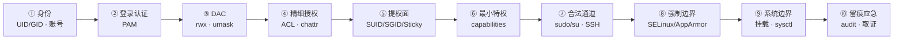

---
tags:
  - Linux
  - 权限
  - 账号安全
  - 安全加固
  - 学习地图
created: 2026-09-18
---

# 权限、账号与安全加固

> [!cite] 参考资料
> `man 7 credentials`、`man 7 capabilities`、`man 2 execve`、`man 5 passwd`、`man 5 shadow`、`man 5 group`、`man 1 chage`、`man 5 sudoers`、`man 8 pam_unix`、`man 8 pam_limits`、`man 8 pam_umask`、`man 5 faillock.conf`、`man 5 login.defs`、`man 1 getfacl`、`man 1 setfacl`、`man 1 chattr`、`man 5 sshd_config`、`man 5 authorized_keys`、`man 8 setcap`、`man 8 getcap`、`man 8 auditctl`、`man 5 auditd.conf`、`man 8 ausearch`、`man 8 restorecon`、`man 8 semanage`、`man 8 setsebool`、`man 8 aa-status`，以及发行版官方文档中的账号、认证、安全基线与审计章节。
>
> 本篇与子笔记的默认值、字段与行为以上述资料为准。凡涉及发行版或内核差异，正文会标注适用环境并给出「查本机」的命令。默认值参照 Ubuntu 24.04 / 内核 6.6（WSL2）实测，但 MAC、auditd、双用户权限拒绝、防火墙与真实 sshd 服务端等场景受实验环境限制，不能在本机完成的部分在子笔记中显式标注为「未实测」，换环境必须重采。

> 本页是子目录 `07_权限与安全加固/` 的 00 号导读，不是全部正文。知识脉络、生产技能地图、训练台阶、术语速查、故障现场定位表都在这一页；逐项深入的正文拆成子笔记，索引见第 7 节。
>
> **读者定位：刚入职的运维/SRE。** 假设你会基本 shell、会 `chmod`/`chown`、用过 `sudo`，但对「系统在决定一次访问时到底查了哪些东西、为什么权限看着对却还是 `Permission denied`、怎么把一台机器加固到可核查」没有完整框架。
>
> 相邻阶段的概念会在正文里以纯文本提到（例如阶段 3 的 rlimit、阶段 5 的 `nosuid`/`noexec`、阶段 8 的 systemd 沙箱选项），但本目录内部只用本目录的 wikilink；需要复习时回大纲页找对应章节即可。

> [!info] 读之前：先自检三条前提
> 1. **有一台能 root 的实验机**（虚拟机最佳、可快照；WSL2 只能做部分只读实验）。改 `sshd_config`、`sudoers`、PAM、`chattr`、SELinux 的篇目需要 root 和快照，**不要在生产机上第一次动手**。
> 2. **分得清「读懂了」和「能动手」**。这一章的验收不是背概念，而是能交出四样东西：一份账号与权限基线、一份最小授权变更记录、一份加固核查表、一份应急演练记录。
> 3. **能接受「先走判定链，再抠配置细节」**。这一章最难的是一张表：*访问发生时，内核依次查了哪些东西；报错发生在哪一层；证据在哪*。看不懂第 1 节时先看子笔记 01 与 03，再回来。

## 0. 30 秒速览

> [!abstract] 这一章只要记住七句话
> 首学读不懂很正常：先跳过这一节，读完第 1 节和子笔记 01 再回来逐条验证——每一条都是「结论 + 一句可复现的证据」。
> - **权限问题先问「卡在哪一层」**：DAC 位、ACL、capabilities、挂载选项、SELinux/AppArmor，五层的报错都可能是 `Permission denied`，但处置完全不同。用 `namei -l <path>` 一次看全路径，用 `getfacl`/`getcap`/`ls -Z` 看后几层。
> - **`rwx` 对文件与目录是两套语义**：文件的 `x` 是「可执行」，目录的 `x` 是「能穿过」，目录的 `r` 才是「能列出名字」。删文件看目录的 `w`，不看文件自己的 `w`；`/tmp` 用 `1777` 是因为 sticky 位只允许属主删。
> - **SUID 只对二进制生效，脚本上的 SUID 被内核忽略**：`execve()` 在 `no_new_privs`、`nosuid` 挂载、被 `ptrace` 时也会忽略 SUID/file capabilities。实测本机 SUID 文件 14 个、SGID 7 个；核查要用 `find -perm -4000`（包含），不是 `-perm 4000`（精确）。
> - **capabilities 是 SUID 的现代替代**：`/usr/bin/ping cap_net_raw=ep`，systemd 给非 root 服务用 `AmbientCapabilities=CAP_NET_BIND_SERVICE`。能 `setcap` 就不 SUID，能在 unit 里限定就不给整个 root。
> - **账号默认值几乎都是「不过期」**：`PASS_MAX_DAYS=99999`、`INACTIVE=-1`；Ubuntu 默认 root 密码被锁成 `!*`。加固必须主动收紧有效期、失败锁定和 root 登录入口。
> - **`sudo` 与 SSH 是最常被走的合法通道，也是最该留痕的地方**：sudo 日志含 `TTY=`、`PWD=`、`USER=`、`COMMAND=`；SSH 侧用 `sshd -T -C user=...,addr=...` 看 `Match` 后的最终生效值，不要只看配置文件写没写。
> - **加固的验收标准是「可核查」，不是「感觉关掉了」**：定期查五类基线——账号、SUID/SGID/capabilities、监听端口、计划任务与自启、SSH 授权；`setenforce 0` 只把证据关掉，不是修复。

> [!tip] 这一页怎么用：三条入口
> - **系统学（推荐，按阶段 7 的 3~5 天）**：从第 4 节的四级训练台阶开始，T0 → T4 逐级往上；每一级用第 2 节的技能表核对交付物。
> - **出事急救**：直接看第 6 节「故障现场定位表」，定位到类别后进对应子笔记，或直接翻子笔记 15《安全故障处置手册》。
> - **面试速览**：第 0 节 + 第 1 节 + 第 5 节术语表 + 各子笔记末尾的自测卡；每道题都要能补一句「第一反应不要做什么」。

## 1. 知识地图（第一条主线）

### 1.1 一次特权访问的十站

这一章不按「权限、账号、MAC、审计」四个名词平铺，而是跟着**一次特权访问**走：从「我是谁」开始，到「我能对什么做什么」，再到「我留下什么痕迹、出事怎么收敛」。站与站之间的顺序就是内核和认证系统做决定的顺序。

| # | 站点 | 系统在做什么 | 这一站的证据 | 主要子笔记 |
| --- | --- | --- | --- | --- |
| 1 | 身份 | 用 UID/GID、附加组、登录 shell 回答「你是谁」 | `id`、`getent passwd`、`/etc/passwd`、`/etc/shadow` | 02、04 |
| 2 | 登录与认证 | PAM 四类栈决定「现在能不能登录、密码改不改得了」 | `/etc/pam.d/*`、`journalctl` 的认证日志、`faillock` | 05 |
| 3 | DAC 基础权限 | 用属主/属组/other 的 `rwx` 和 `umask` 做第一层判定 | `ls -l`、`namei -l`、`umask` | 06 |
| 4 | 精细授权 | 用 ACL、`chattr`、扩展属性覆盖「只给某一个人/某个组」 | `getfacl`、`ls -l` 的 `+`、`lsattr` | 07 |
| 5 | 提权面 | SUID/SGID/Sticky 在 `execve()` 时换身份 | `find -perm -4000/-2000`、`stat -c %a` | 08 |
| 6 | 最小特权 | capabilities 把 root 拆成 41 项，按项授予 | `getcap -r /`、`capsh --print`、`systemctl show` | 09 |
| 7 | 合法通道 | `sudo`/`su` 把普通身份提升到目标身份，SSH 决定谁能从哪进 | `sudo -l`、`visudo -c`、`sshd -T` | 10、11 |
| 8 | 强制边界（一） | SELinux/AppArmor 在 DAC 之外再加一层策略 | `getenforce`、`aa-status`、`ausearch -m AVC` | 12 |
| 9 | 强制边界（二） | 挂载选项与内核安全参数在系统层面关掉危险入口 | `findmnt`、`sysctl`、`/etc/sysctl.d/*` | 13 |
| 10 | 留痕与应急 | auditd、登录痕迹、完整性校验与五类基线核查 | `ausearch`、`last`/`lastb`、`dpkg -V` | 14 |

真正要练出来的，是同一个三问：

1. **这个主体是谁、要访问哪个客体？** —— 先分清「进程身份」和「用户身份」。进程身份由 `ruid/euid/suid/fsuid`、组、附加组、capabilities 共同决定；客体身份由 mode、ACL、xattr、SELinux 上下文共同决定。分不清主体和客体，就会在错的对象上取证（子笔记 01、02、06）。
2. **卡在哪一层、证据是什么？** —— 是路径缺 `x`、ACL mask 削权、`nosuid` 挡住了 SUID、缺少 capability，还是 SELinux 的 AVC 拒绝？每一层都有**能取到的证据**，能用证据说话就不要用感觉说话（子笔记 03、06、12、15）。
3. **哪些动作会毁掉现场、哪些动作不可逆？** —— 重启服务会清掉认证日志和网络现场；`setenforce 0` 会把强制策略关成只审计；`chmod -R 777` 会同时开放写和执行。先取证，再动手；先隔离，再清理（子笔记 14、15）。

### 1.2 四条横切线

十站是时间线，但有几件事会横穿多个站点。新人最容易「每一站都看过，却串不起来」，就是没抓住这四条线：

| 横切线 | 贯穿内容 | 收口于 | 主要子笔记 |
| --- | --- | --- | --- |
| **判定链** | DAC → ACL → capabilities → 挂载选项 → MAC；每层的报错与证据 | 「权限看着对却仍拒绝」的定位树 | 01、06、07、09、12、15 |
| **提权面** | SUID/SGID → file capabilities → sudo/su → 可写脚本/配置 → SSH 钥匙 → 内核与设备 | 五类基线核查里的「提权面」 | 08、09、10、11、14 |
| **可核查** | 账号台账、权限基线、变更留痕、审计日志、完整性校验 | 5 分钟体检与基线比对 | 03、04、10、14、15 |
| **入口收敛** | 账号/PAM/SSH/防火墙/挂载选项/sysctl | 先关掉不需要的入口，再上强制策略 | 04、05、11、13 |

还有一条不是机制，而是动作：**变更纪律**。它贯穿每一站——改 `sudoers`、PAM、`sshd_config`、SELinux、sysctl 之前先留基线，一次只改一项，改完用同一条命令复测；凡可能把自己锁在外面的变更，先留一个已登录的带外会话（子笔记 15）。

### 1.3 前置地基

以下三篇是读懂十站的最低门槛，不是扩展阅读。

| 前置篇 | 你要先建立的概念 | 对应子笔记 |
| --- | --- | --- |
| 安全坐标系与四层防线 | 主体、客体、访问判定；DAC/capabilities/MAC/审计四道防线各回答什么问题 | [[Linux/07_权限与安全加固/01_前置_安全坐标系与四层防线\|01 前置：安全坐标系与四层防线]] |
| 身份与账号文件 | UID/GID、附加组、`passwd`/`shadow`/`group` 字段、账号状态 | [[Linux/07_权限与安全加固/02_前置_身份与账号文件\|02 前置：身份与账号文件]] |
| 权限观测工具与证据命令 | `id`/`namei`/`getfacl`/`getcap`/`ls -Z`/`stat` 各答什么问题 | [[Linux/07_权限与安全加固/03_前置_权限观测工具与证据命令\|03 前置：权限观测工具与证据命令]] |

> [!warning] 安全这一章最容易「看起来懂了」
> 真正的难点不是命令，而是**报错层级的归属**。如果读完子笔记 01–03 还说不清「一次 `cat /srv/app/secret` 被拒，至少可能卡在哪几层、各用什么命令证伪」，先别急着改 sudoers 和 SELinux——那会变成背配置。

## 2. 生产技能地图（第二条主线）

知识和技能是两条线。读完不等于会做，所以这一章明确交付 7 项技能，每项都有可观察的行为和一个交付物。

| # | 技能 | 可观察的行为 | 在哪几篇练 | 交付物 |
| --- | --- | --- | --- | --- |
| S1 | 身份与账号台账 | 拿到一台机器，说清「有哪些账号、UID 0 是谁、哪些能登录、密码有效期如何、有没有多出的账号」 | 02、04、16 | 一份账号台账 |
| S2 | 权限判定 | 对「文件/目录 755 是什么」「删除只读文件需要什么」「`Permission denied` 卡在哪一层」给出证据链 | 01、03、06、15 | 一份权限判定记录 |
| S3 | 提权面治理 | 用 `find -perm`、`getcap`、包管理器反查完成一次提权面盘点，并与基线比对 | 08、09、14、16 | 一份提权面基线卡 |
| S4 | 最小特权落地 | 用 `setcap`/systemd capability 替代「整个 root」，并写清每项能力的边界 | 09、10、16 | 一份最小特权变更记录 |
| S5 | 安全基线加固 | 按账号、入口、挂载、sysctl 四类做一次可回滚加固，并留下核查命令 | 04、05、11、13、16 | 一份加固核对表 |
| S6 | 强制访问控制排障 | 用 AVC/AppArmor 日志定位拒绝，走 `restorecon`/`setsebool` 等四步，而不是 `setenforce 0` | 12、15 | 一份 MAC 处置记录 |
| S7 | 入侵排查与应急处置 | 五类基线发现异常后，按隔离 → 保全 → 取证 → 判定 → 恢复/重建走一遍 | 14、15、16 | 一份应急演练记录 |

其中 S2、S3、S7 是**判断力**，也是新人最容易卡住的三项：层级判错、提权面漏项、现场处置顺序反了，后面所有结论都会歪。S1、S4、S5 是**治理力**，S6 是**取证力**。顺序不能颠倒：没有账号与权限基线就谈「加固」，等于凭感觉改配置。

## 3. 四级训练台阶

| 台阶 | 做什么 | 在哪台机器 | 交付物 |
| --- | --- | --- | --- |
| **T0 读通** | 画出「身份 → 认证 → DAC → 提权 → 强制边界 → 留痕」这条链；说清 `Permission denied` 至少要看哪四层 | 纸面/白板 | 一张权限判定链图 |
| **T1 观测** | 采集账号、SUID/SGID/capabilities、监听端口、计划任务与自启、SSH 授权五类基线；全程只读 | **生产机可以做（只读）** | 安全基线卡 |
| **T2 可回滚变更** | 在实验机上：最小 sudoers、`umask`、`nosuid`/`noexec`、sysctl、SSH 配置各改一项，改完用同一命令复测并回滚 | 实验机 | 变更记录（含验证与回滚） |
| **T3 故障注入与恢复** | 造一次「路径缺 `x` 拒绝」、一次「ACL mask 削权」、一次「非 root 绑 80 失败」、一次 SELinux/AppArmor 拒绝 | **可快照实验机** | 演练记录 + 分层判读结论 |
| **T4 限时模拟** | 给一个现象（例如「服务日志出现 Permission denied」或「机器疑似被入侵」），15 分钟内定位类别并写出处置记录 | 实验机 + 计时 | 一份处置报告 |

> [!warning] 三条不能破的边界
> **只有 T1 允许在生产机上做，而且全程只读**：`id`、`getent`、`find -perm`、`getcap -r`、`ss -lntup`、`sshd -T` 等查询命令。
> **T2 到 T4 一律在可快照实验机**：改 PAM、`sudoers`、`sshd_config`、SELinux、sysctl 前先快照，并保留一个已登录的 root 会话。
> **三个生产禁做动作**：`setenforce 0` 当修复、`chmod -R 777` 当授权、在没留带外会话时改 PAM/SSH 把自己锁在外面。

## 4. 学习路线

**系统学的三遍读法（对应阶段 7 的 3~5 天）：**

- **第一遍（约一天，先建立判定链）**：第 1 节 → 前置 01–03 → 06（DAC）→ 07（ACL）→ 15 的「Permission denied」一节 → 实验 1、4。这一遍结束应该能处理「文件权限看着对，服务仍被拒」。
- **第二遍（约两天，把提权与入口补齐）**：08（SUID/提权面）→ 09（capabilities）→ 10（sudo）→ 11（SSH）→ 04（账号）→ 05（PAM）→ 13（挂载与 sysctl）→ 实验 2、3、5、6、7。
- **第三遍（进阶与应急）**：12（SELinux/AppArmor）→ 14（审计与取证）→ 15 其余各节 → 16 汇总自测 → T3、T4。

**只想解决手头问题的快捷入口：**

| 你的问题 | 去哪 |
| --- | --- |
| 文件权限看着对，服务仍 `Permission denied` | 子笔记 06、07、12、15 |
| 想查一台机器有没有异常提权点 | 子笔记 08、14 |
| 想给进程绑 80 端口但不想整个 root | 子笔记 09 |
| `sudo` 该怎么给最小权限、怎么留痕 | 子笔记 10 |
| SSH 怎么加固、配置是否真的生效 | 子笔记 11 |
| SELinux 挡住服务怎么处理 | 子笔记 12、15 |
| `nosuid`/`noexec` 到底防什么 | 子笔记 13 |
| 怀疑机器被入侵，先做什么 | 子笔记 14、15 |
| 想做一次安全基线检查 | 子笔记 14、16 |

## 5. 术语速查

> [!info]- 名词速查（读到哪里卡住，就回这里查）
> | 名词 | 一句话解释 | 在哪一篇展开 |
> | --- | --- | --- |
> | DAC | 自主访问控制：属主通过 mode/ACL 决定谁能访问 | 01、06 |
> | MAC | 强制访问控制：策略决定，属主也绕不过 | 01、12 |
> | UID/GID | 用户/组标识；内核按数值做判定，名字只是显示 | 02、04 |
> | `euid`/`fsuid` | 执行身份 / 文件系统判定身份；SUID 改的是 `euid` | 01、06 |
> | `umask` | 新建对象时按位减掉的默认权限 | 06 |
> | SUID/SGID/Sticky | 执行时换属主/属组、目录继承属组 / 目录内只属主能删 | 08 |
> | capabilities | 把 root 特权拆成 41 项，按项授予 | 09 |
> | `AmbientCapabilities` | systemd 让非 root 服务跨 `execve` 保留能力 | 09 |
> | ACL | 属主/属组/other 之外的按用户/组授权 | 07 |
> | ACL `mask` | named 条目与 owning group 的有效权限上限 | 07 |
> | `chattr +i/+a` | 文件不可变 / 只能追加 | 07 |
> | PAM | 模块化认证框架：`auth/account/password/session` 四类栈 | 05 |
> | `pam_faillock` | 连续失败锁定 | 05 |
> | `pam_pwquality` | 密码质量策略 | 05 |
> | sudoers | `User Host=(Runas) Cmds` 的授权语法 | 10 |
> | `use_pty` | 让 sudo 命令跑在独立伪终端，防终端注入 | 10 |
> | `sshd -T/-t` | 打印生效配置 / 只做语法检查 | 11 |
> | `authorized_keys` 选项 | `command=`、`from=`、`restrict` 等按钥匙限权 | 11 |
> | SELinux 上下文 | `user:role:type:level`，随 inode 走 | 12 |
> | AppArmor | 以程序路径为中心的策略，Ubuntu 默认 | 12 |
> | `auditd` | 内核审计事件的用户态收集者 | 14 |
> | 持久化点 | 攻击者下次还进得来的位置：cron/timer、unit、`authorized_keys`、`ld.so.preload` | 08、14 |
> | `dpkg -V`/`rpm -Va` | 用包数据库校验文件是否被改 | 14 |

## 6. 故障现场定位表

排障的第一问不是「怎么修」，而是「**这次拒绝/异常发生在哪一层、哪一层的证据在动**」。用这张表把现象定位到类别，再进对应子笔记。

| 你看到的现象 | 属于哪一类 | 现场在哪 | 第一反应不要做 | 去哪一篇 |
| --- | --- | --- | --- | --- |
| 文件本身 755，服务仍 `Permission denied` | 路径缺 `x` / ACL mask / 挂载选项 / MAC | `namei -l <path>`、`getfacl`、`findmnt`、`ausearch -m AVC` | 不要 `chmod -R 777` | 06、07、12、15 |
| 删不掉一个文件 | 目录缺 `w` 或 sticky 位 | `ls -ld <dir>`、`stat -c %a <dir>` | 不要 `chmod 777` 整个目录 | 06、08、15 |
| SUID/SGID 文件多了一个 | 提权面异常 | `find / -xdev -type f -perm -4000`、`dpkg -S`/`rpm -qf` | 不要只看数量就说正常 | 08、14、15 |
| 普通用户绑 80 端口失败 | 缺少 `CAP_NET_BIND_SERVICE` | `getcap <bin>`、`sysctl net.ipv4.ip_unprivileged_port_start` | 不要把 `ip_unprivileged_port_start` 改成 0 | 09、15 |
| `sudo` 提示不在 sudoers | sudoers 授权或账号状态问题 | `sudo -l`、`visudo -c`、`id` | 不要先给 `ALL=(ALL) NOPASSWD: ALL` | 10、15 |
| SSH 能连但新配置不生效 | 配置覆盖 / `Match` 叠加 / 没 reload | `sshd -T`、`sshd -T -C` | 不要只 `systemctl reload` 就完事 | 11、15 |
| SELinux 挡住服务 | AVC 拒绝、上下文错或端口错 | `ausearch -m AVC`、`ls -Z`、`semanage port -l` | 不要 `setenforce 0` 当修复 | 12、15 |
| 账号「已锁定」但还能登录 | 只锁了密码，没清钥匙/会话 | `getent shadow`、`authorized_keys`、`who`/`loginctl` | 不要以为 `passwd -l` 等于停用账号 | 04、05、15 |
| 怀疑被入侵 | 提权面/账号/持久化点异常 | 五类基线 + `last`/`ausearch`/`dpkg -V` | 不要关机、重启、`kill -9`、急着重装 | 14、15 |
| 加固做完却说不清效果 | 没有基线和验收命令 | 变更记录 + 基线卡 | 不要用「感觉关掉了」当结论 | 03、14、16 |

两个容易被忽略的边界：

- **「文件权限」和「访问身份」是两个问题。** 文件上的 `rwx` 只是一个客体的属性；真正判不判得过，还要看进程的 `euid`/组/附加组/capabilities，以及路径每一级目录。混在一起问，就会得出「文件 755 怎么还进不去」这种结论。
- **「没有报错」不等于「没有异常」。** 很多提权面（SUID、可写脚本、`authorized_keys`）平时完全静默，只有和上次基线比对才会冒出来。**安全基线必须留档，不能每次凭印象看一遍。**

## 7. 子笔记索引

| # | 子笔记 | 一句话 | 主要技能 | 难度 |
| --- | --- | --- | --- | --- |
| 01 | [[Linux/07_权限与安全加固/01_前置_安全坐标系与四层防线\|前置：安全坐标系与四层防线]] | 主体、客体、四道防线，先建立「卡在哪一层」的坐标系 | S2 | 前置 |
| 02 | [[Linux/07_权限与安全加固/02_前置_身份与账号文件\|前置：身份与账号文件]] | UID/GID、`passwd`/`shadow`/`group` 字段与账号状态 | S1 | 前置 |
| 03 | [[Linux/07_权限与安全加固/03_前置_权限观测工具与证据命令\|前置：权限观测工具与证据命令]] | `id`/`namei`/`stat`/`getfacl`/`getcap` 各答什么问题 | S1、S2 | 前置 |
| 04 | [[Linux/07_权限与安全加固/04_第1站_身份与账号\|第 1 站：身份与账号]] | 账号清单、密码有效期、锁定/停用账号、账号基线 | S1、S5 | 核心 |
| 05 | [[Linux/07_权限与安全加固/05_第2站_登录与认证_PAM\|第 2 站：登录与认证（PAM）]] | PAM 四类栈、`pam_faillock`/`pam_pwquality`、发行版差异 | S5 | 核心 |
| 06 | [[Linux/07_权限与安全加固/06_第3站_DAC权限位与路径语义\|第 3 站：DAC 权限位与路径语义]] | `rwx` 两套语义、`umask`、路径逐级 `x` | S2 | 核心 |
| 07 | [[Linux/07_权限与安全加固/07_第4站_ACL与扩展属性\|第 4 站：ACL 与扩展属性]] | `setfacl`/`getfacl`、mask、默认 ACL、`chattr` | S2、S5 | 核心 |
| 08 | [[Linux/07_权限与安全加固/08_第5站_特殊权限与提权面\|第 5 站：特殊权限与提权面]] | SUID/SGID/Sticky、`find -perm`、提权面全景 | S3 | 核心 |
| 09 | [[Linux/07_权限与安全加固/09_第6站_capabilities与最小特权\|第 6 站：capabilities 与最小特权]] | 五个集合、`getcap`/`setcap`、systemd 能力、80 端口四种做法 | S4 | 核心 |
| 10 | [[Linux/07_权限与安全加固/10_第7站_sudo与su\|第 7 站：sudo 与 su]] | sudoers 最小授权、`NOPASSWD` 边界、日志字段 | S4、S5 | 核心 |
| 11 | [[Linux/07_权限与安全加固/11_第8站_SSH加固\|第 8 站：SSH 加固]] | `sshd -T`、`Match`、钥匙限权、主机指纹 | S5 | 核心 |
| 12 | [[Linux/07_权限与安全加固/12_第9站_强制访问控制_SELinux与AppArmor\|第 9 站：强制访问控制（SELinux 与 AppArmor）]] | SELinux 模式、上下文、四步处置、AppArmor 差异 | S6 | 核心 |
| 13 | [[Linux/07_权限与安全加固/13_第10站_挂载选项与内核安全参数\|第 10 站：挂载选项与内核安全参数]] | `nosuid`/`nodev`/`noexec`、`fs.protected_*`、关键 sysctl | S5 | 核心 |
| 14 | [[Linux/07_权限与安全加固/14_审计核查与入侵取证\|审计核查与入侵取证]] | auditd、登录痕迹、完整性校验、五类基线、应急顺序 | S3、S7 | 核心 |
| 15 | [[Linux/07_权限与安全加固/15_安全故障处置手册\|安全故障处置手册]] | 九类现象 → 分层 → 证据 → 处置 | S2、S6、S7 | 核心 |
| 16 | [[Linux/07_权限与安全加固/16_动手实验与要点自测\|动手实验与要点自测]] | 七个实验索引与总自测 | 全部 | 汇总 |

## 自检清单

- [x] frontmatter 有 `tags` 和 `created`，全篇只有一个一级标题
- [x] 速览卡 7 条，每条都是结论 + 可复现的证据
- [x] 知识主线（十站 + 四条横切线）与技能主线（S1–S7 + T0–T4）都在本页可见
- [x] 章节内引用只用章节内 wikilink；提及其他阶段一律用纯文本
- [x] 阶段 7 已按「主笔记 + 子笔记」拆分，索引完整
- [ ] 第 6 节的每一种现象都在对应子笔记里演练过一次
- [ ] 每张 Mermaid 图都在 Obsidian 里预览过，能正常渲染
