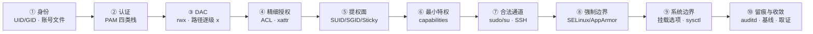

---
tags:
  - Linux
  - 权限
  - 账号安全
  - 安全加固
  - 学习地图
created: 2026-09-20
---

# 权限与安全加固

## 知识地图

### 一次特权访问的十站

时间主线跟着**一次特权访问**走：从「一个进程声称自己是谁」开始，到访问被放行或拒绝，再到这次访问留下什么痕迹、出事时怎么收敛。

| # | 站点 | 系统在做什么 | 到这里要能说清 |
| --- | --- | --- | --- |
| 1 | 身份 | 用 UID/GID、附加组、登录 shell 回答「你是谁」 | 内核按数值判定身份，名字只是显示；UID 0 为什么不看名字 |
| 2 | 认证 | PAM 的 `auth`/`account`/`password`/`session` 四类栈决定「现在能不能登录」 | 配置文件存在为什么不等于策略生效；账号过期属于哪一类栈 |
| 3 | DAC 判定 | 路径逐级 `x` + 属主/属组/other 的 `rwx` | 目录的 `r`/`w`/`x` 与文件的三位为什么是两套语义 |
| 4 | 精细授权 | ACL 的 named 条目与 `mask`、`chattr` 属性 | `mask` 为什么能悄悄削掉「已经加上的授权」 |
| 5 | 提权面 | `execve()` 时按 SUID/SGID 换身份；脚本上的位被忽略 | 设了 SUID 却不生效要先查哪三件事 |
| 6 | 最小特权 | capabilities 把 root 拆成 41 项，按项授予 | 为什么 `setcap` 在脚本上「设得上、不生效」 |
| 7 | 合法通道 | `sudo`/`su` 把身份提升到目标账号；SSH 决定谁能从哪进 | `sshd -T` 与「配置文件写了」为什么不是一回事 |
| 8 | 强制边界（一） | SELinux 看类型上下文、AppArmor 看程序路径 profile | MAC 拒绝的记录落在哪，取决于 auditd 在不在跑 |
| 9 | 强制边界（二） | 挂载选项 `nosuid`/`nodev`/`noexec` 与内核安全参数 | `noexec` 拦不住什么；参数值为什么可能在配置文件里找不到 |
| 10 | 留痕与收敛 | auditd 事件、登录痕迹、包数据库完整性校验、五类基线 | 为什么单次基线不算核查，必须与上次比对 |

**贯穿全章的一个三问**：这次访问的**主体**是谁（进程的 UID/GID/组/capabilities）；它**卡在哪一层**、那一层的证据是什么；哪些动作会毁掉现场、哪些动作不可逆。

**两处方向上的提醒。** 站点 1~2 发生在登录那一刻，站点 3~9 发生在每一次访存或每次 `execve`，站点 10 是事后；排障时通常从「报错是哪一类」往回推，而不是从站点 1 顺序走下来。另外，**「文件权限」与「访问身份」是两个问题**——只看客体属性（`ls -l` 的输出）永远解释不了「文件 755 为什么还是进不去」。

### 四条横切线

| 横切线 | 贯穿内容 | 收口于 |
| --- | --- | --- |
| 判定链线 | 路径逐级 `x` → DAC 位 → ACL `mask` → capabilities → 挂载选项 → MAC → 内核参数 | 「文件权限看着对却仍被拒」的定位顺序 |
| 提权面线 | SUID/SGID → file capabilities → `sudo`/`su` → root 执行的可写脚本与配置 → SSH 钥匙 → 动态链接器 → 内核与设备 → 容器特权 | 提权面基线卡与「多出来一个」的判定 |
| 可核查线 | 账号台账 → 权限与提权面基线 → 变更留痕 → 审计日志 → 包数据库完整性校验 | 五类基线与 5 分钟体检 |
| 入口收敛线 | 账号与 shell → PAM 策略 → SSH 认证与授权 → sudoers → 挂载选项 → 内核参数 | 先关掉不需要的入口，再叠加强制策略 |

外加一条不是机制而是纪律的线：**变更纪律**。它横穿每一站——改 `sudoers`、PAM、`sshd_config`、SELinux 模式、`sysctl` 之前先留基线与带外会话，一次只改一项，改完用同一条命令复测。具体条款见本章治理篇与 `00_学习大纲`。

## 术语速查

| 名词 | 一句话解释 | 在哪一篇展开 |
| --- | --- | --- |
| 主体 / 客体 | 发起访问的进程（带 UID/GID/组/capabilities）/ 被访问的对象（文件、目录、设备、socket、端口、内核接口） | 原理：身份、认证与账号文件 · 原理：文件权限为什么不决定一切 |
| `ruid` / `euid` / `suid` / `fsuid` | 真实身份 / 有效身份（决定绝大多数权限判定）/ 保存身份 / 文件系统判定身份 | 原理：身份、认证与账号文件 · 原理：提权面与最小特权 |
| NSS | 名字服务开关（`nsswitch.conf`），决定「账号去哪查」；接 LDAP/SSSD 后本地文件不再是唯一来源 | 原理：身份、认证与账号文件 |
| PAM | 模块化认证框架，把认证拆成 `auth`/`account`/`password`/`session` 四类栈 | 原理：身份、认证与账号文件 |
| DAC | 自主访问控制：属主通过 mode 与 ACL 决定谁能访问 | 原理：文件权限为什么不决定一切 |
| `umask` | 新建对象时按位减掉的默认权限，有登录会话、unit、进程三个落点 | 原理：文件权限为什么不决定一切 |
| ACL / `mask` / `#effective` | 属主/属组/other 之外的按用户、按组授权 / named 条目与 owning group 的有效权限上限 / 实际生效结果 | 原理：文件权限为什么不决定一切 |
| xattr | 扩展属性，ACL、file capabilities、`security.*` 标签都存放在这里 | 原理：文件权限为什么不决定一切 · 原理：提权面与最小特权 |
| `chattr +i` / `+a` | 不可修改（连 root 也要先去属性）/ 只能追加 | 原理：文件权限为什么不决定一切 |
| SUID / SGID / Sticky | 执行时换 `euid` 为文件属主 / 换 `egid`、目录上让新文件继承属组 / 目录内只有属主与目录属主能删 | 原理：提权面与最小特权 |
| `no_new_privs` | 一个进程标志，置位后 `execve` 不再提权（SUID 与 file capabilities 都失效） | 原理：提权面与最小特权 · 原理：强制边界与系统边界 |
| capabilities | 把 root 的特权拆成 41 项（`cap_last_cap=40`），按项授予 | 原理：提权面与最小特权 |
| 五个能力集合 | Permitted（上限）、Effective（当前生效）、Inheritable（跨 `execve`）、Bounding（硬上限）、Ambient（非 root 保留） | 原理：提权面与最小特权 |
| file capabilities / `setcap` | 挂在文件 xattr 上的能力，`cap_net_raw=ep` 中的 `e`/`p` 指 Effective/Permitted | 原理：提权面与最小特权 |
| `NOPASSWD` | sudoers 里免密执行某条命令，等于把该命令的能力无条件交出 | 体系 · 治理 |
| `use_pty` | 让 sudo 命令跑在独立伪终端，防终端注入 | 体系 |
| `sshd -T` / `-t` | 打印合并默认值与 `Include`/`Match` 之后的**生效**配置 / 只做语法检查 | 实操 · 体系 |
| `authorized_keys` 选项 | `command=`、`from=`、`restrict` 等按钥匙限权 | 体系 · 治理 |
| SELinux 上下文 | `user:role:type:level`，核心看 `type`；随 inode 走，不随路径走 | 原理：强制边界与系统边界 |
| AppArmor | 以程序路径为中心的策略与 profile，Ubuntu 默认；`enforce`/`complain` 两种模式 | 原理：强制边界与系统边界 |
| AVC | 审计记录里的一类；SELinux 的拒绝写 `avc: denied`，AppArmor 的拒绝写 `apparmor="DENIED"` | 原理：强制边界与系统边界 · 实操 |
| `nosuid` / `nodev` / `noexec` | 挂载点上让 SUID 与 file capabilities 失效 / 设备文件不生效 / 禁止直接执行 | 原理：强制边界与系统边界 |
| `fs.protected_*` | 一组内核参数，防普通用户借全局可写文件、FIFO、硬链接与符号链接提权 | 原理：强制边界与系统边界 |
| auditd | 内核审计事件的用户态收集者；规则有文件监控与系统调用两类 | 治理 · 实操 |
| 持久化点 | 攻击者下次还进得来的位置：cron/timer、enabled 服务、`authorized_keys`、shell 启动文件、`/etc/ld.so.preload`、PAM 配置 | 治理 |
| `dpkg -V` / `rpm -Va` | 用包数据库校验文件是否被改动；非 root 跑会出现 `?????????` | 实操 · 治理 |
| 五类基线 | 账号、提权面（SUID/SGID/capabilities）、监听端口、计划任务与自启、SSH 授权 | 治理 |

## 故障现场定位表

排障的第一问不是「怎么修」，而是「**这次拒绝发生在哪一层、那一层的证据在动**」。用这张表把现象定位到类别，再进对应篇目。

| 你看到的现象 | 属于哪一类 | 现场在哪 | 第一反应不要做 |
| --- | --- | --- | --- |
| 文件本身 755，服务仍 `Permission denied` | 拒绝发生在路径、ACL、挂载选项或 MAC 层 | `namei -l <path>`、`getfacl -cp`、`findmnt -T`、审计日志里的 `apparmor="DENIED"`/`avc: denied` | 不要 `chmod -R 777` |
| 删不掉一个文件 | 卡在目录的 `w`/`x` 或 sticky 位、`chattr` 属性 | `ls -ld <dir>`、`stat -c %a <dir>`、`lsattr` | 不要递归 `chmod 777` 那个目录 |
| SUID/SGID 文件或带 capabilities 的文件多了一个 | 提权面异常 | `find -perm -4000`/`-2000`、`getcap -r /`、`dpkg -S`/`rpm -qf` | 不要只看数量就说正常 |
| 普通用户绑 80 端口失败 | 缺少 `CAP_NET_BIND_SERVICE` | `getcap <bin>`、`sysctl net.ipv4.ip_unprivileged_port_start` | 不要把它改成 0 |
| 设了 SUID 却不生效 | 位被清掉、`nosuid` 挂载、或被 `no_new_privs` 拦住 | `stat -c %a`、`findmnt -T <path> -o OPTIONS` | 不要只说「内核忽略了」就收工 |
| `sudo` 提示不在 sudoers | sudoers 授权或账号状态 | `sudo -l -U <user>`、`visudo -c`、`id` | 不要直接给 `ALL=(ALL) NOPASSWD: ALL` |
| SSH 能连但新配置不生效 | 配置被 `Include`/`Match` 覆盖，或改的不是生效文件 | `sshd -T`、`sshd -T -C user=...,addr=...` | 不要只 `systemctl reload` 就完事 |
| 服务在 `enforcing` 下起不来 | MAC 拒绝 | `ausearch -m AVC </dev/null`、审计原始日志、`ls -Z`/`aa-status` | 不要把 `setenforce 0` 当修复 |
| 账号「已锁定」但还能登录 | 只锁了密码，没清钥匙、sudoers 与会话 | `getent shadow`、`authorized_keys`、`who`/`loginctl` | 不要以为 `passwd -l` 等于停用账号 |
| 改完 sysctl 重启就没了 | 只用了 `sysctl -w`，没落盘 | `/etc/sysctl.d/`、`sysctl --system` | 不要把临时值当已持久化 |
| 加固做完却说不清效果 | 没有基线与验收命令 | 基线卡、加固核对表 | 不要用「感觉关掉了」当结论 |
| 怀疑被入侵 | 提权面、账号、持久化点异常 | 五类基线加 `last`/`ausearch`/`dpkg -V` | 不要关机、重启、`kill -9`、急着重装 |

两个容易被忽略的边界：

- **「没有报错」不等于「没有异常」。** SUID 文件、可写脚本、`authorized_keys`、file capabilities 平时完全静默，只有和上次基线比对才会冒出来。**安全基线必须留档，不能每次凭印象看一遍。**
- **「能登录」与「能提权」是两条独立的通道。** 锁掉密码不影响公钥；收紧 SSH 不影响本机 `sudo`；关掉 `sudo` 不影响 SUID 文件。收口必须逐条通道确认。

## 篇目

| # | 篇目 | 一句话 |
| --- | --- | --- |
| 01 | [[Linux/07_权限与安全加固/01_原理_身份认证与账号文件\|原理：身份、认证与账号文件]] | 内核按数值认人、账号与凭据分家、PAM 四类栈 |
| 02 | [[Linux/07_权限与安全加固/02_原理_文件权限为什么不决定一切\|原理：文件权限为什么不决定一切]] | 路径逐级 `x`、两套 `rwx` 语义、ACL `mask` 与 `chattr` |
| 03 | [[Linux/07_权限与安全加固/03_原理_提权面与最小特权\|原理：提权面与最小特权]] | SUID/SGID 的生效条件、脚本为什么被忽略、capabilities 的五个集合 |
| 04 | [[Linux/07_权限与安全加固/04_原理_强制边界与系统边界\|原理：强制边界与系统边界]] | SELinux/AppArmor 的仲裁模型、挂载选项与内核安全参数 |
| 05 | [[Linux/07_权限与安全加固/05_体系_一次特权访问的完整旅程\|体系：一次特权访问的完整旅程]] | 十站一条线走完，含四条横切线与字段读法 |
| 06 | [[Linux/07_权限与安全加固/06_实操_观测与基线\|实操：观测与基线]] | 一个问题一把工具、字段怎么读、九类现象的排查方向 |
| 07 | [[Linux/07_权限与安全加固/07_判例_高频误判\|判例：高频误判]] | 现象 → 误判 → 判据 → 出处 |
| 08 | [[Linux/07_权限与安全加固/08_治理_账号权限基线与最小授权治理\|治理：账号权限基线与最小授权治理]] | 上限配在哪一层、七件产物、行业通行做法 |

## 参考文档

- `man 7 credentials`、`man 7 capabilities`、`man 2 execve`、`man 2 open`、`man 2 access`、`man 7 path_resolution`、`man 7 xattr`。
- `man 5 passwd`、`man 5 shadow`、`man 5 group`、`man 5 gshadow`、`man 5 nsswitch.conf`、`man 5 login.defs`、`man 1 id`、`man 1 getent`、`man 1 passwd`、`man 1 chage`、`man 8 useradd`、`man 8 usermod`。
- `man 5 pam.conf`、`man 8 pam_unix`、`man 8 pam_faillock`、`man 5 faillock.conf`、`man 8 pam_pwquality`、`man 8 pam_limits`、`man 8 pam_umask`。
- `man 1 chmod`、`man 1 stat`、`man 1 namei`、`man 1 umask`、`man 1 getfacl`、`man 1 setfacl`、`man 5 acl`、`man 1 chattr`、`man 1 lsattr`、`man 1 getfattr`、`man 1 getcap`、`man 8 setcap`、`man 1 capsh`。
- `man 5 sudoers`、`man 8 visudo`、`man 1 sudo`、`man 1 su`、`man 5 sshd_config`、`man 8 sshd`、`man 5 authorized_keys`。
- `man 8 getenforce`、`man 8 restorecon`、`man 8 semanage`、`man 8 setsebool`、`man 8 aa-status`、`man 5 apparmor.d`、`man 8 auditctl`、`man 8 ausearch`、`man 8 aureport`、`man 5 auditd.conf`。
- `man 8 mount`、`man 5 fstab`、`man 8 findmnt`、`man 8 sysctl`、`man 5 sysctl.d`、`man 5 proc`、`man 1 dpkg`、`man 8 rpm`。
- 内核文档 `Documentation/security/credentials.rst`、`Documentation/admin-guide/sysctl/`、`Documentation/admin-guide/LSM/`；内核与 man 手册按与目标机器同一主版本取（当前基线 6.x），引用时写明依据的版本。发行版差异以各发行版官方文档为准。

入口：[[Linux/00_学习大纲|00 学习大纲]]
