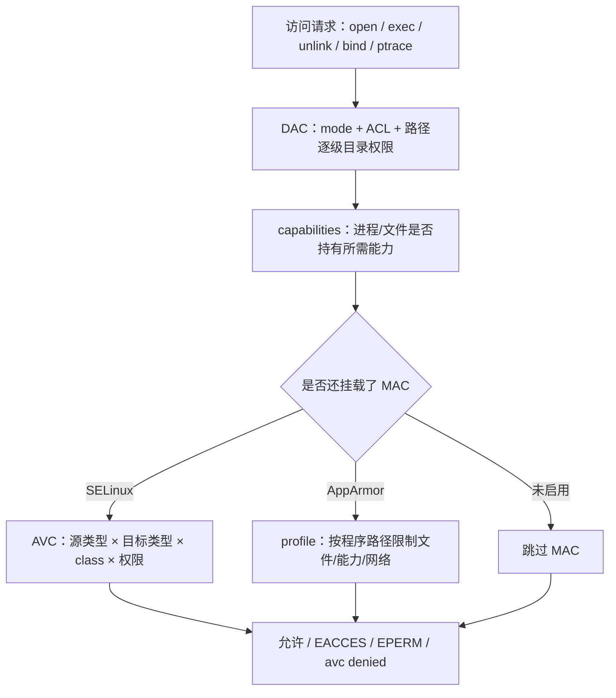

---
tags:
  - Linux
  - 权限
  - 安全
  - 前置
created: 2026-09-18
---

# 前置：安全坐标系与四层防线

> [!cite] 参考资料
> `man 7 credentials`、`man 7 capabilities`、`man 2 access`、`man 2 open`、`man 2 execve`、`man 7 selinux`（RHEL 系）、`man 7 apparmor`（Debian/Ubuntu 系），以及内核文档 `Documentation/admin-guide/security-bugs.rst` 与 `Documentation/security/credentials.rst`。
>
> 实测环境：Ubuntu 24.04.5 LTS（VMware 虚拟机）/ 内核 6.8.0-139-generic / AppArmor 4.0.1 / root。**DAC、capabilities、MAC（AppArmor）三层为本机实测**：正文里的 `EACCES`/`EPERM` 都对应真跑出来的 `errno`，AppArmor 的拒绝记录也是实测。**SELinux 层未实测**——本机未安装 SELinux（无 `/sys/fs/selinux`，`getenforce`/`restorecon`/`semanage`/`setsebool` 全部不存在），涉及它的部分按官方文档撰写并已标注。

> **这篇讲什么**：给整章先建立一个坐标系——一次访问发生时，内核问的不只是一句「文件上写了什么」。要同时看**主体**（进程是谁、带着哪些身份和能力）、**客体**（文件/目录/设备/网络端口是什么、贴着哪些属性）、以及四道防线（DAC、capabilities、MAC、审计）各自拦什么。
>
> **必须先读什么**：无。这是阶段 7 的第一篇，只需要会 shell、知道「用户、文件权限」这些词。
>
> **读完能回答**：① `Permission denied` 和 `Operation not permitted` 可能差在哪一层？② DAC 与 MAC 的根本区别是什么？③ 为什么「文件 777 还访问不了」完全可能成立？
>
> 所属：[[Linux/07_权限与安全加固/00_导读与知识地图|07 权限、账号与安全加固]] 的 1.3 前置地基 · 主要练 **S2 权限判定**

## 0. 30 秒速览

> [!abstract] 这一篇只要记住五句话
> - **一次访问是「主体 × 客体 × 规则」**：主体是进程（UID/GID、附加组、capabilities），客体是文件/目录/设备/端口（mode、ACL、xattr、安全标签）。
> - **四道防线不是并列的四个名词**：DAC 管「属主愿意给谁」；capabilities 管「进程有没有这一项特权」；MAC 管「即使 DAC 同意，策略允不允许」；审计管「上面发生了什么都记下来」。
> - **`EACCES`（Permission denied）通常是 DAC 或路径问题**；`EPERM`（Operation not permitted）常是 capability、挂载选项、不可变属性或 MAC 拒绝。实测本机：`realtyz` 绑 80 端口 → `EACCES`（`errno=13`）；`realtyz` 建 raw socket → `EPERM`（`errno=1`）；ACL `mask` 削权后写文件 → `EACCES`；带 `chattr +i` 的文件连 root 追加也 → `EPERM`。
> - **文件 777 不保证能访问**：路径上缺 `x`、ACL mask、`nosuid`/`noexec`、capability 不足、SELinux/AppArmor 拒绝，任何一层都能拦下。本机 `noexec` 挂载点上直接执行二进制是 `EACCES`（`Permission denied`），而 `nosuid` 挂载点上 SUID 被静默忽略——**不报错也不代表生效**。
> - **排障顺序永远先取证据再改权限**：`namei -l <path>` 看路径，`id`/`getfacl`/`getcap`/`ls -Z` 看剩余几层，不要上来就 `chmod -R 777`。

## 1. 主体与客体

Linux 的安全判定几乎都可以压缩成一句：**某个主体，要对某个客体，做某个动作，规则允不允许。**

| 概念 | 是什么 | 典型证据 |
| --- | --- | --- |
| 主体 | 一个进程，以及它此刻携带的 UID/GID、附加组、capabilities | `id`、`cat /proc/<pid>/status`、`capsh --print` |
| 客体 | 文件、目录、设备、socket、端口、进程、内核接口 | `stat`、`getfacl`、`getcap`、`ls -Z` |
| 动作 | `read`/`write`/`execute`/`unlink`/`bind`/`ptrace` 等 | 应用报错、系统调用返回的 `errno` |
| 规则 | 四道防线按顺序叠加的结果 | 审计日志、`ausearch`、`journalctl` |

最容易犯的错是**把「用户」当成主体**。内核不看用户名字，看的是**进程**当前的有效 UID/GID、文件系统 UID、组和 capabilities。一个普通用户登录后，开一个 shell 是一个进程；`sudo` 之后的新命令是另一个进程。两者身份不同，权限判定结果也不同。

## 2. 四道防线



| 防线 | 回答的问题 | 典型报错 | 关键命令 |
| --- | --- | --- | --- |
| DAC | 属主通过 mode/ACL 是否愿意给这个身份 | `EACCES`（Permission denied） | `ls -l`、`namei -l`、`getfacl` |
| capabilities | 进程有没有这一项拆分后的特权 | `EPERM`（Operation not permitted） | `getcap`、`capsh --print`、`systemctl show` |
| MAC | 即使 DAC 同意，全局策略允不允许 | `avc: denied`（SELinux）、`apparmor="DENIED"`（AppArmor） | `ausearch -m AVC`、`aa-status`、`/var/log/audit/audit.log` |
| 审计 | 前面每一层发生的事是否被记录 | 通常不阻断，只留证据 | `ausearch`、`aureport`、认证日志 |

> [!important] `EACCES` 与 `EPERM` 不是同义词
> `EACCES` 是「权限位/路径判定不通过」，最常见于 DAC；`EPERM` 是「这个操作本身不被允许，即使你有常规文件权限也做不了」，常见于 capability 不足、`chattr +i`、只读文件系统、SELinux/AppArmor 拒绝。**排障时先把 `errno` 记下来，别一看到 Permission denied 就去改 mode。**

## 3. 一条访问请求的判定顺序

以 `cat /srv/app/secret` 为例，内核至少按这个顺序问：

1. **路径上的每一级目录都有 `x` 吗？** 没有 → `EACCES`，问题在路径，不在最后那个文件。
2. **进程对这个文件有 `r` 吗？** 看属主/属组/other 和 ACL 的有效权限；没有 → `EACCES`。
3. **挂载点有没有 `noexec`/`nosuid`/`nodev` 等额外限制？** 对 `cat` 一般不影响，但换 `execute` 就影响。
4. **这个动作需要 capability 吗？** 例如 `bind(80)`、`chroot`、加载模块；没有 → `EPERM`。
5. **SELinux/AppArmor 开着吗？** 开着 → 查 `avc: denied`（SELinux）或 `apparmor="DENIED"`（AppArmor）日志，看是不是它拦的。**本机的 AppArmor 是开着的**（117 个 profile，其中 23 个 enforce），而本机 `auditd` 也在跑，所以**新产生的拒绝记录落在 `/var/log/audit/audit.log` 的 `type=AVC` 里，不进 `dmesg`/`journalctl -k`**（详见子笔记 12 第 4.1 节）；SELinux 未安装，跳过这一支。
6. **最后，这条访问有没有被审计规则记录下来？** 记录 → 留证据；没记录 → 说明你的审计覆盖可能不足。

```bash
namei -l /srv/app/secret       # 验证：从 / 到文件逐级显示 mode、属主、属组，一次定位路径缺 x
id                             # 验证：当前进程/会话的 uid、gid、groups 与 security context（若支持）
getfacl -cp /srv/app/secret    # 验证：完整 ACL 与有效权限，确认不是 mask 削权
getcap /path/to/program         # 验证：文件是否带有 capabilities
ls /sys/kernel/security/lsm     # 验证：本机为 lockdown,capability,landlock,yama,apparmor，说明 MAC 这一支是 AppArmor
grep 'apparmor="DENIED"' /var/log/audit/audit.log
                               # 验证：本机查 AppArmor 拒绝的入口（auditd 在跑时拒绝落在这里）
ausearch -m AVC -ts recent </dev/null
                               # 验证：本机这条查不出来（log_format=ENRICHED 返回 <no matches>），别把空结果当没发生
```

> [!tip] 第一反应不要是「最后一级文件权限没问题，那就 `chmod` 吧」
> 单看最后一级文件，永远会漏掉路径缺 `x`、ACL mask、挂载选项和 MAC。正确顺序是**沿着 `namei -l` 逐级看**，再决定动哪一层。

## 常见坑

| 常见做法或说法 | 后果或事实 |
| --- | --- |
| 把「用户」当主体 | 内核看的是进程身份；`sudo` 前后是两个进程 |
| 认为文件 777 一定能访问 | 路径缺 `x`、ACL mask、capability、MAC 都能拦下 |
| 看到 Permission denied 就 `chmod -R 777` | 同时开放写与执行，常把「权限问题」变成「提权问题」 |
| 认为 `EPERM` 和 `EACCES` 一样 | 前者更常指向 capability、`chattr +i`、只读文件系统或 MAC |
| 跳过审计层 | 没证据就无法判断是「没发生」还是「发生了但没记录」 |

## 决策练习

> [!question]- 场景：业务日志显示 `open("/srv/app/config")` 返回 `EACCES`。同事说「把 config 改成 777 试试」。你怎么办？
> A. 直接 `chmod 777 /srv/app/config`，先恢复业务
> B. 先取证：`namei -l /srv/app/config` 看路径各级，`getfacl -cp /srv/app/config` 看有效权限，`id` 看进程身份，再决定是补目录 `x`、改 ACL 还是改属主
> C. 把服务改成 root 运行，绕开权限
>
> **答案：B。**
> A 可能解决，但会留下「任何人可写」的提权点；而且如果问题出在路径缺 `x`，改文件 mode 根本无效。
> C 是把整个进程提权，等于用最高风险换一个局部问题。
> B 是正解：**先定位拒绝发生在哪一层，再用最小改动满足真实需求。**

## 要点自测

> [!question]- DAC 与 MAC 的根本区别是什么？
> - DAC 是**属主自主决定**：通过 mode、ACL 决定谁能访问；属主有权力改。
> - MAC 是**系统策略强制决定**：即使属主愿意给，策略不允许就不能访问；SELinux 看类型上下文，AppArmor 看程序路径 profile。
> - 本机把 MAC 这一支真跑过：AppArmor 已启用（117 个 profile，23 个 enforce），自建 profile 后普通程序读自己的文件被 `Permission denied`（`exit=1`），**真实拒绝记录落在 `/var/log/audit/audit.log` 的 `type=AVC ... apparmor="DENIED"`**（2026-09-19 08:31 UTC 采集，来源 `.labvm/evidence/07_apparmor_deny_real.out.txt`）；**`dmesg`/`journalctl -k` 里查不到这条**，只有 auditd 启动前的引导期 `type=1400` 记录。
> - **第一反应不要是什么**：不要以为「DAC 通过了」就万事大吉，还要看 capabilities 和 MAC。

> [!question]- `EACCES` 和 `EPERM` 分别提示你优先看哪一层？
> - `EACCES`：优先看路径逐级 `x`、文件 mode、ACL 有效权限。实测：`realtyz` 绑 80 → `errno=13`；ACL mask 削权后写文件 → 失败。
> - `EPERM`：优先看 capability、`chattr +i`、只读挂载、MAC 拒绝。实测：`realtyz` 建 raw socket → `errno=1`；`chattr +i` 的文件连 root 追加都失败。
> - **第一反应不要是什么**：不要把两者都当成「chmod 权限不够」。

> [!question]- 为什么说「一次访问是主体 × 客体 × 规则」？
> - 因为只看文件 mode 不够：还要看**谁**在访问（进程 UID/GID/组/capabilities）、访问**什么**（文件/目录/端口）、做**什么动作**（读/写/执行/绑定/追踪）。
> - 三者加上四道防线，才能解释一个访问结果。
> - **第一反应不要是什么**：不要只拿一个 `ls -l` 的输出就下结论。

> 下一篇：[[Linux/07_权限与安全加固/02_前置_身份与账号文件|02 前置：身份与账号文件]]
