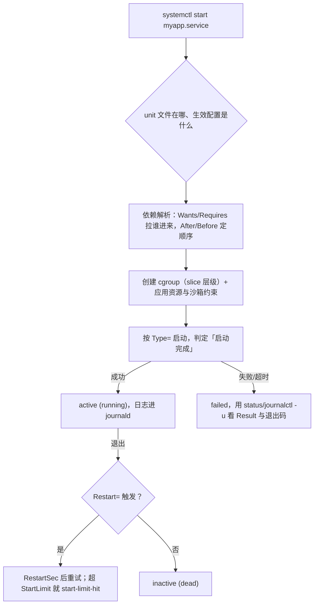

---
tags:
  - Linux
  - systemd
  - 服务管理
  - 定时任务
  - 运维面试
created: 2026-09-17
---

# systemd、服务与定时任务

> 本笔记对应 [[Linux/00_简介|Linux 大纲]] 的「阶段 8：systemd、服务与定时任务」。目标：把 systemd 讲成三件事——**怎么描述一个服务（unit 文件与 `Type=`）**、**它怎么被拉起与约束（依赖、资源、沙箱、重启策略）**、**它留下的证据在哪里（`systemctl status` / `journalctl`）**——并能把这套模型用到定时任务（timer/cron）与临时文件治理（tmpfiles）上。
>
> 关联复习：[[02_启动流程与内核]]（`default.target`、救援入口、`systemd-analyze blame`/`critical-chain`、内核参数与 `sysctl.d`）、[[03_进程与信号]]（`ulimit`/`limits.conf`/`LimitNOFILE` 三层限制、D 状态与 `kill -9`、cgroup 与 namespace）、[[05_存储与文件系统]]（`/tmp` 的挂载与 `nosuid`/`noexec`、日志写满根分区）、[[06_网络协议栈与排障]]（服务起不来时的端口/防火墙判定）、[[07_权限与安全加固]]（`User=`、`NoNewPrivileges`、`CapabilityBoundingSet`、SUID 与 capabilities）、[[09_日志与监控]]（journald 与 rsyslog 的分工、轮转与保留）、[[11_生产运维与高可用]]（变更窗口、批量重启、回滚）、[[12_复习与自测]]，以及 [[Kubernetes/03_调度_资源_QoS|Kubernetes 资源与 QoS]]（`systemd` 的 cgroup 是容器 QoS 的宿主侧基础）。
>
> 说明：结论以 man 页（`systemd.unit(5)`、`systemd.service(5)`、`systemd.exec(5)`、`systemd.timer(5)`、`systemd.time(7)`、`systemd.kill(5)`、`journald.conf(5)`、`tmpfiles.d(5)`、`crontab(5)`、`cron(8)`）与发行版官方文档为准。**本文的数字默认来自 Ubuntu 24.04.4 LTS / 内核 `6.6.87.2-microsoft-standard-WSL2` / systemd 255（255.4-1ubuntu8.17）的实测**，用户单元实验在 `systemctl --user` 下完成，换发行版或 systemd 版本要重新取一遍；RHEL 系的差异单列并标注「未在本机实测」。

> [!info] 读之前：这篇笔记的实验条件与读法
> 1. **本文大量使用了用户级 systemd（`systemctl --user`）做实测**：WSL 里 `systemd --user` 正在运行（实测 `systemctl --user is-system-running` 为 `running`），所以 unit 文件语法、`Type=`、依赖、资源限制、沙箱、timer、journald、tmpfiles 这些都能无 root 验证。**`/etc/systemd/system` 的 system 单元、`systemctl enable` 的 system 级自启、`User=` 切换用户这些需要 root**，本文只用只读命令观察，实验步骤单独标出。
> 2. **`--user` 与 system 的差异要记住**：用户单元不能 `User=`（实测报 `216/GROUP`）、不能给整个系统挂载点、`~/.config/systemd/user` 的优先级规则和 `/etc/systemd/system` 类似但路径不同。凡是「只在本机用户单元验证过」的结论，文中都写明了。
> 3. **读法**：第一遍读 1.1～1.5（unit 与依赖、`Type=`）+ 3.1～3.4（服务起不来/不生效），这是面试与日常最高频的部分；第二遍读 1.6～1.8（资源、沙箱、日志）；第三遍读 1.9～1.12（tmpfiles、cron/timer、自启、时间基线）。文末「验证进度」把实测与未实测分开列了。

## 0. 30 秒速览

> [!abstract] 这一页只要记住六句话
> 首学读不懂很正常：先跳过这一节，读完第 1、3 节再回来逐条验证——每一条都是「结论 + 一句可复现的证据」。
> - **改 unit 文件不等于生效，而且 `daemon-reload` 也只改「manager 的认识」，不改进程**：实测完整链条是「改文件 → `systemctl status` 出现 changed on disk 警告，manager 里还是旧值 → `daemon-reload` 后 manager 变新值、**运行中的进程环境仍是旧值** → `restart` 后才是新值」。读生效值用 `systemctl show -p ...` / `systemd-analyze cat-config`，别只看文件。
> - **`Type=` 决定「什么算启动完成」，选错就是「假启动失败」**：同一条 `ExecStart=/bin/bash -c "sleep 120 &"`，实测 `Type=simple` 立刻变成 `inactive (dead)`（剩下进程被控制组清掉），`Type=forking` 则 `active (running)`、`MainPID=sleep`；`Type=notify` 默认 `NotifyAccess=main`，子进程发通知会被拒（实测日志 `Got notification message from PID 5418, but reception only permitted for main PID 5417`，90 秒后 `start operation timed out`），改成 `NotifyAccess=all` 后 **0.039s** 启动成功。
> - **依赖是两层，别混**：`Wants=`/`Requires=` 决定「要不要拉起对方」，`After=`/`Before=` 只决定「谁先谁后」；不写 `After` 时两者并行。实测 `lab-b` 声明 `Wants=lab-a` + `After=lab-a`，`lab-a` 于 `21:27:38.544` 结束后 `lab-b` 才在 `21:27:38.568` 开始。
> - **资源上限的落点是 unit，不是 `limits.conf`**：实测 `LimitNOFILE=64` → 服务内 `ulimit -n` 为 64、`systemctl show` 也是 64；`MemoryMax=32M` → cgroup `memory.max=33554432`；`CPUQuota=10%` → `cpu.max=10000 100000`。默认 `KillMode=control-group`、`TimeoutStopUSec=1min 30s`、`RestartUSec=100ms`（实测）。
> - **沙箱选项会改变服务看到的世界，报错形态是 systemd 退出码**：`PrivateTmp=yes` 实测服务内 `/tmp` inode 为 12434，宿主是 73729；`ReadWritePaths=` 指向不存在的路径 → `status=226/NAMESPACE`；在**用户单元**里写 `User=root` → `status=216/GROUP`（要真换用户只能用 system 单元）。
> - **定时任务的坑集中在「环境」和「时间语义」**：cron 的实测环境是 `HOME/LOGNAME/PATH/LANG/SHELL=/bin/sh/PWD`（不是你的交互 shell），`%` 必须写成 `\%`；`systemd timer` 用 `OnCalendar`/`OnUnitActiveSec` + `AccuracySec` 表达时间，错过要不要补靠 `Persistent=`；而 tmpfiles 的 age 默认同时看 **mtime/atime/ctime**——实测「40 天前 mtime 但今天 ctime」的文件不会被 `--clean` 删除，改成 `m:30d` 才删，这是最容易误判「清理没生效」的一点。

## 1. 概念

> [!info]- 名词速查（读到哪里卡住，就回这里查）
> | 名词 | 一句话解释 | 在哪一节展开 |
> | --- | --- | --- |
> | unit | systemd 管理的最小对象（service/socket/target/timer/mount/slice…），有文件形式与运行时形式 | 1.1、1.2 |
> | target | 一组 unit 的集合（类似旧的 runlevel），如 `multi-user.target`、`default.target` | 1.1 |
> | slice / scope | cgroup 层级的组织单位 / 由外部进程创建的单元（如 `user@1000.service` 下的会话） | 1.1、1.6 |
> | drop-in | 不改原文件、只追加/覆盖片段的 `*.d/override.conf` | 1.3 |
> | `daemon-reload` | 让 PID 1 重新读取全部 unit 文件与 generator，重建依赖树 | 1.3 |
> | `Wants`/`Requires` | 弱依赖 / 强依赖：要不要把它拉起来 | 1.4 |
> | `After`/`Before` | 只表达启动顺序；不写就并行 | 1.4 |
> | `Type=` | 判定「服务启动完成」的方式：simple/forking/oneshot/notify/dbus | 1.5 |
> | `NotifyAccess=` | 谁有资格发 sd_notify：`main`（默认）/`exec`/`all` | 1.5 |
> | `Restart=`/`RestartSec=` | 退出后是否自动拉起、隔多久 | 1.6 |
> | `StartLimitBurst`/`StartLimitIntervalSec` | 在时间窗内允许启动几次，超了就不再重试（**写在 `[Unit]`**） | 1.6、3.3 |
> | `KillMode=` | 停止服务时杀谁：`control-group`（默认）/`mixed`/`process`/`none` | 1.6、3.1 |
> | `TimeoutStartSec`/`TimeoutStopSec` | 启动/停止的超时，超了先 SIGTERM 再 SIGKILL | 1.5、1.6 |
> | `ProtectSystem`/`PrivateTmp` | 只读挂载系统目录 / 给服务一个私有 `/tmp` | 1.7 |
> | `ReadWritePaths=` | 在 `ProtectSystem=` 造成的只读世界里开一个可写口 | 1.7 |
> | journald | systemd 的日志收集器：收 stdout/syslog/kmsg/audit，按字段索引 | 1.8 |
> | tmpfiles | 按声明式规则创建/清理 `/tmp`、`/run` 等易失路径 | 1.9 |
> | `D` / `d` / `e` / `x` | tmpfiles 的目录规则类型：创建并删除内容 / 创建并清理 / 只清理已存在 / 排除 | 1.9 |
> | `age-by` | tmpfiles 的年龄判据前缀（如 `m:30d` 表示只看 mtime） | 1.9 |
> | `OnCalendar` / `OnUnitActiveSec` | timer 的日历式 / 相对式触发；前者像 cron，后者像「上次跑完后隔多久再跑」 | 1.10 |
> | `Persistent=true` | 关机期间错过的 `OnCalendar` 任务，开机后补跑一次 | 1.10 |
> | `AccuracySec` | 允许的时间抖动窗口（默认 1min，省电但会推迟触发） | 1.10 |
> | `enable` / `mask` | 建立 `WantedBy` 的软链 / 用指向 `/dev/null` 的软链彻底屏蔽 | 1.11 |



这张图是整篇的骨架：**任何「服务的问题」都先定位到其中一环**——文件与生效配置、依赖与顺序、cgroup 与约束、`Type=` 与启动判定、退出后的策略。面试里按这条链讲，比背 `systemctl` 子命令更能体现结构。

### 1.1 先建立地图：PID 1、unit、target 与 slice【核心】

开机后 PID 1 是 systemd，它做的事可以概括成：**读 unit → 解析依赖 → 并行拉起 → 用 cgroup 管住 → 把日志收进 journald**。四个概念先分清：

- **unit**：被管理的对象。文件形式在磁盘上（`/usr/lib/systemd/system/*.service`），运行时形式在内存里（transient/scope）。
- **target**：一组 unit 的集合，用来表达「系统到哪一步了」。`default.target` 是开机默认目标（多指向 `graphical.target` 或 `multi-user.target`），`rescue.target`/`emergency.target` 是救援入口（[[02_启动流程与内核]]）。
- **slice**：cgroup 层级的组织单位。用户的 systemd 实例整体在 `user-1000.slice/user@1000.service` 下（本机实测服务 cgroup 路径为 `/user.slice/user-1000.slice/user@1000.service/app.slice/lab-limit.service`），系统的服务在 `system.slice`。
- **scope**：不由 systemd 创建的进程组（例如登录会话 `session-1.scope`），systemd 只是把它们纳入 cgroup 管理而不管启动。

本机实测的两条「看全景」命令：

```text
$ systemd-analyze time
Startup finished in 1.036s (userspace)
graphical.target reached after 1.000s in userspace.

$ systemd-analyze critical-chain | head -6
graphical.target @1.000s
└─multi-user.target @999ms
  └─snapd.seeded.service @569ms +213ms
    └─basic.target @558ms
      └─sockets.target @558ms
```

`systemd-analyze blame` 给的是「每个 unit 初始化花了多久」，**排序第一的往往不是启动阻塞**——本机 blame 的第一名是 `apt-daily-upgrade.service`（19.497s），但它是 timer 触发的后台任务，`critical-chain` 里根本不在关键路径上。这两个命令要一起看：**blame 找「谁慢」，critical-chain 找「谁挡住了开机」**。

### 1.2 unit 类型：你管的到底是「什么」【核心】

| 类型 | 管什么 | 典型用途 | 后缀 |
| --- | --- | --- | --- |
| `service` | 进程的生命周期 | 自研服务、守护进程 | `.service` |
| `socket` | 监听套接字 / FIFO，可激活对应 service | 按需启动、重启服务不断连接 | `.socket` |
| `timer` | 定时触发另一个 unit | 替代 cron | `.timer` |
| `target` | 一组 unit 的集合 | 启动阶段、`multi-user.target` | `.target` |
| `mount` / `automount` | 挂载点与按需挂载 | `/data`、网络盘（[[05_存储与文件系统]]） | `.mount` |
| `path` | 监听文件系统路径变化 | 文件出现就跑一个任务 | `.path` |
| `slice` | cgroup 层级 | 资源分组（`system.slice`、`user.slice`） | `.slice` |
| `scope` | 外部创建的进程组 | 登录会话 | `.scope` |
| `device` | 内核设备 | 依赖特定设备就绪 | `.device` |

两个常被追问的细节：

- **`socket` 激活**：服务没在跑时由 socket 帮它监听，第一个连接到达才启动服务——所以「服务是 `inactive` 但端口在听」是正常的。排查时先 `systemctl list-sockets` 看有没有对应的 socket unit。
- **`timer` 与 `service` 是配对的**：`.timer` 只负责触发，真正干活的是它 `Unit=` 指定的 `.service`（默认同名去掉后缀）。日志要查 `.service`，不是 `.timer`。

### 1.3 unit 文件放在哪：三处位置、优先级与 drop-in【核心】

systemd 的搜索路径是**按顺序叠加**的，靠前的优先。本机实测的 system 级路径（`systemd-analyze unit-paths`）：

```text
/etc/systemd/system.control
/run/systemd/system.control
/run/systemd/transient
/run/systemd/generator.early
/etc/systemd/system          ← 管理员改这里（优先级高于发行版）
/etc/systemd/system.attached
/run/systemd/system          ← 运行时生成（重启即消失）
/run/systemd/system.attached
/run/systemd/generator
/usr/local/lib/systemd/system
/usr/lib/systemd/system      ← 发行版/软件包安装的原始文件
/run/systemd/generator.late
```

记忆锚点就是路线图里的三条：**`/etc/systemd/system` > `/run/systemd/system` > `/usr/lib/systemd/system`**（本机实测完整列表含 `.control`/`transient`/`generator` 等共 **12** 项）。用户单元同理由 `~/.config/systemd/user` > `/etc/systemd/user` > `/run/systemd/user` > `/usr/lib/systemd/user`（本机实测共 **17** 项，多出 `/etc/xdg/systemd/user`、`/usr/local/share/systemd/user`、`/var/lib/snapd/desktop/systemd/user` 等）。

正确改配置的方式是 **drop-in**，不是改 `/usr/lib` 下的原文件：

```text
systemctl edit nginx.service          # 自动创建 /etc/systemd/system/nginx.service.d/override.conf
systemctl --user edit myapp.service   # 用户单元：~/.config/systemd/user/myapp.service.d/override.conf
systemctl edit --full nginx.service   # 复制整份 unit 到 /etc，适合大改（慎用，会和发行版更新脱节）
```

本机实验（用户单元）实测的 drop-in 效果：

```text
$ systemctl --user cat lab-simple.service        # 生效内容 = 原文件 + drop-in，按文件分别列出
# /home/realtyz/.config/systemd/user/lab-simple.service
[Unit]
Description=Lab simple
...
[Service]
Environment=RELOAD_TEST=1
ExecStart=/bin/bash -c "echo lab-simple-started; exec sleep 120"

# /home/realtyz/.config/systemd/user/lab-simple.service.d/override.conf
[Service]
Environment=EXTRA=from-dropin
LimitNOFILE=256

$ systemctl --user show -p DropInPaths -p Environment -p LimitNOFILE lab-simple.service
Environment=RELOAD_TEST=1 EXTRA=from-dropin
LimitNOFILE=256
DropInPaths=/home/realtyz/.config/systemd/user/lab-simple.service.d/override.conf
```

#### `daemon-reload` 到底做了什么：一次实测的完整链条

这是全篇最值得背下来的一段。实验：先让服务以 `Environment=PHASE=1` 运行，然后只改文件为 `PHASE=2`，逐级观察。

```text
# ① 改完文件、还没 reload：systemctl 直接告诉你文件变了，但 manager 里仍是旧值
$ systemctl --user status --no-pager -n 1 lab-simple.service | head -3
Warning: The unit file, source configuration file or drop-ins of lab-simple.service
changed on disk. Run 'systemctl --user daemon-reload' to reload units.
$ systemctl --user show -p Environment --value lab-simple.service
PHASE=1 EXTRA=from-dropin
$ tr "\0" "\n" < /proc/5737/environ | grep PHASE=
PHASE=1                                    # 运行中的进程用的还是启动时的环境

# ② daemon-reload 之后：manager 刷新了，运行中的进程没变
$ systemctl --user daemon-reload
$ systemctl --user show -p Environment --value lab-simple.service
PHASE=2 EXTRA=from-dropin
$ tr "\0" "\n" < /proc/5737/environ | grep PHASE=
PHASE=1                                    # ← 关键：reload 不会重启进程

# ③ restart 之后：新进程才拿到新环境
$ systemctl --user restart lab-simple.service
$ tr "\0" "\n" < /proc/<new-pid>/environ | grep PHASE=
PHASE=2
```

结论：**`daemon-reload` 是「让 systemd 重新读文件」，不是「让服务重新读配置」**。改了 `Environment=`、`ExecStart=`、`Restart=` 这类只在启动时使用的项，必须 `restart`；支持运行时重载的项要看服务自己的 `ExecReload=`（`systemctl reload`）。另外：**改 drop-in 也要 reload**，而且**先 `systemd-analyze verify`/`systemctl cat` 看语法与生效值，再 restart**，否则一次 typo 就可能把服务停掉。

### 1.4 依赖的两层语义：拉不拉起 vs 谁先谁后【核心】

| 指令 | 语义 | 对方不存在/启动失败时 |
| --- | --- | --- |
| `Wants=` | 弱依赖：尝试拉起对方，失败也继续 | 不影响自己启动 |
| `Requires=` | 强依赖：对方启动失败，自己也失败 | 自己随之失败（`Requires` + `After` 才保证顺序） |
| `Requisite=` | 对方必须已经在运行，否则自己失败 | 不会去拉起对方 |
| `After=` / `Before=` | **只排序**，不产生依赖 | 对方不在也没关系 |
| `PartOf=` / `BindsTo=` | 单向/双向的停止传播 | 影响停止与重启行为 |

最容易犯的错是「只写 `Requires=` 就以为有顺序」——**依赖不等于顺序，顺序要用 `After=`/`Before=` 显式写**。实测（`lab-b` 里写 `Wants=lab-a.service` + `After=lab-a.service`，`lab-a` 是 `oneshot` 且耗时 2 秒）：

```text
$ systemctl --user start lab-b.service
$ journalctl --user -u lab-a.service -u lab-b.service -o short-precise | tail -5
21:27:38.544600 systemd[504]: Finished lab-a.service - Lab A.
21:27:38.568888 systemd[504]: Starting lab-b.service - Lab B...
21:27:38.571144 bash[5446]: lab-b-ran
21:27:38.571458 systemd[504]: Finished lab-b.service - Lab B.

$ systemctl --user list-dependencies lab-b.service
lab-b.service
● ├─app.slice
○ ├─lab-a.service
● └─basic.target
```

`list-dependencies` 里的圆点/叉号是「此刻是否 active」，`○` 表示 `lab-a` 作为 oneshot 已经跑完退出——**依赖关系在，但状态是「已完成」**，这也是排障时容易误判的点。

> [!important] 并行是默认行为，串行要自己声明
> systemd 默认为所有 unit 并行创建执行（只要没有 `After`/`Before` 约束）。这就是它比 SysV init 启动快的原因，也是「A 比 B 先就绪」这类问题必须靠 `After=` + 健康检查（而不是靠运气）解决的根因。

### 1.5 `Type=`：什么算「启动完成」【核心】

| `Type=` | systemd 认为启动完成的时刻 | 适用 | 典型坑 |
| --- | --- | --- | --- |
| `simple`（默认） | `ExecStart` 的进程一 fork 出来就算 | 前台常驻进程 | 进程自己 fork 后父进程退出 → 假死/立刻 `inactive` |
| `exec` | `ExecStart` 的二进制真正 exec 成功才算 | 需要区分「没执行成功」时 | 老脚本里少见 |
| `forking` | 父进程退出、子进程留在后台（可配 `PIDFile=`） | 传统 daemon | 不 fork 的程序配上它会卡到超时 |
| `oneshot` | 进程跑完且退出码为 0 | 初始化、迁移、脚本类任务 | 不加 `RemainAfterExit=yes` 就是「跑完即 inactive」 |
| `notify` | 进程通过 `sd_notify(READY=1)` 主动报告 | 支持 notify 的服务 | `NotifyAccess=` 不匹配 → 一直等到超时 |
| `dbus` | 在 D-Bus 上注册了指定名字 | 总线服务 | 名字写错就等超时 |
| `idle` | 等其它任务跑完再执行 | 需要「最后跑」的脚本 | 与 `simple` 类似 |

**用同一条命令演示 `simple` 与 `forking` 的差别**（实测）：

```text
# 两个单元都用 ExecStart=/bin/bash -c "sleep 120 &"
$ systemctl --user show -p SubState --value lab-fork-simple.service   # Type=simple
dead
$ systemctl --user status --no-pager -n 2 lab-fork-simple.service
○ lab-fork-simple.service - Lab wrong type (simple but forks)
     Active: inactive (dead)          # 后台 sleep 被 systemd 按控制组清掉了

$ systemctl --user status --no-pager -n 3 lab-fork-ok.service         # Type=forking
● lab-fork-ok.service - Lab forking
     Active: active (running) since Thu 2026-09-17 21:27:36 CST; 28ms ago
   Main PID: 5432 (sleep)            # 父进程退出，systemd 把子进程当作主进程
```

**`Type=notify` 与 `NotifyAccess=` 的实测**（这是面试里很好用的一段）：

```text
# 错误示例：脚本里调用 systemd-notify --ready，但通知来自子进程
$ journalctl --user -u lab-notify.service -o short-precise | tail -4
systemd[504]: Starting lab-notify.service - Lab notify...
systemd[504]: lab-notify.service: Got notification message from PID 5418,
              but reception only permitted for main PID 5417
bash[5417]: lab-notify-ready
systemd[504]: lab-notify.service: start operation timed out. Terminating.
systemd[504]: lab-notify.service: Failed with result 'timeout'.

# 正确做法一：NotifyAccess=all（允许该服务 cgroup 内任何进程发通知）
$ systemctl --user start lab-notify2.service && time systemctl --user start lab-notify2.service
real  0m0.039s
$ systemctl --user is-active lab-notify2.service
active
```

排障含义：**服务日志里明明打印了「ready」，但 systemd 仍等满 90 秒然后 `Failed with result 'timeout'`**——不要怀疑业务逻辑，先看 `NotifyAccess=` 与 `Type=`，再用 `systemctl show -p NotifyAccess -p Type -p TimeoutStartUSec` 核对。

另外一个高频 typo：`Type=simple` 却写了两个 `ExecStart=`。`systemd-analyze verify` 会直接拒绝（实测原文）：

```text
$ systemd-analyze --user verify lab-twoexec.service
lab-twoexec.service: Service has more than one ExecStart= setting, which is only allowed
for Type=oneshot services. Refusing.
Unit lab-twoexec.service has a bad unit file setting.
```

> [!tip] `systemd-analyze verify` 应该成为改 unit 的第一步
> 它能抓出未知键名、放错小节、重复 `ExecStart`、缺失依赖等低级错误。实测把 `StartLimitIntervalSec=`（本应在 `[Unit]`）写进 `[Service]` 时，它是这样报的：
> ```text
> lab-broken.service:8: Unknown key name 'StartLimitIntervalSec' in section 'Service', ignoring.
> lab-broken.service:9: Unknown key name 'UnknownOption' in section 'Service', ignoring.
> ```
> **「ignoring」意味配置被静默丢弃**——这就是「明明写了却没生效」的常见来源。好单元 verify 是**静默且退出码 0** 的。

### 1.6 资源与生命周期约束：在 unit 里把上限写死【核心】

#### 资源上限

实测（`lab-limit.service`，一个用户单元）：

```text
# unit 里
LimitNOFILE=64
MemoryMax=32M
CPUQuota=10%

# 生效值
$ systemctl --user show lab-limit.service | grep -E "^(LimitNOFILE|MemoryMax|CPUQuotaPerSecUSec|MemoryCurrent)="
MemoryCurrent=1785856
CPUQuotaPerSecUSec=100ms
MemoryMax=33554432          # 32M，单位是字节
LimitNOFILE=64

# 服务内部
$ journalctl --user -u lab-limit.service -o cat | tail -2
ulimit=64
env=from-unit/from-file

# cgroup 侧（systemd 只是把配置写进 cgroup 接口）
$ cat /sys/fs/cgroup/user.slice/.../lab-limit.service/memory.max
33554432
$ cat .../cpu.max
10000 100000                # 10000/100000 = 10%
```

三个必须说清的边界：

- **`limits.conf`、`ulimit`、`LimitNOFILE` 是三套东西**：`limits.conf` 由 PAM 的 `pam_limits` 在**登录会话**生效；`ulimit` 是 shell 内置、只影响当前进程树；systemd 服务走 unit 的 `LimitNOFILE=`（[[03_进程与信号]]）。**这就是「改 `limits.conf` 对服务不生效」的原因。**
- **`MemoryMax=` 的单位与行为**：可写 `32M`/`512M`/`2G`，`systemctl show` 会换算成字节；触发上限时 cgroup v2 会先回收、再 OOM（[[04_内存管理与OOM]]）。`MemoryHigh=` 是软上限（只限速不杀）。
- **`CPUQuota=` 的语义是「配额」不是「亲和」**：`10%` 表示每个周期最多用 10% 的单核算力；要绑核用 `CPUAffinity=`/`AllowedCPUs=`。

#### 生命周期与重启策略

| 指令 | 默认值（本机实测 systemd 255） | 作用 |
| --- | --- | --- |
| `Restart=` | `no` | `on-failure`/`always`/`on-abnormal` 等 |
| `RestartSec=` | `100ms`（`show` 里是 `RestartUSec=100ms`） | 重启前等待，防止风暴 |
| `KillMode=` | `control-group` | 停止时杀整个控制组（含子进程），避免遗留 |
| `TimeoutStopSec=` | `1min 30s`（`TimeoutStopUSec=1min 30s`） | 超时后 SIGKILL |
| `TimeoutStartSec=` | 默认 90s（随 `Type=` 变化） | 启动超时，`Type=notify/dbus` 尤其重要 |
| `StartLimitBurst=` / `StartLimitIntervalSec=` | 5 次 / 10s（`[Unit]` 段） | 时间窗内超过次数就不再重试 |

`Restart=` 的取值与「什么算失败」直接相关：`Restart=on-failure` **不会**在退出码为 0 时重启，`always` 会；被 `systemctl stop` 主动停止时不触发 `Restart=`（除非 `RestartForceExitStatus=` 之类额外声明）。

实测「反复重启然后放弃」的完整现场（`ExecStart=/bin/false`、`Restart=always`、`RestartSec=1`、`StartLimitIntervalSec=10`、`StartLimitBurst=3`）：

```text
$ systemctl --user start lab-flap.service; sleep 8
$ systemctl --user show lab-flap.service | grep -E "^(Result|NRestarts|StartLimit)="
Result=exit-code
NRestarts=3
StartLimitIntervalUSec=10s
StartLimitBurst=3
$ systemctl --user status --no-pager -n 6 lab-flap.service | tail -6
     Active: failed (Result: exit-code)
    Process: 5503 ExecStart=/bin/false (code=exited, status=1/FAILURE)
systemd[504]: lab-flap.service: Scheduled restart job, restart counter is at 3.
systemd[504]: lab-flap.service: Start request repeated too quickly.
systemd[504]: lab-flap.service: Failed with result 'exit-code'.

# 恢复：清掉失败计数再启动（这一步必须做，否则 start 会直接被拒）
$ systemctl --user reset-failed lab-flap.service
```

`reset-failed` 清的是「失败状态与重启计数」，不是修复根因；生产上先看 `Result=`、`NRestarts=`、`journalctl -u` 的退出码，再决定是修配置还是临时放开限制（`systemctl edit` 调大 `StartLimitBurst` 只是止血）。

> [!warning] `StartLimitIntervalSec`/`StartLimitBurst` 写在 `[Unit]`，不是 `[Service]`
> 写错小节时 `systemd-analyze verify` 只提示 `Unknown key name ... ignoring`（实测），配置被静默忽略——于是「我明明设了 3 次」而实际还是默认值。这是 unit 排错里最隐蔽的一类问题。

### 1.7 沙箱与权限：让服务只能看到它需要的【核心 + 进阶】

systemd 的沙箱选项分几类：**文件系统只读**（`ProtectSystem=`、`ProtectHome=`、`ReadWritePaths=`）、**私有命名空间**（`PrivateTmp=`、`PrivateDevices=`、`ProtectKernelTunables=`）、**权限收敛**（`NoNewPrivileges=`、`CapabilityBoundingSet=`、`User=`/`DynamicUser=`）、**系统调用过滤**（`SystemCallFilter=`）。本机实测（用户单元 `lab-limit.service`）：

```text
$ systemctl --user show lab-limit.service | grep -E "^(ProtectSystem|PrivateTmp|NoNewPrivileges|ReadWritePaths|WorkingDirectory)="
ReadWritePaths=/run/user/1000/lab-rw
PrivateTmp=yes
ProtectSystem=strict
NoNewPrivileges=yes
WorkingDirectory=/home/realtyz
```

三个「踩坑实测」：

```text
# ① ReadWritePaths 指向不存在的路径 → 直接起不来，退出码是 systemd 的 NAMESPACE
$ systemctl --user start lab-rwmissing.service
$ journalctl --user -u lab-rwmissing.service -o cat | tail -2
lab-rwmissing.service: Main process exited, code=exited, status=226/NAMESPACE
lab-rwmissing.service: Failed with result 'exit-code'.

# ② 用户单元里写 User=root → systemd 无法切换身份
$ journalctl --user -u lab-userdir.service -o cat | tail -3
lab-userdir.service: Changing group credentials failed: Operation not permitted
lab-userdir.service: Main process exited, code=exited, status=216/GROUP

# ③ PrivateTmp 下服务看到的 /tmp 是另一个目录（inode 不同）
$ stat -c %i /tmp                                     # 宿主
73729
$ systemd-run --user --wait --collect --property=PrivateTmp=yes \
    /bin/bash -c "stat -c %i /tmp > \$HOME/lab-private-inode.txt" && cat ~/lab-private-inode.txt
12434                                                 # 服务内
```

`PrivateTmp=yes` 的实用含义：服务把文件写进 `/tmp` 时，**其它服务/宿主用户看不到**（排查时用 `systemd-cgls`/`/proc/<pid>/root/tmp` 或直接 `nsenter` 进命名空间，[[03_进程与信号]]）；反过来，服务依赖 `tmpwatch`/`systemd-tmpfiles` 清理 `/tmp` 的假设也要重新想——**私有 `/tmp` 随服务停止就消失**，不适合放跨重启的持久文件。

`ProtectSystem=` 的取值（`yes`/`full`/`strict`）逐级收紧，`strict` 下整个文件系统只读（除了 `/dev`、`/proc`、`/sys` 与显式 `ReadWritePaths=`）；写日志、写 pid、写缓存都要显式开口。**改了沙箱选项后，`systemctl start` 报的往往不是业务错误码，而是 `200/CHDIR`、`203/EXEC`、`226/NAMESPACE` 这类 systemd 退出码**——先用 `systemd-analyze exit-status 200 203 216 226` 查含义（本机实测输出：`CHDIR/EXEC/GROUP/NAMESPACE`）。

用 `systemd-analyze security` 给一个单元打分（实测 `lab-limit.service` 为 9.0 UNSAFE）：

```text
$ systemd-analyze --user security lab-limit.service | tail -3
→ Overall exposure level for lab-limit.service: 9.0 UNSAFE 😨
```

分数只是起点：它按「暴露面」逐项列出哪些选项没设（`User=`、`CapabilityBoundingSet=`、`SystemCallFilter=`、`UMask=`…）。**不要为了刷分把服务配到起不来**——每加一项都要用业务功能验证，参考阶段 7 的最小权限思路与发行版自带单元（本机 `systemd-resolved.service` 实测用了 `User=`、`ProtectSystem=strict`、`PrivateTmp=yes`、`CapabilityBoundingSet=CAP_SETPCAP CAP_NET_RAW CAP_NET_BIND_SERVICE`）。

### 1.8 日志接口：journald 收什么、怎么查、怎么不被写满【核心】

#### 日志的来源与查询

journald 收四类来源：**服务的 stdout/stderr**（systemd 直接接管）、**syslog 套接字**（`/dev/log`，应用与 `logger` 走这里）、**内核消息**（kmsg，`dmesg` 同源）、**审计**（audit）。查询的四板斧：

```text
journalctl -u myapp.service -n 50 --no-pager        # 按单元
journalctl -u myapp.service --since "10 min ago"    # 按时间
journalctl -b -1 -n 20                              # 上一次启动（排「重启后才知道」的问题）
journalctl -p err -b -n 20                          # 按优先级：emerg/alert/crit/err/warning/notice/info/debug
journalctl -u myapp -o json -n 1 | python3 -m json.tool | head -12
```

`-o json` 的价值在于**字段**而不是格式（实测一条 `systemd-cat` 消息的字段）：

```text
"_HOSTNAME": "realtyz"          "_PID": "5817"
"_COMM": "cat"                  "_UID": "1000"          "_GID": "1000"
"SYSLOG_IDENTIFIER": "labtag"   "_TRANSPORT": "stdout"
"_SYSTEMD_UNIT": "init.scope"   "_SYSTEMD_SLICE": "-.slice"
"MESSAGE": "hello from systemd-cat"
"__MONOTONIC_TIMESTAMP": "3190772722"   "__CURSOR": "s=...;i=..."
```

排障时常用：`_PID`/`_COMM` 定位是谁写的，`_SYSTEMD_UNIT`/`_SYSTEMD_USER_UNIT` 定位是哪个单元，`__MONOTONIC_TIMESTAMP` 用来做**跨日志源的先后判定**（墙钟时间会被 NTP 调整，单调时钟不会）。

#### 持久化与容量

本机实测：

```text
$ ls -ld /var/log/journal /run/log/journal
drwxr-sr-x+ 3 root systemd-journal 4096 Jul 26  2025 /var/log/journal        # 有它 = 持久化
drwxr-sr-x+ 2 root systemd-journal   40 Sep 17 20:33 /run/log/journal
$ journalctl --disk-usage
Archived and active journals take up 560.7M in the file system.
```

**`/var/log/journal` 存在就是持久化，不存在就只存在内存（重启即丢）**；`journald.conf` 的 `Storage=auto` 是这个行为的开关。容量相关：`SystemMaxUse=`（总上限）、`SystemMaxFileSize=`、`MaxRetentionSec=`；治理用 `journalctl --vacuum-size=500M` / `--vacuum-time=2weeks`（**需要 root；本机未实测，避免误删用户日志**）。

生效配置与来源一起看（本机实测：`ForwardToSyslog=yes` 来自一个发行版 drop-in，而不是主配置文件）：

```text
$ systemd-analyze cat-config systemd/journald.conf | grep -n -E "^# /|ForwardToSyslog|^\[Journal\]"
1:# /etc/systemd/journald.conf
20:[Journal]
38:#ForwardToSyslog=no            # 主文件里是注释
52:# /usr/lib/systemd/journald.conf.d/syslog.conf
56:[Journal]
57:ForwardToSyslog=yes            # ← 真正生效的值来自 drop-in
```

**同一个配置文件被 drop-in 覆盖**是 systemd 的通用行为：`cat-config` 会按顺序把所有来源列出来，`journalctl`/`journald` 用的是合并后的值——所以「我改了 `/etc/systemd/journald.conf` 怎么没效果」先跑一次 `cat-config`。

#### 日志风暴与限流（实测与文档的差异）

unit 里可以按单元限流：`LogRateLimitIntervalSec=` + `LogRateLimitBurst=`（`systemd.exec(5)` 实测原文：超过阈值的消息在窗口内被丢弃，默认值来自 `journald.conf` 的 `RateLimitIntervalSec=`/`RateLimitBurst=`）。本机**实测结果值得警惕**：

```text
# 同一个单元里 LogRateLimitIntervalSec=1s、LogRateLimitBurst=5
$ systemctl --user show lab-spam.service | grep -E "LogRateLimit"
LogRateLimitIntervalUSec=1s
LogRateLimitBurst=5
$ journalctl --user -u lab-out200.service | grep -c "out-"    # 200 条 stdout
200
$ journalctl --user -u lab-log200.service | grep -c "msg-"    # 200 条 logger（走 syslog）
178
$ journalctl --user --since "10 min ago" | grep -ic suppress
0
```

即：**在这台机器上，单元级限流没有按文档把消息压到 5 条/秒**（stdout 200 条全部到达，syslog 路径 200 条到达 178 条且没有任何 `Suppressed` 记录）。具体机制可能与「用户单元」「消息到达速率」「限流实现位置」有关，**不能拿一次实验当结论**；工程上的结论是明确的：**不要把单元级限流当成日志风暴的保险**——该做的三件事是 ① 应用按级别输出、② journald 的 `SystemMaxUse=`/`MaxRetentionSec=` 保容量、③ 高频日志分流到文件 + logrotate（[[09_日志与监控]]）。系统单元（PID 1 管理）的限流行为本文未实测，在有 root 的实验机上值得补做。

### 1.9 临时文件治理：tmpfiles 与「`/tmp` 里的文件是谁清的」【核心】

`/tmp`、`/run` 这些易失路径由 `systemd-tmpfiles` 按声明式规则维护：规则文件放在 `/usr/lib/tmpfiles.d/`、`/etc/tmpfiles.d/`（系统）与 `~/.config/user-tmpfiles.d/`（用户）。常用的规则类型：

| 类型 | 语义 |
| --- | --- |
| `d` | 创建目录；**其内容按 age 清理** |
| `D` | 创建目录，并在 `--remove` 时清空内容（`--clean` 仍按 age） |
| `e` | 只调整已存在的文件/目录（不创建），并按 age 清理 |
| `x` / `X` | 排除某些路径不参与清理 |
| `r` / `R` | 删除文件/递归删除目录（无年龄判断） |

本机系统侧实测（`/tmp` 的清理规则与调度者）：

```text
$ grep -vE "^\s*(#|$)" /usr/lib/tmpfiles.d/tmp.conf
D /tmp 1777 root root 30d
$ systemctl list-timers --all --no-pager | grep tmpfiles
Fri 2026-09-18 20:51:16 CST 23h Thu 2026-09-17 20:49:29 CST 39min ago \
  systemd-tmpfiles-clean.timer  systemd-tmpfiles-clean.service
```

即：**`/tmp` 由 `systemd-tmpfiles-clean.timer` 每天跑一次（本机实测 `daily`、next 为 23 小时后），按 `D /tmp ... 30d` 删除 30 天前的条目**。所以「文件在 `/tmp` 里怎么没了」的第一种解释是 tmpfiles，第二种是重启（tmpfs 或 PrivateTmp）。

#### age 的判据：为什么 40 天前的文件没被删（实测）

`tmpfiles.d(5)` 实测原文：**年龄由 mtime、atime、ctime 共同决定，默认 `age-by=abcmABM`——只要其中任一时间戳比「当前时间 - age」更新，就不会清理**（目录默认忽略 ctime，避免清理动作自己刷新 ctime）。实验：

```text
$ printf "%s\n" "d /home/realtyz/lab-tmpfiles 0700 realtyz realtyz 30d" \
    > ~/.config/user-tmpfiles.d/lab.conf
$ : > ~/lab-tmpfiles/m1; touch -d "40 days ago" ~/lab-tmpfiles/m1
$ stat -c "%n mtime=%y ctime=%z" ~/lab-tmpfiles/m1
m1 mtime=2026-08-08 21:30:52 +0800 ctime=2026-09-17 21:30:52 +0800   # ctime 是「现在」！
$ systemd-tmpfiles --user --clean; ls ~/lab-tmpfiles
m1                                                                   # 没删

# 改成只看 mtime（age-by 前缀 m:），同一个文件立刻被删
$ printf "%s\n" "d /home/realtyz/lab-tmpfiles 0700 realtyz realtyz m:30d" \
    > ~/.config/user-tmpfiles.d/lab.conf
$ systemd-tmpfiles --user --clean; ls ~/lab-tmpfiles
（只剩新文件）                                                        # 删了
```

**`touch`、复制、改名、以及任何写入都会刷新 ctime**——所以「用 `touch -d` 造一个老文件来测试清理」是最容易骗过自己的实验；真实场景里，一个刚被复制过来的旧文件也不会被清理。要精确控制判据用 `age-by` 前缀，如 `m:30d`（只看 mtime）、`c:7d`（只看 ctime）。

#### `PrivateTmp=yes` 之后，看到的 `/tmp` 是哪一个

结论（1.7 已实测）：**服务里的 `/tmp` 是一个私有的 tmpfs，inode 与宿主不同（12434 vs 73729），服务停止后内容消失**。三者关系整理：

| 场景 | 服务看到的 `/tmp` | 宿主/其他服务能看到吗 |
| --- | --- | --- |
| 普通服务 | 宿主 `/tmp` | 能 |
| `PrivateTmp=yes` | 私有 tmpfs | 不能（除非进命名空间） |
| 容器（Docker/K8s） | 容器自己的 `/tmp` | 不能（[[Kubernetes/03_调度_资源_QoS]]） |

排障入口：`systemctl show -p PrivateTmp <unit>`、`ls -l /proc/<pid>/root/tmp`、`nsenter -t <pid> -m ls /tmp`（需要权限）。

### 1.10 定时任务：cron 与 systemd timer【核心】

#### cron：环境是「daemon 的环境」，不是你的交互环境

本机实测（安装一条 `* * * * * env > $HOME/lab-cron-env.txt`，等整分钟看结果）：

```text
$ crontab -l
* * * * * env > $HOME/lab-cron-env.txt 2>&1
* * * * * echo job-$(date +\%s) >> $HOME/lab-cron-log.txt 2>&1

$ cat ~/lab-cron-env.txt
HOME=/home/realtyz
LOGNAME=realtyz
PATH=/usr/local/sbin:/usr/local/bin:/usr/sbin:/usr/bin:/sbin:/bin:/usr/games:/usr/local/games:/snap/bin
LANG=C.UTF-8
SHELL=/bin/sh
PWD=/home/realtyz
```

必须记住的四点：

- **没有 `~/.bashrc`/`~/.profile`，没有别名、函数、交互变量**；`SHELL=/bin/sh`。所以「命令行能跑、cron 跑不通」通常是 PATH、环境变量、工作目录（这里是 `$HOME`，不是脚本所在目录）或非交互 shell 语法差异。
- **`PATH` 来自 cron 进程的环境**（本机是这一长串，不是 `cron` 的硬编码 `/usr/bin:/bin`）；写脚本仍应**用绝对路径或在 crontab 里显式 `PATH=`**。
- **`%` 在 crontab 里有特殊含义**（表示换行，除非写成 `\%`）——上面 `date +\%s` 就是实测可用的写法；`date +%s` 会被截断成 `date +` 然后剩下内容当成 stdin。
- **每条命令的成败不会有人看**：cron 只把输出邮寄（默认 `MAILTO`）或丢弃，退出码本身不告警。生产上要 `flock` 加锁 + 记录退出码 + 监控。

日志与权限：

```text
$ journalctl -u cron -n 6 -o short | tail -5
21:30:03 CRON[6003]: (realtyz) CMD (echo job-$(date +%s) >> $HOME/lab-cron-log.txt 2>&1)
21:30:03 CRON[6004]: (realtyz) CMD (env > $HOME/lab-cron-env.txt 2>&1)
21:30:03 CRON[6001]: pam_unix(cron:session): session opened for user realtyz(uid=1000) by realtyz(uid=0)
```

Debian/Ubuntu 上 cron 的日志走 syslog/journald（`CRON[pid]: (user) CMD (...)`），每条任务都会开一次 PAM 会话。`/etc/cron.allow` 与 `/etc/cron.deny` 本机都不存在，而**非 root 用户仍能安装 crontab**（实测）——`crontab(1)` 对「两个文件都不存在」的说明是「site-dependent」，所以核对权限要**实测本机**，不要背结论。本机还实测：`anacron`、`at`、`batch` **都没有安装**（`command -v` 均 MISSING），所以「错过补跑」和「一次性任务」这两件事在这台机器上分别要用 `systemd timer` 的 `Persistent=` 与 `systemd-run` 替代。

#### systemd timer：把时间表达成 unit

timer 有两类触发方式：**日历式**（`OnCalendar=`，像 cron）与**相对式**（`OnActiveSec=`/`OnUnitActiveSec=`/`OnUnitInactiveSec=`，像「隔多久跑一次」）。实测一个「启动后 1 秒首跑、之后每 5 秒」的 timer：

```text
# lab-tick.timer: OnActiveSec=1s, OnUnitActiveSec=5s, AccuracySec=1s, Unit=lab-tick.service
$ systemctl --user list-timers --all --no-pager | head -3
NEXT                          LEFT   LAST  PASSED  UNIT            ACTIVATES
Thu 2026-09-17 21:29:36 CST   996ms  -     -       lab-tick.timer  lab-tick.service

$ journalctl --user -u lab-tick.service -o short-precise | tail -6
21:29:37.009206 systemd[504]: Starting lab-tick.service - Lab tick...
21:29:37.011935 bash[5887]: tick
21:29:43.000818 systemd[504]: Starting lab-tick.service - Lab tick...
21:29:43.003594 bash[5890]: tick

$ systemctl --user show -p TimersMonotonic -p AccuracyUSec -p Persistent lab-tick.timer
TimersMonotonic={ OnActiveUSec=1s ; next_elapse=... }
TimersMonotonic={ OnUnitActiveUSec=5s ; next_elapse=... }
AccuracyUSec=1s
Persistent=no
```

注意首跑 21:29:37、第二跑 21:29:43：间隔是 **5 秒 + 最多 1 秒的 `AccuracySec` 抖动**（默认更夸张，是 1 分钟）。`AccuracySec` 是「允许 systemd 把多个 timer 合并到同一个唤醒窗口」的省电机制——**对时间精度敏感的任务必须显式调小**。

日历表达式直接用系统自带工具验证（本机实测）：

```text
$ systemd-analyze calendar minutely
Normalized form: *-*-* *:*:00
    Next elapse: Thu 2026-09-17 21:30:00 CST
       (in UTC): Thu 2026-09-17 13:30:00 UTC

$ systemd-analyze calendar "*:0/15"          # 每 15 分钟
Normalized form: *-*-* *:00/15:00

$ systemd-analyze calendar --iterations=3 "Mon..Fri *-*-* 09:00:00"
Normalized form: Mon..Fri *-*-* 09:00:00
    Next elapse: Fri 2026-09-18 09:00:00 CST
   Iteration #2: Mon 2026-09-21 09:00:00 CST
   Iteration #3: Tue 2026-09-22 09:00:00 CST

$ systemd-analyze timespan 1h30m
      μs: 5400000000
   Human: 1h 30min
```

`Mon..Fri` 的语义**直接按本机时区解释并给出 UTC 对照**——这就是「跨时区团队排定时任务」时要写清楚的东西。`Persistent=true` 的补跑机制（`systemd.timer(5)` 实测原文）：**上次触发的时间点被存到磁盘上**；timer 再次被激活时，如果「在它 inactive 期间本应至少触发过一次」，就立即补触发一次——**只补一次、只对 `OnCalendar=` 有效、默认是 `false`**。磁盘上的时间戳文件由 systemd 维护（system 通常在 `/var/lib/systemd/timers/`、user 在 `~/.local/share/systemd/timers/`，以 `systemctl clean --what=state <timer>.timer` 的行为为准）；**卸载 timer 前先 clean，否则时间戳会残留到下次重装**。

#### 怎么选：cron 还是 timer

| 维度 | cron | systemd timer |
| --- | --- | --- |
| 时间表达 | `分 时 日 月 周` | `OnCalendar`（支持 `Mon..Fri`、`*-*-* 03:00`、`*:0/15`、`minutely` 等） |
| 环境 | daemon 环境 + `SHELL=/bin/sh` | 由 unit 显式声明（`Environment=`/`EnvironmentFile=`），可复现 |
| 错过补跑 | 需要 anacron | `Persistent=true` 内建 |
| 日志 | syslog/journald 一行 `CMD` | `journalctl -u <service>` 完整 stdout/stderr + 退出码 |
| 依赖/顺序 | 不支持 | 支持 `After=`/`Wants=`，可与服务、目标联动 |
| 资源限制/沙箱 | 无 | `MemoryMax=`、`ProtectSystem=` 等全部可用 |
| 一次性任务 | `at`（本机未安装） | `systemd-run --on-active=5min ...` |
| 精度 | 分钟级 | 毫秒级（配合 `AccuracySec=`） |
| 适用 | 简单、与系统解耦、老环境 | 生产自研任务、需要资源约束与可观测性 |

**推荐策略**：新写的生产任务一律 timer；只在维护遗留系统、或任务极简单且团队已有一套 cron 运维规范时继续用 cron。无论哪种，都要**幂等 + 加锁（`flock`）+ 记录结果 + 监控**——不检查返回值的定时任务是隐性故障源。

### 1.11 自启与屏蔽：`enable`、`disable`、`mask`【核心】

`enable` 不是「让服务现在运行」，而是**按 unit 里 `[Install]` 段的 `WantedBy=`/`RequiredBy=` 建立软链**：

```text
$ systemctl --user enable lab-simple.service
Created symlink /home/realtyz/.config/systemd/user/default.target.wants/lab-simple.service
              → /home/realtyz/.config/systemd/user/lab-simple.service.
$ systemctl --user is-enabled lab-simple.service
enabled
$ systemctl --user disable lab-simple.service
Removed "/home/realtyz/.config/systemd/user/default.target.wants/lab-simple.service".
```

所以「服务不自启」的三步检查是：**unit 有没有 `[Install]` → `WantedBy` 指向的 target 是否在启动路径上 → `is-enabled` 与 `systemctl --user list-unit-files` 的状态**。**没有 `[Install]` 段的 unit 无法 `enable`**（会报「no installation config」），只能靠别的 unit 用 `Wants=` 拉它。

`mask` 比 `disable` 更强：它用一个指向 `/dev/null` 的软链让 unit **彻底无法启动**。实测有个容易踩的边界：

```text
# ① 想 mask 一个「文件就在自己配置目录」的单元 → 失败
$ systemctl --user mask lab-oneshot.service
Failed to mask unit: File /home/realtyz/.config/systemd/user/lab-oneshot.service already exists.

# ② mask 一个来自下层目录（/usr/lib/systemd/user）的单元 → 成功
$ systemctl --user mask gpg-agent.service
Created symlink /home/realtyz/.config/systemd/user/gpg-agent.service → /dev/null.
$ systemctl --user is-enabled gpg-agent.service
masked
$ systemctl --user start gpg-agent.service
Failed to start gpg-agent.service: Unit gpg-agent.service is masked.
$ systemctl --user unmask gpg-agent.service
```

原因：mask 的实现是「在优先级更高的目录创建一个同名软链」，而你自己的 unit 文件就在那个目录里——**要屏蔽它就得先删/移走文件，或者用 `disable` + 空 unit 覆盖**。另外实测 mask 时 systemd 提醒 `Masking 'gpg-agent.service', but its triggering units are still active`——**屏蔽 socket/path 触发的单元时，要连触发它的 `.socket`/`.path` 一起处理**，否则只是不启动服务，触发链还在。

### 1.12 时间基线：所有日志与定时任务的前提【核心】

排障前先看时间，这是路线图明确写的第一优先级。本机实测：

```text
$ timedatectl
               Local time: Thu 2026-09-17 21:30:35 CST
           Universal time: Thu 2026-09-17 13:30:35 UTC
                 Time zone: Asia/Shanghai (CST, +0800)
System clock synchronized: yes
              NTP service: active
          RTC in local TZ: no

$ timedatectl timesync-status
       Server: 185.125.190.57 (ntp.ubuntu.com)
Poll interval: 32s (min: 32s; max 34min 8s)
      Stratum: 2
Root distance: 3.905ms (max: 5s)
```

要点：

- **`System clock synchronized: no` 时，一切跨机日志对齐和证书校验都不可信**；先修时间再排障。
- `RTC in local TZ: no` 是正确设置（硬件时钟用 UTC）；`Local time` 是本机时区换算结果。
- **`journalctl` 默认按本地时区显示，`-o short-iso`/`json` 里带时区偏移，UTC 对照用 `TZ=UTC journalctl ...`**；跨时区对账时统一换算成 UTC 再比较（本机 `systemd-analyze calendar` 也直接给出 UTC，见 1.10）。
- Ubuntu 默认 `systemd-timesyncd`（本机实测 `systemctl` 里有 `systemd-timesyncd.service`、`timesync-status` 可用）；RHEL 系默认 `chrony`（`chronyc tracking`/`chronyc sources -v`，**未在本机实测**）。两者都够用，但**不要同时开两个 NTP 客户端**。
- 用 `timedatectl set-timezone Asia/Shanghai` 统一时区（需要 root），并把它写进基线；容器/虚拟机迁移后时区经常还是 UTC 或旧区域。

## 2. 生产实践

### 2.1 环境与版本基线

```text
# ① 版本与运行模式
systemctl --version | head -1
systemctl is-system-running; systemctl --failed
cat /proc/1/comm; ps -o pid,comm -p 1

# ② unit 生效配置与来源（改配置前后各跑一次）
systemctl cat myapp.service
systemd-analyze verify /etc/systemd/system/myapp.service
systemd-analyze unit-paths

# ③ 关键运行属性
systemctl show myapp.service -p FragmentPath -p DropInPaths -p Type -p Restart -p RestartUSec \
  -p KillMode -p TimeoutStopUSec -p LimitNOFILE -p MemoryMax -p ProtectSystem -p PrivateTmp \
  -p User -p ExecMainStatus -p Result -p NRestarts

# ④ 启动与日志基线
systemd-analyze time; systemd-analyze blame | head -10; systemd-analyze critical-chain | head -20
journalctl --disk-usage; journalctl -b -p err --no-pager | tail -20

# ⑤ 定时任务与临时文件基线
systemctl list-timers --all --no-pager
systemctl list-unit-files --type=service --state=enabled --no-pager
systemctl list-timers systemd-tmpfiles-clean.timer --no-pager
grep -vE "^\s*(#|$)" /usr/lib/tmpfiles.d/tmp.conf
crontab -l; ls -l /etc/cron.d /etc/cron.daily 2>/dev/null
```

本机实测的基线样张（用于对照格式，不要照抄数值）：

```text
systemd 255 (255.4-1ubuntu8.17)
running
Startup finished in 1.036s (userspace)
Archived and active journals take up 560.7M in the file system.
D /tmp 1777 root root 30d
systemd-tmpfiles-clean.timer  next: 每日一次
用户单元默认 LimitNOFILE=1048576、KillMode=control-group、TimeoutStopUSec=1min 30s、RestartUSec=100ms
```

### 2.2 一个可以直接抄的 unit 模板

```text
[Unit]
Description=My App
Documentation=https://example.internal/runbook/myapp
# 弱依赖 + 顺序：等网络真正可用再启动（依赖与顺序分开写）
Wants=network-online.target
After=network-online.target
# 失败节流：10 分钟内最多启动 5 次（注意写在 [Unit]，不是 [Service]）
StartLimitIntervalSec=10min
StartLimitBurst=5

[Service]
Type=simple
User=myapp
Group=myapp
WorkingDirectory=/opt/myapp
EnvironmentFile=-/etc/myapp/myapp.env
ExecStart=/opt/myapp/bin/myapp --config /etc/myapp/config.yaml
ExecReload=/bin/kill -HUP $MAINPID
Restart=on-failure
RestartSec=2s
TimeoutStartSec=30s
TimeoutStopSec=30s
KillMode=control-group
LimitNOFILE=65535
MemoryMax=1G
CPUQuota=200%

# 沙箱（按业务逐项验证后再打开）
NoNewPrivileges=yes
ProtectSystem=strict
ProtectHome=yes
PrivateTmp=yes
PrivateDevices=yes
ReadWritePaths=/var/lib/myapp /var/log/myapp
CapabilityBoundingSet=
SystemCallFilter=@system-service

[Install]
WantedBy=multi-user.target
```

上线顺序：`systemd-analyze verify` → `systemctl daemon-reload` → `systemctl start` → **验证端口/日志/业务指标** → `systemctl enable`。`EnvironmentFile=-` 前面的 `-` 表示文件不存在也不报错（适合可选配置），**不带 `-` 时文件缺失会直接启动失败**（实测报 `Failed to load environment files: No such file or directory`，`Result=resources`）。

### 2.3 变更与回滚纪律

- **改前**：`systemctl cat` 留档（`> /root/units/myapp.service.$(date +%F)`）、确认回滚命令、确认控制台/带外可用（[[01_实验环境与操作纪律]]）。
- **改的时候**：优先 drop-in（`systemctl edit`），不要改 `/usr/lib`；`daemon-reload` 后先 `systemd-analyze verify` + `systemctl show` 确认生效值，再 `restart`。
- **改完**：看 `systemctl status` 的 `Active`/`Main PID`/`Result`，`journalctl -u` 看启动日志，再做业务验证（端口、健康检查、指标）；**`restart` 命令返回 0 不代表服务可用**。
- **重启风暴**：`Restart=always` + 无 `RestartSec` 的脚本会在崩溃时打满日志与 CPU；生产上 `RestartSec>=1s` 并配合 `StartLimitBurst`。
- **回滚**：删掉 drop-in + `daemon-reload` + `restart`；如果 unit 文件本身是新加的，`systemctl disable --now` 后再删文件。
- **批量变更**：按批次推进，先非核心业务，重启前确认上层负载均衡能承接（[[11_生产运维与高可用]]）。

### 2.4 定时任务与临时文件治理

- 每个 `cron`/`timer` 都要有**用途、负责人、失败处理**三要素，并写进台账；`crontab -l` 的输出本身就应该能看懂。
- 任务必须**幂等 + 加锁**：`flock -n /var/lock/myjob.lock -c "..."`，否则重叠执行会产生数据竞争。
- 任务要**记录退出码与耗时**（`/usr/bin/time`、包装脚本），并让监控能读到；只写日志不告警等于没有。
- 不要用 cron/timer 做长驻进程（那是 service 的职责）；长任务要设超时与并发上限。
- `/tmp` 的清理策略（`tmpfiles` 的 age、`PrivateTmp`）要与应用约定一致：**不要在 `/tmp` 放跨重启或跨进程共享的数据**。
- 用 `systemd-tmpfiles --user --cat-config` / `systemd-tmpfiles --cat-config` 核对生效规则，别只看 `/etc/tmpfiles.d/` 里有没有文件（`/usr/lib/tmpfiles.d/` 才是发行版默认规则的来源）。

### 2.5 常见坑

| 常见做法或说法 | 后果或事实 |
| --- | --- |
| 「改了 unit 文件，`restart` 一下就好」 | 没 `daemon-reload` 时 systemd 用的还是旧配置（实测 `status` 会提示 changed on disk）；reload 后**运行中的进程仍用旧环境**，必须 restart |
| 「`limits.conf` 里调大 `nofile` 就行」 | 服务走 unit 的 `LimitNOFILE=`；`limits.conf` 只作用于 PAM 登录会话（[[03_进程与信号]]） |
| 「`After=` 加上就有依赖了」 | `After` 只排序不拉起；要 `Wants`/`Requires` + `After` 一起写 |
| 「后台 daemon 用 `Type=simple` 就行」 | 父进程退出后服务被判为 inactive，子进程被控制组清掉；要么 `Type=forking`，要么让程序前台运行 |
| 「日志里打印了 ready，systemd 还超时，肯定是 systemd 有 bug」 | 先查 `Type=notify` 与 `NotifyAccess=`（实测默认只允许 main PID 发通知） |
| 「`StartLimitBurst` 写在 `[Service]`」 | 实测 verify 报 `Unknown key name ... ignoring`，配置被静默忽略 |
| 「`systemctl enable --now` 就是开机自启 + 现在启动」 | `--now` 会立即 start，但**自启仍取决于 `[Install]`/`WantedBy` 的 target 是否在启动路径上** |
| 「`disable` 之后服务就不会被启动了」 | `disable` 只删自启软链；别的 unit 仍可 `Wants=` 它，socket 激活也可能拉起 |
| 「`mask` 一定成功」 | 单元文件如果在你自己配置目录里，mask 会失败（实测 `File ... already exists`）；要 mask 下层目录的单元才行 |
| 「`PrivateTmp` 只是换个目录」 | 它是私有 tmpfs，宿主看不到、停止即消失；依赖 `/tmp` 共享数据的架构会直接坏掉 |
| 「`ProtectSystem=strict` 更安全，先开上」 | 开了之后 pid/日志/缓存全写不进去（`226/NAMESPACE` 之类的报错），必须同时写 `ReadWritePaths=` 并逐项验证 |
| 「`journalctl` 看不到日志 = 应用没输出」 | 可能被限流丢弃、可能服务没在 stdout 写、可能日志走了 rsyslog 文件、也可能你在看错 boot（`-b -1`） |
| 「`tmpfiles --clean` 没删就是没生效」 | age 默认同时看 mtime/atime/ctime（实测：`touch` 过的老文件 ctime 是「现在」，不会被删）；要精确控制用 `m:30d` |
| 「cron 环境和命令行一样」 | 实测 cron 是 `SHELL=/bin/sh` + daemon 环境，无 profile/别名；`%` 还要写成 `\%` |

## 3. 排障速查

### 3.1 服务起不来：先读 `systemctl status` 的四行

> [!tip] 第一反应不要是反复 `restart`
> 先把状态读完：`Loaded`（文件在哪、是否 masked）、`Active`（当前状态与 `Result`）、`Main PID`/`Process`（退出码）、`CGroup`/`Tasks`（有没有残留进程）。重启会覆盖上一轮的失败计数与部分现场。

```text
systemctl status myapp.service --no-pager -l
systemctl show myapp.service -p LoadState -p ActiveState -p SubState -p Result \
  -p ExecMainCode -p ExecMainStatus -p NRestarts -p FragmentPath -p DropInPaths
journalctl -u myapp.service -b --no-pager | tail -50
journalctl -u myapp.service -b -p err --no-pager | tail -20
```

常见退出码与含义（`systemd-analyze exit-status` 可查）：

| 退出码 | 名字 | 典型原因 |
| --- | --- | --- |
| `200` | `CHDIR` | `WorkingDirectory=` 不存在或无权限（实测日志：`Changing to the requested working directory failed`） |
| `203` | `EXEC` | `ExecStart=` 的二进制不存在/不可执行/shell 解释器缺失（实测 `status=203/EXEC`） |
| `216` | `GROUP` | 切用户/组失败：用户单元里写了 `User=`、或目标用户不存在、或权限不足 |
| `226` | `NAMESPACE` | 沙箱/挂载设置失败：`ReadWritePaths=` 路径不存在、`ProtectSystem` 与写入需求冲突 |
| `1` | `FAILURE` | 进程自身返回 1（`ExecStartPre` 失败也会表现为 `Control process exited, status=1/FAILURE`） |
| `timeout` | — | `Type=notify/dbus` 没收到就绪通知，或启动真的超过 `TimeoutStartSec`（实测 notify 错误示例见 1.5） |

按现象分四种：

1. **`Loaded: not-found`**：unit 文件不存在/名字拼错/没 `daemon-reload`（新文件）；`systemctl list-unit-files | grep <名字>` 确认。
2. **`Loaded: masked`**：被 `mask` 了（见 1.11），`systemctl unmask` 或找谁屏蔽的。
3. **`Loaded` 正常但起不来**：进入退出码/日志分析——`203` 查路径与权限（[[07_权限与安全加固]]），`200` 查工作目录，`226` 查沙箱，业务退出码查应用日志。
4. **`active (running)` 但服务不可用**：不是「起不来」，是「起来了但没就绪」——查端口（`ss -lntp`）、依赖（DB/缓存）、就绪探针与日志（[[06_网络协议栈与排障]]）。

### 3.2 服务「启动成功」但行为不对

> [!tip] 第一反应不要是「代码有问题」
> 先确认**服务看到的环境和交互 shell 是不是同一个世界**：环境变量、工作目录、`/tmp`、只读文件系统、用户身份、PATH。

```text
systemctl show myapp -p Environment -p EnvironmentFiles -p WorkingDirectory -p User -p PrivateTmp -p ProtectSystem -p ReadWritePaths
systemctl cat myapp                        # 生效内容 = 文件 + drop-in
systemd-analyze verify <unit 文件>
```

四个高频根因：

- **`Environment=`/`EnvironmentFile=` 没生效或写错**：`systemctl show -p Environment` 只看 unit 显式声明的值；`EnvironmentFile` 的值不会出现在这里。实测一个语法异常的行（`BAD = value`）**不会让服务失败，只会让变量不存在**（`BAD=[] GOOD=[ok]`）——所以「变量是空的」比「启动失败」更常见；而**文件缺失**则是硬失败（`Failed to load environment files`）。
- **`WorkingDirectory=` 不存在**：`200/CHDIR`；相对路径还会受 `WorkingDirectory` 影响。
- **`PrivateTmp=yes`**：服务里的 `/tmp` 与宿主不是同一个（inode 实测 12434 vs 73729），放在 `/tmp` 的 IPC/锁文件别的进程看不到。
- **`ProtectSystem=strict` + 没写 `ReadWritePaths=`**：任何写操作 `EACCES`/`EROFS`，表现像权限问题。

### 3.3 反复重启后彻底不再重启

> [!tip] 第一反应不要是「systemd 卡了」
> 这是启动节流：`Restart=` 在时间窗内触发次数超过 `StartLimitBurst` 后，systemd 会拒绝再启动并给出 `start-limit-hit`。

```text
systemctl show myapp -p Result -p NRestarts -p StartLimitBurst -p StartLimitIntervalUSec
journalctl -u myapp -b | grep -E "Scheduled restart|Start request repeated|Failed with result"
systemctl reset-failed myapp        # 清除失败状态与计数后才能再次启动
systemctl start myapp
```

实测现场：`NRestarts=3`、`Result=exit-code`、日志 `Start request repeated too quickly.`。处置顺序：**先解释为什么它会反复失败**（应用启动脚本、配置、依赖、端口占用），再决定是否临时放宽节流；`reset-failed` 只是让下一次能试，不是修复。

### 3.4 改了配置却不生效

按这个顺序排除（对应 1.3 的实测链条）：

1. **改的是不是生效文件**：`systemctl cat` 看 `FragmentPath` 与 `DropInPaths`；`/usr/lib` 里的原文件可能被 `/etc` 或 drop-in 覆盖。
2. **有没有 `daemon-reload`**：`systemctl status` 出现 changed on disk 警告就说明没有。
3. **运行中的进程有没有重启**：reload 只刷新 manager，`Environment`/`ExecStart` 等要 `restart` 才生效。
4. **配置语法有没有被忽略**：`systemd-analyze verify` + `systemd-analyze cat-config systemd/<name>.conf`（后者的 drop-in 合并逻辑对所有 systemd 配置通用，例如 1.8 的 `journald.conf`）。
5. **unit 里的项有没有放错小节**：`[Unit]`/`[Service]`/`[Install]` 不通用；放错只会 `Unknown key name ... ignoring`。

### 3.5 定时任务没跑

> [!tip] 第一反应不要是「cron 坏了」
> 先分清是 **cron** 还是 **timer**，再看「有没有被调度」「跑了没跑成」「跑了但结果不对」三层。

```text
# cron
crontab -l; ls -l /etc/cron.d /etc/cron.daily; journalctl -u cron --since "30 min ago" --no-pager
# systemd timer
systemctl list-timers --all --no-pager | grep <名字>
systemctl status <name>.timer <name>.service --no-pager
journalctl -u <name>.service --since "1 hour ago" --no-pager
systemd-analyze calendar "<表达式>"
```

| 现象 | 判据 |
| --- | --- |
| 到点没触发 | cron：`CRON[pid]: (user) CMD` 没有出现；timer：`list-timers` 的 `NEXT` 为空或 `inactive`，或 `.timer` 没 `enable` |
| 触发了但任务失败 | cron 只看 `CMD` 一行，需要任务自己写日志；timer 看 `.service` 的 `Result`/退出码 |
| 命令行能跑、任务里不行 | 环境差异（1.10 实测 cron 的 `SHELL=/bin/sh`、无 profile）、相对路径、`%` 未转义 |
| 关机期间错过的任务 | cron 需要 anacron（本机未安装）；timer 用 `Persistent=true` |
| 时间不对 | `timedatectl`、时区、NTP（1.12）；`OnCalendar` 按本地时区解释 |
| 任务重叠执行 | 缺 `flock`；用 `flock -n` 加锁并记录「上次未完成」 |

### 3.6 `/tmp` 里的文件不见了 / 清理没生效

四种「消失」的原因，按可能性排序：

1. **`systemd-tmpfiles-clean.timer`**：本机 `/usr/lib/tmpfiles.d/tmp.conf` 是 `D /tmp 1777 root root 30d`，每天跑一次（实测 next 23 小时后）——超龄即删。
2. **重启 / tmpfs**：`/tmp` 若是 tmpfs（很多发行版的 `tmp.mount`），重启即清空。
3. **`PrivateTmp=yes`**：服务自己的 `/tmp` 在服务停止时消失（1.7 实测）。
4. **应用自己清理**：有些软件启动时清理自己的临时目录。

「清理没生效」则多半是 age 判据：**`touch`/复制/改名会刷新 ctime**，默认 `age-by=abcmABM` 会因此保护它（1.9 实测）；要精确控制用 `m:30d`。核对命令：`systemd-tmpfiles --cat-config | grep -A2 <路径>`、`lsattr`/`stat -c "%y %z"`。

### 3.7 日志查不到或查不全

```text
journalctl -u myapp -b --no-pager | tail -50          # 先确认单元对、boot 对
journalctl -u myapp --since "10 min ago" -p debug     # 级别过滤
systemctl show myapp -p StandardOutput -p StandardError -p LogRateLimitIntervalUSec -p LogRateLimitBurst
journalctl --disk-usage; systemd-analyze cat-config systemd/journald.conf | grep -E "Storage|MaxUse|RateLimit"
```

常见原因：① 服务把日志写进了文件/rsyslog 而没有写 stdout（journald 只能收到它看到的那部分）；② 你看的是当前 boot，问题在上一次（`-b -1`）；③ 被 `LogRateLimit*` 或 journald 的 `RateLimit*` 丢弃（本机实测 1.8：**不要假设限流一定会按配置生效**，要用计数与 `Suppressed` 记录核对）；④ 日志被 `SystemMaxUse` 轮转掉；⑤ 时区/时钟不同步导致 `--since` 窗口选错（1.12）。

## 4. 动手验证

> [!info]- 实验环境与纪律（先读）
> - **实测环境**：Ubuntu 24.04.4 LTS（WSL2）/ 内核 `6.6.87.2-microsoft-standard-WSL2` / systemd 255（`255.4-1ubuntu8.17`）/ cgroup v2 / 普通用户 `uid=1000`，`systemd --user` 正在运行。全部实验用 `systemctl --user` + `~/.config/systemd/user/` 完成，**无需 root、不碰系统服务**。
> - **本文的实验在本机跑过并已清理**：实验单元文件、`~/.config/user-tmpfiles.d/`、`~/lab-*` 文件与实验 crontab 都已删除（`crontab -r`）；只有用户 journal 里留下了实验日志（无法单独删除且无害）。**注意：`... | crontab -` 与 `crontab -r` 会覆盖/删除当前用户已有的 crontab——动手前先 `crontab -l > ~/crontab.bak`。**
> - **需要 root 的部分**（system 单元、系统级 `enable`、`journalctl --vacuum-*`、`chrony`、RHEL 差异）见实验 10，请在可快照的真机上补做。
> - 每个实验末尾都有清理命令；`systemctl --user daemon-reload` 不可省。

### 实验 1：unit 文件、drop-in 与 `daemon-reload`

```text
U=~/.config/systemd/user; mkdir -p "$U"; cd /tmp

# ① 一个最小的 unit（注意 [Install] 才能 enable）
printf "%s\n" "[Unit]" "Description=Lab simple" "" "[Service]" "Type=simple" \
  "Environment=PHASE=1" "ExecStart=/bin/bash -c \"sleep 300\"" \
  "" "[Install]" "WantedBy=default.target" > "$U/lab-simple.service"
systemctl --user daemon-reload
systemd-analyze --user verify lab-simple.service          # 验证：静默 = 通过
systemctl --user start lab-simple.service
P=$(systemctl --user show -p MainPID --value lab-simple.service)
systemctl --user show -p Environment --value lab-simple.service   # 预期：PHASE=1

# ② 改文件但不 reload：manager 仍是旧值，status 给出 changed on disk 警告
sed -i "s/PHASE=1/PHASE=2/" "$U/lab-simple.service"       # 或手动编辑
systemctl --user status --no-pager -n 1 lab-simple.service | head -3
systemctl --user show -p Environment --value lab-simple.service   # 预期：仍是 PHASE=1
tr "\0" "\n" < "/proc/$P/environ" | grep PHASE=           # 预期：PHASE=1

# ③ daemon-reload：manager 变新值，运行中的进程不变
systemctl --user daemon-reload
systemctl --user show -p Environment --value lab-simple.service   # 预期：PHASE=2
tr "\0" "\n" < "/proc/$P/environ" | grep PHASE=           # 预期：仍是 PHASE=1

# ④ restart 后新进程才是新值
systemctl --user restart lab-simple.service
P2=$(systemctl --user show -p MainPID --value lab-simple.service)
tr "\0" "\n" < "/proc/$P2/environ" | grep PHASE=          # 预期：PHASE=2

# ⑤ drop-in：不改原文件追加配置
mkdir -p "$U/lab-simple.service.d"
printf "%s\n" "[Service]" "Environment=EXTRA=from-dropin" "LimitNOFILE=256" \
  > "$U/lab-simple.service.d/override.conf"
systemctl --user daemon-reload
systemctl --user cat lab-simple.service                   # 验证：原文件 + drop-in 都列出来
systemctl --user show -p DropInPaths -p Environment -p LimitNOFILE lab-simple.service

# 清理
systemctl --user stop lab-simple.service; systemctl --user reset-failed
rm -rf "$U/lab-simple.service" "$U/lab-simple.service.d"
systemctl --user daemon-reload
```

### 实验 2：`Type=` 与「假启动失败」

```text
U=~/.config/systemd/user
# 同一条命令，两种 Type
printf "%s\n" "[Unit]" "Description=Lab wrong type" "" "[Service]" "Type=simple" \
  "ExecStart=/bin/bash -c \"sleep 120 &\"" > "$U/lab-fork-simple.service"
printf "%s\n" "[Unit]" "Description=Lab forking" "" "[Service]" "Type=forking" \
  "ExecStart=/bin/bash -c \"sleep 120 &\"" > "$U/lab-fork-ok.service"
# notify：脚本里的 systemd-notify 是子进程，默认 NotifyAccess=main 会拒绝
printf "%s\n" "[Unit]" "Description=Lab notify" "" "[Service]" "Type=notify" \
  "ExecStart=/bin/bash -c \"systemd-notify --ready; sleep 120\"" > "$U/lab-notify.service"
systemctl --user daemon-reload

for x in lab-fork-simple lab-fork-ok; do
  systemctl --user start "$x.service" >/dev/null 2>&1
  printf "%-16s SubState=%s\n" "$x" "$(systemctl --user show -p SubState --value $x.service)"
done
# 预期：lab-fork-simple dead（后台子进程被控制组清掉）；lab-fork-ok running（MainPID=sleep）
systemctl --user status --no-pager -n 3 lab-fork-ok.service | grep -E "Active|Main PID"

timeout 100 systemctl --user start lab-notify.service     # 预期：等 90s 后超时失败
journalctl --user -u lab-notify.service -o cat | tail -3   # 预期：reception only permitted for main PID / timeout

# 修正一：NotifyAccess=all
sed -i "/Type=notify/a NotifyAccess=all" "$U/lab-notify.service"
systemctl --user daemon-reload; time systemctl --user start lab-notify.service   # 预期：秒级成功

# 反例：Type=simple + 两个 ExecStart，verify 直接拒绝
printf "%s\n" "[Unit]" "Description=Lab two exec" "" "[Service]" "Type=simple" \
  "ExecStart=/bin/echo one" "ExecStart=/bin/echo two" > "$U/lab-twoexec.service"
systemd-analyze --user verify lab-twoexec.service
# 预期：Service has more than one ExecStart= setting ... Refusing.

# 清理
systemctl --user stop lab-fork-ok.service lab-notify.service 2>/dev/null
rm -f "$U"/lab-fork-simple.service "$U"/lab-fork-ok.service "$U"/lab-notify.service "$U"/lab-twoexec.service
systemctl --user daemon-reload; systemctl --user reset-failed
```

### 实验 3：依赖与顺序（`Wants`/`After`）

```text
U=~/.config/systemd/user
printf "%s\n" "[Unit]" "Description=Lab A" "" "[Service]" "Type=oneshot" \
  "ExecStart=/bin/bash -c \"date +%T.%N; echo lab-a-ran; sleep 2\"" > "$U/lab-a.service"
printf "%s\n" "[Unit]" "Description=Lab B" "Wants=lab-a.service" "After=lab-a.service" "" \
  "[Service]" "Type=oneshot" "ExecStart=/bin/bash -c \"date +%T.%N; echo lab-b-ran\"" > "$U/lab-b.service"
systemctl --user daemon-reload
systemctl --user list-dependencies lab-b.service          # 验证：lab-a 是依赖（○ = 未运行/已完成）
systemctl --user start lab-b.service
journalctl --user -u lab-a.service -u lab-b.service -o short-precise | tail -5
# 预期：lab-a Finished 之后才有 Starting lab-b；把 After 去掉再试，两者顺序不再保证

# 清理
rm -f "$U"/lab-a.service "$U"/lab-b.service; systemctl --user daemon-reload
```

### 实验 4：资源上限、`Restart` 与启动节流

```text
U=~/.config/systemd/user
printf "%s\n" "[Unit]" "Description=Lab limits" "" "[Service]" "Type=simple" \
  "LimitNOFILE=64" "MemoryMax=32M" "CPUQuota=10%" \
  "ExecStart=/bin/bash -c \"echo ulimit=\$(ulimit -n); exec sleep 120\"" > "$U/lab-limit.service"
printf "%s\n" "[Unit]" "Description=Lab flap" "StartLimitIntervalSec=10" "StartLimitBurst=3" "" \
  "[Service]" "Type=simple" "ExecStart=/bin/false" "Restart=always" "RestartSec=1" > "$U/lab-flap.service"
systemctl --user daemon-reload

systemctl --user start lab-limit.service
systemctl --user show lab-limit.service | grep -E "^(LimitNOFILE|MemoryMax|CPUQuotaPerSecUSec|KillMode|TimeoutStopUSec|RestartUSec)="
journalctl --user -u lab-limit.service -o cat | tail -2    # 预期：ulimit=64
C=$(systemctl --user show -p ControlGroup --value lab-limit.service)
cat "/sys/fs/cgroup$C/memory.max"; cat "/sys/fs/cgroup$C/cpu.max"   # 预期：33554432 / 10000 100000

systemctl --user start lab-flap.service; sleep 8
systemctl --user show lab-flap.service | grep -E "^(Result|NRestarts|StartLimit)="
journalctl --user -u lab-flap.service | grep -E "Scheduled restart|Start request repeated" | tail -2
systemctl --user reset-failed lab-flap.service             # 恢复：清计数

# 清理
systemctl --user stop lab-limit.service 2>/dev/null
rm -f "$U"/lab-limit.service "$U"/lab-flap.service
systemctl --user daemon-reload; systemctl --user reset-failed
```

### 实验 5：沙箱选项与「服务看到的世界」

```text
U=~/.config/systemd/user; mkdir -p "$XDG_RUNTIME_DIR/lab-rw"
printf "%s\n" "[Unit]" "Description=Lab sandbox" "" "[Service]" "Type=simple" \
  "ProtectSystem=strict" "PrivateTmp=yes" "NoNewPrivileges=yes" \
  "ReadWritePaths=%t/lab-rw" "ExecStart=/bin/sleep 120" > "$U/lab-sandbox.service"
printf "%s\n" "[Unit]" "Description=Lab rw missing" "" "[Service]" "Type=oneshot" \
  "ProtectSystem=strict" "ReadWritePaths=/nonexistent-lab-path" "ExecStart=/bin/echo hi" \
  > "$U/lab-rwmissing.service"
printf "%s\n" "[Unit]" "Description=Lab user directive" "" "[Service]" "Type=oneshot" \
  "User=root" "ExecStart=/bin/echo hi" > "$U/lab-userdir.service"
systemctl --user daemon-reload

systemctl --user start lab-sandbox.service
systemctl --user show lab-sandbox.service | grep -E "^(ProtectSystem|PrivateTmp|NoNewPrivileges|ReadWritePaths)="
echo "宿主 /tmp inode=$(stat -c %i /tmp)"
systemd-run --user --wait --collect --property=PrivateTmp=yes \
  /bin/bash -c "stat -c %i /tmp > \$HOME/lab-private-inode.txt" >/dev/null 2>&1
echo "单元内 /tmp inode=$(cat ~/lab-private-inode.txt)"      # 预期：与宿主不同

systemctl --user start lab-rwmissing.service 2>&1 | head -2
journalctl --user -u lab-rwmissing.service -o cat | tail -2  # 预期：226/NAMESPACE
journalctl --user -u lab-userdir.service -o cat | tail -2    # 预期：216/GROUP

systemd-analyze --user security lab-sandbox.service | tail -3   # 验证：暴露面评分

# 清理
systemctl --user stop lab-sandbox.service 2>/dev/null
rm -f "$U"/lab-sandbox.service "$U"/lab-rwmissing.service "$U"/lab-userdir.service ~/lab-private-inode.txt
systemctl --user daemon-reload; systemctl --user reset-failed
```

### 实验 6：journald 的字段、容量与限流

```text
U=~/.config/systemd/user
echo "hello from systemd-cat" | systemd-cat -t labtag
journalctl -t labtag -n 1 -o json --no-pager | python3 -m json.tool | head -18
journalctl --disk-usage
systemd-analyze cat-config systemd/journald.conf | grep -n -E "^# /|ForwardToSyslog|^\[Journal\]" | head -10

# 限流对照：同一个 burst=5/1s 的配置，分别走 stdout 与 syslog
printf "%s\n" "[Unit]" "Description=Lab out200" "" "[Service]" "Type=oneshot" \
  "LogRateLimitIntervalSec=1s" "LogRateLimitBurst=5" \
  "ExecStart=/bin/bash -c \"for i in \$(seq 1 200); do echo out-\$i; done\"" > "$U/lab-out200.service"
printf "%s\n" "[Unit]" "Description=Lab log200" "" "[Service]" "Type=oneshot" \
  "LogRateLimitIntervalSec=1s" "LogRateLimitBurst=5" \
  "ExecStart=/bin/bash -c \"for i in \$(seq 1 200); do logger -t labspam msg-\$i; done\"" > "$U/lab-log200.service"
systemctl --user daemon-reload
systemctl --user start lab-out200.service lab-log200.service
echo "stdout: $(journalctl --user -u lab-out200.service | grep -c "out-") 条"
echo "logger: $(journalctl --user -u lab-log200.service | grep -c "msg-") 条"
echo "suppressed 记录: $(journalctl --user --since "5 min ago" | grep -ic suppress) 条"
# 本机实测：200 / 178 / 0 —— 说明不能依赖单元级限流兜底，详见 1.8

# 清理
rm -f "$U"/lab-out200.service "$U"/lab-log200.service
systemctl --user daemon-reload; systemctl --user reset-failed
```

### 实验 7：tmpfiles 的 age 语义（为什么老文件没被清）

```text
mkdir -p ~/.config/user-tmpfiles.d ~/lab-tmpfiles
printf "%s\n" "d /home/$USER/lab-tmpfiles 0700 $USER $USER 30d" > ~/.config/user-tmpfiles.d/lab.conf
: > ~/lab-tmpfiles/m1; touch -d "40 days ago" ~/lab-tmpfiles/m1
stat -c "%n mtime=%y ctime=%z" ~/lab-tmpfiles/m1
# 预期：mtime 是 40 天前，ctime 是「现在」
systemd-tmpfiles --user --clean; ls ~/lab-tmpfiles      # 预期：m1 仍在（ctime 太新）

printf "%s\n" "d /home/$USER/lab-tmpfiles 0700 $USER $USER m:30d" > ~/.config/user-tmpfiles.d/lab.conf
systemd-tmpfiles --user --clean; ls ~/lab-tmpfiles      # 预期：m1 被删（只看 mtime）
systemd-tmpfiles --user --cat-config | grep -A1 lab-tmpfiles

# 清理
rm -f ~/.config/user-tmpfiles.d/lab.conf; rmdir ~/.config/user-tmpfiles.d 2>/dev/null
rm -rf ~/lab-tmpfiles
```

### 实验 8：systemd timer 与日历表达式

```text
U=~/.config/systemd/user
printf "%s\n" "[Unit]" "Description=Lab tick" "" "[Service]" "Type=oneshot" \
  "ExecStart=/bin/bash -c \"date +%T.%N; echo tick\"" > "$U/lab-tick.service"
printf "%s\n" "[Unit]" "Description=Lab tick timer" "" "[Timer]" \
  "OnActiveSec=1s" "OnUnitActiveSec=5s" "AccuracySec=1s" "Unit=lab-tick.service" "" \
  "[Install]" "WantedBy=timers.target" > "$U/lab-tick.timer"
systemctl --user daemon-reload
systemctl --user start lab-tick.timer
systemctl --user list-timers --all --no-pager | head -4     # 验证：NEXT 约 1 秒后
sleep 12
journalctl --user -u lab-tick.service -o short-precise | tail -6   # 预期：首跑 1s、之后 ~6s
systemctl --user show -p TimersMonotonic -p AccuracyUSec -p Persistent lab-tick.timer

# 日历表达式先验证再写进 unit
systemd-analyze calendar minutely
systemd-analyze calendar "*:0/15"
systemd-analyze calendar --iterations=3 "Mon..Fri *-*-* 09:00:00"
systemd-analyze timespan 1h30m

# 清理
systemctl --user stop lab-tick.timer; systemctl --user disable lab-tick.timer 2>/dev/null
rm -f "$U"/lab-tick.service "$U"/lab-tick.timer; systemctl --user daemon-reload; systemctl --user reset-failed
```

### 实验 9：cron 的环境与 `%` 转义

```text
crontab -l > ~/crontab.bak 2>/dev/null      # 先备份（很重要）
printf "%s\n" "* * * * * env > \$HOME/lab-cron-env.txt 2>&1" \
  "* * * * * echo job-\$(date +\%s) >> \$HOME/lab-cron-log.txt 2>&1" | crontab -
crontab -l
# 等到下一个整分钟，然后核对：
cat ~/lab-cron-env.txt        # 预期：HOME/LOGNAME/PATH/LANG/SHELL=/bin/sh/PWD，无 profile 变量
cat ~/lab-cron-log.txt        # 预期：job-<epoch>，且 % 被正确转义
journalctl -u cron --since "5 min ago" | tail -5   # 预期：(user) CMD (...)

# 清理
crontab -r; rm -f ~/lab-cron-env.txt ~/lab-cron-log.txt
```

### 实验 10：必须在真机上补做的部分（需要 root）

> [!example]- 可快照实验机上的补做清单
> ```text
> # ① system 单元与系统级自启（用 /etc/systemd/system/）
> systemctl daemon-reload; systemd-analyze verify /etc/systemd/system/lab.service
> systemctl enable --now lab.service; systemctl is-enabled lab.service
> systemctl status lab.service; journalctl -u lab.service -b
>
> # ② 真换用户的 system 单元（User=/Group=/WorkingDirectory= 与权限的交互）
> systemctl show lab.service -p User -p Group -p ProtectSystem -p PrivateTmp -p ReadWritePaths
>
> # ③ journald 容量治理（会真删日志，先确认保留要求）
> journalctl --disk-usage; journalctl --vacuum-size=500M; journalctl --vacuum-time=2weeks
> systemctl restart systemd-journald     # 改完 journald.conf 后
>
> # ④ system 单元的日志限流复测（本文只测了用户单元，且结果与文档不一致）
> #    用同一个 burst/interval 写一个 system 单元，统计到达条数与 Suppressed 记录
>
> # ⑤ RHEL 9 差异：chrony（chronyc tracking/sources -v）、authconfig/authselect、/etc/cron.d 与 at/anacron
> # ⑥ 在真实硬件上重做启动分析：systemd-analyze blame/critical-chain 的数字与 WSL 不可比
> ```
> 环境：RHEL 9 或 Ubuntu 24.04 虚拟机（能快照、有控制台）。这一组是本文唯一必须在真机上补做的部分。

## 5. 要点自测

> [!question]- 服务 `systemctl start` 失败，你的排查顺序是什么？
> - **先读状态四行**：`Loaded`（文件在哪、是否 masked）、`Active` + `Result`、`Main PID`/`Process` 的退出码、`CGroup` 有没有残留。
> - **再看日志**：`journalctl -u <unit> -b --no-pager | tail -50`，配合 `-p err`。
> - **按退出码分流**：`200/CHDIR` 查 `WorkingDirectory`；`203/EXEC` 查二进制路径与权限；`216/GROUP` 查 `User=`（用户单元不支持）；`226/NAMESPACE` 查沙箱与 `ReadWritePaths`；业务退出码查应用日志。
> - **配置层**：`systemd-analyze verify`、`systemctl cat`、`systemctl show -p FragmentPath -p DropInPaths`，确认改的文件是不是生效文件。
> - **第一反应不要是什么**：不要反复 `restart`、不要先改 `StartLimitBurst`——那会覆盖失败计数并让根因更难定位。

> [!question]- `limits.conf`、`ulimit`、systemd `LimitNOFILE` 三者的关系与生效范围？
> - **`limits.conf`**：PAM 的 `pam_limits` 在**登录会话**里设置 rlimit（`login`/`su`/`sudo`/`cron` 等引用），对 systemd 服务无效。
> - **`ulimit`**：shell 内置，只影响当前 shell 及其子进程，是最外层的临时手段。
> - **`LimitNOFILE=`**：unit 里的设置，由 systemd 在创建服务进程时应用（实测 `LimitNOFILE=64` → 服务内 `ulimit -n` 为 64）；systemd 服务的默认值来自 manager 的 `DefaultLimitNOFILE`（本机实测 1048576）。
> - **验证**：`systemctl show -p LimitNOFILE <unit>` + 服务内 `ulimit -n` 对照；进程运行中想改可用 `prlimit`（[[03_进程与信号]]）。
> - **第一反应不要是什么**：不要在 `limits.conf` 里反复加行——对 systemd 服务它永远不生效。

> [!question]- 脚本在命令行能跑、放进 `cron` 就跑不通，为什么？
> - **环境不同（实测）**：cron 的环境是 `HOME/LOGNAME/PATH/LANG/SHELL=/bin/sh/PWD`，**没有 `~/.bashrc`/`~/.profile`、没有别名与函数**；命令行里依赖的变量、别名、相对路径都会失效。
> - **`PATH` 与工作目录**：脚本要用绝对路径或显式 `PATH=`；`PWD` 是 `$HOME`，不是脚本目录。
> - **`%` 未转义**：crontab 里 `%` 表示换行，必须写成 `\%`（实测可用：`date +\%s`）。
> - **shell 差异**：`SHELL=/bin/sh`，bash 专有语法（双方括号测试、数组等）可能失败；脚本首行写 `#!/bin/bash` 并确认可执行位。
> - **第一反应不要是什么**：不要只看 crontab 有没有写对——先让任务把 `env`、`pwd`、退出码写进一个文件，用证据对比。

> [!question]- `systemd timer` 比 `cron` 多了哪些能力？什么场景值得切换？
> - **时间语义**：`OnCalendar` 支持 `Mon..Fri`、`*:0/15`、`minutely` 等，`systemd-analyze calendar` 可离线验证；还有相对式 `OnActiveSec`/`OnUnitActiveSec`。
> - **补跑与精度**：`Persistent=true` 只对 `OnCalendar=` 生效、只补一次（上次触发时间点存盘，system 通常在 `/var/lib/systemd/timers/`、user 在 `~/.local/share/systemd/timers/`，卸载前用 `systemctl clean --what=state` 清掉）；`AccuracySec=` 控制抖动（默认 1min，实测 5s 周期出现 6s 间隔）。
> - **环境可复现**：`Environment=`/`EnvironmentFile=` 显式声明，不依赖登录环境。
> - **可观测与约束**：日志与退出码进 journald；可以加 `MemoryMax=`、`ProtectSystem=`、`After=` 依赖，还能按 unit 归属到责任人。
> - **切换场景**：生产自研任务、需要资源限制/沙箱/依赖顺序/错过补跑、需要和服务的生命周期联动。**cron 仍适合**简单任务与遗留规范。
> - **共同要求**：幂等 + `flock` 加锁 + 记录结果 + 监控，两者都不能省。

> [!question]- 服务每几秒重启一次，过一会儿就彻底不重启了，怎么解释、怎么恢复？
> - **解释**：`Restart=` 触发重启；在 `StartLimitIntervalSec` 窗口内超过 `StartLimitBurst` 次后，systemd 报 `Start request repeated too quickly.` 并停止重试（实测 `NRestarts=3`、`Result=exit-code`）。
> - **恢复**：`systemctl reset-failed <unit>` 清掉失败状态与计数，再 `start`；但真正要做的是修根因（启动脚本、配置、端口、依赖）。
> - **诊断**：`systemctl show -p Result -p NRestarts -p StartLimitBurst -p StartLimitIntervalUSec` + `journalctl -u` 的退出码。
> - **注意**：`StartLimitIntervalSec`/`StartLimitBurst` 在 `[Unit]`；写进 `[Service]` 会被静默忽略（实测 verify 报 `Unknown key name ... ignoring`）。
> - **第一反应不要是什么**：不要直接把 `StartLimitBurst` 调到很大——那只是让故障持续输出日志与重启风暴。

> [!question]- `/tmp` 里的文件是谁在清、什么时候清？服务把长生命周期文件放在 `/tmp` 会怎样？
> - **谁在清**：`systemd-tmpfiles-clean.timer` 每天跑一次（本机实测 next 为 23 小时后），按 `/usr/lib/tmpfiles.d/tmp.conf` 的 `D /tmp 1777 root root 30d` 删超龄条目；此外重启（tmpfs）与 `PrivateTmp` 也会让文件消失。
> - **age 判据**：默认同时看 mtime/atime/ctime，**任一较新就不删**（实测 `touch -d "40 days ago"` 的文件因 ctime 是「现在」而保留；改成 `m:30d` 才被删）。
> - **服务放长生命周期文件在 `/tmp`**：可能被 tmpfiles 清掉、重启丢失、或在 `PrivateTmp=yes` 时根本不可见；跨重启的数据应放 `/var/lib/<app>`，临时但需跨进程共享的放 `/run/<app>`（用 `RuntimeDirectory=`）。
> - **第一反应不要是什么**：不要为了「保险」把 `tmp.conf` 里的 `/tmp` 规则删掉——那是把整机的临时文件治理一起关掉。

> [!question]- `Type=` 选错会造成什么「假启动失败」？怎么定位？
> - **`simple` + 会 fork 的进程**：父进程退出后 systemd 认为服务结束（实测 `SubState=dead`，后台子进程被控制组清掉）；改用 `Type=forking` 或让程序前台运行。
> - **`forking` + 不 fork 的程序**：systemd 等父进程退出，迟迟不返回 → 启动超时。
> - **`notify` + 通知来源不对**：默认 `NotifyAccess=main`，子进程发的 `READY=1` 被拒绝（实测日志原文），一直等到 `TimeoutStartSec`（默认 90s）才 `start operation timed out`；改 `NotifyAccess=all` 后 0.039s 成功。
> - **定位**：`systemctl show -p Type -p NotifyAccess -p TimeoutStartUSec -p SubState`，再看 `journalctl -u` 的前几行。
> - **第一反应不要是什么**：不要在日志里看到「ready」就断定 systemd 有问题——先对齐 `Type=` 与通知来源。

> [!question]- 改完 unit 为什么必须 `daemon-reload`？reload 之后为什么还要 restart？
> - **reload 做什么**：让 PID 1 重新读取全部 unit 文件与 drop-in、重跑 generator、重建依赖树（实测：不 reload 时 manager 里还是旧值，`status` 会出现 changed on disk 警告）。
> - **reload 不做什么**：不重启正在运行的进程。实测 `daemon-reload` 后 `systemctl show -p Environment` 已是新值，但 `/proc/<MainPID>/environ` 仍是旧值；只有 `restart` 后新进程才拿到新环境。
> - **正确顺序**：改文件/drop-in → `systemd-analyze verify` → `daemon-reload` → `systemctl show` 核对生效值 → `restart` → 业务验证。
> - **支持热重载的服务**：用 `ExecReload=` + `systemctl reload`，比 restart 影响小；但要确认应用真的重新读了配置（很多程序只重读部分配置）。
> - **第一反应不要是什么**：不要把 `daemon-reload` 当成「重启服务」的替代品。

> [!question]- 怎么判断一个服务的日志「为什么没进 journald」？
> - **先确认它写到哪里**：`StandardOutput=`/`StandardError=`（默认 `journal`）、应用自己的日志文件、还是 rsyslog；只写文件的应用本来就不会出现在 `journalctl -u`（[[09_日志与监控]]）。
> - **再确认 boot 与单元**：`journalctl -u <unit> -b`；如果是重启前的问题用 `-b -1`（本机 WSL 实测可用）。
> - **再看是否被丢弃**：`systemctl show -p LogRateLimitIntervalUSec -p LogRateLimitBurst`、`journalctl --disk-usage`、`/etc/systemd/journald.conf` 的 `SystemMaxUse=`/`RateLimit*`；本机实测单元级限流**没有**按配置压到 5 条/秒，更没有 `Suppressed` 记录——所以日志量必须靠应用级别与容量参数控制。
> - **最后看时间**：`--since` 用的是本地时间，时区/时钟不对会选错窗口。
> - **第一反应不要是什么**：不要为了「先看到日志」把 journald 的限流全关掉——那会在下一次日志风暴时把磁盘写满。

## 6. 回到路线图

完成本笔记后，回到 [[Linux/00_简介|00_简介]]：

- [ ] 能说出 unit 的常见类型（service/socket/timer/target/mount/path/slice/scope）与各自的职责，并知道 `.timer` 触发的是同名 `.service`
- [ ] 能说出 unit 的三处位置与优先级（`/etc/systemd/system` > `/run/systemd/system` > `/usr/lib/systemd/system`），会用 `systemd-analyze unit-paths`、`systemctl cat`、`systemctl edit` 的 drop-in
- [ ] 能解释 `daemon-reload` 与 `restart` 的边界，并复现「文件改了 → manager 旧值 → reload 后 manager 新值 → 运行中进程仍旧值 → restart 才换」的完整链条
- [ ] 能讲清 `Wants`/`Requires` 与 `After`/`Before` 的两层语义，并用实测时间戳证明顺序被遵守
- [ ] 能说出 `Type=` 六种取值的判定标准，能定位 `simple`/`forking`/`notify` 造成的假启动失败，会用 `NotifyAccess=` 与 `systemd-analyze verify`
- [ ] 能用 `LimitNOFILE`/`MemoryMax`/`CPUQuota` 约束资源，并说清它与 `limits.conf`/`ulimit` 的分工（与阶段 3 交叉）
- [ ] 能配 `Restart=`/`RestartSec=`/`KillMode=`/`TimeoutStartSec=`/`TimeoutStopSec=`，并解释 `StartLimitBurst` 触顶后的 `start-limit-hit` 与 `reset-failed`
- [ ] 能解释 `ProtectSystem`/`PrivateTmp`/`ReadWritePaths` 改变的是「服务看到的文件系统」，并用 `226/NAMESPACE`、`216/GROUP` 退出码定位配置错误
- [ ] 会用 `journalctl -u`/`-b`/`--since`/`-p`/`-o json`，能说出持久化目录与 `SystemMaxUse`/`--vacuum-*`，并知道**单元级限流不可盲信**
- [ ] 能用 `systemd-tmpfiles` 的 `d`/`D`/`e`/`x` 规则治理 `/tmp`、`/run`，并解释 age 的 `age-by` 语义（默认 mtime+atime+ctime）
- [ ] 能说清 `cron` 的环境（实测 `SHELL=/bin/sh` + daemon 环境）、`%` 转义、`cron.allow`/`deny` 与日志落点
- [ ] 能用 `OnCalendar`/`OnActiveSec`/`OnUnitActiveSec`/`AccuracySec`/`Persistent` 写出 timer，并用 `systemd-analyze calendar`/`timespan` 验证
- [ ] 能解释 `enable`/`disable` 与 `WantedBy` 的关系，能处理「`mask` 失败」「触发单元仍在 active」这类边界
- [ ] 能用 `timedatectl`/`timesync-status` 确认时间基线，并说明时区/时钟对齐为什么是排障前提
- [ ] 在实验机上复现：`Type=` 假启动失败、依赖顺序、`LimitNOFILE` 生效、`start-limit-hit` 与 `reset-failed`、`PrivateTmp` 的 inode 差异、tmpfiles 的 `m:30d` 与默认 age 差异

> 推荐扩展阅读：`man 5 systemd.unit`、`man 5 systemd.service`、`man 5 systemd.exec`、`man 5 systemd.kill`、`man 5 systemd.timer`、`man 7 systemd.time`、`man 1 systemd-analyze`、`man 1 systemctl`、`man 5 journald.conf`、`man 1 journalctl`、`man 5 tmpfiles.d`、`man 8 systemd-tmpfiles`、`man 5 crontab`、`man 8 cron`；发行版文档中的「Managing systemd services / Working with systemd timers / Configuring journald（RHEL 9）」「systemd services / timedatectl（Ubuntu Server Guide）」，以及 freedesktop.org 的 systemd 手册页与 `systemd.io` 的「Writing Unit Files」。

## 验证进度

> [!success] 本篇的验证状态：用户级 systemd 全链路实测，系统级与 RHEL 差异未实测
> **已在本机实测**（Ubuntu 24.04.4 LTS / 内核 `6.6.87.2-microsoft-standard-WSL2` / systemd `255.4-1ubuntu8.17` / cgroup v2 / 非 root `uid=1000`；用户在 `~/.config/systemd/user` 下创建实验单元，实验结束后已全部删除并 `daemon-reload`）：
>
> - 1.1/2.1：`systemd-analyze time`（userspace 1.036s）、`blame`（首名 `apt-daily-upgrade.service` 19.497s，但不在 `critical-chain` 关键路径）、`critical-chain` 前 12 行；
> - 1.2/1.3：用户 manager 的 17 条搜索路径、system 级 12 条路径、`systemctl cat` 的「原文件 + drop-in」输出、`DropInPaths`、`daemon-reload` 的完整四步链条（含 changed on disk 警告与 `/proc/<pid>/environ` 对照）；
> - 1.4：`Wants`/`After` 的实测时间戳（`21:27:38.544` 完成 A → `21:27:38.568` 启动 B）与 `list-dependencies` 输出；
> - 1.5：`Type=simple` 与 `Type=forking` 跑同一条 `sleep 120 &` 的 `dead`/`running` 对照、`Type=notify` 的 `reception only permitted for main PID` 与 90s 超时、`NotifyAccess=all` 后 0.039s 成功、`systemd-analyze verify` 对双 `ExecStart` 与未知键名的报错原文；
> - 1.6：`LimitNOFILE=64` → 服务内 `ulimit=64`、`MemoryMax=32M` → `memory.max=33554432`、`CPUQuota=10%` → `cpu.max=10000 100000`；默认 `KillMode=control-group`/`TimeoutStopUSec=1min 30s`/`RestartUSec=100ms`；`start-limit-hit`（`NRestarts=3`）与 `reset-failed`；
> - 1.7：`ProtectSystem=strict`/`PrivateTmp=yes`/`NoNewPrivileges=yes`/`ReadWritePaths=` 的生效值；`ReadWritePaths` 不存在 → `226/NAMESPACE`；用户单元 `User=root` → `216/GROUP`；`PrivateTmp` 内外 `/tmp` inode 12434 vs 73729；`systemd-analyze --user security lab-limit.service` → 9.0 UNSAFE；
> - 1.8：`-o json` 的字段样例、`journalctl --disk-usage` 560.7M、`/var/log/journal` 存在（持久化）、`systemd-analyze cat-config journald.conf` 显示 `ForwardToSyslog=yes` 来自 `/usr/lib/systemd/journald.conf.d/syslog.conf`；限流对照（同单元 `LogRateLimitBurst=5/1s`：stdout 200 条全到达、`logger` 200 条到达 178 条、`Suppressed` 记录 0 条）；
> - 1.9：`/usr/lib/tmpfiles.d/tmp.conf` 为 `D /tmp 1777 root root 30d`、`systemd-tmpfiles-clean.timer` 每日一次；`--clean` 对「40 天前 mtime、今天 ctime」的文件不删、改成 `m:30d` 后删除；`--cat-config` 显示用户规则；
> - 1.10：`lab-tick.timer`（`OnActiveSec=1s`+`OnUnitActiveSec=5s`+`AccuracySec=1s`）的实际触发时间戳（21:29:37 → 21:29:43）、`list-timers` 与 `TimersMonotonic`/`AccuracyUSec`/`Persistent`；`systemd-analyze calendar`（`minutely`、`*:0/15`、`Mon..Fri` 三次迭代、本地+UTC）与 `timespan 1h30m`；cron 的实测环境（`HOME/LOGNAME/PATH/LANG/SHELL=/bin/sh/PWD`）、`\%` 转义、`journalctl -u cron` 的 `(user) CMD` 与 PAM 会话记录；`/etc/cron.allow`、`/etc/cron.deny` 都不存在而普通用户可安装 crontab；`anacron`/`at`/`batch` 未安装；
> - 1.11：`enable` 生成 `default.target.wants` 软链、`disable` 删除；`mask` 自己配置目录里的单元失败（`File ... already exists`）、mask `/usr/lib/systemd/user` 下的 `gpg-agent.service` 成功（→ `/dev/null`、`is-enabled=masked`、启动被拒）并 `unmask` 还原；
> - 1.12：`timedatectl`（`Asia/Shanghai`、`System clock synchronized: yes`、`NTP service: active`、`RTC in local TZ: no`）与 `timesync-status`（`ntp.ubuntu.com`、poll 32s、stratum 2）；
> - 3.1：实测退出码 `203/EXEC`（ExecStart 不存在）、`200/CHDIR`（WorkingDirectory 不存在）、`216/GROUP`、`226/NAMESPACE`，以及 `systemd-analyze exit-status 200 203 216 226` 的输出。
>
> **未在本机实测**（需要 root 或非 WSL 环境；步骤见实验 10）：
>
> - `/etc/systemd/system` 下的 **system 单元**与其 `enable --now`、`User=`/`Group=` 真换用户、系统级 `ProtectSystem`/`ReadWritePaths` 的完整行为；
> - **system 单元的 journald 限流**（本文只测了用户单元，且结果与文档不一致，不能外推）；
> - `journalctl --vacuum-size`/`--vacuum-time`、`journald.conf` 的 `SystemMaxUse=` 实际生效（为避免误删用户日志未执行）；
> - `chrony`（RHEL 系默认）与 `authselect` 相关的差异；`at`/`batch`/`anacron` 的实际行为（本机未安装）；
> - 真实物理机上的启动分析数字（WSL 的 `systemd-analyze blame/critical-chain` 与物理机不可比）；
> - `systemd-tmpfiles --clean` 的**系统级**定时执行现场（本机只验证了用户级 `--clean` 与系统规则的读取）。

## 自检清单

- [x] frontmatter 有 `tags` 和 `created`，全篇只有一个 `#` 标题
- [x] 速览卡 6 条，每条都是结论 + 可复现的证据（实测数字、日志原文或命令）
- [x] 开篇有「读之前」的实验条件与「分三遍读」路径，1.x 小节按【核心】/【进阶】分级
- [x] 有「名词速查」表，unit/drop-in/`Type=`/`NotifyAccess`/`age-by` 等术语都能查到一句话解释与所在小节
- [x] 每张 Mermaid 图只回答一个问题（服务启动与状态的判定链）
- [x] 每条命令都标注了「验证什么」与预期输出；实测数字都注明来自 Ubuntu 24.04.4 LTS / 内核 6.6.87.2 / systemd 255 的 WSL2 环境
- [x] 涉及默认值、版本差异或发行版差异的地方都标注了适用环境（systemd 255、Ubuntu 24.04、RHEL 9 的 chrony/authselect 标为未实测）
- [x] 数字都带单位（秒、毫秒、字节、次数、百分比），cgroup 与 unit 的对照值都给了原始命令
- [x] 破坏性或影响面大的操作（`journalctl --vacuum-*`、系统单元变更、`mask` 系统单元、`crontab -`）要么只在实验机做，要么显式标为「未实测」并给出前置条件
- [x] 涉及时间的地方统一说明时区与 NTP 前提（`timedatectl`、journal 的本地时间 vs UTC）
- [x] 跨笔记引用都用 wikilink；跨目录引用用路径写法（[[Kubernetes/03_调度_资源_QoS|Kubernetes 资源与 QoS]]）；指向尚未创建的阶段笔记的链接与 [[Linux/00_简介|00_简介]] 的规划一致
- [x] [[Linux/00_简介|00_简介]] 的阶段 8 已有「对应笔记」链接与 checklist 条目，本次补齐了模板单元、`ExecReload`、`TimeoutStartSec`、slice/cgroup、`systemd-analyze` 工具箱、tmpfiles `age-by`、cron 环境与 `%` 转义等条目
- [x] 本机实验产生的用户单元、drop-in、`user-tmpfiles.d` 配置、`~/lab-*` 文件与实验 crontab 已清理并复核（用户 journal 中的实验日志保留，无害）
- [ ] 在有 root 的真机上补做实验 10（system 单元、系统级 `enable --now`、journald vacuum、system 单元限流、chrony/RHEL 差异），并把输出回填到 1.6～1.12 与验证进度
- [ ] Mermaid 图在 Obsidian 里预览过，能正常渲染
