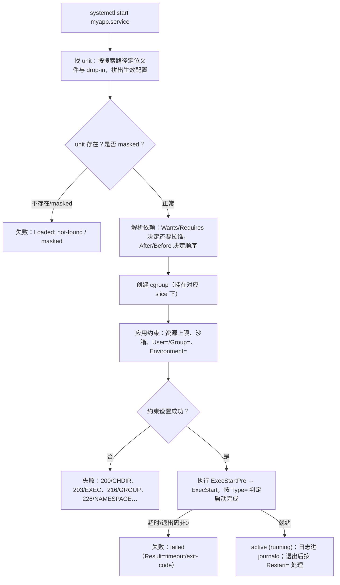

---
tags:
  - Linux
  - systemd
  - 服务管理
  - 前置
created: 2026-09-19
---

# 前置：systemd 的世界观与判定链

> [!cite] 参考资料
> `man 1 systemd`、`man 1 systemctl`、`man 7 systemd.special`、`man 7 systemd.unit`、`man 5 systemd.unit`、`man 5 systemd.service`、`man 5 systemd.slice`、`man 5 systemd.scope`，以及 freedesktop.org 的 systemd 文档与 `systemd.io` 的「Writing Unit Files」。
>
> 本篇结论来自上述资料；涉及本机行为的部分标注了实测环境（Ubuntu 24.04.5 LTS（VMware 虚拟机）/ 内核 6.8.0-139-generic / systemd 255（`255.4-1ubuntu8.17`）/ cgroup v2 / 4 vCPU / `MemTotal` 7894 MiB / **root 的系统级 manager**），用户级 manager 作为对照另标；未实测的按「未实测」处理。

> **这篇讲什么**：先把整章的世界观立起来——PID 1 是什么、systemd 为什么用「unit 文件 + 依赖图」而不是一串启动脚本、unit 家族有哪些成员、以及一条 `systemctl start` 命令背后 systemd 依次做了哪几件事。这一篇不教怎么改配置，只负责让你知道「系统在按什么逻辑工作」。
>
> **必须先读什么**：无。只需要会 shell、用过 `systemctl status` 和 `top`。
>
> **读完能回答**：① PID 1 为什么特殊、`systemd --user` 又是什么？② unit、target、slice、scope 各自是什么关系？③ 一次 `systemctl start myapp` 到底经历了哪些判定，出问题时该去哪一段找证据？
>
> 所属：[[Linux/08_systemd与服务管理/00_导读与知识地图|08 systemd、服务与定时任务]] 的 1.3 前置地基 · 主要练 **S1 服务与任务基线**、**S4 分层定位**

## 0. 30 秒速览

> [!abstract] 这一篇只要记住五句话
> - **systemd 是 PID 1**：内核启动用户态时拉起的第一个进程，所有服务最终都挂在它的进程树或 cgroup 树下面。
> - **它管的是「对象」，不是「脚本」**：每个被管理的东西是一个 **unit**（服务、套接字、定时器、挂载点、目标……），用声明式文件描述「它是什么样」，而不是用一串 `if` 和 `sleep` 描述「怎么启动它」。
> - **unit 之间是一张有向图**：`Wants`/`Requires` 决定「拉起谁」，`After`/`Before` 决定「谁先谁后」，默认全部并行——这就是 systemd 比脚本式启动快的原因，也是「顺序没写对就出问题」的根因。
> - **每个服务同时活在两棵树里**：进程树（`MainPID` 是谁）和 **cgroup 树**（被分到哪个 slice）。`systemctl status` 的 `CGroup:` 行就是这棵 cgroup 树的位置。
> - **一次 `start` 是一串判定**：读 unit → 解析依赖 → 建 cgroup → 应用约束 → 按 `Type=` 判定就绪 → 记日志。**任何服务故障，都先定位到这条链的哪一环**，再谈命令。

## 1. PID 1：为什么它特殊

开机时，内核完成自身初始化后要启动用户态的第一个进程。这个进程就是 **PID 1**。在现代发行版上，它通常是 `systemd`：

```bash
cat /proc/1/comm                      # 验证：PID 1 的进程名，预期输出 systemd
ps -o pid,ppid,comm -p 1              # 验证：PID 1 的 PPID 是 0（它没有父进程）
systemctl --version | head -1         # 验证：systemd 版本，本机实测 systemd 255 (255.4-1ubuntu8.17)
```

PID 1 有三个别人没有的性质：

1. **它是所有用户态进程的祖先**：孤儿进程会被重新挂到 PID 1 名下（具体接管由内核与 systemd 配合完成）。
2. **它负责回收和「收尸」**：其它进程退出后留下的僵尸进程，最终由 PID 1 `wait()` 回收。
3. **内核给它的信号语义不同**：普通进程收到没处理的信号会按默认动作退出，但 **PID 1 会忽略没有显式安装处理函数的信号**（这是内核的保护机制）。所以对 PID 1 `kill -9` 通常无效——这是设计，不是 bug。

systemd 除了当 PID 1，还兼任三件事：

- **服务管理器（service manager）**：读写 unit、维护依赖图、拉起/停止服务。
- **cgroup 管理者**：给每个服务建 cgroup，把资源限制写进去。
- **日志收集者（journald）**：接管服务的 stdout/stderr 与 syslog。

> [!important] `systemd --user`：每个登录用户还有一个「小 systemd」
> 除了系统级的 PID 1，systemd 还会为每个登录用户启动一个**用户级实例** `systemd --user`。本机同时实测了两棵 manager：系统级 `systemctl is-system-running` = `running`，用户级（`realtyz` 登录期间，`Linger=no`）也是 `running`，两者**版本号完全相同**（`255.4-1ubuntu8.17`）。用户级实例管的单元只影响这个用户，跑在 `user@<uid>.service` 这棵 cgroup 子树下。
>
> 这条区别很实用：**用户级不是「小一号的 root」**——它没有特权，无法切换身份。实测在用户单元里写 `User=root`，启动直接失败：`Changing group credentials failed: Operation not permitted`、`status=216/GROUP`。所以本目录的实验**一律在系统级（root）做**：只有系统级才能真换用户（`User=`/`DynamicUser=`）、写系统挂载点、跑 `journalctl --vacuum-*`。反过来说，**用户级仍是很好的对照对象**：两边的 unit 语法、`Type=`、依赖、cgroup 上限完全一致，差别只在特权——这正是理解「哪些选项需要 root」的最佳实验设计。

### 1.1 两棵 manager 的实测对照

同一个 systemd 版本、同一台机器，两棵 manager 的差别集中在「特权」与「可见范围」，这张表是后面所有「为什么这个选项在这里不生效」的底稿（全部为本次系统级 + 用户级实测）：

| 维度 | 系统级 `systemctl`（PID 1） | 用户级 `systemctl --user`（实测 `realtyz`） |
| --- | --- | --- |
| 版本 | `255.4-1ubuntu8.17` | `255.4-1ubuntu8.17`（同一个二进制） |
| `is-system-running` | `running` | `running`（`realtyz` 登录期间；`Linger=no`，注销后实例消失） |
| 服务 cgroup 落点 | `/system.slice/<unit>` | `/user.slice/user-1000.slice/user@1000.service/app.slice/<unit>`（`Slice=app.slice`） |
| 能否换身份（`User=`） | 能，实测服务内 `id -u` = 1000 | 不能，写 `User=root` 报 `216/GROUP` |
| `NoNewPrivileges`/`CapabilityBoundingSet` | 能收敛到 `CapBnd=0` | 同样能设，但本来就只有该用户的能力 |
| 默认句柄上限 | 硬 `524288` / 软 `1024` | 硬 `1048576` / 软 `1024` |
| `systemd-analyze` 开机分析 | `3.922s (kernel) + 2.439s (userspace) = 6.362s` | 只有 `68ms (userspace)`，没有 kernel/firmware 段 |
| 运行前提 | PID 1 一定在跑 | 需要会话环境：`XDG_RUNTIME_DIR`（本机 `/run/user/1000`）与 `DBUS_SESSION_BUS_ADDRESS`；两者都缺时报 `Failed to connect to bus: No medium found` |

最后一行值得记住：那条 `Failed to connect to bus` **不是 WSL2 专属故障**，任何「拿不到会话总线」的场合都会出现（`su` 到非登录会话、cron 里调 `systemctl --user`、容器里没有 `systemd --user`）。看到它先查环境变量与会话，不要怀疑 systemd。

## 2. 世界观：声明式管理 vs 脚本式启动

要理解 systemd 的坑，先要理解它和传统启动脚本的根本不同。

| 维度 | 传统 Shell 启动脚本（SysV init 风格） | systemd unit |
| --- | --- | --- |
| 描述方式 | **过程式**：一步一步 `cd`、`chown`、`su -c`、`start-stop-daemon` | **声明式**：只写「这个服务是什么」（要什么依赖、用什么用户、上限多少），怎么启动由 systemd 决定 |
| 顺序 | 靠脚本里的先后和 `sleep` | 靠 `After=`/`Before=` 显式声明，其余并行 |
| 状态 | 脚本自己维护 pid 文件 | systemd 用 cgroup + `MainPID` 跟踪，服务停止时整个 cgroup 一起收 |
| 资源限制 | 脚本自己 `ulimit` | unit 里声明，systemd 写进 cgroup |
| 日志 | 脚本重定向到文件 | 默认进 journald（`journalctl -u`） |
| 依赖 | 靠 `Required-Start` 注释，弱且难验证 | 有向图，可用 `list-dependencies` 查看 |

一个最小的对比。脚本式（过程式）只描述「怎么启动」：

```bash
start() {
  cd /opt/myapp
  exec su -s /bin/sh myapp -c "/opt/myapp/bin/myapp --config /etc/myapp/config.yaml"
}
```

声明式只描述「是什么」：

```ini
[Service]
WorkingDirectory=/opt/myapp
User=myapp
ExecStart=/opt/myapp/bin/myapp --config /etc/myapp/config.yaml
Restart=on-failure
```

声明式的代价是：**你必须写对，systemd 才按你的意图做**。写错 `Type=` 就假失败，写错小节就被静默忽略，这些坑在子笔记 02、06 展开。

## 3. unit 家族：systemd 到底管什么

「unit」是 systemd 管理对象的总称，按后缀区分类型。你迟早会碰到的成员：

| 类型 | 管什么 | 典型用途 | 后缀 |
| --- | --- | --- | --- |
| `service` | 进程的生命周期 | 自研服务、守护进程 | `.service` |
| `socket` | 监听套接字 / FIFO，可按需激活对应 service | 按需启动、重启服务不断连接 | `.socket` |
| `timer` | 按时间触发另一个 unit | 替代 cron | `.timer` |
| `target` | 一组 unit 的集合 | 启动阶段、`multi-user.target` | `.target` |
| `mount` / `automount` | 挂载点与按需挂载 | `/data`、网络盘 | `.mount` |
| `path` | 监听文件系统路径变化 | 文件一出现就跑任务 | `.path` |
| `slice` | cgroup 层级 | 资源分组（`system.slice`、`user.slice`） | `.slice` |
| `scope` | 外部创建、systemd 只负责纳管的进程组 | 登录会话 `session-1.scope` | `.scope` |
| `device` | 内核设备 | 依赖某个设备就绪 | `.device` |

对新人最常用的只有三个：**`service`（跑服务）、`timer`（定时）、`target`（启动阶段）**；`socket` 会以「服务是 `inactive` 但端口在听」的形式突然出现在你面前，所以也要知道。

unit 有两种存在形态：

- **文件形式**：磁盘上的 `*.service` 等文件，由发行版、软件包或管理员提供。
- **运行时形式（transient）**：由 `systemd-run` 之类命令在内存里临时创建，重启即消失。

## 4. 两棵树：target 与 cgroup 层级

### 4.1 target：启动到哪一步了

**target** 是一组 unit 的集合，用来表达「系统现在到哪一步了」。它替代了旧说法的运行级别：

| target | 一句话 | 旧 runlevel 对应 |
| --- | --- | --- |
| `poweroff.target` | 关机 | 0 |
| `rescue.target` | 单用户救援（挂了一部分文件系统） | 1 |
| `multi-user.target` | 多用户、无图形界面（服务器常态） | 3 |
| `graphical.target` | 多用户 + 图形界面 | 5 |
| `default.target` | 开机默认目标，通常软链到 `graphical.target` 或 `multi-user.target` | — |

服务器上最常打交道的就是 `multi-user.target`：`systemctl get-default` 看默认目标，`systemctl isolate` 可以切到别的目标（属于影响面很大的操作，慎用）。**救援入口（`rescue.target`/`emergency.target`/`systemd.unit=rescue`）在相邻的启动流程阶段展开**，这里只要知道「开机是一个一步步到达某个 target 的过程」就够了。

### 4.2 slice：cgroup 树的分组

systemd 把每个服务放进一棵 **cgroup 树**，`slice` 就是这棵树上的中间节点。本机实测同一个 unit 名在两棵 manager 下的落点：

```text
/system.slice/lab08-limit.service                                            ← 系统级（root 跑的 system 单元）
/user.slice/user-1000.slice/user@1000.service/app.slice/lab08-u-plain.service ← 用户级（realtyz 的 user 单元）
```

```bash
systemctl show -p ControlGroup -p Slice myapp.service   # 验证：系统单元落在 /system.slice，Slice=system.slice
systemctl --user show -p ControlGroup -p Slice myapp.service   # 验证：用户单元落在 user@<uid>.service 下的 app.slice
```

记忆锚点：**系统服务在 `system.slice`，用户服务在 `user.slice`，服务自己还能在 `Unit` 里用 `Slice=` 归到自定义分组**。注意用户单元默认 `Slice=app.slice`（不是 `system.slice`），这解释了「同一个 unit 名在两棵 manager 下互不干扰」。这棵树的直接用途是「按组限资源、按组看占用」——`systemd-cgls` 打印树形结构，`systemd-cgtop` 按组显示 CPU/内存/IO 占用（子笔记 07 展开）。

### 4.3 scope：systemd 只管收纳，不管启动

登录会话（`session-1.scope`）、或者别的进程管理器创建的一组进程，可以被包成 **scope** 交给 systemd 纳管。区别是：**service 由 systemd 启动和停止，scope 由创建它的程序启动和停止，systemd 只负责把它纳入 cgroup 并跟踪**。

## 5. 一条 `systemctl start` 的判定链

把上面这些拼起来，一次 `systemctl start myapp.service` 在 systemd 内部大致是这个顺序：



六个关键点，就是你排障时的六个「检查站」：

1. **找 unit**：文件在不在、是哪一份、有没有被 `mask`（子笔记 02、04、11）。
2. **拼配置**：生效配置 = 原文件 + 所有 drop-in；`daemon-reload` 之后 manager 才知道你改了什么（子笔记 04）。
3. **解析依赖**：`Requires`/`Wants` 拉谁进来，`After`/`Before` 定顺序（子笔记 05）。
4. **建 cgroup 并应用约束**：资源上限、沙箱、用户身份都在这里生效，出错报的是 systemd 退出码（子笔记 07、08）。
5. **按 `Type=` 判定就绪**：`simple`/`forking`/`oneshot`/`notify` 判据完全不同（子笔记 06）。
6. **记日志、管退出**：`journalctl -u` 看现场，`Restart=`/`StartLimit*` 决定接下来发生什么（子笔记 09、10）。

> [!tip] 第一反应不要是「服务起不来，先改配置试试」
> 先确认故障落在上面哪一环。同样一句「服务没起来」：
> - 卡在 2 → 你改的也许根本不是生效文件；
> - 卡在 4 → 是沙箱/工作目录/用户身份，不是业务逻辑；
> - 卡在 5 → 是 `Type=` 判定问题，进程可能一直在跑；
> - 卡在 6 → 服务其实起来了，是退出后被节流或重启策略问题。
>
> **不改配置就能先分清这四种情况**，这才是这一章真正要练的能力。

## 常见坑

| 常见做法或说法 | 后果或事实 |
| --- | --- |
| 「systemd 就是个 `systemctl` 命令」 | 它是 PID 1、服务管理器、cgroup 管理者和日志收集者的合体；`systemctl` 只是它的客户端 |
| 把「服务」写成 `nohup ... &` 塞进 `rc.local` | 没有依赖、没有资源限制、没有日志归集、没有重启策略，systemd 管不到 |
| 认为 `Wants=` 就等于「先起对方再起我」 | 依赖和顺序是两回事，还要写 `After=`（子笔记 05） |
| 以为「顺序写好了就一定会等对方就绪」 | `After=` 只保证「对方启动动作完成」，不保证对方真的能提供服务；就绪要靠 `Type=` 与健康检查 |
| 认为对 PID 1 `kill -9` 能重启系统 | PID 1 忽略未处理信号；正确做法是 `systemctl reboot` 或 `systemctl isolate` |
| 用户级和系统级混用配置 | `User=` 等选项只在 system 单元真的生效（实测 system 单元里 `User=realtyz` 服务内 `id -u` = 1000）；用户单元写 `User=root` 实测报 `216/GROUP`，系统单元写不存在的用户报 `217/USER` |
| 把 `blame` 排序第一名当成开机阻塞源 | `blame` 是「谁初始化花得久」，`critical-chain` 才是「谁挡住了开机」（子笔记 14） |

## 决策练习

> [!question]- 场景：同事说「我这服务明明写的是 `Type=simple`，`ExecStart` 是个会自己切后台的脚本，`systemctl start` 却立刻显示 `inactive (dead)`」。他打算在脚本里加个 `while true; do sleep 60; done` 把进程「撑住」。
> A. 同意——先让它别显示 dead，把服务跑起来再说
> B. 先看 `systemctl show -p Type -p SubState -p MainPID` 与 `journalctl -u`，判定这是不是「`Type=` 判定与进程模型不匹配」，再决定是让程序前台运行还是改 `Type=forking`
> C. 直接 `Restart=always`，让 systemd 一直往回拉
>
> **答案：B。**
> A 用死循环掩盖问题，还多了一个永远不会退出的假主进程。
> C 会让服务陷入重启风暴（配合默认节流很快变成 `start-limit-hit`），根因仍在。
> B 是正解：**先读 `Type=` 与状态，判定卡在第 5 站，再用最小改动对齐进程模型**。详见子笔记 06。

## 要点自测

> [!question]- PID 1 和普通进程有什么不同？为什么它是整个 systemd 体系的根？
> - PID 1 是内核拉起的第一个用户态进程，是所有用户态进程的祖先，负责回收孤儿与僵尸进程。
> - 内核给它不同的信号语义：**未安装处理函数的信号会被它忽略**，所以 `kill -9 1` 通常无效。
> - 它在现代发行版上就是 systemd：同时是服务管理器、cgroup 管理者和日志收集者。
> - **第一反应不要是什么**：不要试图用 `kill` 重启 PID 1，也不要在 `ps` 里看到它的子进程 `killed` 就以为系统崩了。

> [!question]- unit、target、slice、scope 四者是什么关系？
> - **unit** 是总称，任何被 systemd 管理的对象都是 unit。
> - **target** 是一组 unit 的集合，表达「启动到哪一步」，如 `multi-user.target`。
> - **slice** 是 cgroup 树上的分组节点，service/scope 都落在某个 slice 下。
> - **scope** 是外部创建、systemd 只负责纳管的进程组（如登录会话），与「由 systemd 启动」的 service 相对。
> - **第一反应不要是什么**：不要把 target 当成「一个大服务」，它本身不做事，只决定「哪些 unit 该被拉起」。

> [!question]- 一次 `systemctl start` 会依次做哪几件事？出问题时你怎么用它来分工？
> - 找 unit → 拼出生效配置 → 解析依赖与顺序 → 建 cgroup → 应用资源/沙箱/用户约束 → 按 `Type=` 起点并判定就绪 → 记录日志与退出。
> - 排障时逐段问：「文件找对了吗（`cat`/`show -p FragmentPath`）」「依赖拉对了吗（`list-dependencies`）」「约束过得了吗（退出码）」**「判定标准对吗（`Type=`）」**「日志与退出码是什么」。
> - **第一反应不要是什么**：不要在没定位到具体检查站之前就改配置——那会把「一个已知错因」变成「两个未知变量」。

> 上一篇：无，这是本目录的第一篇 ｜ 下一篇：[[Linux/08_systemd与服务管理/02_前置_unit文件语法与位置|02 前置：unit 文件语法与位置]]
