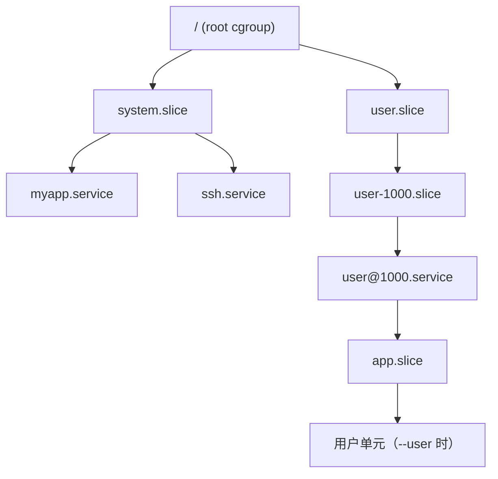

---
tags:
  - Linux
  - systemd
  - cgroup
  - 资源限制
created: 2026-09-19
---

# 第 4 站：约束（cgroup 与资源上限）

> [!cite] 参考资料
> `man 5 systemd.resource-control`、`man 5 systemd.exec`（`Limit*=` 系列）、`man 5 systemd.slice`、`man 5 systemd.scope`、`man 1 systemd-cgls`、`man 1 systemd-cgtop`、`man 1 systemd-run`、`man 5 systemd-system.conf`（`DefaultLimit*`），以及内核文档 `Documentation/admin-guide/cgroup-v2.rst`。
>
> **实测状态**：**实测环境：Ubuntu 24.04.5 LTS（VMware 虚拟机）/ 内核 `6.8.0-139-generic` / systemd 255（`255.4-1ubuntu8.17`）/ cgroup2fs（v2，控制器 `cpuset cpu io memory hugetlb pids rdma misc`）/ 4 vCPU / `MemTotal` 7894 MiB / root 可用。** 本篇输出已在本实验机的**系统级 system 单元**（`/system.slice/lab08-limit.service` 等）上重跑，替换了原 WSL2 的**用户级**输出；原「system 单元的行为未实测」一条**已全部升级为实测**（含 cgroup 文件、OOM、CPU 配额、`systemd-run`）。仍未实测：cgroup v1（本机与 WSL2 都是 v2，没有 v1 环境可测）。

> **这篇讲什么**：一个服务启动后，systemd 会给它一个「笼子」——cgroup。这一篇讲清这个笼子怎么搭（slice 层级）、笼子上能挂哪些上限（句柄、内存、CPU、任务数）、以及**这些上限为什么写在 unit 里而不是 `limits.conf`**。
>
> **必须先读什么**：[[Linux/08_systemd与服务管理/01_前置_systemd的世界观与判定链|01 前置：systemd 的世界观与判定链]]（第 4 节的 slice/cgroup 树）。
>
> **读完能回答**：① 一个服务的资源上限有哪几个落点，为什么 `limits.conf` 对它无效？② `MemoryMax=`/`MemoryHigh=`/`CPUQuota=` 各是什么语义？③ systemd 写的限制怎么在 `/sys/fs/cgroup` 里验证？④ `systemd-run` 怎么临时给一个命令套上限制？
>
> 所属：[[Linux/08_systemd与服务管理/00_导读与知识地图|08 systemd、服务与定时任务]] 的第 4 站 · 主要练 **S5 资源与权限约束**

## 0. 30 秒速览

> [!abstract] 这一篇只要记住六句话
> - **每个 service 都会被放进一个 cgroup**，挂在某个 slice 下。实测 system 单元落点就是 `/system.slice/lab08-limit.service`、`Slice=system.slice`——**路径短、一眼能看懂，这是系统级相对用户级的一个实际便利**（用户单元落点是 `/user.slice/user-1000.slice/user@1000.service/app.slice/<unit>`）。
> - **上限写在 unit 里，不是 `limits.conf`**：`limits.conf` 由 PAM 在**登录会话**生效，`ulimit` 只影响当前进程树，systemd 服务走 unit 的 `LimitNOFILE=`。**这就是「改了 `limits.conf` 对服务不生效」的原因。**
> - **实测三方一致**：`LimitNOFILE=64` → `systemctl show` 是 64、服务内 `ulimit -n` 是 64、`/proc/<MainPID>/limits` 是 `64 64`。
> - **system 单元的默认句柄上限是两个数**：`LimitNOFILE=524288`（硬）与 `LimitNOFILESoft=1024`（软）。**只看 `show -p LimitNOFILE` 会把硬上限当成服务实际可用值而误判**——服务内 `soft=1024 hard=524288`。
> - **内存有两个上限**：`MemoryMax=` 是硬上限（实测 `memory.max=33554432`，触顶后 cgroup OOM，`Result=oom-kill`），`MemoryHigh=` 是软上限（只限速不杀，实测默认 `max`）。CPU 的 `CPUQuota=` 是**配额**：实测 `10%` → `cpu.max=10000 100000`，`20%` 的忙循环在 10.1 秒墙钟里只拿到 **2.02 秒 CPU**（无配额对照组 10.01 秒）。
> - **`systemd-run` 是「给一条命令套上 unit 限制」的快捷方式**，但**选项有类型之分**：实测 `-p LimitNOFILE=64` 在 `--scope` 上被拒（`Unknown assignment`），改成 transient service 才成立。

## 1. 服务的笼子：cgroup 树

systemd 启动每个 service 时，会在 cgroup 树里建一个同名节点。本机实测一个 **system 服务**的位置：

```text
$ systemctl show -p ControlGroup -p Slice lab08-limit.service
Slice=system.slice
ControlGroup=/system.slice/lab08-limit.service
$ journalctl -u lab08-limit.service -o cat --no-pager | grep self_cgroup
self_cgroup=0::/system.slice/lab08-limit.service
```

```bash
systemctl show -p ControlGroup myapp.service          # 验证：服务在 cgroup 树里的相对路径
systemctl show -p Slice myapp.service                 # 验证：它归到哪个 slice
systemd-cgls --no-pager | head -30                    # 验证：树形结构（谁在哪个 slice 下）
systemd-cgtop --order=memory -n 1                     # 验证：按组显示 CPU/内存/IO 占用
```

`systemd-cgls` 看到的叶子节点就是那个服务自己的进程：

```text
$ systemd-cgls --no-pager /system.slice/lab08-limit.service
CGroup /system.slice/lab08-limit.service:
└─26943 sleep 180
```

层级关系用一张图看清（括号里是本机实测到的真实节点）：



三个直接用途：

1. **按服务看占用**：`systemd-cgtop` 排名，比逐个 `ps` 快。实测一次采样（`systemd-cgtop --order=memory -n 1`，按内存从高到低；为节省篇幅节选了前 10 行）：

   ```text
   user.slice                                     41      -     2.7G        -        -
   user.slice/user-0.slice                        41      -     2.6G        -        -
   /                                             321      -   689.4M        -        -
   system.slice                                   56      -   314.5M        -        -
   system.slice/systemd-udevd.service              1      -    23.0M        -        -
   system.slice/multipathd.service                 7      -    22.1M        -        -
   system.slice/unattended-upgrades.service        2      -    21.9M        -        -
   system.slice/systemd-journald.service           1      -    12.9M        -        -
   init.scope                                      1      -    10.2M        -        -
   system.slice/ssh.service                        1      -     9.4M        -        -
   ```

   **这张表本身就是「为什么要用系统级」的一个论据**：从系统级往下看，`user.slice`/`system.slice`/`init.scope` 一整棵树都在视野里；在用户级看，你只看到自己那棵子树。
2. **按组限资源**：service 与 slice 都能挂资源控制项，子节点受父节点约束。
3. **按组收进程**：stop 服务时 `KillMode=control-group` 会把整个 cgroup 清掉，不留孤儿（子笔记 10）。

> [!important] `Slice=` 能自定义分组，但要先建 slice
> `Slice=myservices.slice` 可以把多个服务归到同一组，便于统一限资源或统一观察。**自定义 slice 会被隐式创建**——本机实测直接写 `Slice=lab-review.slice` 就能启动成功，`systemctl status` 显示 `Loaded: loaded`；只有当你想给这个 slice 本身挂资源上限、或想让它被单独管理时，才需要自己写一个 `.slice` 文件（否则用 `systemd-run --slice=` 与 `systemctl set-property` 也能临时配置）。普通业务按 `system.slice`/`user.slice` 理解就够了。

## 2. 三套资源限制，别搞混

同一个「句柄上限」，在系统里有三个完全不同的落点：

| 落点 | 谁设置 | 作用范围 | 什么时候生效 | 对 systemd 服务有用吗 |
| --- | --- | --- | --- | --- |
| `/etc/security/limits.conf`（`pam_limits`） | PAM | **登录会话**（`login`/`su`/`sudo`/`cron` 等引用 PAM 的路径） | 登录时 | **无效**，服务不经过登录会话 |
| `ulimit`（shell 内置） | 你 | 当前 shell 及其子进程 | 敲下即生效，随 shell 结束消失 | 只在你手动启动服务时才有意义 |
| unit 里的 `LimitNOFILE=` 等 | systemd | **该服务进程** | 服务启动时由 systemd 应用 | **这才是正解** |

三者对照与 manager 默认值：

```bash
systemctl show myapp.service -p LimitNOFILE -p LimitNOFILESoft -p LimitNPROC   # ① unit 的生效值（注意硬/软是两个属性）
journalctl -u myapp.service -o cat | grep ulimit        # ② 服务内看到的（如果它打印过）
cat /proc/<MainPID>/limits | grep -i files             # ③ 进程实际值
systemctl show -p DefaultLimitNOFILE -p DefaultLimitNOFILESoft --value   # ④ manager 的默认值
```

本机实测同一件事的三个视图完全一致（`LimitNOFILE=64`）：

```text
$ systemctl show -p LimitNOFILE lab08-limit.service
LimitNOFILE=64
$ journalctl -u lab08-limit.service -o cat --no-pager | grep ulimit
ulimit_n=64
$ cat /proc/26943/limits | grep -i 'open files'
Max open files            64                   64                   files
```

> [!warning] 默认值是「硬 524288 / 软 1024」两个数
> 本机实测 manager 默认：`DefaultLimitNOFILE=524288`、`DefaultLimitNOFILESoft=1024`；一个什么都没写的 system 单元服务内看到的是 **`soft=1024 hard=524288`**。**只跑 `systemctl show -p LimitNOFILE` 会看到 524288，很容易得出「我的服务有 50 万句柄」的错误结论**——真实可用的是软值 1024（除非程序自己抬高到硬值）。要核对就同时看 `-p LimitNOFILESoft` 和服务内的 `/proc/<pid>/limits`。
>
> 对照一下用户级：同一个 manager 版本下用户单元的 `LimitNOFILE=1048576`、`DefaultLimitNOFILE=1048576`（`DefaultTasksMax=9374` 两边相同）——**两棵 manager 的默认句柄值并不一样**，迁移 unit 时别把默认值当成跨环境常量。

> [!tip] 一句话记住落点
> **「登录会话的账」找 `limits.conf`，「这个服务的账」找 unit 的 `Limit*=`。** 生产上「服务句柄不够」几乎永远该改 unit。

## 3. 常用资源控制项

### 3.1 句柄与进程数

| 键 | 作用 | 验证 |
| --- | --- | --- |
| `LimitNOFILE=` / `LimitNOFILESoft=` | 硬 / 软打开文件描述符上限 | `show -p LimitNOFILE -p LimitNOFILESoft`、服务内 `ulimit -n`、`/proc/<pid>/limits` |
| `LimitNPROC=` | 进程/线程数上限（rlimit） | `show -p LimitNPROC`；实测默认 `31249` |
| `TasksMax=` | **cgroup 层**的任务数上限（比 `LimitNPROC` 更可靠） | `show -p TasksMax`、`cat /sys/fs/cgroup/.../pids.max`；实测写 16 → `pids.max = 16` |
| `LimitCORE=` | core dump 大小（配合崩溃取证） | `show -p LimitCORE` |

`LimitNOFILE` 与 `TasksMax` 的差别值得记：前者是 `setrlimit` 语义（每个进程各自一份），后者是 cgroup 的 `pids.max`（整个控制组共享一份）。**「fork 炸弹」类问题要看 `TasksMax`。** 实测设置 `TasksMax=16` 后 cgroup 文件里确实是 `pids.max = 16`（当时 `pids.current = 1`）。

### 3.2 内存

| 键 | 语义 | 触顶时 |
| --- | --- | --- |
| `MemoryHigh=` | 软上限 | 开始限速、加大回收压力，但不杀进程（实测默认 `max`，即不限） |
| `MemoryMax=` | 硬上限 | 回收后仍超就触发 cgroup OOM |
| `MemoryMin=` | 硬保底内存 | 低于此值时不会被回收（除非系统整体 OOM） |
| `MemoryLow=` | 尽力保底内存 | 尽力保护；内存紧张时仍可能被回收，但比普通内存更晚 |
| `MemorySwapMax=` | swap 上限 | 限制该组能换出多少（实测写 0 → `memory.swap.max=0`） |

```bash
systemctl show myapp.service -p MemoryMax -p MemoryHigh -p MemoryCurrent -p MemoryPeak
C=$(systemctl show -p ControlGroup --value myapp.service)
cat "/sys/fs/cgroup$C/memory.max"       # 验证：硬上限的字节数（本机实测 32M → 33554432）
cat "/sys/fs/cgroup$C/memory.current"   # 验证：当前占用
cat "/sys/fs/cgroup$C/memory.peak"      # 验证：历史峰值
cat "/sys/fs/cgroup$C/memory.events"    # 验证：max/oom/oom_kill 计数
```

本机实测一次真实的 cgroup OOM（`MemoryMax=64M`、`MemorySwapMax=0`、进程持续申请内存）：

```text
$ systemctl show -p MemoryMax -p MemorySwapMax -p Result -p ExecMainStatus -p ActiveState lab08-oom.service
MemoryMax=67108864
MemorySwapMax=0
Result=oom-kill
ExecMainStatus=9
ActiveState=failed
```

```text
allocated ~17 MiB
allocated ~33 MiB
allocated ~49 MiB
lab08-oom.service: A process of this unit has been killed by the OOM killer.
lab08-oom.service: Main process exited, code=killed, status=9/KILL
lab08-oom.service: Failed with result 'oom-kill'.
kernel: oom-kill:constraint=CONSTRAINT_MEMCG,nodemask=(null),cpuset=/,mems_allowed=0,oom_memcg=/system.slice/lab08-oom.service,task_memcg=/system.slice/lab08-oom.service,task=python3,pid=27501,uid=0
kernel: Memory cgroup out of memory: Killed process 27501 (python3) total-vm:79664kB, anon-rss:65152kB, file-rss:6912kB, shmem-rss:0kB, UID:0 pgtables:192kB oom_score_adj:0
```

三点值得记住：① 触发条件是 `constraint=CONSTRAINT_MEMCG`（**是 cgroup 限制触发的，不是整机内存不够**），`oom_memcg` 精确指到 `/system.slice/lab08-oom.service`；② 结果码是 `Result=oom-kill`、`ExecMainStatus=9`（SIGKILL），**不是普通退出码**；③ 从开始吃到被杀只用了 **2.029 秒**。

**默认行为是「整组连坐」**：`OOMPolicy=` 默认 `stop`，所以进程被杀后单元变成 `failed`。想让它「杀一个、单元继续活」，用 `OOMPolicy=continue`——实测同一个占用模式：

```text
$ systemctl show -p OOMPolicy -p Result -p ActiveState -p SubState -p MemoryCurrent -p MemoryPeak lab08-oom2.service
OOMPolicy=continue
Result=success
ActiveState=active
SubState=running
MemoryCurrent=4063232
MemoryPeak=67108864

$ cat /sys/fs/cgroup/system.slice/lab08-oom2.service/memory.events
low 0
high 0
max 38
oom 1
oom_kill 1
oom_group_kill 0
```

`memory.events` 是这条路上最硬的证据：`oom_kill 1` 说明**确实杀过一个**，但 `Result=success`、单元还 `active (running)`。**看到 `memory.events` 里有 `oom_kill` 而单元状态正常，就说明是 `OOMPolicy=continue` 兜住了**——这类「服务没挂但业务少了几个 worker」的故障，只查 `systemctl status` 是看不出来的。

### 3.3 CPU 与 IO

| 键 | 语义 | 验证 |
| --- | --- | --- |
| `CPUQuota=` | 每个周期最多用多少算力（配额），如 `10%`、`200%` | `show -p CPUQuotaPerSecUSec`、`cpu.max` |
| `CPUWeight=` | 相对权重（争抢时谁多分），默认 100 | `cpu.weight` |
| `CPUAffinity=` / `AllowedCPUs=` | 绑核 | `show -p CPUAffinity` |
| `IOWeight=` / `IOReadBandwidthMax=` | IO 权重 / 带宽上限 | `io.weight` |

```bash
systemctl show lab08-limit.service -p LimitNOFILE -p MemoryMax -p CPUQuotaPerSecUSec -p MemoryCurrent
C=$(systemctl show -p ControlGroup --value lab08-limit.service)
cat "/sys/fs/cgroup$C/memory.max"   # 33554432
cat "/sys/fs/cgroup$C/cpu.max"      # 10000 100000 → 10000/100000 = 10%
cat "/sys/fs/cgroup$C/pids.max"     # 16
```

本机实测的那一组原始值：

```text
MemoryCurrent=196608
CPUQuotaPerSecUSec=100ms
IOWeight=50
MemoryHigh=infinity
MemoryMax=33554432
TasksMax=16
LimitNOFILE=64
LimitNPROC=31249
```

以及 cgroup 文件侧（**这才算「追到内核」**）：

```text
memory.max = 33554432|
memory.high = max|
memory.current = 196608|
memory.peak = 1572864|
cpu.max = 10000 100000|
cpu.weight = 100|
pids.max = 16|
pids.current = 1|
io.weight = default 50|
```

> [!important] `CPUQuota=` 是配额，不是亲和——用数字看最清楚
> 同一条忙循环（`while :; do :; done`）跑约 10 秒，只差一个 `CPUQuota=`：
>
> | 单元 | `cpu.max` | 10 秒墙钟内累计 CPU | `nr_periods` | `nr_throttled` | `throttled_usec` |
> | --- | --- | --- | --- | --- | --- |
> | 无配额 | `max 100000` | `usage_usec 10010754`（10.01 秒） | 0 | 0 | 0 |
> | `CPUQuota=20%` | `20000 100000` | `usage_usec 2022027`（2.02 秒） | 101 | 100 | `7993166` |
>
> 也就是说 20% 的配额在 **4 vCPU** 机器上等价于「每 100 毫秒周期最多用 20 毫秒单核算力」，**不是**「不超过 1 个核的 20%」也不是「绑到某个核上」；`nr_throttled=100/101` 说明它几乎每个周期都被限流。要绑核用 `CPUAffinity=`/`AllowedCPUs=`；`CPUWeight=` 只在有竞争时才起作用，空闲时不会限制（实测 `cpu.weight = 100`）。

## 4. 默认值与基线

本机实测（systemd 255）的默认值，**同一行同时给出系统级与用户级，便于发现「默认值不可跨 manager 照抄」**：

| 属性 | 系统级（system 单元） | 用户级（`--user`） | 说明 |
| --- | --- | --- | --- |
| `LimitNOFILE`（硬） | `524288` | `1048576` | 来自各自 manager 的 `DefaultLimitNOFILE` |
| `LimitNOFILESoft`（软） | `1024` | `1024` | **服务实际可用的是这个** |
| `LimitNPROC` | `31249` | `31249` | 两边相同 |
| `TasksMax` | `9374` | `9374` | 两边相同 |
| `KillMode` | `control-group` | `control-group` | 停止时杀整个控制组 |
| `TimeoutStopUSec` | `1min 30s` | `1min 30s` | 停止超时后 SIGKILL |
| `RestartUSec` | `100ms` | `100ms` | `RestartSec=` 的默认值 |
| `DefaultMemoryAccounting` | `yes` | `yes` | 内存计量默认开 |

一份最小资源基线（只读，生产机可做）：

```bash
for u in $(systemctl list-units --type=service --state=running --no-legend | awk '{print $1}'); do
  systemctl show "$u" -p Id -p MemoryMax -p CPUQuotaPerSecUSec -p LimitNOFILE -p LimitNOFILESoft -p TasksMax
done
```

## 5. `systemd-run`：临时给一条命令套上限制

不想写 unit、只想验证「这个限制管不管用」时，用 `systemd-run` 起一个临时的 transient 单元。**注意两类选项不能混用**：

```bash
systemd-run --scope -p MemoryMax=64M /bin/bash -c 'ulimit -n'                      # ① scope：能挂 cgroup 属性
systemd-run --scope -p MemoryMax=64M -p LimitNOFILE=64 /bin/bash -c 'ulimit -n'    # ② 会失败：LimitNOFILE 是 exec 属性
systemd-run --unit=lab08-run -p MemoryMax=64M -p LimitNOFILE=64 /bin/bash -c 'ulimit -n'   # ③ transient service：两类都能挂
```

实测：

```text
$ systemd-run --scope -p MemoryMax=64M /bin/bash -c 'cat /proc/self/cgroup'
Running as unit: run-r0b7ab871ab654e01aa721887f44b549c.scope; invocation ID: d40aa2b284b24923b24d6bb30e3c325c
scope cgroup=0::/system.slice/run-r0b7ab871ab654e01aa721887f44b549c.scope memmax=67108864

$ systemd-run --scope -p MemoryMax=64M -p LimitNOFILE=64 /bin/bash -c 'ulimit -n'
Unknown assignment: LimitNOFILE=64

$ systemd-run --unit=lab08-run2 -p MemoryMax=64M -p LimitNOFILE=64 /bin/bash -c 'ulimit -n'
Running as unit: lab08-run2.service; invocation ID: ed3260b38c00404eb2877607a613c9cb
svc ulimit=64 cgroup=0::/system.slice/lab08-run2.service
Finished with result: success
```

含义：**`--scope` 只能挂「cgroup 资源控制」属性（`MemoryMax=`、`CPUQuota=`…），`Limit*=` 这类「exec 属性」必须用 transient service**。这个区分在临时压测时很容易踩——你以为限制上了，其实命令直接没跑起来（或者反过来，scope 里写 `LimitNOFILE=` 被忽略）。

后台起一个带限制的临时服务，并指定名字便于观察（实测瞬态服务同样落在 `/system.slice` 下）：

```bash
systemd-run --unit=lab08-stress -p MemoryMax=64M -p CPUQuota=20% /bin/bash -c 'while :; do :; done'
systemctl show lab08-stress.service -p MemoryMax -p CPUQuotaPerSecUSec -p ControlGroup
systemctl stop lab08-stress.service
```

```text
ControlGroup=/system.slice/lab08-run.service
CPUQuotaPerSecUSec=200ms
MemoryMax=67108864
```

> [!warning] `systemd-run` 起的单元是临时的
> 它在内存里创建，重启或停止即消失，适合压测与验证；**不要用它替代正式服务**（没有自启、没有持久化配置）。要长期存在的限制必须写进 unit。用完**记得 `systemctl stop`**——transient 单元会留下常驻进程（本机实验结束后逐个核查过）。

### 实验 4：资源上限的生效与验证

> [!example]- 实验 4：把「unit 里的数字」追到「cgroup 里的文件」
> **怎么做**：在 `/etc/systemd/system/` 建 `lab08-limit.service`，写 `LimitNOFILE=64`、`MemoryMax=32M`、`CPUQuota=10%`、`TasksMax=16`，`ExecStart` 打印 `ulimit -n` 后 `sleep 180`。`daemon-reload` 后启动，依次跑 `systemctl show -p LimitNOFILE -p MemoryMax -p CPUQuotaPerSecUSec -p TasksMax -p ControlGroup`、`journalctl -u lab08-limit -o cat`、`systemd-cgls`、以及 `cat /sys/fs/cgroup$C/{memory.max,cpu.max,pids.max}`。再起一个 `CPUQuota=20%` 的忙循环跑 10 秒，和无配额的对照比 `cpu.stat`。
> **预期**：`show` 显示 `LimitNOFILE=64`、`MemoryMax=33554432`、`CPUQuotaPerSecUSec=100ms`、`TasksMax=16`、`ControlGroup=/system.slice/lab08-limit.service`；服务内 `ulimit_n=64`；cgroup 文件分别是 `33554432`、`10000 100000`、`16`；配额组 10 秒只拿到约 `2022027` 微秒 CPU，对照组约 `10010754`。
> **风险**：低（自建 system 单元、`sleep` 与受配额的忙循环；**CPU 配额已限死，不会长时高负载**）；**耗时**：约 15 分钟；**回滚**：`systemctl stop lab08-limit.service`、`rm -f /etc/systemd/system/lab08-*.service`、`daemon-reload`、`reset-failed`。
> **补充（可选，风险中）**：把 `MemoryMax=64M` + `MemorySwapMax=0` 加到一个故意申请内存的脚本上，观察 `Result=oom-kill`、`ExecMainStatus=9` 与 `memory.events` 的 `oom_kill 1`。本机实测从开始吃到被杀 **2.029 秒**；**只在可快照实验机做，且绝不针对整机内存**。
> 机器：任意有 root 的可快照实验机；cgroup v1 环境需要另做（**本机未实测，理由是本机是 cgroup v2，没有可用的 v1 环境**）。

## 常见坑

| 常见做法或说法 | 后果或事实 |
| --- | --- |
| 在 `limits.conf` 里调大 `nofile` 来解决服务句柄不足 | 服务不经过登录会话；要改 unit 的 `LimitNOFILE=` |
| 用 `systemctl show -p LimitNOFILE` 判断服务实际句柄数 | 那是**硬**上限（默认 524288）；实际可用是软值（默认 1024）。要同时看 `-p LimitNOFILESoft` 与 `/proc/<pid>/limits` |
| 把用户级的默认值当成通用默认值 | 实测系统级 `LimitNOFILE=524288`、用户级 `1048576`；unit 里不写就跟着各自 manager 走 |
| 只设 `LimitNPROC=` 防 fork 炸弹 | `LimitNPROC` 是每进程的 rlimit；cgroup 层的 `TasksMax=` 更可靠 |
| 把 `MemoryMax=` 当「超过就杀」 | 它先触发回收，回收后仍超才 OOM；`MemoryHigh=` 是只限速的软上限 |
| 以为 `CPUQuota=10%` = 绑定 0.1 个核 | 它按周期配额计算：实测 `20%` → `cpu.max=20000 100000`，10 秒只拿到 2.02 秒 CPU、101 个周期里 100 个被限流 |
| 看到 OOM 杀了进程就断定「内存不够」 | 先看内核那行的 `constraint=CONSTRAINT_MEMCG` 与 `oom_memcg=`：那是**cgroup 上限**触发的，不是整机内存不足 |
| 用 `systemctl status` 判断服务有没有被 OOM 过 | `OOMPolicy=continue` 时单元仍是 `active (running)`；要查 `/sys/fs/cgroup/.../memory.events` 的 `oom_kill` |
| 只设 unit 不改 slice | 子节点仍受父 slice 约束；排查时要 `systemd-cgls` 看整棵树 |
| 在 `systemd-run --scope` 上挂 `-p LimitNOFILE=` | 实测 `Unknown assignment: LimitNOFILE=64`——它是 exec 属性，`--scope` 只接受 cgroup 资源属性；要改用 transient service |
| 用 `systemd-run` 起的临时服务当正式服务 | 没有自启、重启即失；正式限制要写 unit，且用完要 `stop` 掉 |
| 只看 `systemctl show` 不看 cgroup 文件 | `show` 是 systemd 的视图，cgroup 文件是内核的最终事实，两者都要看 |

## 决策练习

> [!question]- 场景：一个 Java 服务在生产上偶发 `Too many open files`，同事已经在 `/etc/security/limits.conf` 里把 `nofile` 调到 65535，还 `systemctl daemon-reexec` 过，问题仍在。
> A. 继续调大 `limits.conf`，并重启机器
> B. 看 `systemctl show -p LimitNOFILE -p LimitNOFILESoft <unit>`，在 unit 的 drop-in 里设 `LimitNOFILE=`，`daemon-reload` + `restart`，再用 `/proc/<MainPID>/limits` 验收
> C. 直接把服务改成 root 运行，绕开限制
> **答案：B。**
> A 对 systemd 服务不起作用（它不经过登录会话），重启机器也不改变这一点。
> C 提高了风险，且没有解决「上限」这件事。
> B 是正解：**systemd 服务的 rlimit 来自 unit 的 `Limit*=`，验收要看进程的 `/proc/<pid>/limits`**；顺带注意「硬值不等于可用值」——本机默认硬 524288、软 1024。

## 要点自测

> [!question]- `limits.conf`、`ulimit`、`LimitNOFILE` 三者的关系与生效范围？
> - `limits.conf`：由 PAM 的 `pam_limits` 在**登录会话**里设置 rlimit，对 systemd 服务无效。
> - `ulimit`：shell 内置，只影响当前 shell 及其子进程，随 shell 结束消失。
> - `LimitNOFILE=`：unit 设置，由 systemd 在创建服务进程时应用；默认来自 manager 的 `DefaultLimitNOFILE`（本机实测系统级硬 `524288` / 软 `1024`，用户级 `1048576`）。
> - 验收：`systemctl show -p LimitNOFILE -p LimitNOFILESoft <unit>` + `/proc/<MainPID>/limits`。
> - **第一反应不要是什么**：不要在 `limits.conf` 里反复加行——对 systemd 服务它永远不生效。

> [!question]- `MemoryMax=` 与 `MemoryHigh=` 有什么区别？`CPUQuota=` 是限制还是保证？
> - `MemoryHigh=` 是软上限：超过后开始限速、加大回收压力，但不杀进程（实测默认 `max`）。
> - `MemoryMax=` 是硬上限：回收后仍超就触发 **cgroup** OOM——实测 `Result=oom-kill`、`ExecMainStatus=9`、内核行 `constraint=CONSTRAINT_MEMCG` 且 `oom_memcg=/system.slice/<unit>`。
> - `CPUQuota=` 是**上限（配额）**，不是保证；要保证份额用 `CPUWeight=` 的相对权重语义（实测 `cpu.weight=100`，空闲时不起作用）。
> - **第一反应不要是什么**：不要把 `MemoryMax=` 当成「超过立刻 OOM」的开关（它有一个回收过程），也不要把 OOM 一律归因于整机内存不足。

> [!question]- 怎么把一个 unit 里的资源和 cgroup 里的实际文件对应起来？
> - `systemctl show -p MemoryMax` 显示的是换算成字节的值（`32M` → `33554432`）。
> - `systemctl show -p ControlGroup` 给出 cgroup 路径（system 单元就是 `/system.slice/<unit>`），拼上 `/sys/fs/cgroup` 就是真实文件：`memory.max`、`memory.high`、`memory.peak`、`memory.events`、`cpu.max`、`pids.max`。
> - 两者一致，说明 systemd 已经把配置写进内核；不一致，说明配置没生效或还有上层 slice 约束。
> - **第一反应不要是什么**：不要只看 `show` 的输出——内核 cgroup 文件才是最终事实；也不要漏掉 `memory.events`，那是「有没有真被杀过」的唯一凭证。

> [!question]- 用户级 manager 和系统级 manager 在资源约束上有什么实质差别？
> - **cgroup 落点不同**：系统单元在 `/system.slice/<unit>`，用户单元在 `/user.slice/user-<uid>.slice/user@<uid>.service/app.slice/<unit>`；从系统级 `systemd-cgtop` 能看到整棵树，从用户级只看到自己那棵。
> - **默认值不同**：实测系统级 `LimitNOFILE=524288`，用户级 `1048576`（`TasksMax` 两边都是 9374）。
> - **能管到的范围不同**：用户级可以给自己那棵子树挂 `MemoryMax=`/`CPUQuota=`，但管不到系统级 slice。
> - **第一反应不要是什么**：不要因为「用户级也能写 `MemoryMax=`」就以为两边等价——先把 unit 迁到系统级，再谈默认值与观察口径。

> 上一篇：[[Linux/08_systemd与服务管理/06_第3站_判定_什么算启动完成|06 第 3 站：判定（什么算启动完成）]] ｜ 下一篇：[[Linux/08_systemd与服务管理/08_第5站_隔离_沙箱与最小权限|08 第 5 站：隔离（沙箱与最小权限）]]
