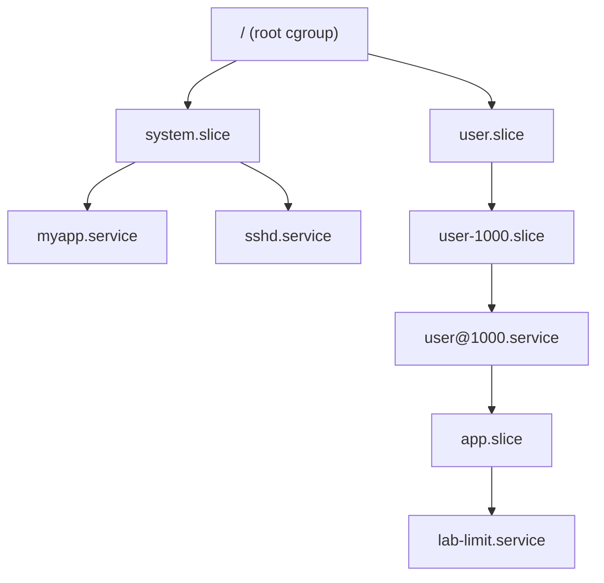

---
tags:
  - Linux
  - systemd
  - cgroup
  - 资源限制
created: 2026-09-19
---

# 第 4 站：约束（cgroup 与资源上限）

> [!cite] 参考资料
> `man 5 systemd.resource-control`、`man 5 systemd.exec`（`Limit*=` 系列）、`man 5 systemd.slice`、`man 5 systemd.scope`、`man 1 systemd-cgls`、`man 1 systemd-cgtop`、`man 1 systemd-run`、`man 5 systemd-system.conf`（`DefaultLimit*`），以及内核文档 `Documentation/admin-guide/cgroup-v2.rst`。
>
> 实测输出来自 Ubuntu 24.04.4（WSL2）/ 内核 `6.6.87.2` / systemd 255 / **cgroup v2** / 非 root `uid=1000` 的用户级 systemd。cgroup v1 与 system 单元的行为差异标注为「未实测」。

> **这篇讲什么**：一个服务启动后，systemd 会给它一个「笼子」——cgroup。这一篇讲清这个笼子怎么搭（slice 层级）、笼子上能挂哪些上限（句柄、内存、CPU、任务数）、以及**这些上限为什么写在 unit 里而不是 `limits.conf`**。
>
> **必须先读什么**：[[Linux/08_systemd与服务管理/01_前置_systemd的世界观与判定链|01 前置：systemd 的世界观与判定链]]（第 4 节的 slice/cgroup 树）。
>
> **读完能回答**：① 一个服务的资源上限有哪几个落点，为什么 `limits.conf` 对它无效？② `MemoryMax=`/`MemoryHigh=`/`CPUQuota=` 各是什么语义？③ systemd 写的限制怎么在 `/sys/fs/cgroup` 里验证？④ `systemd-run` 怎么临时给一个命令套上限制？
>
> 所属：[[Linux/08_systemd与服务管理/00_导读与知识地图|08 systemd、服务与定时任务]] 的第 4 站 · 主要练 **S5 资源与权限约束**

## 0. 30 秒速览

> [!abstract] 这一篇只要记住六句话
> - **每个 service 都会被放进一个 cgroup**，挂在某个 slice 下；这既是「按组看占用」的基础，也是「按组限资源」的载体。
> - **上限写在 unit 里，不是 `limits.conf`**：`limits.conf` 由 PAM 在**登录会话**生效，`ulimit` 只影响当前进程树，systemd 服务走 unit 的 `LimitNOFILE=`。**这就是「改了 `limits.conf` 对服务不生效」的原因。**
> - **实测**：`LimitNOFILE=64` → 服务内 `ulimit -n` 为 64、`systemctl show` 也是 64；`MemoryMax=32M` → cgroup `memory.max=33554432`；`CPUQuota=10%` → `cpu.max=10000 100000`。
> - **内存有两个上限**：`MemoryMax=` 是硬上限（触顶会触发回收、必要时 OOM），`MemoryHigh=` 是软上限（只限速不杀）。CPU 的 `CPUQuota=` 是**配额**，不是绑核；绑核用 `CPUAffinity=`/`AllowedCPUs=`。
> - **默认值**（本机实测用户单元）：`LimitNOFILE=1048576`、`KillMode=control-group`、`TimeoutStopUSec=1min 30s`、`RestartUSec=100ms`；`LimitNOFILE` 的默认来自 manager 的 `DefaultLimitNOFILE`。
> - **`systemd-run` 是「给一条命令套上 unit 限制」的快捷方式**：`systemd-run --user --scope -p MemoryMax=64M ...`，适合临时压测与验证。

## 1. 服务的笼子：cgroup 树

systemd 启动每个 service 时，会在 cgroup 树里建一个同名节点。本机实测一个用户服务的位置：

```text
/user.slice/user-1000.slice/user@1000.service/app.slice/lab-limit.service
```

```bash
systemctl show -p ControlGroup myapp.service          # 验证：服务在 cgroup 树里的相对路径
systemctl show -p Slice myapp.service                 # 验证：它归到哪个 slice
systemd-cgls --no-pager | head -30                    # 验证：树形结构（谁在哪个 slice 下）
systemd-cgtop --order=memory -n 1                     # 验证：按组显示 CPU/内存/IO 占用
```

层级关系用一张图看清：



三个直接用途：

1. **按服务看占用**：`systemd-cgtop` 排名，比逐个 `ps` 快。
2. **按组限资源**：service 与 slice 都能挂资源控制项，子节点受父节点约束。
3. **按组收进程**：stop 服务时 `KillMode=control-group` 会把整个 cgroup 清掉，不留孤儿（子笔记 10）。

> [!important] `Slice=` 能自定义分组，但要先建 slice
> `Slice=myservices.slice` 可以把多个服务归到同一组，便于统一限资源或统一观察。**自定义 slice 会被隐式创建**——本机实测直接写 `Slice=lab-review.slice` 就能启动成功，`systemctl status` 显示 `Loaded: loaded`；只有当你想给这个 slice 本身挂资源上限、或想让它被单独管理时，才需要自己写一个 `.slice` 文件（否则用 `systemd-run --slice=` 与 `systemctl set-property` 也能临时配置）。普通业务按 `system.slice`/`user.slice` 理解就够了。

## 2. 三套资源限制，别搞混

同一个「句柄上限」，在系统里有三个完全不同的落点：

| 落点 | 谁设置 | 作用范围 | 什么时候生效 | 对 systemd 服务有用吗 |
| --- | --- | --- | --- | --- |
| `/etc/security/limits.conf`（`pam_limits`） | PAM | **登录会话**（`login`/`su`/`sudo`/`cron` 等引用 PAM 的路径） | 登录时 | **无效**，服务不经过登录会话 |
| `ulimit`（shell 内置） | 你 | 当前 shell 及其子进程 | 敲下即生效，随 shell 结束消失 | 只在你手动启动服务时才有意义 |
| unit 里的 `LimitNOFILE=` 等 | systemd | **该服务进程** | 服务启动时由 systemd 应用 | **这才是正解** |

三者对照与 manager 默认值：

```bash
systemctl show myapp.service -p LimitNOFILE            # ① unit 的生效值
journalctl -u myapp.service -o cat | grep ulimit        # ② 服务内看到的（如果它打印过）
cat /proc/<MainPID>/limits | grep -i files             # ③ 进程实际值
systemctl show -p DefaultLimitNOFILE --value           # ④ manager 的默认值（本机实测 1048576）
```

> [!tip] 一句话记住落点
> **「登录会话的账」找 `limits.conf`，「这个服务的账」找 unit 的 `Limit*=`。** 生产上「服务句柄不够」几乎永远该改 unit。

## 3. 常用资源控制项

### 3.1 句柄与进程数

| 键 | 作用 | 验证 |
| --- | --- | --- |
| `LimitNOFILE=` | 打开文件描述符上限 | `show -p LimitNOFILE`、服务内 `ulimit -n` |
| `LimitNPROC=` | 进程/线程数上限 | `show -p LimitNPROC` |
| `TasksMax=` | **cgroup 层**的任务数上限（比 `LimitNPROC` 更可靠） | `show -p TasksMax`、`cat /sys/fs/cgroup/.../pids.max` |
| `LimitCORE=` | core dump 大小（配合崩溃取证） | `show -p LimitCORE` |

`LimitNOFILE` 与 `TasksMax` 的差别值得记：前者是 `setrlimit` 语义（每个进程各自一份），后者是 cgroup 的 `pids.max`（整个控制组共享一份）。**「fork 炸弹」类问题要看 `TasksMax`。**

### 3.2 内存

| 键 | 语义 | 触顶时 |
| --- | --- | --- |
| `MemoryHigh=` | 软上限 | 开始限速、加大回收压力，但不杀进程 |
| `MemoryMax=` | 硬上限 | 回收后仍超就触发 cgroup OOM |
| `MemoryMin=` | 硬保底内存 | 低于此值时不会被回收（除非系统整体 OOM） |
| `MemoryLow=` | 尽力保底内存 | 尽力保护；内存紧张时仍可能被回收，但比普通内存更晚 |
| `MemorySwapMax=` | swap 上限 | 限制该组能换出多少 |

```bash
systemctl show myapp.service -p MemoryMax -p MemoryHigh -p MemoryCurrent
C=$(systemctl show -p ControlGroup --value myapp.service)
cat "/sys/fs/cgroup$C/memory.max"       # 验证：硬上限的字节数（本机实测 32M → 33554432）
cat "/sys/fs/cgroup$C/memory.current"   # 验证：当前占用
```

单位可以写 `32M`/`512M`/`2G`，`systemctl show` 会换算成字节。更细的内存机制（回收、swap、OOM 判定）属于相邻阶段的内存主题，这里只要记住「unit 里的 `MemoryMax=` 最终就是 cgroup 的 `memory.max`」。

### 3.3 CPU 与 IO

| 键 | 语义 | 验证 |
| --- | --- | --- |
| `CPUQuota=` | 每个周期最多用多少算力（配额），如 `10%`、`200%` | `show -p CPUQuotaPerSecUSec`、`cpu.max` |
| `CPUWeight=` | 相对权重（争抢时谁多分），默认 100 | `cpu.weight` |
| `CPUAffinity=` / `AllowedCPUs=` | 绑核 | `show -p CPUAffinity` |
| `IOWeight=` / `IOReadBandwidthMax=` | IO 权重 / 带宽上限 | `io.weight` |

```bash
systemctl --user show lab-limit.service | grep -E "^(LimitNOFILE|MemoryMax|CPUQuotaPerSecUSec|MemoryCurrent)="
C=$(systemctl --user show -p ControlGroup --value lab-limit.service)
cat "/sys/fs/cgroup$C/memory.max"   # 33554432
cat "/sys/fs/cgroup$C/cpu.max"      # 10000 100000 → 10000/100000 = 10%
```

本机实测的那一行输出是：`MemoryCurrent=1785856`、`CPUQuotaPerSecUSec=100ms`（10%）、`MemoryMax=33554432`（32M，单位是字节）、`LimitNOFILE=64`。

> [!important] `CPUQuota=` 是配额，不是亲和
> `CPUQuota=10%` 表示**每个调度周期最多用 10% 的单核算力**（`cpu.max=10000 100000`）；它限制的是「用得太多」，不保证「一定分到」。要绑核用 `CPUAffinity=`/`AllowedCPUs=`。反过来，`CPUWeight=` 只在有竞争时才起作用，空闲时不会限制。

## 4. 默认值与基线

本机实测（systemd 255，用户单元）的几个默认值：

| 属性 | 默认值 | 说明 |
| --- | --- | --- |
| `LimitNOFILE` | `1048576` | 继承 manager 的 `DefaultLimitNOFILE` |
| `KillMode` | `control-group` | 停止时杀整个控制组 |
| `TimeoutStopUSec` | `1min 30s` | 停止超时后 SIGKILL |
| `RestartUSec` | `100ms` | `RestartSec=` 的默认值 |
| `TasksMax` | 视 manager 与 slice | 用 `show -p TasksMax` 取本机值 |

一份最小资源基线（只读，生产机可做）：

```bash
for u in $(systemctl list-units --type=service --state=running --no-legend | awk '{print $1}'); do
  systemctl show "$u" -p Id -p MemoryMax -p CPUQuotaPerSecUSec -p LimitNOFILE -p TasksMax
done
```

## 5. `systemd-run`：临时给一条命令套上限制

不想写 unit、只想验证「这个限制管不管用」时，用 `systemd-run` 起一个临时的 transient 单元：

以 scope 方式运行一条命令，带上内存与句柄限制（输出里能看到 `64`，同时会在 user slice 下建一个 `run-*.scope`）：

```bash
systemd-run --user --scope -p MemoryMax=64M -p LimitNOFILE=64 /bin/bash -c 'ulimit -n'
```

后台起一个带限制的临时服务，并指定名字便于观察：

```bash
systemd-run --user --unit=lab-stress -p MemoryMax=64M -p CPUQuota=20% /bin/bash -c 'while :; do :; done'
systemctl --user show lab-stress.service -p MemoryMax -p CPUQuotaPerSecUSec
systemctl --user stop lab-stress.service
```

> [!warning] `systemd-run` 起的单元是临时的
> 它在内存里创建，重启或停止即消失，适合压测与验证；**不要用它替代正式服务**（没有自启、没有持久化配置）。要长期存在的限制必须写进 unit。

### 实验 4：资源上限的生效与验证

> [!example]- 实验 4：把「unit 里的数字」追到「cgroup 里的文件」
> **怎么做**：建一个用户单元 `lab-limit.service`，写 `LimitNOFILE=64`、`MemoryMax=32M`、`CPUQuota=10%`，`ExecStart` 打印 `ulimit -n` 后 `sleep 120`。`daemon-reload` 后启动，依次跑 `systemctl --user show`、`journalctl --user -u lab-limit -o cat`、`cat /sys/fs/cgroup$C/memory.max` 与 `cpu.max`。
> **预期**：`show` 显示 `LimitNOFILE=64`、`MemoryMax=33554432`、`CPUQuotaPerSecUSec=100ms`；日志里 `ulimit=64`；cgroup 文件分别是 `33554432` 与 `10000 100000`。
> **风险**：低（用户单元、`sleep`）；**耗时**：约 10 分钟；**回滚**：`systemctl --user stop lab-limit.service`、删文件、`daemon-reload`、`reset-failed`。
> 机器：任意能跑 `systemctl --user` 的环境；system 单元与 cgroup v1 环境需要另做（本机未实测）。

## 常见坑

| 常见做法或说法 | 后果或事实 |
| --- | --- |
| 在 `limits.conf` 里调大 `nofile` 来解决服务句柄不足 | 服务不经过登录会话；要改 unit 的 `LimitNOFILE=` |
| 只设 `LimitNPROC=` 防 fork 炸弹 | `LimitNPROC` 是每进程的 rlimit；cgroup 层的 `TasksMax=` 更可靠 |
| 把 `MemoryMax=` 当「超过就杀」 | 它先触发回收，回收后仍超才 OOM；`MemoryHigh=` 是只限速的软上限 |
| 以为 `CPUQuota=10%` 是「最多 10% 的单核算力」= 绑定 0.1 核 | 它按周期配额计算，多核场景要理解 `cpu.max=10000 100000` 的含义 |
| 只设 unit 不改 slice | 子节点仍受父 slice 约束；排查时要 `systemd-cgls` 看整棵树 |
| 用 `systemd-run` 起的临时服务当正式服务 | 没有自启、重启即失；正式限制要写 unit |
| 只看 `systemctl show` 不看 cgroup 文件 | `show` 是 systemd 的视图，cgroup 文件是内核的最终事实，两者都要看 |

## 决策练习

> [!question]- 场景：一个 Java 服务在生产上偶发 `Too many open files`，同事已经在 `/etc/security/limits.conf` 里把 `nofile` 调到 65535，还 `systemctl daemon-reexec` 过，问题仍在。
> A. 继续调大 `limits.conf`，并重启机器
> B. 看 `systemctl show -p LimitNOFILE <unit>`，在 unit 的 drop-in 里设 `LimitNOFILE=`，`daemon-reload` + `restart`，再用 `/proc/<MainPID>/limits` 验收
> C. 直接把服务改成 root 运行，绕开限制
> **答案：B。**
> A 对 systemd 服务不起作用（它不经过登录会话），重启机器也不改变这一点。
> C 提高了风险，且没有解决「上限」这件事。
> B 是正解：**systemd 服务的 rlimit 来自 unit 的 `Limit*=`，验收要看进程的 `/proc/<pid>/limits`**。

## 要点自测

> [!question]- `limits.conf`、`ulimit`、`LimitNOFILE` 三者的关系与生效范围？
> - `limits.conf`：由 PAM 的 `pam_limits` 在**登录会话**里设置 rlimit，对 systemd 服务无效。
> - `ulimit`：shell 内置，只影响当前 shell 及其子进程，随 shell 结束消失。
> - `LimitNOFILE=`：unit 设置，由 systemd 在创建服务进程时应用；默认来自 manager 的 `DefaultLimitNOFILE`（本机实测 1048576）。
> - 验收：`systemctl show -p LimitNOFILE <unit>` + `/proc/<MainPID>/limits`。
> - **第一反应不要是什么**：不要在 `limits.conf` 里反复加行——对 systemd 服务它永远不生效。

> [!question]- `MemoryMax=` 与 `MemoryHigh=` 有什么区别？`CPUQuota=` 是限制还是保证？
> - `MemoryHigh=` 是软上限：超过后开始限速、加大回收压力，但不杀进程。
> - `MemoryMax=` 是硬上限：回收后仍超就触发 cgroup OOM。
> - `CPUQuota=` 是**上限（配额）**，不是保证；要保证份额用 `CPUWeight=` 的相对权重语义。
> - **第一反应不要是什么**：不要把 `MemoryMax=` 当成「超过立刻 OOM」的开关，它有一个回收过程。

> [!question]- 怎么把一个 unit 里的资源和 cgroup 里的实际文件对应起来？
> - `systemctl show -p MemoryMax` 显示的是换算成字节的值（`32M` → `33554432`）。
> - `systemctl show -p ControlGroup` 给出 cgroup 相对路径，拼上 `/sys/fs/cgroup` 就是真实文件：`memory.max`、`cpu.max`、`pids.max`。
> - 两者一致，说明 systemd 已经把配置写进内核；不一致，说明配置没生效或还有上层 slice 约束。
> - **第一反应不要是什么**：不要只看 `show` 的输出——内核 cgroup 文件才是最终事实。

> 上一篇：[[Linux/08_systemd与服务管理/06_第3站_判定_什么算启动完成|06 第 3 站：判定（什么算启动完成）]] ｜ 下一篇：[[Linux/08_systemd与服务管理/08_第5站_隔离_沙箱与最小权限|08 第 5 站：隔离（沙箱与最小权限）]]
