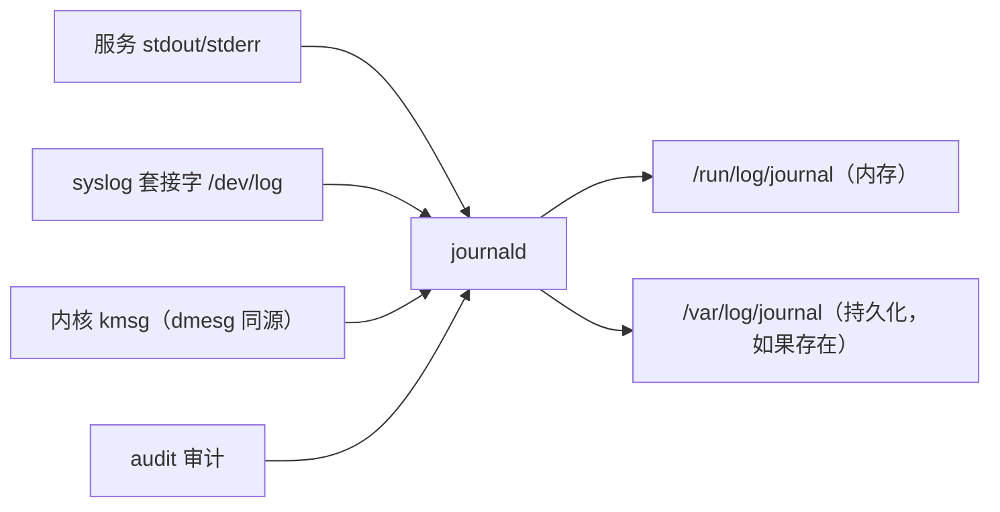

---
tags:
  - Linux
  - systemd
  - journald
  - 日志
created: 2026-09-19
---

# 第 6 站：留痕（journald）

> [!cite] 参考资料
> `man 1 journalctl`、`man 1 systemd-cat`、`man 5 journald.conf`、`man 5 systemd.exec`（`StandardOutput=`/`StandardError=`/`SyslogIdentifier=`/`LogRateLimit*=`）、`man 3 sd_journal_send`。
>
> 实测输出来自 Ubuntu 24.04.5 LTS（VMware 虚拟机）/ 内核 6.8.0-139-generic / systemd 255（`255.4-1ubuntu8.17`）/ cgroup v2 / root 的**系统级**实例；`journalctl --vacuum-*` 与 system 单元的限流本次都已用 root 实测（数值与影响见第 3、4 节）。
>
> 仍未实测：`systemctl restart systemd-journald`（会重载日志收集器，属于需要控制台/快照的动作，本实验环境不做）。

> **这篇讲什么**：服务留下的证据在哪、怎么查、怎么不被写满。这一篇把 journald 的四类来源、五条查询命令、几个关键字段、持久化开关、容量与限流讲清，最后给出日志治理的三层策略。
>
> **必须先读什么**：[[Linux/08_systemd与服务管理/03_前置_观测工具箱与证据命令|03 前置：观测工具箱与证据命令]]（`journalctl` 基础）。
>
> **读完能回答**：① 服务的 stdout 去了哪里，怎么按单元查？② 怎么判断日志会不会丢、怎么限制它占多少磁盘？③ 为什么「日志里明明打印了」但 `journalctl` 查不到？④ 单元级限流能不能当保险？
>
> 所属：[[Linux/08_systemd与服务管理/00_导读与知识地图|08 systemd、服务与定时任务]] 的第 6 站 · 主要练 **S3 变更与回滚**、**S4 分层定位**

## 0. 30 秒速览

> [!abstract] 这一篇只要记住八句话
> - **journald 收四类来源**：服务的 stdout/stderr（systemd 直接接管）、syslog 套接字（`/dev/log`，应用与 `logger` 走这里）、内核消息（kmsg，与 `dmesg` 同源）、审计（audit）。
> - **查询五条命令**：`-u <unit>`（按单元）、`--since`（按时间）、`-b`/`-b -1`（本次/上次启动）、`-p <级别>`（按优先级）、`-o json`（看字段）。
> - **`-o json` 的价值是字段**：`_PID`/`_COMM` 定位谁写的，`_SYSTEMD_UNIT`/`_SYSTEMD_USER_UNIT` 定位哪个单元，`__MONOTONIC_TIMESTAMP` 做跨日志源的先后判定（墙钟会被 NTP 调整，单调时钟不会）。
> - **`/var/log/journal` 存在 = 持久化，不存在 = 只存在内存（重启即丢）**；`journald.conf` 的 `Storage=auto` 是这个行为的开关。本机实测它存在，日志占用 **53.9 MiB**（`journalctl --disk-usage`）。
> - **容量靠 `SystemMaxUse=`/`MaxRetentionSec=` 管**，手动裁剪用 `journalctl --vacuum-size=`/`--vacuum-time=`。本机用 root 实测：`--vacuum-size=50M` 释放 4.9 MiB，`--vacuum-time=1h` 一次释放 28.2 MiB——**它会真删历史日志，包括上一次启动的记录**。
> - **配置也是叠加的**：`systemd-analyze cat-config systemd/journald.conf` 会按顺序列出主文件与所有 drop-in。本机重采：`/etc/systemd/journald.conf` 里 `ForwardToSyslog` 是注释，真正生效的 `ForwardToSyslog=yes` 来自 `/usr/lib/systemd/journald.conf.d/syslog.conf`；`/etc/systemd/journald.conf.d/` 本机**不存在**。
> - **单元级限流是真的会丢日志**：本机系统级实测，一个设了 `LogRateLimitIntervalSec=30s` + `LogRateLimitBurst=5` 的单元连写 200 条 stdout，只有 **18 条**落库（文档口径：额度按 journal 可用空间放大，本机 ≤4 GiB → ×4，即有效 20 条）。所以**不要拿它当保险**，也不要指望它精确等于你写的数字。
> - **`StandardOutput=syslog` 在 systemd 255 已是过时写法**：本机实测它被自动改写为 journal，并在日志里留下 `Standard output type syslog is obsolete ...` 告警；服务 stdout 的落点始终是 journal，只有应用自己走 `/dev/log`（如 `logger`）才会带 `_TRANSPORT=syslog`。

## 1. 四类来源与五条查询



```bash
journalctl -u myapp.service -n 50 --no-pager        # 按单元
journalctl -u myapp.service --since "10 min ago"    # 按时间
journalctl -b -1 -n 20                              # 上一次启动（排「重启后才知道」的问题）
journalctl -p err -b --no-pager | tail -20          # 按级别：emerg/alert/crit/err/warning/notice/info/debug
journalctl -u myapp -o json -n 1 | python3 -m json.tool | head -12   # 看字段
```

两个容易搞混的用法：`-u` 只筛某个 unit，看内核报错要用 `-k`（`journalctl -k -b`）；用户单元的日志要加 `--user`（`journalctl --user -u myapp.service`），系统单元不加——两者是分开的 journal。

> [!note] 系统级 vs 用户级：本机两套都有
> 本机（Ubuntu 24.04.5 虚拟机，root 可用）的系统级 journal 与 `realtyz` 的用户级 journal 都在写：`/var/log/journal/<machine-id>/` 下同时存在 `system.journal`、`user-1000.journal` 与轮转出来的 `system@…`、`user-1000@…` 文件。**查一个服务的日志前先确认它在哪一侧**：`systemctl show -p FragmentPath` 看 unit 文件位置（`/etc/systemd/system` 或 `/usr/lib/systemd/system` = 系统级），用户 unit 在 `~/.config/systemd/user/`。

## 2. 字段：为什么 `-o json` 比纯文本有用

先看一条**手工制造**的消息：`echo "hello from systemd-cat lab08b" | systemd-cat -t lab08b-tag`（root 在 SSH 会话里跑，因此没有归属的服务单元）：

```bash
echo "hello from systemd-cat lab08b" | systemd-cat -t lab08b-tag
journalctl -t lab08b-tag -n 1 -o json-pretty
```

本机实测（节选字段）：

```text
{
  "_PID" : "8119",                     "_COMM" : "cat",
  "_UID" : "0",                        "_GID" : "0",
  "_HOSTNAME" : "linux-lab",           "_TRANSPORT" : "stdout",
  "SYSLOG_IDENTIFIER" : "lab08b-tag",  "PRIORITY" : "6",
  "_SYSTEMD_UNIT" : "session-39.scope",
  "_SYSTEMD_CGROUP" : "/user.slice/user-0.slice/session-39.scope",
  "_SYSTEMD_SLICE" : "user-0.slice",
  "__MONOTONIC_TIMESTAMP" : "3315439502",
  "__REALTIME_TIMESTAMP" : "1789805025431921",
  "MESSAGE" : "hello from systemd-cat lab08b"
}
```

注意 `_SYSTEMD_UNIT` 是 `session-39.scope`——**从 SSH 会话里手工发的消息不属于任何服务单元**，只能靠 `SYSLOG_IDENTIFIER`（`-t`）找到。

再看一条**真的来自服务**的消息。本机建过一个系统单元 `lab08b-out.service`（`Type=oneshot`），`ExecStart` 里先 `echo` 一行 stdout、再 `logger` 一行：

```bash
journalctl _SYSTEMD_UNIT=lab08b-out.service -n 1 -o verbose
```

本机实测（stdout 那一行）：

```text
    _TRANSPORT=stdout
    SYSLOG_IDENTIFIER=lab08b-out-journal
    PRIORITY=6
    SYSLOG_FACILITY=3
    _PID=8744
    _COMM=bash
    _SYSTEMD_CGROUP=/system.slice/lab08b-out.service
    _SYSTEMD_UNIT=lab08b-out.service
    MESSAGE=line-journal stdout
```

同一个单元里 `logger` 发的那一行（走 `/dev/log`）：

```text
    _TRANSPORT=syslog
    SYSLOG_IDENTIFIER=lab08b-inner
    PRIORITY=5
    SYSLOG_FACILITY=1
    _PID=8744
    _COMM=bash
    _SYSTEMD_UNIT=lab08b-out.service
    MESSAGE=line from logger inside journal unit
```

两条消息的 `_SYSTEMD_UNIT` 相同、`_TRANSPORT`/`SYSLOG_FACILITY` 不同——**这正是「同一条日志为什么字段不一样」的答案：落点由路径决定，不由单元决定**。

| 字段 | 用途 |
| --- | --- |
| `_PID` / `_COMM` / `_EXE` | 定位「这条消息是谁写的」（pid、进程名、可执行文件） |
| `_SYSTEMD_UNIT` / `_SYSTEMD_USER_UNIT` | 定位「属于哪个单元」；会话/scope 里发的消息会落到 `session-N.scope` |
| `_SYSTEMD_CGROUP` | 精确到 cgroup 路径，最不容易看错 |
| `_TRANSPORT` | 来源类型（`stdout`、`syslog`、`journal`、`kernel`、`audit`） |
| `SYSLOG_IDENTIFIER` | 应用自报的标识（`-t`、`SyslogIdentifier=`，或 syslog 报文的 tag） |
| `SYSLOG_FACILITY` | syslog 设施号（本机实测 `1`=user、`3`=daemon）；只有走 syslog 语义的消息才有 |
| `PRIORITY` | 级别（`3`=err、`4`=warning、`5`=notice、`6`=info） |
| `__MONOTONIC_TIMESTAMP` | 单调时钟戳，不受时间调整影响，用于跨日志源排序 |
| `__REALTIME_TIMESTAMP` | 墙钟（微秒），会被 NTP 调整影响 |

`-o verbose` 与 `-o json` 是同一批字段的两种呈现；排查时先用 `-o short-precise` 看时间线，需要确认来源再用 `-o verbose`。

```bash
journalctl _SYSTEMD_UNIT=myapp.service -n 20          # 验证：直接按字段过滤（与 -u 等价）
journalctl -u myapp -o json -n 1 | python3 -m json.tool | head -20   # 验证：一条消息的完整字段
journalctl -o verbose -n 1                            # 验证：字段名=值 的平铺形式
```

## 3. 持久化与容量：日志会不会丢、会占多少盘

```bash
ls -ld /var/log/journal /run/log/journal
journalctl --disk-usage
systemd-analyze cat-config systemd/journald.conf | grep -n -E "^# /|Storage|SystemMaxUse|ForwardToSyslog|^\[Journal\]"
```

本机实测：

```text
$ ls -ld /var/log/journal /run/log/journal
drwxr-sr-x+ 3 root systemd-journal 4096 Sep 19 06:05 /var/log/journal        # 有它 = 持久化
drwxr-sr-x+ 2 root systemd-journal   40 Sep 19 07:08 /run/log/journal
$ ls -1 /var/log/journal
bd821ce75df94970ad5b6d63b6a8f812                                             # 目录名 = machine-id
$ journalctl --disk-usage
Archived and active journals take up 53.9M in the file system.
$ ls -l /var/log/journal/*/ | head -4
-rw-r-----+ 1 root systemd-journal 8388608 Sep 19 07:55 system@4b208d89...-00000000000028ab-00065bd0af63ef5f.journal
-rw-r-----+ 1 root systemd-journal 8388608 Sep 19 06:25 system@94307f36...-0000000000001e40-00065bd014e5bd51.journal
-rw-r-----+ 1 root systemd-journal 8388608 Sep 19 08:04 system.journal
-rw-r-----+ 1 root systemd-journal 8388608 Sep 19 08:00 user-1000.journal
```

要点：

- **`/var/log/journal` 存在就持久化，不存在就只在内存**（重启即丢）；`Storage=auto` 是开关。
- **journal 文件按「启动 + 大小」切分**：`system.journal`/`user-1000.journal` 是当前活动文件，`system@<boot-id>-<seq>-<ts>.journal` 是轮转出来的归档文件（本机单文件 8 MiB）。所以「日志占多少」不是看一个文件，而是 `--disk-usage`。
- **默认上限来自可用空间**：本机 `systemd-journald` 启动日志写明 `System Journal (/var/log/journal/<id>) is 45.5M, max 4.0G`、`Runtime Journal (/run/log/journal/<id>) is 8.0M, max 78.9M` —— `SystemMaxUse` 默认是**所在文件系统的 10%（并封顶 4 GiB）**；`RuntimeMaxUse` 默认是 **`/run` 所在 tmpfs 的 10%**，**不是内存的 10%**（`/run` 本身默认是内存的 10%，所以两者差 10 倍：本机 `/run` 790 MiB → Runtime max 78.9 MiB，而内存的 10% 会是 789 MiB）。
- **不要直接删 `/var/log/journal` 里的文件**——正解是 `journalctl --vacuum-*` 或设 `SystemMaxUse=`；直接删可能让 journal 的索引损坏。
- 容量相关：`SystemMaxUse=`（总上限）、`SystemMaxFileSize=`（单文件）、`MaxRetentionSec=`（最长保留）。

手动裁剪本次**已用 root 实测**。它会真删历史日志，执行前先确认日志保留要求（例如审计/合规要求）：

```bash
journalctl --disk-usage              # 验证：动手前的占用（本机 53.9M）
journalctl --vacuum-size=50M         # 验证：压到 50M 以内（本机释放 4.9M，剩 48.9M）
journalctl --vacuum-time=1h          # 验证：删掉 1 小时前的归档（本机一次释放 28.2M，剩 20.6M）
journalctl --disk-usage              # 验证：动手后的占用
```

本机实测输出：

```text
$ journalctl --vacuum-size=50M
Deleted archived journal /var/log/journal/bd821c…/system@af6772e4…-0000000000000704-00065bcfcd413f4d.journal (4.9M).
Vacuuming done, freed 4.9M of archived journals from /var/log/journal/bd821c….

$ journalctl --vacuum-time=1h
Deleted archived journal …/user-1000@af6772e4…-0000000000000fe9-00065bcfcf0d77c0.journal (3.6M).
Deleted archived journal …/system@cdc0636f…-000000000000124e-00065bd00093369a.journal (4.5M).
…
Vacuuming done, freed 28.2M of archived journals from /var/log/journal/bd821c….
Vacuuming done, freed 0B of archived journals from /run/log/journal.
```

> [!warning] `--vacuum-time=` 删的是「历史启动的证据」
> 本次 `--vacuum-time=1h` 之后，`journalctl --list-boots` 只剩当前这一次启动（`IDX 0`），`journalctl -b -1` 直接报 `No journal boot entry found from the specified boot offset (-1).`——**「上次启动发生了什么」在这一刻就查不到了**。
> 所以裁剪前先确认：本次启动是否还需要对比、有没有别处（rsyslog 落盘、日志平台）留有副本。`--vacuum-size=` 相对温和（只压总量），`--vacuum-time=` 更激进（按时间一刀切）。
> **本机实测后状态**：`/var/log/journal` 仍在（持久化没被破坏），占用 53.9 MiB → 48.9 MiB（`--vacuum-size=50M`）→ **20.6 MiB**（`--vacuum-time=1h`），归档文件数从 11 个减到 3 个；脚本与原始输出见 `.labvm/evidence/08b_09_vacuum_spam.out.txt`。
> **同一天稍后再采一次是 `16.0M`**——journald 仍在继续写入与轮转，所以「清理后剩多少」这个数**只对采样那一刻成立**，别把它当成常量。

`systemctl restart systemd-journald` 本次**未实测**：它会重载日志收集器，属于需要控制台/快照的动作，本实验环境不做。改完 `journald.conf` 后需要它才生效，这一步留给可快照/可控制台的实验机。

> [!important] 配置文件也是「叠加」的
> 本机重采 `systemd-analyze cat-config systemd/journald.conf`：主文件 `/etc/systemd/journald.conf` 里 `ForwardToSyslog` 是注释，真正生效的 `ForwardToSyslog=yes` 来自 `/usr/lib/systemd/journald.conf.d/syslog.conf`（内容只有 `[Journal]` + `ForwardToSyslog=yes` 两行）。本机 `/etc/systemd/journald.conf.d/` **不存在**。所以「我改了 `/etc/systemd/journald.conf` 怎么没效果」先跑 `cat-config`。这与 unit 的 drop-in 是同一套逻辑（子笔记 04）。

`ForwardToSyslog=yes` 的实际后果本机也验证了：`rsyslog` 处于 `active`，`/dev/log` 是指向 `/run/systemd/journal/dev-log` 的软链，`logger -t lab08b-inner` 的消息在 `journalctl -t lab08b-inner` 与 `/var/log/syslog` 里**都能查到**：

```text
$ grep lab08b-inner /var/log/syslog | tail -1
2026-09-19T08:04:07.772256+00:00 linux-lab lab08b-inner: line from logger inside journal unit
```

## 4. 限流：语义、默认值与「为什么不能当保险」

unit 里可以按单元限流，但两个键分工不同：`LogRateLimitIntervalSec=` 是时间窗（如 `1s`），`LogRateLimitBurst=` 是窗口内允许的条数（**整数**）。所以 `LogRateLimitBurst=5/1s` 这种写法是不存在的，别把两个键揉成一个。默认值来自 `journald.conf` 的 `RateLimitIntervalSec=`/`RateLimitBurst=`——**默认 10000 条 / 30 秒，且按服务分别计数**（一个服务刷屏不会顶掉另一个服务的额度），unit 里的值会覆盖它。

文档里还有两条容易被忽略的规定：① **有效额度会按 journal 可用磁盘空间放大**（`journald.conf(5)` 的 Table 1 用「可用空间的对数」给倍率：`<=1MB`→×1、`<=16MB`→×2、`<=256MB`→×3、`<=4GB`→×4、`<=64GB`→×5、`<=1TB`→×6），所以「5 条/秒」在磁盘宽裕的机器上并不等于真的只放 5 条；② 限流只作用于**交给 journald 处理**的消息，用 `StandardOutput=file:` 直接写文件的那些不算在内。

本次在**系统级系统单元**上复测，结论与旧笔记相反——**限流确实生效**：

```ini
[Service]
Type=oneshot
StandardOutput=journal
LogRateLimitIntervalSec=30s
LogRateLimitBurst=5
ExecStart=/bin/bash -c 'for i in $(seq 1 200); do echo "S2-$i"; done'
```

```text
$ systemctl show lab08b-spam2.service -p LogRateLimitIntervalUSec -p LogRateLimitBurst
LogRateLimitIntervalUSec=30s
LogRateLimitBurst=5
$ journalctl -u lab08b-spam2.service -o cat --no-pager | grep -c '^S2-'
18
$ journalctl -u lab08b-spam2.service -o cat --no-pager | grep '^S2-' | head -3
S2-1
S2-2
S2-3
$ journalctl -u lab08b-spam2.service -o cat --no-pager | grep '^S2-' | tail -3
S2-16
S2-17
S2-18
```

**读法**：200 条里只有 **18 条**落库，而且是**最早的那 18 条**——后续消息在窗口内被丢弃，这与文档描述完全一致。18 与「5 × 4 = 20」的细微差来自窗口与写入时序，不要把它当成精确常量。另一次用 `logger`（走 `/dev/log`）循环 200 次时读到 97 条，因为每次 `logger` 都要 fork 一个进程、整批写入跨了多个 1 秒窗口，每个窗口各放行一批。

```bash
systemctl show myapp -p LogRateLimitIntervalUSec -p LogRateLimitBurst   # 验证：这个单元自己的额度
journalctl -u myapp -o cat --no-pager | wc -l                          # 验证：实际落库条数
journalctl -b --no-pager -o short | grep -ic suppress                  # 验证：journald 有没有报丢弃
```

> [!warning] 三个口径陷阱
> ① **「我设了 5 条」不等于「只放 5 条」**——有效额度会被可用空间放大（本机 ×4）。
> ② **「没检索到 Suppressed」不等于「没丢」**：本机在 `journalctl -b | grep -i suppress` 里只命中了内核的 `kauditd_printk_skb: 110 callbacks suppressed`，并没有 journald 自己写的丢弃告警，但消息确实少了 182 条。**判据要落在「实际落库条数」上，而不是告警文本上。**
> ③ **限流的额度是「按 interval 窗口」算的**，写入被摊到多个窗口时总放行量会累加——所以「压到 N 条」只在单窗口内成立。

无论限流是否精确，工程结论都一样：**不要把单元级限流当成日志风暴的保险**。该做的三件事是：① 应用按级别输出，正常路径别刷 debug；② journald 保容量（`SystemMaxUse=`/`MaxRetentionSec=`，并监控 `--disk-usage`）；③ 高频日志分流（写文件 + `logrotate`，或走日志采集平台）。

```bash
systemctl show myapp -p StandardOutput -p StandardError -p SyslogIdentifier \
  -p LogRateLimitIntervalUSec -p LogRateLimitBurst
```

`StandardOutput=`/`StandardError=` 默认是 `journal`；改成文件后 `journalctl -u` 就看不到了，这是「日志查不到」的常见原因之一。

> [!note] `StandardOutput=syslog` 在 systemd 255 已经过时
> 本机实测：写 `StandardOutput=syslog` 的单元能正常跑，但 journald 会留下告警，且落点实际仍是 journal：
> ```text
> systemd[1]: /etc/systemd/system/lab08b-outsys.service:6: Standard output type syslog is obsolete,
>             automatically updating to journal. Please update your unit file, and consider removing the setting altogether.
> ```
> 对比同一批消息的字段：`StandardOutput=journal` 与 `StandardOutput=syslog` 的服务，stdout 行的 `_TRANSPORT` **都是 `stdout`**、`SYSLOG_IDENTIFIER=` 都来自 `SyslogIdentifier=`；真正带 `_TRANSPORT=syslog` 的是单元内部调用 `logger` 走 `/dev/log` 的那一行。**结论：不要再用 `StandardOutput=syslog`，用默认的 `journal`；「落点差异」现在只体现在「应用自己往 syslog 套接字写」这条路径上。**

## 5. 日志治理的三层策略

| 层 | 做什么 | 落到哪 |
| --- | --- | --- |
| 应用层 | 按级别输出、关键事件结构化、避免无意义刷屏 | 应用代码与配置 |
| unit 层 | `StandardOutput=journal`、`SyslogIdentifier=`、必要时的 `LogRateLimit*`（**不要当保险**：它会静默丢日志，且有效额度会被可用空间放大） | unit / drop-in |
| 系统层 | `SystemMaxUse=`/`MaxRetentionSec=` 保容量；高频日志分流；`--disk-usage` 纳入巡检 | `journald.conf`、日志平台 |

> [!tip] 巡检里加两条命令
> `journalctl --disk-usage` 与 `journalctl -p err -b --no-pager | tail -20`。前者防「日志写满根分区」，后者是每天开机后最快的一轮健康检查。

journald 是「systemd 生态里的日志收集器」，rsyslog 是传统 syslog 守护进程；两者可以共存（`ForwardToSyslog=yes` 时 journald 把消息转给 rsyslog，rsyslog 再写 `/var/log/*` 或转发）。**谁最终落盘取决于配置**，所以「日志到底在哪」这件事必须用 `cat-config` 与 `ls` 实测。这一部分属于日志与监控主题，本目录只讲到「服务的日志默认进 journald、怎么查、怎么别写满」为止。

### 实验 6：字段、容量与限流

> [!example]- 实验 6：看清一条消息的字段，并用 root 复现一次系统级限流
> **怎么做**：先 `echo "hello from systemd-cat lab08b" | systemd-cat -t lab08b-tag`，用 `journalctl -t lab08b-tag -n 1 -o json-pretty` 看字段；再建一个系统单元 `lab08b-out.service`（`Type=oneshot`，`StandardOutput=journal`，`SyslogIdentifier=lab08b-out-journal`），`ExecStart` 里 `echo` 一行 stdout 加 `logger -t lab08b-inner` 一行，用 `journalctl _SYSTEMD_UNIT=lab08b-out.service -o verbose` 对比两条消息的 `_TRANSPORT`/`SYSLOG_FACILITY`。限流部分：建 `lab08b-spam2.service`（`LogRateLimitIntervalSec=30s`、`LogRateLimitBurst=5`，`ExecStart` 循环 200 条 `echo`），用 `show` 核对额度、用 `journalctl -u … -o cat | grep -c` 数**实际落库条数**。容量部分：`journalctl --disk-usage` → `--vacuum-size=50M` → `--vacuum-time=1h`，每步记录占用。
> **预期**：字段一定能看到（`_TRANSPORT`/`_SYSTEMD_UNIT`/`_COMM`/`__MONOTONIC_TIMESTAMP` 等）；系统级限流**确实生效**——本机 200 条只落 18 条（有效额度 5×4）；`--vacuum-size=50M` 释放 4.9 MiB、`--vacuum-time=1h` 释放 28.2 MiB。
> **风险**：中——限流会**真丢日志**（只丢实验单元自己的），`--vacuum-time=` 会**真删历史启动的 journal**；**耗时**：约 15 分钟；**回滚**：删单元 + `daemon-reload` + `reset-failed`；日志裁剪**不可回滚**，先确认保留要求。
> 机器：可快照实验机。`--vacuum-*` 与系统单元限流必须用 root；`journalctl --disk-usage` 与 `cat-config` 是只读，生产机上也可以做。
> 本机证据：`.labvm/evidence/08b_09_journald.out.txt`、`08b_09_unit_log.out.txt`、`08b_09_vacuum_spam.out.txt`、`08b_09_ratelimit2.out.txt`。

## 常见坑

| 常见做法或说法 | 后果或事实 |
| --- | --- |
| 「`journalctl` 看不到日志 = 应用没输出」 | 可能被限流/被容量轮转、日志写了文件没写 stdout、或看错了 boot/单元 |
| 「改了 `/etc/systemd/journald.conf` 就该生效」 | 配置是叠加的；`cat-config` 看真正生效的值来自哪个文件（本机来自 `/usr/lib/systemd/journald.conf.d/syslog.conf`） |
| 直接 `rm /var/log/journal/*` 清日志 | 可能损坏 journal 索引；用 `--vacuum-*` 或设 `SystemMaxUse=` |
| 以为日志一定会跨重启保留 | `/var/log/journal` 不存在时只存在内存，重启即丢；`-b -1` 也就用不了 |
| 随手跑 `journalctl --vacuum-time=1h` 清盘 | 本机实测一次释放 28.2 MiB，`--list-boots` 随即只剩当前这一次启动，`-b -1` 直接报 `No journal boot entry found from the specified boot offset (-1).` |
| 把单元级限流当成「有它就安全」 | 本机系统级实测：`Burst=5` 的单元写 200 条只落 18 条（有效额度被可用空间放大到 20）——**它会丢日志，且丢多少不由你写的数字决定** |
| 用「`grep -i suppress` 没命中」证明没丢日志 | 本机 182 条被丢弃时，`journalctl -b` 里没有任何 journald 的丢弃告警（只命中内核的 `kauditd_printk_skb … suppressed`）；判据要用**实际落库条数** |
| 在 unit 里写 `StandardOutput=syslog` | systemd 255 判为过时并自动改写为 journal，日志里留告警；落点没有区别 |
| 用 `--since "10 min ago"` 却忽略时区 | `--since` 按本地时间解释；本机时区是 `Etc/UTC`（子笔记 14），跨机对账要统一成 UTC |
| 把 `StandardOutput=` 改成文件后还用 `journalctl -u` 找日志 | 改到文件后 journald 收不到，要在那个文件里找 |

## 决策练习

> [!question]- 场景：某服务发生故障，需要回溯它的日志，但你发现 `journalctl -u svc -b -1` 报「no such boot」。同事说「那就看重启前的 `/var/log/messages`」。
> A. 直接翻 `/var/log/messages`，反正都一样
> B. 先确认 `/var/log/journal` 是否存在（是否持久化），并检查有没有 rsyslog 落盘（Ubuntu 上是 `/var/log/syslog`，不是 `/var/log/messages`）；如果都没保留，就明确结论「这次没有历史日志可查」，并把「开启持久化 / 远程采集 / 不要把 `--vacuum-time` 设太短」作为整改项
> C. 再重启一次，看看这次能不能复现
> **答案：B。**
> A 可能有一份，但要先确认它到底存不存在、存了多久；本机 `/var/log/messages` 并不存在，随手翻文件是排障大忌。
> C 是拿生产环境做实验，还可能再次造成影响。
> B 是正解：**先确认证据是否存在，再决定结论；缺失的证据本身就是需要修复的配置问题**。本机就制造过一次这种现场：跑完 `--vacuum-time=1h` 后 `-b -1` 立刻变成 `No journal boot entry found from the specified boot offset (-1).`。

## 要点自测

> [!question]- 服务的 stdout 去了哪里？怎么按单元查、怎么区分「没输出」与「没保留」？
> - 默认由 systemd 接管，进 journald（`StandardOutput=journal`）；`StandardOutput=syslog` 在 systemd 255 已过时，会被自动改写为 journal。
> - 查：`journalctl -u <unit> -b`（用户单元加 `--user`）；历史启动用 `-b -1`（前提是持久 journal 里还有那一次启动）。
> - 区分：`show -p StandardOutput -p StandardError` 看落点；`ls -ld /var/log/journal` 看是否持久化；`journalctl --disk-usage`、`journalctl --list-boots` 与 `SystemMaxUse=` 看是否被轮转掉/裁掉。
> - 本机另一个高频原因：消息来自 SSH 会话而不是服务（`_SYSTEMD_UNIT=session-39.scope`），用 `-u` 永远查不到，只能靠 `-t`/`SYSLOG_IDENTIFIER`。
> - **第一反应不要是什么**：不要一上来就断定「应用没打印」——先排除落点、保留与过滤。

> [!question]- 怎么防止 journal 把磁盘写满？为什么不能直接删文件？
> - 设 `SystemMaxUse=`/`SystemMaxFileSize=`/`MaxRetentionSec=` 控制总量（本机默认 `max 4.0G`、运行时 `max 78.9M`）；用 `journalctl --vacuum-size=`/`--vacuum-time=` 手动裁剪。
> - 直接删 `/var/log/journal/*` 可能让 journal 的索引/元数据不一致；`--vacuum-*` 知道哪些文件可以安全回收。
> - 但 `--vacuum-*` 也**不可回滚**：本机 `--vacuum-time=1h` 一次释放 28.2 MiB 之后，`--list-boots` 只剩当前启动，`-b -1` 再也查不到上次启动。
> - 更根本的是源头治理：应用按级别输出、高频日志分流。
> - **第一反应不要是什么**：不要在磁盘已经满了才想起日志治理，也不要用 `rm` 清 journal，更不要在生产机上随手跑 `--vacuum-time=`。

> [!question]- 为什么说「单元级限流不能当保险」？正确写法是什么？
> - 写法：`LogRateLimitIntervalSec=1s`（窗口）+ `LogRateLimitBurst=5`（窗口内条数，整数）；默认值来自 `journald.conf`（10000 条 / 30 秒），并且实际额度会按可用磁盘空间放大（`<=4GB` 时 ×4）。
> - 本机系统级实测：`Burst=5`、`Interval=30s` 的单元写 200 条 stdout，只有 18 条落库（最早的那 18 条），而且 `journalctl -b | grep -i suppress` 里**没有** journald 的丢弃告警。所以它既不「不生效」，也不等于你写的数字——**它是一个会静默丢日志的阈值**。
> - 即使它在某些环境生效，它也只在 journald 这一层工作，无法替代应用分级与容量上限。
> - 正确策略：应用按级别输出 + `SystemMaxUse=` 保容量 + 高频日志分流。
> - **第一反应不要是什么**：不要为了「先看到日志」把限流全关掉——那会在下一次日志风暴时把磁盘写满。

> 上一篇：[[Linux/08_systemd与服务管理/08_第5站_隔离_沙箱与最小权限|08 第 5 站：隔离（沙箱与最小权限）]] ｜ 下一篇：[[Linux/08_systemd与服务管理/10_第7站_退场与重来_退出与重启|10 第 7 站：退场与重来（退出与重启）]]
