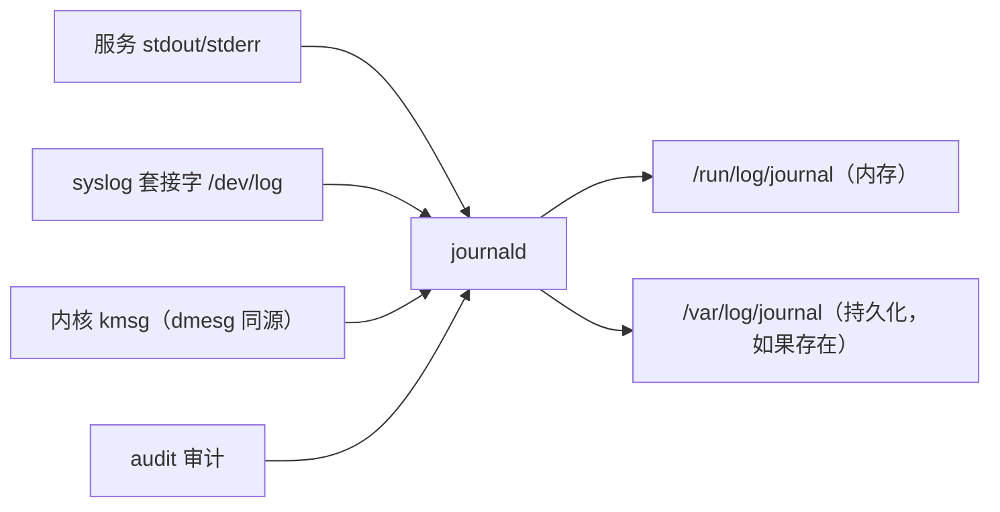

---
tags:
  - Linux
  - systemd
  - journald
  - 日志
created: 2026-09-19
---

# 第 6 站：留痕（journald）

> [!cite] 参考资料
> `man 1 journalctl`、`man 1 systemd-cat`、`man 5 journald.conf`、`man 5 systemd.exec`（`StandardOutput=`/`StandardError=`/`SyslogIdentifier=`/`LogRateLimit*=`）、`man 3 sd_journal_send`。
>
> 实测输出来自 Ubuntu 24.04.4（WSL2）/ systemd 255 的用户级 systemd；`journalctl --vacuum-*` 与 system 单元的限流行为未实测（需要 root），已标注。

> **这篇讲什么**：服务留下的证据在哪、怎么查、怎么不被写满。这一篇把 journald 的四类来源、五条查询命令、几个关键字段、持久化开关、容量与限流讲清，最后给出日志治理的三层策略。
>
> **必须先读什么**：[[Linux/08_systemd与服务管理/03_前置_观测工具箱与证据命令|03 前置：观测工具箱与证据命令]]（`journalctl` 基础）。
>
> **读完能回答**：① 服务的 stdout 去了哪里，怎么按单元查？② 怎么判断日志会不会丢、怎么限制它占多少磁盘？③ 为什么「日志里明明打印了」但 `journalctl` 查不到？④ 单元级限流能不能当保险？
>
> 所属：[[Linux/08_systemd与服务管理/00_导读与知识地图|08 systemd、服务与定时任务]] 的第 6 站 · 主要练 **S3 变更与回滚**、**S4 分层定位**

## 0. 30 秒速览

> [!abstract] 这一篇只要记住七句话
> - **journald 收四类来源**：服务的 stdout/stderr（systemd 直接接管）、syslog 套接字（`/dev/log`，应用与 `logger` 走这里）、内核消息（kmsg，与 `dmesg` 同源）、审计（audit）。
> - **查询五条命令**：`-u <unit>`（按单元）、`--since`（按时间）、`-b`/`-b -1`（本次/上次启动）、`-p <级别>`（按优先级）、`-o json`（看字段）。
> - **`-o json` 的价值是字段**：`_PID`/`_COMM` 定位谁写的，`_SYSTEMD_UNIT`/`_SYSTEMD_USER_UNIT` 定位哪个单元，`__MONOTONIC_TIMESTAMP` 做跨日志源的先后判定（墙钟会被 NTP 调整，单调时钟不会）。
> - **`/var/log/journal` 存在 = 持久化，不存在 = 只存在内存（重启即丢）**；`journald.conf` 的 `Storage=auto` 是这个行为的开关。本机实测它存在，日志占用 560.7M。
> - **容量靠 `SystemMaxUse=`/`MaxRetentionSec=` 管**，手动裁剪用 `journalctl --vacuum-size=500M`/`--vacuum-time=2weeks`（**需要 root，本机未实测**）。
> - **配置也是叠加的**：`systemd-analyze cat-config systemd/journald.conf` 会按顺序列出主文件与所有 drop-in，本机实测生效的 `ForwardToSyslog=yes` 来自 `/usr/lib/systemd/journald.conf.d/syslog.conf`，**不是主配置文件**。
> - **单元级限流不能当保险**：`LogRateLimitIntervalSec=1s` + `LogRateLimitBurst=5` 本机实测没把消息压到 5 条/秒（stdout 200 条全部到达、`logger` 路径到达 178 条），**但一次实验的方法不够严、不足以否定文档**；工程结论明确：日志风暴要靠应用分级 + 容量上限 + 分流。

## 1. 四类来源与五条查询



```bash
journalctl -u myapp.service -n 50 --no-pager        # 按单元
journalctl -u myapp.service --since "10 min ago"    # 按时间
journalctl -b -1 -n 20                              # 上一次启动（排「重启后才知道」的问题）
journalctl -p err -b --no-pager | tail -20          # 按级别：emerg/alert/crit/err/warning/notice/info/debug
journalctl -u myapp -o json -n 1 | python3 -m json.tool | head -12   # 看字段
```

两个容易搞混的用法：`-u` 只筛某个 unit，看内核报错要用 `-k`（`journalctl -k -b`）；用户单元的日志要加 `--user`（`journalctl --user -u myapp.service`），系统单元不加——两者是分开的 journal。

## 2. 字段：为什么 `-o json` 比纯文本有用

实测一条 `systemd-cat` 消息的字段：

```text
"_HOSTNAME": "realtyz"          "_PID": "5817"
"_COMM": "cat"                  "_UID": "1000"          "_GID": "1000"
"SYSLOG_IDENTIFIER": "labtag"   "_TRANSPORT": "stdout"
"_SYSTEMD_UNIT": "init.scope"   "_SYSTEMD_SLICE": "-.slice"
"MESSAGE": "hello from systemd-cat"
"__MONOTONIC_TIMESTAMP": "3190772722"
```

| 字段 | 用途 |
| --- | --- |
| `_PID` / `_COMM` | 定位「这条消息是谁写的」 |
| `_SYSTEMD_UNIT` / `_SYSTEMD_USER_UNIT` | 定位「属于哪个单元」 |
| `_TRANSPORT` | 来源类型（`stdout`、`syslog`、`kernel`、`audit`） |
| `SYSLOG_IDENTIFIER` | 应用自报的标识（`-t` 或 `SyslogIdentifier=`） |
| `__MONOTONIC_TIMESTAMP` | 单调时钟戳，不受时间调整影响，用于跨日志源排序 |

```bash
journalctl _SYSTEMD_UNIT=myapp.service -n 20          # 验证：直接按字段过滤（与 -u 等价）
journalctl -u myapp -o json --no-pager | head -3      # 验证：一条消息的完整字段
```

## 3. 持久化与容量：日志会不会丢、会占多少盘

```bash
ls -ld /var/log/journal /run/log/journal
journalctl --disk-usage
systemd-analyze cat-config systemd/journald.conf | grep -n -E "^# /|Storage|SystemMaxUse|ForwardToSyslog|^\[Journal\]"
```

本机实测：

```text
$ ls -ld /var/log/journal /run/log/journal
drwxr-sr-x+ 3 root systemd-journal 4096 Jul 26  2025 /var/log/journal        # 有它 = 持久化
drwxr-sr-x+ 2 root systemd-journal   40 Sep 17 20:33 /run/log/journal
$ journalctl --disk-usage
Archived and active journals take up 560.7M in the file system.
```

要点：

- **`/var/log/journal` 存在就持久化，不存在就只在内存**（重启即丢）；`Storage=auto` 是开关。
- **不要直接删 `/var/log/journal` 里的文件**——正解是 `journalctl --vacuum-*` 或设 `SystemMaxUse=`；直接删可能让 journal 的索引损坏。
- 容量相关：`SystemMaxUse=`（总上限）、`SystemMaxFileSize=`（单文件）、`MaxRetentionSec=`（最长保留）。

下面几条**需要 root，本机未实测**；执行前先确认日志保留要求（例如审计/合规要求）：

```bash
journalctl --disk-usage
journalctl --vacuum-size=500M
journalctl --vacuum-time=2weeks
systemctl restart systemd-journald     # 改完 journald.conf 后
```

> [!important] 配置文件也是「叠加」的
> 本机实测 `systemd-analyze cat-config systemd/journald.conf` 显示：主文件 `/etc/systemd/journald.conf` 里 `ForwardToSyslog` 是注释，而真正生效的 `ForwardToSyslog=yes` 来自 `/usr/lib/systemd/journald.conf.d/syslog.conf`。所以「我改了 `/etc/systemd/journald.conf` 怎么没效果」先跑 `cat-config`。这与 unit 的 drop-in 是同一套逻辑（子笔记 04）。

## 4. 限流：语义、默认值与「为什么不能当保险」

unit 里可以按单元限流，但两个键分工不同：`LogRateLimitIntervalSec=` 是时间窗（如 `1s`），`LogRateLimitBurst=` 是窗口内允许的条数（**整数**）。所以 `LogRateLimitBurst=5/1s` 这种写法是不存在的，别把两个键揉成一个。默认值来自 `journald.conf` 的 `RateLimitIntervalSec=`/`RateLimitBurst=`——**默认 10000 条 / 30 秒，且按服务分别计数**（一个服务刷屏不会顶掉另一个服务的额度），unit 里的值会覆盖它。

文档里还有两条容易被忽略的规定：① **有效额度会按 journal 可用磁盘空间放大**（`journald.conf(5)` 给了对照表，≤1TB 时是 6 倍），所以「5 条/秒」在磁盘宽裕的机器上并不等于真的只放 5 条；② 限流只作用于**交给 journald 处理**的消息，用 `StandardOutput=file:` 直接写文件的那些不算在内。

本机做的一次对照没能复现「压到 5 条/秒」：同一个单元里设 `LogRateLimitIntervalSec=1s`、`LogRateLimitBurst=5`，

```text
$ systemctl --user show lab-spam.service | grep -E "LogRateLimit"
LogRateLimitIntervalUSec=1s
LogRateLimitBurst=5
$ journalctl --user -u lab-out200.service | grep -c "out-"    # 200 条 stdout
200
$ journalctl --user -u lab-log200.service | grep -c "msg-"    # 200 条 logger（走 syslog）
178
$ journalctl --user --since "10 min ago" | grep -ic suppress
0
```

这个结果**不足以推翻文档**：stdout 是由 systemd 转发进来的、`logger` 走的是 `/dev/log`，两条路径的归属与计数方式本来就不同；而「`Suppressed` 记录 0 条」的查法也很可能漏掉 journald 自己写的告警。要把它当成结论，至少得把方法补严：

1. 记录**实际写入条数**与 `journalctl` 读到的条数，别只靠 `grep -c`；
2. 把 journald 自己发的告警一起找出来（`journalctl -o cat | grep -i suppress`，系统侧还要看 `journalctl -u systemd-journald`）；
3. 在**可快照实验机**上用 root 对 system 单元复测一遍（本机只测了 user 单元）。

无论限流是否按预期生效，工程结论都一样：**不要把单元级限流当成日志风暴的保险**。该做的三件事是：① 应用按级别输出，正常路径别刷 debug；② journald 保容量（`SystemMaxUse=`/`MaxRetentionSec=`，并监控 `--disk-usage`）；③ 高频日志分流（写文件 + `logrotate`，或走日志采集平台）。

```bash
systemctl show myapp -p StandardOutput -p StandardError -p SyslogIdentifier \
  -p LogRateLimitIntervalUSec -p LogRateLimitBurst
```

`StandardOutput=`/`StandardError=` 默认是 `journal`；改成文件后 `journalctl -u` 就看不到了，这是「日志查不到」的常见原因之一。

## 5. 日志治理的三层策略

| 层 | 做什么 | 落到哪 |
| --- | --- | --- |
| 应用层 | 按级别输出、关键事件结构化、避免无意义刷屏 | 应用代码与配置 |
| unit 层 | `StandardOutput=journal`、`SyslogIdentifier=`、必要时的 `LogRateLimit*`（**不要当保险**；能否生效与消息来源、容量放大倍数都有关） | unit / drop-in |
| 系统层 | `SystemMaxUse=`/`MaxRetentionSec=` 保容量；高频日志分流；`--disk-usage` 纳入巡检 | `journald.conf`、日志平台 |

> [!tip] 巡检里加两条命令
> `journalctl --disk-usage` 与 `journalctl -p err -b --no-pager | tail -20`。前者防「日志写满根分区」，后者是每天开机后最快的一轮健康检查。

journald 是「systemd 生态里的日志收集器」，rsyslog 是传统 syslog 守护进程；两者可以共存（`ForwardToSyslog=yes` 时 journald 把消息转给 rsyslog，rsyslog 再写 `/var/log/*` 或转发）。**谁最终落盘取决于配置**，所以「日志到底在哪」这件事必须用 `cat-config` 与 `ls` 实测。这一部分属于日志与监控主题，本目录只讲到「服务的日志默认进 journald、怎么查、怎么别写满」为止。

### 实验 6：字段、容量与限流

> [!example]- 实验 6：看清一条消息的字段，并复现一次限流对照
> **怎么做**：`echo "hello from systemd-cat" | systemd-cat -t labtag` 后用 `journalctl -t labtag -n 1 -o json` 看字段；`journalctl --disk-usage` 看占用；`systemd-analyze cat-config systemd/journald.conf` 看配置来源。再建两个 `oneshot` 单元（都设 `LogRateLimitIntervalSec=1s` + `LogRateLimitBurst=5`），一个 `echo` 200 条 stdout，一个 `logger` 200 条；统计**实际写入条数**、`journalctl` 读到的条数，以及 journald 自己发的 `Suppressed` 告警（别只在 `journalctl --user --since` 里 grep）。
> **预期**：字段一定能看到（`_PID`/`_SYSTEMD_UNIT`/`__MONOTONIC_TIMESTAMP` 等）；限流部分本机得到 200 / 178 / 0，**但方法不够严，不能据此下「文档不成立」的结论**——这一节的正确产出是「知道它不可依赖 + 知道怎么在实验机上补测」，而不是一个确定的限流数字。
> **风险**：低（用户单元）；**耗时**：约 10 分钟；**回滚**：删单元、`daemon-reload`、`reset-failed`。
> 机器：任意能跑 `systemctl --user` 的环境。`--vacuum-*` 与 system 单元的限流复测必须在可快照实验机上用 root 做。

## 常见坑

| 常见做法或说法 | 后果或事实 |
| --- | --- |
| 「`journalctl` 看不到日志 = 应用没输出」 | 可能被限流/被容量轮转、日志写了文件没写 stdout、或看错了 boot/单元 |
| 「改了 `/etc/systemd/journald.conf` 就该生效」 | 配置是叠加的；`cat-config` 看真正生效的值来自哪个文件 |
| 直接 `rm /var/log/journal/*` 清日志 | 可能损坏 journal 索引；用 `--vacuum-*` 或设 `SystemMaxUse=` |
| 以为日志一定会跨重启保留 | `/var/log/journal` 不存在时只存在内存，重启即丢；`-b -1` 也就用不了 |
| 把单元级限流当成「有它就安全」 | 本机用户单元未复现「压到 5 条/秒」，但一次实验不足以否定文档；**结论是不要拿它当保险，而不是断定它一定不生效** |
| 用 `--since "10 min ago"` 却忽略时区 | `--since` 按本地时间解释；时钟/时区不对会选错窗口（子笔记 14） |
| 把 `StandardOutput=` 改成文件后还用 `journalctl -u` 找日志 | 改到文件后 journald 收不到，要在那个文件里找 |

## 决策练习

> [!question]- 场景：某服务发生故障，需要回溯它的日志，但你发现 `journalctl -u svc -b -1` 报「no such boot」。同事说「那就看重启前的 `/var/log/messages`」。
> A. 直接翻 `/var/log/messages`，反正都一样
> B. 先确认 `/var/log/journal` 是否存在（是否持久化），并检查是否有 rsyslog 落盘；如果都没保留，就明确结论「这次没有历史日志可查」，并把「开启持久化 / 远程采集」作为整改项
> C. 再重启一次，看看这次能不能复现
> **答案：B。**
> A 可能有一份，但要先确认它到底存不存在、存了多久；凭空假设是排障大忌。
> C 是拿生产环境做实验，还可能再次造成影响。
> B 是正解：**先确认证据是否存在，再决定结论；缺失的证据本身就是需要修复的配置问题**。

## 要点自测

> [!question]- 服务的 stdout 去了哪里？怎么按单元查、怎么区分「没输出」与「没保留」？
> - 默认由 systemd 接管，进 journald（`StandardOutput=journal`）。
> - 查：`journalctl -u <unit> -b`（用户单元加 `--user`）；历史启动用 `-b -1`。
> - 区分：`show -p StandardOutput -p StandardError` 看落点；`ls -ld /var/log/journal` 看是否持久化；`journalctl --disk-usage` 与 `SystemMaxUse=` 看是否被轮转掉。
> - **第一反应不要是什么**：不要一上来就断定「应用没打印」——先排除落点、保留与过滤。

> [!question]- 怎么防止 journal 把磁盘写满？为什么不能直接删文件？
> - 设 `SystemMaxUse=`/`SystemMaxFileSize=`/`MaxRetentionSec=` 控制总量；用 `journalctl --vacuum-size=`/`--vacuum-time=` 手动裁剪。
> - 直接删 `/var/log/journal/*` 可能让 journal 的索引/元数据不一致；`--vacuum-*` 知道哪些文件可以安全回收。
> - 更根本的是源头治理：应用按级别输出、高频日志分流。
> - **第一反应不要是什么**：不要在磁盘已经满了才想起日志治理，也不要用 `rm` 清 journal。

> [!question]- 为什么说「单元级限流不能当保险」？正确写法是什么？
> - 写法：`LogRateLimitIntervalSec=1s`（窗口）+ `LogRateLimitBurst=5`（窗口内条数，整数）；默认值来自 `journald.conf`（10000 条 / 30 秒），并且实际额度会按可用磁盘空间放大。
> - 本机用户单元的一次对照没有复现「压到 5 条/秒」（stdout 200 条全到达、`logger` 路径 178 条、没找到 `Suppressed` 记录），但这个结果方法不够严，**不能据此断定文档不成立**；补测方法见第 4 节的三步。
> - 即使它在某些环境生效，它也只在 journald 这一层工作，无法替代应用分级与容量上限。
> - 正确策略：应用按级别输出 + `SystemMaxUse=` 保容量 + 高频日志分流。
> - **第一反应不要是什么**：不要为了「先看到日志」把限流全关掉——那会在下一次日志风暴时把磁盘写满。

> 上一篇：[[Linux/08_systemd与服务管理/08_第5站_隔离_沙箱与最小权限|08 第 5 站：隔离（沙箱与最小权限）]] ｜ 下一篇：[[Linux/08_systemd与服务管理/10_第7站_退场与重来_退出与重启|10 第 7 站：退场与重来（退出与重启）]]
