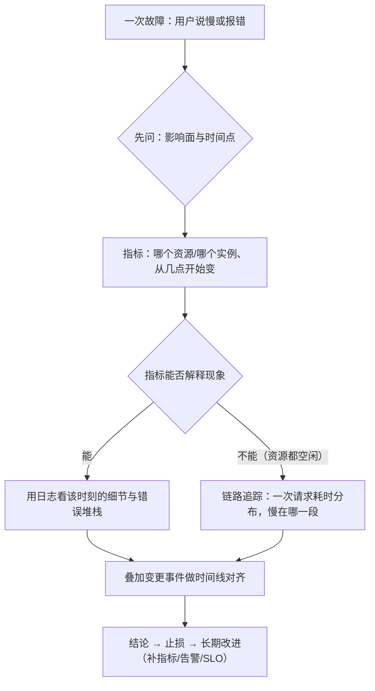

---
tags:
  - Linux
  - 可观测性
  - 日志
  - 监控
  - 告警
  - 运维面试
created: 2026-09-17
---

# 日志、监控与可观测性

> 本笔记对应 [[00_学习大纲|Linux 大纲]] 的「阶段 9：日志、监控与可观测性」。目标：建立**三条链路**（日志看细节、指标看趋势、链路追踪看耗时分布）的分工，能治理日志的落点与容量（journald/rsyslog/logrotate）、能读懂并采集指标（node_exporter/PromQL/sysstat）、能把告警做成「可执行的动作」（Prometheus 规则 + Alertmanager 分组/抑制/静默 + blackbox 探测），最后用 SLI/SLO 决定「哪些告警立刻处理、哪些排期」。
>
> 关联复习：[[Linux/03_进程与信号/00_导读与知识地图|03 进程与信号]]（句柄耗尽与 `ulimit`、D 状态）、[[Linux/04_内存管理与OOM/00_导读与知识地图|04 内存管理与 OOM]]（可用内存口径、PSI）、[[Linux/05_存储与文件系统/00_导读与知识地图|05 存储与文件系统]]（inode、`df`/`du` 不一致、保留块）、[[Linux/06_网络协议栈与排障/00_导读与知识地图|06 网络协议栈与排障]]（连接状态、重传、conntrack）、[[08_systemd与服务管理]]（journald 的落点、unit 日志与限流、timer、`systemd-tmpfiles`）、[[10_性能分析与排障]]（USE 方法与分层定位的落地）、[[11_生产运维与高可用]]（变更窗口、证书到期、日志留存与合规）、[[12_复习与自测]]，以及 [[Kubernetes/07_生产运维与可观测性|Kubernetes 可观测性]]（容器视角的日志/指标/cadvisor）。
>
> 说明：结论以 man 页（`journalctl(1)`、`journald.conf(5)`、`logrotate(8)`、`logrotate.conf(5)`、`sar(1)`、`sysstat(5)`）与官方文档（Prometheus/Alertmanager/blackbox_exporter/node_exporter、W3C Trace Context、OpenTelemetry）为准。**本文的数字默认来自 Ubuntu 24.04.4 LTS / 内核 `6.6.87.2-microsoft-standard-WSL2` / systemd 255 的实测**；Prometheus、Alertmanager、blackbox_exporter、node_exporter、sysstat 是用 `apt-get download` + `dpkg-deb -x` **解包运行**的（未安装、未改系统），换环境要重新取一遍；RHEL 系的差异单列并标注「未在本机实测」。

> [!info] 读之前：实验条件与读法
> 1. **本机没有 root，所以「安装整套监控」这件事没有做**：Prometheus 栈与 sysstat 都是用发行版包**解包后直接运行二进制**。这足以验证「数据模型、规则评估、告警分组、探测指标、sar 历史读取」这些机制，但**端口、用户、systemd 单元、开机自启这些部署细节**必须到真实环境补做（文末给了清单）。Alertmanager 还有一个细节：Debian 包把默认告警模板编译成 `/usr/share/prometheus/alertmanager/*.tmpl` 的绝对路径，直接解包运行会报 `failed to parse templates`；本文用 `unshare -U -r -m` + tmpfs 覆盖 `/usr/share` 的方式绕过了它（步骤见实验 6）。
> 2. **本文区分「实测」与「按文档」**：所有带具体数字/输出的段落都是本机实测；RHEL 的 `rsyslog`/`sysstat`/`chrony` 默认值、云厂商托管监控的行为标注为未实测。
> 3. **读法**：第一遍读 1.1～1.4（三条链路、日志体系、轮转、磁盘治理）+ 3.1～3.3，这是日常最高频的部分；第二遍读 1.6～1.10（指标采集与语义、PromQL、告警、SLO）；第三遍读 1.5、1.11、1.12（远程集中、追踪、sysstat 历史）与第 4 节实验。

## 0. 30 秒速览

> [!abstract] 这一页只要记住六句话
> 首学读不懂很正常：先跳过这一节，读完第 1、3 节再回来逐条验证——每一条都是「结论 + 一句可复现的证据」。
> - **journald 与 rsyslog 不是二选一，同一条日志通常两边都有**：实测 `logger -t labtest` 之后，`journalctl -t labtest -o json` 给出 `SYSLOG_IDENTIFIER/_PID/_UID/_TRANSPORT=syslog/MESSAGE` 等结构化字段，而 `/var/log/syslog` 里是纯文本一行；本机 `ForwardToSyslog=yes` 来自 `/usr/lib/systemd/journald.conf.d/syslog.conf` 这个 drop-in。**要字段用 journald，要长期文件与转发用 rsyslog/采集器。**
> - **日志轮转的关键不是「切开」，而是「切开之后谁还在写」**：实测 `copytruncate` 后 inode 不变（`2466 → 2466`）、写入方继续写新 `app.log`；换成 `create` 后 inode 变了（新 `app2.log=4944`、归档 `app2.log.1=2501`），持有旧 fd 的进程把随后 9 行数据继续写进了**归档文件**，`app2.log` 里 0 行——所以必须 `postrotate` 发信号让应用重开文件（发行版自己的例子：`/usr/lib/rsyslog/rsyslog-rotate` → `systemctl kill -s HUP rsyslog.service`）。
> - **「日志写满」有两类：真占空间与已删除但仍被持有**：实测把 200MB 文件 `rm` 掉但进程仍持有 fd 时，`df` 的已用量多了约 200MB（17749929984 → 17959649280），而 `du /tmp` 只有 88K，`/proc/<pid>/fd/4` 显示 `/tmp/lab-held2.bin (deleted)`；关掉 fd 后 `df` 立刻回收。**先 `df` 找到满的文件系统，再按「真文件 / 已删除 / inode / 保留块」四类拆。**
> - **指标不是「采了就有用」，语义比数量重要**：实测 `node_exporter` 一次抓取 1756 行指标，`node_load1=0`、`node_memory_MemAvailable_bytes=1.586e10`、`node_filesystem_avail_bytes{mountpoint="/"}=1.008e12`、`node_sockstat_TCP_inuse=6`；配合 Prometheus 的 `up=1`、记录规则 `lab:node_load1`、告警 `ALERTS{alertname="LabAlwaysFiring",alertstate="firing"}` 才算闭环。**采集频率与 label 基数直接决定成本，不是越多越好。**
> - **平均值会骗人，分位数还会「看算法」**：同一组 1000 个样本（950×20ms + 45×100ms + 5×2000ms）实测平均 33.5ms，而 p95 用 `inclusive` 是 24.0ms、用 `exclusive` 是 96.0ms、按「第 n×p 个元素」算是 100.0ms——**分位数是估计值，算法不同结果能差 4 倍**；监控里要么用 Prometheus 的 histogram bucket，要么统一口径并写进文档。
> - **告警的价值在「降噪 + 可执行」**：实测把同 `alertname+instance` 的两条告警发进 Alertmanager，webhook 收到的是一组（`groupKey: {}:{alertname="LabGrouped", instance="host1"}` 内含 info+warning 两条）；建 silence 后对应告警变成 `suppressed + silencedBy=[id]`；同一 instance 发 critical 后，warning 变成 `suppressed + inhibitedBy=[fingerprint]`。**先分组、再抑制、最后才考虑静默，顺序反了就会漏掉真故障。**

## 1. 概念

> [!info]- 名词速查（读到哪里卡住，就回这里查）
> | 名词 | 一句话解释 | 在哪一节展开 |
> | --- | --- | --- |
> | 三条链路 | 日志（发生了什么）/指标（多严重、何时开始）/追踪（慢在哪一段） | 1.1 |
> | journald / rsyslog | systemd 的结构化日志收集器 / 传统 syslog 守护进程与转发者 | 1.2 |
> | PRI | syslog 的优先级字段 = facility×8 + severity（实测远程报文 `<13>`） | 1.5 |
> | RFC 5424 / RFC 3164 | syslog 的新/旧报文格式（结构化数据 / BSD 风格） | 1.5 |
> | `@` / `@@` | rsyslog 转发：UDP / TCP | 1.5 |
> | logrotate | 按时间/大小切割日志、压缩、保留与 `postrotate` 钩子 | 1.3 |
> | `copytruncate` | 复制一份再截断原文件：inode 不变，可能丢几条 | 1.3 |
> | `delaycompress` | 延后一轮再压缩，给「还没重开文件」的进程留时间 | 1.3 |
> | SS / `df` vs `du` | 已删除但仍被持有的文件在 `df` 里占空间、`du` 看不到 | 1.4 |
> | exporter / scrape | 暴露 `/metrics` 的采集端 / Prometheus 主动抓取 | 1.6 |
> | cardinality | label 组合的数量，决定时序数量与存储/查询成本 | 1.6 |
> | `up` | Prometheus 对每个 target 的抓取结果（1/0），最基础的可用性指标 | 1.8 |
> | recording rule | 预计算并保存的 PromQL 表达式结果 | 1.8 |
> | alerting rule / `ALERTS` | 触发告警的规则 / 由规则生成的告警时序 | 1.8 |
> | grouping / inhibition / silence | 合并同类告警 / 用高优先级压掉低优先级 / 临时静音 | 1.9 |
> | `probe_success` | blackbox 探测是否成功的 0/1 指标 | 1.9 |
> | SLI / SLO / 错误预算 | 实际测量值 / 目标 / 允许的「不达标额度」 | 1.10 |
> | trace / span / traceparent | 一次完整调用 / 其中一段 / W3C 的上下文透传头 | 1.11 |
> | `sar` / `sadc` / `sadf` | 历史指标读取 / 采样写入 / 导出（CSV） | 1.12 |



### 1.1 三条链路的分工：可观测性的骨架【核心】

「可观测性」不是「多装几个监控」，而是**三条互补的证据链**加一条时间轴：

| 链路 | 回答的问题 | 数据特征 | 成本主要花在 | 典型实现 |
| --- | --- | --- | --- | --- |
| 日志 | **发生了什么**（详细、个案） | 高基数、高体积、文本/结构化 | 存储与索引、保留期 | journald、rsyslog、Loki（Promtail）、Elasticsearch（Filebeat） |
| 指标 | **多严重、从什么时候开始**（聚合、趋势） | 低基数、固定维度、可长期保留 | 采集频率、cardinality | node_exporter + Prometheus、`sar`、云监控 |
| 链路追踪 | **一次请求慢在哪一段**（分布式调用） | 按请求采样、链路结构 | 采样率与后端容量 | OpenTelemetry + Jaeger/Tempo 等 |
| 变更事件 | **是不是我改了什么** | 时间点 + 对象 + 变更人 | 流程纪律 | 发布系统、`auditd`、堡垒机、CMDB |

这条链的用法是**从低成本到高成本**：先看指标（谁、何时、多严重），再用日志定位细节，指标解释不了（资源全空闲）才去看追踪；**最后一定要把「拐点」和「变更时间线」对齐**——多数故障靠这一步就能缩小到很小的范围（[[11_生产运维与高可用]]）。

> [!important] 实例维度是硬要求
> 同一个指标如果只有 `service` 没有 `instance`（或反过来），在集群里等于不可用；日志如果没有 `host`/`container`/`pod` 字段，也拼不出横向对比。**采集之前先定义「最小维度集」：环境、服务、实例、版本。**

容器视角下这三条链路同样成立，只是采集点变了：日志由容器运行时/采集 DaemonSet 收（容器重建后日志随之消失）、指标来自 cAdvisor/kubelet 的 `/metrics` 与业务 `/metrics`、追踪靠请求头透传。宿主机与容器**两套视角都要保留**（[[Kubernetes/07_生产运维与可观测性|Kubernetes 可观测性]]）。

### 1.2 日志体系：journald 与 rsyslog 的分工【核心】

本机实测的完整链路（同一条 `logger` 消息）：

```text
$ logger -t labtest "hello-from-logger"

# ① journald 侧：结构化字段
$ journalctl -t labtest -n 1 -o short-precise
Sep 17 21:46:26.259349 realtyz labtest[6952]: hello-from-logger
$ journalctl -t labtest -n 1 -o json | python3 -c "import json,sys; d=json.load(sys.stdin); print({k:d[k] for k in [\"SYSLOG_IDENTIFIER\",\"_PID\",\"_UID\",\"_TRANSPORT\",\"MESSAGE\"]})"
{'SYSLOG_IDENTIFIER': 'labtest', '_PID': '6952', '_UID': '1000', '_TRANSPORT': 'syslog', 'MESSAGE': 'hello-from-logger'}

# ② rsyslog 侧：落到文件的纯文本
$ tail -1 /var/log/syslog
2026-09-17T21:46:26.259487+08:00 realtyz labtest: hello-from-logger
$ stat -c "%A %a %U:%G %s %n" /var/log/syslog
-rw-r----- 640 syslog:adm 293341 /var/log/syslog
```

再往前追一步，**为什么两边都有**：

```text
$ systemd-analyze cat-config systemd/journald.conf | grep -E "^# /|ForwardToSyslog"
# /etc/systemd/journald.conf
#ForwardToSyslog=no
# /usr/lib/systemd/journald.conf.d/syslog.conf
ForwardToSyslog=yes            # ← 生效值来自 drop-in
```

分工与取舍可以压成一张表：

| 维度 | journald | rsyslog（或采集器） |
| --- | --- | --- |
| 数据结构 | 结构化字段（`_PID`/`_SYSTEMD_UNIT`/`__MONOTONIC_TIMESTAMP`…） | 默认纯文本一行（模板可定制） |
| 查询 | `journalctl`（按单元/boot/优先级/字段） | `grep`/`awk`，或交给集中式平台 |
| 保留 | 默认在 `/var/log/journal`（有目录才持久化），按大小/时间轮转 | 由 `logrotate` 管理，保留策略自己定 |
| 传输 | 本身不负责远程转发 | 天生负责远程（`@`/`@@`/RELP/TLS） |
| 适合 | 本机排障、服务日志、字段过滤 | 长期留存、集中检索、跨机转发 |

应用日志的三种常见落点，决定了你「去哪儿找」：

1. **写到 stdout/stderr**：由 systemd 收进 journald（[[08_systemd与服务管理]]），这是容器化/云原生最推荐的方式。
2. **写自己的日志文件**（如 `/var/log/nginx/access.log`）：journald 看不到，必须靠 `logrotate` + 采集器。
3. **走 syslog 套接字**（`syslog(3)`/`logger`）：journald 与 rsyslog 都能收到，取决于 `ForwardToSyslog=`。

> [!warning] 应用日志的格式要「机器可读」
> 排障时最痛的是「日志里有信息但没有字段」：`request failed` 这种只有一句话的日志，既不能聚合也不能告警。**最低要求**：时间（带时区或统一 UTC）、级别、服务/实例、请求 ID（trace id 更好）、可检索的错误码。JSON 行是最省事的折中。

### 1.3 日志轮转：logrotate 的机制与两种「切法」【核心】

`logrotate` 由 `logrotate.timer` 每天触发（本机实测 `logrotate.timer` next 为次日 00:00），配置在 `/etc/logrotate.d/` 与 `/etc/logrotate.conf`。核心参数：`daily`/`weekly`/`size`（触发条件）、`rotate N`（保留几份）、`compress`/`delaycompress`、`missingok`/`notifempty`、`create`/`copytruncate`、`postrotate`/`endscript`、`sharedscripts`。

#### 实测：`copytruncate` 与 `create` 的区别到底在哪

**`copytruncate`**（复制一份再截断原文件）：

```text
# 配置：daily / rotate 3 / compress / copytruncate
$ stat -c %i logs/app.log        # rotate 前
2466
$ logrotate -f -s state1 etc/app
$ stat -c %i logs/app.log        # rotate 后：inode 没变
2466
$ ls -l logs
      0 app.log
     85 app.log.1.gz
$ tail -1 logs/app.log           # 写入方继续往「新」app.log 写
tick-8 21:46:51.690833664
$ zcat logs/app.log.1.gz | tail -1
tick-3 21:46:50.428830417        # 归档里是截断前的内容
```

**`create` + `postrotate`**（重命名旧文件、创建新文件、通知应用重开）：

```text
# 配置：daily / rotate 2 / create 0640 / postrotate echo ... >> postrotate.log / endscript
$ logrotate -f -s state2 etc/app2
$ stat -c "%n inode=%i" logs/app2.log logs/app2.log.1
logs/app2.log inode=4944
logs/app2.log.1 inode=2501
$ cat postrotate.log
postrotate-fired 21:46:52
$ # 写入方持有旧 fd（fd 3 >> app2.log），rotate 后又写了 9 行：
$ grep -c tick logs/app2.log logs/app2.log.1
logs/app2.log:0
logs/app2.log.1:9
```

结论（这也是面试高频追问）：

- **`copytruncate` 适合「无法重开文件」的程序**（没有信号/接口），代价是**复制与截断之间写入的日志会丢**，且大文件复制会占用额外 IO/空间。
- **`create` 是标准做法**，但**必须在 `postrotate` 里让应用重新打开日志**；否则数据继续写进已改名的旧文件，表现是「新日志文件一直是空的，旧归档却在长」。
- `delaycompress`（延后一轮压缩）配合「应用还没重开文件」的场景；`sharedscripts` 让一组日志只跑一次脚本。

发行版自己的例子（本机实测，直接可抄）：

```text
$ grep -vE "^[[:space:]]*(#|$)" /etc/logrotate.d/rsyslog
/var/log/syslog
/var/log/mail.log
/var/log/kern.log
/var/log/auth.log
/var/log/user.log
/var/log/cron.log
{
	rotate 4
	weekly
	missingok
	notifempty
	compress
	delaycompress
	sharedscripts
	postrotate
		/usr/lib/rsyslog/rsyslog-rotate
	endscript
}
$ cat /usr/lib/rsyslog/rsyslog-rotate
if [ -d /run/systemd/system ]; then
    systemctl kill -s HUP rsyslog.service
fi
```

调试技巧：`logrotate -d <conf>`（只打印「将会做什么」，不改任何文件，实测输出会明确提示 debug 模式）、`logrotate -v -f -s <state> <conf>`（强制执行并看细节）。**状态文件（默认 `/var/lib/logrotate/status`）记录了「上次什么时候轮的」，别用 `-f` 在排障时反复执行**，那会把保留份数快速消耗掉。

### 1.4 磁盘被日志写满：四类原因与治理顺序【核心】

日志把磁盘写满是运维最常见的「自己把自己搞挂」。**先分四类**（判据见 [[Linux/05_存储与文件系统/00_导读与知识地图|05 存储与文件系统]]）：

| 类型 | 判据 | 处理方向 |
| --- | --- | --- |
| 真占空间的日志 | `df -h` 高 + `du` 能找到大文件 | 调保留策略/压缩/分盘；先清最老的可删数据 |
| 已删除但仍被进程持有 | `df` 高、`du` 找不到；`/proc/<pid>/fd` 里有 `(deleted)` | 重启/重开该进程或让它重开日志（不能靠 `rm`） |
| inode 用满 | `df -i` 高 | 找海量小文件（`find … | wc -l`），治「谁在写」而不是删大文件 |
| 保留块 / 挂载覆盖 | `df` 与 `du` 差一个固定量级 | 查 `tune2fs -l` 的保留块、`findmnt` 是否覆盖了目录 |

第二类的实测现场（本机）：

```text
$ df -B1 /tmp | tail -1 | awk "{print \$3}"
17749929984                       # 删文件前
$ exec 4>/tmp/lab-held2.bin; dd if=/dev/zero of=/tmp/lab-held2.bin bs=1M count=200 2>/dev/null; rm -f /tmp/lab-held2.bin
$ ls -l /proc/$$/fd/4 | sed "s/.*-> //"
/tmp/lab-held2.bin (deleted)      # fd 还指着它
$ df -B1 /tmp | tail -1 | awk "{print \$3}"
17959649280                       # 已用多了约 200MB
$ du -sh /tmp | cut -f1
88K                               # du 看不到已删除文件
$ exec 4>&-                       # 关闭 fd 后立刻回收
$ df -B1 /tmp | tail -1 | awk "{print \$3}"
17749929984
```

**治理顺序**（先止血、再治本、最后加防线）：

1. **止血**：确认不是业务数据后，清最老/最大的日志，或让它轮转（`logrotate -f`）；对持有已删除文件的进程，用 `systemctl reload/restart` 让它重开日志，**不要直接 `kill -9` 业务进程**。
2. **治本**：三层保留策略——① 应用按级别输出（生产别开 debug）；② journald 的 `SystemMaxUse=`/`MaxRetentionSec=`（本机实测用户/系统日志合计 560.7M）；③ logrotate 的 `rotate`/`size`/`compress` 与自建日志的清理。
3. **加防线**：`/var/log` 与业务数据分盘或分挂载点；日志目录容量告警；`logrotate`/`systemd-tmpfiles` 的执行结果纳入监控（[[08_systemd与服务管理]]）。

> [!tip] 先看是谁在写，再决定删什么
> `du -xsh /var/log/* | sort -h | tail`、`find /var/log -type f -size +100M`、`lsof +L1`（或读 `/proc/*/fd`）三条命令基本能定位全部情况。**删之前确认三件事**：不是业务数据、不会被立即重新写回来、保留了最近一段（用于事后复盘）。

### 1.5 远程集中：syslog 在网线里长什么样【核心】

本机实测（用 `nc -u -l 1514` 抓 `logger --server` 发出的报文，不经过系统 rsyslog）：

```text
# UDP
<13>1 2026-09-17T21:46:27.132351+08:00 realtyz labtest - - [timeQuality tzKnown="1" isSynced="1" syncAccuracy="451491"] udp-remote-hello

# TCP
<13>1 2026-09-17T21:46:28.637299+08:00 realtyz labtest - - [timeQuality tzKnown="1" isSynced="1" syncAccuracy="451991"] tcp-remote-hello
```

逐字段拆一下（RFC 5424）：

| 字段 | 值 | 含义 |
| --- | --- | --- |
| `<13>` | PRI = 13 | facility×8 + severity；`13 = 1×8 + 5` → facility=user、severity=notice |
| `1` | 版本 | RFC 5424 版本号（旧 BSD 格式没有这段） |
| 时间戳 | `2026-09-17T21:46:27.132351+08:00` | 带时区偏移——**跨时区对账的前提** |
| 主机名 | `realtyz` | 发送方主机 |
| app-name / procid / msgid | `labtest - -` | 应用标识、进程号、消息 ID（未设置时为 `-`） |
| 结构化数据 | `[timeQuality tzKnown="1" isSynced="1" …]` | 时间同步质量，正好可以回答「这条日志的时间信不信得过」 |
| 消息体 | `udp-remote-hello` | 正文（UDP 报文没有换行符，TCP 有） |

集中方案的选择（按「运维复杂度 vs 能力」排）：

| 方案 | 传输 | 优点 | 代价/边界 |
| --- | --- | --- | --- |
| 远程 syslog（rsyslog/syslog-ng） | UDP/TCP/RELP/TLS | 系统自带、协议简单、可靠传输可选 TCP | 结构化能力弱；UDP 会丢；要靠轮转与保留策略 |
| Filebeat → ES | TCP/TLS | 生态成熟、解析/索引强 | 资源占用与集群成本高 |
| Promtail → Loki | HTTP | 与 Prometheus 标签体系一致、成本可控 | 索引能力弱于 ES（适合「按标签找日志再 grep」） |
| Vector / Fluent Bit | 多种 | 轻量、可做转换/过滤/多路输出 | 需要自己维护配置与规则 |

**UDP 与 TCP 的取舍**：UDP 快、无连接、会丢（网络拥塞/接收端队列满都丢）；TCP 可靠但有队头阻塞与重连成本；跨公网/跨机房建议 TLS（syslog over TLS 或 RELP），并**始终明确「接收端的地址与端口是谁在维护」**。集中之后还要有人管容量——把日志集中起来只是把「磁盘满」从一台机器搬到了一台中心机。

### 1.6 指标采集：node_exporter 的指标族与自建边界【核心】

Prometheus 采用 **pull 模型**：被监控端暴露 HTTP `/metrics`，Prometheus 按 `scrape_interval` 主动抓取。本机实测（解包运行 `prometheus-node-exporter`，抓一次 `/metrics`）：

```text
$ curl -s -o /dev/null -w "%{http_code} %{content_type}\n" http://127.0.0.1:19100/metrics
200 text/plain; version=0.0.4; charset=utf-8; escaping=values
$ curl -s http://127.0.0.1:19100/metrics | grep -vc "^#"
1756                                    # 一次抓取 1756 行指标（含 label 组合）

$ curl -s http://127.0.0.1:19100/metrics | grep -E "^node_(load1|memory_MemAvailable_bytes|filesystem_avail_bytes|sockstat_TCP_inuse|filefd_allocated|boot_time_seconds|procs_running) "
node_boot_time_seconds 1.789648619e+09
node_filefd_allocated 1440
node_filesystem_avail_bytes{device="/dev/sdd",fstype="ext4",mountpoint="/"} 1.008206249984e+12
node_load1 0
node_memory_MemAvailable_bytes 1.586364416e+10
node_procs_running 1
node_sockstat_TCP_inuse 6
node_network_receive_bytes_total{device="eth0"} 3.884712e+07

$ curl -s http://127.0.0.1:19100/metrics | grep -E "^node_scrape_collector_duration_seconds"
node_scrape_collector_duration_seconds{collector="cpu"} 0.000915735
node_scrape_collector_duration_seconds{collector="filesystem"} 0.00205903
node_scrape_collector_duration_seconds{collector="meminfo"} 9.1678e-05
node_scrape_collector_duration_seconds{collector="netdev"} 8.4832e-05
```

关键指标族与它们的「语义」比记住名字更重要：

| 指标（前缀） | 类型 | 用途与注意点 |
| --- | --- | --- |
| `node_cpu_seconds_total` | counter | 按 `mode` 分（idle/user/system/iowait…）；**用 `rate()` 再看比例**，裸值没有意义 |
| `node_memory_MemAvailable_bytes` | gauge | 「应用还能拿到多少」；别用 `MemFree`（[[Linux/04_内存管理与OOM/00_导读与知识地图\|04 内存管理与 OOM]]） |
| `node_filesystem_avail_bytes` | gauge | 按 `mountpoint`/`fstype`；与 `size_bytes` 一起算使用率 |
| `node_disk_*_seconds_total` | counter | IO 延迟/队列；与 `iostat` 的 `await`/`aqu-sz` 对应（[[Linux/05_存储与文件系统/00_导读与知识地图|05 存储与文件系统]]） |
| `node_network_*_total` | counter | 收发字节/错误/丢包；`device` 维度必看 |
| `node_sockstat_TCP_inuse` / `node_filefd_allocated` | gauge | 连接数与句柄水位；句柄打满会表现为「偶发失败」（[[Linux/03_进程与信号/00_导读与知识地图\|03 进程与信号]]） |
| `node_load1/5/15` | gauge | 与核数比较才有意义；load 高不等于 CPU 忙（[[10_性能分析与排障]]） |
| `node_boot_time_seconds` | gauge | 判断「这台机器是不是刚重启过」 |
| `node_scrape_collector_duration_seconds` | gauge | **exporter 自己的开销**：采集慢/超时要先看它 |
| `up`（Prometheus 侧） | gauge | 抓取是否成功（1/0），最容易做的可用性告警 |

自建采集的边界（决定「要不要自己写 exporter」）：

- **能复用就复用**：操作系统指标用 node_exporter，容器用 cAdvisor/kubelet，数据库/中间件优先用官方或社区 exporter。
- **业务指标才是自建的重点**：请求数、错误数、延迟直方图、队列深度、业务事件计数。**不要用日志解析去做这些**（成本高、口径易变）。
- **控制 cardinality**：把 `user_id`、`request_id`、URL 全量路径、时间戳当 label 是灾难（时序数量爆炸）。高基数信息应该进日志或追踪。
- **采集频率是成本**：`scrape_interval` 从 15s 提到 1s，成本与存储接近线性增长，而多数告警并不需要秒级；**用 recording rule 预聚合、用 histogram 代替原始分布明细**。
- **exporter 本身要有监控**：`up`、抓取耗时、`scrape_samples_scraped`、目标数量、Prometheus 自身的内存/磁盘。

### 1.7 指标语义：USE、分位数与瞬时采样【核心】

#### USE：按资源问三个问题

USE（Utilization / Saturation / Errors）是一张「不要漏资源」的检查表（[[10_性能分析与排障]]）：

| 资源 | Utilization（用了多少） | Saturation（排队/等待） | Errors |
| --- | --- | --- | --- |
| CPU | `mpstat -P ALL`/`node_cpu…`；`vmstat` 的 `us+sy` | `vmstat` 的 `r`、`/proc/pressure/cpu`、`pidstat` 的非自愿切换 | `dmesg` 的 MCE、`st` 被虚拟化偷走 |
| 内存 | `free -h` 的 `available`、PSI memory | `vmstat` 的 `si/so`、major fault、OOM 计数 | ECC/`edac`、OOM Killer 记录 |
| 磁盘 IO | `iostat -x` 的 `%util`、`await` | `aqu-sz`、PSI io、队列长度 | `smartctl` 介质错误、`dmesg` IO error |
| 网络 | `sar -n DEV`/`node_network…` 带宽 | `ss -s` 的队列/重传、conntrack 使用率 | `nstat` 的丢包/错误、`ip -s link` |

本机实测的三条「饱和度/水位」信号：

```text
$ grep -H . /proc/pressure/cpu /proc/pressure/memory /proc/pressure/io
/proc/pressure/cpu:some avg10=0.00 avg60=0.00 avg300=0.00 total=6130198
/proc/pressure/cpu:full avg10=0.00 avg60=0.00 avg300=0.00 total=0
/proc/pressure/memory:some avg10=0.00 avg60=0.00 avg300=0.00 total=0
/proc/pressure/io:some avg10=0.00 avg60=0.03 avg300=0.00 total=15520931

$ vmstat 1 2 | tail -1
 0  0      0 14731328 138912 881660    0    0     0     0  691  339  0  0 100  0  0  0
# r=可运行队列 b=D 状态 si/so=换页 cs=上下文切换 us/sy/wa/id=CPU 分布

$ ss -s | head -3
Total: 195
TCP:   21 (estab 0, closed 18, orphaned 0, timewait 18)
$ cat /proc/sys/fs/file-nr
1680	0	9223372036854775807
```

注意 PSI 的 `some/full` 差别：**`some` = 至少有一个任务被卡**（局部抖动），**`full` = 所有任务都被卡**（全面停顿）。内存/IO 的 `full` 一旦长期非 0，即使「平均值看着还行」也已经影响延迟了。

#### 平均值 vs 分位数：不只是「看 p99」这么简单

实测（1000 个样本：950×20ms + 45×100ms + 5×2000ms）：

```text
分布: 950x20ms + 45x100ms + 5x2000ms, 平均=33.5ms
  statistics.quantiles(method=inclusive) p50=20.0 p95=24.0 p99=100.0
  statistics.quantiles(method=exclusive) p50=20.0 p95=96.0 p99=100.0
  取第 n*p 个元素                          p50=20.0 p95=100.0 p99=100.0
  max=2000.0
```

同一份数据，**p95 可以是 24ms 也可以是 100ms，取决于分位数算法（插值方式）**。这就是为什么：

- 平均延迟掩盖长尾：1% 的请求慢 100 倍，平均值只涨几毫秒，但用户体验已经崩了。
- 跨系统对比 p99 前必须**统一口径**（算法、窗口、聚合层级）；Prometheus 用 histogram bucket 近似，导出到别处再算 percentile 又是另一种近似。
- 单个实例的 p99 与「全局 p99」不是同一个东西：全局 p99 需要合并直方图，**不能对实例 p99 再求平均**。

#### 瞬时采样会漏掉什么

两种典型漏检：

1. **短脉冲**：每分钟采样一次、每次一瞬，10 秒的 CPU 打满是抓不到的；要靠更高频采样（或 `histogram`/`summary` 的分布）与 PSI 的累计 `total` 计数。
2. **周期性抖动**：每 5 分钟一次的批量任务让 `awake`/`await` 冲高，但平均值被长时间的空闲稀释；**看最大值与分位数、看时间序列的拐点，而不是看 1 小时平均**。

> [!important] 计数器（counter）与仪表（gauge）的用法不能混
> counter 只会涨（进程重启会归零），必须用 `rate()`/`increase()`（并在重启点做处理）；gauge 可以直接看值。**对 counter 直接做平均值、对 gauge 做 `rate()` 都是错的**。

### 1.8 Prometheus：数据模型、PromQL 与规则【核心】

Prometheus 的数据模型是 **metric 名 + label 集合 → 时间序列**。一次抓取 = 一个样本（时间戳 + 值）。本机实测（用解包二进制跑起来，抓 node_exporter，评估记录规则与告警规则）：

```text
# 最小配置（每 2 秒抓一次、每 2 秒评估一次规则）
$ cat prom.yml
global:
  scrape_interval: 2s
  evaluation_interval: 2s
rule_files:
  - /tmp/prom-lab.../rules.yml
scrape_configs:
  - job_name: node
    static_configs:
      - targets: ["127.0.0.1:19100"]

# 规则（一条记录规则 + 一条必然触发的告警规则）
$ cat rules.yml
groups:
  - name: lab
    rules:
      - record: lab:node_load1
        expr: node_load1
      - alert: LabAlwaysFiring
        expr: vector(1) > 0
        for: 0s
        labels: {severity: warning}
        annotations: {summary: 实验室告警（用于验证规则链路）}

# 校验规则（CI 里应该跑的一步）
$ promtool check rules rules.yml
Checking rules.yml
  SUCCESS: 2 rules found
```

跑起来之后用 HTTP API 查询（这几条是最常用的「确认链路通没通」）：

```text
# ① 目标是否可达
$ curl -s "http://127.0.0.1:19090/api/v1/query?query=up"
[({'__name__': 'up', 'instance': '127.0.0.1:19100', 'job': 'node'}, [1789652843.616, '1'])]

# ② 记录规则是否在算
$ curl -s "http://127.0.0.1:19090/api/v1/query?query=lab:node_load1"
[({'__name__': 'lab:node_load1', 'instance': '127.0.0.1:19100', 'job': 'node'}, '0')]

# ③ 告警是否真的进入 firing
$ curl -s "http://127.0.0.1:19090/api/v1/query?query=ALERTS"
[('LabAlwaysFiring', 'firing', 'warning', '1')]

# ④ 用 PromQL 算一个真实指标（CPU 使用率）
$ curl -s --data-urlencode "query=100 - (avg(rate(node_cpu_seconds_total{mode=\"idle\"}[30s])) * 100)" \
    http://127.0.0.1:19090/api/v1/query
[87.55]
```

PromQL 的四类常用写法（面试高频）：

| 目的 | 写法 | 注意 |
| --- | --- | --- |
| 速率 | `rate(node_network_receive_bytes_total[5m])` | 窗口要 ≥ 2×scrape_interval；counter 专用 |
| 比例/使用率 | `100 - avg(rate(node_cpu_seconds_total{mode="idle"}[5m])) * 100` | `avg` 跨 CPU 聚合前先按 `instance` 保留维度 |
| 聚合与分组 | `sum by (instance) (rate(http_requests_total[5m]))` | `by` 决定输出维度；`without` 相反 |
| 告警表达式 | `up == 0`、`rate(errors[5m]) / rate(total[5m]) > 0.01` | 先算比率再判断，避免绝对值受流量影响 |

**`ALERTS` 是一个特殊的时序**：任何 alerting rule 触发都会生成 `ALERTS{alertname=…,alertstate="pending|firing"}`，所以「告警规则写对了没有」可以直接用一条 PromQL 验证，不必等通知渠道。

生产建议：**记录规则用来降采样与固化口径**（如 `job:http_error_ratio:5m`），告警规则只写在「记录规则/清晰的表达式」之上；规则文件纳入版本管理，用 `promtool check rules` 做 CI 校验。

### 1.9 告警链路：路由、分组、抑制、静默与探测【核心】

告警的完整链路是：**规则（Prometheus）→ Alertmanager 路由 → 分组/抑制/静默 → 通知渠道 → 人**。本机实测 Alertmanager（解包运行）：

```text
# 配置要点
route:
  receiver: webhook
  group_by: ["alertname", "instance"]     # 按这两个 label 分组
  group_wait: 1s
  group_interval: 5s
  repeat_interval: 1h
inhibit_rules:
  - source_matchers: [severity="critical"]
    target_matchers: [severity="warning"]
    equal: ["instance"]

# 离线校验配置与路由判定
$ amtool check-config am.yml
Checking 'am.yml'  SUCCESS
$ amtool config routes test --config.file=am.yml severity=warning alertname=LabGrouped instance=host1
webhook
```

把三条告警 POST 进去（同一 `alertname+instance` 两条 + 另一组一条），看 webhook 实际收到了什么：

```text
$ python3 groups.py webhook.log
groupKey: {}:{alertname="LabGrouped", instance="host1"} | alerts: [('LabGrouped', 'info'), ('LabGrouped', 'warning')]
groupKey: {}:{alertname="LabOther", instance="host2"}   | alerts: [('LabOther', 'warning')]
```

**分组**：两条同组告警合并成一次通知（`group_wait` 内的告警一起发），避免「一次故障几十条通知」。

**静默（silence）**：按 matcher 临时压制通知（维护窗口、已知问题），状态查询仍能看到它：

```text
$ curl -s -XPOST -H "Content-Type: application/json" -d @sil.json http://127.0.0.1:19093/api/v2/silences
silence id: 2a2b8aa6-d222-4004-82dc-2279787c5fef
$ curl -s http://127.0.0.1:19093/api/v2/alerts | python3 show.py
LabOther  host2 warning active     inhibitedBy=[]                 silencedBy=[]
LabGrouped host1 warning suppressed inhibitedBy=[]                silencedBy=['2a2b8aa6-d222-4004-82dc-2279787c5fef']
LabGrouped host1 info    suppressed inhibitedBy=[]                silencedBy=['2a2b8aa6-d222-4004-82dc-2279787c5fef']
```

**抑制（inhibition）**：用高优先级告警压掉同一对象的低优先级告警（例如「机器宕机」时不再报「磁盘使用率高」）：

```text
$ curl -s http://127.0.0.1:19093/api/v2/alerts | python3 show.py | grep host3
LabInhibit host3 warning  suppressed inhibitedBy=['f5d702ef7eb989e4'] silencedBy=[]
LabInhibit host3 critical active     inhibitedBy=[]                   silencedBy=[]
```

**降噪顺序**（告警风暴时按这个顺序做，顺序反了会漏真故障）：

1. **分组**：让同一故障只发一条（配置层，事前做）。
2. **抑制**：明确「谁是谁的因」，用 source/target matcher + `equal` 表达（配置层，事前做）。
3. **静默**：对已知故障/维护窗口做**有期限**的 silence，并记录原因与到期时间（操作层）。
4. 最后才考虑「调高阈值/延长 `for`」——那是降低灵敏度，必须复盘后再做。

#### 用 blackbox_exporter 补「可用性」与「证书到期」

Prometheus 抓的是「目标能否返回指标」，而 blackbox 探的是**用户视角的可用性**（HTTP/TCP/ICMP/DNS）与 TLS 证书。本机实测：

```text
$ curl -s "http://127.0.0.1:19115/probe?module=http_2xx&target=http://127.0.0.1:19093/-/healthy" | grep -E "^(probe_success|probe_http_status_code|probe_duration_seconds) "
probe_duration_seconds 0.000678308
probe_http_status_code 200
probe_success 1

$ curl -s "http://127.0.0.1:19115/probe?module=tcp_connect&target=127.0.0.1:18080" | grep "^probe_success"
probe_success 1

$ curl -s "http://127.0.0.1:19115/probe?module=http_2xx&target=https://mirrors.tuna.tsinghua.edu.cn" | grep "^probe_ssl_earliest_cert_expiry"
probe_ssl_earliest_cert_expiry=1.791627973e+09
$ python3 -c "import time; print('证书还有 %.1f 天到期' % ((1.791627973e9-time.time())/86400))"
证书还有 22.9 天到期
```

常用指标：`probe_success`（0/1）、`probe_duration_seconds`（总耗时）、`probe_http_status_code`、`probe_ssl_earliest_cert_expiry`（**证书到期告警的判据**，表达式如 `probe_ssl_earliest_cert_expiry - time() < 14*86400`）、`probe_dns_lookup_time_seconds`。生产上一定要给「证书到期」配告警——这个故障每年都在不同公司重演（[[11_生产运维与高可用]]）。

### 1.10 SLI / SLO 与错误预算：决定告警的优先级【核心】

没有 SLO，「哪些告警立刻处理」就只能靠嗓门。三个定义先分清：

- **SLI（Indicator）**：实际测量值，如「HTTP 成功率」「p99 延迟」「可用性」。
- **SLO（Objective）**：对 SLI 设的目标，如「30 天成功率 ≥ 99.9%」。
- **错误预算（Error Budget）**：`1 - SLO` 对应的允许额度，用来看「这个月还能不能折腾」。

实测算出来的换算表（30 天窗口）：

```text
      SLO%  30 天允许中断:      秒            分钟        平均每天
       99%      25920.0 秒   (432.00 分钟)   864.00 秒
     99.5%      12960.0 秒   (216.00 分钟)   432.00 秒
     99.9%       2592.0 秒   ( 43.20 分钟)    86.40 秒
    99.95%       1296.0 秒   ( 21.60 分钟)    43.20 秒
    99.99%        259.2 秒   (  4.32 分钟)     8.64 秒
   99.999%         25.9 秒   (  0.43 分钟)     0.86 秒
```

（“几个 9”的说法：99% = 2 个 9、99.9% = 3 个 9、99.99% = 4 个 9。）

用法：

- **错误预算快用完时**：冻结高风险变更、优先还技术债；**预算充足时**可以提高发布频率——SLO 是决策工具，不是考核工具。
- **告警分层**：与 SLO 挂钩的「预算消耗速率」告警（快速消耗 = 立即处理，慢速消耗 = 排期）；基础设施告警（磁盘、证书、证书/`up`）按影响面分级；单点抖动用 `for` + 分位数抑制误报。
- **不要用「平均值」定义 SLO**：SLO 用「成功请求比例」或「分位数」，并明确窗口（30 天滚动）与口径（哪些请求算、哪些不算）。

### 1.11 分布式追踪：trace/span 与上下文透传【进阶】

一次请求跨多个服务时，日志告诉你「每个服务各自发生了什么」，但**拼不出「这一次请求慢在哪一段」**。追踪的数据模型是两个概念：

- **trace**：一次完整调用，有全局唯一的 `trace_id`。
- **span**：其中一段（一次 RPC、一次 DB 查询），有 `span_id` 与 `parent_span_id`，形成树；带开始时间与耗时。

跨服务传递靠 HTTP 头（W3C Trace Context 标准），本机实测生成与解析：

```text
$ python3 -c "…生成 traceparent 并解析…"
traceparent: 00-bebadee0b1ba726f307374aa84308a32-fc0a1566ed019c6f-01
version=00 trace_id=bebadee0b1ba726f307374aa84308a32(32 hex) parent_id=fc0a1566ed019c6f(16 hex) sampled=1
子 span: 00-bebadee0b1ba726f307374aa84308a32-9ca0c6c13ad3798e-01
同一 trace: True | 新的 parent_id: True
```

字段含义：`版本-trace_id-父 span_id-标志位`；**最后一个字节是 flags，`01` 表示被采样**——采样决策一旦做出，就随这个头透传到下游，避免「上游采了、下游没采」的断链。

采样策略的取舍：

| 策略 | 在哪里决定 | 优点 | 代价 |
| --- | --- | --- | --- |
| 头部采样（head-based） | 入口服务按比例决定 | 实现简单、下游一致 | 不知结果，可能丢掉所有错误请求（除非按错误强制采） |
| 尾部采样（tail-based） | 收集端看完整 trace 后决定 | 能保证「错误/慢请求必采」 | 需要收集端缓存与更高资源 |

**「服务慢但资源都空闲」正是追踪的主场**：指标只能告诉你「P99 变差了」，日志只能告诉你「哪个服务报了什么」，只有追踪能直接给出「这 30 秒花在了下游哪个调用、哪一次 DB 查询上」。落地时优先做**上下文透传 + trace_id 写进日志**（这样日志和追踪能互相跳转），采样与后端可以后置。

### 1.12 sysstat：历史指标与「事后复盘」【核心】

Prometheus 适合长期趋势与告警，但每台机器**自带一份可回溯的历史**同样重要（而且不依赖监控系统的可用性）。sysstat 的机制是：`sadc` 按周期把样本写进 `/var/log/sysstat/saDD`，`sar` 读文件、`sadf` 导出。

本机实测（解包运行 sysstat，采集 3 个样本再读回）：

```text
# 采样：1 秒一次、采 3 次，写入指定文件
$ /usr/lib/sysstat/sadc 1 3 /tmp/sa-lab

# CPU
$ sar.sysstat -u -f /tmp/sa-lab
21:50:45        CPU     %user     %nice   %system   %iowait    %steal     %idle
21:50:46        all      0.00      0.00      0.04      0.00      0.00     99.96
21:50:47        all      0.00      0.00      0.00      0.00      0.00    100.00
Average:        all      0.00      0.00      0.02      0.00      0.00     99.98

# 内存 / IO / 网卡（-r / -b / -n DEV）
$ sar.sysstat -r -f /tmp/sa-lab | tail -1
Average:     14729172  15499696    361684      2.23    138912    476360    646732      3.17    423592    268512      1576
$ sar.sysstat -n DEV -f /tmp/sa-lab | tail -2
Average:           lo      0.00      0.00      0.00      0.00      0.00      0.00      0.00      0.00
Average:         eth0      0.50      0.50      0.03      0.03      0.00      0.00      0.00      0.00

# 时间窗过滤（复盘「昨晚 3 点」）
$ sar.sysstat -u -f /tmp/sa-lab -s 03:00:00 -e 04:00:00

# 导出 CSV（sadf，交给 Excel/脚本做对比）
$ sadf -d /tmp/sa-lab -- -u | head -4
# hostname;interval;timestamp;CPU;%user;%nice;%system;%iowait;%steal;%idle
realtyz;1;2026-09-17 13:50:32 UTC;-1;0.00;0.00;0.00;0.00;0.00;100.00
```

采集计划与保留策略（本机从发行版包里读到的默认值，**Ubuntu 24.04 的配置文件已经改到 `/etc/sysstat/sysstat`，不再是 `/etc/default/sysstat`**）：

```text
$ cat /etc/sysstat/sysstat | grep -vE "^\s*(#|$)"
HISTORY=7                 # 历史保留 7 天（要「至少留两周」就得改这里）
COMPRESSAFTER=10          # 10 天前的数据压缩
SADC_OPTIONS="-S DISK"    # 额外采集磁盘统计
SA_DIR=/var/log/sysstat
ZIP="xz"

$ systemctl list-timers sysstat-collect.timer --no-pager
# sysstat-collect.timer / sysstat-summary.timer 是 systemd 时代的采集方式
$ grep OnCalendar /usr/lib/systemd/system/sysstat-{collect,summary}.timer
sysstat-collect.timer:OnCalendar=*:00/10     # 每 10 分钟采一次
sysstat-summary.timer:OnCalendar=00:07:00    # 每天 00:07 汇总
$ grep -vE "^\s*(#|$)" /etc/cron.d/sysstat   # 包内还保留了 cron 版计划
PATH=/usr/lib/sysstat:/usr/sbin:/usr/sbin:/usr/bin:/sbin:/bin
5-55/10 * * * * root command -v debian-sa1 > /dev/null && debian-sa1 1 1
59 23 * * * root command -v debian-sa1 > /dev/null && debian-sa1 60 2
```

`sar` 的几个高频用法（复盘「昨晚 3 点系统变慢」）：`sar -u -s 03:00:00 -e 04:00:00`（CPU）、`sar -r`（内存）、`sar -b`/`sar -d`（IO）、`sar -n DEV`（网卡）、`sar -q`（负载与队列）。进程级历史用 `atop` 补（**本机未安装，未实测**）。

> [!warning] `sar` 默认不是「开箱就在采」
> 是否真的在采集取决于 `sysstat-collect.timer`/`sysstat-summary.timer` 是否 enabled（较老的版本用 `/etc/default/sysstat` 的 `ENABLED`），而**很多环境里 sysstat 根本没启用**；交付前必须实测 `ls /var/log/sysstat/` 有没有数据。没数据时 `sar` 只能实时看（本机解包运行还遇到 `Cannot find the data collector (sadc)`——因为编译进去的 `/usr/lib/sysstat/sadc` 路径不存在；安装版才有）。**「至少留两周」是一条要写进基线的验收项，不是默认行为。**

## 2. 生产实践

### 2.1 环境与版本基线

```text
# ① 日志链路
systemctl is-active systemd-journald rsyslog logrotate.timer systemd-tmpfiles-clean.timer
systemd-analyze cat-config systemd/journald.conf | grep -E "^# /|^(Storage|SystemMaxUse|MaxRetentionSec|RateLimit|ForwardToSyslog|ForwardToKMsg)"
ls -ld /var/log/journal /run/log/journal; journalctl --disk-usage
ls -l /var/log/syslog /var/log/auth.log /var/log/kern.log 2>/dev/null
systemctl list-timers logrotate.timer systemd-tmpfiles-clean.timer --no-pager

# ② 轮转与保留
grep -vE "^\s*(#|$)" /etc/logrotate.conf; ls /etc/logrotate.d/
ls -l /var/lib/logrotate/status

# ③ 指标与历史
command -v sar; ls /var/log/sysstat/ | head; grep -vE "^\s*(#|$)" /etc/sysstat/sysstat 2>/dev/null || true
systemctl list-timers 'sysstat*' --no-pager 2>/dev/null
curl -s -o /dev/null -w "%{http_code}\n" http://127.0.0.1:9100/metrics 2>/dev/null || echo "no node_exporter"

# ④ 时间基线（没有它，三条链路的证据无法对齐）
timedatectl; timedatectl timesync-status | head -6
```

本机实测样张（对照格式）：

```text
journald 持久化：/var/log/journal 存在；合计占用 560.7M
ForwardToSyslog=yes（来自 /usr/lib/systemd/journald.conf.d/syslog.conf）
/var/log/syslog：640 syslog:adm，293341 字节
logrotate.timer：每日 00:00；/var/lib/logrotate/status 记录上次轮转时间
sysstat：HISTORY=7（默认只留 7 天）、SA_DIR=/var/log/sysstat、collect timer 每 10 分钟
时区 Asia/Shanghai（CST +0800），NTP 已同步
```

### 2.2 一套最小可用的可观测性基线

「装了一堆组件但没人看」是最常见的失败模式。按下面的四件套落地，先保证闭环再加细节：

| 层 | 最小要求 | 验收动作 |
| --- | --- | --- |
| 日志 | 应用写 stdout（或明确日志文件）+ journald 持久化 + 关键文件轮转 | 随机抽一次故障，能在一个界面里按时间/实例查到对应日志 |
| 指标 | 每台机器有 node_exporter（或云监控）+ 每分钟采集 + 至少 15 天保留 | 能回答「昨天 15:20 这台机器的 CPU/内存/磁盘/连接数」 |
| 告警 | 至少覆盖：`up`（可用性）、磁盘/内存/句柄水位、证书到期、业务错误率 | 每条告警都能对应到一个 Runbook 链接和一个负责人 |
| SLO | 至少一个核心服务定义 SLI 与目标 | 能用错误预算回答「这个月还能不能发版」 |

四条纪律：

1. **每条告警都要能对应动作**：告警内容里写清「看哪个面板、跑哪条命令、找谁」。只报不处理的告警要删掉或降级。
2. **区分「立刻处理」与「排期处理」**：与 SLO/影响面挂钩；半夜叫醒人的告警必须真的是「用户正在受影响」。
3. **采集本身要可观测**：`up`、抓取耗时、目标数量、日志采集器的队列/丢弃计数、`sar` 是否有当天数据。
4. **成本要写进方案**：日志保留天数、指标 cardinality、追踪采样率，三个数字都要有明确 owner。

### 2.3 日志与容量纪律

- **应用日志与系统日志分目录或分盘**：`/var/log` 写满会把整机拖死（journald、sshd、审计都可能写不进去）。
- **保留策略三层同时配**：应用级别（生产别开 debug）、journald 的 `SystemMaxUse`/`MaxRetentionSec`、logrotate 的 `rotate`/`size`/`compress`；任何一层缺失都可能被打穿。
- **轮转后必须验证写入方还活着**：轮转后看「新文件有没有继续增长」，尤其是老程序（没有重开日志的能力时用 `copytruncate` 并接受丢几条的代价）。
- **集中采集要能回答「哪个实例」**：日志里带 host/服务/实例/trace id；否则集中之后只是把文件搬了个地方。
- **定期演练「日志写满」**：在实验机上打满一个独立文件系统，走一遍「定位 → 止血 → 治本 → 加告警」（[[01_实验环境与操作纪律]]）。

### 2.4 告警规范

- **命名**：`<级别>-<对象>-<现象>`，例如 `critical-node-disk-full`、`warning-cert-expiring`；级别用 `severity` label 统一（`critical`/`warning`/`info`）。
- **内容**：`summary` 一句话说清「什么坏了、影响什么」，`description` 给关键数值与 Runbook 链接；**不要让人打开面板才知道发生了什么**。
- **路由**：按服务/团队路由到不同 receiver；`group_by` 至少包含 `alertname` + 实例/服务维度；`repeat_interval` 别太短（重复提醒会让人麻木）。
- **抑制**：只表达确定的因果关系（同一实例的「宕机」抑制「磁盘满」），**不要用抑制去掩盖无关告警**。
- **静默**：必须带期限、原因、创建人；维护窗口结束后要复查是否有遗留 silence。
- **复盘**：误报/漏报都要进复盘（阈值、`for`、窗口、采集间隔）；告警规则的变更和代码一样走评审。

### 2.5 常见坑

| 常见做法或说法 | 后果或事实 |
| --- | --- |
| 「日志反正会轮转，不用管」 | 轮转只切文件；`create` 后应用不重开文件，新文件一直是空的、旧归档一直长（实测 9 行数据落在归档里） |
| 「`rm` 掉大日志就有空间了」 | 进程还持有 fd 时空间不会释放（实测 `df` 差 200MB、`du` 只有 88K），必须让它重开或重启 |
| 「日志集中了就安全了」 | 只是把磁盘满的风险挪到中心机；集中层同样要有保留与容量告警 |
| 「指标越全越好、label 越细越好」 | 高基数 label（user_id/URL/request_id）会让时序数量与成本爆炸；高基数信息应进日志/追踪 |
| 「看平均值就够了」 | 长尾与短脉冲会被平均值抹平；p95/p99 还要注意算法口径（实测 24ms vs 100ms） |
| 「装了 exporter 就有监控了」 | 采集链路（`up`/抓取耗时/目标数）与告警规则也要配；exporter 自己也会挂 |
| 「告警越多越安全」 | 告警风暴会让人忽略真故障；先分组、再抑制、最后有期限静默 |
| 「`for: 0s` 反应最快」 | 抖动会直接变成通知；生产用 `for` + 分位数/持续窗口过滤瞬时毛刺 |
| 「`sar` 默认就在采」 | 发行版默认可能没启用，且 `HISTORY=7` 只留 7 天；要「至少两周」必须显式配置并验证 |
| 「追踪是门户网站才需要的」 | 只要一次请求跨多个服务/依赖，「资源空闲但慢」就基本只能靠追踪定位 |
| 「时间差不多就行」 | 时钟不同步会让日志/指标/追踪拼不到一起，证书校验也会失败；先对齐时间再排障（[[08_systemd与服务管理]]） |

## 3. 排障速查

### 3.1 磁盘被日志写满

> [!tip] 第一反应不要是 `rm -rf /var/log/*`
> 先定位「哪个文件系统满、谁占的、是活文件还是已删除但仍被持有」；直接删日志目录可能删掉正在用的文件（空间不释放）或破坏审计/合规要求。

```text
df -hT; df -i                                  # 先分清空间满还是 inode 满
du -xsh /var/log/* 2>/dev/null | sort -h | tail -10
find /var/log -xdev -type f -size +100M -printf "%s %p\n" | sort -n | tail
lsof +L1 2>/dev/null | head                     # 已删除但仍被持有（没有 lsof 就遍历 /proc/*/fd）
journalctl --disk-usage; ls -l /var/log/syslog /var/log/journal/<machine>/*.journal 2>/dev/null | head
```

处置顺序：① 确认不是业务数据；② 对活文件先让它轮转（`logrotate -f <conf>`）或临时 `gzip`/截断；③ 对已删除文件让进程重开日志/重启服务；④ 补齐保留策略与容量告警。**删之前保留最近一段**——故障复盘还要用。

### 3.2 日志查不到或查不全

按「日志到底写到哪」的四条路走：

```text
systemctl show <unit> -p StandardOutput -p StandardError   # ① 是否写进 journald
journalctl -u <unit> -b --since "10 min ago" --no-pager    # ② 单元/boot/时间窗对不对
journalctl -o json -n 1 | python3 -m json.tool | head -20  # ③ 字段里有没有你要的实例/trace
tail -50 /var/log/syslog /var/log/<app>.log 2>/dev/null    # ④ 是否走了 rsyslog 或自有文件
systemd-analyze cat-config systemd/journald.conf | grep -E "Storage|MaxUse|RateLimit|Forward"
```

四类常见原因：**落点不对**（应用写文件、journald 只能看到 stdout/syslog）；**被轮转/被 `SystemMaxUse` 挤掉**；**被限流丢弃**（[[08_systemd与服务管理]] 实测单元级限流未必按配置生效，要看计数与 `Suppressed`）；**看错 boot/时区**（`-b -1`、`--since` 用的是本地时间）。

### 3.3 轮转没生效或日志文件不增长

| 现象 | 检查 | 结论方向 |
| --- | --- | --- |
| 该轮转没轮转 | `logrotate -d <conf>`；`/var/lib/logrotate/status` 的上次时间；`size`/`daily` 条件 | 未到条件、`notifempty`、或根本没被 `logrotate.timer` 覆盖到 |
| 轮转后新日志为空、旧归档在长 | `stat` 两个文件的 inode；`ls -l /proc/<pid>/fd` | 程序还持有旧 fd（`create` 场景），需要 `postrotate` 发信号/重启 |
| 轮转后偶发丢日志 | 是否 `copytruncate`；写入速率 | 复制与截断之间的窗口会丢；高频写入考虑应用重开或 `delaycompress` |
| 状态文件被清理/丢失 | `/var/lib/logrotate/status` 是否存在 | 状态丢失会导致「刚轮过又轮」或「按错误时间判断」，注意容器/只读根场景 |

### 3.4 指标缺失、断点或抓取失败

```text
# Prometheus 侧
curl -s "http://<prom>:9090/api/v1/targets" | python3 -m json.tool | grep -E "health|lastError" | head
curl -s "http://<prom>:9090/api/v1/query?query=up" | head
curl -s "http://<prom>:9090/api/v1/query?query=scrape_duration_seconds" | head
# 目标侧
curl -s -o /dev/null -w "%{http_code} %{time_total}\n" http://<target>:9100/metrics
ss -lntp | grep 9100; systemctl status <exporter>
```

排查顺序：**目标是否监听/可访问 → exporter 是否健康（采集耗时、错误）→ Prometheus 是否抓得到（`up`/`lastError`）→ 规则与查询是否正确（label/时间窗）**。断点通常来自：目标重启（counter 归零，用 `rate` 要容忍）、采集超时（`scrape_timeout` 小于采集耗时）、网络/防火墙、以及 label 变更导致新旧时序断开。

### 3.5 告警不响或告警风暴

```text
# 不响：先确认规则有没有触发（不依赖通知渠道）
curl -s "http://<prom>:9090/api/v1/query?query=ALERTS" | python3 -m json.tool | head -30
curl -s "http://<prom>:9090/api/v1/rules" | python3 -m json.tool | grep -E "name|state|lastEvaluation" | head
amtool alert query --alertmanager.url=http://<am>:9093        # Alertmanager 侧当前告警
amtool config routes test --config.file=/etc/alertmanager/alertmanager.yml severity=critical alertname=X

# 风暴：看是不是分组/抑制/静默没配
amtool silence query --alertmanager.url=http://<am>:9093
```

顺序：**规则是否触发（`ALERTS`）→ 是否被 silence/抑制（`inhibitedBy`/`silencedBy`）→ 路由是否送到正确 receiver → 通知渠道是否可用**。风暴处理按 1.9 的「分组 → 抑制 → 静默」顺序，别一上来就改阈值。

### 3.6 「服务慢但资源都空闲」怎么定位

这类问题的现象是「CPU/内存/IO 都不高，但延迟飙升」。指标只能缩小范围，最终答案通常在追踪或锁/依赖里：

1. **先用指标确认「确实不忙」**：`us/sy/wa/si`、PSI、`iostat`、`ss -ti`（重传/`app_limited`），排除资源层（[[10_性能分析与排障]]）。
2. **再看请求维度**：错误率/延迟分位数（哪个接口、哪个实例、从几点开始）、下游依赖的成功率与延迟。
3. **用追踪看一次请求**：耗时落在哪个 span、是否有重试/串行化/长尾依赖；把 `trace_id` 拿去日志里看当时的细节。
4. **常见根因**：锁竞争（应用/数据库）、GC/解释器停世界、DNS 解析慢、下游限流/重试风暴、日志同步落盘、单核打满（整机 CPU 不高）。

### 3.7 时间线对齐：把「变更」和「拐点」画在一张图上

```text
# 变更侧的证据源
journalctl --since "2 hours ago" -g "Started|Stopped|Reloaded|restart" | tail -20
last -n 10; ls -l --time-style=full-iso /etc/nginx/ /etc/systemd/system/ | head
# 指标侧：在面板上把发布/配置变更标注成竖线（annotation），或把变更日志导出对齐时间戳
```

纪律：**先统一时区与时钟**（[[08_systemd与服务管理]]），再按「变更时间 → 指标拐点 → 日志错误 → 追踪样本」四步对齐；多数故障靠这一步能直接锁定到某次发布/某个配置项。复盘时把时间线写进报告（[[11_生产运维与高可用]]）。

## 4. 动手验证

> [!info]- 实验环境与纪律（先读）
> - **实测环境**：Ubuntu 24.04.4 LTS（WSL2）/ 内核 `6.6.87.2-microsoft-standard-WSL2` / systemd 255 / 非 root `uid=1000`。
> - **Prometheus、Alertmanager、blackbox_exporter、node_exporter、sysstat 都是 `apt-get download` + `dpkg-deb -x` 解包运行的**（不安装、不写 `/etc`、不留 systemd 单元）。Alertmanager 需要额外的替代方案：Debian 包把默认模板编译成 `/usr/share/prometheus/alertmanager/*.tmpl` 的绝对路径，直接跑会报 `failed to parse templates`，本文用 `unshare -U -r -m` + tmpfs 覆盖 `/usr/share` 绕过（见实验 7）。**这套做法只适合实验**，生产请用发行版包正常安装。
> - 所有监听都绑在 `127.0.0.1` 的高位端口（18080/19090/19093/19100/19115），不需要 root；每个实验结束都杀进程、删临时目录。**本文的实验在本机跑完后已复核：无残留进程、无监听端口、无临时目录。**
> - **需要真实部署才能验证的**（见实验 11）：systemd 单元与开机自启、集中式日志平台（Loki/ES）、追踪后端、K8s DaemonSet、云监控/云日志、RHEL 的默认值。

### 实验 1：同一条日志，journald 与 rsyslog 各拿到什么

```text
logger -t labtest "hello-from-logger"; sleep 0.3
journalctl -t labtest -n 1 -o short-precise                       # 验证：journald 有这条
journalctl -t labtest -n 1 -o json | python3 -m json.tool | head -20   # 验证：结构化字段
tail -2 /var/log/syslog                                           # 验证：rsyslog 落盘（纯文本）
stat -c "%A %a %U:%G %s %n" /var/log/syslog
systemd-analyze cat-config systemd/journald.conf | grep -E "^# /|ForwardToSyslog"   # 验证：为什么会两边都有
```

### 实验 2：远程 syslog 的报文长什么样（UDP/TCP）

```text
rm -f /tmp/lab-udp.log /tmp/lab-tcp.log
( timeout 4 nc -u -l 1514 > /tmp/lab-udp.log & ); sleep 0.5
logger --server 127.0.0.1 --port 1514 --udp -t labtest "udp-remote-hello"; sleep 1
cat -A /tmp/lab-udp.log | head -2         # 验证：<PRI>版本 时间 主机 tag 结构化数据 正文（RFC 5424）
( timeout 4 nc -l 1515 > /tmp/lab-tcp.log & ); sleep 0.5
logger --server 127.0.0.1 --port 1515 --tcp -t labtest "tcp-remote-hello"; sleep 1
cat -A /tmp/lab-tcp.log | head -2
python3 -c "p=13; print('PRI=%d -> facility=%d severity=%d' % (p, p//8, p%8))"   # 验证：13 = user.notice
rm -f /tmp/lab-udp.log /tmp/lab-tcp.log
```

### 实验 3：logrotate 的两种切法（inode 与数据落点）

```text
L=$(mktemp -d /tmp/lr-lab.XXXXXX); mkdir -p "$L/logs" "$L/etc"; cd "$L"
# ① copytruncate：写入方持有 fd，轮转后继续写同一个 inode
: > logs/app.log
printf "%s\n" "$L/logs/app.log {" "    daily" "    rotate 3" "    compress" "    copytruncate" "}" > etc/app
( exec 3>>logs/app.log; i=0; while [ $i -lt 40 ]; do echo "tick-$i" >&3; i=$((i+1)); sleep 0.25; done ) & W=$!
sleep 1; B=$(stat -c %i logs/app.log)
logrotate -d -s state1 etc/app          # 验证：debug 模式不执行，只打印计划
logrotate -f -s state1 etc/app
echo "inode: $B -> $(stat -c %i logs/app.log)（应相同）"; ls -l logs; zcat logs/app.log.1.gz | tail -1
kill $W 2>/dev/null

# ② create + postrotate：inode 换了，数据继续进归档，直到应用重开
: > logs/app2.log
printf "%s\n" "$L/logs/app2.log {" "    daily" "    rotate 2" "    create 0640" "    postrotate" "        echo postrotate-fired >> $L/postrotate.log" "    endscript" "}" > etc/app2
( exec 3>>logs/app2.log; i=0; while [ $i -lt 40 ]; do echo "tick-$i" >&3; i=$((i+1)); sleep 0.25; done ) & W2=$!
sleep 1; logrotate -f -s state2 etc/app2
stat -c "%n inode=%i" logs/app2.log logs/app2.log.1; cat postrotate.log
sleep 1.2; echo "新数据落在 app2.log=$(grep -c tick logs/app2.log) 行 / app2.log.1=$(grep -c tick logs/app2.log.1) 行"
kill $W2 2>/dev/null

# 发行版自己的例子
grep -vE "^[[:space:]]*(#|$)" /etc/logrotate.d/rsyslog | head -20
cat /usr/lib/rsyslog/rsyslog-rotate
cd /; rm -rf "$L"
```

### 实验 4：磁盘被写满与「删了不释放」

```text
df -B1 /tmp | tail -1 | awk "{print \"df 已用(前):\", \$3}"
exec 4>/tmp/lab-held2.bin
dd if=/dev/zero of=/tmp/lab-held2.bin bs=1M count=200 2>/dev/null
rm -f /tmp/lab-held2.bin
ls -l /proc/$$/fd/4 | sed "s/.*-> //"        # 验证：显示 (deleted)
df -B1 /tmp | tail -1 | awk "{print \"df 已用(删后):\", \$3}"   # 验证：空间没释放
du -sh /tmp | cut -f1                        # 验证：du 看不到
exec 4>&-; sleep 1
df -B1 /tmp | tail -1 | awk "{print \"df 已用(关 fd 后):\", \$3}"  # 验证：回收
journalctl --disk-usage; du -xsh /var/log/* 2>/dev/null | sort -h | tail -5
```

### 实验 5：node_exporter 的指标端点

```text
D=$(mktemp -d /tmp/ne-lab.XXXXXX); cd "$D"; apt-get download prometheus-node-exporter >/dev/null 2>&1
mkdir ne; dpkg-deb -x prometheus-node-exporter*.deb ne
ne/usr/bin/prometheus-node-exporter --web.listen-address=127.0.0.1:19100 --log.level=error & NE=$!
sleep 2
curl -s -o /dev/null -w "%{http_code} %{content_type}\n" http://127.0.0.1:19100/metrics
curl -s http://127.0.0.1:19100/metrics | grep -vc "^#"          # 验证：指标行数
curl -s http://127.0.0.1:19100/metrics | grep -E "^node_(load1|memory_MemAvailable_bytes|filesystem_avail_bytes|sockstat_TCP_inuse|filefd_allocated|boot_time_seconds) "
curl -s http://127.0.0.1:19100/metrics | grep "^node_scrape_collector_duration_seconds" | head -4
kill $NE; cd /; rm -rf "$D"
```

### 实验 6：Prometheus 抓取、PromQL 与告警规则

```text
D=$(mktemp -d /tmp/prom-lab.XXXXXX); cd "$D"
apt-get download prometheus prometheus-node-exporter >/dev/null 2>&1
mkdir p ne; for f in *.deb; do case "$f" in prometheus-node-exporter*) dpkg-deb -x "$f" ne;; prometheus*) dpkg-deb -x "$f" p;; esac; done
ne/usr/bin/prometheus-node-exporter --web.listen-address=127.0.0.1:19100 --log.level=error & NE=$!
printf "%s\n" "global:" "  scrape_interval: 2s" "  evaluation_interval: 2s" "rule_files: [\"$D/rules.yml\"]" "scrape_configs:" "  - job_name: node" "    static_configs: [{targets: [\"127.0.0.1:19100\"]}]" > prom.yml
printf "%s\n" "groups:" "  - name: lab" "    rules:" "      - record: lab:node_load1" "        expr: node_load1" "      - alert: LabAlwaysFiring" "        expr: vector(1) > 0" "        for: 0s" "        labels: {severity: warning}" > rules.yml
p/usr/bin/promtool check rules rules.yml                     # 验证：SUCCESS: N rules found
p/usr/bin/prometheus --config.file=prom.yml --storage.tsdb.path=$D/data --web.listen-address=127.0.0.1:19090 --log.level=error & PR=$!
sleep 8
curl -s "http://127.0.0.1:19090/api/v1/query?query=up" | python3 -c "import json,sys; print(json.load(sys.stdin)[\"data\"][\"result\"])"
curl -s "http://127.0.0.1:19090/api/v1/query?query=ALERTS" | python3 -c "import json,sys; print(json.load(sys.stdin)[\"data\"][\"result\"])"
curl -s --data-urlencode "query=100 - (avg(rate(node_cpu_seconds_total{mode=\"idle\"}[30s])) * 100)" http://127.0.0.1:19090/api/v1/query
kill $PR $NE; cd /; rm -rf "$D"
```

### 实验 7：Alertmanager 的分组/抑制/静默（含模板路径的绕法）

```text
D=$(mktemp -d /tmp/am-lab.XXXXXX); cd "$D"; apt-get download prometheus-alertmanager >/dev/null 2>&1
mkdir am; dpkg-deb -x prometheus-alertmanager*.deb am
# ① 一个把 POST body 追加到文件的 webhook（验证分组）
printf "%s\n" "from http.server import BaseHTTPRequestHandler, HTTPServer" "import sys" "class H(BaseHTTPRequestHandler):" "    def do_POST(self):" "        n=int(self.headers.get(\"Content-Length\",\"0\"))" "        open(sys.argv[2],\"ab\").write(self.rfile.read(n)+b\"\\n\")" "        self.send_response(200); self.end_headers()" "    def log_message(self,*a): pass" "HTTPServer((\"127.0.0.1\",int(sys.argv[1])),H).serve_forever()" > w.py
python3 w.py 18080 "$D/webhook.log" & WH=$!
# ② Alertmanager 配置（分组 + 抑制）
printf "%s\n" "route:" "  receiver: webhook" "  group_by: [\"alertname\",\"instance\"]" "  group_wait: 1s" "  group_interval: 5s" "  repeat_interval: 1h" "inhibit_rules:" "  - source_matchers: [severity=\"critical\"]" "    target_matchers: [severity=\"warning\"]" "    equal: [\"instance\"]" "receivers:" "  - name: webhook" "    webhook_configs:" "      - url: http://127.0.0.1:18080/alerts" > am.yml
am/usr/bin/amtool check-config am.yml                        # 验证：SUCCESS
am/usr/bin/amtool config routes test --config.file=am.yml severity=warning alertname=LabGrouped instance=host1
# ③ Debian 包缺 /usr/share/prometheus/alertmanager/*.tmpl：用用户命名空间 + tmpfs 临时补上
unshare -U -r -m bash -c "mount -t tmpfs tmpfs /usr/share && mkdir -p /usr/share/prometheus && cp -a $D/am/usr/share/prometheus/alertmanager /usr/share/prometheus/ && exec $D/am/usr/bin/prometheus-alertmanager --config.file=$D/am.yml --storage.path=$D/data --web.listen-address=127.0.0.1:19093 --cluster.listen-address= --log.level=error" & AM=$!
sleep 4; curl -s -o /dev/null -w "%{http_code}\n" http://127.0.0.1:19093/-/healthy    # 验证：200
# ④ 发三条告警 → 看分组
printf "%s" "[{\"labels\":{\"alertname\":\"LabGrouped\",\"instance\":\"host1\",\"severity\":\"warning\"}}]" > a1.json
printf "%s" "[{\"labels\":{\"alertname\":\"LabGrouped\",\"instance\":\"host1\",\"severity\":\"info\"}}]" > a2.json
printf "%s" "[{\"labels\":{\"alertname\":\"LabOther\",\"instance\":\"host2\",\"severity\":\"warning\"}}]" > a3.json
for f in a1 a2 a3; do curl -s -XPOST -H "Content-Type: application/json" -d @$f.json http://127.0.0.1:19093/api/v2/alerts >/dev/null; done
sleep 3; cat webhook.log | python3 -c "import json,sys; [print(json.loads(l)[\"groupKey\"]) for l in sys.stdin]"
# ⑤ 静默与抑制：POST silence / 发 critical+warning，再查 /api/v2/alerts 的 silencedBy/inhibitedBy
kill $AM $WH; cd /; rm -rf "$D"
```

### 实验 8：blackbox_exporter 的可用性与证书探测

```text
D=$(mktemp -d /tmp/bb-lab.XXXXXX); cd "$D"; apt-get download prometheus-blackbox-exporter >/dev/null 2>&1
mkdir bb; dpkg-deb -x prometheus-blackbox-exporter*.deb bb
printf "%s\n" "modules:" "  http_2xx:" "    prober: http" "    timeout: 5s" "  tcp_connect:" "    prober: tcp" > bb.yml
bb/usr/bin/prometheus-blackbox-exporter --config.file=bb.yml --web.listen-address=127.0.0.1:19115 --log.level=error & BB=$!
sleep 2
curl -s "http://127.0.0.1:19115/probe?module=tcp_connect&target=127.0.0.1:22" | grep "^probe_success "
EXP=$(curl -s "http://127.0.0.1:19115/probe?module=http_2xx&target=https://mirrors.tuna.tsinghua.edu.cn" | awk "/^probe_ssl_earliest_cert_expiry /{print \$2}")
python3 -c "import time; print(\"证书还有 %.1f 天到期\" % ((float(\"$EXP\")-time.time())/86400))"
kill $BB; cd /; rm -rf "$D"
```

### 实验 9：sysstat 的 sa1/sa2 机制与默认保留期

```text
D=$(mktemp -d /tmp/sysstat-lab.XXXXXX); cd "$D"; apt-get download sysstat >/dev/null 2>&1
mkdir ss; dpkg-deb -x sysstat*.deb ss
S="$PWD/ss/usr/bin/sar.sysstat"          # Debian 的二进制名是 sar.sysstat
ss/usr/lib/sysstat/sadc 1 3 "$D/sa-lab"  # 采 3 个样本
"$S" -u -f "$D/sa-lab" | head -6         # CPU
"$S" -r -f "$D/sa-lab" | tail -2         # 内存
"$S" -n DEV -f "$D/sa-lab" | tail -2     # 网卡
ss/usr/bin/sadf -d "$D/sa-lab" -- -u | head -3     # 导出 CSV
grep -vE "^\s*(#|$)" ss/etc/sysstat/sysstat        # 验证：HISTORY=7 等默认值
grep OnCalendar ss/usr/lib/systemd/system/sysstat-collect.timer ss/usr/lib/systemd/system/sysstat-summary.timer
grep -vE "^\s*(#|$)" ss/etc/cron.d/sysstat
cd /; rm -rf "$D"
```

### 实验 10：分位数算法、SLO 与 traceparent

```text
# ① 同一份数据，不同分位数算法给出的 p95/p99 不同
python3 -c "
import statistics
vals = sorted([20.0]*950 + [100.0]*45 + [2000.0]*5)
print('平均=%.1f' % statistics.mean(vals))
for m in ['inclusive','exclusive']:
    q = statistics.quantiles(vals, n=100, method=m)
    print('  %-9s p50=%.1f p95=%.1f p99=%.1f' % (m, q[49], q[94], q[98]))
"
# ② 错误预算换算
python3 -c "
for slo in [99, 99.9, 99.95, 99.99]:
    bad = (100-slo)/100
    print('%s%% -> 30 天允许中断 %.1f 秒（%.2f 分钟）' % (slo, bad*30*86400, bad*30*1440))
"
# ③ W3C traceparent：trace/span/采样标志
python3 -c "
import secrets
tid=secrets.token_hex(16); sid=secrets.token_hex(8)
tp='00-%s-%s-01' % (tid, sid); print(tp)
ver, t, s, f = tp.split('-'); print('trace_id 长度=%d span_id 长度=%d sampled=%d' % (len(t), len(s), int(f,16)&1))
"
```

### 实验 11：必须在真实环境补做的部分

> [!example]- 需要 root / 真机 / 多机的补做清单
> ```text
> # ① 正常安装一套监控（RHEL: dnf install prometheus2 node_exporter grafana；Ubuntu 用官方源或容器）
> #    验证：systemd 单元、开机自启、监听地址、数据目录权限、防火墙放行
> systemctl enable --now node_exporter prometheus alertmanager
> curl -s localhost:9100/metrics | head
>
> # ② 真正的远程日志集中：接收端开 UDP/TCP/TLS，发送端配 rsyslog 转发
> #    /etc/rsyslog.d/60-forward.conf:  *.* @@loghost.example.com:514   （TCP；@ 是 UDP）
> #    验证：接收端落盘、断网重连不丢（RELP/TLS）、容量与保留
>
> # ③ 日志平台：Loki+Promtail 或 ES+Filebeat；验证「按服务/实例/trace_id 查一条日志」
>
> # ④ 追踪：OpenTelemetry Collector + 后端；验证「一次跨服务请求的 trace 树」与采样策略
>
> # ⑤ K8s：DaemonSet 采集节点指标与容器日志；验证「宿主机与容器两套视角」
>
> # ⑥ 规则与告警的 CI：promtool check rules / amtool check-config 进流水线
>
> # ⑦ RHEL 差异：rsyslog/journald 默认、sysstat 的 /etc/sysconfig/sysstat、chrony、firewalld 放行
> ```
> 环境：至少两台可快照的虚拟机（一台被监控、一台监控/日志中心）。

## 5. 要点自测

> [!question]- 磁盘被日志写满，你的处理顺序是什么？「删了文件但空间没释放」怎么办？
> - **先分四类**：`df -hT`（空间）/`df -i`（inode）；`du -xsh /var/log/*`（真文件）；`lsof +L1` 或遍历 `/proc/*/fd` 找 `(deleted)`；`findmnt`/保留块检查。
> - **已删除但被持有（实测）**：`df` 已用多出 200MB、`du` 只有 88K、`/proc/<pid>/fd/4` 显示 `/tmp/lab-held2.bin (deleted)`；**空间只有等持有者关闭 fd 才会释放**——所以要让进程重开日志或重启服务，而不是继续 `rm`。
> - **止血顺序**：确认非业务数据 → 轮转/压缩/清理最老日志 → 让进程重开 → 补保留策略与容量告警。
> - **治本**：应用级别 + journald `SystemMaxUse`/`MaxRetentionSec` + logrotate 保留；`/var/log` 分盘。
> - **第一反应不要是什么**：不要 `rm -rf /var/log/*`，也不要 `kill -9` 业务进程。

> [!question]- 怎么用 `sar` 复盘「昨晚 3 点系统变慢」？
> - **前提**：sysstat 必须在采集（本机实测默认 `HISTORY=7`、`SA_DIR=/var/log/sysstat`、collect timer 每 10 分钟）；先 `ls /var/log/sysstat/` 确认有数据。
> - **窗口过滤**：`sar -u -s 03:00:00 -e 04:00:00`；再看 `-r`（内存）、`-b`/`-d`（IO）、`-n DEV`（网络）、`-q`（负载/队列）。
> - **对照法**：拿同一时刻的多个维度交叉（CPU 低但 `%iowait` 高 / 内存 `kbmemfree` 掉 + `si/so` 起 / 网络 `txkB/s` 冲高），再和变更时间线对齐。
> - **导出**：`sadf -d <file> -- -u` 出 CSV，能做图表或和别的机器对比。
> - **第一反应不要是什么**：不要只凭现在的 `top` 下结论——事后复盘的价值就在历史数据。

> [!question]- `logrotate` 的 `copytruncate` 有什么副作用？什么场景必须用它？
> - **副作用**：复制与截断之间写入的日志会丢；大文件复制占额外 IO/空间；且**不是原子操作**。
> - **必须用的场景**：应用无法重开日志文件（没有信号/管理接口、第三方二进制），例如某些老服务。
> - **标准做法**：`create` + `postrotate` 通知应用重开（发行版自己的例子：`/usr/lib/rsyslog/rsyslog-rotate` 执行 `systemctl kill -s HUP rsyslog.service`）。
> - **实测证据**：`copytruncate` 后 inode 不变、写入方继续写新文件；`create` 后 inode 变了，持有旧 fd 的进程把随后 9 行写进了归档文件，新文件 0 行。
> - **第一反应不要是什么**：不要以为「切了文件就完事」——要验证轮转后新文件是否在增长。

> [!question]- 为什么监控要看分位数而不是只看平均值？
> - **平均值掩盖长尾**：实测 1000 个样本（950×20ms + 45×100ms + 5×2000ms）平均只有 33.5ms，但最慢的请求是 2000ms（慢 100 倍）。
> - **分位数本身也有口径**：同一份数据 p95 用 `inclusive` 是 24.0ms、`exclusive` 是 96.0ms、按「第 n×p 个元素」是 100.0ms——**算法不同差 4 倍**。
> - **跨实例聚合**：全局 p99 ≠ 各实例 p99 的平均；要用直方图合并（Prometheus histogram bucket）。
> - **落点**：核心接口看 p95/p99 + 错误率；SLO 用「成功请求比例/分位数」，并统一窗口与算法写进文档。
> - **第一反应不要是什么**：不要用「平均延迟」给用户解释体验，也不要用不同算法的 p99 做跨系统对比。

> [!question]- 「服务变慢」和「服务报错」分别该先看哪条链路？为什么不能只靠日志？
> - **报错**：先看**日志**（错误码、堆栈、第一次出现的时间）与错误率指标（`rate(errors)/rate(total)`）。
> - **变慢**：先看**指标**（CPU/内存/IO/网络/连接数、延迟分位数），再看**追踪**（是哪一段慢），日志用来补细节。
> - **只靠日志不够的原因**：日志是逐条文本、无聚合能力；「CPU 从 30% 涨到 90%」这种趋势在日志里根本看不出来。
> - **只靠指标也不够**：指标能告诉你「P99 变差」，但给不出「哪一次请求、哪个下游、哪条 SQL」。
> - **正确顺序**：指标定范围 → 日志/追踪定根因 → 变更时间线定诱因。

> [!question]- journald 与 rsyslog 的分工是什么？远程集中怎么选？
> - **同一条日志通常两边都有**（实测 `logger -t labtest` 同时进 `journalctl -o json` 与 `/var/log/syslog`），因为 `ForwardToSyslog=yes`。
> - **journald**：结构化字段、按 unit/boot/优先级查询，适合本机排障；持久化取决于 `/var/log/journal` 是否存在与 `Storage=`。
> - **rsyslog**：纯文本落盘 + 远程转发（`@` UDP / `@@` TCP / RELP / TLS），适合长期留存与集中。
> - **远程集中选型**：要简单可靠用 rsyslog/syslog-ng（跨公网加 TLS）；要检索与解析用 Filebeat/ES；要和 Prometheus 标签体系一致用 Promtail/Loki；要轻量多路输出用 Vector/Fluent Bit。
> - **第一反应不要是什么**：不要以为「集中了就不占空间」——中心机同样要留容量与保留策略。

> [!question]- Prometheus 的数据模型与「告警链路」怎么验证？
> - **模型**：metric 名 + label → 时间序列；counter 用 `rate()`，gauge 直接看值。
> - **链路四步**：目标暴露 `/metrics` → Prometheus 抓取（`up=1`，实测）→ 规则评估（记录规则 `lab:node_load1`；告警 `ALERTS{alertname="LabAlwaysFiring",alertstate="firing"}`，实测）→ Alertmanager 路由/分组/抑制/静默 → 通知。
> - **校验工具**：`promtool check rules`（实测 `SUCCESS: 2 rules found`）、`amtool check-config`、`amtool config routes test`；**这些应该进 CI**。
> - **排查不响**：先查 `ALERTS`/`/api/v1/rules`，再查 Alertmanager 的 `inhibitedBy`/`silencedBy`，最后才查通知渠道。

> [!question]- 告警风暴的降噪顺序是什么？静默和抑制有什么区别？
> - **顺序**：分组（同故障合并）→ 抑制（高优先级压低优先级）→ 有期限静默（已知/维护）→ 最后才是调阈值。
> - **区别**：**抑制**是配置层的因果关系（实测：同 instance 的 critical 让 warning 变成 `suppressed + inhibitedBy=[fingerprint]`）；**静默**是操作层的临时压制（实测：silence 让告警变成 `suppressed + silencedBy=[id]`），要有期限、原因与创建人。
> - **验证**：`amtool alert query`、`amtool silence query`、`/api/v2/alerts` 的 `status` 字段。
> - **第一反应不要是什么**：不要一出风暴就把所有阈值调高——那会同时把真故障也调没。

> [!question]- SLI/SLO/错误预算怎么定义？它如何决定告警优先级？
> - **定义**：SLI 是实测（成功率、延迟分位数、可用性）；SLO 是目标（如 30 天 99.9%）；错误预算是 `1-SLO` 的额度（实测：99.9% → 30 天 43.2 分钟）。
> - **用途**：预算快耗尽 → 冻结高风险变更、优先稳定性；预算充足 → 正常发布。
> - **告警分层**：与预算消耗速率挂钩的告警（快烧=立刻处理）优先于普通阈值告警；基础设施告警（磁盘/证书/`up`）按影响面分级；单点抖动靠 `for` 与分位数过滤。
> - **注意**：SLO 口径（哪些请求算、窗口多长、用什么统计）必须写下来，否则每个团队的「99.9%」都不一样。

> [!question]- 分布式追踪里的 trace/span 与采样策略怎么理解？
> - **trace** 是一次完整调用（`trace_id` 全局唯一）；**span** 是其中一段（`span_id` + `parent_span_id`，带开始时间与耗时）。
> - **透传**：用 W3C `traceparent` 头（实测 `00-<32hex trace_id>-<16hex parent_id>-01`），最后一位 flags 的 `01` 表示已采样。
> - **采样**：头部采样在入口决定（简单、下游一致，但可能丢掉错误请求）；尾部采样在收集端看完整 trace 后决定（错误/慢请求必采，代价是收集端资源）。
> - **最小落地**：先把 `trace_id` 写进日志并透传上下文，采样与后端可以后续再上。
> - **适用**：「服务慢但资源空闲」「跨多个服务/数据库的调用链」是追踪最好的场景；单机问题优先用指标+日志。

> [!question]- `node_exporter` 有哪些关键指标？自建采集的边界在哪？
> - **关键族**：`node_cpu_seconds_total`（rate 后看比例）、`node_memory_MemAvailable_bytes`、`node_filesystem_avail_bytes`、`node_disk_*_seconds_total`、`node_network_*_total`、`node_sockstat_TCP_inuse`、`node_filefd_allocated`、`node_load1`、`node_boot_time_seconds`，以及自监控 `node_scrape_collector_duration_seconds` 与 Prometheus 侧 `up`（实测值见 1.6）。
> - **边界**：操作系统/容器/中间件优先用现成 exporter；业务指标自建（请求数/错误数/延迟直方图/队列深度）。
> - **成本**：cardinality 与采集频率直接决定存储与查询成本；高基数（user_id/URL/request_id）应进日志或追踪。
> - **第一反应不要是什么**：不要为了「指标全」加高基数 label，也不要只采不监控采集链路本身。

## 6. 回到路线图

完成本笔记后，回到 [[00_学习大纲|00_学习大纲]]：

- [ ] 能说清日志/指标/追踪三条链路各自回答什么问题，并给出「先看哪条」的判断顺序
- [ ] 能讲清 journald 与 rsyslog 的分工、结构化字段与纯文本的取舍，并解释 `ForwardToSyslog`
- [ ] 能写出 `logrotate` 的 `daily`/`size`/`rotate`/`compress` 配置，讲清 `copytruncate` 与 `create`+`postrotate` 的差别（含 inode 与数据落点的实测证据）
- [ ] 能用 `df`/`du`/`/proc/<pid>/fd`/`lsof +L1` 处理「删了文件但空间没释放」，并给出三层保留策略
- [ ] 能解释 syslog 报文的 PRI/RFC5424 字段、UDP/TCP(`@`/`@@`) 与 TLS 的取舍，以及集中方案的选型（rsyslog/Filebeat/Promtail/Vector）
- [ ] 能用 `node_exporter` + Prometheus 完成一次抓取，读懂 `up`、关键 `node_*` 指标与采集器耗时
- [ ] 能用 USE 方法列出每类资源的利用率/饱和度/错误指标，并知道平均值与分位数（含算法口径）的差别
- [ ] 能写出基本的 PromQL（`rate`/聚合/比率）与 recording/alerting rule，并用 `promtool`、`ALERTS` 验证
- [ ] 能配置 Alertmanager 的 `group_by`/`inhibit_rules`/silence，并说清「分组 → 抑制 → 静默」的降噪顺序
- [ ] 能用 `blackbox_exporter` 做可用性与证书到期探测，写出证书到期的告警表达式
- [ ] 能定义 SLI/SLO 与错误预算，并说出它如何决定告警的「立刻处理 / 排期」
- [ ] 能解释 trace/span/`traceparent` 与头部/尾部采样的取舍，并说出追踪最适合哪类问题
- [ ] 能用 `sar`/`sadf` 复盘历史时间段，并知道 `HISTORY`/采集 timer 的默认值与调整方法
- [ ] 能在这台实验机上复现：journald/rsyslog 双落点、远程 syslog 报文、`copytruncate` vs `create`、`df` 与 `du` 的不一致、`up`/`ALERTS` 告警链路

> 推荐扩展阅读：`man 1 journalctl`、`man 5 journald.conf`、`man 8 logrotate`、`man 5 logrotate.conf`、`man 1 sar`、`man 5 sysstat`；Prometheus 官方文档的「Data model / Querying basics / Alerting rules / Storage」、Alertmanager 的「Configuration / Routing / Inhibition / Silences」、blackbox_exporter 的「Configuration / Metrics」，`node_exporter` 的「Collectors」；W3C Trace Context 规范与 OpenTelemetry 的「Signals / Sampling」文档；RFC 5424（syslog 协议）；以及发行版文档中的「Configuring logging / Monitoring performance（RHEL 9）」「Journal and log files（Ubuntu Server Guide）」。

## 验证进度

> [!success] 本篇的验证状态：日志链路与监控栈机制全部实测，部署与集中平台未实测
> **已在本机实测**（Ubuntu 24.04.4 LTS / 内核 `6.6.87.2-microsoft-standard-WSL2` / systemd 255 / 非 root；Prometheus、Alertmanager、blackbox_exporter、node_exporter、sysstat 均为 `apt-get download` + `dpkg-deb -x` 解包运行，实验后已清理）：
>
> - 1.2：`logger -t labtest` 同时进 journald（`SYSLOG_IDENTIFIER/_PID/_UID/_TRANSPORT=syslog/MESSAGE`）与 `/var/log/syslog`（纯文本，640 syslog:adm，293341 字节）；`ForwardToSyslog=yes` 来自 `/usr/lib/systemd/journald.conf.d/syslog.conf`；
> - 1.3：`copytruncate` 的 inode 不变（2466→2466）、写入方继续写新文件、归档内容正确；`create`+`postrotate` 的 inode 变化（新 4944 / 归档 2501）、`postrotate-fired` 记录、以及「9 行新数据写进归档、新文件 0 行」的现场；`logrotate -d` 的 debug 行为；`/etc/logrotate.d/rsyslog` 与 `/usr/lib/rsyslog/rsyslog-rotate` 原文；
> - 1.4：200MB 文件被删后 `df` 增加约 200MB、`du` 仅 88K、`/proc/$$/fd/4` 显示 `(deleted)`、关闭 fd 后空间回收；`journalctl --disk-usage` 560.7M；
> - 1.5：`logger --udp/--tcp` 发往 `nc` 的原始报文（RFC 5424：`<13>1 时间 主机 tag - - [timeQuality …] 正文`）与 PRI=13 的换算；
> - 1.6：node_exporter 的 200 响应、1756 行指标、`node_load1`/`node_memory_MemAvailable_bytes`/`node_filesystem_avail_bytes`/`node_sockstat_TCP_inuse`/`node_filefd_allocated`/`node_boot_time_seconds`/`node_procs_running`/`node_network_receive_bytes_total` 与 4 个 `node_scrape_collector_duration_seconds`；
> - 1.7：`/proc/pressure/{cpu,memory,io}` 的 some/full 与累计值、`vmstat`、`ss -s`、`/proc/sys/fs/file-nr`；三种分位数算法的 p50/p95/p99 差异（inclusive 24.0ms / exclusive 96.0ms / 取元素 100.0ms）；
> - 1.8：`promtool check rules`（`SUCCESS: 2 rules found`）、Prometheus 的 `up=1`、记录规则 `lab:node_load1`、`ALERTS{alertname="LabAlwaysFiring",alertstate="firing"}`、PromQL CPU 使用率 `87.55`；
> - 1.9：`amtool check-config`/`config routes test`；webhook 收到两个分组（`groupKey: {alertname="LabGrouped", instance="host1"}` 含 info+warning）；silence 后 `silencedBy=[id]`；同 instance 的 critical 让 warning 变成 `inhibitedBy=[fingerprint]`；blackbox 的 `probe_success=1`、`probe_http_status_code=200`、TCP 探测与 `probe_ssl_earliest_cert_expiry`（计算得 22.9 天）；
> - 1.12：`sadc` 采样 + `sar -u/-r/-b/-n DEV` 读回、`sadf -d` 导出 CSV；`/etc/sysstat/sysstat` 的 `HISTORY=7`/`COMPRESSAFTER=10`/`SA_DIR`/`SADC_OPTIONS`；`sysstat-collect.timer`（`*:00/10`）与 `sysstat-summary.timer`（`00:07:00`）、`/etc/cron.d/sysstat` 的计划；`sar` 实时采样在解包环境下因缺 `/usr/lib/sysstat/sadc` 而失败（已如实记录）。
>
> **未在本机实测**（需要真机/多机/root）：
>
> - 监控栈的**正常安装与 systemd 集成**（单元、自启、数据目录权限、防火墙放行）；本文只在解包环境下验证了机制；
> - **真正的远程日志集中**（接收端 rsyslog/TLS、断网重连、中心机容量与保留）、Loki/ES/Vector 的实际部署与查询；
> - **追踪后端**：只验证了 traceparent 的生成/解析，未跑 OpenTelemetry Collector 与 Jaeger/Tempo；
> - **云监控/云日志**（托管告警的抑制/静默语义与自建有差别）、K8s 的 DaemonSet 采集与容器日志轮转；
> - RHEL 系的 rsyslog/journald/sysstat 默认值（`/etc/sysconfig/sysstat`、`ENABLED`）与 `chrony`；
> - **告警通知渠道**（邮件/钉钉/Webhook 的真实投递与重试）——本文只验证到 webhook 收到分组这一层。

## 自检清单

- [x] frontmatter 有 `tags` 和 `created`，全篇只有一个 `#` 标题
- [x] 速览卡 6 条，每条都是结论 + 可复现的证据（实测数字或输出）
- [x] 开篇有「读之前」的实验条件（解包运行、无 root、Alertmanager 的模板绕法）与「分三遍读」路径，1.x 小节按【核心】/【进阶】分级
- [x] 有「名词速查」表，三条链路、PRI、cardinality、SLI/SLO、traceparent 等术语都能查到一句话解释
- [x] 每张 Mermaid 图只回答一个问题（故障定位时三条链路的取用顺序）
- [x] 每条命令都标注了「验证什么」与预期输出；实测数字都注明来自 Ubuntu 24.04.4 / 内核 6.6.87.2 的 WSL2 环境
- [x] 涉及默认值、版本差异或发行版差异的地方都标注了适用环境（sysstat 配置路径从 `/etc/default/sysstat` 变为 `/etc/sysstat/sysstat`、HISTORY=7、RHEL 差异标为未实测）
- [x] 数字都带单位（秒/分钟/天、字节、百分比、条数），并注明测试方式（解包运行、临时端口、`/tmp` 实验室）
- [x] 破坏性或影响面大的操作（`logrotate -f`、`rm` 大文件、`journalctl --vacuum-*`、修改系统日志配置）要么在临时目录做，要么显式标为「未实测」并说明前置条件
- [x] 涉及时间的地方统一说明时区与 NTP 前提（RFC 5424 时间戳、`sadf` 输出 UTC、`timedatectl` 基线）
- [x] 跨笔记引用都用 wikilink；跨目录引用用路径写法（[[Kubernetes/07_生产运维与可观测性|Kubernetes 可观测性]]）；指向尚未创建的阶段笔记的链接与 [[00_学习大纲|00_学习大纲]] 的规划一致
- [x] [[00_学习大纲|00_学习大纲]] 的阶段 9 已有「对应笔记」链接与 checklist 条目，本次补齐了结构化字段、RFC 5424/传输、logrotate 细节、PromQL/规则、blackbox、告警降噪顺序、sysstat 保留期、分位数算法与成本边界等条目
- [x] 实验产生的进程/端口/临时目录已清理并复核（`prometheus`/`alertmanager`/`blackbox`/`node_exporter`/`sysstat` 均为解包运行，未写入系统目录）
- [ ] 在多机环境补齐实验 11（正常安装监控栈、远程日志集中、Loki/ES、OTel 后端、K8s 采集、RHEL 默认值），并把输出回填到 1.5、1.9、1.11 与验证进度
- [ ] Mermaid 图在 Obsidian 里预览过，能正常渲染
