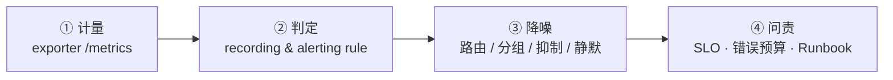

---
tags:
  - Linux
  - 可观测性
  - 日志
  - 监控
  - 告警
  - 学习地图
created: 2026-09-19
---

# 日志、监控与可观测性

> [!cite] 参考资料
> `man 1 journalctl`、`man 5 journald.conf`、`man 8 logrotate`、`man 5 logrotate.conf`、`man 5 rsyslog.conf`、`man 1 logger`、`man 1 sar`、`man 5 sysstat`、`man 1 timedatectl`、`man 5 proc_pid_pressure`；Prometheus 官方文档的「Data model / Querying basics / Alerting rules / Storage」、Alertmanager 的「Configuration / Routing / Inhibition / Silences」、`node_exporter` 的「Collectors」、`blackbox_exporter` 的「Configuration / Metrics」；W3C Trace Context 规范与 OpenTelemetry 的「Signals / Sampling」；RFC 5424（syslog 协议）；发行版文档中的「Configuring logging / Monitoring performance（RHEL 9）」与「Journal and log files（Ubuntu Server Guide）」。
>
> **实测环境：Ubuntu 24.04.5 LTS（VMware 虚拟机）/ 内核 `6.8.0-139-generic` / systemd 255（`255.4-1ubuntu8.17`）/ cgroup v2 / root 可用（`uid=0`，另有 `realtyz` `uid=1000`，属 `adm` 组）。** 默认值与实测行为均取自这台机器：`journald` 持久化在 `/var/log/journal`，`rsyslog` 与 `sysstat` 都在运行且开机自启，`sysstat-collect.timer` 每 10 分钟采一次（`/var/log/sysstat/sa19`）。
>
> 本章前半部分（子笔记 01–08）涉及的工具在本机**都已正常安装**（`sar`/`iostat`/`mpstat`/`pidstat`、`logrotate`、`logger`、`socat`、`nc`），所以子笔记 03 关于 sysstat 的内容是**直接跑真命令**得到的，**不再需要「先 `apt-get download` 再 `dpkg-deb -x` 解包运行」这套绕开非 root 的做法**。仍按解包方式做的只有 Prometheus/Alertmanager/blackbox_exporter/node_exporter（子笔记 09–12），目的是不留下常驻服务与监听端口。凡是需要多机、TLS 接收端、追踪后端、云监控或 RHEL 默认值的部分，子笔记中均显式标注「未实测」。

> 本页是子目录 `09_日志与监控/` 的 00 号导读，不是全部正文。知识脉络、生产技能地图、训练台阶、术语速查、故障现场定位表都在这一页；逐项深入的正文拆成子笔记，索引见第 7 节。
>
> **读者定位：刚入职的运维/SRE。** 假设你会基本 shell、用过 `systemctl status` 和 `top`，也会在出故障时 `tail` 一下日志；但没系统想过「这条日志为什么会出现在这个文件里、谁在切它、磁盘满了到底是谁占的」「指标为什么这么采集、告警为什么响了/没响」。这一章补的正是这套框架。
>
> 相邻阶段的概念会在正文里以纯文本提到（例如阶段 3 的句柄与 D 状态、阶段 4 的可用内存口径与 PSI、阶段 5 的 inode 与 `df`/`du` 不一致、阶段 6 的连接状态与重传、阶段 8 的 journald 与 timer），但**本目录内部只用本目录的 wikilink**；需要复习时回大纲页找对应章节。

> [!info] 读之前：先自检三条前提
> 1. **一台能让你只读观测的机器。** 第 3 节的 T1 全程只读，生产机上也可以做；T2 以上的动手内容需要一台可快照的实验机。本文的实测机是一台可快照的 Ubuntu 24.04.5 虚拟机、root 可用：日志链路、`logrotate`、`/proc` 观测、`journalctl --vacuum-*`、「用临时 loop 文件系统造一次磁盘写满」都能真做；Prometheus 栈仍按解包运行的方式做（子笔记 09）。
> 2. **分得清「看得见」和「能交付」。** 这一章的验收不是记住 `journalctl` 的参数，而是能交出四样东西：一份可观测性基线卡、一份日志与容量治理记录、一套能跑通的规则与告警配置、一份带回滚的变更记录。
> 3. **能接受「先问影响面，再看数据」。** 这一章真正要建立的是取用顺序：指标定范围 → 日志/追踪定细节 → 变更时间线定诱因；**顺序对了，工具差一点也能定位；顺序错了，工具再全也是翻日志**。

## 0. 30 秒速览

> [!abstract] 这一章只要记住六句话
> 首学读不懂很正常：先跳过这一节，读完第 1 节和子笔记 01、03 再回来逐条验证。全章按两条线组织——**一条日志的一生**（04–08）与**一次告警的一生**（09–12）。
> - **同一条日志通常两边都有，journald 与 rsyslog 不是二选一。**
>   - 证据：实测 `logger -t labtest "hello-from-logger"` 后，`journalctl -t labtest -o json` 给出 `SYSLOG_IDENTIFIER=labtest`、`_PID=15907`、`_UID=0`、`_TRANSPORT=syslog`，`/var/log/syslog` 里是纯文本一行；`ForwardToSyslog=yes` 来自 `/usr/lib/systemd/journald.conf.d/syslog.conf` 这个 drop-in（`/etc/systemd/journald.conf` 里那一行是注释掉的 `#ForwardToSyslog=no`）。
> - **轮转的关键不是「切开」，而是「切开之后谁还在写」。**
>   - 证据：实测 `copytruncate` 后 inode 不变（`1310736 → 1310736`）；换成 `create` 后 inode 变了（新 `1310803`、归档 `1310798`），持有旧 fd 的进程把随后 **9 行**写进了**归档文件**、新文件 0 行——所以必须在 `postrotate` 里让应用重开文件。
> - **「日志写满」先分四类，不是一律删文件。**
>   - 证据：在临时 loop 文件系统里实测——`rm` 掉一个仍被进程持有的 10MiB 文件后，`df` 已用从 `24576` 涨到 `10510336` 字节（约 10MiB），而 `du -sh` 只看到 20K、`/proc/$$/fd/4` 显示 `(deleted)`；关掉 fd 后立刻回落到 `24576`。
> - **指标不是「采了就有用」：语义、频率与 label 基数才决定成本和可用性。**
>   - 证据：实测 node_exporter 一次抓取 **1574 行**非注释指标（总行数 1585）；`node_load1=0.18`、`node_memory_MemAvailable_bytes=7.495938048e+09`、`node_filefd_allocated=1472`、`node_sockstat_TCP_inuse=20`、`node_filesystem_avail_bytes{mountpoint="/"}=3.8498992128e+10`（`device` 是 `/dev/mapper/ubuntu--vg-ubuntu--lv`，根分区在 LVM 上，不是裸盘名）。闭环要三段都能给出值：`up=1` → 记录规则 `lab:node_cpu_utilisation:rate1m=0.8255288125000102` → `ALERTS{alertname="LabRootAlmostFull",alertstate="firing"}=1`。
> - **平均值会骗人，分位数还会「看口径」。**
>   - 证据：同一组 1000 个样本（950×20ms + 45×100ms + 5×2000ms）实测平均 33.5ms、最大 2000ms，而 p95 按四种常见口径分别是 **20.0 / 24.0 / 96.0 / 100.0 ms**。
> - **告警的价值在「降噪 + 可执行」，顺序是分组 → 抑制 → 静默。**
>   - 证据：实测把同 `alertname+service` 的两条 warning 发进 Alertmanager，webhook 只收到一个分组 `groupKey={}/{severity="warning"}:{alertname="NodeCpuHigh", service="web"}`；建 silence 后告警变 `suppressed + silencedBy=['a23478de-5b79-41f4-aa83-5ee6c70dc0c5']`；同 `alertname+service` 再发 critical，warning 变 `suppressed + inhibitedBy=['0c65b10c93ac87dc']`，而 `service="db"` 的那条仍是 `active`（抑制规则带了 `equal`）。

> [!tip] 这一页怎么用：三条入口
> - **系统学（推荐，按阶段 9 的 4~6 天）**：从第 3 节的「四级训练台阶」开始，T0 → T4 逐级往上；每一级用第 2 节的技能表核对交付物。
> - **出事急救**：直接看第 6 节「故障现场定位表」，定位到环节后进对应子笔记，或翻子笔记 17《可观测性故障处置手册》。
> - **面试速览**：第 0 节 + 第 1 节 + 第 5 节术语表 + 各子笔记末尾的自测卡；每道题都要能补一句「第一反应不要做什么」。

## 1. 知识地图（第一条主线）

### 1.1 第一条主线：一条日志的一生（五站）

这一章不按「journald、logrotate、Prometheus、告警」四个名词平铺，而是跟着**一条日志的一生**和**一次告警的一生**走。先把日志这条线走通：从应用决定「怎么写」，到「落在哪、被谁切、被谁搬走、最后怎么被回收」。

| #   | 站点  | 这一站在解决什么                                   | 这一站的证据                                                          | 主要子笔记 |
| --- | --- | ------------------------------------------ | --------------------------------------------------------------- | ----- |
| 1   | 诞生  | 应用按什么格式、往哪个方向写（stdout / 自有文件 / syslog 套接字） | `systemctl show -p StandardOutput`、程序自己的配置文件                    | 04    |
| 2   | 落点  | 日志最终进了 journald 还是 rsyslog，两者怎么分工          | `journalctl -o json` 字段、`/var/log/syslog`、`ForwardToSyslog`     | 05    |
| 3   | 轮转  | 谁在什么时候切文件、切完之后应用还往哪写                       | `logrotate -d`、`stat -c %i`、`/proc/<pid>/fd`                    | 06    |
| 4   | 集中  | 日志怎么离开本机、报文长什么样、中心机怎么接                     | 原始 syslog 报文、`rsyslog` 转发配置、接收端落盘                               | 07    |
| 5   | 退役  | 日志怎么被删、容量怎么算、磁盘满时先做什么                      | `df -hT`/`df -i`、`du -xsh`、`lsof +L1`、`journalctl --disk-usage` | 08    |

### 1.2 第二条主线：一次告警的一生（四站）

第二条线跟着**一次告警**走：从「暴露一个指标」到「有人拿着证据干活」。这条线走不通时，最常见的现象不是「没有监控」，而是**告警响了没人管，或者该响的时候没响**。

| # | 站点 | 这一站在解决什么 | 这一站的证据 | 主要子笔记 |
| --- | --- | --- | --- | --- |
| 1 | 计量 | 指标从哪来、语义是什么（counter/gauge、USE） | `/metrics`、`up`、`node_scrape_collector_duration_seconds` | 09 |
| 2 | 判定 | 什么条件算「出事」，表达式怎么写、怎么校验 | `promtool check rules`、`/api/v1/rules`、`ALERTS` | 10 |
| 3 | 降噪 | 一次故障怎么只发一条通知、怎么临时压掉 | `group_by`、`inhibit_rules`、silence 的 `silencedBy`/`inhibitedBy` | 11 |
| 4 | 问责 | 哪些告警必须立刻处理、谁负责、怎么复盘 | SLI/SLO、错误预算、Runbook 链接与负责人 | 12 |

两条主线共用一个前提，也是新人最容易省掉的一步：**证据必须能对齐时间**。日志、指标、追踪、变更记录四份数据的时间戳必须落在同一条时间轴上，否则「拐点」和「变更」永远对不上（子笔记 02）。

### 1.3 四条横切线

两条主线是时间线，但有几件事会横穿多个站点。新人最容易「每一站都看过，却串不起来」，就是没抓住这四条线：

| 横切线 | 贯穿内容 | 收口于 | 主要子笔记 |
| --- | --- | --- | --- |
| **取用顺序** | 指标定范围 → 日志定细节 → 追踪定段落 → 变更定诱因；四条证据链各自回答什么问题 | 「服务慢但资源空闲」这类问题的定位树 | 01、13、16、17 |
| **统计口径** | 平均 vs 分位数、算法差异、直方图聚合、瞬时采样漏掉的短脉冲与周期抖动 | 一份写清「窗口 + 算法 + 聚合层级」的指标口径说明 | 13、17 |
| **成本与容量** | 日志保留天数、指标 cardinality、追踪采样率；采集频率是成本，`/var/log` 要分盘 | 三个数字 + 分盘与保留策略 | 08、14、17 |
| **时间基线** | 时区、NTP、墙上时钟 vs 单调时钟、日志与 `sadf` 的时间戳格式 | 「三个系统的证据对齐到同一条时间轴」 | 02、06、15、17 |

还有一条不是机制，而是纪律：**采集本身要可观测**。`up`、抓取耗时、目标数量、日志采集器的队列与丢弃计数、`sar` 有没有当天数据——这些都是「监控系统的监控」，缺了它们，故障时你会先怀疑数据本身。

### 1.4 前置地基

以下三篇是读懂两条主线的最低门槛，不是扩展阅读。缺哪块补哪块，再回来看主线。

| 前置篇 | 你要先建立的概念 | 对应子笔记 |
| --- | --- | --- |
| 可观测性世界观与三条链路 | 「可观测性」不是多装几个监控，而是四条互补的证据链加一条时间轴；三类数据的成本模型完全不同 | [[Linux/09_日志与监控/01_前置_可观测性世界观与三条链路\|01 前置：可观测性世界观与三条链路]] |
| 证据的时间与格式基线 | 时区与时钟同步、墙上时钟 vs 单调时钟、各类时间戳格式；为什么「先对表再排障」 | [[Linux/09_日志与监控/02_前置_证据的时间与格式基线\|02 前置：证据的时间与格式基线]] |
| 观测工具箱与证据命令 | 日志、容量、指标、历史四类观测各用哪几条命令；每条命令回答什么问题 | [[Linux/09_日志与监控/03_前置_观测工具箱与证据命令\|03 前置：观测工具箱与证据命令]] |

> [!warning] 这一章最容易「看起来懂了」
> 可观测性的坑几乎都不是命令不会敲，而是**不知道这个数字是怎么算出来的、这份数据保留多久、这条告警要谁去做什么**。如果读完子笔记 01–03 还说不清「为什么监控要看分位数」「为什么 `df` 和 `du` 会差 10 MiB」，先别急着配 Prometheus 和告警规则——那会变成背配置文件。

## 2. 生产技能地图（第二条主线）

知识和技能是两条线。**读完不等于会做**，所以这一章明确交付 9 项技能，每项都有可观察的行为和一个交付物。学每一篇的时候，对照这张表看自己在练哪一项。

| # | 技能 | 可观察的行为 | 在哪几篇练 | 交付物 |
| --- | --- | --- | --- | --- |
| S1 | 可观测性基线盘点 | 拿到一台陌生机器，15 分钟内说清「日志落在哪、有没有轮转、指标谁在采、历史有没有存、时钟准不准」 | 02、03、08、15、18 | 一份可观测性基线卡 |
| S2 | 日志字段与落点规范 | 给一个应用定出日志字段（时间/级别/服务/实例/请求 ID）并说清它写到了哪个文件或通道 | 04、05 | 一份日志字段规范 + 落点清单 |
| S3 | 轮转配置与磁盘满处置 | 写出可用的 `logrotate` 配置，并在「写满」场景下按四类原因定位、止血、补防线 | 06、08、17 | 一份轮转配置 + 磁盘满处置记录 |
| S4 | 远程日志集中 | 让日志按指定传输（UDP/TCP/TLS）到达中心机，并用接收端落盘证明它到了 | 07 | 一份集中转发配置 + 验收记录 |
| S5 | 指标采集与语义 | 起一个 exporter、抓一次 `/metrics`、按 USE 列出每类资源的检查项 | 09、13 | 一份指标检查表 + exporter 自监控项 |
| S6 | 规则与告警编写 | 写出 recording/alerting rule，用 `promtool check rules` 校验，并用 `ALERTS` 证明它真的进入 firing | 10、18 | 一份规则文件 + CI 校验记录 |
| S7 | 告警降噪与可用性探测 | 配出 `group_by`/`inhibit_rules`/silence，并用 `silencedBy`/`inhibitedBy` 验证；配出证书到期探测 | 11、18 | 一份告警规范 + 路由与抑制配置 |
| S8 | SLO 与错误预算 | 给一个核心服务定义 SLI/SLO，算出错误预算，用它决定「立刻处理还是排期」 | 12 | 一份 SLO 定义 + 错误预算台账 |
| S9 | 历史复盘与成本基线 | 用 `sar` 复盘任意历史时间窗，并给出保留天数、cardinality、采样率三个数字 | 14、15、17 | 一份复盘报告 + 一份成本基线卡 |

这 9 项里，S1、S5、S9 是**判断力**（知道看什么、怎么算），S2、S3、S4、S6、S7 是**操作力**（能配出来、能验证），S8 是把告警变成组织决策的能力。新人通常卡在 S1、S5、S8——这几项没有命令清单可背，只能靠带反馈的练习建立直觉。

## 3. 四级训练台阶

技能靠难度递增、风险可控的重复练习获得。**每一级都写明了在哪台机器上做**，这条边界本身就是 S1 的训练内容。

| 台阶 | 做什么 | 在哪台机器 | 交付物 |
| --- | --- | --- | --- |
| **T0 读通** | 画出「一条日志的一生」五站与「一次告警的一生」四站；说清「日志查不到」至少要看哪几站 | 纸面/白板 | 自己画的四张链路图 |
| **T1 观测** | 采集日志落点与轮转、journald 容量、指标采集现状、`sar` 是否有数据、时间基线；全程只读 | **生产机可以做（只读）** | 可观测性基线卡 |
| **T2 可回滚变更** | 写一条 `logrotate` 规则、配一次远程转发（实验机内）、加一条 recording/alerting rule、建一次 silence | 实验机 | 变更记录（含验证与回滚） |
| **T3 故障注入与恢复** | 造一次「轮转后新文件不增长」、一次「删了不释放」、一次告警风暴、一次证书探测失败 | **可快照实验机** | 演练记录 + 分层判读结论 |
| **T4 限时模拟** | 给一个现象（磁盘被写满 / 告警不响 / 服务慢但资源空闲），20 分钟内定位并写出处置报告 | 实验机 + 计时 | 一份排障报告 |

> [!warning] 两条不能破的边界
> **只有 T1 允许在生产机上做，而且全程只读**：`journalctl`、`df`/`du`/`lsof`、`ss`、`vmstat`、`sar`、`timedatectl`、`curl /metrics`。任何会改配置、强制轮转、删日志、建 silence、改告警规则的动作都属于 T2 及以上。
> **T2 到 T4 一律在可快照实验机**：`logrotate -f` 会在非排障场景下快速消耗保留份数；`rm` 大文件可能删掉正在被持有的数据；改 `journald.conf`、改采集与告警规则都会影响真实告警的送达。动手前先备份原文件（`cp` 到 `~/lab-backup/`），改完用同一条命令复测。

## 4. 学习路线

**系统学的三遍读法（对应阶段 9 的 4~6 天）：**

- **第一遍（约两天，把日志这条线走通）**：第 1 节 → 前置 01、02 → 04（日志怎么写）→ 05（落点与分工）→ 06（轮转）→ 08（磁盘满）→ 17 的「磁盘被写满」「日志查不到」两节 → 实验 1、3、4。这一遍结束应该能处理「日志不增长」和「磁盘被日志写满」。
- **第二遍（约两天，把指标与告警这条线走通）**：前置 03 → 09（采集与语义）→ 13（统计口径）→ 10（PromQL 与规则）→ 11（路由、降噪与探测）→ 实验 5、6、7、8。这一遍结束应该能配出一套「采集 → 规则 → 告警 → 通知」的最小闭环。
- **第三遍（治理与收口）**：07（远程集中）→ 12（SLO 与错误预算）→ 14（成本与容量纪律）→ 15（sysstat 复盘）→ 16（追踪）→ 17 其余各节 → 18 汇总自测 → T3、T4。

**只想解决手头问题的快捷入口：**

| 你的问题 | 去哪 |
| --- | --- |
| 日志查不到、查不全 | 子笔记 05、17 |
| 磁盘被写满 / 删了文件空间没释放 | 子笔记 08、17 |
| 轮转后新日志是空的、旧归档一直在长 | 子笔记 06、17 |
| 想让日志集中到一台机器 | 子笔记 07 |
| 不知道监控该采什么、指标看不懂 | 子笔记 09、13 |
| 想加一条告警规则 / 告警不响 | 子笔记 10、17 |
| 告警风暴、通知太多 | 子笔记 11、17 |
| 想给证书到期、服务可用性配探测 | 子笔记 11 |
| 要定 SLO、算错误预算 | 子笔记 12 |
| 复盘「昨晚 3 点系统变慢」 | 子笔记 15、17 |
| 服务慢但资源都空闲 | 子笔记 13、16、17 |
| 日志和指标时间对不上 | 子笔记 02、17 |

## 5. 术语速查

> [!info]- 名词速查（读到哪里卡住，就回这里查）
> | 名词 | 一句话解释 | 在哪一篇展开 |
> | --- | --- | --- |
> | 三条链路 / 四条证据链 | 日志（发生了什么）/指标（多严重、何时开始）/追踪（慢在哪一段）/变更事件（是不是我改的） | 01 |
> | 最小维度集 | 每份证据至少要带的维度：环境、服务、实例、版本 | 01、04 |
> | 墙上时钟 / 单调时钟 | 会被 NTP 调整的「日历时间」/ 只随开机累加、不受对时影响的计时器 | 02 |
> | journald / rsyslog | systemd 的结构化日志收集器 / 传统 syslog 守护进程与转发者 | 05 |
> | `ForwardToSyslog=` | journald 是否把收到的日志再转给 rsyslog（Ubuntu 上由 drop-in 置为 `yes`） | 05 |
> | `Storage=` / `SystemMaxUse=` | journal 是否持久化（`auto`/`persistent`/`volatile`）/ journal 的容量上限 | 05 |
> | `SYSLOG_IDENTIFIER` / `_SYSTEMD_UNIT` | journald 字段：消息来源标识 / 消息属于哪个 unit | 05 |
> | logrotate | 按时间/大小切割日志、压缩、保留，并在 `postrotate` 里通知应用的定时任务 | 06 |
> | `copytruncate` | 复制一份再截断原文件：inode 不变，存在丢日志窗口 | 06 |
> | `create` + `postrotate` | 换新文件并通知应用重开：标准做法，但应用必须真的重开 | 06 |
> | `delaycompress` / `sharedscripts` | 延后一轮再压缩 / 一组日志只跑一次脚本 | 06 |
> | PRI / RFC 5424 | syslog 优先级字段（facility×8 + severity）/ 带结构化数据的新报文格式 | 07 |
> | `@` / `@@` | rsyslog 转发：UDP / TCP | 07 |
> | RELP / syslog over TLS | 带确认的重传协议 / 加密的 syslog 传输 | 07 |
> | exporter / scrape | 暴露 `/metrics` 的采集端 / Prometheus 按周期主动抓取 | 09 |
> | counter / gauge | 只增不减的累计量（用 `rate()`）/ 可升可降的瞬时值 | 09、10 |
> | cardinality | label 组合的数量，决定时序数量与存储、查询成本 | 09、14 |
> | USE | 按资源问三个问题：利用率、饱和度、错误 | 09 |
> | PSI | `/proc/pressure/*` 的压力指标，`some`/`full` 区分局部与全面停顿 | 09、13 |
> | recording rule / alerting rule | 预计算并保存的表达式 / 触发告警的规则 | 10 |
> | `ALERTS` | 由告警规则生成的时序，`alertstate` 为 `pending`/`firing` | 10 |
> | `up` | Prometheus 对每个 target 的抓取结果（1/0），最基础的可用性指标 | 09、10 |
> | grouping / inhibition / silence | 合并同类告警 / 用高优先级压掉低优先级 / 有期限地临时静音 | 11 |
> | `probe_success` / `probe_ssl_earliest_cert_expiry` | blackbox 探测是否成功 / 证书最早到期时间（证书告警的判据） | 11 |
> | SLI / SLO / 错误预算 | 实际测量值 / 目标 / `1-SLO` 对应的允许额度 | 12 |
> | 预算消耗速率（burn rate） | 错误预算被消耗的快慢，用来区分「立刻处理」与「排期」 | 12 |
> | 分位数口径 | 同一个 p95，插值方式不同结果不同；跨实例聚合必须合并直方图 | 13 |
> | `sar` / `sadc` / `sadf` / `HISTORY` | 历史指标读取 / 采样写入 / 导出 CSV / 保留天数 | 15 |
> | trace / span / `traceparent` | 一次完整调用 / 其中一段 / W3C 的上下文透传头 | 16 |
> | 头部采样 / 尾部采样 | 入口按比例决定 / 收集端看完整 trace 后决定 | 16 |

## 6. 故障现场定位表

排障的第一问不是「怎么修」，而是「**这份数据是谁生成的、我该看哪条链路、证据在哪**」。用这张表把现象定位到环节，再进对应子笔记。

| 你看到的现象 | 卡在哪一环 | 现场在哪 | 第一反应不要做 | 去哪一篇 |
| --- | --- | --- | --- | --- |
| 磁盘被写满 / 根分区满了 | 日志退役 | `df -hT`、`df -i`、`du -xsh /var/log/*`、`lsof +L1` | 不要 `rm -rf /var/log/*` | 08、17 |
| 删了大文件，空间没释放 | 日志退役 | `/proc/<pid>/fd` 里的 `(deleted)`、`lsof +L1` | 不要继续删、也不要 `kill -9` 业务进程 | 08、17 |
| 日志查不到 / 查不全 | 日志落点 | `systemctl show -p StandardOutput -p StandardError`、`journalctl -u`、`cat-config journald.conf` | 不要先怀疑应用没打日志 | 05、17 |
| 轮转后新日志是空的、旧归档一直在长 | 日志轮转 | `stat -c %i`、`ls -l /proc/<pid>/fd`、`/etc/logrotate.d/*` 的 `postrotate` | 不要以为「切了文件就完事」 | 06、17 |
| 轮转该发生却没发生 | 日志轮转 | `logrotate -d <conf>`、`/var/lib/logrotate/status` | 不要用 `-f` 反复强制执行 | 06、17 |
| 集中到中心机之后日志断了 / 中心机磁盘满 | 日志集中 | 发送端 `rsyslog` 配置、接收端落盘与容量、UDP/TCP 选择 | 不要以为集中了就不占空间 | 07、08、17 |
| 指标缺失、断点或抓取失败 | 指标计量 | `/api/v1/targets` 的 `health/lastError`、`up`、目标侧 `curl /metrics` | 不要先改查询与规则 | 09、17 |
| 告警不响 | 规则判定 | `ALERTS`、`/api/v1/rules`、`amtool config routes test` | 不要先查通知渠道 | 10、11、17 |
| 告警风暴 / 半夜被叫醒 | 告警降噪 | `group_by`、`inhibit_rules`、`silence query` | 不要直接调高阈值或延长 `for` | 11、12、17 |
| 证书到期 / 服务从用户视角不可用 | 可用性探测 | `probe_success`、`probe_ssl_earliest_cert_expiry`、`probe_http_status_code` | 不要等用户报障 | 11、17 |
| 服务慢但 CPU/内存/IO 都空闲 | 统计口径与追踪 | 延迟分位数、`/proc/pressure/*`、一次请求的 span 树 | 不要只看平均延迟就下结论 | 13、16、17 |
| 「昨晚 3 点系统变慢」要复盘 | 历史指标 | `ls /var/log/sysstat/`、`sar -u -s 03:00:00 -e 04:00:00` | 不要只看现在的 `top` | 15、17 |
| 三个系统的证据时间对不上 | 时间基线 | `timedatectl`、`timesync-status`、日志时间戳格式 | 不要在时钟不同步时下结论 | 02、17 |

两个容易被忽略的边界：

- **告警响不响和通知收到没收到是两件事。** `ALERTS` 里 `firing` 只说明规则算出来了；还要经过路由、分组、抑制、静默，最后才轮到通知渠道。逐段验证比整体怀疑快得多。
- **「指标正常」不等于「用户正常」。** 指标是聚合视角，用户感受的是单次请求；当资源空闲但用户喊慢时，答案通常在分位数、依赖或追踪里，而不是在平均值里。

## 7. 子笔记索引

| # | 子笔记 | 一句话 | 主要技能 | 难度 |
| --- | --- | --- | --- | --- |
| 01 | [[Linux/09_日志与监控/01_前置_可观测性世界观与三条链路\|前置：可观测性世界观与三条链路]] | 四条证据链的分工、取用顺序与最小维度集 | S1 | 前置 |
| 02 | [[Linux/09_日志与监控/02_前置_证据的时间与格式基线\|前置：证据的时间与格式基线]] | 时区、时钟同步、墙上时钟与单调时钟、时间戳格式 | S1 | 前置 |
| 03 | [[Linux/09_日志与监控/03_前置_观测工具箱与证据命令\|前置：观测工具箱与证据命令]] | 日志、容量、指标、历史四类观测的命令地图 | S1、S9 | 前置 |
| 04 | [[Linux/09_日志与监控/04_日志的诞生_格式与落点选择\|日志的诞生：格式与落点选择]] | 机器可读字段、三种落点的取舍、别用日志解析做指标 | S2 | 核心 |
| 05 | [[Linux/09_日志与监控/05_日志的落点_journald与rsyslog\|日志的落点：journald 与 rsyslog]] | 双落点、结构化字段、持久化与容量、`journalctl` 用法 | S2、S3 | 核心 |
| 06 | [[Linux/09_日志与监控/06_日志的轮转_logrotate的两种切法\|日志的轮转：logrotate 的两种切法]] | `copytruncate` vs `create`+`postrotate`、inode 与状态文件 | S3 | 核心 |
| 07 | [[Linux/09_日志与监控/07_日志的集中_远程syslog与采集器\|日志的集中：远程 syslog 与采集器]] | PRI/RFC 5424、UDP/TCP/TLS、集中方案选型与中心机容量 | S4 | 核心 |
| 08 | [[Linux/09_日志与监控/08_日志的退役_容量治理与磁盘写满\|日志的退役：容量治理与磁盘写满]] | 四类原因、`df`/`du` 不一致、三层保留策略 | S3 | 核心 |
| 09 | [[Linux/09_日志与监控/09_指标的计量_node_exporter与指标语义\|指标的计量：exporter 与指标语义]] | pull 模型、关键指标族、counter/gauge、USE 与自监控 | S5 | 核心 |
| 10 | [[Linux/09_日志与监控/10_指标的判定_PromQL与告警规则\|指标的判定：PromQL 与告警规则]] | 数据模型、四类常用 PromQL、记录与告警规则、`ALERTS` | S6 | 核心 |
| 11 | [[Linux/09_日志与监控/11_告警的降噪_路由分组抑制与探测\|告警的降噪：路由、分组、抑制与探测]] | `group_by`/`inhibit_rules`/silence、blackbox 可用性与证书 | S7 | 核心 |
| 12 | [[Linux/09_日志与监控/12_告警的问责_SLI_SLO与错误预算\|告警的问责：SLI/SLO 与错误预算]] | SLI/SLO/错误预算换算、告警分层、告警规范与复盘 | S8 | 核心 |
| 13 | [[Linux/09_日志与监控/13_统计口径_平均分位数与采样偏差\|统计口径：平均、分位数与采样偏差]] | 平均掩盖长尾、分位数四种口径、瞬时采样漏检 | S5 | 核心 |
| 14 | [[Linux/09_日志与监控/14_成本与容量纪律_保留期基数与采样率\|成本与容量纪律]] | 保留天数、cardinality、采样率三个数字；高频日志分流 | S9 | 核心 |
| 15 | [[Linux/09_日志与监控/15_历史指标与事后复盘_sysstat\|历史指标与事后复盘：sysstat]] | `sadc`/`sar`/`sadf`、`HISTORY`、采集 timer 与 cron | S1、S9 | 核心 |
| 16 | [[Linux/09_日志与监控/16_分布式追踪_trace与span\|分布式追踪：trace 与 span]] | trace/span/`traceparent`、头部与尾部采样、最小落地 | S5 | 进阶 |
| 17 | [[Linux/09_日志与监控/17_可观测性故障处置手册\|可观测性故障处置手册]] | 十一类现象 → 环节 → 证据 → 处置顺序（含速查表） | 全部 | 收口 |
| 18 | [[Linux/09_日志与监控/18_动手实验与要点自测\|动手实验与要点自测]] | 实验索引与总自测 | 全部 | 汇总 |

## 自检清单

- [x] frontmatter 有 `tags` 和 `created`，全篇只有一个一级标题
- [x] 速览卡 6 条，每条都是「一句结论 + 一行证据或验证方法」
- [x] 知识地图有两条时间主线（日志一生 / 告警一生）与四条横切线，技能主线（S1–S9 + T0–T4）都在本页可见
- [x] 章节内引用只用章节内 wikilink；提及其他阶段一律用纯文本
- [x] 阶段 9 已按「主笔记 + 子笔记」拆分，索引覆盖目录内全部 18 篇子笔记
- [ ] 第 6 节的每一种现象都在对应子笔记里演练过一次
- [ ] 每张 Mermaid 图都在 Obsidian 里预览过，能正常渲染
