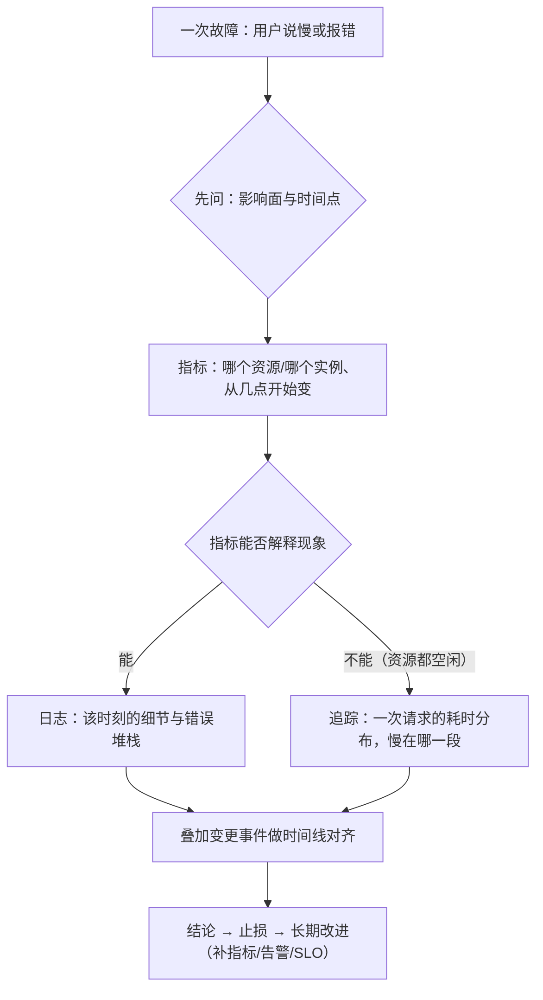

---
tags:
  - Linux
  - 可观测性
  - 日志
  - 监控
created: 2026-09-19
---

# 前置：可观测性世界观与三条链路

> [!cite] 参考资料
> OpenTelemetry 的「Signals」文档、Prometheus 官方文档的「Data model」与「Overview」、Google SRE Book 的「Monitoring Distributed Systems」与「Embracing Risk」（SLI/SLO 与告警分层的思想来源）。
>
> 本篇是概念篇，不依赖具体命令；文中给出的成本对比方向与实测数字来自 Ubuntu 24.04.4（WSL2）/ systemd 255 环境的观测（详见子笔记 05、09、13）。

> **这篇讲什么**：把「可观测性」这个词拆成能干活的东西——四条互补的证据链、一个取用顺序、一套最小维度集，以及「先闭环再扩指标」的落地顺序。
>
> **必须先读什么**：无。这是整章的起点，只需要会基本 shell。
>
> **读完能回答**：① 日志、指标、追踪、变更事件分别回答什么问题？② 出了故障先看哪个、后看哪个，为什么？③ 为什么「采集之前要先定维度集」？④ 一个最小可用的可观测性体系由哪几块组成？
>
> 所属：[[Linux/09_日志与监控/00_导读与知识地图|09 日志、监控与可观测性]] 的「取用顺序」横切线（前置）· 主要练 **S1 可观测性基线盘点**

## 0. 30 秒速览

> [!abstract] 这一篇只要记住五句话
> - **可观测性不是「多装几个监控」，而是四条互补的证据链加一条时间轴。**
>   - 怎么验证：日志、指标、追踪、变更记录各找一个你自己的来源；缺哪条，下次就只能靠猜。
> - **四类数据的成本模型完全不同，选哪条链本质是在成本和信息量之间做取舍。**
>   - 怎么验证：随便挑一份数据问「保留多久、基数多大、采样率多少」，答不上来说明成本没人管。
> - **取用顺序是「从便宜到贵」：指标定范围 → 日志/追踪定细节 → 变更时间线定诱因。**
>   - 怎么验证：下次故障先写「影响面 + 时间点」，看完指标再翻日志——顺序反了会浪费大量时间。
> - **最小维度集是硬要求：环境、服务、实例、版本。**
>   - 怎么验证：抽查一条指标和一条日志，看这四项是否齐全；只有 `service` 没有 `instance` 的指标在集群里等于不可用。
> - **先闭环再扩指标。**
>   - 怎么验证：能否回答「昨天 15:20 这台机器的 CPU/内存/磁盘/连接数」；答不出来就先别谈 dashboard 和自研 exporter。

## 1. 可观测性到底在解决什么问题

传统运维里，故障处理靠的是「人记得住的东西」：谁改了什么、哪台机器上次出过问题、这个服务平时 CPU 多少。系统一变多、一变快，这套记忆就不够用了，于是需要**用外部数据回答当初没预料到的问题**——这就是可观测性。

一个可落地的定义：

> **可观测性 = 你在没预料到故障形态的情况下，仍然能靠已有的数据把「发生了什么、从什么时候开始、影响多大、是不是我改的」回答出来。**

这四个「回答」正好对应四条证据链：

| 链路 | 回答的问题 | 数据特征 | 成本主要花在 | 典型实现 |
| --- | --- | --- | --- | --- |
| 日志 | **发生了什么**（详细、个案） | 高基数、高体积、文本/结构化 | 存储与索引、保留期 | journald、rsyslog、Loki（Promtail）、Elasticsearch（Filebeat） |
| 指标 | **多严重、从什么时候开始**（聚合、趋势） | 低基数、固定维度、可长期保留 | 采集频率、cardinality | node_exporter + Prometheus、`sar`、云监控 |
| 链路追踪 | **一次请求慢在哪一段**（分布式调用） | 按请求采样、有链路结构 | 采样率与后端容量 | OpenTelemetry + Jaeger/Tempo 等 |
| 变更事件 | **是不是我改了什么** | 时间点 + 对象 + 变更人 | 流程纪律 | 发布系统、`auditd`、堡垒机、CMDB |

> [!important] 四条链不是「四选一」，而是「四选多」
> 真实系统里四类数据通常同时存在，只是覆盖度不同。新人最容易犯的错是**只用自己熟的那一条**：习惯 `tail` 日志的人，遇到「CPU 从 30% 涨到 90%」这类趋势问题会翻半天日志；习惯看面板的人，遇到「某个请求失败了一次」会在聚合曲线里找不到那一行错误。**先想清楚问题属于哪一类，再选链路。**

## 2. 取用顺序：从低成本到高成本

这张图的用法可以压成三句话：

1. **指标定范围**：哪台机器、哪个实例、从几点开始、幅度多大。这一步几乎零成本，而且它能把「全站都慢」和「只有一台慢」区分开——这两类问题的排查方向完全不同。
2. **日志和追踪定细节**：指标解释得了现象（CPU 打满、内存耗尽、磁盘 IO 打满），就去日志里找「是谁干的、报了什么」；指标解释不了（资源都空闲但延迟飙升），就去追踪里看「这 30 秒花在了哪一段」。
3. **变更事件定诱因**：把「指标拐点」和「变更时间点」画在同一张图上。多数故障靠这一步就能缩小到某次发布、某个配置项、某次运维动作。

> [!tip] 时间轴是这四条链的公共底座
> 四条链各自看都对，合起来却对不上，最常见的原因就是时间没对齐：日志用的是本地时区、指标存的是 UTC、机器时钟还漂了几秒。**动手排障前先确认时间基线**（子笔记 02），这一步省的力气比任何搜索语法都多。

## 3. 最小维度集：采集之前先定好

数据采回来才发现「没法按实例对比」，是运维里最常见的返工。原因是采集前没定维度集。

| 维度 | 作用 | 缺失时的后果 |
| --- | --- | --- |
| 环境（env / stage） | 区分生产、预发、测试 | 测试环境的抖动污染生产告警 |
| 服务（service / app） | 区分是谁的数据 | 只能按机器看，无法按服务聚合 |
| 实例（instance / host / pod） | 区分是哪一台、哪一个副本 | 无法横向对比，找不到「只有一台不对」的问题 |
| 版本（version / release） | 区分新旧版本 | 灰度期间无法判断「问题是不是新版本带来的」 |

> [!important] 实例维度是硬要求
> 同一个指标如果只有 `service` 没有 `instance`（或反过来），在集群里等于不可用；日志如果没有 `host`/`container`/`pod` 字段，也拼不出横向对比。**采集之前先定义「最小维度集」：环境、服务、实例、版本。**

这里有一个反直觉的边界要记住：**维度不是越多越好**。指标的成本近似随「label 组合数」（cardinality）增长，把 `user_id`、`request_id`、完整 URL 路径当 label 会让时序数量爆炸。**高基数信息应该进日志或追踪，不进 label**（子笔记 09、14）。

## 4. 宿主机与容器：两套视角都要保留

容器化之后，三条链路依然成立，只是采集点变了：

| 链路 | 宿主机视角 | 容器视角 |
| --- | --- | --- |
| 日志 | journald / `/var/log/*` | 容器运行时收集（容器重建后随之消失），由采集 DaemonSet 送到中心 |
| 指标 | node_exporter（`node_*`） | cAdvisor / kubelet 与业务自身的 `/metrics` |
| 追踪 | 进程内埋点 | 请求头透传，跨服务传播 |

**两套视角都要保留**：容器指标看的是「这个容器用了多少」，宿主机指标看的是「这台机器还剩多少」。只留容器视角，会漏掉「节点本身快满了」「同节点上别的容器在抢资源」这类问题。

## 5. 一个最小可用的可观测性体系

「装了一堆组件但没人看」是最常见的失败模式。按下面四件套落地，先保证闭环再加细节：

| 层 | 最小要求 | 验收动作 |
| --- | --- | --- |
| 日志 | 应用写 stdout（或明确日志文件）+ journald 持久化 + 关键文件轮转 | 随机抽一次故障，能在一个界面里按时间/实例查到对应日志 |
| 指标 | 每台机器有 node_exporter（或云监控）+ 每分钟采集 + 至少 15 天保留 | 能回答「昨天 15:20 这台机器的 CPU/内存/磁盘/连接数」 |
| 告警 | 至少覆盖：`up`（可用性）、磁盘/内存/句柄水位、证书到期、业务错误率 | 每条告警都能对应到一个 Runbook 链接和一个负责人 |
| SLO | 至少一个核心服务定义 SLI 与目标 | 能用错误预算回答「这个月还能不能发版」 |

四条纪律（后面每一篇都会回到它们）：

1. **每条告警都要能对应动作**：告警内容里写清「看哪个面板、跑哪条命令、找谁」。只报不处理的告警要删掉或降级。
2. **区分「立刻处理」与「排期处理」**：与 SLO/影响面挂钩；半夜叫醒人的告警必须真的是「用户正在受影响」。
3. **采集本身要可观测**：`up`、抓取耗时、目标数量、日志采集器的队列/丢弃计数、`sar` 是否有当天数据。
4. **成本要写进方案**：日志保留天数、指标 cardinality、追踪采样率，三个数字都要有明确 owner。

## 常见坑

| 常见做法或说法 | 后果或事实 |
| --- | --- |
| 「装了监控就算有可观测性了」 | 组件只是手段；没有「谁能看懂、谁能据此行动」的闭环，等于没装 |
| 「日志最全，先翻日志」 | 日志是逐条文本、没有聚合能力，「CPU 从 30% 涨到 90%」这种趋势在日志里看不出来 |
| 「看板上有曲线就够了」 | 曲线看不到单次请求；「资源都空闲但用户喊慢」必须靠分位数与追踪 |
| 「先采全量指标，以后再说」 | 高基数 label 会让存储与查询成本线性甚至指数增长，且很难事后清理 |
| 「变更记录是流程的事，和监控无关」 | 没有变更时间线，多数故障只能定位到「大概某个时间」，定不到「哪一次改动」 |

## 决策练习

**场景**：凌晨 2 点收到告警「某 API 错误率上升」。你打开面板，发现该服务的 CPU、内存、IO、连接数都在正常范围，但错误率确实从 01:40 开始升高。

**A. 先看该服务的错误日志，找出错误码和第一次出现的时间**
**B. 直接把所有实例重启一遍，先恢复业务**
**C. 先看同一时间窗内有没有发布、配置变更或上游依赖的抖动**

**为什么选 C**：这个场景的关键特征是「资源正常但错误率上升」，说明问题大概率不在本服务的资源层，而在**依赖、配置或变更**。先看变更与依赖，成本最低且最能缩小范围；确认诱因后，再决定止损方式。

**为什么不选 A**：不看日志是错的——但顺序上应该排在「变更/依赖」之后吗？更准确的说法是：**A 和 C 应该同时做**，因为日志能告诉你错误长什么样（超时？连接被拒？5xx 来自下游？），而变更记录能告诉你「谁在这个时间点动了什么」。如果只做 A，你可能会看到一堆超时日志却不知道是谁在 01:40 改了东西。

**为什么不选 B**：重启是**改变现场**的动作。在没搞清楚错误码和影响面之前重启，可能让问题消失也让证据消失，复发时依然没有线索。只有在「业务已严重受损且需要立刻止血」时才先重启，且重启前必须先取证（错误日志片段、当时的连接状态）。

## 要点自测

> [!question]- 日志、指标、追踪分别回答什么问题？为什么不能只靠其中一条？
> - **日志**：发生了什么（详细、个案，带上下文与堆栈）。
> - **指标**：多严重、从什么时候开始（聚合、趋势、可长期保留）。
> - **追踪**：一次请求慢在哪一段（跨服务调用的耗时分布）。
> - **不能只靠一条**：日志没有聚合能力，看不出趋势；指标看不到单次细节；追踪只看得到被采样的请求。三者互补，再加上变更事件才能形成闭环。
> - **第一反应不要是什么**：不要因为「我只会看日志」就把所有故障都往日志里查。

> [!question]- 为什么「最小维度集」要在采集之前定？
> - **定义**：环境、服务、实例、版本四项，是所有后续对比与聚合的基础。
> - **为什么提前定**：指标一旦采回来缺 `instance`，事后补不回来（只能重新采集并丢弃历史）；日志如果一开始没带请求 ID，跨服务串联就无从下手。
> - **边界**：维度不是越多越好，高基数维度（`user_id`、`request_id`、完整 URL）应进日志或追踪，不进指标 label。
> - **第一反应不要是什么**：不要为了「以后可能用得上」把所有字段都塞进 label。

> [!question]- 一个最小可用的可观测性体系包含哪四块？各自的验收动作是什么？
> - **日志**：应用写 stdout 或明确文件 + journald 持久化 + 关键文件轮转；验收是「能按时间/实例查到一次故障的日志」。
> - **指标**：每机采集 + 至少 15 天保留；验收是「能回答昨天某个时刻的资源水位」。
> - **告警**：覆盖可用性、水位、证书、错误率，每条有 Runbook 与负责人；验收是「每条告警都能落到一个动作」。
> - **SLO**：至少一个核心服务有 SLI 与目标；验收是「能用错误预算回答这个月还能不能发版」。
> - **第一反应不要是什么**：不要先买 dashboard 和自研 exporter，先把这四块接上闭环。

> 上一篇：无（本目录第一篇）｜ 下一篇：[[Linux/09_日志与监控/02_前置_证据的时间与格式基线|02 前置：证据的时间与格式基线]]
