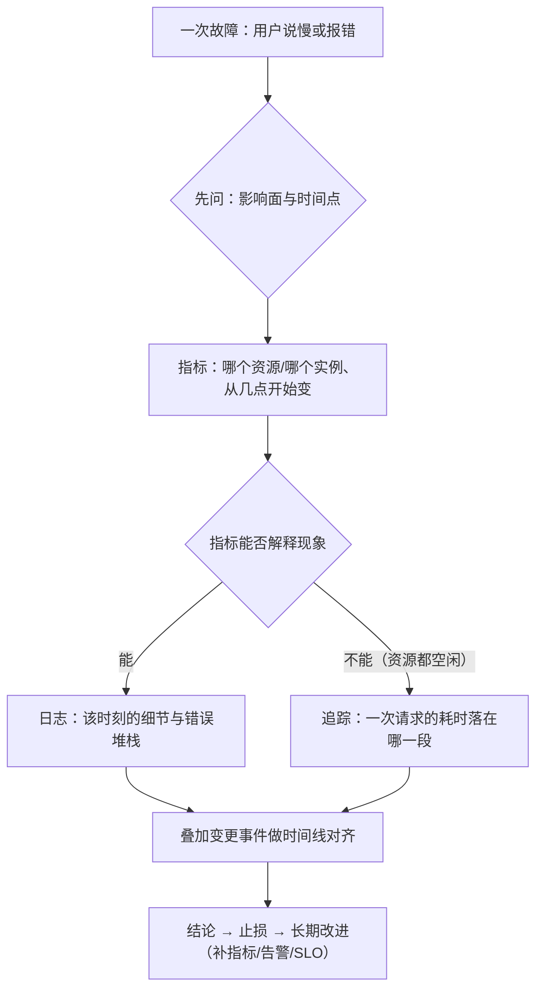

---
tags:
  - Linux
  - 可观测性
  - 证据链
  - 成本模型
  - 原理
created: 2026-10-03
---

# 可观测性的四条链路

## 1. 为什么「多打日志」不是答案

传统运维靠人记得住的东西撑，因为运维人员要记住谁改了什么、哪台机器上次出过问题、这个服务平时占用多少 CPU。一旦系统变得更多、更快，这套记忆就不够用了，因此必须**用事先没准备过的数据回答当初没预料到的问题**。这正是可观测性（observability）与「多装几个监控」最大的区别：可观测性要求数据多到能回答意外问题，而多装几个监控只是把已知的几个数画成曲线。

之所以必须依靠外部数据，是因为故障的形态无法穷举。一个可落地的定义是：**在没预料到故障形态的情况下，仍然能靠已有的数据回答四个问题——发生了什么、从什么时候开始、影响有多大、是不是我改的。**

这四个「回答」对应四类数据，而它们之所以是四类而不是一类，根源在于**每类数据的数据结构不同，因此它能回答的问题范围也不同**：

| 链路 | 回答的问题 | 数据结构决定了它能做什么 | 不能做什么 |
| --- | --- | --- | --- |
| 日志 | 它回答发生了什么，并给出个案、上下文与堆栈 | 日志的每一行都是一条事件，因此它的字段松散、基数高、体积大 | 日志没有聚合能力，因此看不出「从 30% 涨到 90%」这种趋势 |
| 指标 | 它回答问题有多严重、从什么时候开始，并给出聚合值与趋势 | 指标的每一条都是数值加上有限的 label（键值对形式的标签维度），因此它的采样点固定、可以长期保留 | 指标看不到单次请求，因为聚合把个体抹平了 |
| 追踪 | 它回答一次请求究竟慢在哪一段 | 它由一棵有父子关系的 span（片段：一次 RPC、一次数据库查询）树组成，因此按请求组织，而且通常只采一部分 | 它只覆盖被采样的请求，而且若没有后端，链路的整体结构就无从观测 |
| 变更事件 | 它回答这次故障是不是我改出来的，并给出时间点、对象与变更人 | 它只记录时间点、对象与变更人，因此几乎不含运行数据 | 它本身不解释现象，只提供「谁在什么时候动了什么」这条线索 |

**关键推论：这四条链路是「四选多」，而不是「四选一」。** 真实系统里四类数据通常同时存在，只是各自的覆盖度不同。新人最容易犯的错是**只用自己熟的那一条**：习惯 `tail` 日志的人，遇到「CPU 从 30% 涨到 90%」这类趋势问题时会翻半天日志；习惯看面板的人，遇到「某个请求失败了一次」时会在聚合曲线里找不到那一行错误。

## 2. 四类数据的成本模型完全不同

选哪条链路，本质是在**成本和信息量之间做取舍**。由于四类数据的成本花在完全不同的地方，因此「加一条日志」和「加一个指标」的代价不可比：

| 链路 | 成本主要来自 | 成本随什么增长 | 典型的「最贵那一项」 |
| --- | --- | --- | --- |
| 日志 | 日志的成本主要来自存储、索引与解析所消耗的 CPU | 它的成本按「条数 × 保留天数 × 是否全量索引」增长 | 最贵的一项是保留 180 天的全量访问日志 |
| 指标 | 指标的成本主要来自时序数量（cardinality，基数）与采集频率的乘积 | 它的成本按「指标数 × label 取值组合数 × 采样频率」增长 | 最贵的一项是把 `user_id` 当成 label |
| 追踪 | 追踪的成本主要来自采样率，以及后端存储与查询的开销 | 它的成本按「请求数 × 采样率 × 每 trace（一次完整调用）的 span 数」增长 | 最贵的一项是按 100% 采样率采集并长期保留 |
| 变更事件 | 变更事件的成本主要来自流程纪律，它几乎不花存储 | 它的成本随变更频次增长，而这项成本是人力成本 | 最贵的一项是没人记录，因为一旦没人记录，事后就无从对齐 |

三条纪律由此推出：

1. **先确定要回答什么问题，再决定保留多久、留多少细节。** 若反过来做，也就是先把数据全量存下来，则代价会不断累积，而且历史数据很难事后清理。
2. **方案里必须写下三个数字并指定负责人**：日志保留天数、指标基数上限与追踪采样率。若这三个数字没有上限与负责人，成本就会持续增长。
3. **高基数信息应当进日志或追踪，不应当进指标 label（标签维度）。** 原因在下一节说明。

### 2.1 为什么指标的维度不能多

时间序列（time series）的唯一标识是「指标名 + label 组合」。这个结构使得指标的查询极快、存储极省，但反过来也决定了它的成本随维度的乘积增长：

```text
时序数量 ≈ 指标数 × (label1 取值数 × label2 取值数 × …)
```

下面是一轮常见的错误设计：

| 设计 | 同一指标下的时序数量 |
| --- | --- |
| 第一版设计是 `http_requests_total{service, instance}` | 它产生 10 个服务 × 5 个实例 = 50 条时序 |
| 第二版设计再加上 `path`（100 个接口） | 它产生 50 × 100 = 5000 条时序 |
| 第三版设计再加上 `user_id`（10 万个用户） | 它产生 5000 × 100000 = 5 亿条时序 |

最后一步就是灾难，因为写入、存储与查询会同时崩塌；而且历史数据已经写进去了，因此事后再想清理也很难。

反过来看日志：因为日志天然是高基数的（每行都可能不同），所以它能承载 `request_id`、完整 URL 与堆栈；代价是它没有聚合能力。**哪种数据该带哪些字段并不是风格问题，而是由上面这个结构差异决定的。**

## 3. 取用顺序：从低成本到高成本

四条链路各自都能回答问题，但排障时的取用顺序并不是随意的。这个顺序由两件事决定：**每一步的成本，以及每一步能缩小多少范围。**



下面三句话可以概括这张图：

1. **指标用来划定范围**：它回答哪台机器、哪个实例、从几点开始变差以及幅度有多大。这一步几乎不花成本，而且它能把「全站都慢」和「只有一台慢」区分开，因为这两类问题的排查方向完全不同。
2. **日志和追踪用来补细节**：若指标解释得了现象（例如 CPU 打满、内存耗尽或 IO 打满），就去日志里找「是谁干的、报了什么」；反之，若指标解释不了现象（例如资源都空闲但延迟飙升），就去追踪里看「这段时间花在了哪一段」。
3. **变更事件用来确定诱因**：把「指标拐点」和「变更时间点」画在同一张图上，多数故障靠这一步就能缩小到某次发布、某个配置项或者某次运维动作。

这个顺序有一处反直觉的地方：**新人最想先做的事（翻日志）往往排在第三位。** 原因是日志的体积和基数都最大，因此在不知道时间窗、不知道实例、也不知道错误码的情况下翻日志，等于在最大的数据集上做最宽的搜索。若先花一分钟看指标把范围收窄，翻日志的效率会因此高出一个数量级。

## 4. 最小维度集

数据采回来之后才发现「没法按实例对比」，这是运维里最常见的一种返工。之所以会返工，是因为采集之前没有定下维度集。下面四项是硬要求：

| 维度 | 作用 | 缺失时的后果 |
| --- | --- | --- |
| 环境（env / stage） | 它用来区分生产、预发与测试这三个环境 | 若缺少环境维度，则测试环境的抖动会污染生产告警 |
| 服务（service / app） | 它用来区分每份数据属于哪个服务 | 若缺少服务维度，则只能按机器看数据，无法按服务聚合 |
| 实例（instance / host / pod） | 它用来区分数据来自哪一台机器或哪一个副本 | 若缺少实例维度，则无法横向对比，因此找不到「只有一台不对」的问题 |
| 版本（version / release） | 它用来区分新旧版本 | 若缺少版本维度，则灰度期间无法判断问题是否由新版本带来 |

这里有一处不对称，值得单独记住：

- **指标缺了维度就补不回来。** 因为指标是按时序存储的，所以 `instance` 没采就是没采，只能重新采集并丢弃历史。因此指标的维度集必须在采集之前定死。
- **日志缺了字段还可以补。** 因为日志是文本，所以加字段只影响之后的日志，历史日志还能靠正则从正文里抠出来（虽然这种做法很脆）。**但跨服务串联这件事补不了**：若一开始没带请求 ID，则故障当时那些日志永远无法归到同一次请求上。

**维度并不是越多越好**：指标的每一个维度都会乘进基数，而日志的每一个字段都是成本。判断标准是「我是否需要按它聚合或过滤」，而「以后可能用得上」不能作为理由。

## 5. 宿主机与容器：两套视角都要保留

容器化之后四条链路依然成立，只是采集点发生了变化：

| 链路 | 宿主机视角 | 容器视角 |
| --- | --- | --- |
| 日志 | 它落在宿主机的 journald 与 `/var/log/*` 里 | 它由容器运行时收集，因此随容器重建而消失，再由采集端送到中心 |
| 指标 | 它由 `node_exporter` 暴露为 `node_*` 指标 | 它由 cAdvisor 或 kubelet 采集，也可以由业务自身暴露 `/metrics` |
| 追踪 | 它靠进程内埋点产生 | 它靠请求头透传，因此可以在跨服务调用中传播 |
| 变更事件 | 它记录主机侧的变更，例如配置、内核与软件包 | 它记录发布系统与编排对象的变更 |

**两套视角都要保留**：容器指标看的是「这个容器用了多少」，而宿主机指标看的是「这台机器还剩多少」。若只留容器视角，则会漏掉「节点本身快满了」与「同节点上别的容器在抢资源」这类问题；反之，若只留宿主机视角，则无法把资源消耗归到具体服务上。

## 6. 常见误解

| 常见说法 | 事实 |
| --- | --- |
| 「装了监控就算有可观测性了」 | 监控组件只是手段；若没有「谁能看懂、谁能据此行动」的闭环，则等于没有装可观测性 |
| 「日志最全，先翻日志」 | 日志没有聚合能力，因此「CPU 从 30% 涨到 90%」这类趋势在日志里看不出来 |
| 「看板上有曲线就够了」 | 曲线看不到单次请求，因此「资源都空闲但用户喊慢」这类问题必须靠分位数与追踪来回答 |
| 「指标不带上限，先采全量」 | 指标基数的增长是乘法的，而且历史数据难以事后清理 |
| 「变更记录属于流程，和监控无关」 | 若没有变更时间线，则多数故障只能定位到「大概某个时间」，定不到「哪一次改动」 |
| 「日志里什么都有，解析一下就有指标了」 | 解析规则与日志文本格式强耦合，因此应用改一行格式就会让指标中断，而且这种中断往往是静默归零 |
| 「维度越多越好，以后可能用得上」 | 指标的每个维度都会乘进基数，因此高基数信息应当进日志或追踪 |
| 「有了容器指标就不用宿主机指标」 | 容器视角看不到「节点还剩多少」与「邻居在抢什么」 |

## 要点自测

**问：为什么不能只靠日志做可观测性？**
答：日志的数据结构是「一条一条事件」，因此它没有聚合能力。趋势类问题（从几点开始变差、影响多少实例、比例是多少）需要预先按维度聚合好的数据，而那正是指标的结构。反过来，指标也看不到单次请求的细节。所以四类数据回答四类问题。

**问：为什么取用顺序是先看指标、再查日志或追踪、最后对齐变更事件？**
答：这个顺序由成本与收窄范围的能力共同决定。指标的体积最小、按维度聚合、几乎不花成本，因此先用它把「哪个实例、从几点开始、幅度多大」定下来；日志的基数最大，若没有时间窗与实例范围就去翻日志，则等于做最宽的搜索；变更时间线提供的是因果关系，所以通常放在最后一步做对齐。当资源空闲但延迟很高时，日志解释不了现象，此时应当改走追踪。

**问：为什么指标 label 不能放 `user_id`？**
答：时序的唯一标识是「指标名 + label 组合」，因此时序数量按各维度取值数**相乘**增长。加上 `path`（100 个取值）会放大 100 倍，若再加上 `user_id`（10 万个取值），则会再放大 10 万倍。而且历史数据一旦写进去就很难清理。所以这类信息应当进日志或追踪，按需查询。

**问：最小维度集是哪四项，为什么必须在采集前定？**
答：四项是环境、服务、实例与版本。因为指标是按时序存储的，所以缺了维度就只能重新采集；而对日志来说，若一开始没带请求 ID，则故障当时的日志永远无法归到同一次请求上。

**问：容器化之后为什么还要保留宿主机视角？**
答：因为两套视角回答的是不同问题——容器指标回答「这个容器用了多少」，宿主机指标回答「这台机器还剩多少」。若只留容器视角，则会漏掉节点级别的饱和与资源争抢。

**第一反应不要做什么**：不要因为「我只会看日志」就把所有故障都往日志里查；不要在不知道时间窗和实例范围时先翻日志；不要为了「以后可能用得上」把高基数字段塞进指标 label；不要在没有变更记录的情况下断言「就是这么回事」。

## 参考文档

- Prometheus 官方文档的「Data model」「Metric types」「Alerting practices」：时序与 label 的语义、类型约定、基数对查询与存储的影响。
- OpenTelemetry 的「Signals」「Context propagation」「Sampling」：三类信号的分工与上下文传播的语义。
- Google SRE Book 的「Monitoring Distributed Systems」「Embracing Risk」：监控的四个黄金信号、SLI/SLO 与告警分层的思想来源。
- 内核文档 `Documentation/accounting/psi.rst`：压力指标（PSI）的 `some`/`full` 与累计字段（按与目标机器同一主版本取）。
