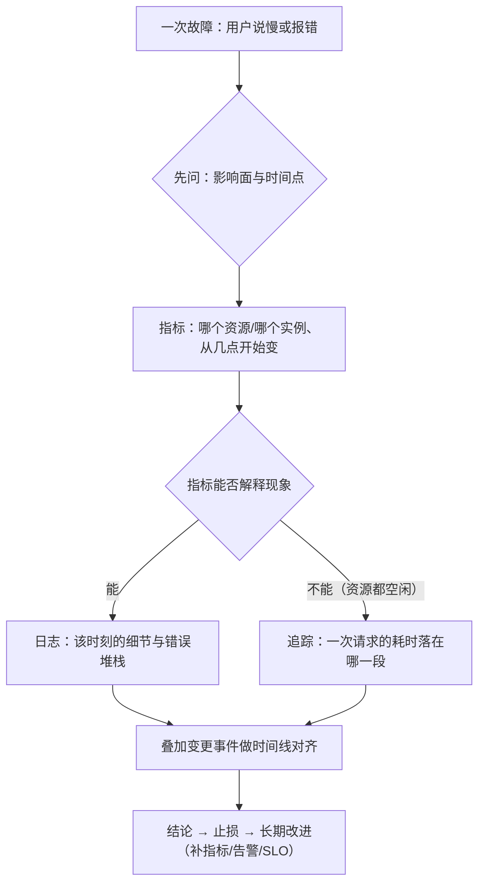

---
tags:
  - Linux
  - 可观测性
  - 证据链
  - 成本模型
  - 原理
created: 2026-10-03
---

# 可观测性的四条链路

## 1. 为什么「多打日志」不是答案

传统运维靠人记得住的东西撑：谁改了什么、哪台机器上次出过问题、这个服务平时 CPU 多少。系统一变多、一变快，这套记忆就不够用了，于是需要**用事先没准备过的数据回答当初没预料到的问题**——这是可观测性（observability）与「多装几个监控」最大的区别：前者是「数据多到能回答意外问题」，后者只是「把已知的几个数画成曲线」。

之所以必须靠外部数据，是因为故障的形态无法穷举。一个可落地的定义是：**在没预料到故障形态的情况下，仍然能靠已有的数据回答「发生了什么、从什么时候开始、影响多大、是不是我改的」。**

这四个「回答」对应四类数据，而它们之所以是四类而非一类，根源在于**每类数据的数据结构不同，决定了它能回答的问题范围**：

| 链路 | 回答的问题 | 数据结构决定了它能做什么 | 不能做什么 |
| --- | --- | --- | --- |
| 日志 | 发生了什么（个案、上下文、堆栈） | 每行是一条事件，字段松散、基数高、体积大 | 没有聚合能力：看不出「从 30% 涨到 90%」这种趋势 |
| 指标 | 多严重、从什么时候开始（聚合、趋势） | 数值 + 有限的 label（键值对形式的标签维度），采样点固定、可长期保留 | 看不到单次：聚合把个体抹平了 |
| 追踪 | 一次请求慢在哪一段 | 有父子关系的 span（片段：一次 RPC、一次数据库查询）树，按请求组织、通常只采一部分 | 只覆盖被采样的请求；没有后端时链路结构无从观测 |
| 变更事件 | 是不是我改的（时间点 + 对象 + 变更人） | 时间点 + 对象 + 人，几乎不含运行数据 | 它本身不解释现象，只提供「谁在什么时候动了什么」 |

**关键推论：这四条是「四选多」，不是「四选一」。** 真实系统里四类数据通常同时存在，只是覆盖度不同。新人最容易犯的错是**只用自己熟的那一条**：习惯 `tail` 日志的人，遇到「CPU 从 30% 涨到 90%」这类趋势问题会翻半天日志；习惯看面板的人，遇到「某个请求失败了一次」会在聚合曲线里找不到那一行错误。

## 2. 四类数据的成本模型完全不同

选哪条链，本质是在**成本和信息量之间做取舍**。而四类数据的成本花在完全不同的地方——这意味着「加一条日志」和「加一个指标」的代价不可比：

| 链路 | 成本主要来自 | 成本随什么增长 | 典型的「最贵那一项」 |
| --- | --- | --- | --- |
| 日志 | 存储、索引、解析 CPU | 条数 × 保留天数 × 是否全量索引 | 保留 180 天的全量访问日志 |
| 指标 | 时序数量（cardinality，基数）× 采集频率 | 指标数 × label 取值组合数 × 采样频率 | 把 `user_id` 当成 label |
| 追踪 | 采样率 × 后端存储与查询 | 请求数 × 采样率 × 每 trace（一次完整调用）的 span 数 | 100% 采样 + 长期保留 |
| 变更事件 | 流程纪律（几乎不花存储） | 变更频次（人力成本） | 没人记录，导致事后无从对齐 |

三条纪律由此推出：

1. **先确定要回答什么问题，再决定保留多久、留多少细节。** 反过来做（先全量存下来）的代价是累积的，而且历史数据很难事后清理。
2. **三个数字必须写进方案并指定负责人**：日志保留天数、指标基数上限、追踪采样率。没有这三个数字，成本会自己长。
3. **高基数信息进日志或追踪，不进指标 label（标签维度）。** 原因在下一节。

### 2.1 为什么指标的维度不能多

时间序列（time series）的唯一标识是「指标名 + label 组合」。这个结构决定了指标的查询极快、存储极省，但反过来也决定了它的成本随维度乘积增长：

```text
时序数量 ≈ 指标数 × (label1 取值数 × label2 取值数 × …)
```

一轮常见的错误设计：

| 设计 | 同一指标下的时序数量 |
| --- | --- |
| `http_requests_total{service, instance}` | 10 个服务 × 5 个实例 = 50 条 |
| 再加 `path`（100 个接口） | 50 × 100 = 5000 条 |
| 再加 `user_id`（10 万个用户） | 5000 × 100000 = 5 亿条 |

最后一步就是灾难：写入、存储、查询全部崩塌，而且**很难事后清理**——历史数据已经写进去了。

反过来看日志：日志天然是高基数的（每行都可能不同），所以它能承载 `request_id`、完整 URL、堆栈；代价是它没有聚合能力。**「哪种数据该带哪些字段」不是风格问题，而是由这个结构差异决定的。**

## 3. 取用顺序：从低成本到高成本

四条链各自都能回答问题，但排障时的顺序不是随意的。这个顺序由两件事决定：**每一步的成本，以及每一步能缩小多少范围。**



三句话可以概括这张图：

1. **指标定范围**：哪台机器、哪个实例、从几点开始、幅度多大。这一步几乎零成本，而且它能把「全站都慢」和「只有一台慢」区分开——这两类问题的排查方向完全不同。
2. **日志和追踪定细节**：指标解释得了现象（CPU 打满、内存耗尽、IO 打满），就去日志里找「是谁干的、报了什么」；指标解释不了（资源都空闲但延迟飙升），就去追踪里看「这段时间花在了哪一段」。
3. **变更事件定诱因**：把「指标拐点」和「变更时间点」画在同一张图上。多数故障靠这一步就能缩小到某次发布、某个配置项、某次运维动作。

这个顺序有一个反直觉的地方：**新人最想先做的事（翻日志）往往排在第三位。** 原因是日志的体积和基数都最大，在不知道时间窗、不知道实例、不知道错误码的情况下翻日志，等于在最大的数据集上做最宽的搜索。先花一分钟看指标把范围收窄，翻日志的效率会差一个数量级。

## 4. 最小维度集

数据采回来才发现「没法按实例对比」，是运维里最常见的返工。原因是采集前没定维度集。四项是硬要求：

| 维度 | 作用 | 缺失时的后果 |
| --- | --- | --- |
| 环境（env / stage） | 区分生产、预发、测试 | 测试环境的抖动污染生产告警 |
| 服务（service / app） | 区分是谁的数据 | 只能按机器看，无法按服务聚合 |
| 实例（instance / host / pod） | 区分是哪一台、哪一个副本 | 无法横向对比，找不到「只有一台不对」的问题 |
| 版本（version / release） | 区分新旧版本 | 灰度期间无法判断问题是否由新版本带来 |

这里有一个不对称，值得单独记住：

- **指标缺维度补不回来。** 指标是按时序存储的，`instance` 没采就是没采，只能重新采集并丢弃历史。所以指标的维度集必须在采集前定死。
- **日志缺字段可以补。** 日志是文本，加字段只影响之后的日志，历史日志还能靠正则从正文里抠（虽然脆）。**但跨服务串联这件事补不了**：如果一开始没带请求 ID，那么故障当时那些日志永远无法归到同一次请求上。

**维度不是越多越好**：指标的每个维度都乘进基数；日志的每个字段都是成本。判断标准是「我是否要按它聚合或过滤」——「以后可能用得上」不是理由。

## 5. 宿主机与容器：两套视角都要保留

容器化之后四条链依然成立，只是采集点变了：

| 链路 | 宿主机视角 | 容器视角 |
| --- | --- | --- |
| 日志 | journald / `/var/log/*` | 容器运行时收集（容器重建后随之消失），由采集端送到中心 |
| 指标 | `node_exporter`（`node_*`） | cAdvisor / kubelet 与业务自身的 `/metrics` |
| 追踪 | 进程内埋点 | 请求头透传，跨服务传播 |
| 变更事件 | 主机侧变更（配置、内核、包） | 发布系统与编排对象的变更 |

**两套视角都要保留**：容器指标看的是「这个容器用了多少」，宿主机指标看的是「这台机器还剩多少」。只留容器视角会漏掉「节点本身快满了」「同节点上别的容器在抢资源」这类问题；只留宿主机视角则无法把资源消耗归到具体服务。

## 6. 常见误解

| 常见说法 | 事实 |
| --- | --- |
| 「装了监控就算有可观测性了」 | 组件只是手段。没有「谁能看懂、谁能据此行动」的闭环，等于没装 |
| 「日志最全，先翻日志」 | 日志没有聚合能力，「CPU 从 30% 涨到 90%」这类趋势在日志里看不出来 |
| 「看板上有曲线就够了」 | 曲线看不到单次请求；「资源都空闲但用户喊慢」必须靠分位数与追踪 |
| 「指标不带上限，先采全量」 | 基数的增长是乘法的，且历史数据难以事后清理 |
| 「变更记录属于流程，和监控无关」 | 没有变更时间线，多数故障只能定位到「大概某个时间」，定不到「哪一次改动」 |
| 「日志里什么都有，解析一下就有指标了」 | 解析规则与日志文本格式强耦合，应用改一行格式指标就断，且往往是静默归零 |
| 「维度越多越好，以后可能用得上」 | 指标的每个维度都乘进基数；高基数信息应进日志或追踪 |
| 「有了容器指标就不用宿主机指标」 | 容器视角看不到「节点还剩多少」与「邻居在抢什么」 |

## 要点自测

**问：为什么不能只靠日志做可观测性？**
答：日志的数据结构是「一条一条事件」，它没有聚合能力。趋势类问题（从几点开始变差、影响多少实例、比例是多少）需要预先按维度聚合好的数据，那是指标的结构。反过来指标也看不到单次请求的细节。四类数据回答四类问题。

**问：取用顺序为什么是「指标 → 日志/追踪 → 变更」？**
答：由成本和收窄范围的能力决定。指标体积最小、按维度聚合、几乎零成本，先把「哪个实例、从几点开始、幅度多大」定下来；日志基数最大，没有时间窗和实例范围就翻日志等于最宽搜索；变更时间线提供因果，通常放在最后一步做对齐。资源空闲但延迟高时，日志解释不了，改走追踪。

**问：为什么指标 label 不能放 `user_id`？**
答：时序的唯一标识是「指标名 + label 组合」，所以时序数量按维度取值数**相乘**。加 `path`（100 个取值）放大 100 倍，再加 `user_id`（10 万个取值）再放大 10 万倍。而且历史数据写进去之后很难清理。这类信息应该进日志或追踪，按需查询。

**问：最小维度集是哪四项，为什么必须在采集前定？**
答：环境、服务、实例、版本。指标是按时序存储的，缺了维度只能重新采集；日志里如果一开始没带请求 ID，故障当时的日志就永远无法归到同一次请求上。

**问：容器化之后为什么还要保留宿主机视角？**
答：两套视角回答不同问题——容器指标是「这个容器用了多少」，宿主机指标是「这台机器还剩多少」。只留容器视角会漏掉节点级别的饱和与资源争抢。

**第一反应不要做什么**：不要因为「我只会看日志」就把所有故障都往日志里查；不要在不知道时间窗和实例范围时先翻日志；不要为了「以后可能用得上」把高基数字段塞进指标 label；不要在没有变更记录的情况下断言「就是这么回事」。

## 参考文档

- Prometheus 官方文档的「Data model」「Metric types」「Alerting practices」：时序与 label 的语义、类型约定、基数对查询与存储的影响。
- OpenTelemetry 的「Signals」「Context propagation」「Sampling」：三类信号的分工与上下文传播的语义。
- Google SRE Book 的「Monitoring Distributed Systems」「Embracing Risk」：监控的四个黄金信号、SLI/SLO 与告警分层的思想来源。
- 内核文档 `Documentation/accounting/psi.rst`：压力指标（PSI）的 `some`/`full` 与累计字段（按与目标机器同一主版本取）。

上一篇：00 导读 ｜ 下一篇：证据的时间与格式基线
