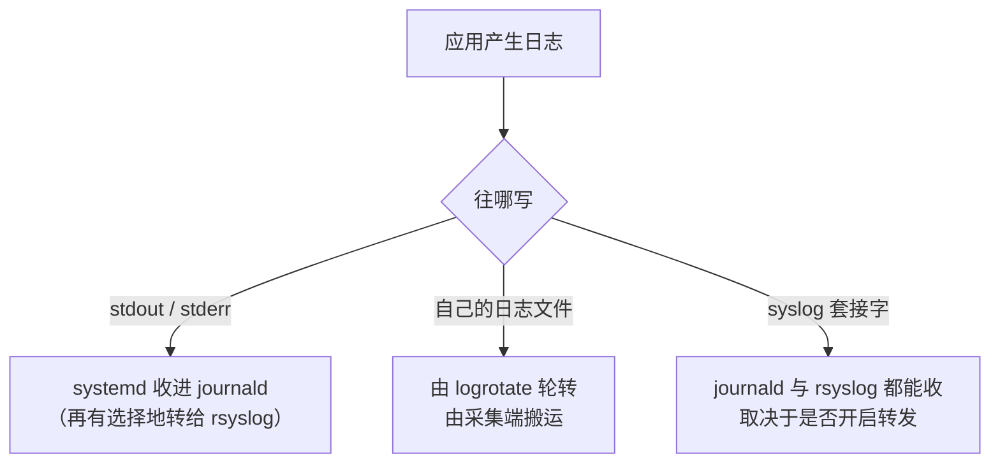

---
tags:
  - Linux
  - 可观测性
  - 日志
  - 日志规范
  - 原理
created: 2026-10-03
---

# 日志的诞生

## 1. 落点在「写出来」那一刻就决定了

一条日志在应用决定「往哪写」的那一瞬间，它后面所有的可能性就基本定下了：它能被谁收集、能带上哪些字段、能保留多久、能不能按字段查询，以及写满时由谁负责。这不是实现细节，因为三种落点各有各的收集链，而收集链决定了字段。



**关键区别不在「方便不方便」，而在「字段由谁产生」**：写 stdout 的日志，它的字段（单元、优先级、开机标识、单调时间戳）由收集端**自动加上**；写自有文件的日志，它的字段只能靠**事后解析文本**得到；写 syslog 套接字的日志，它的字段取决于协议本身能带什么。

这解释了一个常见困惑：同一个标识符过滤出的消息可能来自不同通道。journald 用 `_TRANSPORT` 字段记录消息是从哪条路进来的（`stdout`/`syslog`/`kernel`/`audit`），所以「这条日志为什么没有某个字段」往往在它被写出来的那一刻就注定了。

| 落点 | 谁负责收集 | 优点 | 代价 |
| --- | --- | --- | --- |
| stdout / stderr | systemd 把日志收进 journald，再由它选择性地转给 rsyslog | 应用不用自己管文件，收集端会自动带上字段，因此它最推荐用于容器化场景 | 它依赖收集端的持久化配置，同时容量由收集端统一管理 |
| 自有日志文件 | 应用自己负责写入，轮转工具负责轮转，采集端负责搬运 | 它的格式自由、直观，并且可以直接查看 | 字段化要靠解析，轮转要自己维护，而且写满的风险由自己承担 |
| syslog 套接字 | journald 与 rsyslog 都能收 | 它是系统级通道，因此两边都能收 | 使用它要理解 facility/severity 与转发配置，而且它的结构化能力弱 |

### 1.1 容器里为什么只能写 stdout

容器的最佳实践是**应用只写 stdout/stderr，其他什么都不管**：容器运行时负责收集，宿主机上的采集端负责搬运，因此日志的生命周期不依赖容器内的磁盘。

它的理由不是「方便」，而是**生命周期**：容器内的文件系统随容器销毁一起消失。因此若在容器里写自有文件，就等于把日志的存活期绑定到容器的存活期，重启即丢，而且丢失是无声的。写 stdout 把日志的所有权交给运行时，这是唯一能让日志活得比容器久的写法。

## 2. facility 与 severity：syslog 的两个正交维度

syslog 协议用两个正交的概念描述一条日志，因此理解它们是理解 `PRI`、过滤规则与转发规则的前提：

- **facility（设施）表示「谁产生的」**：内核、用户态、邮件、认证、定时任务等各占一个编号；
- **severity（严重程度）表示「多严重」**：从 `emerg`（0）到 `debug`（7），数字越小越严重。

两者被编码进报文的 `<PRI>` 字段：**PRI = facility × 8 + severity**。`<13>` 就是 `1×8 + 5`，即 facility=user、severity=notice。

这个编码方式有两个实务含义：

1. **数值小的 severity 更严重**，这与「数字越大越严重」的直觉相反，因此写阈值过滤时「`-p err` 及以上」指的是 0–3 这一段。
2. **PRI 是唯一一个把「谁产生的」与「多严重」压成一个数的字段**，因此它既能做来源过滤也能做级别过滤，而远程接收端按 PRI 分流是最省事的做法。

RFC 5424 在旧格式（RFC 3164）的基础上补上了两样关键东西：**带时区偏移的时间戳**与**结构化数据**（例如 `timeQuality`）。由于旧格式连年份都没有，跨年、跨时区的数据基本无法自动对账，这也是对账能力强的新格式值得多占几个字节的原因。

## 3. 可检索性：字段而不是句子

排障时最痛的不是「日志太少」，而是**「日志里有信息但没有字段」**。

对比两条日志：

```text
User 12345 failed to login at 10:31
{"ts":"2026-09-19T10:31:02Z","level":"warn","service":"auth","instance":"web-03","event":"login_failed","user_id":12345,"reason":"bad_password"}
```

第一条人读得懂，但若要统计「今天登录失败了多少次」，就只能写正则去猜，而正则与句子结构强耦合，所以句子一改它就会断。第二条的每个字段都可以直接过滤、聚合、告警。

一条可排障的日志最低要带这几项，每一项都对应一种排障动作：

| 字段 | 对应的排障动作 | 缺失的后果 |
| --- | --- | --- |
| 时间（统一 UTC 或带时区） | 它用于与其他证据对齐 | 若缺失它，跨机、跨系统的时间线就拼不起来 |
| 级别 | 它用于只看错误与按级别告警 | 若缺失它，就无法过滤，而生产上开 debug 又会淹没一切 |
| 服务 / 应用名 | 它用于按服务切分 | 若缺失它，日志集中之后就无法区分来源 |
| 实例（host / pod / 副本） | 它用于横向对比 | 若缺失它，就找不到「只有一台不对」的问题 |
| 请求 ID（最好带追踪 ID） | 它用于把一次请求的日志串起来 | 若缺失它，多副本并发时无法归到同一次请求 |
| 错误码 / 事件名 | 它让日志可检索、可统计 | 若缺失它，就只能按文本搜关键词，而口径随措辞变化 |

**JSON 行是最省事的折中**：它一行一条记录、字段名固定，因此人读得懂，采集端也能直接解析。这里要澄清一个常见误解：**收集端不会自动把正文里的 JSON 拆成可查询字段**，因为正文仍然是正文，字段化要靠收集端或平台的解析能力配合。所以「用 JSON 行」只是把解析从「猜结构」降级成「读键值」，并没有免掉解析。

### 3.1 级别决定了写入量，而不只是显示样式

日志级别最容易被当成「格式要求」，其实它直接决定日志的写入量，因此它是**日志成本最主要的决定因素**：

- **应用层是三层保留策略里唯一管「产生速率」的那一层。** 因为后两层（收集端容量与文件轮转）能做的只是把已经产生的量裁掉，所以它们裁减的速度赶不上产生的速度。
- **生产开 debug 的代价不是「日志多一点」，而是关键错误被淹没**，同时磁盘与网络两处的成本都会被放大。
- **正确的做法是保留「临时打开 debug」的能力**（动态调级别、按请求开启），因此既不应常开，也不应永远关掉。

对外输出的高频无关信息（例如每个成功请求一行）应当降级或直接去掉，因为这类日志的量通常比错误日志大几个数量级。

## 4. 日志与指标的分工：不要用日志解析做指标

「日志里什么都有，那我解析一下不就有指标了？」这是最自然、代价也最高的一个想法。

| 想法 | 现实 |
| --- | --- |
| 「一次解析，什么指标都能算」 | 解析规则与日志文本格式强耦合，因此应用改一行格式，指标就断了 |
| 「反正日志已经存了，解析不要钱」 | 解析要消耗 CPU 与内存，还要为「可能用到的字段」付出存储与索引成本 |
| 「口径随时能改」 | 恰恰不能改：一旦用它做告警与 SLO，历史口径变更就会让数据不可比 |

三条代价里，**第一条最危险，因为它静默失败**：解析规则失效时指标不会报错，只会归零或变小——往往等到告警阈值再也不触发、或者报表变成 0 才被发现。

正确的分工是：**日志负责「发生了什么」（细节、堆栈、个案），指标负责「多严重、从什么时候开始」（请求数、错误数、延迟分布、队列深度），而业务指标应该在应用里直接埋点暴露。** 两者的判断标准很简单：**这个数字将来会不会被用来做告警或 SLO？** 若会，它就不该靠解析日志文本来得到。

## 5. 常见误解

| 常见说法 | 事实 |
| --- | --- |
| 「日志里什么都有，不需要指标」 | 日志没有聚合能力，因此趋势类问题在日志里看不出来 |
| 「生产环境开 debug 方便排障」 | 体积与成本会飙升，关键错误会被淹没，因此调试信息应能按开关临时打开 |
| 「日志只写一句话就好」 | 没有级别、实例与请求 ID 的日志无法过滤、无法聚合，也无法告警 |
| 「容器里写自己的日志文件」 | 容器销毁时日志会一起消失，因此应写 stdout 由运行时收集 |
| 「用日志解析算错误率」 | 它的口径与文本格式强耦合，因此格式一改它就会断，而且这种断裂是静默的 |
| 「日志格式以后再统一」 | 格式变更会打断历史口径，因此一开始就用固定字段的成本最低 |
| 「收集端会自动把 JSON 正文变成字段」 | 正文仍然是正文，因此字段化要靠收集端或平台的解析能力 |
| 「PRI 里数字越大越严重」 | 事实相反：severity 取 0（`emerg`）时最严重，取 7（`debug`）时最轻 |

## 要点自测

**问：应用日志的三种落点分别由谁收集？怎么选？**
答：stdout/stderr 由 systemd 收进 journald，而且字段会自动带上，因此容器化场景首选它；自有文件由应用自己加上轮转工具与采集端负责；syslog 套接字由 journald 与 rsyslog 两条通道收。选择标准是「这条日志要活多久、要带哪些字段」——能写 stdout 就写 stdout；必须写文件时，同时把轮转与采集配好。

**问：一条可排障的日志最低要带哪些字段？每个字段对应什么动作？**
答：它至少要带时间（用于与其他证据对齐）、级别（用于过滤与告警）、服务（用于按服务切分）、实例（用于横向对比）、请求 ID（用于把一次请求串起来）与错误码或事件名（用于检索与统计）。缺任何一项，都会在对应的排障场景里查不出东西。

**问：为什么不应该用日志解析来做业务指标？**
答：用日志解析做指标有三重代价：解析规则与文本格式强耦合，而且失效时是静默的；解析与索引本身要付出成本；一旦它承载告警与 SLO，口径就不能随便改。业务指标更准确的做法是在应用里埋点暴露，而日志只负责细节。

**问：`<13>` 这个 PRI 表示什么？**
答：PRI = facility × 8 + severity，`13 = 1×8 + 5`，即 facility=user、severity=notice。注意 severity 的数字越小越严重。

**问：为什么容器里写自有日志文件是错的？**
答：日志的存活期会被绑定到容器的存活期，容器销毁日志一起消失，而且丢失是无声的。写 stdout 把日志交给运行时收集，才可能活得比容器久。

**第一反应不要做什么**：不要在容器里写自有日志文件；不要因为「日志里已经有这些信息」就去解析它做指标；不要用「以后统一格式」推迟字段规范；不要把日志级别当成可随意调大的调试开关。

## 参考文档

- RFC 5424：syslog 协议报文结构、facility/severity 的 PRI 编码、结构化数据。
- RFC 3164：旧 BSD syslog 格式（无年份、无时区），用于识别老格式来源。
- `man 3 syslog`、`man 1 logger`：facility 与 severity 的取值、以及构造消息的命令行方式。
- `man 5 systemd.exec`：`StandardOutput=`/`StandardError=` 的取值与目的地语义。
- OpenTelemetry 的「Logs」建议：把追踪上下文写进日志、日志字段的约定。

