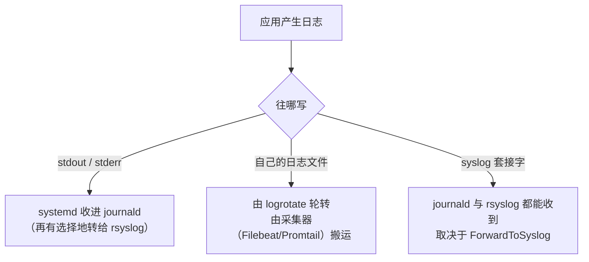

---
tags:
  - Linux
  - 可观测性
  - 日志
  - 日志规范
created: 2026-09-19
---

# 日志的诞生：格式与落点选择

> [!cite] 参考资料
> `man 3 syslog`（facility 与 severity 取值）、`man 1 logger`、`man 5 systemd.exec`（`StandardOutput=`/`StandardError=`）、`man 5 journald.conf`、RFC 5424 §6.2.1（severity 取值）、OpenTelemetry 的「Logs」建议（把 `trace_id` 写进日志）。
>
> 实测输出来自 Ubuntu 24.04.4（WSL2）/ systemd 255；应用日志的落点行为在实验机上用 `logger` 与自定义 unit 验证。

> **这篇讲什么**：一条日志在「被写出来」这一刻就决定了后面所有的可能性——写在哪个通道，决定了它能被谁收集、能保留多久、能不能被字段化查询。这篇讲**格式规范**与**三种落点**的取舍，以及一条最容易踩的线：别用日志解析去做指标。
>
> **必须先读什么**：[[Linux/09_日志与监控/01_前置_可观测性世界观与三条链路|01 前置：可观测性世界观与三条链路]]（最小维度集）、[[Linux/09_日志与监控/02_前置_证据的时间与格式基线|02 前置：证据的时间与格式基线]]（时间戳格式）。
>
> **读完能回答**：① 应用日志有哪三种常见落点，各自由谁负责收集？② 一条可排障的日志最少要带哪些字段？③ 为什么「日志里有信息但没有字段」是最贵的坑？④ 为什么不应该用日志解析来做业务指标？
>
> 所属：[[Linux/09_日志与监控/00_导读与知识地图|09 日志、监控与可观测性]] 的「一条日志的一生」第 1 站 · 主要练 **S2 日志字段与落点规范**

## 0. 30 秒速览

> [!abstract] 这一篇只要记住五句话
> - **日志的落点有三种：stdout/stderr、自有文件、syslog 套接字。**
>   - 怎么验证：`systemctl show <unit> -p StandardOutput -p StandardError`，一眼看出这个服务的日志去了哪。
> - **落点决定了后续一切，写在 stdout 的日志自动带上 journald 字段。**
>   - 证据：实测 `systemd-run --user` 打印的一行 JSON 进 journald 后，`MESSAGE` 里是**原文**，而 `PRIORITY=6`、`_SYSTEMD_USER_UNIT` 是 journald 自己加的。
> - **一条可排障的日志最低要带：时间、级别、服务/实例、请求 ID、可检索的错误码。**
>   - 怎么验证：随手拿一条线上日志对照这五项；缺哪项，就在对应的排障场景里查不出东西。
> - **JSON 行是最省事的折中。**
>   - 证据：实测 `journalctl --user -u lab-speclog -o cat` 输出的就是写进去的那行 `{"level":"info","msg":"hi"}`，人可读、机器也能按字段解析。
> - **日志不该承担「精确聚合」的职责。**
>   - 怎么验证：需要错误率时去找服务的 `/metrics` 而不是 `grep` 日志——用日志解析算指标，格式一改口径就断。

## 1. 三种落点：日志一开始就分岔



| 落点 | 谁负责收集 | 优点 | 代价 |
| --- | --- | --- | --- |
| stdout / stderr | systemd → journald（可选再转 rsyslog） | 不用自己管文件、自动带 unit/优先级字段、容器化最推荐 | 需要 journald 持久化配置；容量由 journald 统一管 |
| 自己的日志文件（如 `/var/log/nginx/access.log`） | 你自己 + `logrotate` + 采集器 | 格式自由、直观、方便直接 `tail` | 字段化要靠解析；轮转配置要自己维护；写满风险自己担 |
| syslog 套接字（`syslog(3)` / `logger`） | journald 与 rsyslog | 系统级通道，两边都能收 | 需要懂 facility/severity 与转发配置；结构化能力弱 |

本机实测（用 `logger` 造一条消息，两个落点同时命中）：

```text
$ logger -t labtest "hello-from-logger"
$ journalctl -t labtest -n 1 -o json | python3 -c "import json,sys; d=json.load(sys.stdin); print({k:d[k] for k in ['SYSLOG_IDENTIFIER','_PID','_UID','_TRANSPORT','MESSAGE']})"
{'SYSLOG_IDENTIFIER': 'labtest', '_PID': '698', '_UID': '1000', '_TRANSPORT': 'syslog', 'MESSAGE': 'hello-from-logger'}
$ tail -1 /var/log/syslog
2026-09-19T12:37:37.034681+08:00 realtyz labtest: hello-from-logger
```

**同一条消息，一边是带字段的 JSON，一边是一行纯文本。** 之所以两边都有，是因为 journald 配了 `ForwardToSyslog=yes`（子笔记 05 解释原因）——所以「日志到哪去了」这个问题，必须先看落点，再看渠道配置。

> [!important] 容器里优先写 stdout
> 容器的最佳实践是**应用只写 stdout/stderr，其他什么都不管**：容器运行时负责收集，宿主机上的采集器负责搬运，日志的生命周期不依赖容器内的磁盘。**自己在容器里写文件，会让日志随容器销毁一起消失。**

## 2. 日志字段：让日志可被检索

排障时最痛的不是「日志太少」，而是**「日志里有信息但没有字段」**：`request failed` 这种只有一句话的日志，既不能聚合、也不能告警、还不能按实例过滤。

| 字段 | 为什么必须有 | 缺了会怎样 |
| --- | --- | --- |
| 时间（带时区或统一 UTC） | 与其他证据对齐 | 跨机、跨系统的时间线拼不起来 |
| 级别（INFO/WARN/ERROR…） | 过滤与告警的基础 | 无法只看错误；生产开 debug 又会淹没一切 |
| 服务 / 应用名 | 定位到谁 | 集中之后无法按服务切分 |
| 实例（host / pod / 副本） | 横向对比 | 找不到「只有一台不对」的问题 |
| 请求 ID（`request_id`，最好带 `trace_id`） | 把一次请求的日志串起来 | 多副本并发时无法把日志归到同一次请求 |
| 错误码 / 错误类型 | 可检索、可统计 | 只能靠文本搜索关键词，口径随时变化 |

三条低成本的做法：

1. **用 JSON 行**：一行一条记录，字段名固定。人读得懂，采集器也能直接解析。
2. **统一时间格式**：全链路统一 UTC（或统一带时区偏移），不要混用本地时间。
3. **级别真的分级**：生产环境不要开 debug；把「请求成功」这类高频无关信息降到 debug 或直接去掉——**日志量本身就是成本**（子笔记 14）。

> [!warning] 应用日志的格式要「机器可读」
> 最低要求是：时间、级别、服务/实例、请求 ID、可检索的错误码。**JSON 行是最省事的折中。** 注意别把日志写成「给人看的散文」——`User 12345 failed to login at 10:31` 看着清楚，但要统计「今天登录失败了多少次」时，你只能靠正则去猜。

## 3. 一条不该越过的线：别用日志解析做指标

很多人会想：「日志里什么都有，那我把日志解析一下，不就有指标了？」

| 想法 | 现实 |
| --- | --- |
| 「一次解析，什么指标都能算」 | 解析规则与日志格式强耦合；应用改一行格式，指标就断了 |
| 「反正日志已经存了，解析不要钱」 | 解析要 CPU 与内存，还要为「可能用到的字段」付出存储与索引成本 |
| 「口径随时能改」 | 恰恰是不能随时改：一旦用它做告警与 SLO，历史口径变更会让数据不可比 |

**正确的分工**：日志负责「发生了什么」（细节、堆栈、个案），指标负责「多严重、从什么时候开始」（请求数、错误数、延迟直方图、队列深度）。**业务指标应该在应用里直接埋点暴露**，而不是从日志里再抠一遍（子笔记 09）。

## 4. 生产动作：给一个服务定日志规范

只有一次动作序列值得专门写下来：**给一个（新）服务定日志规范**。它是有产出的、可评审的，不是纯巡检。

> [!example]- 实验 1：把「日志规范」写成可验收的清单
> 目标：给一个假想服务写出一份日志规范，并用一个最小的临时单元验证「落点确实按你写的方式工作」。
> ```bash
> export XDG_RUNTIME_DIR=/run/user/$(id -u)     # 用户级 systemd 需要它，否则报 Failed to connect to bus
> systemd-run --user --unit=lab-speclog --property=StandardOutput=journal \
>   /bin/echo "{\"level\":\"info\",\"msg\":\"hi\"}"   # 验证：把一行 JSON 写进 journald
> journalctl --user -u lab-speclog -n 1 -o cat        # 验证：消息内容原样落在 journald
> journalctl --user -u lab-speclog -n 1 -o json | python3 -c "import json,sys; d=json.load(sys.stdin); print({k:d[k] for k in ['_SYSTEMD_USER_UNIT','PRIORITY','MESSAGE','_PID'] if k in d})"
> systemctl --user stop lab-speclog; systemctl --user reset-failed lab-speclog   # 清理
> ```
> 本机实测输出：
> ```text
> Running as unit: lab-speclog.service; invocation ID: 02035853905d402394cd423b0b9635e7
> {"level":"info","msg":"hi"}
> {'_SYSTEMD_USER_UNIT': 'lab-speclog.service', 'PRIORITY': '6', 'MESSAGE': '{"level":"info","msg":"hi"}', '_PID': '647'}
> ```
> 要注意两点：`MESSAGE` 里是**你写的那一行 JSON 原文**（journald 不会替你解析成字段），而 `PRIORITY=6`、`_SYSTEMD_USER_UNIT` 是 journald **自己加上的**字段。想让 JSON 里的字段可查询，需要采集端或 journald 的解析能力配合（子笔记 05）。
> **风险**：低（只创建用户级临时单元，不动系统服务）。
> **回滚**：`systemctl --user stop lab-speclog`；`systemctl --user reset-failed lab-speclog`。
> **耗时**：10 分钟。
>
> 环境：Ubuntu 24.04.4（WSL2）/ systemd 255 / 非 root，用户级 systemd 可用（本次实测 `--property=StandardOutput=journal` 生效，`PRIORITY=6` 对应 info）。生产机上只做「读」的部分（`journalctl`、`systemctl show -p StandardOutput`）。

## 常见坑

| 常见做法或说法 | 后果或事实 |
| --- | --- |
| 「日志里什么都有，不需要指标」 | 日志没有聚合能力，「CPU 从 30% 涨到 90%」这类趋势在日志里看不出来 |
| 「生产环境开 debug 方便排障」 | 日志体积与成本飙升，关键错误被淹没；调试信息应能按开关临时打开 |
| 「日志只写一句话就好」 | 没有级别、没有实例、没有请求 ID 的日志无法过滤、无法聚合、无法告警 |
| 「容器里写自己的日志文件」 | 容器销毁日志一起消失；应写 stdout 由运行时收集 |
| 「用日志解析算错误率」 | 口径与格式强耦合，格式一改就断；业务指标应在应用里埋点暴露 |
| 「日志格式以后再统一」 | 格式变更会打断历史口径；一开始就用 JSON 行成本最低 |

## 决策练习

**场景**：你接手一个自研服务，它现在把日志写在 `/var/log/myapp/app.log` 里，格式是 `[2026-09-19 12:00:00] some message`。团队希望「出问题时能按请求 ID 搜索，并且能统计错误率」。

**A. 保持现状，加一个采集器用正则解析出字段，再统计错误率**
**B. 应用改成输出 JSON 行到 stdout，请求 ID 由入口生成并透传，错误率用应用自身的指标端点暴露**
**C. 把所有日志级别调成 error，这样日志量小、错误率高**

**为什么选 B**：题目里两个需求分别是「按请求 ID 检索」（日志该解决的问题）和「统计错误率」（指标该解决的问题）。B 同时给对了两个落点：JSON 行让检索可靠，指标端点让统计口径稳定。改造成本集中在上线一次，后面长期受益。

**为什么不选 A**：正则解析能吃下现有的格式，但它是**脆的**——应用改一行日志格式，解析规则就静默失效（往往是「指标突然归零」才发现）。而且错误率这类要长期比较的指标，不该建立在文本解析上。

**为什么不选 C**：把级别调高只是让日志变少，错误率这个指标仍然没有；更糟的是你**丢掉了排查所需的上下文**，等于用「看不见问题」来降低错误率。

## 要点自测

> [!question]- 应用日志的三种落点分别由谁收集？怎么选？
> - **stdout/stderr**：systemd → journald（容器化/云原生首选），自动带 unit 与优先级字段。
> - **自有文件**：自己 + `logrotate` + 采集器，格式自由但字段化与轮转都要自己管。
> - **syslog 套接字**：journald 与 rsyslog 都能收，取决于 `ForwardToSyslog=` 与 rsyslog 配置。
> - **怎么选**：能写 stdout 就写 stdout；必须写文件时，同时把轮转与采集配好。
> - **第一反应不要是什么**：不要在容器里写自己的日志文件。

> [!question]- 一条可排障的日志最低要带哪些字段？
> - **时间**（带时区或统一 UTC）、**级别**、**服务/实例**、**请求 ID**（有 `trace_id` 更好）、**错误码**。
> - **为什么**：这四个维度决定了你能否按时间窗、按严重程度、按实例、按请求去过滤和聚合。
> - **落点**：JSON 行是最省事的折中；字段名固定后，采集器与查询都能稳定工作。
> - **第一反应不要是什么**：不要写「只有一句话」的日志。

> [!question]- 为什么不应该用日志解析来做业务指标？
> - **耦合**：解析规则与日志文本格式强绑定，应用改格式就断，而且常常是静默断（指标归零）。
> - **成本**：解析要算力，还要为「以后可能用的字段」付出存储与索引成本。
> - **口径**：指标一旦承载告警与 SLO，历史口径就不能随便改；文本解析做不到稳定口径。
> - **正确做法**：业务指标在应用里埋点并通过指标端点暴露，日志只负责细节。
> - **第一反应不要是什么**：不要因为「日志里已经有这些信息」就去解析它。

> 上一篇：[[Linux/09_日志与监控/03_前置_观测工具箱与证据命令|03 前置：观测工具箱与证据命令]] ｜ 下一篇：[[Linux/09_日志与监控/05_日志的落点_journald与rsyslog|05 日志的落点：journald 与 rsyslog]]
