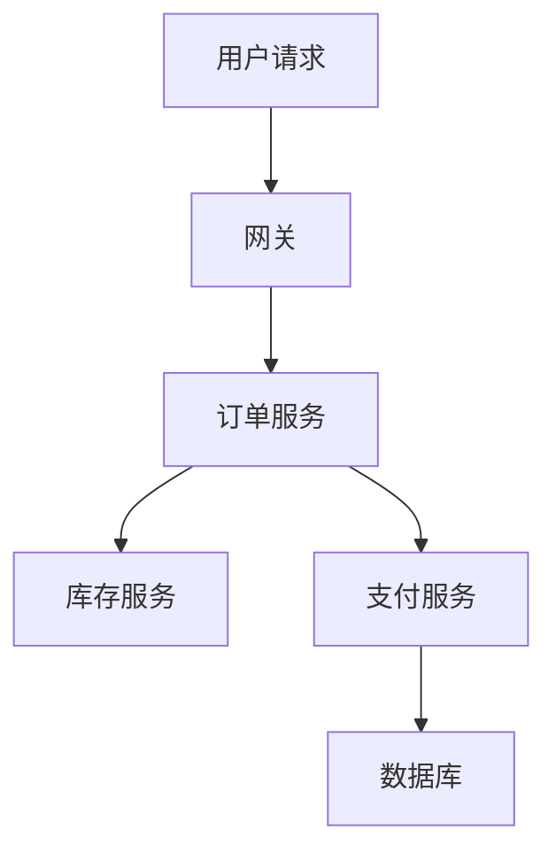

---
tags:
  - Linux
  - 可观测性
  - 追踪
  - 上下文透传
  - 采样
  - 原理
created: 2026-10-03
---

# 追踪的透传与采样

## 1. 日志与指标给不出的那一段：跨服务的时间分布

一次请求跨多个服务时，日志与指标都无法独立给出这次请求在各段上花掉的时间：



用户抱怨「下单很慢」时：

- 指标能说明「订单服务的 p99 变差了」，但它不能指出这段时间落在哪一段调用上；
- 日志能记录「每个服务各自做了什么」，但由于这些记录里没有一个字段把同一次请求标识出来，所以它无法把这些行关联成一次调用；
- 追踪能直接给出这一次请求的耗时分布：网关 20ms、订单 1.2s、库存 30ms、支付 1.1s、数据库 900ms。

这个缺口并不是「日志不够详细」造成的。日志的结构是一条一条事件，而一次请求是横跨多个服务的**树状结构**；因此即使每个服务都打了很详细的日志，只要没有一个字段把它们的行关联起来，这些日志就拼不出这棵树。追踪补的就是这个结构。

## 2. 数据模型：trace 与 span

| 概念 | 含义 | 关键标识 | 关键属性 |
| --- | --- | --- | --- |
| trace（调用链） | 它指一次完整的调用 | 它的标识是 `trace_id`，这个值全局唯一 | 它由一棵 span 树构成 |
| span（片段） | 它指这次调用中的其中一段，例如一次 RPC、一次数据库查询或一次缓存访问 | 它的标识是 `span_id`，同时用 `parent_span_id` 指向父 span | 它记录开始时间、耗时与状态 |

这个模型直接决定了两件事：

1. **父子关系是由 ID 表达的，而不是由时间表达的。** 下游以「收到的父 span ID」为父创建自己的 span，因此父子的归属是精确的，与两台机器的时钟差多少无关（时钟只影响「耗时」这条线，见第 3.2 节）。
2. **同一 trace 内的所有 span 共享同一个 `trace_id`。** 由于这个值对同一次调用是相同的，所以把它写进日志之后，就能用它在日志与追踪之间对齐同一次请求；这也是第 5 节的落地顺序把第一步选成它的原因。

## 3. 上下文透传：链路中每一段都必须携带同一份上下文

追踪的数据来自各个服务，所以每个服务都必须知道「我这次调用属于哪条 trace、我的父是谁」。这件事靠**上下文透传**（context propagation）实现：上下文随请求一起传递，通常放在协议头里。

以 W3C Trace Context 的 `traceparent` 头为例：

```text
00-b62974f7d235e7af7f15e50ba76b4121-30931907edc3dcf8-01
```

| 段 | 长度 | 作用 |
| --- | --- | --- |
| `version` | 这个字段占 2 位十六进制 | 它给出协议版本，当前取值是 `00` |
| `trace_id` | 这个字段占 32 位十六进制（16 字节） | 它给出贯穿整条链路的标识 |
| `parent_id` | 这个字段占 16 位十六进制（8 字节） | 它给出调用方的 span ID，因此下游以它为自己的父 |
| `flags` | 这个字段占 2 位十六进制 | 它的最低位表示「是否被采样」（取 `01` 表示采样，取 `00` 表示不采样）；**其余位是保留位，因此必须为 0** |

这四段共同决定接收方怎样解释这条链路，因此它们缺一不可：

```text
入口 span  trace_id=b62974f7d235e7af7f15e50ba76b4121 span_id=30931907edc3dcf8
下游 span  trace_id=b62974f7d235e7af7f15e50ba76b4121 span_id=cab3552d09c64724 parent_span_id=30931907edc3dcf8
```

下游的 `parent_span_id` 正好等于入口的 `span_id`，同时两者的 `trace_id` 相同，因此这棵 span 树由各服务按收到的父 span ID 自行接起来，不需要任何中心协调。

### 3.1 规范对头的校验：七类输入必须被拒绝

一个严格按规范实现的解析器会拒绝下面每一类输入：

| 输入的问题 | 为什么必须拒绝 |
| --- | --- |
| 输入中的 `trace_id` 是全零 | 因为规范禁止用全零表示「不存在」，而且全零会造成 ID 冲突 |
| 输入中的 `parent_id` 是全零 | 因为它与 `trace_id` 全零适用同一条规则，所以解析器同样必须拒绝 |
| 输入中的 `trace_id` 只有 16 位 | 因为规范要求 `trace_id` 是 32 位小写十六进制，而长度不足说明这个 ID 被截断或来自另一套约定 |
| 输入中的 `parent_id` 只有 8 位 | 因为规范要求 `parent_id` 是 16 位小写十六进制 |
| 输入中的 flags 出现 `03` | 因为保留位非 0，说明实现者自行扩展了语义，所以接收方无法安全解释 |
| 输入中的 `version` 是 `ff` | 因为版本号 `ff` 被规范保留为「无效」，所以解析器必须拒绝 |
| 输入只有 3 段（缺 `version` 或 `flags`） | 因为结构不完整；**自研 SDK 最常见的错误就是只传 `trace_id` 与 `span_id`** |

生产上最常见的错误正好是这七条规则的四种反面：**ID 长度写错、用全零 ID 当占位、保留位非 0，以及把头部截断成 3 段**。实现或对接上下文透传时，应当先拿这几条规则做一轮单测，因为它们都能在没有任何后端的情况下被测出来。

### 3.2 时钟：上下文能透传，跨度耗时未必算得对

父子关系由 ID 表达，但**耗时与先后关系依赖各机器自己的墙上时钟**。时钟漂移会让 span 的先后顺序错乱，甚至算出负的耗时。

追踪的结论建立在时间基线之上，而这是一个容易被跳过、代价却很大的前提。上线追踪之前，应当先确认各机器的对时状态，而不是等到看见「负耗时」才回头怀疑代码。

## 4. 采样：决策点选在哪里，就丢弃哪一类信息

追踪的数据量随「请求数 × 每 trace 的 span 数」增长，全采的成本通常不可接受，所以要采样。**采样策略的本质不是「采多少」，而是「在哪个时刻做决定」**——因为决策时刻决定了做决定时能看到哪些信息，所以它也决定了会丢弃哪一类信息。

| 策略 | 决策点 | 决策时知道什么 | 优点 | 它丢弃哪一类信息 |
| --- | --- | --- | --- | --- |
| 头部采样（head-based） | 这个决策由入口服务在请求刚开始时做出 | 它只知道入口的信息，例如采样比例、用户与路径 | 它的实现简单，下游各服务得到一致的采样决定，而且开销低 | 它**不知道结果**，因此可能整条链路丢弃错误请求 |
| 尾部采样（tail-based） | 这个决策由收集端在整条 trace 收齐之后做出 | 它知道整条 trace 的耗时、状态码与是否报错 | 它能保证「慢/错必采」 | 因为收集端要缓存所有 trace，所以它的资源要求高 |

**头部采样的固有缺陷值得单独强调**，因为它在请求还没有产生任何结果时就必须做出决定。如果按固定比例采 10%，那么大约 90% 的错误请求会被整条丢弃，而错误请求恰恰是最应当保留的一类。补救手段是**在入口处叠加「强制保留」条件**（例如按错误、按关键路径、按特定用户），但入口能判断的条件有限，很多错误只有下游才知道。

因此实践中常见的组合由三个层次构成：

1. 入口按比例做头部采样（例如 10%），因此它覆盖了大部分正常流量；
2. 关键路径与错误请求被强制采样（错误全部采、支付链路 100%），因此它弥补了头部采样在入口判断不出下游结果的缺口；
3. 如果流量很高，则再加一层尾部采样，只保留耗时慢、报错或属于特定用户的 trace。

### 4.1 采样标志必须随头透传

`flags` 最低位存在的全部理由，是**让采样决策在整条链路上只做一次**。

如果每个服务各自决定「我要不要采样」，那么这条 trace 就会缺少部分 span：上游采了、下游没采，中间那段耗时永远算不出来，而且这种缺失属于**结构性缺失**——它不是精度问题，而是这棵树少了一个节点。反之，如果入口只做一次决定，并把标志随 `traceparent` 一路传下去，那么每个下游都能得知「这条链路要不要记录」。

这条纪律也解释了 `flags` 为什么要被校验（保留位必须为 0）：因为接收方需要能安全地解释这个字节，否则「这条链路要不要采」这个决定就无法在链路上取得一致。

## 5. 成本最低的落地顺序

追踪的能力是分层的，而**性价比最高的一层不需要任何后端**：

| 步骤 | 做什么 | 成本 | 得到什么 |
| --- | --- | --- | --- |
| 第一步 | 它做上下文透传（协议头），并把 `trace_id` 写进日志 | 它的成本低 | 日志可以按一次请求串起来，而且**不依赖追踪后端** |
| 第二步 | 它接入 SDK，并把 span 上报到后端 | 它的成本中等 | 它能看到 span 树与各段的耗时分布 |
| 第三步 | 它配置采样策略与保留期，并把这项开销纳入成本基线 | 它的成本中高 | 它能控制成本，并保证「慢/错必采」 |

**第一步的收益最大**，因为只要日志里带上 `trace_id`，排障路径就从「按时间窗在日志里盲搜」变成「从一条错误日志跳到同一次请求的全部日志」。这一步不要求任何后端、不要求采样策略、不增加多少存储，却把日志的价值提高一个量级。它与「请求 ID 是日志必备字段」是同一件事——区别只是这个 ID 还被用于跨服务关联。

## 6. 常见误解

| 常见说法 | 事实 |
| --- | --- |
| 「追踪是门户网站才需要的」 | 只要一次请求跨多个服务或依赖，「资源空闲但慢」这类现象基本上只能靠追踪定位 |
| 「每个服务各自决定采样」 | 如果每个服务各自决定采样，就会使这条 trace 缺少部分 span：上游采了、下游没采，中间耗时永远算不出来；因此采样标志必须随头透传 |
| 自研 SDK 只传 `trace_id` + `span_id` | 由于这个 3 段头缺了 `version` 与 `flags`，所以规范解析器会直接拒绝它 |
| 把 `trace_id` 写成 16 位 | 因为规范要求 `trace_id` 是 32 位小写十六进制，所以只写 16 位的头会被拒绝 |
| 用全零 ID 当占位 | 因为规范禁止全零的 `trace_id` 与 `parent_id`，所以严格的实现会直接报错 |
| 在 flags 里自定义语义 | 因为保留位必须为 0，所以一旦在 `flags` 里自定义语义，接收方就无法安全解释「是否采样」 |
| 「span 顺序对不上是 SDK 的 bug」 | 跨机 span 的耗时与先后关系依赖各机器的墙上时钟，因此出现顺序对不上时应当先查时间基线 |
| 「还没上后端，先不做透传」 | 第一步只做上下文透传并把 `trace_id` 写进日志，它不依赖后端，却是收益最大的一步 |
| 「100% 采样最保险」 | 因为成本随请求数线性增长，所以应当按比例采样，并对错误请求强制采样 |

## 要点自测

**问：trace 和 span 是什么关系？**
答：trace 是一次完整的调用，它由全局唯一的 `trace_id` 标识；span 是这次调用中的其中一段（例如一次 RPC、一次数据库查询或一次缓存访问），它带 `span_id` 与 `parent_span_id`。同一 trace 内的 span 通过父子关系组成一棵树，其中根 span 代表入口。由于父子关系由 ID 精确表达，所以它不依赖时间。

**问：`traceparent` 的四段分别是什么？为什么缺一段就要拒绝？**
答：第一段是 `version`，它给出协议版本，当前取值是 `00`；第二段是 `trace_id`，它是 32 位十六进制；第三段是 `parent_id`，它是 16 位十六进制；第四段是 `flags`，它的最低位是采样标志，其余位是保留位。因为缺任何一段都会使接收方无法确定「用哪个版本解释、属于哪条链路、父是谁、要不要采」，所以链路要么接错，要么断开。

**问：为什么采样标志必须随头透传？**
答：因为这样采样决策在整条链路上只做一次。若每个服务各自决定，则这条 trace 会缺少部分 span，也就是上游采了、下游没采，中间耗时永远算不出来。

**问：头部采样最大的问题是什么？**
答：因为它在请求刚开始时就做决定，此时它还不知道结果，所以它可能整条丢弃错误请求。补救办法是在入口叠加「按错误或关键路径强制采样」，或者引入尾部采样。

**问：不部署追踪后端，可以先做什么？**
答：先做上下文透传，并把 `trace_id` 写进日志。由于这一步不依赖后端，所以它能让排障从「按时间窗盲搜日志」变成「按一次请求捞出全部日志」。后端的接入、采样策略与保留期都可以后置。

**第一反应不要做什么**：不要因为「还没上后端」就完全不做上下文透传；不要让每个服务各自决定采样；不要在时钟未同步的机器上根据 span 顺序下结论；不要把全零 ID 当占位符；不要用「截断到 3 段」的自研头对接。

## 参考文档

- W3C Trace Context 规范：`traceparent`/`tracestate` 的字段格式、全零与保留位的禁止规则、版本处理。
- OpenTelemetry 的「Signals」「Context propagation」「Sampling」：上下文传播的语义、头部与尾部采样的取舍。
- Jaeger / Tempo 的官方概念文档：trace 与 span 的模型、采样配置的落地方式。
