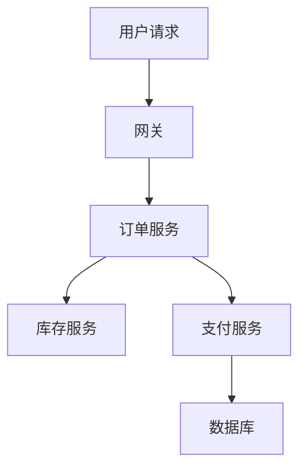

---
tags:
  - Linux
  - 可观测性
  - 追踪
  - 上下文透传
  - 采样
  - 原理
created: 2026-10-03
---

# 追踪的透传与采样

## 1. 日志与指标拼不出的那一段

一次请求跨多个服务时，日志与指标都会遇到同一堵墙：



用户抱怨「下单很慢」时：

- **指标**能说「订单服务的 p99 变差了」，但不知道差在哪一段；
- **日志**能看到「每个服务各自做了什么」，但**没有一个字段把这次请求串起来**；
- **追踪**能直接给出这一次请求的耗时分布：网关 20ms、订单 1.2s、库存 30ms、支付 1.1s、数据库 900ms。

这不是「日志不够详细」的问题。日志的结构是「一条一条事件」，而「一次请求」是横跨多个服务的**树状结构**；即使每个服务都打了很详细的日志，只要没有东西把它们的行关联起来，就永远拼不出这棵树。追踪补的就是这个结构。

## 2. 数据模型：trace 与 span

| 概念 | 含义 | 关键标识 | 关键属性 |
| --- | --- | --- | --- |
| trace（调用链） | 一次完整调用 | `trace_id`（全局唯一） | 由一棵 span 树构成 |
| span（片段） | 其中一段：一次 RPC、一次数据库查询、一次缓存访问 | `span_id` + `parent_span_id` | 开始时间、耗时、状态 |

两件事由这个模型直接决定：

1. **父子关系是通过 ID 表达的，不是通过时间。** 下游以「收到的父 span ID」为父创建自己的 span，因此父子的归属是精确的，与两台机器的时钟差多少无关（时钟只影响「耗时」这条线，见第 3.1 节）。
2. **同一 trace 内的所有 span 共享同一个 `trace_id`。** 这个值就是把它贴进日志、再和追踪对上的那把钥匙——这也是「最小落地」里第一步选择它的原因。

## 3. 上下文透传：一个不能断的链

追踪的数据来自各个服务，所以每个服务都必须知道「我这次调用属于哪条 trace、我的父是谁」。这件事靠**上下文透传**（context propagation）实现：上下文随请求走，通常放在协议头里。

以 W3C Trace Context 的 `traceparent` 头为例：

```text
00-b62974f7d235e7af7f15e50ba76b4121-30931907edc3dcf8-01
```

| 段 | 长度 | 作用 |
| --- | --- | --- |
| `version` | 2 位十六进制 | 协议版本，当前是 `00` |
| `trace_id` | 32 位十六进制（16 字节） | 贯穿整条链路的标识 |
| `parent_id` | 16 位十六进制（8 字节） | 调用方的 span ID；下游以它为自己的父 |
| `flags` | 2 位十六进制 | 最低位表示「是否被采样」（`01` 采样、`00` 不采样）；**其余位是保留位，必须为 0** |

四段缺一不可：

```text
入口 span  trace_id=b62974f7d235e7af7f15e50ba76b4121 span_id=30931907edc3dcf8
下游 span  trace_id=b62974f7d235e7af7f15e50ba76b4121 span_id=cab3552d09c64724 parent_span_id=30931907edc3dcf8
```

下游的 `parent_span_id` 正好等于入口的 `span_id`，两者的 `trace_id` 相同——**这棵树就是这么长出来的**，没有任何中心协调。

### 3.1 头的规范校验比想象中严格

一个严格按规范实现的解析器会拒绝下面每一类输入：

| 输入的问题 | 为什么必须拒绝 |
| --- | --- |
| `trace_id` 全零 | 规范禁止用全零表示「不存在」，全零会造成 ID 冲突 |
| `parent_id` 全零 | 同上 |
| `trace_id` 只有 16 位 | 规范要求 32 位小写十六进制；长度不足说明 ID 被截断或来自另一套约定 |
| `parent_id` 只有 8 位 | 规范要求 16 位小写十六进制 |
| flags 出现 `03` | 保留位非 0，说明实现者自行扩展了语义，接收方无法安全解释 |
| `version` 是 `ff` | 版本号 `ff` 被规范保留为「无效」，必须拒绝 |
| 只有 3 段（缺 `version` 或 `flags`） | 结构不完整；**自研 SDK 最常见的错误就是只传 `trace_id` 与 `span_id`** |

这七条的反面就是生产上最常见的四种错误：**ID 长度写错、用全零 ID 当占位、保留位非 0、把头部截断成 3 段**。实现或对接上下文透传时，先拿这几条做一轮单测——**它们都能在没有任何后端的情况下被测出来**。

### 3.2 时钟：传得下去，也未必算得对

父子关系靠 ID，但**耗时与先后靠各机器自己的墙上时钟**。时钟漂移会让 span 的先后顺序错乱，甚至算出负的耗时。

这是一个容易被跳过、代价却很大的前提：追踪的结论建立在时间基线之上。上线追踪之前，先确认各机器的对时状态，而不是等看到「负耗时」才回头怀疑代码。

## 4. 采样：决策点选在哪里，就丢哪一类信息

追踪的数据量随「请求数 × 每 trace 的 span 数」增长，全采的成本通常不可接受，所以要采样。**采样策略的本质不是「采多少」，而是「在哪个时刻做决定」**——决定了你在做决定时知道什么，因此也决定了你会丢掉什么。

| 策略 | 决策点 | 决策时知道什么 | 优点 | 丢掉的东西 |
| --- | --- | --- | --- | --- |
| 头部采样（head-based） | 入口服务，请求刚开始 | 只知道入口的信息（比例、用户、路径） | 实现简单、下游一致、开销低 | **不知道结果**：可能整条链路丢掉错误请求 |
| 尾部采样（tail-based） | 收集端，整条 trace 收齐之后 | 知道耗时、状态码、是否报错 | 能保证「慢/错必采」 | 收集端要缓存所有 trace，资源要求高 |

**头部采样的固有缺陷值得单独强调**：它在请求还什么都没发生的时候就决定了。如果按固定比例采 10%，那么大约 90% 的错误请求会被整条丢掉——而错误请求恰恰是最该留的。补救手段是**在入口处叠加「强制保留」条件**（例如按错误、按关键路径、按特定用户），但入口能判断的条件有限，很多错误只有下游才知道。

于是实践中的常见组合是三段式：

1. **入口按比例头部采样**（例如 10%），覆盖大部分正常流量；
2. **关键路径与错误强制采样**（错误全部采、支付链路 100%），弥补头部采样的盲点；
3. **高流量场景再加尾部采样**，只保留「慢/错/特定用户」的 trace。

### 4.1 采样标志必须随头透传

`flags` 最低位存在的全部理由，就是**让采样决策只做一次**。

如果每个服务各自决定「我要不要采样」，就会出现链路断片：上游采了、下游没采，中间那段耗时永远算不出来，而且这种缺失是**结构性的**——不是精度问题，是这棵树缺了一个节点。反过来，入口做一次决定、把标志随 `traceparent` 一路传下去，每个下游就知道「这条链路要不要记录」。

这条纪律也解释了 `flags` 为什么要被校验（保留位必须为 0）：接收方需要能安全地解释这个字节，否则「这条链路要不要采」就无法在链上取得一致。

## 5. 成本最低的落地顺序

追踪的能力是分层的，而**性价比最高的一层不需要任何后端**：

| 步骤 | 做什么 | 成本 | 得到什么 |
| --- | --- | --- | --- |
| 第一步 | 上下文透传（协议头）+ 把 `trace_id` 写进日志 | 低 | 日志可以按一次请求串起来，**不依赖追踪后端** |
| 第二步 | 接入 SDK，把 span 上报到后端 | 中 | 能看到 span 树与耗时分布 |
| 第三步 | 配置采样策略与保留期，纳入成本基线 | 中高 | 控制成本并保证「慢/错必采」 |

**第一步为什么最划算**：只要日志里带上 `trace_id`，排障路径就从「按时间窗在日志里盲搜」变成「从一条错误日志跳到同一次请求的全部日志」。这一步不要求任何后端、不要求采样策略、不增加多少存储，却把日志的价值提高一个量级。它与「请求 ID 是日志必备字段」是同一件事——区别只是这个 ID 还被用于跨服务关联。

## 6. 常见误解

| 常见说法 | 事实 |
| --- | --- |
| 「追踪是门户网站才需要的」 | 只要一次请求跨多个服务或依赖，「资源空闲但慢」基本只能靠追踪定位 |
| 「每个服务各自决定采样」 | 会造成链路断片：上游采、下游不采，中间耗时永远算不出来；采样标志必须随头透传 |
| 自研 SDK 只传 `trace_id` + `span_id` | 缺 `version`/`flags` 的 3 段头会被规范解析器直接拒绝 |
| 把 `trace_id` 写成 16 位 | 规范要求 32 位小写十六进制 |
| 用全零 ID 当占位 | 规范禁止全零 `trace_id`/`parent_id`，严格实现会直接报错 |
| 在 flags 里自定义语义 | 保留位必须为 0，否则接收方无法安全解释「是否采样」 |
| 「span 顺序对不上是 SDK 的 bug」 | 跨机 span 的耗时与先后依赖各机器的墙上时钟；先查时间基线 |
| 「还没上后端，先不做透传」 | 第一步（透传 + `trace_id` 写日志）不依赖后端，却是收益最大的一步 |
| 「100% 采样最保险」 | 成本随请求数线性增长；应按比例采样 + 错误强制采样 |

## 要点自测

**问：trace 和 span 是什么关系？**
答：trace 是一次完整调用，有全局唯一的 `trace_id`；span 是其中一段（RPC、数据库查询、缓存访问），带 `span_id` 与 `parent_span_id`。同一 trace 内的 span 通过父子关系组成一棵树，根 span 代表入口。父子关系由 ID 精确表达，不依赖时间。

**问：`traceparent` 的四段分别是什么？为什么缺一段就要拒绝？**
答：`version`（协议版本，当前 `00`）、`trace_id`（32 位十六进制）、`parent_id`（16 位十六进制）、`flags`（最低位是采样标志，其余为保留位）。缺任何一段，接收方都无法确定「用哪个版本解释、属于哪条链路、父是谁、要不要采」，链路要么接错要么断掉。

**问：为什么采样标志必须随头透传？**
答：为了让采样决策只做一次。若每个服务各自决定，就会出现链路断片——上游采了、下游没采，中间耗时永远算不出来。

**问：头部采样最大的问题是什么？**
答：它在请求刚开始时就做决定，此时不知道结果，因此可能整条丢掉错误请求。补救办法是在入口叠加「按错误/关键路径强制采」，或者引入尾部采样。

**问：不部署追踪后端，可以先做什么？**
答：做上下文透传，并把 `trace_id` 写进日志。这一步不依赖后端，却能让排障从「按时间窗盲搜日志」变成「按一次请求捞出全部日志」。后端的接入、采样策略与保留期可以后置。

**第一反应不要做什么**：不要因为「还没上后端」就完全不做上下文透传；不要每个服务各自决定采样；不要在时钟未同步的机器上根据 span 顺序下结论；不要把全零 ID 当占位符；不要用「截断到 3 段」的自研头对接。

## 参考文档

- W3C Trace Context 规范：`traceparent`/`tracestate` 的字段格式、全零与保留位的禁止规则、版本处理。
- OpenTelemetry 的「Signals」「Context propagation」「Sampling」：上下文传播的语义、头部与尾部采样的取舍。
- Jaeger / Tempo 的官方概念文档：trace 与 span 的模型、采样配置的落地方式。

