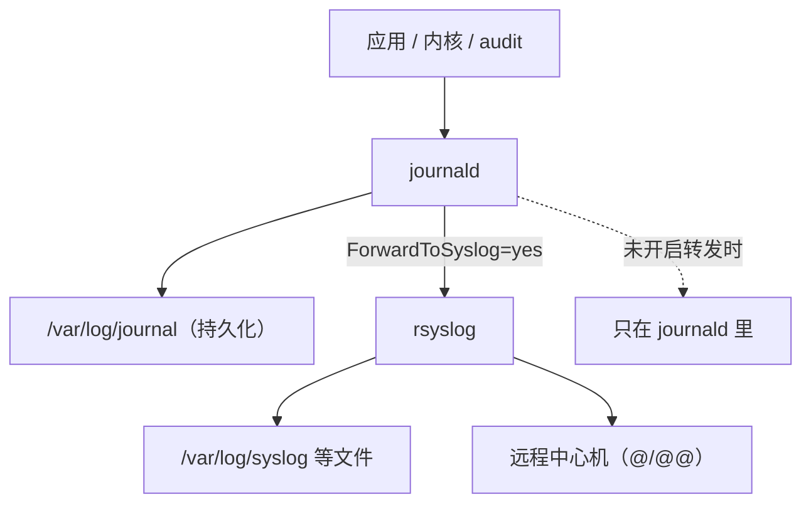

---
tags:
  - Linux
  - 可观测性
  - 日志
  - journald
  - rsyslog
created: 2026-09-19
---

# 日志的落点：journald 与 rsyslog

> [!cite] 参考资料
> `man 1 journalctl`、`man 5 journald.conf`、`man 5 rsyslog.conf`、`man 1 systemd-analyze`（`cat-config`）、`man 5 systemd.exec`（`StandardOutput=`/`StandardError=`）、发行版文档「Journal and log files（Ubuntu Server Guide）」与「Configuring logging（RHEL 9，未在本机实测）」。
>
> 实测输出来自 Ubuntu 24.04.4（WSL2）/ systemd 255 / 非 root；`ForwardToSyslog=yes` 来自本机 `/usr/lib/systemd/journald.conf.d/syslog.conf`。RHEL 系的 rsyslog 默认配置与日志文件路径未实测。

> **这篇讲什么**：一条日志被写出来之后，**到底落在哪**。重点讲清 journald 与 rsyslog 的分工——为什么同一条日志两边都有、什么时候该用哪一边，以及 journald 的持久化与容量这两个最容易「默默失效」的旋钮。
>
> **必须先读什么**：[[Linux/09_日志与监控/04_日志的诞生_格式与落点选择|04 日志的诞生：格式与落点选择]]。
>
> **读完能回答**：① 同一条日志为什么 journald 和 `/var/log/syslog` 里都有？② journald 的字段从哪来、怎么查？③ journal 的容量和保留期由谁决定？④ 什么情况下该让日志走 rsyslog 或采集器而不是 journald？
>
> 所属：[[Linux/09_日志与监控/00_导读与知识地图|09 日志、监控与可观测性]] 的「一条日志的一生」第 2 站 · 主要练 **S2 日志字段与落点规范**、**S3 轮转配置与磁盘满处置**

## 0. 30 秒速览

> [!abstract] 这一篇只要记住六句话
> - **同一条日志通常两边都有，journald 与 rsyslog 不是二选一。**
>   - 证据：实测 `logger -t labtest` 之后，`journalctl -o json` 给出 `SYSLOG_IDENTIFIER/_PID/_UID/_TRANSPORT`，`/var/log/syslog` 里是纯文本一行；原因是 `ForwardToSyslog=yes`（本机来自 `/usr/lib/systemd/journald.conf.d/syslog.conf`）。
> - **journald 是「带字段的收件箱」，这是它比纯文本强的地方。**
>   - 证据：实测 `journalctl -n 1 -o verbose` 给出 `_BOOT_ID`、`_HOSTNAME`、`PRIORITY`、`_UID` 等元数据，所以能按单元、按 boot、按优先级精确过滤。
> - **持久化取决于 `/var/log/journal` 在不在。**
>   - 证据：`Storage=auto`（默认）的语义是「有目录就写磁盘，没有就写 `/run/log/journal`（重启即丢）」；本机两个目录都存在。
> - **journal 的容量有默认上限，不是无限的。**
>   - 证据：`SystemMaxUse=` 默认为空 = 占所在文件系统 10%、上限 4 GiB（见 `man 5 journald.conf`）；本机 `journalctl --disk-usage` 约 580MiB 且随系统活动增长。
> - **journald 有速率限制，高频日志会被丢。**
>   - 证据：默认 `RateLimitIntervalSec=30s`、`RateLimitBurst=10000`（本机 `/etc/systemd/journald.conf` 里这两项是注释状态，即用默认值）；被丢的消息在 `journalctl -u` 里显示 `Suppressed N messages`。
> - **分工：journald 管「本机 + 字段 + 按 unit/boot 查询」，rsyslog/采集器管「长期文件、集中转发、跨机检索」。**
>   - 怎么验证：同一条消息分别用 `journalctl -u` 和 `grep` 在 `/var/log/syslog` 里查一次，两种体验的差别就是分工的理由。

## 1. 为什么两边都有：一条日志的实测轨迹



本机实测：

```text
$ logger -t labtest "hello-from-logger"
$ journalctl -t labtest -n 1 -o short-precise
Sep 19 12:37:37.034494 realtyz labtest[698]: hello-from-logger
$ journalctl -t labtest -n 1 -o json | python3 -c "import json,sys; d=json.load(sys.stdin); print({k:d[k] for k in ['SYSLOG_IDENTIFIER','_PID','_UID','_TRANSPORT','MESSAGE']})"
{'SYSLOG_IDENTIFIER': 'labtest', '_PID': '698', '_UID': '1000', '_TRANSPORT': 'syslog', 'MESSAGE': 'hello-from-logger'}
$ tail -1 /var/log/syslog
2026-09-19T12:37:37.034681+08:00 realtyz labtest: hello-from-logger
$ stat -c "%A %a %U:%G %s %n" /var/log/syslog
-rw-r----- 640 syslog:adm 707517 /var/log/syslog
```

再往前追一步——**是谁让 journald 转发的**：

```bash
systemd-analyze cat-config systemd/journald.conf | grep -nE "^# /(etc/systemd|usr/lib/systemd)|ForwardToSyslog"
```

```text
1:# /etc/systemd/journald.conf
38:#ForwardToSyslog=no
52:# /usr/lib/systemd/journald.conf.d/syslog.conf
57:ForwardToSyslog=yes
```

这里用 `grep -n` 是为了把 `cat-config` 输出的「来源标记行」（以 `# ` 开头的那些）与内容一起显示出来，前面的数字是行号。**`systemd-analyze cat-config` 会把所有可能生效的来源按优先级拼出来**：看到同样的键出现两次、一次被 `#` 注释、一次没有，就是**发行版用 drop-in 覆盖了上游默认值**——这也是「配置文件里明明写着 `no`，实际却是 `yes`」的答案。

> [!important] 「配置里写的」和「实际生效的」不是一个东西
> 结论永远取自 `systemd-analyze cat-config`（合并后）或 `journalctl --header`/`journalctl --disk-usage` 这类运行时观察，而不是某一个配置文件。这条纪律与整个 Linux 学习路径一致：**先看生效值，再看文件**。

## 2. journald：带字段的收件箱

### 2.1 它收什么

| 来源 | 举例 | 判断字段 |
| --- | --- | --- |
| 服务的 stdout/stderr | 自研服务、`systemd-run` 起的临时命令 | `_SYSTEMD_UNIT` / `_SYSTEMD_USER_UNIT` |
| syslog 套接字（`syslog(3)`、`logger`） | 老程序、脚本 | `SYSLOG_IDENTIFIER`、`_TRANSPORT=syslog` |
| 内核（kmsg） | 内核报错、驱动信息 | `_TRANSPORT=kernel`、`_KERNEL_DEVICE` |
| audit | 审计子系统 | `_TRANSPORT=audit` |

### 2.2 它能给出什么字段

```bash
journalctl -n 1 -o verbose | head -10
```

```text
Sat 2026-09-19 12:42:09.122795 CST [s=f9e46537553c4a06b07bdd01ca2a8505;i=5ceba;b=651efbf99e1e4300b67eb87d15644f40;m=109211f9;t=65bcea3c309eb;x=d4e1b5f903c18b88]
    _BOOT_ID=651efbf99e1e4300b67eb87d15644f40
    _MACHINE_ID=f13b8ed5e9624ff88b5b5d13e6565764
    _HOSTNAME=realtyz
    _RUNTIME_SCOPE=system
    PRIORITY=6
    _UID=0
    _GID=0
```

几个值得记住的：

| 字段 | 含义 | 用途 |
| --- | --- | --- |
| `_BOOT_ID` | 本次开机的唯一标识 | 区分「这次开机」和「上次开机」，`-b` 就是按它过滤 |
| `__MONOTONIC_TIMESTAMP` | 自开机起的微秒数（`m=`） | 不受对时影响，排序与算间隔最可靠 |
| `_SYSTEMD_UNIT` / `_SYSTEMD_USER_UNIT` | 消息属于哪个 unit | `journalctl -u` 的底层依据 |
| `PRIORITY` | syslog 优先级（0–7，6=info） | `-p err` 这类过滤的依据 |
| `_UID` / `_GID` / `_PID` | 发送者的身份 | 判断「是谁在写」 |
| `MESSAGE` | 正文 | 注意：**写在正文里的 JSON 不会自动变成字段** |

### 2.3 持久化：日志到底写磁盘还是写内存

`/etc/systemd/journald.conf` 里给出的默认值（本机是注释状态，即使用默认）：

```ini
Storage=auto
```

| `Storage=` 取值 | 落点 | 重启后 |
| --- | --- | --- |
| `volatile` | 只在 `/run/log/journal`（内存） | 丢失 |
| `persistent` | `/var/log/journal` | 保留 |
| `auto`（默认） | 有 `/var/log/journal` 就持久化，否则进内存 | 取决于目录是否存在 |
| `none` | 不落盘，收到的日志被丢弃（是否转发取决于 `Forward*` 配置） | 不保存 |

本机实测两个目录都存在：

```text
$ ls -d /var/log/journal /run/log/journal
/run/log/journal
/var/log/journal
```

> [!warning] 「日志重启就没了」的根因通常在这里
> 容器、精简镜像、临时实例上经常没有 `/var/log/journal`，于是 `Storage=auto` 就退化成内存存储——**日志重启即丢，而且不会报错**。交付前必须实测 `ls -ld /var/log/journal` 与 `journalctl --disk-usage`。

### 2.4 容量与限流：两个必须确认的旋钮

| 参数 | 默认行为 | 为什么必须确认 |
| --- | --- | --- |
| `SystemMaxUse=` | 空 → 最多占所在文件系统的 10%（上限 4 GiB） | 根分区小的时候 10% 可能远不够；也可能在根分区上占得太多 |
| `SystemKeepFree=` | 空 → 至少留 15% 空闲 | 与上一条共同决定 journal 的真实上限 |
| `MaxRetentionSec=` | 空 → 不按时间删，只按容量 | 合规要求「留 30 天」时必须显式设置 |
| `RateLimitIntervalSec=` / `RateLimitBurst=` | `30s` / `10000` | 高频日志会被丢弃，`journalctl -u` 会看到 `Suppressed N messages` |
| `MaxFileSec=` | `1month` | journal 文件按月切分 |

```bash
journalctl --disk-usage                                        # 验证：当前占用
systemd-analyze cat-config systemd/journald.conf | grep -E "^# /|^(Storage|SystemMaxUse|SystemKeepFree|MaxRetentionSec|RateLimit|ForwardToSyslog)"
ls -ld /var/log/journal                                        # 验证：是否持久化
journalctl -u <unit> --since "1 hour ago" | grep -i suppres    # 验证：有没有被限流丢弃
```

本机实测（写作过程中这个数字从 578.0M 长到 598.8M，**说明它是动态的**）：

```text
$ journalctl --disk-usage
Archived and active journals take up 578.0M in the file system.
```

### 2.5 常用 `journalctl` 用法速查

```bash
journalctl -u ssh.service -b --since "10 min ago" --no-pager   # 按单元 + 本次开机 + 时间窗
journalctl -b -1 -n 50                                        # 上一次开机的最后 50 条
journalctl -p err -b                                          # 本次开机里优先级为 err 及以上的
journalctl -t labtest -n 5                                    # 按 syslog identifier 过滤
journalctl -g "Started|Stopped|Reloaded" --since "2 hours ago" # 按正则搜内容
journalctl -o json -n 1 | python3 -m json.tool                # 看完整字段
journalctl --list-boots                                       # 有哪些 boot
journalctl -k -b                                              # 内核消息（本次开机）
```

本机实测的 `--list-boots`（**注意 boot 编号是相对的，0 是当前**）：

```text
$ journalctl --list-boots | tail -3
 -2 5c9a5d725db54ad388bb00471e73fc55 Sat 2026-09-19 11:16:12 CST Sat 2026-09-19 11:20:03 CST
 -1 917b024b4d6846738b0f77dd0652c2cc Sat 2026-09-19 12:27:12 CST Sat 2026-09-19 12:27:28 CST
  0 651efbf99e1e4300b67eb87d15644f40 Sat 2026-09-19 12:37:32 CST Sat 2026-09-19 12:42:09 CST
```

## 3. rsyslog：落盘与转发的那一侧

rsyslog 是传统 syslog 守护进程，负责两件事：

1. **按规则把消息落到文件**（`/var/log/syslog`、`/var/log/auth.log`、`/var/log/kern.log`……）。
2. **把消息转发出去**（`@` = UDP、`@@` = TCP、RELP、syslog over TLS）——子笔记 07 展开。

它收到的东西来自两条路：journald 的转发（`ForwardToSyslog=yes`）、以及直接写 syslog 套接字的程序。**rsyslog 落盘的是纯文本**，字段化能力弱，但胜在简单、通用、所有采集器都认。

## 4. 分工与取舍

| 维度 | journald | rsyslog（或采集器） |
| --- | --- | --- |
| 数据结构 | 结构化字段（`_PID`/`_SYSTEMD_UNIT`/`__MONOTONIC_TIMESTAMP`…） | 默认纯文本一行（模板可定制） |
| 查询 | `journalctl`（按单元/boot/优先级/字段） | `grep`/`awk`，或交给集中式平台 |
| 保留 | 默认在 `/var/log/journal`（有目录才持久化），按大小轮转 | 由 `logrotate` 管理，保留策略自己定 |
| 传输 | 本身不负责远程转发 | 天生负责远程（`@`/`@@`/RELP/TLS） |
| 适合 | 本机排障、服务日志、按字段过滤 | 长期留存、集中检索、跨机转发 |

> [!tip] 实践中的默认组合
> **两边都留**：journald 管本机排障（字段 + 按 unit/boot 过滤，排查服务问题的效率远高于 grep 文本），rsyslog 或采集器管长期留存与集中（子笔记 07）。代价是同一份信息存了两遍——**这正是「保留天数」要写进方案的原因**（子笔记 14）。

## 5. 生产动作：把「日志落点」核查一遍

这是一段**有产出**的核查（产出是基线卡里的「日志落点」一节），且全程只读，生产机上可以做。

```bash
systemctl is-active systemd-journald rsyslog logrotate.timer systemd-tmpfiles-clean.timer
systemd-analyze cat-config systemd/journald.conf | grep -E "^# /|^(Storage|SystemMaxUse|SystemKeepFree|MaxRetentionSec|RateLimit|ForwardToSyslog)"
ls -ld /var/log/journal /run/log/journal 2>/dev/null
journalctl --disk-usage
ls -l /var/log/syslog /var/log/auth.log /var/log/kern.log 2>/dev/null
systemctl list-timers logrotate.timer systemd-tmpfiles-clean.timer --no-pager
grep -vE "^\s*(#|$)" /etc/logrotate.conf; ls /etc/logrotate.d/
```

本机实测样张（对照格式）：

```text
journald 持久化：/var/log/journal 存在；合计占用 578.0M（写作过程中增长到 598.8M）
ForwardToSyslog=yes（来自 /usr/lib/systemd/journald.conf.d/syslog.conf）
/var/log/syslog：640 syslog:adm，707517 字节
logrotate.timer：每日 00:00；/var/lib/logrotate/status 记录上次轮转时间
systemd-tmpfiles-clean.timer：约每 24 小时一次
```

## 常见坑

| 常见做法或说法 | 后果或事实 |
| --- | --- |
| 「日志肯定在 `/var/log/syslog` 里」 | 写 stdout 的现代服务（以及容器）可能只进 journald；先看 `systemctl show -p StandardOutput` |
| 「配置文件里写着 `#ForwardToSyslog=no`，所以没转发」 | 那是被注释的默认值；drop-in 可能覆盖成 `yes`，要看 `cat-config` 的合并结果 |
| 「journal 会自己控制大小，不用管」 | 默认上限是文件系统的 10%（上限 4 GiB），在根分区上可能仍然过大或不够 |
| 「日志重启就没了是我的错觉」 | 多半是 `/var/log/journal` 不存在，`Storage=auto` 退化成内存存储 |
| 「`journalctl` 里没有就是应用的错」 | 先确认三件事：落点（写到哪里）、持久化（有没有存）、限流（有没有被丢） |
| 「journald 会自动把 JSON 日志解析成字段」 | 不会：本机实测 `MESSAGE` 里是原文 JSON；字段化要靠采集端 |

## 决策练习

**场景**：一个服务的日志在 `journalctl -u mysvc` 里能看到，但 `/var/log/syslog` 里怎么都 grep 不到。团队要求「统一到 `/var/log/syslog` 再做集中采集」。

**A. 直接改 `/etc/rsyslog.d/` 加一条规则，把 journald 的消息全量转发到文件**
**B. 先确认三件事：服务日志的落点（`systemctl show -p StandardOutput`）、journald 的 `ForwardToSyslog` 生效值、rsyslog 的规则过滤，再决定改哪一处**
**C. 让开发在应用里自己再写一份 `/var/log/mysvc.log`**

**为什么选 B**：日志「看不到了」可能是三种完全不同的原因——没转发（`ForwardToSyslog=no` 或 rsyslog 规则没匹配）、没持久化（`/var/log/journal` 缺失）、被过滤/限流。先定位再改，改一处就能生效；不定位就改，可能改了三处还没解决，还引入重复与配置冲突。

**为什么不选 A**：直接加全量转发规则会放大磁盘与集中成本（原本只存在 journal 里的高优先级消息现在全落到文件），而且没有解决「为什么没转发」这个根因。

**为什么不选 C**：让应用额外写一份文件是最贵的做法：多一处轮转配置、多一份写满风险、多一处口径不一致的可能。**已经有 systemd 和服务通道的情况下，不应该再引入第三条落点。**

## 要点自测

> [!question]- 为什么同一条日志在 journald 和 `/var/log/syslog` 里都能看到？
> - **因为 journald 开了转发**：`ForwardToSyslog=yes`（本机来自 `/usr/lib/systemd/journald.conf.d/syslog.conf`）会把收到的消息再交给 rsyslog。
> - **怎么确认**：`systemd-analyze cat-config systemd/journald.conf | grep -E "^# /|ForwardToSyslog"`，看合并后的生效值。
> - **两边差异**：journald 侧是带字段的结构化记录，rsyslog 侧是纯文本一行。
> - **第一反应不要是什么**：不要只看某一个配置文件里的注释值。

> [!question]- journald 的持久化由什么决定？怎么验证？
> - **机制**：`Storage=auto`（默认）时，看 `/var/log/journal` 是否存在——存在就持久化，不存在就写内存（`/run/log/journal`）。
> - **验证**：`ls -ld /var/log/journal`、`journalctl --disk-usage`、`journalctl --list-boots`（能列出过去的 boot 说明持久化生效）。
> - **风险场景**：容器、精简镜像、临时实例最容易「日志重启即丢」且不报错。
> - **第一反应不要是什么**：不要以为重装/重启后日志还在，除非你验证过。

> [!question]- journald 的容量与限流有哪些默认值？为什么必须确认？
> - **容量**：`SystemMaxUse=` 默认空 → 占所在文件系统 10%（上限 4 GiB）；`SystemKeepFree=` 默认空 → 至少留 15% 空闲。
> - **保留**：`MaxRetentionSec=` 默认空 → 不按时间删，只按容量；要「留 30 天」必须显式设置。
> - **限流**：`RateLimitIntervalSec=30s`、`RateLimitBurst=10000`；被丢的消息在 `journalctl -u` 里表现为 `Suppressed N messages`。
> - **为什么要确认**：容量不足会丢历史，容量过大可能挤占根分区；限流在高频日志下会静默丢消息。
> - **第一反应不要是什么**：不要假设「默认值一定安全」。

> 上一篇：[[Linux/09_日志与监控/04_日志的诞生_格式与落点选择|04 日志的诞生：格式与落点选择]] ｜ 下一篇：[[Linux/09_日志与监控/06_日志的轮转_logrotate的两种切法|06 日志的轮转：logrotate 的两种切法]]
