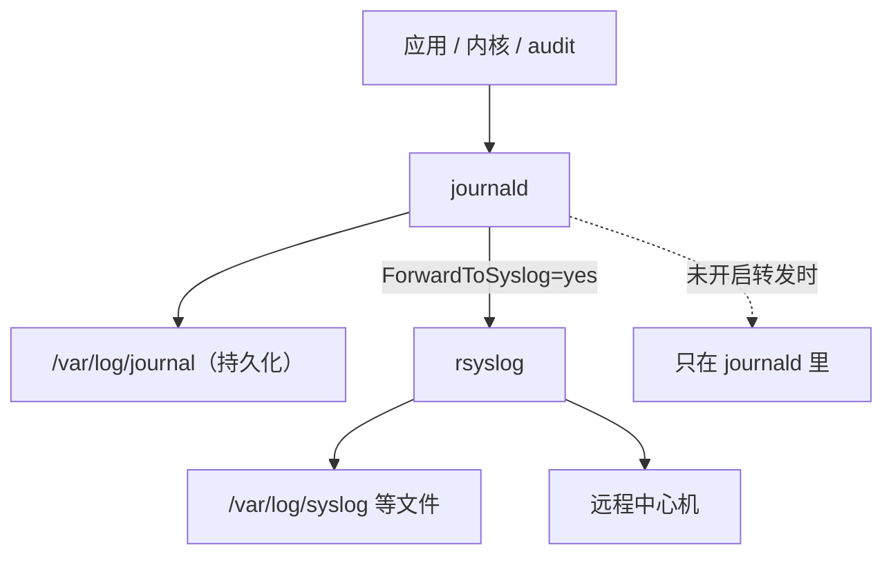
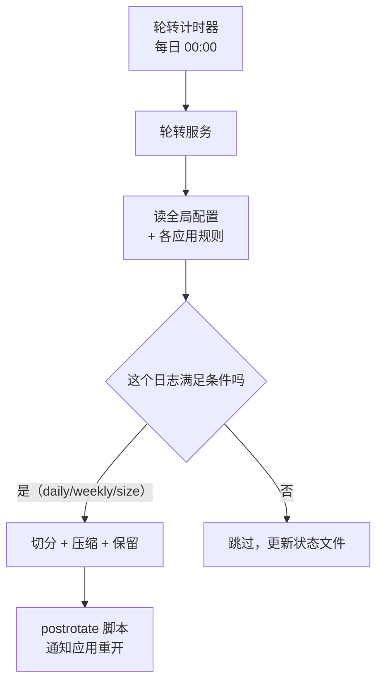

---
tags:
  - Linux
  - 可观测性
  - 日志
  - journald
  - logrotate
  - 体系
created: 2026-10-03
---

# 一条日志的一生

## 一、诞生：往哪写，就决定了后面所有可能性

一条日志的一生从「被写出来」开始。应用在这一刻做出的选择只有三个方向，而这三个方向决定了它后来能被谁收集、能带上哪些字段、能保留多久。

| 落点 | 收集者 | 自动带上的字段 | 后续要自己负责的事 |
| --- | --- | --- | --- |
| stdout / stderr | systemd 收进 journald | 单元、优先级、开机标识、单调时间戳 | 收集端的持久化与容量配置 |
| 自有文件 | 自己 + 轮转工具 + 采集端 | 没有——字段只能靠解析 | 轮转、压缩、保留、写满风险 |
| syslog 套接字 | journald 与 rsyslog 两条通道 | facility/severity、来源标识 | 转发配置的语义 |

判断一个服务走哪条路，读它的落点属性即可；而判断一条具体消息是从哪条路进来的，看 journald 的字段：

| 字段 | 含义 | 用途 |
| --- | --- | --- |
| `_TRANSPORT` | 消息从哪个通道进来：`stdout`/`syslog`/`kernel`/`audit` | 区分「谁写的」与「怎么进来的」 |
| `_SYSTEMD_UNIT` / `_SYSTEMD_USER_UNIT` | 消息属于哪个单元 | 按单元过滤日志 |
| `SYSLOG_IDENTIFIER` | 来源标识（程序名或 `-t` 指定的标签） | 按标识过滤；注意同一标识可能来自不同通道 |
| `PRIORITY` | syslog 严重程度（0–7，数字越小越严重） | 按级别过滤 |
| `_PID` / `_UID` / `_GID` | 发送者身份 | 判断「是谁在写」 |
| `_BOOT_ID` | 本次开机的唯一标识 | 区分这次开机与上次开机 |
| `__REALTIME_TIMESTAMP` / `__MONOTONIC_TIMESTAMP` | 墙上时钟与单调时钟（微秒） | 跨机对账 / boot 内排序 |
| `MESSAGE` | 正文 | **写在正文里的 JSON 不会自动变成字段** |

`_TRANSPORT` 是最能说明问题的一个字段：同一个 `SYSLOG_IDENTIFIER` 的消息可能来自 `syslog`，也可能来自 `stdout`——**身份相同，通道不同，因此后续的字段与转发行为也不同**。

## 二、落点：journald 与 rsyslog 不是二选一

日志被写出来之后的第一个岔路是「到底落在哪」。常见误解是「要么 journald 要么 rsyslog」，实际默认配置下**通常是两边都有**：journald 收到消息后，可以再转发一份给 rsyslog，而 rsyslog 负责把它落到文件、并负责远程转发。



两边的能力互补，这是「都留着」的理由：

| 维度 | journald | rsyslog（或采集端） |
| --- | --- | --- |
| 数据结构 | 结构化字段 | 默认纯文本一行（模板可定制） |
| 查询 | 按单元、boot、优先级、任意字段过滤 | 文本搜索，或交给集中式平台 |
| 保留 | 由自身容量上限与服务端配置控制 | 由轮转规则控制 |
| 远程传输 | 本身不负责 | 天生负责（UDP/TCP/RELP/TLS） |
| 强项 | 本机排障、按字段精确定位 | 长期留存、集中检索、跨机转发 |

### 2.1 「配置里写的」不是「生效的」

journald 的配置项（`Storage=`、`SystemMaxUse=`、`ForwardToSyslog=` 等）**不是 systemd 的单元属性**，所以查单元属性的命令读不到它们——会返回空值而退出码仍是 0，这个表象极易被误认为「默认值就是这样」。

生效值要从「把所有来源合并之后的配置」里读。之所以必须合并，是因为**发行版可以用追加片段覆盖上游默认值**：一个被注释掉的 `#ForwardToSyslog=no` 与一个未被注释的 `ForwardToSyslog=yes` 同时出现在合并输出里时，后者生效。**只读某一个文件、只读注释行，都会得到相反结论。**

### 2.2 持久化：日志写磁盘还是写内存

| `Storage=` 取值 | 落点 | 重启后 |
| --- | --- | --- |
| `volatile` | 只在内存文件系统（`/run/log/journal`） | 丢失 |
| `persistent` | `/var/log/journal` | 保留 |
| `auto`（默认） | 该目录存在就持久化，否则进内存 | **取决于目录是否存在** |
| `none` | 不落盘，收到的消息被丢弃 | 不保存 |

`auto` 的语义是这条链上最容易「静默失效」的一处：**容器、精简镜像、临时实例上经常没有那个目录，于是日志退化成内存存储，重启即丢，而且没有任何报错。** 判据是看目录是否存在，以及查询工具的容量输出是否指向磁盘路径。

Journal 文件本身还有 `ARCHIVED`（已封存）与 active（正在写）之分。这个区分后面有用：**按容量回收只能作用于已封存的文件**，所以把上限设得再小，也不会让正在写的那个文件立刻缩下去。

### 2.3 容量与限流：两个必须确认的旋钮

| 配置项 | 默认行为 | 为什么必须确认 |
| --- | --- | --- |
| `SystemMaxUse=` | 空 → 最多占所在文件系统的 10%（上限 4 GiB） | 小盘上这个比例可能过大，大盘上又可能不够 |
| `SystemKeepFree=` | 空 → 至少留 15% 空闲 | 与上一条共同决定真实上限 |
| `MaxRetentionSec=` | 空 → 不按时间删，只按容量 | 合规要求「留 30 天」时必须显式设置 |
| `RateLimitIntervalSec=` / `RateLimitBurst=` | `30s` / `10000` | 高频日志会被丢弃，查询时显示 `Suppressed N messages` |
| `MaxFileSec=` | `1month` | 文件按月切分，决定封存粒度 |

两个判据要记住：

- **容量上限是「比例」，不是「绝对量」。** 同一个默认值在 48 GiB 的根分区上意味着数 GiB，在小盘上可能瞬间被占满。判断「够不够」要拿绝对值去算。
- **被限流丢弃的消息不会报错**，只在查询时留下 `Suppressed N messages` 这一行。看到它说明有些日志你从来没看到过——**在排查「日志不全」时，这一行比日志内容本身更重要。**

## 三、轮转：切开之后谁还在写

日志文件长到一定程度必须被切开，否则它会一直长到写满。负责这件事的是一个**不是常驻进程**的工具：它由定时任务每天触发一次，读一组规则，按条件决定哪些日志该切。



### 3.1 两种切法的本质差别

| 切法 | inode（文件系统对象的编号，文件名只是指向它的一个入口） | 写入方是否察觉 | 数据落点 | 代价 |
| --- | --- | --- | --- | --- |
| 复制再截断（`copytruncate`） | **不变** | 不察觉，继续写同名文件 | 截断前的内容进归档 | 复制与截断之间存在丢日志窗口；大文件复制占额外 IO |
| 换新文件（`create`）+ 通知重开 | **改变** | **取决于是否通知** | 未重开时新数据全进归档文件 | 必须真的让应用重开，否则新文件永远是空的 |

第二种切法的失败形态是生产事故的典型：**新日志文件一直是空的，旧归档文件却持续增长。** 它的成因很明确——写入方持有的是文件描述符（fd），而 fd 指向的是 inode，不是文件名。改名与新建文件只改变了「名字指向哪个 inode」，持有旧 fd 的进程完全察觉不到，它继续往旧 inode 写，也就是继续往归档文件里写。

由此得到判断一份轮转配置是否合格的**唯一标准**：**`postrotate` 里有没有让写日志的进程重新打开文件。** 做不到就必须退回复制再截断，并接受丢日志的代价。

发行版自己的做法值得照抄结构：在 `postrotate` 里对服务发一个约定的重载信号，并且用「一组日志只跑一次脚本」避免重复发信号、用「延后一轮再压缩」给还没重开文件的进程留出一轮时间。

### 3.2 「该轮转却没轮转」的判据链

这是本链上最容易产生错误因果的一处，值得把判据按顺序列清楚：

| 层 | 看什么 | 说明什么 |
| --- | --- | --- |
| 计时器层 | 定时器的下次触发时间与上次触发时间 | 计时器本身是否活着 |
| **服务层** | 服务的执行开始时间戳、服务的日志条目 | **服务是否真的被拉起来过——这一步最容易被漏掉** |
| 条件层 | 用分析工具直接验证那条条件本身 | 条件成立与否，而不是「看起来像」 |
| 产物层 | 状态文件是否更新、归档文件是否出现 | 轮转是否真的产生了结果 |

两个反直觉的判据：

- **计时器的「上次触发时间」有值，不等于轮转发生过。** 那个时间可能来自持久化记录，而服务在本次开机内根本没被执行过。**只看到这一层会得到「一切正常」的错误结论。**
- **条件的「结果」字段显示 `no`，不等于条件失败。** 它不区分「求值失败」与「从未求值」；要区分，看条件的求值时间戳是否为零——**零表示这个条件一次都没被求值过**，此时的 `no` 只是默认值。

配套的一条纪律：排查时不要用「强制执行」反复试探。强制轮转会消耗一份保留额度，在保留份数少的生产日志上反复执行等于提前删掉历史；而且它会把状态文件更新成「刚轮过」，之后真实的定时轮转会因此推迟。**只打印计划的那一档才是排查时该用的**（注意它的输出走标准错误）。

## 四、集中：把日志送出去

日志在本机活了一段之后，通常还要离开本机。这一步涉及三件事：报文长什么样、用什么传输、接收端怎么接住。

### 4.1 报文的字段结构

新格式的 syslog 报文不是「一段文本」，而是有固定字段的：

```text
<PRI>版本 时间戳 主机名 应用名 进程号 消息ID 结构化数据 消息体
```

| 字段 | 含义 | 注意 |
| --- | --- | --- |
| `PRI` | facility × 8 + severity | 一个数同时编码「谁产生的」与「多严重」 |
| 版本 | 协议版本 | 旧格式没有这一段 |
| 时间戳 | 带时区偏移 | 跨时区对账的前提 |
| 主机名 | 发送方主机 | 与字段里的主机名不重复 |
| 应用名 / 进程号 / 消息ID | 来源三元组，未设置时为 `-` | 集中之后按它们切分来源 |
| 结构化数据 | 键值对，例如时间同步质量 | **不是给人看的装饰，是可判定的元数据** |
| 消息体 | 正文 | UDP 报文里没有换行符，TCP 有 |

**UDP 与 TCP 在报文层就有一个实务差异**：UDP 一条报文就是一个消息、没有分隔符，接收端只能靠「一包一条」来切分；TCP 是字节流，靠换行分帧。

### 4.2 传输方式的取舍

| 方式 | 可靠性 | 加密 | 适用 |
| --- | --- | --- | --- |
| UDP（User Datagram Protocol，用户数据报协议） | 会丢（拥塞、接收队列满），**且发送端无感知** | 无 | 同机房、量大、丢一点可接受 |
| TCP（Transmission Control Protocol，传输控制协议） | 有连接与重传，但有队头阻塞与重连成本 | 无 | 同机房、要求不丢 |
| RELP（Reliable Event Logging Protocol，可靠事件日志协议） | 应用层确认，断线可续传 | 可选 | 要求不丢且链路不稳定 |
| syslog over TLS（Transport Layer Security，传输层安全） | 依赖 TCP | 有 | 跨公网、跨机房、合规要求 |
| 采集端走 HTTP/TLS | 依赖 HTTP 重试 | 有 | 需要解析、过滤、多路输出 |

UDP 的「丢」是最需要被具体化的一条：**向一个没有任何进程监听的端口发一条 UDP 消息，发送端会正常返回成功**；而同样的情况换 TCP，发送端当场报错。也就是说 UDP 的丢包**在发送端完全不可观测**——只有在接收端做「发送计数 vs 接收计数」的对账，或者干脆改 TCP/TLS，才能发现丢了。审计与合规类日志走 UDP 是明确的隐患。

### 4.3 集中之后新增的风险

| 风险 | 表现 | 对策 |
| --- | --- | --- |
| 中心机容量 | 一台中心机接几十上百台机器的日志，增长是叠加的 | 中心机自己也要有轮转、保留与容量告警 |
| 单点故障 | 中心机挂了，发送端可能积压或丢弃 | 发送端配磁盘队列；接收端做冗余 |
| 时间不统一 | 各机器时钟不同，集中后时间线更乱 | 先做时间基线；用报文里的同步质量字段筛掉不可信来源 |
| 网络抖动丢日志 | UDP 静默丢包 | 关键日志改 TCP/TLS 或 RELP；接收端做计数对账 |
| 权限与合规 | 日志集中后可见面变大 | 采集端脱敏；访问控制与留存策略写进方案 |

**集中不是消除风险，而是把风险换了个地方。** 发送端通常仍然落盘（本地缓冲、转发队列、本机 journal），接收端也落盘——两端都要算容量。

## 五、退役：删掉、回收，以及空间为什么不释放

日志这条线的终点是容量：算清它占多少、什么时候删、删的时候会不会出问题。

### 5.1 「磁盘满了」要先分四类

现象相同，处置完全不同，所以第一步是分类型：

| 类型 | 判据 | 处理方向 |
| --- | --- | --- |
| 真占空间的文件 | `df` 高，且按目录统计能找到大文件 | 调保留策略、压缩、分盘；先清理最老的可删数据 |
| 已删除但仍被持有 | **`df` 高而按目录统计找不到**；fd 列表里有 `(deleted)` 标记 | 让持有者重开文件或重启（继续删无效） |
| inode 用满 | inode 统计高而空间统计不高 | 找海量小文件，治「谁在写」而不是删大文件 |
| 保留块 / 挂载覆盖 | 空间统计的「已用 + 可用 < 总量」；或挂载点遮住了下层目录 | 查保留块配置与挂载点 |

### 5.2 inode 是另一本账

「空间」和「能建多少文件」是两本独立的账。一个小文件系统上可以出现「空间几乎没用，却再也建不了文件」的状态：文件数用尽之后，新建文件直接失败，而空间统计仍显示 1%。

排障含义很直接：**看到写入失败时，两本账都要看**。只查空间用量，会在 inode 用尽的情况下找不到原因。

### 5.3 「删了但空间没释放」的机制

这是在文件系统层解耦的结果，值得把机制讲透：

- **文件名只是目录里的一条映射**，指向一个 inode；
- **进程打开文件后持有的是 fd，fd 指向 inode，不指向文件名**；
- 删除操作去掉的是目录里那条映射。**只要还有进程持有这个 inode，它的数据块就不会被回收**——此时文件「没有名字，但仍然存在」。

这解释了三个现象，它们各自都是一个判据：

1. **空间统计（看文件系统层面的已用块）会把它算进去，按目录统计（走目录树里的可见名字）看不到它。** 两者的差值就是这个「幽灵文件」的大小。
2. **fd 列表里会显示 `(deleted)` 标记**，这是找到持有者的直接入口。
3. **继续删没有任何用**；唯一有效的处置是让持有者关闭 fd（重开日志、重载或重启服务）——而**不要直接强杀业务进程**。

同类现象还有两个容易混淆的邻居：**保留块**（给 root 预留的比例，表现为「统计显示快满了，root 还能写，普通用户已经写不进去」）与**挂载覆盖**（挂载点遮住了下层目录，导致目录统计比实际占用小）。三者的共同点是都让「两本账」对不上，区别在于判据不同。

### 5.4 回收是止血，不是治本

按容量或时间回收 journal 确实有效，但它的**代价是不可逆的**：删掉的历史日志不会回来。而且它只作用于已封存的文件、只管 journal 这一本账（rsyslog 落的文件由轮转工具管，两条账要分别算）。

所以处置顺序是固定的三段：

1. **止血（分钟级）**：确认不是业务数据后，清理最老、最没价值的部分，或让日志立刻轮转一次；对持有已删除文件的进程，让它重开日志而不是强杀。
2. **治本（小时级）**：把保留策略三层配齐（见下），把日志目录与业务数据分盘。
3. **加防线（天级）**：日志目录容量告警，轮转与清理任务的执行结果纳入监控，定期在实验机演练一次「写满 → 定位 → 恢复」。

### 5.5 三层保留策略

| 层 | 管什么 | 手段 | 缺了这一层会怎样 |
| --- | --- | --- | --- |
| 应用层 | **产生速率** | 按级别输出，生产不开 debug | 一天写几百 GiB，后两层怎么配都救不回来 |
| 收集层 | **系统日志总量** | 容量上限、预留空闲、按时间保留 | 默认按「文件系统的 10%」控制，可能过大或不够 |
| 文件层 | **自建日志文件的份数与压缩** | 保留份数、大小或时间条件、压缩 | 归档文件无限增长 |

**三层缺一不可**，且顺序有意义：应用层决定了后两层要处理多少量。

## 六、四条横切线

五个站点串起来之后，有四条线横穿其中，它们是把知识连成能力的关键：

| 横切线 | 贯穿内容 | 收口于 |
| --- | --- | --- |
| 取用顺序 | 指标定范围 → 日志定细节 → 追踪定段落 → 变更定诱因 | 「服务慢但资源空闲」的定位树 |
| 统计口径 | 平均掩盖长尾、分位数口径、瞬时采样盲区 | 一份写清窗口与算法的口径说明 |
| 成本与容量 | 保留天数、基数、采样率；频率是线性成本；分盘 | 三个数字 + 负责人 + 分盘策略 |
| 时间基线 | 时区、对时、两种时钟、时间戳格式 | 把多来源证据对齐到同一条时间轴 |

在这四条之外，还有一条贯穿整条链的纪律：**采集与轮转本身要可观测**。日志有没有落盘、有没有被限流丢、轮转有没有真的执行、容量上限是多少——这些都是「监控系统的监控」。缺了它们，故障时你会先怀疑数据本身，而那是最浪费时间的一条路。

## 常见坑

| 常见做法或说法 | 后果或事实 |
| --- | --- |
| 「日志肯定在 `/var/log/syslog` 里」 | 写 stdout 的现代服务与容器可能只进 journald；先看落点属性 |
| 「配置文件里写着注释掉的开关，所以没开」 | 那是被注释的默认值；发行版可能用追加片段覆盖成 `yes`，要看合并后的生效值 |
| 用查单元属性的命令去读收集端配置 | 那些是配置文件项、不是单元属性，会返回空而退出码为 0 |
| 「日志重启就没了是我的错觉」 | 多半是持久化目录不存在，默认策略退化成了内存存储 |
| 「journal 会自己控制大小，不用管」 | 默认上限是所在文件系统的 10%，在小盘上可能过大、在大盘上可能不够 |
| 「查询里没有就是应用的错」 | 先确认三件事：落点（写到哪）、持久化（有没有存）、限流（有没有被丢） |
| 「加了轮转配置就没事了」 | 配置写了不等于生效：要确认规则被读到、条件是否满足、`postrotate` 真的让应用重开 |
| 「计时器上次触发时间有值，说明在正常跑」 | 那个值可能来自持久化记录，服务在本次开机内可能根本没被执行过 |
| 「条件结果显示 `no`，说明被条件挡了」 | 它不区分「求值失败」与「从未求值」；判据是条件的求值时间戳是否为零 |
| 「`create` 之后应用会自动跟着写新文件」 | 不会。持有 fd 的进程继续写旧 inode，也就是继续写归档文件 |
| 「轮转没生效，多跑几次强制轮转看看」 | 强制轮转会消耗保留额度、打断时间语义；排查用只打印计划的那一档 |
| 「用 UDP 更简单，日志丢了也不重要」 | UDP 丢包在发送端完全不可观测；审计与合规类日志不能走 UDP |
| 「`rm` 掉大日志就有空间了」 | 进程还持有 fd 时空间不释放；必须让它重开或重启 |
| 「按目录统计找不到大文件，所以没满」 | 走目录树的统计看不到已删除但仍被持有的 inode；两者差值就是线索 |
| 「空间统计没满就不用管」 | 还有 inode 这本账；inode 用尽时空间可能只用 1% 却建不了文件 |
| 「回收命令是安全的清理」 | 它删的是历史且不可恢复；只管 journal 这一本账 |
| 「删之前先清干净再说」 | 删掉最近一段就丢掉了复盘证据；保留「最近一段 + 最大贡献者」 |
| 「分盘太麻烦，先把日志塞在根分区」 | 日志写满根分区会让整机故障（收集端、远程登录、审计都写不进去），代价远高于分区 |
| 「日志集中了本机就不用配保留」 | 发送端仍有本地缓冲与 journal，接收端也落盘；两端都要容量策略 |

## 要点自测

**问：同一条日志为什么可能两个地方都有？怎么确认？**
答：因为收集端被配置成把收到的消息再转发给传统 syslog 守护进程。确认方式是读「合并所有来源之后的生效配置」，而不是读某一个文件里的注释行——发行版常用追加片段覆盖上游默认值，只看单文件会得到相反结论。

**问：怎么判断 journal 是写磁盘还是写内存？**
答：默认策略是「目录存在就持久化，否则进内存」。所以判据是持久化目录是否存在，以及查询工具的容量输出与文件头里的路径是否指向磁盘。容器与精简镜像上这条最常静默失效。

**问：轮转之后新日志文件为什么是空的？**
答：换新文件的切法改变了名字对应的 inode，而写入方持有的是指向旧 inode 的 fd，它察觉不到变化，继续把数据写进已被改名的归档文件。修法是让写入方重开文件（发约定的重载信号或调用应用的接口），做不到就退回复制再截断并接受丢日志窗口。

**问：怎么判断一次「该轮转却没轮转」？**
答：分层判断——计时器是否活着（下次/上次触发时间）、**服务是否真的被执行过**（执行开始时间戳与它自己的日志）、条件是否成立（用分析工具直接验证，而不是看那个不区分「未求值」的结果字段）、产物是否出现（状态文件与归档文件）。只看第一层会得出「一切正常」的错误结论。

**问：删除一个大日志之后 `df` 没降，为什么？**
答：删除只去掉了目录里的名字映射，而进程持有的 fd 指向 inode。只要还有持有者，数据块就不回收。判据是「按文件系统统计高、按目录统计找不到」以及 fd 列表里的 `(deleted)` 标记；处置是让持有者关闭 fd，而不是继续删或强杀进程。

**问：三层保留策略分别管什么？为什么缺一层都不行？**
答：应用层管产生速率、收集层管系统日志总量、文件层管自建文件的份数与压缩。缺应用层则后两层裁不赢产生速度；缺收集层则默认比例可能不合预期；缺文件层则归档无限增长。

**第一反应不要做什么**：不要看到「计时器上次触发时间有值」就认为轮转正常；不要看到条件结果显示 `no` 就编出「被条件跳过」的因果；不要在业务正在排障的生产日志上反复强制轮转；不要用 `rm` 解决空间问题；不要把 inode 用尽当成空间用尽；不要以为集中之后容量风险就消失了。

## 参考文档

- `man 1 journalctl`、`man 5 journald.conf`：字段、`Storage=`/`SystemMaxUse=`/`SystemKeepFree=`/`MaxRetentionSec=` 的默认值与语义。
- `man 1 systemd-analyze`：`cat-config`（合并所有来源的生效配置）、`condition`（独立验证条件）。
- `man 8 logrotate`、`man 5 logrotate.conf`：状态文件、`copytruncate` 与 `create` 的差别、`postrotate`/`sharedscripts`/`delaycompress` 的语义。
- `man 5 rsyslog.conf`、`man 1 logger`、RFC 5424：转发动作语法与报文结构。
- `man 5 proc_pid_pressure`、`man 1 df`、`man 1 du`、`man 1 lsof`、`man 8 mke2fs`（`-m` 保留块）：容量与「删了不释放」的判据来源。
- `man 1 sar`、`man 1 sadc`、`man 1 sadf`、`man 5 sysstat`：本机自带的历史采样、保留期与导出格式。
- 发行版官方文档：Ubuntu Server Guide 的「Journal and log files」；RHEL 9 的「Configuring logging」。两系在转发配置与日志文件路径上有差异，按目标机器取。

上一篇：追踪的透传与采样 ｜ 下一篇：体系：一次告警的一生
