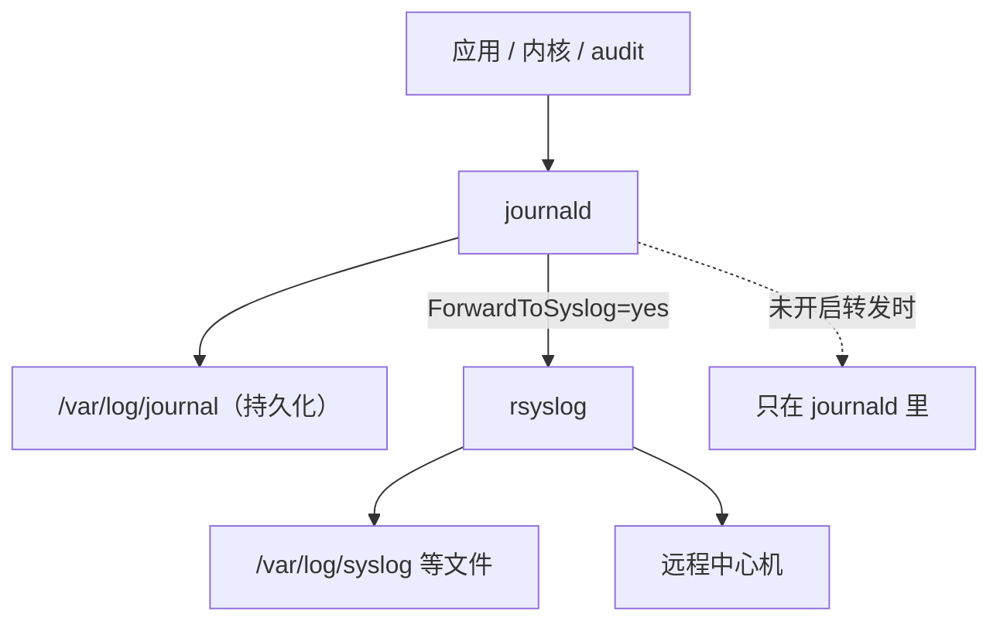
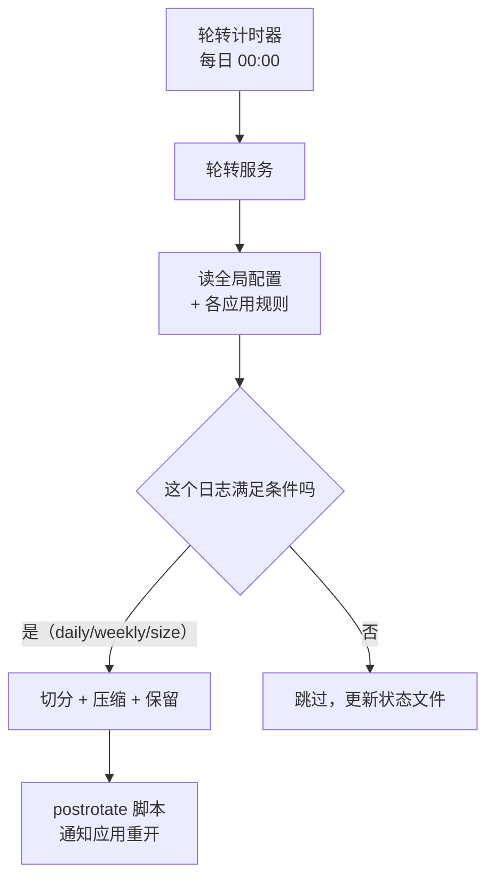

---
tags:
  - Linux
  - 可观测性
  - 日志
  - journald
  - logrotate
  - 体系
created: 2026-10-03
---

# 一条日志的一生

## 一、诞生：往哪写，就决定了后面所有可能性

一条日志的一生从「被写出来」开始。应用在这一刻做出的选择只有三个方向，因此这三个方向决定了它后来能被谁收集、能带上哪些字段、能保留多久。

| 日志的落点 | 由谁收集 | 自动带上了哪些字段 | 后续要自己负责的事 |
| --- | --- | --- | --- |
| 标准输出与标准错误（stdout / stderr） | 它由 systemd 收进 journald | 它自动带上单元、优先级、开机标识与单调时间戳 | 收集端必须自己配置持久化与容量，否则日志重启即丢 |
| 应用自有的日志文件 | 它由应用自己写，轮转工具与采集端随后处理 | 它没有自动生成的字段，因此采集端只能解析正文来得到结构化字段 | 应用方与运维方要负责轮转、压缩、保留与写入超出空间的风险 |
| syslog 套接字 | 它同时被 journald 与 rsyslog 两条通道收到 | 它自带 facility（设施）与 severity（严重程度）字段，并带上来源标识 | 运维方要负责转发配置的语义，因为它决定这些消息往哪里去 |

判断一个服务走哪条路，读它的落点属性即可；而判断一条具体消息是从哪条路进来的，则要看 journald 的字段：

| 字段 | 含义 | 用途 |
| --- | --- | --- |
| `_TRANSPORT` | 它记录这条消息是从哪个通道进来的，取值有 `stdout`、`syslog`、`kernel`、`audit` 等 | 它用来区分「谁写的」与「怎么进来的」这两件事 |
| `_SYSTEMD_UNIT` / `_SYSTEMD_USER_UNIT` | 它们记录这条消息属于哪个系统单元或用户单元 | 它用来按单元过滤日志 |
| `SYSLOG_IDENTIFIER` | 它记录来源标识，也就是程序名或 `-t` 指定的标签 | 它用来按标识过滤日志；同时要注意同一个标识可能来自不同通道 |
| `PRIORITY` | 它记录 syslog 的严重程度，取值 0–7 且数字越小越严重 | 它用来按级别过滤日志 |
| `_PID` / `_UID` / `_GID` | 它们分别记录发送这条消息的进程号、用户号与组号 | 它们用来判断「是谁在写这条日志」 |
| `_BOOT_ID` | 它记录本次开机的唯一标识 | 它用来区分这条消息属于这次开机还是上次开机 |
| `__REALTIME_TIMESTAMP` / `__MONOTONIC_TIMESTAMP` | 它们分别是墙上时钟与单调时钟，单位都是微秒 | 墙上时钟用来跨机器对齐时间，单调时钟用来在同一次开机内排序 |
| `MESSAGE` | 它记录日志的正文 | 正文里写的 JSON 不会自动变成可查询的字段，因此要按字段查询就得另行解析 |

`_TRANSPORT` 是最能说明问题的一个字段：同一个 `SYSLOG_IDENTIFIER` 的消息可能来自 `syslog`，也可能来自 `stdout`——**身份相同而通道不同，因此后续能查到的字段与转发行为也不同**。

## 二、日志的落点：journald 与 rsyslog 不是二选一

日志被写出来之后的第一个岔路是「到底落在哪」。常见的误解是「要么 journald、要么 rsyslog」，而实际默认配置下**通常是两边都有**：因为 journald 收到消息后可以再转发一份给 rsyslog，而 rsyslog 负责把它落到文件、并负责远程转发。



两边的能力互补，因此「都留着」是有理由的：

| 维度 | journald | rsyslog（或采集端） |
| --- | --- | --- |
| 数据结构 | 它把每条消息写成结构化字段 | 它默认把一条消息写成纯文本的一行，而模板可以把它定制成其它形态 |
| 查询 | 它支持按单元、开机标识、优先级与任意字段过滤 | 它只支持文本搜索，或者把检索交给集中式平台 |
| 保留 | 它由自身的容量上限与服务端配置控制保留量 | 它由轮转规则控制保留量 |
| 远程传输 | 它本身不负责远程传输 | 它天生负责远程传输，并支持 UDP、TCP、RELP 与 TLS |
| 强项 | 它擅长本机排障与按字段精确定位 | 它擅长长期留存、集中检索与跨机转发 |

### 2.1 「配置里写的」不是「生效的」

journald 的配置项（`Storage=`、`SystemMaxUse=`、`ForwardToSyslog=` 等）**不是 systemd 的单元属性**，所以查单元属性的命令读不到它们，结果是返回空值而退出码仍然是 0；由于这个表象，人极易误认为「默认值就是这样」。

生效值要从「把所有来源合并之后的配置」里读。之所以必须合并，是因为**发行版可以用追加片段覆盖上游默认值**：当一个被注释掉的 `#ForwardToSyslog=no` 与一个未被注释的 `ForwardToSyslog=yes` 同时出现在合并输出里时，生效的是后者。**因此只读某一个文件、或者只读注释行，都会得到与事实相反的结论。**

### 2.2 持久化：日志写磁盘还是写内存

| `Storage=` 取值 | 它的落点 | 它在重启之后的表现 |
| --- | --- | --- |
| `volatile` | 它只写在内存文件系统（`/run/log/journal`）里 | 日志会丢失 |
| `persistent` | 它写在 `/var/log/journal` 里 | 日志会保留 |
| `auto`（默认） | 该目录存在时它持久化，否则它写进内存 | **它取决于该目录是否存在** |
| `none` | 它不落盘，收到的消息被丢弃 | 日志不保存 |

`auto` 的语义是这条链上最容易「静默失效」的一处：**因为容器、精简镜像与临时实例上经常没有那个目录，所以日志退化成内存存储，重启即丢，而且没有任何报错。** 判据是看那个目录是否存在，以及查询工具的容量输出是否指向磁盘路径。

Journal 文件本身还有 `ARCHIVED`（已封存）与 active（正在写）之分。这个区分后面有用：**按容量回收只能作用于已封存的文件**，因此把上限设得再小，也不会让正在写的那个文件立刻缩下去。

### 2.3 容量与限流：两个必须确认的旋钮

| 配置项 | 默认行为 | 为什么必须确认 |
| --- | --- | --- |
| `SystemMaxUse=` | 该项为空时，journal 最多占所在文件系统的 10%，并且上限是 4 GiB | 因为小盘上这个比例可能过大，而大盘上又可能不够，所以要确认 |
| `SystemKeepFree=` | 该项为空时，journal 至少留 15% 空闲空间 | 它与上一条共同决定真实上限，所以要确认 |
| `MaxRetentionSec=` | 该项为空时，journal 不按时间删，只按容量删 | 因为合规要求「留 30 天」时必须显式设置这一项，所以要确认 |
| `RateLimitIntervalSec=` / `RateLimitBurst=` | 它们的默认值分别是 `30s` 与 `10000` | 因为高频日志会被丢弃，而查询时会显示 `Suppressed N messages`，所以要确认 |
| `MaxFileSec=` | 它的默认值是 `1month` | 因为文件按月切分，所以它决定封存粒度 |

两个判据要记住：

- **容量上限是一个「比例」，不是一个「绝对量」。** 同一个默认值在 48 GiB 的根分区上意味着数 GiB，而在小盘上可能瞬间被占满。因此判断「够不够」要拿绝对值去算。
- **被限流丢弃的消息不会报错**，它只在查询时留下 `Suppressed N messages` 这一行。一旦看到它，就说明有些日志你从来没看到过——**因此在排查「日志不全」时，这一行比日志内容本身更重要。**

## 三、轮转：切开之后谁还在写

日志文件长到一定程度必须被切开，否则它会一直长到写满。负责这件事的是一个**不是常驻进程**的工具：它由定时任务每天触发一次，读一组规则，按条件决定哪些日志该切。



### 3.1 两种切法的本质差别

| 切法 | inode（文件系统对象的编号，文件名只是指向它的一个入口） | 写入方是否察觉 | 数据落点 | 代价 |
| --- | --- | --- | --- | --- |
| 复制再截断（`copytruncate`） | 它不改变，因为写入方始终写同一个 inode | 写入方不察觉，因为它继续写同名文件 | 截断之前的内容进入归档文件 | 由于复制与截断之间存在时间差，这个窗口内的日志会丢；同时复制大文件要占用额外的 IO |
| 换新文件（`create`）之后再通知应用重开 | 它发生改变，因为新文件对应新的 inode | 这取决于是否通知应用重开 | 若应用没有重开，则新写入的数据全部进入归档文件 | 必须真的让应用重开文件，否则新文件永远是空的 |

第二种切法的失败形态是生产事故的典型：**新日志文件一直是空的，而旧归档文件却持续增长。** 它的成因很明确，因为写入方持有的是文件描述符（fd），而 fd 指向的是 inode、不是文件名。改名与新建文件只改变了「名字指向哪个 inode」，所以持有旧 fd 的进程完全察觉不到这件事，它继续往旧 inode 写，也就是继续往归档文件里写。

由此得到判断一份轮转配置是否合格的**唯一标准**：**`postrotate` 里有没有让写日志的进程重新打开文件。** 若做不到这一点，就必须退回复制再截断，并接受丢日志的代价。

发行版自己的做法值得照抄结构：它在 `postrotate` 里对服务发一个约定的重载信号，并且用「一组日志只跑一次脚本」避免重复发信号，同时用「延后一轮再压缩」给还没重开文件的进程留出一轮时间。

### 3.2 「该轮转却没轮转」的判据链

这是整条链上最容易产生错误因果的一处，因此值得把判据按顺序列清楚：

| 层 | 看什么 | 说明什么 |
| --- | --- | --- |
| 计时器层 | 它的判据是定时器的下次触发时间与上次触发时间 | 它说明计时器本身是否活着 |
| **服务层** | 它的判据是服务的执行开始时间戳与这条服务自己的日志条目 | **它说明服务是否真的被拉起来过，而这一步最容易被漏掉** |
| 条件层 | 它的判据是用分析工具直接验证那条条件本身 | 它说明条件成立与否，而不是「看起来像」 |
| 产物层 | 它的判据是状态文件是否更新、归档文件是否出现 | 它说明轮转是否真的产生了结果 |

由此得到两条反直觉的判据：

- **计时器的「上次触发时间」有值，不等于轮转发生过。** 因为那个时间可能来自持久化记录，而服务在本次开机内根本没被执行过。**所以只看到这一层就会得到「一切正常」的错误结论。**
- **条件的「结果」字段显示 `no`，不等于条件失败。** 因为它不区分「求值失败」与「从未求值」；若要区分这两种情况，就要看条件的求值时间戳是否为零——**零表示这个条件一次都没被求值过**，此时的 `no` 只是默认值。

配套的一条纪律是：排查时不要用「强制执行」反复试探。因为强制轮转会消耗一份保留额度，所以在保留份数少的生产日志上反复执行等于提前删掉历史；同时它会把状态文件更新成「刚轮过」，因此之后真实的定时轮转会因此推迟。**排查时该用的只有「只打印计划」的那一档**（注意它的输出走标准错误）。

## 四、集中：把日志送出去

日志在本机活了一段之后，通常还要离开本机。这一步涉及三件事：报文长什么样、用什么方式传输、接收端怎么接住。

### 4.1 报文的字段结构

新格式的 syslog 报文不是「一段文本」，因为它由固定字段组成：

```text
<PRI>版本 时间戳 主机名 应用名 进程号 消息ID 结构化数据 消息体
```

| 字段 | 含义 | 注意 |
| --- | --- | --- |
| `PRI` | 它由 facility 乘以 8 再加上 severity 得到 | 因此一个数同时编码「谁产生的」与「多严重」这两件事 |
| 版本 | 它是协议版本号 | 旧格式的报文没有这一段 |
| 时间戳 | 它带上时区偏移 | 因此它是把多台机器的日志对齐到同一条时间轴的前提 |
| 主机名 | 它记录发送方的主机名 | 它与报文里字段携带的主机名不重复 |
| 应用名 / 进程号 / 消息ID | 它们构成来源三元组，未设置时写成 `-` | 因为集中之后来源很多，所以要按它们切分来源 |
| 结构化数据 | 它是键值对，例如时间同步质量 | **它不是给人看的装饰，而是可判定的元数据** |
| 消息体 | 它是日志正文 | UDP 报文里没有换行符，而 TCP 报文里有 |

**UDP 与 TCP 在报文层就有一个实务差异**：因为 UDP 的一条报文就是一个消息、没有分隔符，所以接收端只能靠「一包一条」来切分；而 TCP 是字节流，所以接收端靠换行分帧。

### 4.2 传输方式的取舍

| 方式 | 可靠性 | 加密 | 适用 |
| --- | --- | --- | --- |
| UDP（User Datagram Protocol，用户数据报协议） | 它会丢包，例如拥塞或接收队列满时，**而且发送端对此没有感知** | 它不提供加密 | 它适合同机房、量大、丢一点可以接受的场景 |
| TCP（Transmission Control Protocol，传输控制协议） | 它有连接与重传，但有队头阻塞与重连成本 | 它本身不提供加密 | 它适合同机房且要求不丢的场景 |
| RELP（Reliable Event Logging Protocol，可靠事件日志协议） | 它做应用层确认，因此断线之后可以续传 | 它把加密作为可选项 | 它适合要求不丢且链路不稳定的场景 |
| syslog over TLS（Transport Layer Security，传输层安全） | 它依赖 TCP 提供可靠性 | 它提供加密 | 它适合跨公网、跨机房与有合规要求的场景 |
| 采集端走 HTTP/TLS | 它依赖 HTTP 的重试机制 | 它提供加密 | 它适合需要解析、过滤与多路输出的场景 |

UDP 的「丢」是最需要被具体化的一条：**若向一个没有任何进程监听的端口发一条 UDP 消息，则发送端会正常返回成功**；而同样的情况换 TCP，发送端当场报错。也就是说，UDP 的丢包**在发送端完全不可观测**，因此只有在接收端做「发送计数与接收计数」的比对，或者干脆改走 TCP/TLS，才能发现丢了消息。由于这一点，审计与合规类日志走 UDP 是明确的隐患。

### 4.3 集中之后新增的风险

| 风险 | 表现 | 对策 |
| --- | --- | --- |
| 中心机容量 | 因为一台中心机要接几十上百台机器的日志，所以它的增长是叠加的 | 中心机自己也要有轮转、保留与容量告警 |
| 单点故障 | 中心机一旦挂掉，发送端就可能积压或者丢弃日志 | 发送端要配磁盘队列，接收端要做冗余 |
| 时间不统一 | 因为各机器的时钟不同，所以集中之后时间线更乱 | 先做时间基线，再用报文里的同步质量字段筛掉不可信来源 |
| 网络抖动丢日志 | 因为 UDP 会静默丢包，所以接收端看不出少了哪些消息 | 关键日志改走 TCP/TLS 或 RELP，同时接收端要做计数比对 |
| 权限与合规 | 因为日志集中之后可见面变大，所以泄露面也变大 | 采集端要脱敏，并把访问控制与留存策略写进方案 |

**集中不是消除风险，而是把风险换了个地方。** 因为发送端通常仍然落盘（本地缓冲、转发队列、本机 journal），接收端也落盘，所以两端都要算容量。

## 五、退役：删掉、回收，以及空间为什么不释放

日志这条线的终点是容量，因此这一节要算清三件事：日志占多少、什么时候删、删的时候会不会出问题。

### 5.1 「磁盘满了」要先分四类

四种情形的现象相同，而处置完全不同，因此第一步是分类型：

| 类型 | 判据 | 处理方向 |
| --- | --- | --- |
| 真占空间的文件 | 它们的判据是 `df -B1` 的已用字节数高，而且按目录统计能找到大文件 | 处理方向是调整保留策略、压缩、分盘，并先清理最老的可删数据 |
| 已删除但仍被持有 | 它们的判据是 `df -B1` 的已用字节数高，而按目录统计找不到对应文件，且 fd 列表里有 `(deleted)` 标记 | 处理方向是让持有者重开文件或重启，因为继续删没有任何效果 |
| inode 用满 | 它的判据是 `df -i` 的 inode 计数高，而 `df -B1` 的已用字节数不高 | 处理方向是找出海量小文件，也就是治「谁在写」，而不是删大文件 |
| 保留块 / 挂载覆盖 | 它的判据是 `df -B1` 给出的已用字节数与可用字节数之和小于总量，或者挂载点遮住了下层目录 | 处理方向是查 ext4 的保留块配置与挂载点 |

### 5.2 inode 计数与空间计数是两套独立的计数

`df -B1` 统计的已用字节数与 `df -i` 统计的 inode 计数是两套独立的计数。一个小文件系统上可以出现「空间几乎没用，却再也建不了文件」的状态：因为 inode 计数达到上限之后，新建文件直接失败，而 `df -B1` 仍显示空间只用了 1%。

这件事的排障含义很直接：**看到写入失败时，`df -B1` 的空间计数与 `df -i` 的 inode 计数都要看。** 因为只查空间用量，就会在 inode 用尽的情况下找不到原因。

### 5.3 「删了但空间没释放」的机制

这是在文件系统层解耦的结果，因此值得把机制讲透：

- **文件名只是目录里的一条映射**，它指向一个 inode；
- **进程打开文件之后持有的是 fd，而 fd 指向 inode、不指向文件名**；
- 删除操作去掉的只是目录里那条映射。**因此只要还有进程持有这个 inode，它的数据块就不会被回收**，此时文件处于「没有名字，但仍然存在」的状态。

这解释了三个现象，而它们各自都是一个判据：

1. **`df -B1` 的已用字节数把它算进去，`du` 的可见文件总量却看不到它。** 两者的差值就是这个已删除但仍被打开的 inode（`lsof +L1` 里带 `(deleted)` 的那些）的大小。
2. **fd 列表里会显示 `(deleted)` 标记**，因此它是找到持有者的直接入口。
3. **继续删没有任何用**；唯一有效的处置是让持有者关闭 fd（重开日志、重载或重启服务），而**不要直接强杀业务进程**。

同类现象还有两个容易混淆的邻居：**保留块**是给 root 预留的比例，它表现为「`df -B1` 显示空间快满了，root 还能写，而普通用户已经写不进去」；**挂载覆盖**是挂载点遮住了下层目录，因此 `du` 的可见文件总量比实际占用小。三者的共同点是都让 `df -B1` 的计数与 `du` 的计数对不上，区别在于判据不同。

### 5.4 回收只能立即缓解容量，不能降低产生速率

按容量或时间回收 journal 确实有效，但它的**代价是不可逆的**，因为删掉的历史日志不会回来。同时它只作用于已封存的文件、只管 journal 的占用（`journalctl --disk-usage` 读到的量），而 rsyslog 落的 `/var/log/*.log` 由轮转工具管，因此这两项占用要分别算。

所以处置顺序固定为三段：

1. **立即缓解（分钟级）**：确认不是业务数据之后，清理最老、最没价值的部分，或者让日志立刻轮转一次；对持有已删除文件的进程，让它重开日志而不是强杀。强制轮转本身属于改变状态类动作，因此只在可快照的实验机上做，生产上优先让写入方重开日志。
2. **消除产生原因（小时级）**：把下表的三层保留策略配齐，并且把日志目录与业务数据分盘。
3. **补充告警与巡检（天级）**：给日志目录配容量告警，把轮转与清理任务的执行结果纳入监控，并定期在实验机上用一份可丢弃的日志目录演练一次容量恢复：先把它写满，再用 `du` 与 `lsof +L1` 定位占用，最后按定位结果恢复。

### 5.5 三层保留策略

| 层 | 管什么 | 手段 | 缺了这一层会怎样 |
| --- | --- | --- | --- |
| 应用层 | 它管日志的**产生速率** | 它的手段是按日志级别输出，并且生产环境不开 debug | 若缺这一层，则一天可能写几百 GiB，因为后两层怎么配都救不回来 |
| 收集层 | 它管**系统日志总量** | 它的手段是配置容量上限、预留空闲与按时间保留 | 若缺这一层，则默认按「所在文件系统的 10%」控制，因此这个量可能过大或者不够 |
| 文件层 | 它管**自建日志文件的份数与压缩** | 它的手段是配置保留份数、大小或时间条件与压缩 | 若缺这一层，则归档文件会无限增长 |

**三层缺一不可**，而且顺序有意义，因为应用层决定了后两层要处理多少量。

## 六、四个跨阶段的核对对象

日志的五个阶段（诞生、落点、轮转、集中、退役）串起来之后，有四个核对对象各自覆盖其中多个阶段，因此它们是现场判断时最先要核对的内容。下表逐条写明每个对象贯穿哪几个阶段，以及每一处读什么字段。

| 核对对象 | 它贯穿哪几个阶段 | 每一处读什么字段 |
| --- | --- | --- |
| 取用顺序 | 它贯穿全部五个阶段，因为从日志产生到归档的每一处都要先确认「先看哪个字段、再看哪个字段」 | 在诞生阶段读 journald 的 `_TRANSPORT`，用它决定这条消息的通道；在落点阶段读 `systemd-analyze cat-config systemd/journald.conf` 合并之后的 `Storage=`，用它决定日志写到哪；在轮转阶段读轮转的规则顺序与 `postrotate`，用它确认写入方是否被通知；在集中阶段读报文里的 `PRI` 与来源三元组（应用名、进程号、消息ID），用它切分来源；在退役阶段读 `df -B1`、`du` 与 `lsof +L1`，按这个顺序定位占用 |
| 统计口径 | 它贯穿诞生、落点、轮转与集中四个阶段，因为同一批日志在不同阶段会被归到不同的计数里 | 在诞生阶段读 `PRIORITY`，用它确定日志按级别过滤之后的条数口径；在落点阶段读 `journalctl --disk-usage` 的占用，用它确定 journal 的容量口径；在轮转阶段读状态文件与归档文件，用它确定轮转之后条数与文件数的对应关系；在集中阶段读发送计数与接收计数，用它判断两端条数是否一致，因为这两个口径的差值就是 UDP 丢掉的条数 |
| 成本与容量 | 它贯穿全部五个阶段，因为产生速率、容量上限与归档份数各自决定其中一段 | 在诞生阶段读应用输出的级别配置与单条消息的大小，用它估算产生速率；在落点阶段读 `SystemMaxUse=`、`SystemKeepFree=` 与 `MaxRetentionSec=` 的生效值，因为 `SystemMaxUse=` 为空时行为是所在文件系统的 10%、上限 4 GiB；在轮转阶段读保留份数与压缩设置，用它决定归档占多少；在集中阶段读发送端队列与接收端的增长，因为两端的增长是叠加的；在退役阶段读 `df -B1` 的已用字节数、`journalctl --disk-usage` 的占用与告警阈值，用它判断还剩多少余量 |
| 时间基线 | 它贯穿落点、轮转、集中与退役四个阶段，因为时间戳的可比性决定了多来源证据能否放在同一条轴上 | 在落点阶段读 `__REALTIME_TIMESTAMP` 与 `__MONOTONIC_TIMESTAMP`，因为这两个时钟的可比范围不同；在轮转阶段读归档文件的名字所带的时间与状态文件里的时间记录，用它判断归档属于哪一轮；在集中阶段读报文里的时间戳与它的时区偏移、以及结构化数据里的时间同步质量，用它筛掉不可信来源；在退役阶段读日志文件的保留期限与它覆盖的时间范围，用它决定哪些历史可以删 |

在这四个核对对象之外，还有一条贯穿整条链的纪律：**采集与轮转本身也要可观测**。因为如果不知道日志有没有落盘、有没有被限流丢、轮转有没有真的执行、容量上限是多少，那么故障时你就会先怀疑数据本身，而这条排查路径最浪费时间。所以采集端与轮转任务本身也要有指标、有告警、有巡检记录。

## 常见坑

| 常见做法或说法 | 后果或事实 |
| --- | --- |
| 「日志肯定在 `/var/log/syslog` 里」 | 因为写 stdout 的现代服务与容器可能只把日志送进 journald，所以判断落点要先看该服务的落点属性 |
| 「配置文件里写着注释掉的开关，所以没开」 | 那只是被注释掉的默认值，而发行版可能用追加片段把它覆盖成 `yes`，因此要读合并之后的生效值 |
| 用查单元属性的命令去读收集端配置 | 因为那些是配置文件项而不是单元属性，所以这个命令会返回空值，而它的退出码仍然是 0 |
| 「日志重启就没了是我的错觉」 | 这多半是持久化目录不存在，因为默认策略在这种情况下退化成内存存储 |
| 「journal 会自己控制大小，不用管」 | 因为默认上限是所在文件系统的 10%，所以它在小盘上可能过大、在大盘上可能不够 |
| 「查询里没有就是应用的错」 | 这时要先确认落点（日志写到哪里）、持久化（有没有存下来）与限流（有没有被丢）三件事 |
| 「加了轮转配置就没事了」 | 因为配置写了不等于生效，所以要确认规则被读到、条件是否满足，以及 `postrotate` 是否真的让应用重开 |
| 「计时器上次触发时间有值，说明在正常跑」 | 因为那个值可能来自持久化记录，所以服务在本次开机内可能根本没有被执行过 |
| 「条件结果显示 `no`，说明被条件挡了」 | 因为这个字段不区分「求值失败」与「从未求值」，所以判据是条件的求值时间戳是否为零 |
| 「`create` 之后应用会自动跟着写新文件」 | 应用不会自动跟随，因为持有 fd 的进程继续写旧 inode，也就是继续写归档文件 |
| 「轮转没生效，多跑几次强制轮转看看」 | 因为强制轮转会消耗保留额度并打断时间语义，所以排查时要用只打印计划的那一档 |
| 「用 UDP 更简单，日志丢了也不重要」 | 因为 UDP 丢包在发送端完全不可观测，所以审计与合规类日志不能走 UDP |
| 「`rm` 掉大日志就有空间了」 | 因为进程还持有 fd 时空间不会释放，所以必须让它重开文件或重启 |
| 「按目录统计找不到大文件，所以没满」 | 因为走目录树的统计看不到已删除但仍被持有的 inode，所以这两者的差值就是线索 |
| 「空间统计没满就不用管」 | 因为还有 `df -i` 的 inode 计数，所以在 inode 用尽时空间可能只用了 1% 却建不了文件 |
| 「回收命令是安全的清理」 | 它删掉的是历史，而且不可恢复，同时它只管 journal 的 `journalctl --disk-usage` 这一项占用 |
| 「删之前先清干净再说」 | 因为删掉最近一段就丢掉了复盘证据，所以要保留「最近一段加上最大贡献者」 |
| 「分盘太麻烦，先把日志塞在根分区」 | 因为日志把根分区写满会让整机故障（收集端、远程登录与审计都写不进去），所以这个代价远高于分区 |
| 「日志集中了本机就不用配保留」 | 因为发送端仍有本地缓冲与 journal、接收端也落盘，所以两端都要有容量策略 |

## 要点自测

**问：同一条日志为什么可能两个地方都有？怎么确认？**
答：因为收集端被配置成把收到的消息再转发给传统 syslog 守护进程，所以 journald 与 rsyslog 两边都会留下它。确认方式是读「合并所有来源之后的生效配置」，而不是读某一个文件里的注释行，因为发行版常用追加片段覆盖上游默认值，所以只看单文件会得到相反的结论。

**问：怎么判断 journal 是写磁盘还是写内存？**
答：`Storage=auto` 的策略是「目录存在就持久化，否则进内存」。因此判据是持久化目录是否存在，以及 `journalctl --disk-usage` 给出的容量与文件头里的路径是否指向磁盘。容器与精简镜像上这条最常静默失效。

**问：轮转之后新日志文件为什么是空的？**
答：因为换新文件的切法改变了名字对应的 inode，而写入方持有的是指向旧 inode 的 fd，所以它察觉不到这个变化，继续把数据写进已被改名的归档文件。修法是让写入方重开文件（发约定的重载信号，或者调用应用自己的接口）；若做不到这一点，就退回复制再截断，并接受丢日志窗口。

**问：怎么判断一次「该轮转却没轮转」？**
答：这要分层判断。第一层是计时器是否活着，判据是它的下次与上次触发时间；第二层是**服务是否真的被执行过**，判据是执行开始时间戳与它自己的日志；第三层是条件是否成立，判据是用分析工具直接验证，而不是看那个不区分「未求值」的结果字段；第四层是产物是否出现，判据是状态文件与归档文件。因为只查第一层会得出「一切正常」的错误结论，所以这四层要按顺序走完。

**问：删除一个大日志之后 `df` 没降，为什么？**
答：因为删除只去掉了目录里的名字映射，而进程持有的 fd 指向 inode，所以只要还有持有者，数据块就不会被回收。判据是 `df -B1` 的已用字节数高而 `du` 的可见文件总量找不到对应文件，以及 fd 列表里的 `(deleted)` 标记；处置是让持有者关闭 fd，而不是继续删或者强杀进程。

**问：三层保留策略分别管什么？为什么缺一层都不行？**
答：应用层管日志的产生速率，收集层管系统日志总量，文件层管自建日志文件的份数与压缩。若缺应用层，则后两层裁不赢产生速度；若缺收集层，则默认按所在文件系统的 10% 控制，而这个比例可能不合预期；若缺文件层，则归档文件会无限增长。

**第一反应不要做什么**：不要因为「计时器上次触发时间有值」就认为轮转正常，因为那个值可能只说明计时器活着；不要因为条件的结果字段显示 `no` 就编出「被条件跳过」的因果，因为它同样表示「从未求值」；不要在业务正在排障的生产日志上反复强制轮转，因为那会消耗保留额度；不要用 `rm` 解决空间问题，因为持有 fd 的进程不会因此释放数据块；不要把 inode 用尽当成空间用尽，因为这两项是不同的计数；不要以为日志集中之后容量风险就消失了，因为两端仍然都在落盘。

## 参考文档

- `man 1 journalctl`、`man 5 journald.conf`：字段、`Storage=`/`SystemMaxUse=`/`SystemKeepFree=`/`MaxRetentionSec=` 的默认值与语义。
- `man 1 systemd-analyze`：`cat-config`（合并所有来源的生效配置）、`condition`（独立验证条件）。
- `man 8 logrotate`、`man 5 logrotate.conf`：状态文件、`copytruncate` 与 `create` 的差别、`postrotate`/`sharedscripts`/`delaycompress` 的语义。
- `man 5 rsyslog.conf`、`man 1 logger`、RFC 5424：转发动作语法与报文结构。
- `man 5 proc_pid_pressure`、`man 1 df`、`man 1 du`、`man 1 lsof`、`man 8 mke2fs`（`-m` 保留块）：容量与「删了不释放」的判据来源。
- `man 1 sar`、`man 1 sadc`、`man 1 sadf`、`man 5 sysstat`：本机自带的历史采样、保留期与导出格式。
- 发行版官方文档：Ubuntu Server Guide 的「Journal and log files」；RHEL 9 的「Configuring logging」。两系在转发配置与日志文件路径上有差异，按目标机器取。
