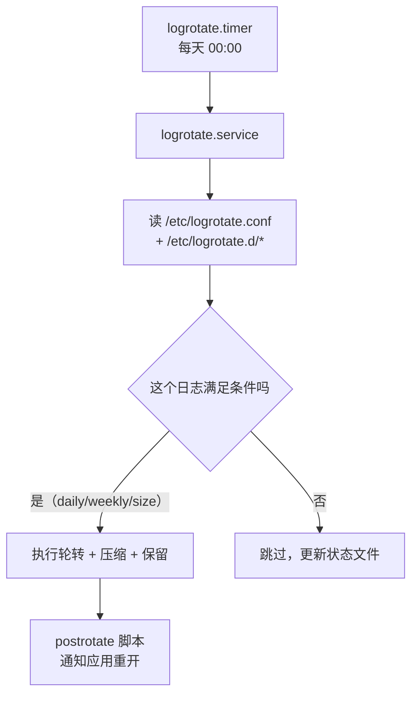

---
tags:
  - Linux
  - 可观测性
  - 日志
  - logrotate
created: 2026-09-19
---

# 日志的轮转：logrotate 的两种切法

> [!cite] 参考资料
> `man 8 logrotate`、`man 5 logrotate.conf`、`man 5 logrotate.d`、发行版自带的 `/etc/logrotate.d/rsyslog` 与 `/usr/lib/rsyslog/rsyslog-rotate`。
>
> **实测环境：Ubuntu 24.04.5 LTS（VMware 虚拟机）/ 内核 `6.8.0-139-generic` / systemd 255（`255.4-1ubuntu8.17`）/ root 可用，`logrotate 3.21.0`。** 轮转实验全部在 `/tmp/09a-logrotate/` 这个临时目录里完成，使用自定义 state 文件，**没有触碰 `/etc/logrotate.d/` 里的任何真实配置**（读真实配置只用 `-d`）；`logrotate.timer` 的状态取自 `systemctl list-timers`，实验后 `/tmp/09a-logrotate/` 已删除。
>
> **本机有一个必须写清的现场事实**：`logrotate.timer` 是 `active`、`NEXT` 是次日 `00:00:00 UTC`，但在**本次开机内** `logrotate.service` 没有执行记录（`ExecMainStartTimestamp` 为空、`journalctl -u logrotate.service` 无条目），`/var/lib/logrotate/status` 也不存在。**这不是被条件挡住的**——`ConditionACPower=true` 在本机实测是**成立**的（`systemd-analyze condition` 返回 `succeeded`，`/sys/class/power_supply/ACAD` 为 `type=Mains`、`online=1`），直接原因是**当天的日触发点还没到**。诊断陷阱与判据见第 1.1 节。

> **这篇讲什么**：日志「被切开」这件事的全部机制——谁在触发、按什么条件、切完之后**谁还在写**。后半句才是关键：实测证明 `create` 之后不通知应用，会让新日志文件一直是空的，而数据全落进归档文件。
>
> **必须先读什么**：[[Linux/09_日志与监控/05_日志的落点_journald与rsyslog|05 日志的落点：journald 与 rsyslog]]（先知道日志落在哪个文件，才谈得上切它）。
>
> **读完能回答**：① `logrotate` 由谁触发、状态记在哪？② `copytruncate` 和 `create` + `postrotate` 有什么本质区别？③ 「轮转后新日志为空、旧归档一直长」是怎么产生的、怎么修？④ 排障时为什么不能随手 `logrotate -f`？
>
> 所属：[[Linux/09_日志与监控/00_导读与知识地图|09 日志、监控与可观测性]] 的「一条日志的一生」第 3 站 · 主要练 **S3 轮转配置与磁盘满处置**

## 0. 30 秒速览

> [!abstract] 这一篇只要记住六句话
> - **`logrotate` 不是常驻进程，它由 `logrotate.timer` 每天触发一次。**
>   - 证据：`systemctl list-timers logrotate.timer` 实测 `NEXT` 为次日 `00:00:00 UTC`、`LAST` 为本次开机时间；timer 的 `OnCalendar=daily`、`AccuracySec=1h`、`Persistent=true`。
> - **但「timer 触发过」不等于「轮转真的发生了」。**
>   - 证据：本机在**本次开机内** `ExecMainStartTimestamp` 为空、`journalctl -u logrotate.service` 无条目——服务没有被拉起来过。判据要用**执行时间戳 + journal**，不要用 `ConditionResult`（见第 1.1 节）。
> - **状态文件记录「上次什么时候轮的」，本机实验时没有它。**
>   - 证据：实验当时 `/var/lib/logrotate/` 是**空目录**，`logrotate -d` 明确打印 `state file /var/lib/logrotate/status does not exist`；后来手动执行一次 `systemctl start logrotate.service` 之后它才被创建（`-rw-r----- 954` 字节，mtime `08:40:37`）。旧笔记里「状态文件存在且有 1272 字节」在本机不可复现。
> - **`copytruncate`：inode 不变，写入方毫无察觉。**
>   - 证据：实测 `1310736 → 1310736`；写入方继续往同名文件写，归档里是截断前的内容（37 字节，末行 `tick-3`）。
> - **`create` + `postrotate`：inode 变了，没人通知就等于丢日志。**
>   - 证据：实测新文件 `1310803`、归档 `1310798`，而随后产生的 **9 行数据全部写进归档**、新文件 0 行——因为写日志的进程还持有旧 fd。
> - **`postrotate` 里必须真的让应用重开文件。**
>   - 证据：发行版自己的做法是 `/usr/lib/rsyslog/rsyslog-rotate` → `systemctl kill -s HUP rsyslog.service`；本机该文件存在且内容一致（rsyslog 规则本身是 `rotate 4`/`weekly`/`sharedscripts`/`delaycompress`）。

## 1. 谁在什么时候切



```bash
systemctl list-timers logrotate.timer --no-pager     # 验证：下次何时触发、上次何时触发
systemctl show logrotate.service -p ExecMainStartTimestamp -p Result -p ExecMainStatus   # 验证：服务到底跑没跑
systemctl show logrotate.service -p ConditionResult -p ConditionTimestampMonotonic       # 验证：条件有没有被求值过
grep -vE "^\s*(#|$)" /etc/logrotate.conf             # 验证：全局默认策略
ls /etc/logrotate.d/                                 # 验证：有哪些应用自己的规则
ls -la /var/lib/logrotate/                           # 验证：状态文件是否在
```

本机实测（**手动执行之前**的现场；最后一次手动执行的结果见 1.1 节末）：

```text
$ systemctl list-timers logrotate.timer --no-pager
NEXT                        LEFT LAST                        PASSED UNIT            ACTIVATES
Sun 2026-09-20 00:00:00 UTC  15h Sat 2026-09-19 06:05:24 UTC      - logrotate.timer logrotate.service
$ systemctl show logrotate.service -p ConditionResult -p ConditionTimestampMonotonic -p ExecMainStartTimestamp -p Result
Result=success
ExecMainStartTimestamp=
ConditionResult=no
ConditionTimestampMonotonic=0
$ ls -la /var/lib/logrotate/
total 8
drwxr-xr-x  2 root root 4096 Sep  9 06:45 .
drwxr-xr-x 47 root root 4096 Sep 19 08:00 ..
$ logrotate -d /etc/logrotate.conf 2>&1 | grep -i "state file"
state file /var/lib/logrotate/status does not exist
$ journalctl -u logrotate.service --no-pager
-- No entries --
```

**注意 `ConditionResult=no` 与 `ConditionTimestampMonotonic=0` 是同时出现的**——后者说明这个条件**一次都没被求值过**，`no` 只是未求值时的默认值，**不是「条件失败」**。这一点正是 1.1 节的核心。

### 1.1 现场复盘：「没执行」到底是没发生，还是条件没满足

这是本机最有价值的一个现场，值得单独讲。先把**事实**和**解释**分开。

**事实（都可复现）**：

| 证据 | 本机实测 | 说明什么 |
| --- | --- | --- |
| timer 的 `NEXT` / `LAST` | `NEXT` 次日 00:00、`LAST` 本次开机前的 `06:05:24` | timer 本身是活的；`LAST` 来自持久化 stamp 文件 |
| `ExecMainStartTimestamp` | **空**（手动执行前） | **本次开机内**进程没有被拉起来过 |
| `journalctl -u logrotate.service` | `-- No entries --`（手动执行前） | 现存 journal 里没有任何它执行过的记录 |
| `ConditionResult` | `no`（手动执行前） | ⚠️ **不能当证据用**，见下 |
| `ConditionTimestampMonotonic` | **`0`**（手动执行前） | ✅ **这才是判据**：`0` = 这个条件**一次都没被求值过** |
| `/var/lib/logrotate/status` | 不存在（手动执行前） | 没有「上次轮转时间」可记 |

**为什么「没执行」——先排除条件，再看时间**：

`logrotate.timer` 是 `OnCalendar=daily` + `AccuracySec=1h` + `Persistent=true`，`NEXT` 是**次日 `00:00:00 UTC`**；而本次 systemd 开机时刻（`uptime -s`）是 `2026-09-19 07:08:29`。也就是说**当天的日触发点在本次开机之前就过去了，下一次要等次日 00:00**——「本次开机内没执行」的直接原因是**时间还没到**，**不需要任何条件来解释**。

**条件本身成立吗？成立。** 现场 unit 里只有 `ConditionACPower=true` 这一条条件（无任何 `Assert*`）：

```ini
[Unit]
Description=Rotate log files
RequiresMountsFor=/var/log
ConditionACPower=true

[Service]
Type=oneshot
ExecStart=/usr/sbin/logrotate /etc/logrotate.conf
```

用 `systemd-analyze condition` 可以直接验证单条条件，不需要靠猜：

```bash
systemd-analyze condition 'ConditionACPower=true'                 # 验证：本机这条条件是否成立
systemd-analyze condition 'ConditionPathExists=/nonexistent-xyz'  # 对照：必然失败的条件长什么样
ls /sys/class/power_supply/                                       # 验证：有没有交流电源节点
cat /sys/class/power_supply/ACAD/type /sys/class/power_supply/ACAD/online
```

```text
test.service: ConditionACPower=true succeeded.
Conditions succeeded.
rc=0
--- 对照：故意写一个必然失败的条件 ---
test.service: ConditionPathExists=/nonexistent-xyz failed.
Conditions failed.
rc=1
ACAD
-- /sys/class/power_supply/ACAD
Mains
1
```

`ConditionACPower=true` 的语义是「不在电池供电上才跑」，本意是避免笔记本没插电时批量压缩日志耗电。**这台 VMware 虚拟机确实暴露了一个 `type=Mains`、`online=1` 的交流电源节点，所以条件成立**——用「虚拟机不满足电源条件」去解释「服务没执行」是**错的**。

**把服务手动拉起来，验证它到底能不能跑**：

```bash
systemctl start logrotate.service
systemctl show logrotate.service -p ConditionResult -p ConditionTimestampMonotonic \
  -p AssertResult -p ExecMainStartTimestamp -p ExecMainStatus -p Result
journalctl -u logrotate.service --no-pager | tail -5
```

```text
Result=success
ExecMainStartTimestamp=Sat 2026-09-19 08:40:37 UTC
ExecMainStatus=0
ConditionResult=yes
AssertResult=yes
ConditionTimestampMonotonic=5527820005
Sep 19 08:40:37 linux-lab systemd[1]: Starting logrotate.service - Rotate log files...
Sep 19 08:40:37 linux-lab systemd[1]: logrotate.service: Deactivated successfully.
Sep 19 08:40:37 linux-lab systemd[1]: Finished logrotate.service - Rotate log files.
```

**`ConditionResult=yes`、`AssertResult=yes`、`Result=success`、`ExecMainStatus=0`** —— 条件成立、服务跑通、退出码为 0。执行后 `/var/lib/logrotate/status` 才被创建（`-rw-r----- 954` 字节，mtime `08:40:37`）。**所以「状态文件不存在」不是故障，只是「还没轮过」的必然结果。**

> [!important] 这一节真正要带走的判据
> **`ConditionResult=no` 不能当作「条件失败」的证据。** 它不区分两种情况：**求值失败** 与 **从未求值**。要区分，看 **`ConditionTimestampMonotonic`**：`0` 表示该条件一次都没被求值过（此时 `ConditionResult=no` 只是默认值）。
>
> 判断一个 systemd timer 有没有真正驱动它的服务，用这三样：
>
> 1. `systemctl list-timers <timer>` 的 `NEXT`/`LAST`（timer 层面）；
> 2. `systemctl show <service> -p ExecMainStartTimestamp -p Result -p ExecMainStatus` + **`journalctl -u <service>`**（服务是否真的被拉起来过——**这一步最容易被漏掉**）；
> 3. **产物**层面：`/var/lib/logrotate/status` 有没有被更新、`/var/log` 下有没有新的 `.1`/`.gz` 归档。
>
> 如果怀疑是条件挡住了，**不要看 `ConditionResult`**，用 `systemd-analyze condition '<Condition…>'` 直接验证，并配合 `ConditionTimestampMonotonic` 判断它有没有被求值过。
>
> 只看第 1 条会得到「一切正常」的错误结论；只看 `ConditionResult` 则会得到一个**听起来合理但完全错误**的因果。这条纪律也正是本章反复强调的「采集与轮转本身要可观测」（子笔记 01、14）。

> [!warning] 方法论：不要给一个「还没发生」的事实编一个听起来合理的因果
> 本页第一版就犯过这个错：看到「服务没执行 + 有一个 `ConditionACPower=true`」，就推断「虚拟机不满足电源条件、服务被跳过」，还顺手解释了「`ConditionResult` 记录的是启动那一刻的判定」。**真相是：条件一次都没被求值（`ConditionTimestampMonotonic=0`），而没执行只是因为当天的触发点还没到。**
>
> 正确顺序是：① 先确认它到底是**没发生**还是**发生条件未满足**（`ExecMainStartTimestamp` + journal）；② 再**独立验证**那个「条件」（`systemd-analyze condition`）；③ 能量化的一律量化，不能确定的部分**如实写「无法从现有证据判定」**——例如「更早的开机里它有没有跑过」，在 journal 只剩一个 boot 的情况下就**无法判定**，不要补一个故事。

**顺带一个实测结论**：本机**没有第二条备用路径**——`/etc/cron.daily/logrotate` 存在，但它的第 3 行明确写着 `# skip in favour of systemd timer`，发行版已经把 cron 这条路让给了 systemd timer。

## 2. 参数速查

| 参数 | 作用 | 常见误用 |
| --- | --- | --- |
| `daily` / `weekly` / `monthly` / `hourly` | 时间条件 | 与 `size` 同时写时，**满足任一条件**即轮转 |
| `size 100M` | 大小条件 | 高频写入时更适合，但没到大小就一直长 |
| `rotate N` | 保留几份（含正在写的这份之外） | 份数 × 单份大小 = 该日志的真实上限，要算 |
| `compress` / `delaycompress` | 压缩 / 延后一轮再压缩 | 应用还没重开文件时用 `delaycompress` 更稳 |
| `missingok` / `notifempty` | 文件不存在不报错 / 空文件不轮转 | `notifempty` 会让「日志为空的故障」看起来像「轮转没生效」 |
| `create 0640 user group` | 轮转后新建文件并设权限 | **新文件的属主属组必须和应用能写的用户一致**，否则应用写不进去 |
| `copytruncate` | 复制一份再截断原文件 | 有丢日志窗口；大文件复制占额外 IO |
| `postrotate`/`endscript` | 轮转后执行的脚本 | 忘了写，就等于 `create` 之后没人通知应用 |
| `sharedscripts` | 一组日志只跑一次脚本 | 不写会对每个文件各跑一次，可能重复发信号 |

## 3. 两种切法的实测对比（这一篇的核心）

### 3.1 `copytruncate`：inode 不变，写入方毫无察觉

```bash
rm -rf /tmp/09a-logrotate; mkdir -p /tmp/09a-logrotate/logs /tmp/09a-logrotate/etc; cd /tmp/09a-logrotate
printf "%s\n" "/tmp/09a-logrotate/logs/app.log {" "    daily" "    rotate 3" "    compress" "    copytruncate" "}" > etc/app
: > logs/app.log
( exec 3>>logs/app.log; i=0; while [ $i -lt 40 ]; do echo "tick-$i" >&3; i=$((i+1)); sleep 0.25; done ) & W=$!
sleep 1; B=$(stat -c %i logs/app.log)
logrotate -d -s state1 etc/app 2>&1 | head -4     # 验证：debug 模式只打印计划，不动文件
logrotate -f -s state1 etc/app                    # 验证：强制执行一次（独立 state 文件）
echo "inode: $B -> $(stat -c %i logs/app.log)"
ls -l logs; zcat logs/app.log.1.gz | tail -1
kill $W
```

本机实测输出：

```text
warning: logrotate in debug mode does nothing except printing debug messages!
reading config file etc/app
Handling 1 logs
rotating pattern: /tmp/09a-logrotate/logs/app.log  after 1 days (3 rotations)
inode: 1310736 -> 1310736
total 4
-rw-r--r-- 1 root root  0 Sep 19 08:07 app.log
-rw-r--r-- 1 root root 37 Sep 19 08:07 app.log.1.gz
tick-3
```

读法：

- **inode 没变**（`1310736 → 1310736`）：写入方持有的是 fd，fd 指向的还是同一个 inode，所以它**继续往同名文件写，完全感知不到轮转**。
- **归档里只有 37 字节、最后一行是 `tick-3`**：说明归档保存的是「截断那一刻之前」的内容，之后的 tick 继续进了新文件。
- **代价**：复制与截断之间存在窗口，这期间写入的日志会丢；文件很大时复制还会占用额外的磁盘 IO 与空间。

### 3.2 `create` + `postrotate`：inode 换了，没人通知就等于丢日志

```bash
: > logs/app2.log
printf "%s\n" "/tmp/09a-logrotate/logs/app2.log {" "    daily" "    rotate 2" "    create 0640" \
  "    postrotate" "        echo postrotate-fired >> /tmp/09a-logrotate/postrotate.log" "    endscript" "}" > etc/app2
( exec 3>>logs/app2.log; i=0; while [ $i -lt 40 ]; do echo "tick-$i" >&3; i=$((i+1)); sleep 0.25; done ) & W2=$!
sleep 1; logrotate -f -s state2 etc/app2
stat -c "%n inode=%i" logs/app2.log logs/app2.log.1; cat postrotate.log
sleep 1.2; echo "app2.log=$(grep -c tick logs/app2.log) 行 / app2.log.1=$(grep -c tick logs/app2.log.1) 行"
kill $W2
```

本机实测输出：

```text
logs/app2.log inode=1310803
logs/app2.log.1 inode=1310798
postrotate-fired
app2.log=0 行 / app2.log.1=9 行
```

读法：

- **inode 变了**：`app2.log` 是新建的文件（`1310803`），旧内容被改名成 `app2.log.1`（`1310798`）。
- **`postrotate` 确实执行了**（`postrotate-fired` 写进了日志）。
- **但新数据全进了归档**：写入方仍持有旧 fd，它的 9 行输出全部落进了 `app2.log.1`，而 `app2.log` 是 0 行。
- 上面的 `postrotate` 只做了「记录一行」，**没有通知应用重开文件**——这正是生产事故的典型形态：**新日志文件一直是空的，旧归档却在持续增长**。

> [!important] 结论：`create` 是标准做法，但必须配对「让应用重开」
> 判断一个 `logrotate` 配置是否合格，只看一件事：**`postrotate` 里有没有让写日志的进程重新打开文件**。做不到就必须退到 `copytruncate`，并接受丢日志的代价。

发行版自己的例子（本机实测，可以直接抄结构）：

```bash
grep -vE "^[[:space:]]*(#|$)" /etc/logrotate.d/rsyslog
cat /usr/lib/rsyslog/rsyslog-rotate
```

```text
/var/log/syslog
/var/log/mail.log
/var/log/kern.log
/var/log/auth.log
/var/log/user.log
/var/log/cron.log
{
	rotate 4
	weekly
	missingok
	notifempty
	compress
	delaycompress
	sharedscripts
	postrotate
		/usr/lib/rsyslog/rsyslog-rotate
	endscript
}
```

`/usr/lib/rsyslog/rsyslog-rotate` 的内容（这才是「让应用重开文件」的那一步）：

```bash
#!/bin/sh
if [ -d /run/systemd/system ]; then
    systemctl kill -s HUP rsyslog.service
fi
```

三点值得学：`sharedscripts` 让 6 个文件只发一次信号；`delaycompress` 给还没重开文件的进程留了一轮时间；`HUP` 是 rsyslog 约定的「重新打开日志文件」信号。

## 4. 调试与排障：什么时候该用 `-d`、什么时候绝不用 `-f`

| 命令 | 会不会改文件 | 什么时候用 |
| --- | --- | --- |
| `logrotate -d <conf>` | **不会**（debug 模式，实测会明确打印「does nothing except printing debug messages」） | 排查「为什么该轮转却没轮转」的第一步 |
| `logrotate -v -f -s <state> <conf>` | **会**，且强制忽略时间/大小条件 | 只在实验机上验证配置本身是否正确 |
| `logrotate -s <state>` | 视情况 | 指定状态文件，配合自定义 state 做隔离实验 |

> [!warning] 排障时不要随手 `logrotate -f`
> `-f` 会强行轮转一次，**直接把保留额度消耗掉一份**；在保留份数少（比如 `rotate 3`）的生产日志上反复执行，等于提前删掉历史日志。真正要查的时候用 `-d`（只打印计划），必要时用 `-v`（看细节但不强制）。

## 5. 生产动作：给一个自研服务的日志加轮转

这是有明确产出物（一份可评审的轮转配置 + 验证记录）的动作。

> [!example]- 实验 2：写一条 `create` + `postrotate` 的轮转规则并验收
> 目标：让「新日志文件继续增长、归档停止增长」这句话变成可验证的事实。
> ```bash
> rm -rf /tmp/09a-logrotate; mkdir -p /tmp/09a-logrotate/logs /tmp/09a-logrotate/etc; cd /tmp/09a-logrotate
> printf "%s\n" "/tmp/09a-logrotate/logs/app.log {" "    daily" "    rotate 3" "    compress" "    delaycompress" \
>   "    create 0644" "    postrotate" "        echo reopen >> /tmp/09a-logrotate/reopen.log" "    endscript" "}" > etc/app
> : > logs/app.log; echo before-rotate > logs/app.log
> logrotate -d -s /tmp/09a-logrotate/state etc/app 2>&1 | tail -5   # 验证：先看计划（不动文件；注意 -d 的输出走 stderr）
> logrotate -f -s /tmp/09a-logrotate/state etc/app                 # 验证：执行一次（用独立 state 文件）
> ls -l logs; echo "reopen.log: $(cat reopen.log)"                 # 验证：新文件生成、postrotate 执行
> echo after-rotate >> logs/app.log; ls -l logs                     # 验证：新数据进新文件、归档不再增长
> cat logs/app.log; cat logs/app.log.1; cat state                   # 验证：内容各归其位、state 记录了轮转时间
> cd /; rm -rf /tmp/09a-logrotate                                   # 清理
> ```
> 本机实测输出：
> ```text
> --- 先看计划（不动文件）---
> warning: logrotate in debug mode does nothing except printing debug messages!  Consider using verbose mode (-v) instead if this is not what you want.
> reading config file etc/app
> Reading state from file: /tmp/09a-logrotate/state
> state file /tmp/09a-logrotate/state does not exist
> Allocating hash table for state file, size 64 entries
> Handling 1 logs
> rotating pattern: /tmp/09a-logrotate/logs/app.log  after 1 days (3 rotations)
> empty log files are rotated, old logs are removed
> considering log /tmp/09a-logrotate/logs/app.log
> Creating new state
>   Now: 2026-09-19 08:14
>   Last rotated at 2026-09-19 08:00
>   log does not need rotating (log has already been rotated)
> --- 执行一次 ---
> --- 产物 ---
> total 4
> -rw-r--r-- 1 root root  0 Sep 19 08:14 app.log
> -rw-r--r-- 1 root root 14 Sep 19 08:14 app.log.1
> reopen.log: reopen
> total 8
> -rw-r--r-- 1 root root 13 Sep 19 08:14 app.log
> -rw-r--r-- 1 root root 14 Sep 19 08:14 app.log.1
> --- app.log 内容 ---
> after-rotate
> --- app.log.1 内容 ---
> before-rotate
> --- state 文件 ---
> logrotate state -- version 2
> "/tmp/09a-logrotate/logs/app.log" 2026-9-19-8:14:48
> ```
> 三处对照：① `app.log.1` 里是 `before-rotate`（14 字节）、新 `app.log` 里是 `after-rotate`（13 字节），证明**新数据确实进了新文件**；② `reopen.log` 里有 `reopen`，证明 `postrotate` 真的执行了；③ `app.log.1` 是**未压缩**的，因为规则里有 `delaycompress`（延后一轮再压缩）。另外 `logrotate -d` 的输出走的是 **stderr**，所以想用管道过滤必须写 `2>&1`。
> **预期**：`logs/app.log` 是新文件（inode 变化），`app.log.1` 里是 `before-rotate`，`reopen.log` 有 `reopen`，`after-rotate` 落在新文件里。
> **风险**：低（全部在 `/tmp/09a-logrotate/` 的临时目录，使用独立 state 文件，不触碰任何系统日志）。
> **回滚**：`rm -rf /tmp/09a-logrotate` 即可；不涉及系统配置。
> **耗时**：15 分钟。
>
> 环境：Ubuntu 24.04.5（VMware 虚拟机）/ 内核 6.8.0-139-generic / systemd 255 / root，`logrotate 3.21.0`。**生产机上改 `/etc/logrotate.d/` 前先备份原文件，并用 `logrotate -d` 验证配置语法——本实验全程没有改 `/etc/logrotate.d/` 里的任何文件。**

给自研服务的配置骨架（把「重开文件的方式」换成该应用真实支持的信号或命令）：

```ini
/var/log/myapp/app.log {
    daily
    rotate 7
    compress
    delaycompress
    missingok
    notifempty
    create 0640 myapp myapp
    sharedscripts
    postrotate
        systemctl kill -s HUP myapp.service
    endscript
}
```

## 常见坑

| 常见做法或说法 | 后果或事实 |
| --- | --- |
| 「加了 `logrotate` 配置就没事了」 | 配置写了不等于生效：要确认规则被覆盖到、状态文件正常、`postrotate` 真的让应用重开 |
| 「`systemctl list-timers` 里 `LAST` 有值，说明轮转在正常跑」 | **本机就是反例**：timer 的 `LAST` 有值（`06:05:24`），但本次开机内 `ExecMainStartTimestamp` 为空、`journalctl -u logrotate.service` 无条目——服务没被拉起来过。判据要用**执行时间戳 + journal**（+ 产物层面的 state 文件/归档），不是 timer 的 `LAST` |
| 「`ConditionResult=no` 说明条件不满足、服务被跳过了」 | **本页第一版就栽在这里**。`no` 不区分「求值失败」与「**从未求值**」；判据是 **`ConditionTimestampMonotonic`**（本机实测 `0`，即一次都没求值过）。本机的 `ConditionACPower=true` 其实**成立**（`systemd-analyze condition` → succeeded，`ACAD` 为 `Mains`/`online=1`），服务没跑只是因为**当天的触发点还没到** |
| 「虚拟机没有交流电源，所以 `ConditionACPower` 一定失败」 | 本机实测相反：`/sys/class/power_supply/ACAD` 存在且 `type=Mains`、`online=1`，`systemd-analyze condition 'ConditionACPower=true'` 返回 `succeeded`（rc=0）。**别用「虚拟化环境」当万能解释** |
| 「`create` 之后应用会自动跟着写新文件」 | 不会。实测 9 行新数据全落进归档、新文件 0 行 |
| 「用 `copytruncate` 最省事」 | 省事但**会丢日志**（复制与截断之间的写入），大文件还会带来额外 IO 与空间峰值 |
| 「轮转没生效，多跑几次 `-f` 看看」 | `-f` 会消耗保留额度，把历史日志提前挤掉；用 `-d` 看计划（注意 `-d` 写 stderr，过滤要 `2>&1`） |
| 「`notifempty` 无所谓」 | 日志为空时不会轮转，排障时容易被误判成「轮转没生效」 |
| 「状态文件丢了没关系」 | 状态丢失会导致「刚轮过又轮」或按错误时间判断；容器/只读根场景尤其要注意。**本机实验时该文件不存在（因为服务当次开机内还没被触发），手动 `systemctl start logrotate.service` 之后才被创建（954 字节）**——它不存在只是「还没轮过」，不等于故障 |

## 决策练习

**场景**：一个第三方二进制服务把日志写在 `/var/log/legacy/svc.log`，它不响应 `HUP`、也没有任何重开日志的接口。当前配置是 `daily` + `create`，运维发现「归档文件每天都在长，新文件一直是 0 字节」。

**A. 保持 `create`，在 `postrotate` 里加 `systemctl restart legacy.service`**
**B. 改用 `copytruncate`，并在配置注释里写清「该程序不支持重开文件，接受少量丢日志」**
**C. 保持 `create`，什么都不改，反正日志没丢，只是在一个文件里**

**为什么选 B**：问题的根因是「程序无法重开文件」，`copytruncate` 正是为这种程序设计的折中。它保证轮转后写入方继续写新文件，代价是有一个很小的丢日志窗口——**这个代价要显式写在配置里，让后来的人知道这不是疏漏**。

**为什么不选 A**：`restart` 会让服务中断，用一个「可能丢几条日志」的小问题换来一次业务停机，是明显的权衡错误。除非该服务本身允许频繁重启，否则不应该把重启写进轮转钩子。

**为什么不选 C**：看着「没丢数据」其实是**把风险累积成了更大的风险**：归档文件会无上限增长（`rotate` 只对轮转产生的文件生效），最终会把磁盘写满——这正是子笔记 08 的场景来源。

## 要点自测

> [!question]- `copytruncate` 和 `create` + `postrotate` 的本质区别是什么？
> - **`copytruncate`**：复制一份再截断原文件，**inode 不变**（本机实测 `1310736 → 1310736`），写入方无感知继续写；代价是复制与截断之间可能丢日志。
> - **`create` + `postrotate`**：旧文件改名、新建同名文件，**inode 变了**（本机实测 `1310803` vs 归档 `1310798`）；必须通知应用重开，否则新数据全进归档（实测 9 行 vs 0 行）。
> - **怎么选**：应用支持重开（有信号/接口）就用 `create`；不支持就只能 `copytruncate` 并接受代价。
> - **第一反应不要是什么**：不要以为 `create` 之后应用会自动跟着新文件走。

> [!question]- 「轮转该发生却没发生」怎么查？
> - **第一步 `logrotate -d <conf>`**：只打印计划，看它的判断（`log does not need rotating` 就是条件没到）。注意 `-d` 的输出走 **stderr**，要 `2>&1` 才能过滤。
> - **第二步确认服务到底有没有被拉起来**：`systemctl show logrotate.service -p ExecMainStartTimestamp -p Result -p ExecMainStatus` + `journalctl -u logrotate.service`。**本机实测本次开机内 `ExecMainStartTimestamp` 为空、journal 无条目——服务没被拉起来过**；再看 `systemctl list-timers logrotate.timer`：`NEXT` 是次日 00:00，当天只是**还没到点**。
> - **第三步（如果怀疑是条件挡的）验证条件，而不是猜**：`systemd-analyze condition 'ConditionACPower=true'` 直接给出 succeeded/failed。**不要用 `ConditionResult` 判断**——它不区分「求值失败」与「从未求值」，要看 **`ConditionTimestampMonotonic`**（`0` = 从未求值）。本机实测条件 `succeeded`、`/sys/class/power_supply/ACAD` 为 `Mains`/`online=1`，手动 `systemctl start logrotate.service` 得到 `ConditionResult=yes` + `Result=success`。
> - **第四步看状态文件**：路径由 `logrotate -d` 打印（本机是 `/var/lib/logrotate/status`，实验时**不存在**、手动执行后才生成 954 字节）；**它不存在往往只是「还没轮过」**，别直接当成故障；丢失或权限异常才会让判断出错。
> - **第五步看条件语义**：`daily`/`size`/`notifempty`/`missingok` 组合起来可能与直觉不同（空文件不轮转）。
> - **第六步看规则有没有被读进来**：配置文件的属主权限不对（`logrotate` 会忽略不安全权限的规则文件）也是常见原因。
> - **第一反应不要是什么**：不要用 `-f` 反复强制执行，不要只看 timer 的 `LAST`，**也不要看到一个 `ConditionResult=no` 就编出「被条件跳过」的因果**。

> [!question]- 为什么排障时 `logrotate -f` 是危险动作？
> - **因为保留份数是有限的**：`rotate 3` 意味着最多留 3 份历史，每次强制轮转都会挤掉最老的一份（本机 rsyslog 的保留策略实测是 `rotate 4`）。
> - **而且它会打断时间语义**：状态文件被更新成「刚轮过」，之后真实的定时轮转会推迟。
> - **正确做法**：先 `-d` 看计划，再 `-v` 看细节；确需强制执行时，在实验机上用独立 state 文件做（本机实验 2 就是这么做的）。
> - **第一反应不要是什么**：不要在业务正在排障的生产日志上反复 `-f`。

> 上一篇：[[Linux/09_日志与监控/05_日志的落点_journald与rsyslog|05 日志的落点：journald 与 rsyslog]] ｜ 下一篇：[[Linux/09_日志与监控/07_日志的集中_远程syslog与采集器|07 日志的集中：远程 syslog 与采集器]]
