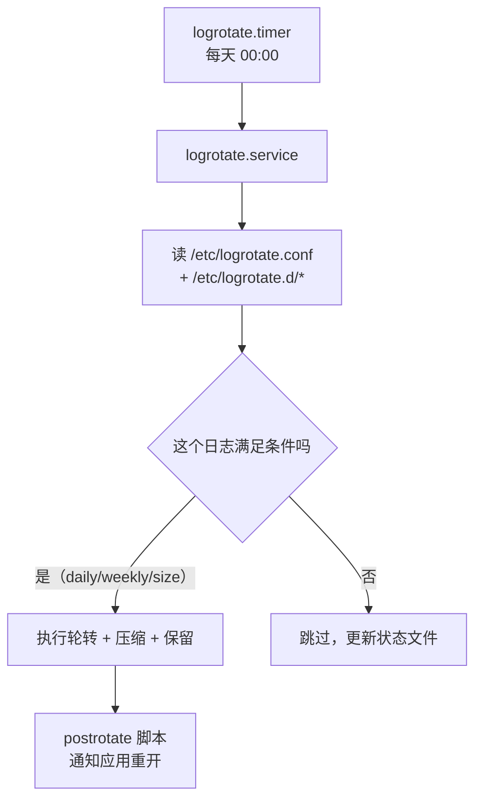

---
tags:
  - Linux
  - 可观测性
  - 日志
  - logrotate
created: 2026-09-19
---

# 日志的轮转：logrotate 的两种切法

> [!cite] 参考资料
> `man 8 logrotate`、`man 5 logrotate.conf`、`man 5 logrotate.d`、发行版自带的 `/etc/logrotate.d/rsyslog` 与 `/usr/lib/rsyslog/rsyslog-rotate`。
>
> 实测输出来自 Ubuntu 24.04.4（WSL2）/ systemd 255 / 非 root：轮转实验全部在 `/tmp` 下的临时目录完成（`mktemp`），使用自定义 state 文件，不触碰系统日志；`logrotate.timer` 的状态取自 `systemctl list-timers`。

> **这篇讲什么**：日志「被切开」这件事的全部机制——谁在触发、按什么条件、切完之后**谁还在写**。后半句才是关键：实测证明 `create` 之后不通知应用，会让新日志文件一直是空的，而数据全落进归档文件。
>
> **必须先读什么**：[[Linux/09_日志与监控/05_日志的落点_journald与rsyslog|05 日志的落点：journald 与 rsyslog]]（先知道日志落在哪个文件，才谈得上切它）。
>
> **读完能回答**：① `logrotate` 由谁触发、状态记在哪？② `copytruncate` 和 `create` + `postrotate` 有什么本质区别？③ 「轮转后新日志为空、旧归档一直长」是怎么产生的、怎么修？④ 排障时为什么不能随手 `logrotate -f`？
>
> 所属：[[Linux/09_日志与监控/00_导读与知识地图|09 日志、监控与可观测性]] 的「一条日志的一生」第 3 站 · 主要练 **S3 轮转配置与磁盘满处置**

## 0. 30 秒速览

> [!abstract] 这一篇只要记住六句话
> - **`logrotate` 不是常驻进程，它由 `logrotate.timer` 每天触发一次。**
>   - 证据：`systemctl list-timers logrotate.timer` 实测 next 为次日 `00:00:00`、last 为上一次真实执行时间；配置在 `/etc/logrotate.d/` 与 `/etc/logrotate.conf`。
> - **状态文件记录「上次什么时候轮的」，它丢了判断就靠不住。**
>   - 证据：本机 `/var/lib/logrotate/status` 存在且有内容（1272 字节）。
> - **`copytruncate`：inode 不变，写入方毫无察觉。**
>   - 证据：实测 `11780 → 11780`；写入方继续往同名文件写，归档里是截断前的内容（39 字节）。
> - **`create` + `postrotate`：inode 变了，没人通知就等于丢日志。**
>   - 证据：实测新文件 `250840`、归档 `12073`，而随后产生的 **9 行数据全部写进归档**、新文件 0 行——因为写日志的进程还持有旧 fd。
> - **`postrotate` 里必须真的让应用重开文件。**
>   - 证据：发行版自己的做法是 `/usr/lib/rsyslog/rsyslog-rotate` → `systemctl kill -s HUP rsyslog.service`。
> - **排障时不要用 `logrotate -f` 反复试。**
>   - 怎么验证：先跑 `logrotate -d <conf>` 看计划（只打印、不改文件）；`-f` 每次都会消耗一份保留额度（本机 rsyslog 规则是 `rotate 4`）。

## 1. 谁在什么时候切



```bash
systemctl list-timers logrotate.timer --no-pager     # 验证：下次何时触发、上次何时跑过
grep -vE "^\s*(#|$)" /etc/logrotate.conf             # 验证：全局默认策略
ls /etc/logrotate.d/                                 # 验证：有哪些应用自己的规则
ls -l /var/lib/logrotate/status                      # 验证：状态文件是否在
```

本机实测：

```text
$ systemctl list-timers logrotate.timer --no-pager
NEXT                         LEFT LAST                        PASSED UNIT            ACTIVATES
Sun 2026-09-20 00:00:00 CST   11h Sat 2026-09-19 11:14:18 CST      - logrotate.timer logrotate.service
$ ls -l /var/lib/logrotate/status
-rw-r----- 1 root root 1272 Sep 19 11:14 /var/lib/logrotate/status
```

## 2. 参数速查

| 参数 | 作用 | 常见误用 |
| --- | --- | --- |
| `daily` / `weekly` / `monthly` / `hourly` | 时间条件 | 与 `size` 同时写时，**满足任一条件**即轮转 |
| `size 100M` | 大小条件 | 高频写入时更适合，但没到大小就一直长 |
| `rotate N` | 保留几份（含正在写的这份之外） | 份数 × 单份大小 = 该日志的真实上限，要算 |
| `compress` / `delaycompress` | 压缩 / 延后一轮再压缩 | 应用还没重开文件时用 `delaycompress` 更稳 |
| `missingok` / `notifempty` | 文件不存在不报错 / 空文件不轮转 | `notifempty` 会让「日志为空的故障」看起来像「轮转没生效」 |
| `create 0640 user group` | 轮转后新建文件并设权限 | **新文件的属主属组必须和应用能写的用户一致**，否则应用写不进去 |
| `copytruncate` | 复制一份再截断原文件 | 有丢日志窗口；大文件复制占额外 IO |
| `postrotate`/`endscript` | 轮转后执行的脚本 | 忘了写，就等于 `create` 之后没人通知应用 |
| `sharedscripts` | 一组日志只跑一次脚本 | 不写会对每个文件各跑一次，可能重复发信号 |

## 3. 两种切法的实测对比（这一篇的核心）

### 3.1 `copytruncate`：inode 不变，写入方毫无察觉

```bash
L=$(mktemp -d /tmp/lr-lab.XXXXXX); cd "$L"; mkdir -p logs etc
printf "%s\n" "$L/logs/app.log {" "    daily" "    rotate 3" "    compress" "    copytruncate" "}" > etc/app
: > logs/app.log
( exec 3>>logs/app.log; i=0; while [ $i -lt 40 ]; do echo "tick-$i" >&3; i=$((i+1)); sleep 0.25; done ) & W=$!
sleep 1; B=$(stat -c %i logs/app.log)
logrotate -d -s state1 etc/app | head -4        # 验证：debug 模式只打印计划，不动文件
logrotate -f -s state1 etc/app                  # 验证：强制执行一次
echo "inode: $B -> $(stat -c %i logs/app.log)"
ls -l logs; zcat logs/app.log.1.gz | tail -1
kill $W
```

本机实测输出：

```text
warning: logrotate in debug mode does nothing except printing debug messages!
reading config file etc/app
Handling 1 logs
rotating pattern: /tmp/lr-lab/logs/app.log  after 1 days (3 rotations)
inode: 11780 -> 11780
total 4
-rw-r--r-- 1 realtyz realtyz  0 Sep 19 12:37 app.log
-rw-r--r-- 1 realtyz realtyz 39 Sep 19 12:37 app.log.1.gz
tick-4
```

读法：

- **inode 没变**（`11780 → 11780`）：写入方持有的是 fd，fd 指向的还是同一个 inode，所以它**继续往同名文件写，完全感知不到轮转**。
- **归档里只有 39 字节、最后一行是 `tick-4`**：说明归档保存的是「截断那一刻之前」的内容，之后的 tick 继续进了新文件。
- **代价**：复制与截断之间存在窗口，这期间写入的日志会丢；文件很大时复制还会占用额外的磁盘 IO 与空间。

### 3.2 `create` + `postrotate`：inode 换了，没人通知就等于丢日志

```bash
: > logs/app2.log
printf "%s\n" "$L/logs/app2.log {" "    daily" "    rotate 2" "    create 0640" \
  "    postrotate" "        echo postrotate-fired >> $L/postrotate.log" "    endscript" "}" > etc/app2
( exec 3>>logs/app2.log; i=0; while [ $i -lt 40 ]; do echo "tick-$i" >&3; i=$((i+1)); sleep 0.25; done ) & W2=$!
sleep 1; logrotate -f -s state2 etc/app2
stat -c "%n inode=%i" logs/app2.log logs/app2.log.1; cat postrotate.log
sleep 1.2; echo "app2.log=$(grep -c tick logs/app2.log) 行 / app2.log.1=$(grep -c tick logs/app2.log.1) 行"
kill $W2
```

本机实测输出：

```text
logs/app2.log inode=250840
logs/app2.log.1 inode=12073
postrotate-fired
app2.log=0 行 / app2.log.1=9 行
```

读法：

- **inode 变了**：`app2.log` 是新建的文件（`250840`），旧内容被改名成 `app2.log.1`（`12073`）。
- **`postrotate` 确实执行了**（`postrotate-fired` 写进了日志）。
- **但新数据全进了归档**：写入方仍持有旧 fd，它的 9 行输出全部落进了 `app2.log.1`，而 `app2.log` 是 0 行。
- 上面的 `postrotate` 只做了「记录一行」，**没有通知应用重开文件**——这正是生产事故的典型形态：**新日志文件一直是空的，旧归档却在持续增长**。

> [!important] 结论：`create` 是标准做法，但必须配对「让应用重开」
> 判断一个 `logrotate` 配置是否合格，只看一件事：**`postrotate` 里有没有让写日志的进程重新打开文件**。做不到就必须退到 `copytruncate`，并接受丢日志的代价。

发行版自己的例子（本机实测，可以直接抄结构）：

```bash
grep -vE "^[[:space:]]*(#|$)" /etc/logrotate.d/rsyslog
cat /usr/lib/rsyslog/rsyslog-rotate
```

```text
/var/log/syslog
/var/log/mail.log
/var/log/kern.log
/var/log/auth.log
/var/log/user.log
/var/log/cron.log
{
	rotate 4
	weekly
	missingok
	notifempty
	compress
	delaycompress
	sharedscripts
	postrotate
		/usr/lib/rsyslog/rsyslog-rotate
	endscript
}
```

`/usr/lib/rsyslog/rsyslog-rotate` 的内容（这才是「让应用重开文件」的那一步）：

```bash
#!/bin/sh
if [ -d /run/systemd/system ]; then
    systemctl kill -s HUP rsyslog.service
fi
```

三点值得学：`sharedscripts` 让 6 个文件只发一次信号；`delaycompress` 给还没重开文件的进程留了一轮时间；`HUP` 是 rsyslog 约定的「重新打开日志文件」信号。

## 4. 调试与排障：什么时候该用 `-d`、什么时候绝不用 `-f`

| 命令 | 会不会改文件 | 什么时候用 |
| --- | --- | --- |
| `logrotate -d <conf>` | **不会**（debug 模式，实测会明确打印「does nothing except printing debug messages」） | 排查「为什么该轮转却没轮转」的第一步 |
| `logrotate -v -f -s <state> <conf>` | **会**，且强制忽略时间/大小条件 | 只在实验机上验证配置本身是否正确 |
| `logrotate -s <state>` | 视情况 | 指定状态文件，配合自定义 state 做隔离实验 |

> [!warning] 排障时不要随手 `logrotate -f`
> `-f` 会强行轮转一次，**直接把保留额度消耗掉一份**；在保留份数少（比如 `rotate 3`）的生产日志上反复执行，等于提前删掉历史日志。真正要查的时候用 `-d`（只打印计划），必要时用 `-v`（看细节但不强制）。

## 5. 生产动作：给一个自研服务的日志加轮转

这是有明确产出物（一份可评审的轮转配置 + 验证记录）的动作。

> [!example]- 实验 2：写一条 `create` + `postrotate` 的轮转规则并验收
> 目标：让「新日志文件继续增长、归档停止增长」这句话变成可验证的事实。
> ```bash
> L=$(mktemp -d /tmp/lr-lab2.XXXXXX); cd "$L"; mkdir -p logs etc
> printf "%s\n" "$L/logs/app.log {" "    daily" "    rotate 3" "    compress" "    delaycompress" \
>   "    create 0644" "    postrotate" "        echo reopen >> $L/reopen.log" "    endscript" "}" > etc/app
> : > logs/app.log; echo before-rotate > logs/app.log
> logrotate -d -s "$L/state" etc/app | tail -3     # 验证：先看计划（不动文件）
> logrotate -f -s "$L/state" etc/app               # 验证：执行一次
> ls -l logs; cat reopen.log                       # 验证：新文件生成、postrotate 执行
> echo after-rotate >> logs/app.log; ls -l logs     # 验证：新数据进新文件、归档不再增长
> cd /; rm -rf "$L"                                # 清理
> ```
> **预期**：`logs/app.log` 是新文件（inode 变化），`app.log.1` 里是 `before-rotate`，`reopen.log` 有 `reopen`，`after-rotate` 落在新文件里。
> **风险**：低（全部在 `/tmp` 的临时目录，使用独立 state 文件）。
> **回滚**：删除临时目录即可；不涉及系统配置。
> **耗时**：15 分钟。
>
> 环境：Ubuntu 24.04.4（WSL2）/ systemd 255 / 非 root。**生产机上改 `/etc/logrotate.d/` 前先备份原文件，并用 `logrotate -d` 验证配置语法。**

给自研服务的配置骨架（把「重开文件的方式」换成该应用真实支持的信号或命令）：

```ini
/var/log/myapp/app.log {
    daily
    rotate 7
    compress
    delaycompress
    missingok
    notifempty
    create 0640 myapp myapp
    sharedscripts
    postrotate
        systemctl kill -s HUP myapp.service
    endscript
}
```

## 常见坑

| 常见做法或说法 | 后果或事实 |
| --- | --- |
| 「加了 `logrotate` 配置就没事了」 | 配置写了不等于生效：要确认规则被覆盖到、状态文件正常、`postrotate` 真的让应用重开 |
| 「`create` 之后应用会自动跟着写新文件」 | 不会。实测 9 行新数据全落进归档、新文件 0 行 |
| 「用 `copytruncate` 最省事」 | 省事但**会丢日志**（复制与截断之间的写入），大文件还会带来额外 IO 与空间峰值 |
| 「轮转没生效，多跑几次 `-f` 看看」 | `-f` 会消耗保留额度，把历史日志提前挤掉；用 `-d` 看计划 |
| 「`notifempty` 无所谓」 | 日志为空时不会轮转，排障时容易被误判成「轮转没生效」 |
| 「状态文件丢了没关系」 | 状态丢失会导致「刚轮过又轮」或按错误时间判断；容器/只读根场景尤其要注意 |

## 决策练习

**场景**：一个第三方二进制服务把日志写在 `/var/log/legacy/svc.log`，它不响应 `HUP`、也没有任何重开日志的接口。当前配置是 `daily` + `create`，运维发现「归档文件每天都在长，新文件一直是 0 字节」。

**A. 保持 `create`，在 `postrotate` 里加 `systemctl restart legacy.service`**
**B. 改用 `copytruncate`，并在配置注释里写清「该程序不支持重开文件，接受少量丢日志」**
**C. 保持 `create`，什么都不改，反正日志没丢，只是在一个文件里**

**为什么选 B**：问题的根因是「程序无法重开文件」，`copytruncate` 正是为这种程序设计的折中。它保证轮转后写入方继续写新文件，代价是有一个很小的丢日志窗口——**这个代价要显式写在配置里，让后来的人知道这不是疏漏**。

**为什么不选 A**：`restart` 会让服务中断，用一个「可能丢几条日志」的小问题换来一次业务停机，是明显的权衡错误。除非该服务本身允许频繁重启，否则不应该把重启写进轮转钩子。

**为什么不选 C**：看着「没丢数据」其实是**把风险累积成了更大的风险**：归档文件会无上限增长（`rotate` 只对轮转产生的文件生效），最终会把磁盘写满——这正是子笔记 08 的场景来源。

## 要点自测

> [!question]- `copytruncate` 和 `create` + `postrotate` 的本质区别是什么？
> - **`copytruncate`**：复制一份再截断原文件，**inode 不变**（实测 `11780 → 11780`），写入方无感知继续写；代价是复制与截断之间可能丢日志。
> - **`create` + `postrotate`**：旧文件改名、新建同名文件，**inode 变了**（实测 `250840` vs 归档 `12073`）；必须通知应用重开，否则新数据全进归档（实测 9 行 vs 0 行）。
> - **怎么选**：应用支持重开（有信号/接口）就用 `create`；不支持就只能 `copytruncate` 并接受代价。
> - **第一反应不要是什么**：不要以为 `create` 之后应用会自动跟着新文件走。

> [!question]- 「轮转该发生却没发生」怎么查？
> - **第一步 `logrotate -d <conf>`**：只打印计划，看它的判断（`log does not need rotating` 就是条件没到）。
> - **第二步看状态文件**：`/var/lib/logrotate/status`（本机实测存在，1272 字节）记录上次轮转时间；丢失或权限异常会让判断出错。
> - **第三步看条件语义**：`daily`/`size`/`notifempty`/`missingok` 组合起来可能与直觉不同（空文件不轮转）。
> - **第四步看规则有没有被读进来**：配置文件的属主权限不对（`logrotate` 会忽略不安全权限的规则文件）也是常见原因。
> - **第一反应不要是什么**：不要用 `-f` 反复强制执行。

> [!question]- 为什么排障时 `logrotate -f` 是危险动作？
> - **因为保留份数是有限的**：`rotate 3` 意味着最多留 3 份历史，每次强制轮转都会挤掉最老的一份（本机实测保留策略就是 `rotate 4`）。
> - **而且它会打断时间语义**：状态文件被更新成「刚轮过」，之后真实的定时轮转会推迟。
> - **正确做法**：先 `-d` 看计划，再 `-v` 看细节；确需强制执行时，在实验机上用独立 state 文件做。
> - **第一反应不要是什么**：不要在业务正在排障的生产日志上反复 `-f`。

> 上一篇：[[Linux/09_日志与监控/05_日志的落点_journald与rsyslog|05 日志的落点：journald 与 rsyslog]] ｜ 下一篇：[[Linux/09_日志与监控/07_日志的集中_远程syslog与采集器|07 日志的集中：远程 syslog 与采集器]]
