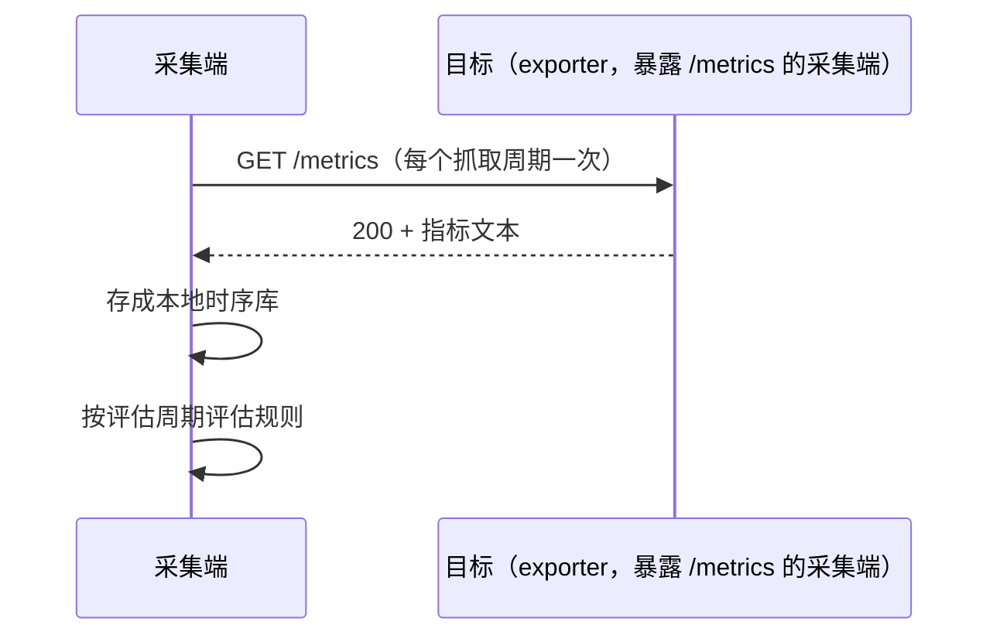
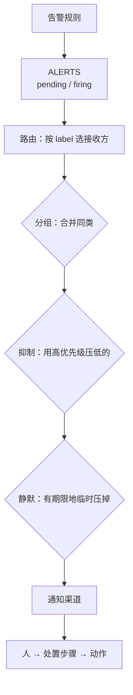

---
tags:
  - Linux
  - 可观测性
  - 监控
  - 告警
  - SLO
  - 体系
created: 2026-10-03
---

# 一次告警的一生

## 一、计量：指标从哪来、是什么类型

一次告警的起点是有人把系统里的某个量暴露成了一个可以周期读取的数字。

这种由采集端主动抓取的模式叫作 **pull（拉取）**，因为它的方向与「被监控端主动上报」相反，所以它带来三条与后者不同的性质，而这三条性质是后面每一处判定的前提：

1. **抓取成功与失败本身就被记成一条时序。** `up` 取 `1` 表示抓取成功、取 `0` 表示抓取失败，因此「监控自身是否正常」不需要额外建设。它的读法是：**`up` 取 `0` 说明采集端没能拿到这个目标的指标，而这与「业务是否正常」无关。**
2. **目标清单（service discovery，服务发现）是需要运维的对象。** 因为目标从哪里来、有没有被移除，直接决定了有没有数据，所以一旦目标消失，采集端不会报错，只会少一条时序。
3. **抓取是周期性、主动的。** 由于两次抓取之间发生的短脉冲会被漏掉，所以这段时间构成「采样盲区」，而它只能靠提高抓取频率或者改用累积量来补。

### 1.1 类型决定用法

指标只有两种基本类型，因为用错类型的表达式都会失效，所以要先分清它们：

| 类型 | 特征 | 正确用法 | 典型错误 |
| --- | --- | --- | --- |
| counter（计数器） | 它的特征是**只增不减**，但进程重启会使它归零 | 应当用速率函数读出它每秒增长多少，或者取一个窗口内的增量 | 直接读它的裸值，或者对裸值求平均、比大小，这些做法都不成立 |
| gauge（瞬时量） | 它的特征是可以升也可以降，取的是一瞬间的值 | 直接把读到的值与阈值比较 | 对它求速率，得到的变化率没有物理含义 |

判据很直接：**看这个指标会不会自己减小。** 因为累计字节数、累计秒数、累计错误数都只会增大，所以它们都是 counter；反之，因为内存可用量、文件系统剩余空间、负载、连接数、队列深度都会随环境升降，所以它们都是 gauge。

counter 有一个必须知道的细节：**速率函数内置了「归零即回绕」的感知**，因此进程重启导致的归零不会让结果出现负值。真正要留意的是两点：由于重置点附近的窗口外推会短暂失真，所以读数要避开这一段；同时，只取最后两个样本的瞬时速率函数在重置恰好落在这两点之间时会给出尖峰，或者给出明显偏低的估计。

### 1.2 按资源提问，而不是按指标名罗列

资源检查最容易漏项，因为按指标名逐条罗列时很容易整类地漏掉问题。一个稳定的覆盖办法是对每一种资源都问三类问题——**利用率（用了多少）、饱和度（在排队还是在等）、错误（有没有出错）**：

| 资源 | 利用率 | 饱和度 | 错误 |
| --- | --- | --- | --- |
| CPU | 它的利用率读按模式分的累计秒数（取速率之后看各模式的占比），以及被虚拟化占走的时间 | 它的饱和度读可运行队列长度与压力指标 | 它的错误读机器检查异常与 EDAC（Error Detection And Correction，内存纠错子系统）记录 |
| 内存 | 它的利用率读可用内存（不是「空闲内存」）与压力指标 | 它的饱和度读换入换出、缺页与 OOM（Out Of Memory，内存耗尽）计数 | 它的错误读 ECC（Error Correcting Code，纠错码）报错与 OOM 记录 |
| 磁盘 IO | 它的利用率读吞吐、设备利用率与平均等待时间 | 它的饱和度读平均队列长度与压力指标 | 它的错误读介质错误与内核 IO 错误 |
| 网络 | 它的利用率读收发字节数与带宽占比 | 它的饱和度读队列与重传，以及连接跟踪表使用率 | 它的错误读丢包与错误计数 |
| 句柄 / 连接 | 它的利用率读已分配句柄数与在用连接数 | 它的饱和度读接近上限时出现的排队与拒绝 | 它的错误读新建连接失败 |

「利用率、饱和度、错误」这个三分法里最有价值的一项是**饱和度**，因为它是「还有多少余量」的直接证据。利用率高但从不排队的系统，与利用率不高却一直排队的系统，属于两种完全不同的问题。

## 二、判定：什么条件算「出事」

### 2.1 数据模型决定了表达式的写法

一条时序由「指标名 + label 集合」唯一确定，因此可以推出三件事：

1. **label 变了就是另一条时序。** 因为每增加一个「挂载点」维度，时序数量就要乘以挂载点的个数，所以维度并不是越多越好；
2. **同一个指标名可以有完全不同的 label 组合**，所以在写查询时永远要先想清楚「我要按什么维度聚合」；
3. **样本的时间戳来自抓取时刻**，所以发生在两次抓取之间的短脉冲可能不会被记下来。

第三点直接约束了速率函数的窗口：**窗口必须至少覆盖两个抓取间隔**，因为若窗口短于两个抓取间隔，则窗口里只有一两个样本，结果会剧烈抖动甚至为空。因此窗口取「抓取间隔的若干倍」比取具体秒数更稳。

### 2.2 四类最常用的表达式

| 目的 | 形态 | 注意 |
| --- | --- | --- |
| 速率 | 它是对 counter 取一个窗口内的速率 | 因为窗口必须至少覆盖两个抓取间隔，所以窗口不能取得太短；同时它只能用于 counter |
| 比例 / 使用率 | 它先用总量减去空闲部分，再取两者的比例 | 计算时应当先按实例保留维度，然后再做聚合 |
| 聚合与分组 | 它按某个 label 求和、取平均或者取最大值 | 因为「按什么聚合」决定了输出的维度，所以这一环最容易写错 |
| 告警表达式 | 它写成比率超过阈值、或者可用性取 `0` 的条件 | 应当先算出比率再判断，因为绝对值会随流量一起变化 |

**「错误率类告警要用比率而不是绝对值」**这一条值得单独记住：因为绝对错误数在流量低谷时不会触发、在流量高峰时又会误报，所以它反映的其实是当时的流量，而不是服务的健康度。

### 2.3 判定链是三段，不是一个表达式

| 阶段 | 产物 | 作用 |
| --- | --- | --- |
| 记录规则（recording rule） | 它产出的是一条新的、预先计算好的时序 | 因为它把口径固定了下来，所以能降低查询成本，并让复杂表达式可以被复用 |
| 告警规则（alerting rule） | 它在条件成立时产生一条告警 | 它表达的是「什么算出事」这个判定 |
| 告警状态时序（`ALERTS`） | 它是一条 `alertstate` 取 `pending` 或 `firing` 的时序 | 它让「规则有没有算出来」变成可以查询的事实 |

**`ALERTS` 这条时序的存在价值需要单独强调**：因为它让「验证一条告警是否生效」不再依赖通知渠道。只要这条时序能查到，就说明规则被评估过且条件成立；反之，若它为空，则说明规则在评估但条件不成立，而**这是正确结果，不是故障**。把「规则在评估」与「条件成立」这两件事分开，是排查「告警不响」时最先要做的事。

### 2.4 `for`：用持续时间过滤毛刺

`for` 表示表达式持续为真多久之后才从 `pending` 进入 `firing`。因为它不在时间上加延迟，而是把持续时间短于该时长的告警整条滤掉，所以它**是一个过滤器**：

| `for` 取值 | 效果 | 适用 |
| --- | --- | --- |
| `0s` | 它让条件一成立就立刻触发告警 | 它只适合实验验证，或者「必须立刻知道」的硬故障 |
| 几分钟 | 它把持续时间只有一瞬间的毛刺过滤掉 | 它适合大多数资源使用率类告警（如 `df -hT` 的 `Use%`、`node_memory_MemAvailable_bytes`） |
| 十几分钟以上 | 它只把持续存在的异常报出来 | 它适合与目标值挂钩的慢速劣化 |

它和「调阈值」的区别是本质的：**调阈值降低的是灵敏度**，因为调高阈值之后连持续 90% 的高占用也被一起放过了；**加 `for` 增加的是时间维度**，因为它只过滤掉短于该时长的冲高。因此用调阈值代替加 `for`，等于把一个本来可以精细控制的问题换成了一次灵敏度整体下调。

### 2.5 规则要像代码一样被验证

规则文件的价值在于它可以在**不连接任何真实目标**的情况下被测试，因此它能在上线之前回答判定是否正确：

- **语法校验**：它检查表达式能否解析、必填字段是否齐全。因为它只看语法，所以不验「算得对不对」；
- **单元测试**：它把合成的序列喂给规则文件，并断言表达式的求值结果与告警是否触发。因为它直接跑判定逻辑，所以能在几秒内回答「CPU 占用 25% 时这条规则会不会响」，而**这是唯一能在上线前验证告警正确性的手段**。

两条配套纪律：`labels` 里必须有严重程度标签，因为若缺少这个标签，则后面的路由、抑制与通知分级都无从谈起；同时规则文件应当纳入版本管理并在合并前校验，因为一个有语法错误的规则文件会让**整组规则**加载失败。

## 三、路由与降噪：从「算出来了」到「发一条能干活的通知」

`ALERTS` 有值只是整条链路的第一段，因为告警状态的时序还要被送到告警管理组件，并依次经过路由、分组、抑制与静默，最后才轮到通知渠道。

**这条链的每一段都能独立验证**，因此排查「告警不响」的正确顺序与它一致：先看 `ALERTS` 有没有出现，再看路由会匹配到哪个接收方（这一步可以离线判定，不需要真的发出告警），然后看这条通知是否被抑制或静默，最后看渠道是否可用。因为跳过前面几段直接查渠道会漏掉真正的断点，所以那样做是最常见的低效排查。

### 3.1 分组：决定「什么算同一个故障」

分组按指定的 label 组合把多条告警合并成一次通知，因此**分组的粒度由 label 列表决定**：

| 放进分组的 label                 | 效果                      |
| --------------------------- | ----------------------- |
| 只把告警名与服务放进去 | 因为同一服务的同类告警被当成同一个故障，所以它们合并成一条通知，而不同实例也被合在一起 |
| 再把实例也放进去 | 因为每个实例各自成为一个分组，所以每个实例单独收到一条通知，因此实例多时通知数量会急剧增长 |
| 再把高基数的 label（实例名、请求 ID 之类）放进去 | 因为每个取值都各自成组，所以分组等于没有做 |

因此分组的判断标准是：**我希望哪些告警出现在同一条通知里？** 因为「哪些维度看起来相关」并不等于「它们应当被合并成一条通知」。

另有三个时间参数决定通知节奏：第一个是首次通知前的等待时间，它给同组告警留出聚合的时间；第二个是同组新增告警之后的再发间隔；第三个是告警未恢复时的重复提醒间隔。这三个参数的取舍是同一个：因为设得太短会发出过多重复通知，所以设得太长又会延迟甚至漏掉提醒。

### 3.2 抑制与静默：解决两个不同的问题

抑制与静默这两个概念最容易被混为一谈，而它们实际上作用于不同的层次：

| 手段 | 层次 | 表达什么 | 作用范围 | 有期限吗 |
| --- | --- | --- | --- | --- |
| 抑制（inhibition） | 它工作在配置层，需要事前写好 | 它表达的是一类**确定的因果关系**：某一类告警成立时，另一类就不必再报 | 它的作用范围由匹配条件与限定对象共同决定 | 它没有期限，因为它是一条规则 |
| 静默（silence） | 它工作在操作层，由人临时创建 | 它表达的是「这段时间我知道它会响，先不要发出来」 | 它的作用范围由匹配条件决定 | 它**有期限**，因为创建静默时必须填上结束时间 |

**抑制里最关键的配置是限定因果关系的作用范围**：若只按严重程度写「高优先级压掉低优先级」，则它实际变成「任何严重告警压掉任何警告」，真故障会被一起压掉。因此正确做法是把压制范围限定在同一种告警、同一个服务这样的因果关系之内。判断范围写宽了还是写窄了，看的是被压掉的那条告警是否真的由源告警引起。

**静默只影响通知，不影响告警状态。** 因为被静默的告警仍然存在，只是不再推给人。这带来两个实务要求：静默必须带上期限、原因与创建人；维护窗口结束后要复查有没有遗留的静默，因为一个没有期限或者忘了撤销的静默，等于让一条告警永久失效。

### 3.3 降噪的顺序不能反

| 顺序 | 手段 | 什么时候做 |
| --- | --- | --- |
| 1 | 第一步是分组 | 因为同一个故障天生会产生多条告警 |
| 2 | 第二步是抑制 | 因为此时存在确定的因果关系，例如对象整体不可用会导致它上面的所有指标一起异常 |
| 3 | 第三步是静默 | 它用在维护窗口与已知问题上 |
| 4 | 第四步才是调阈值或者延长 `for` | 它**必须复盘之后再改**，同时要评估由此带来的漏报风险 |

因为顺序反了会漏掉真故障，所以不能先动阈值：若一遇到短时间内的大量告警就调阈值，则等于把灵敏度整体下调，将来的真故障也会被一起过滤掉。反之，前三项都是「不改变判定逻辑」的手段，因为它们只改变通知的形态，所以它们应当先被使用。

### 3.4 可用性探测：从「指标抓得到」到「用户能用」

采集端的抓取成功与「用户能否访问」是两件事，因为抓取成功只说明指标拿得到。后者需要**黑盒探测**：探测点按协议（HTTP/TCP/ICMP/DNS）真实访问目标，并把这一次访问的结果记成指标。

| 指标 | 读法 |
| --- | --- |
| `probe_success`（探测是否成功，取 `0` 或 `1`） | 它是可用性告警的判据，所以要先看它的取值：**它取 `0` 只说明「从这个探测点到目标的这条路不通」**，因为既可能是目标挂了，也可能是路径上的网络、防火墙或证书出了问题 |
| 探测耗时 | 它是从探测点测到的访问耗时，反映的是用户视角的延迟 |
| HTTP 状态码 | 它区分「连不上」（取 `0`）与「返回了错误状态」这两种情况 |
| `probe_ssl_earliest_cert_expiry`（证书最早到期时间） | 它是证书到期告警的判据；它的单位是 Unix 秒，因此与当前时间的差就是证书的剩余有效期 |
| DNS 解析耗时 | 它用来定位解析慢导致的「偶发慢」 |

两条必须写进方案的边界：

- **探测结果是「从探测点到目标这条路径」的结论，不是「目标本身」的结论。** 因此上线前必须用真实的探测源与真实路径验证过，否则可能监控的是「探测机能到、用户到不了」这条无关的路径。
- **证书到期必须按域名分组来看。** 因为同一台机器上不同域名的最早到期时间可能相差数倍，所以一个全局阈值测不出这两种现实。

## 四、问责：把「先处理哪个」变成可算的事

### 4.1 三个定义

| 概念 | 是什么 | 回答什么问题 |
| --- | --- | --- |
| 指标（Indicator） | 它是实际测量出来的值，例如成功率、延迟分位数与可用性 | 它回答的是「现在到底怎么样」 |
| 目标（Objective） | 它是对指标设定的目标，例如「30 天滚动成功率 ≥ 99.9%」 | 它回答的是「我们希望到什么程度」 |
| 错误预算（Error Budget） | 它是 `1 - 目标` 所对应的允许额度 | 它回答的是「剩下的额度还允许消耗多久」 |

把「几个 9」换算成时间是纯算术：因为窗口长度乘以 `1 - 目标` 就是允许的不达标时长，所以可以直接算出来。以 30 天窗口为例，99% 允许约 432 分钟不达标，99.9% 允许约 43.2 分钟，99.99% 允许约 4.32 分钟，99.999% 允许约 26 秒。**因为多一个 9，允许中断的时间就少一个数量级**，所以「我们目标 99.99%」这句话必须和架构投入一起评估。

这张换算表是**算术推演，不是实测的停机时间**，因为真实的「本月已经不可用了多久」要靠指标的时序数据算出来。

### 4.2 错误预算怎么用

| 预算状态 | 动作 | 判断依据 |
| --- | --- | --- |
| 预算充足 | 此状态下可以正常发布，也可以做风险较高的变更 | 它的判据是消耗速率落在可承受的范围之内 |
| 预算接近耗尽 | 此状态下应当冻结高风险变更，优先修复稳定性 | 它的判据是消耗速率明显高于允许水平 |
| 预算已耗尽 | 此状态下只做修复与回滚 | 它的判据是预算已经为负 |

关键在于**决定「立刻处理还是排期」时看的是消耗速率与剩余额度，而不是当前值**。因为「现在仍然达标」只是静态视角；若按当前速度继续下去本月会超支，则该做的是把变更拆小或者延后，而不是照常发布。

**目标约束的是用户体验，不是机器资源的占用水平。** 因为资源被占满而用户没有受到影响时，错误预算并不消耗；反之，资源看起来正常而请求成功率下降时，预算就在被消耗。这就是错误预算必须建立在用户视角的指标上、不能用机器资源使用率代替的原因。

### 4.3 告警分层

| 层次 | 手段 | 适用 |
| --- | --- | --- |
| 预算消耗速率 | 它的手段是让短窗口与长窗口的消耗速率同时超过阈值 | 它适用于快速恶化的情况，因此要立刻处理 |
| 慢速消耗 | 它的手段是看更长窗口的消耗速率 | 它适用于长期劣化的情况，因此排期处理 |
| 基础设施资源使用率 | 它的手段是看磁盘、内存、句柄、证书与可用性这些资源的占用水平，并按影响面分级 | 它适用于有明确处置动作的确定风险 |
| 单点抖动过滤 | 它的手段是同时使用 `for`、分位数与持续窗口 | 它用来避免误报 |

**为什么要有快烧与慢烧两档（也就是短窗口与长窗口两档消耗速率）**：因为若只看瞬时错误率，则小流量时会大量误报；反之，若只看 30 天平均，则会把「今天已经烧掉一半预算」漏掉。因此多窗口、多消耗速率是业界通行的折中。

## 五、三个跨阶段的核对对象

上面按顺序讲完的是一条告警从计量到问责的四个阶段，而下面三个核对对象各自贯穿其中多个阶段，因为排障时按它们切分比从头再走一遍时间线更快。

| 核对对象 | 它贯穿哪几个阶段 | 每一处读什么字段 |
| --- | --- | --- |
| 判据链 | 它贯穿计量、判定、路由与降噪、问责这四个阶段，因为每一个阶段都要给出「上一步确实成立」的证据 | 在计量阶段读 `up` 的取值，因为取 `1` 表示抓取成功、取 `0` 表示抓取失败；在判定阶段读 `ALERTS` 的 `alertstate`，看它是 `pending` 还是 `firing`；在路由与降噪阶段读路由的匹配条件、抑制的适用范围与静默的期限；在问责阶段读错误预算的消耗速率与剩余额度。最后要核对的字段与产物是按这个顺序写成的「告警不响」逐段排查顺序 |
| 统计口径 | 它贯穿计量、判定与问责三个阶段，因为采集频率决定了窗口能取多长，判定要选定分位数的算法，而问责的目标又要用成功率或分位数来定义 | 在计量阶段读抓取间隔与 `up` 的取值，因为采样盲区就是由抓取间隔造成的；在判定阶段读窗口长度与分位数的算法；在问责阶段读目标里的成功率、分位数以及它们所用的窗口。最后要核对的字段与产物是一份写清窗口与算法的口径说明 |
| 成本与基数 | 它贯穿计量、判定与问责三个阶段，因为基数由暴露出来的 label 组合决定，判定与查询又都按这些 label 聚合，而它们的负责人要在问责这一层定下来 | 在计量阶段读暴露出来的 label 组合数与时序数量，因为时序数量按 label 取值组合相乘增长；在判定阶段读表达式的聚合维度与采集频率；在问责阶段读那三个已经定好上限与负责人的成本数字，也就是日志保留天数、指标基数上限与追踪采样率。最后要核对的字段与产物是把这三个数字与它们的负责人写在一处 |

## 常见坑

| 常见做法或说法 | 事实 |
| --- | --- |
| 「指标越多越好」 | 因为时序数量按 label 取值组合相乘增长，所以高基数 label 会让写入量、存储占用与查询耗时同时超出承受范围，而且这些历史数据难以清理 |
| 直接看 counter 的裸值判断忙不忙 | 因为裸值只是自启动以来的累计量，所以判断忙不忙要用速率函数 |
| 对 gauge 求速率 | 因为 gauge 本来就可升可降，所以对它求速率会得到一个没有物理含义的「变化速率」 |
| 速率窗口取得比抓取间隔还短 | 因为窗口里的样本太少，所以结果会抖动，甚至算不出值 |
| 告警用绝对值阈值 | 因为绝对值会随流量一起变化，所以流量变化时会误报或漏报；因此错误率类告警要先算出比率再判断 |
| 用「调高阈值」代替「加 `for`」 | 因为调阈值是把灵敏度整体下调，而加 `for` 只过滤短于该时长的冲高，所以两者不能互相代替 |
| 规则改完不校验就上线 | 因为一处语法错误会让整组规则加载失败，所以规则改完必须先校验再上线 |
| 只用语法校验 | 因为语法通过不等于算得对，所以还需要用合成序列做单元测试 |
| 用「通知收到没」判断告警是否工作 | 因为通知链路上还有路由、分组、抑制与静默这几段，所以判断告警是否工作要先看告警状态时序 |
| `ALERTS` 为空就认为坏了 | 它为空说明规则在评估但条件不成立，而这是正确结果，不是故障 |
| 分组里放高基数 label | 因为每个取值都会各自成组，所以这样做等于没有分组 |
| 抑制不写「限定对象」 | 因为压制范围没有限定，所以它会变成「任何严重告警压掉任何警告」，真故障会被一起压掉 |
| 用静默「永久解决」噪声 | 因为静默有期限、到期就会恢复，所以它不能永久解决噪声；真正需要处理的是规则本身的问题，要靠修规则并复盘来解决 |
| 认为抓取成功就等于服务可用 | 抓取成功只说明指标拿得到，因此判断用户视角的可用性要靠黑盒探测 |
| 证书告警只在到期前一天配 | 因为续期与验证都需要时间，所以证书告警通常要提前两周到一个月配置，而不是等到期前一天 |
| 用平均值定义目标 | 因为平均值会掩盖长尾，所以目标要用成功率或分位数来定义，并写清窗口与口径 |
| 把目标当考核指标 | 因为把它当考核指标会让团队隐藏问题、压低目标，所以它只能当决策工具 |
| 只配阈值告警不配消耗速率告警 | 因为只配阈值告警会在小流量时误报、在大故障时漏报，所以还要配消耗速率告警 |

## 要点自测

**问：pull 模型和「被监控端主动上报」有什么本质区别？**
答：在 pull 模型下，抓取成功与失败本身就被记成一条时序，所以「监控链路是否正常」不需要额外建设；同时目标清单是一个需要运维的对象，因为目标消失时不会报错，只会少一条时序。另外由于抓取是周期性的，短脉冲必然被漏掉，这就是分位数与累积量存在的理由之一。

**问：counter 和 gauge 该怎么用？判据是什么？**
答：判据是「这个指标会不会自己减小」：因为 counter 只增不减，所以要用速率函数或增量函数来读；反之，因为 gauge 可升可降，所以直接读它的值与阈值比较。若对 counter 求平均、或者对 gauge 求速率，则得到的数字都没有物理含义。

**问：怎么在不依赖通知渠道的情况下验证一条告警规则？**
答：第一步做语法校验，确认表达式能够解析；第二步用合成序列做单元测试，断言「在这组输入下它会不会触发」；第三步看告警状态时序，因为一旦 `firing` 出现，就说明规则被评估且条件成立。只有这三步都做过之后，才去查告警管理组件的路由、分组、抑制与静默。

**问：`for` 和调阈值有什么本质区别？**
答：因为 `for` 增加的是时间维度，它只过滤掉短于该时长的冲高，所以灵敏度不变；反之，因为调阈值降低的是灵敏度，所以它会把「持续的高负载」也一起放过。因此毛刺问题应该先加 `for`，而不是先调阈值。

**问：分组、抑制、静默分别在解决什么问题，顺序为什么不能反？**
答：分组把同一个故障产生的多条告警合并成一条通知，它配在配置层；抑制在存在确定因果关系时用高优先级压掉低优先级，它也配在配置层；静默则是在操作层临时创建的、有期限的压制。因为这三项都不改变判定逻辑，所以应当先用它们；而调阈值会降低灵敏度，所以必须复盘之后再改。

**问：抓取成功和用户可用有什么区别？**
答：抓取成功只说明采集端拿到了目标的指标，因此它不等于用户可用。用户视角的可用性要靠黑盒探测得到，而探测结论是「从探测点到目标这条路径」的结论，所以上线前必须用真实的探测源验证。

**问：错误预算怎么用来决定「立刻处理还是排期」？**
答：判据是消耗速率与剩余额度，而不是当前值：因为短窗口的消耗速率极大说明正在快速变坏，所以要立刻处理；反之，长窗口缓慢消耗说明是长期劣化，所以排期处理。由于目标约束的是用户体验，所以指标必须用成功率和分位数，不能用机器资源使用率代替。

**第一反应不要做什么**：不要为了让维度更全面就往 label 里塞高基数字段，因为时序数量会按 label 取值组合相乘增长；不要对 counter 求平均，因为裸值只是累计量；不要在短时间内收到大量告警时就先改阈值，因为那会把灵敏度整体下调；不要用「通知没收到」判断告警是否工作，因为通知链路上还有路由、分组、抑制与静默；不要把分组当成「把所有 label 都放进去」，因为高基数 label 会让每个取值各自成组；不要把目标当成考核指标，因为它只是决策工具。

## 参考文档

- Prometheus 官方文档的「Data model」「Metric types」「Querying basics」「Alerting rules」「Recording rules」「Storage」：时序模型、类型约定、规则语法与保留策略。
- Prometheus 的 `promtool` 文档：`check rules` 与 `test rules` 的语义差别。
- Alertmanager 官方文档的「Configuration」「Routing tree」「Inhibition」「Silences」：路由、分组、抑制、静默的字段与匹配语义。
- `blackbox_exporter` 的「Configuration」「Metrics」：探测模块与 `probe_*` 指标的语义。
- Google SRE Book 的「Service Level Objectives」「Embracing Risk」；SRE Workbook 的「Alerting on SLOs」：目标设定、错误预算与多窗口多消耗速率告警。
- `man 5 proc_pid_pressure`、`man 1 vmstat`、`man 8 ss`：与指标对应的本机观测入口。
