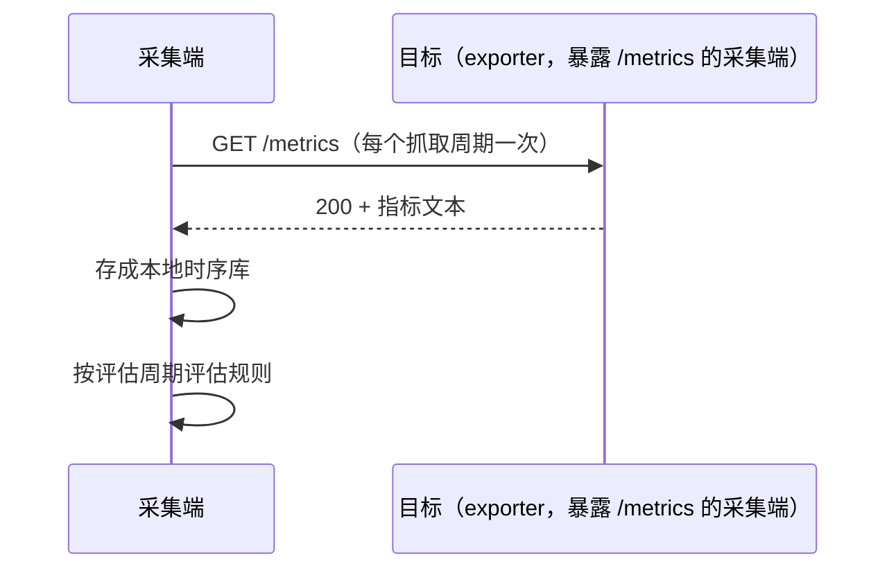
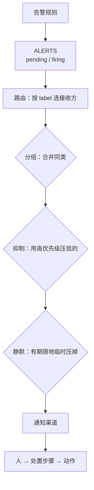

---
tags:
  - Linux
  - 可观测性
  - 监控
  - 告警
  - SLO
  - 体系
created: 2026-10-03
---

# 一次告警的一生

## 一、计量：指标从哪来、是什么类型

一次告警的起点是「有人暴露了一个数字」。

这种「采集端主动抓取」的模式叫 **pull（拉取）**，它带来三个与「被监控端主动上报」不同的性质，也是理解后面所有内容的前提：

1. **抓得到抓不到本身就是数据。** 抓取结果被记成一条时序（成功为 1、失败为 0），所以「监控自己是否正常」这件事不需要额外建设。它的读法是：**它是 0 说明采集端没能拿到这个目标的指标，与「业务是否正常」无关。**
2. **目标清单（service discovery）是运维对象。** 目标从哪来、有没有被移除，直接决定有没有数据；目标消失时不会有报错，只会少一条时序。
3. **抓取是周期性、主动的。** 所以两次抓取之间的短脉冲会被漏掉——这是「采样盲区」，只能靠提高频率或用累积量补。

### 1.1 类型决定用法

指标只有两种基本类型，用错的话后面所有表达式都会失效：

| 类型 | 特征 | 正确用法 | 典型错误 |
| --- | --- | --- | --- |
| counter（计数器） | **只增不减**；进程重启会归零 | 用速率函数看「每秒增长多少」，或看窗口内的增量 | 直接读裸值、对裸值求平均或比大小 |
| gauge（瞬时量） | 可升可降的瞬时值 | 直接读值与阈值比较 | 对它求速率 |

判据很直接：**看它会不会自己减小。** 累计字节数、累计秒数、累计错误数都是 counter；内存可用量、文件系统剩余空间、负载、连接数、队列深度都是 gauge。

counter 有一个必须知道的细节：**速率函数内置了「归零即回绕」的感知**，所以进程重启导致的归零不会产生负值。真正要留意的是两点：重置点附近的窗口外推会短暂失真；只取最后两个样本的瞬时速率函数在重置恰好落在这两点之间时会给出尖峰或低估。

### 1.2 按资源提问，而不是按指标名罗列

资源检查最容易漏项。一个稳定的覆盖办法是按三类问题问每一种资源——**利用率（用了多少）、饱和度（在排队还是在等）、错误（有没有出错）**：

| 资源 | 利用率 | 饱和度 | 错误 |
| --- | --- | --- | --- |
| CPU | 按模式分的累计秒数（取速率后看比例）、被虚拟化占走的时间 | 可运行队列长度、压力指标 | 机器检查异常、EDAC（Error Detection And Correction，内存纠错子系统）记录 |
| 内存 | 可用内存（不是「空闲内存」）、压力指标 | 换入换出、缺页、OOM（Out Of Memory，内存耗尽）计数 | ECC（Error Correcting Code，纠错码）报错、OOM 记录 |
| 磁盘 IO | 吞吐与利用率、平均等待时间 | 平均队列长度、压力指标 | 介质错误、内核 IO 错误 |
| 网络 | 收发字节数、带宽占比 | 队列与重传、连接跟踪表使用率 | 丢包与错误计数 |
| 句柄 / 连接 | 已分配句柄数、在用连接数 | 接近上限时的排队与拒绝 | 新建连接失败 |

「利用率、饱和度、错误」这个三分法最有价值的地方在**饱和度**：它才是「还有多少余量」的直接证据。利用率高但从不排队，与利用率不高却一直排队，是两种完全不同的问题。

## 二、判定：什么条件算「出事」

### 2.1 数据模型决定了表达式的写法

一条时序由「指标名 + label 集合」唯一确定。三条推论：

1. **label 变了就是另一条时序。** 加一个「挂载点」维度，时序数量就乘以挂载点个数；
2. **同一个指标名可以有完全不同的 label 组合**，所以写查询时永远先想「我要按什么维度聚合」；
3. **样本的时间戳来自抓取时刻**，所以短脉冲可能落在两次抓取之间。

第三点直接约束了速率函数的窗口：**窗口必须至少覆盖两个抓取间隔**，否则窗口里只有一两个样本，结果会剧烈抖动甚至为空。窗口取「抓取间隔的若干倍」比取具体秒数更稳。

### 2.2 四类最常用的表达式

| 目的 | 形态 | 注意 |
| --- | --- | --- |
| 速率 | 对 counter 取窗口速率 | 窗口 ≥ 两个抓取间隔；只能用于 counter |
| 比例 / 使用率 | 用总量减去空闲部分再取比例 | 先按实例保留维度，再聚合 |
| 聚合与分组 | 按某个 label 求和、取平均或取最大 | 「按什么聚合」决定输出的维度，是最容易写错的一环 |
| 告警表达式 | 比率超阈值、可用性为 0 | 先算比率再判断，避免绝对值受流量影响 |

**「错误率类告警要用比率而不是绝对值」**这一条值得单独记住：绝对错误数在流量低谷时不会触发、在高峰时会误报，而它反映的其实是流量而不是健康度。

### 2.3 判定链是三段，不是一个表达式

| 阶段 | 产物 | 作用 |
| --- | --- | --- |
| 记录规则（recording rule） | 一条新的、预计算好的时序 | 固化口径、降低查询成本；让复杂表达式可以被复用 |
| 告警规则（alerting rule） | 条件成立时产生告警 | 表达「什么算出事」 |
| 告警状态时序（`ALERTS`） | `alertstate` 为 `pending`/`firing` 的时序 | 让「规则算出来了吗」变成可查询的事实 |

**`ALERTS` 这条时序的存在价值需要单独强调**：它让「验证一条告警是否生效」不再依赖通知渠道。只要它能查到，就说明规则被评估且条件成立；它为空，就说明规则在评估但条件不成立（**这是正确结果，不是故障**）。把「规则在评估」与「条件成立」分开，是排查「告警不响」时最先要做的事。

### 2.4 `for`：用持续时间过滤毛刺

`for` 表示「表达式持续为真多久之后才从 `pending` 进入 `firing`」。它不是延迟，而是**一个过滤器**：

| `for` 取值 | 效果 | 适用 |
| --- | --- | --- |
| `0s` | 立刻触发 | 只适合实验验证，或「必须立刻知道」的硬故障 |
| 几分钟 | 过滤瞬时毛刺 | 大多数水位类告警 |
| 十几分钟以上 | 只报持续性问题 | 与目标值挂钩的慢速劣化 |

它和「调阈值」的区别是本质的：**调阈值降低的是灵敏度**（把「持续 90%」也一起放过），**加 `for` 增加的是时间维度**（只过滤掉短于该时长的冲高）。用调阈值代替加 `for`，是把一个可以精细控制的问题变成了一次灵敏度整体下调。

### 2.5 规则要像代码一样被验证

规则文件的价值在于它可以在**不连接任何真实目标**的情况下被测试：

- **语法校验**：检查表达式能否解析、必填字段是否齐全。它只验语法，不验「算得对不对」；
- **单元测试**：用合成的序列喂给规则文件，断言表达式求值结果与告警是否触发。它能在几秒内回答「CPU 占用 25% 时这条规则会不会响」——**这是唯一能在上线前验证告警正确性的手段**。

两条配套纪律：`labels` 里必须有严重程度标签，否则后面的路由、抑制、通知分级都无从谈起；规则文件应当纳入版本管理并在合并前校验——一个有语法错误的规则文件会让**整组规则**加载失败。

## 三、路由与降噪：从「算出来了」到「发一条能干活的通知」

`ALERTS` 有值只是链路的第一段。告警状态的时序会被送到告警管理组件，在那里经过路由、分组、抑制、静默，最后才轮到通知渠道。

**这条链的每一段都能独立验证**，这也是排查「告警不响」的正确顺序：`ALERTS` 有没有 → 路由会匹配到哪个接收方（可以离线判定，不需要真的发告警）→ 是否被抑制或静默 → 渠道是否可用。跳过前面几段直接查渠道，是最常见的低效排查。

### 3.1 分组：决定「什么算同一个故障」

分组按指定的 label 组合把多条告警合并成一次通知。**分组的粒度由 label 列表决定**：

| 放进分组的 label                 | 效果                      |
| --------------------------- | ----------------------- |
| 告警名 + 服务                    | 同一服务的同类告警合并成一条，不同实例合在一起 |
| 再加上实例                       | 每个实例单独一条——实例多时通知量会爆炸    |
| 再加上高基数的 label（实例名、请求 ID 之类） | 每个取值各自成组，**分组等于没做**     |

所以分组的判断标准是：**我希望哪些告警出现在同一条通知里？** 而不是「哪些维度看起来相关」。

另有三个时间参数决定通知节奏：首次通知前的等待（给同组告警留出聚合时间）、同组新增告警后的再发间隔、未恢复时的重复提醒间隔。它们的取舍是同一个：设太短会造成轰炸，设太长会延迟或漏掉提醒。

### 3.2 抑制与静默：解决两个不同的问题

这两个概念最容易被混为一谈，实际上它们作用于不同层次：

| 手段 | 层次 | 表达什么 | 作用范围 | 有期限吗 |
| --- | --- | --- | --- | --- |
| 抑制（inhibition） | 配置层，事前写好 | **确定的因果关系**：某一类告警成立时，另一类别报了 | 由匹配条件与「限定对象」共同决定 | 无——它是规则 |
| 静默（silence） | 操作层，临时创建 | 「这段时间我知道会响，先别发」 | 由匹配条件决定 | **有**——必须带期限 |

**抑制里最关键的配置是「限定对象」**：如果只写「高优先级压掉低优先级」，就变成了「任何严重告警压掉任何警告」，真故障会被一起压掉。正确做法是限定因果关系的作用范围（例如「同一种告警、同一个服务」）。判断写宽了还是写窄了，看的是「被压掉的那条，是不是真的由源告警引起」。

**静默只影响通知，不影响告警状态。** 被静默的告警仍然存在，只是不再推给人。这带来两个实务要求：静默必须带期限、原因与创建人；维护窗口结束后要复查有没有遗留的静默——一个没有期限或忘了撤销的静默，等于一条永久失效的告警。

### 3.3 降噪的顺序不能反

| 顺序 | 手段 | 什么时候做 |
| --- | --- | --- |
| 1 | 分组 | 同一故障天生会产生多条告警时 |
| 2 | 抑制 | 存在确定的因果关系时（例如对象整体不可用导致其上的所有指标异常） |
| 3 | 静默 | 维护窗口、已知问题 |
| 4 | 调阈值 / 延长 `for` | **必须复盘后再做**，且要评估漏报风险 |

顺序反了会漏掉真故障：一遇风暴就调阈值，等于把灵敏度整体下调，将来的真故障也一起被过滤掉。而前三项都是「不改变判定逻辑」的手段——它们只改变通知的形态，这也是它们应该先被使用的原因。

### 3.4 可用性探测：从「指标抓得到」到「用户能用」

采集端的抓取成功与「用户能否访问」是两件事。后者需要**黑盒探测**：从探测点按协议（HTTP/TCP/ICMP/DNS）真实访问目标，并把结果记成指标。

| 指标 | 读法 |
| --- | --- |
| 探测是否成功（0/1） | 可用性告警的判据。**它是 0 只说明「从这个探测点到目标这条路不通」**，可能是目标挂了，也可能是路径上的网络、防火墙或证书问题 |
| 探测耗时 | 用户视角的延迟 |
| HTTP 状态码 | 区分「连不上」（0）与「返回了错误状态」 |
| 证书最早到期时间 | 证书到期告警的判据；它是 Unix 秒，与当前时间的差就是剩余有效期 |
| DNS 解析耗时 | 解析慢导致的「偶发慢」 |

两条必须写进方案的边界：

- **探测结果是「路径」的结论，不是「目标」的结论。** 上线前必须用真实的探测源与真实路径验证过，否则可能监控的是「探测机能到、用户到不了」这条无关路径。
- **证书到期必须按域名分组看。** 同一台机器上不同域名的最早到期时间可能相差数倍，一个全局阈值测不出两种现实。

## 四、问责：把「先处理哪个」变成可算的事

### 4.1 三个定义

| 概念 | 是什么 | 回答什么问题 |
| --- | --- | --- |
| 指标（Indicator） | 实际测量值：成功率、延迟分位数、可用性 | 现在到底怎么样 |
| 目标（Objective） | 对指标设的目标，例如「30 天滚动成功率 ≥ 99.9%」 | 我们希望到什么程度 |
| 错误预算（Error Budget） | `1 - 目标` 对应的允许额度 | 还能折腾多久 |

「几个 9」换算成时间是纯算术：把窗口长度乘以 `1 - 目标`。以 30 天窗口为例，99% 允许约 432 分钟不达标，99.9% 约 43.2 分钟，99.99% 约 4.32 分钟，99.999% 约 26 秒。**多一个 9，允许中断时间就少一个数量级**——所以「我们目标 99.99%」这句话必须和架构投入一起评估。

这张换算表是**算术推演，不是实测的停机时间**。真实「本月已经不可用了多久」要靠指标的时序数据算。

### 4.2 错误预算怎么用

| 预算状态 | 动作 | 判断依据 |
| --- | --- | --- |
| 充足 | 正常发布，可以做风险较高的变更 | 消耗速率在可承受范围 |
| 接近耗尽 | 冻结高风险变更，优先修稳定性 | 消耗速率明显高于允许水平 |
| 已耗尽 | 只做修复与回滚 | 预算为负 |

关键在于**决定「立刻处理还是排期」时看的是消耗速率与剩余额度，而不是当前值**。「现在仍然达标」是静态视角；如果按当前速度下去本月会超支，那么该做的是拆小变更或延后，而不是照常发布。

**目标约束的是用户体验，不是机器水位。** 资源打满但用户没受影响，不消耗错误预算；资源看起来正常但请求成功率下降，就在消耗预算。这就是为什么错误预算必须建立在用户视角的指标上，而不能用机器水位代替。

### 4.3 告警分层

| 层次 | 手段 | 适用 |
| --- | --- | --- |
| 预算消耗速率 | 短窗口与长窗口同时超阈值 | 快速恶化：立刻处理 |
| 慢速消耗 | 更长窗口的消耗速率 | 长期劣化：排期处理 |
| 基础设施水位 | 磁盘、内存、句柄、证书、可用性，按影响面分级 | 有明确处置动作的确定风险 |
| 单点抖动过滤 | `for` + 分位数 + 持续窗口 | 避免误报 |

**为什么要有「快烧」和「慢烧」两档**：只看瞬时错误率会在小流量时疯狂误报，只看 30 天平均又会把「今天已经烧掉一半预算」漏掉。多窗口、多消耗速率是业界通行的折中。

## 五、三条横切线

| 横切线 | 贯穿内容 | 收口于 |
| --- | --- | --- |
| 判据链 | 抓取成功 → 规则评估 → 条件成立 → 通知送达，四段各自的证据 | 「告警不响」的逐段排查顺序 |
| 口径线 | 平均与分位数、分位数的多种算法、全局分位数要合并直方图、采样盲区 | 一份写清窗口与算法的口径说明 |
| 成本线 | 基数（label 组合数）与采集频率 | 三个数字与负责人 |

## 常见坑

| 常见做法或说法 | 事实 |
| --- | --- |
| 「指标越多越好」 | 时序数量按 label 取值组合相乘增长；高基数 label 让写入、存储、查询一起崩塌，且历史数据难以清理 |
| 直接看 counter 的裸值判断忙不忙 | 裸值只是累计量；要用速率函数 |
| 对 gauge 求速率 | 会得到没有物理含义的「变化速率」 |
| 速率窗口取得比抓取间隔还短 | 窗口里样本太少，结果抖动或为空 |
| 告警用绝对值阈值 | 流量变化时误报或漏报；错误率类告警要先算比率 |
| 用「调高阈值」代替「加 `for`」 | 调阈值是整体降低灵敏度，加 `for` 只过滤短于该时长的冲高 |
| 规则改完不校验就上线 | 语法错误会让整组规则加载失败 |
| 只用语法校验 | 语法通过不等于算得对；需要用合成序列做单元测试 |
| 用「通知收到没」判断告警是否工作 | 通知链路上还有路由、分组、抑制、静默；先看告警状态时序 |
| `ALERTS` 为空就认为坏了 | 那说明规则在评估但条件不成立，是正确结果 |
| 分组里放高基数 label | 每个取值各自成组，分组等于没做 |
| 抑制不写「限定对象」 | 变成「任何严重告警压掉任何警告」，真故障被一起压掉 |
| 用静默「永久解决」噪声 | 静默有期限，到期会恢复；真正的噪声要靠修规则并复盘 |
| 认为抓取成功就等于服务可用 | 抓取成功只说明指标拿得到；用户视角可用性要靠黑盒探测 |
| 证书告警只在到期前一天配 | 续期与验证需要时间；通常提前两周到一个月 |
| 用平均值定义目标 | 平均值掩盖长尾；目标要用成功率或分位数，并写清窗口与口径 |
| 把目标当考核指标 | 会让团队隐藏问题、压低目标；它是决策工具 |
| 只配阈值告警不配消耗速率告警 | 小流量时误报、大故障时漏报 |

## 要点自测

**问：pull 模型和「被监控端主动上报」有什么本质区别？**
答：pull 模型下抓取成功与否本身就是一条数据，所以「监控链路是否正常」不需要额外建设；目标清单是一个需要运维的对象，目标消失时不会报错、只会少一条时序。另外周期性抓取必然漏掉短脉冲，这是分位数与累积量存在的理由之一。

**问：counter 和 gauge 该怎么用？判据是什么？**
答：判据是「它会不会自己减小」——只增不减的是 counter，用速率或增量函数；可升可降的是 gauge，直接读值与阈值比较。对 counter 求平均、对 gauge 求速率，得到的数字都没有物理含义。

**问：怎么在不依赖通知渠道的情况下验证一条告警规则？**
答：三步——语法校验确认表达式能解析；用合成序列做单元测试断言「在此输入下会不会触发」；再看告警状态时序，`firing` 出现即说明规则被评估且条件成立。最后才查告警管理组件的路由、分组、抑制与静默。

**问：`for` 和调阈值有什么本质区别？**
答：`for` 增加的是时间维度，只过滤掉短于该时长的冲高，灵敏度不变；调阈值降低的是灵敏度，会把「持续的高负载」也一起放过。所以毛刺问题应该先加 `for`，而不是调阈值。

**问：分组、抑制、静默分别在解决什么问题，顺序为什么不能反？**
答：分组把同一故障产生的多条告警合并成一条通知（配置层）；抑制在存在确定因果关系时用高优先级压掉低优先级（配置层）；静默是有期限的临时压制（操作层）。前三项都不改变判定逻辑，所以应当先用；调阈值会降低灵敏度，必须复盘后做。

**问：抓取成功和用户可用有什么区别？**
答：抓取成功只说明采集端拿到了目标的指标。用户视角的可用性要靠黑盒探测，而探测结论是「从探测点到目标这条路径」的结论，上线前必须用真实探测源验证。

**问：错误预算怎么用来决定「立刻处理还是排期」？**
答：看消耗速率与剩余额度，而不是当前值。快烧（短窗口消耗巨大）立刻处理；慢烧（长窗口缓慢消耗）排期。目标约束的是用户体验，所以指标必须用成功率和分位数，不能用机器水位代替。

**第一反应不要做什么**：不要为了维度更全面往 label 里塞高基数字段；不要对 counter 求平均；不要在告警风暴时先改阈值；不要用「通知没收到」判断告警是否工作；不要把分组当成「把所有 label 都放进去」；不要把目标当成考核指标。

## 参考文档

- Prometheus 官方文档的「Data model」「Metric types」「Querying basics」「Alerting rules」「Recording rules」「Storage」：时序模型、类型约定、规则语法与保留策略。
- Prometheus 的 `promtool` 文档：`check rules` 与 `test rules` 的语义差别。
- Alertmanager 官方文档的「Configuration」「Routing tree」「Inhibition」「Silences」：路由、分组、抑制、静默的字段与匹配语义。
- `blackbox_exporter` 的「Configuration」「Metrics」：探测模块与 `probe_*` 指标的语义。
- Google SRE Book 的「Service Level Objectives」「Embracing Risk」；SRE Workbook 的「Alerting on SLOs」：目标设定、错误预算与多窗口多消耗速率告警。
- `man 5 proc_pid_pressure`、`man 1 vmstat`、`man 8 ss`：与指标对应的本机观测入口。

